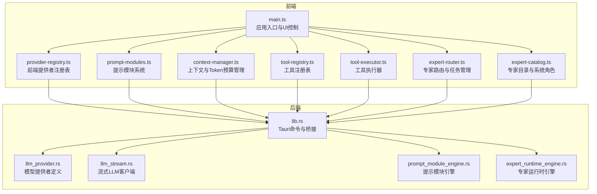
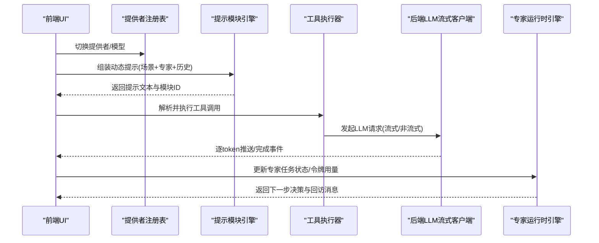
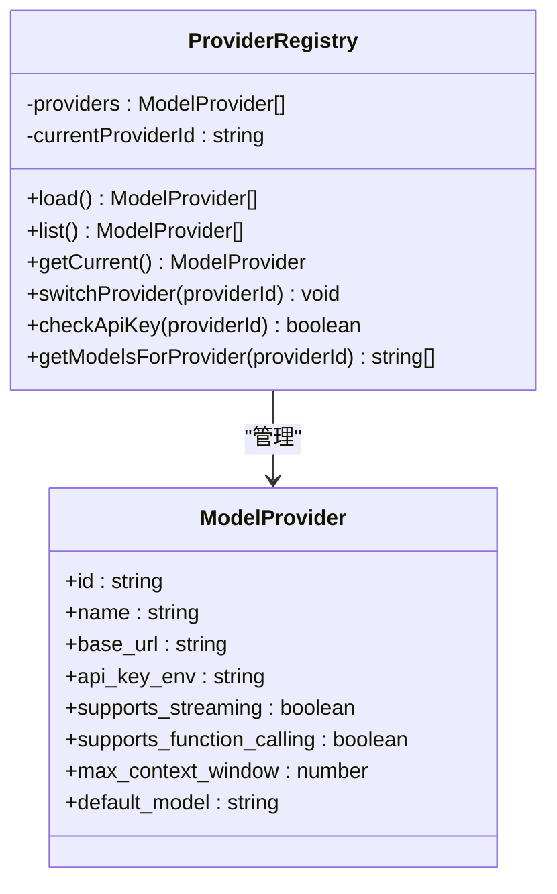
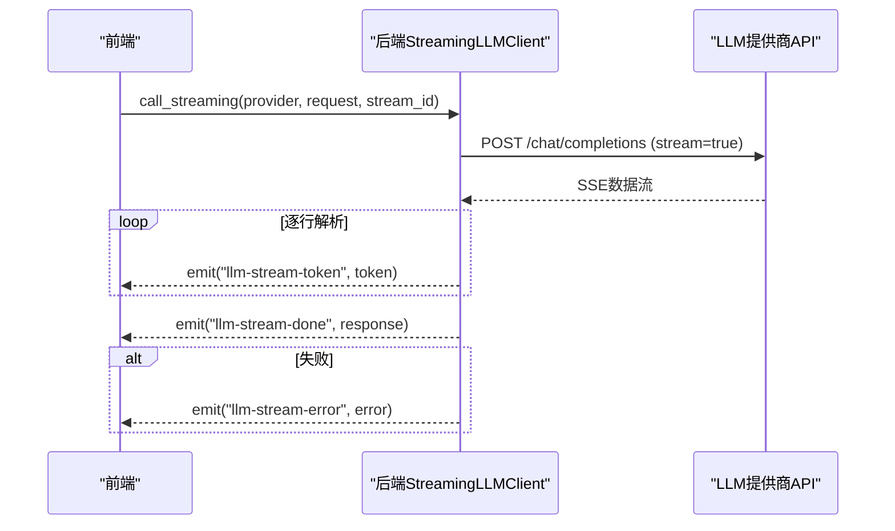
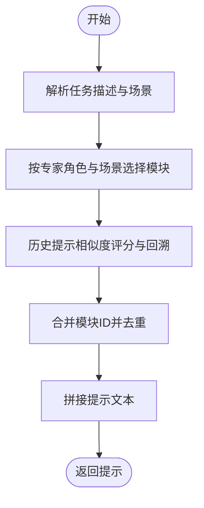
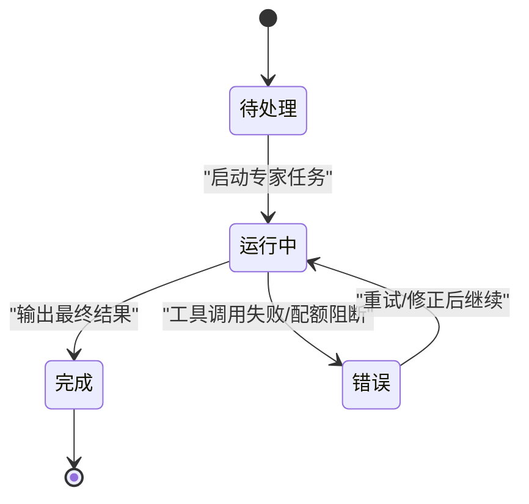
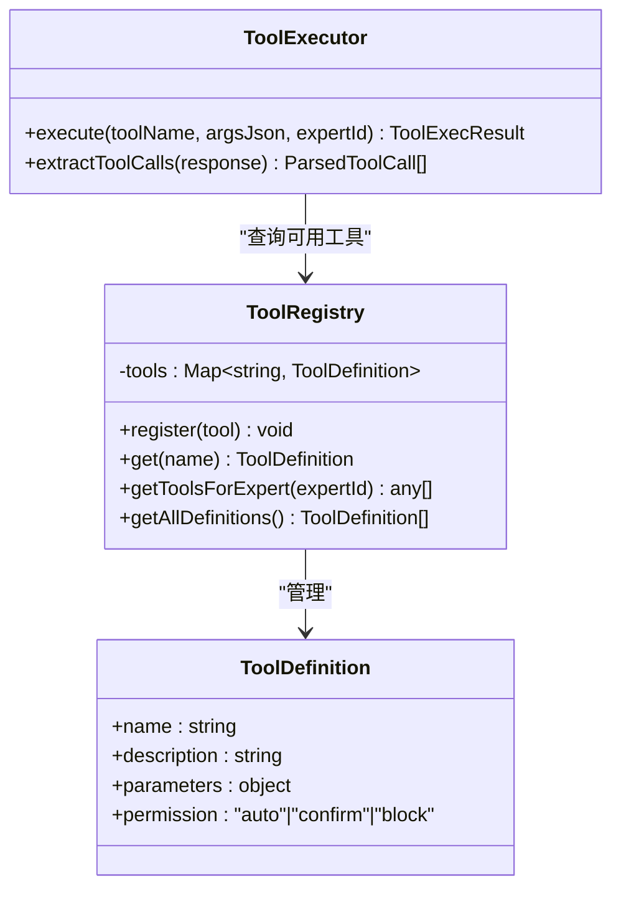
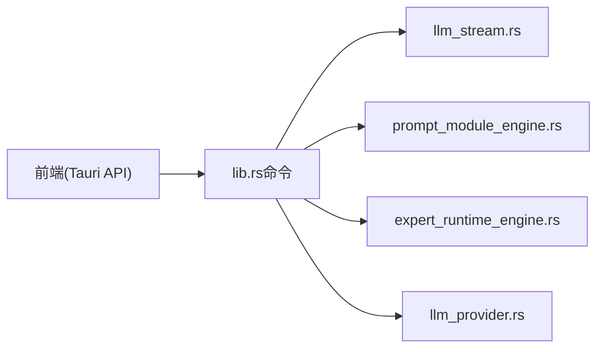

# AI集成模块

<cite>
**本文档引用的文件**
- [main.ts](file://ai-experts/src/main.ts)
- [provider-registry.ts](file://ai-experts/src/provider-registry.ts)
- [prompt-modules.ts](file://ai-experts/src/prompt-modules.ts)
- [context-manager.ts](file://ai-experts/src/context-manager.ts)
- [expert-router.ts](file://ai-experts/src/expert-router.ts)
- [llm_provider.rs](file://ai-experts/src-tauri/src/llm_provider.rs)
- [llm_stream.rs](file://ai-experts/src-tauri/src/llm_stream.rs)
- [expert_runtime_engine.rs](file://ai-experts/src-tauri/src/expert_runtime_engine.rs)
- [prompt_module_engine.rs](file://ai-experts/src-tauri/src/prompt_module_engine.rs)
- [lib.rs](file://ai-experts/src-tauri/src/lib.rs)
- [Cargo.toml](file://ai-experts/src-tauri/Cargo.toml)
- [tool-registry.ts](file://ai-experts/src/tool-registry.ts)
- [tool-executor.ts](file://ai-experts/src/tool-executor.ts)
- [expert-catalog.ts](file://ai-experts/src/expert-catalog.ts)
</cite>

## 目录
1. [简介](#简介)
2. [项目结构](#项目结构)
3. [核心组件](#核心组件)
4. [架构概览](#架构概览)
5. [详细组件分析](#详细组件分析)
6. [依赖分析](#依赖分析)
7. [性能考量](#性能考量)
8. [故障排除指南](#故障排除指南)
9. [结论](#结论)
10. [附录](#附录)

## 简介
本文件为星图专家团工作台的AI集成模块技术文档，聚焦LLM提供者集成、提示模块系统与专家运行时引擎三大核心。文档系统阐述模型抽象接口、多模型支持与流式响应处理的实现原理；详解提示模板管理、动态提示生成与上下文注入机制的设计；深入解析专家执行流程、状态管理与错误恢复机制；并提供扩展接口、自定义模型接入与性能优化策略，以及配置选项、模型切换与监控方案的实际案例与最佳实践。

## 项目结构
AI集成模块采用前后端分离架构：
- 前端（TypeScript）：负责用户界面、密钥池与模型提供者管理、提示模块组装、工具注册与执行、上下文管理与状态流转。
- 后端（Rust）：负责LLM提供者注册与调用、流式响应处理、专家运行时引擎、提示模块引擎、令牌用量追踪与配额控制、Tauri命令桥接。

**图表来源**
- [main.ts:1-8673](file://ai-experts/src/main.ts#L1-L8673)
- [provider-registry.ts:1-111](file://ai-experts/src/provider-registry.ts#L1-L111)
- [prompt-modules.ts:1-775](file://ai-experts/src/prompt-modules.ts#L1-L775)
- [context-manager.ts:1-276](file://ai-experts/src/context-manager.ts#L1-L276)
- [tool-registry.ts:1-192](file://ai-experts/src/tool-registry.ts#L1-L192)
- [tool-executor.ts:1-231](file://ai-experts/src/tool-executor.ts#L1-L231)
- [expert-router.ts:1-1633](file://ai-experts/src/expert-router.ts#L1-L1633)
- [expert-catalog.ts:1-657](file://ai-experts/src/expert-catalog.ts#L1-L657)
- [lib.rs:1-7190](file://ai-experts/src-tauri/src/lib.rs#L1-L7190)
- [llm_provider.rs:1-198](file://ai-experts/src-tauri/src/llm_provider.rs#L1-L198)
- [llm_stream.rs:1-504](file://ai-experts/src-tauri/src/llm_stream.rs#L1-L504)
- [prompt_module_engine.rs:1-720](file://ai-experts/src-tauri/src/prompt_module_engine.rs#L1-L720)
- [expert_runtime_engine.rs:1-175](file://ai-experts/src-tauri/src/expert_runtime_engine.rs#L1-L175)

**章节来源**
- [main.ts:1-8673](file://ai-experts/src/main.ts#L1-L8673)
- [lib.rs:1-7190](file://ai-experts/src-tauri/src/lib.rs#L1-L7190)

## 核心组件
- 模型提供者注册与管理：前端提供者注册表与后端提供者定义，支持多厂商与本地模型，统一模型抽象接口。
- 提示模块系统：动态提示生成、模块化注入与历史提示回溯，支持按专家角色与场景智能选择模块。
- 专家运行时引擎：专家任务状态管理、工具提醒与回访消息构建、令牌用量追踪与配额控制。
- 工具系统：工具Schema动态注入、前后端桥接与审批流程、错误反馈与重试机制。
- 上下文管理：Token预算估算、自动压缩与片段化上下文构建，保障长对话与多专家协作的稳定性。

**章节来源**
- [provider-registry.ts:1-111](file://ai-experts/src/provider-registry.ts#L1-L111)
- [llm_provider.rs:1-198](file://ai-experts/src-tauri/src/llm_provider.rs#L1-L198)
- [prompt-modules.ts:1-775](file://ai-experts/src/prompt-modules.ts#L1-L775)
- [prompt_module_engine.rs:1-720](file://ai-experts/src-tauri/src/prompt_module_engine.rs#L1-L720)
- [expert-runtime-engine.rs:1-175](file://ai-experts/src-tauri/src/expert_runtime_engine.rs#L1-L175)
- [tool-registry.ts:1-192](file://ai-experts/src/tool-registry.ts#L1-L192)
- [tool-executor.ts:1-231](file://ai-experts/src/tool-executor.ts#L1-L231)
- [context-manager.ts:1-276](file://ai-experts/src/context-manager.ts#L1-L276)

## 架构概览
AI集成模块通过Tauri命令桥接前后端，形成“前端提示组装 + 后端LLM调用 + 专家运行时编排”的闭环。前端负责用户交互与上下文管理，后端负责模型抽象、流式响应与专家状态编排。

**图表来源**
- [provider-registry.ts:1-111](file://ai-experts/src/provider-registry.ts#L1-L111)
- [prompt-modules.ts:1-775](file://ai-experts/src/prompt-modules.ts#L1-L775)
- [tool-executor.ts:1-231](file://ai-experts/src/tool-executor.ts#L1-L231)
- [llm_stream.rs:1-504](file://ai-experts/src-tauri/src/llm_stream.rs#L1-L504)
- [expert_runtime_engine.rs:1-175](file://ai-experts/src-tauri/src/expert_runtime_engine.rs#L1-L175)

## 详细组件分析

### 模型提供者集成与多模型支持
- 前端提供者注册表：加载后端提供者列表，支持切换当前提供者、检查API Key、获取模型列表与默认模型。
- 后端提供者定义：统一模型提供者结构，内置多家厂商与本地模型，支持流式与函数调用能力标识。
- 密钥池与模型解析：前端密钥池支持预设与中转密钥，解析专家绑定的模型与端点，按模态能力筛选密钥。

**图表来源**
- [provider-registry.ts:1-111](file://ai-experts/src/provider-registry.ts#L1-L111)
- [llm_provider.rs:1-198](file://ai-experts/src-tauri/src/llm_provider.rs#L1-L198)

**章节来源**
- [provider-registry.ts:1-111](file://ai-experts/src/provider-registry.ts#L1-L111)
- [llm_provider.rs:1-198](file://ai-experts/src-tauri/src/llm_provider.rs#L1-L198)
- [main.ts:501-695](file://ai-experts/src/main.ts#L501-L695)

### 流式响应处理与重试机制
- 后端流式LLM客户端：封装SSE流解析，逐token推送与完成事件，支持指数退避重试与不可重试错误直通。
- 前端事件监听：接收流式token与完成事件，实时渲染响应，支持工具调用解析与错误提示。

**图表来源**
- [llm_stream.rs:1-504](file://ai-experts/src-tauri/src/llm_stream.rs#L1-L504)

**章节来源**
- [llm_stream.rs:1-504](file://ai-experts/src-tauri/src/llm_stream.rs#L1-L504)

### 提示模块系统与动态提示生成
- 前端提示模块：内置多种模块（工具引导、网络搜索、命令执行、文档/媒体工具、视频工作流、精确修改、交付物落盘），按专家角色与场景动态选择与注入。
- 后端提示模块引擎：基于专家ID与任务描述选择模块，支持历史提示回溯与相似度评分，去重与签名构建，保证模块选择的一致性与可追溯性。

**图表来源**
- [prompt-modules.ts:1-775](file://ai-experts/src/prompt-modules.ts#L1-L775)
- [prompt_module_engine.rs:1-720](file://ai-experts/src-tauri/src/prompt_module_engine.rs#L1-L720)

**章节来源**
- [prompt-modules.ts:1-775](file://ai-experts/src/prompt-modules.ts#L1-L775)
- [prompt_module_engine.rs:1-720](file://ai-experts/src-tauri/src/prompt_module_engine.rs#L1-L720)

### 专家执行流程、状态管理与错误恢复
- 专家任务状态：包含专家ID、状态、输入输出、令牌用量、阶段与派发波次等字段，支持持续运行与错误恢复。
- 专家运行时引擎：检测工具提醒、构建工具回访消息、评估重试与提醒策略，确保专家在缺少工具调用时仍能推进任务。
- 令牌用量与配额：前端与后端分别维护项目级与用户级令牌数据，支持仪表盘快照与配额阻断提示。

**图表来源**
- [expert-runtime-engine.rs:1-175](file://ai-experts/src-tauri/src/expert_runtime_engine.rs#L1-L175)
- [expert-router.ts:1-1633](file://ai-experts/src/expert-router.ts#L1-L1633)

**章节来源**
- [expert-router.ts:1-1633](file://ai-experts/src/expert-router.ts#L1-L1633)
- [expert-runtime-engine.rs:1-175](file://ai-experts/src-tauri/src/expert_runtime_engine.rs#L1-L175)

### 工具系统与上下文注入
- 工具注册表：定义工具Schema与权限级别，按专家角色动态注入可用工具，支持OpenAI Function Calling格式。
- 工具执行器：统一工具调用入口，支持ACTION标记与Function Calling两种格式解析，处理file_patch错误反馈与结构化提示。
- 上下文管理：Token预算估算、自动压缩与片段化上下文构建，保障长对话与多专家协作的稳定性。

**图表来源**
- [tool-registry.ts:1-192](file://ai-experts/src/tool-registry.ts#L1-L192)
- [tool-executor.ts:1-231](file://ai-experts/src/tool-executor.ts#L1-L231)
- [context-manager.ts:1-276](file://ai-experts/src/context-manager.ts#L1-L276)

**章节来源**
- [tool-registry.ts:1-192](file://ai-experts/src/tool-registry.ts#L1-L192)
- [tool-executor.ts:1-231](file://ai-experts/src/tool-executor.ts#L1-L231)
- [context-manager.ts:1-276](file://ai-experts/src/context-manager.ts#L1-L276)

### 专家目录与系统角色
- 专家目录：包含系统角色与学科专家，定义工具画像、关键词与默认锚定专家，支持职责触发概率评估与任务域默认专家映射。
- 系统角色：主管与助手负责目标拆解、候选专家筛选、阶段协调与最终交付复核，以及知识整理与上下文压缩。

**章节来源**
- [expert-catalog.ts:1-657](file://ai-experts/src/expert-catalog.ts#L1-L657)

## 依赖分析
- 前端依赖：@tauri-apps/api、highlight.js、Vite与TypeScript，构建UI与前后端桥接。
- 后端依赖：reqwest、tokio、futures-util、serde、sqlx、regex等，支撑HTTP流式处理、异步运行时与数据库访问。
- 命令桥接：lib.rs集中定义Tauri命令，从前端调用后端实现，涵盖LLM调用、专家运行时、提示模块与令牌用量等。

**图表来源**
- [lib.rs:1-7190](file://ai-experts/src-tauri/src/lib.rs#L1-L7190)
- [Cargo.toml:1-46](file://ai-experts/src-tauri/Cargo.toml#L1-L46)

**章节来源**
- [lib.rs:1-7190](file://ai-experts/src-tauri/src/lib.rs#L1-L7190)
- [Cargo.toml:1-46](file://ai-experts/src-tauri/Cargo.toml#L1-L46)

## 性能考量
- Token预算与压缩：通过上下文管理器估算Token并自动压缩，保留关键对话轮次与摘要，降低长对话与多专家协作的内存与延迟压力。
- 流式响应：后端SSE流式解析与前端逐token渲染，显著降低首token延迟与交互等待时间。
- 重试与退避：指数退避重试策略与不可重试错误直通，提升网络波动下的鲁棒性。
- 模块化提示：按专家与场景选择模块，避免冗余上下文，提高LLM响应质量与速度。

[本节为通用指导，无需特定文件引用]

## 故障排除指南
- API Key未配置：前端检查提供者API Key环境变量，后端通过环境变量读取，若未设置将返回明确错误提示。
- 流式响应失败：检查网络连通性与提供商端点，后端会根据HTTP状态码判断是否可重试并发出错误事件。
- 工具执行失败：file_patch等工具失败时，前端将构造结构化错误反馈，包含文件路径、行号与上下文片段，便于模型修正。
- 配额阻断：令牌用量超过限额时，前端显示配额阻断消息，后端提供配额检查与豁免ID配置。

**章节来源**
- [llm_stream.rs:1-504](file://ai-experts/src-tauri/src/llm_stream.rs#L1-L504)
- [tool-executor.ts:1-231](file://ai-experts/src/tool-executor.ts#L1-L231)
- [expert-router.ts:1-1633](file://ai-experts/src/expert-router.ts#L1-L1633)

## 结论
星图专家团工作台的AI集成模块通过前后端协同，实现了多模型支持、动态提示生成、专家运行时编排与工具系统一体化。模块化的提示与上下文管理、稳健的流式响应与重试机制、完善的令牌用量与配额控制，共同构成了可扩展、可维护、高性能的AI集成基础设施。开发者可通过扩展提供者注册表、提示模块与工具Schema，快速接入新模型与新能力，满足多样化业务场景。

[本节为总结性内容，无需特定文件引用]

## 附录

### 扩展接口与自定义模型接入
- 自定义提供者：在后端ProviderRegistry中添加自定义ModelProvider，前端ProviderRegistry加载后即可切换使用。
- 自定义提示模块：在前端PROMPT_MODULES中新增模块文本，在后端prompt_module_engine.rs中扩展模块选择逻辑。
- 自定义工具：在前端ToolRegistry注册工具Schema与权限，后端通过dispatch_tool命令路由到对应实现。

**章节来源**
- [llm_provider.rs:1-198](file://ai-experts/src-tauri/src/llm_provider.rs#L1-L198)
- [prompt_module_engine.rs:1-720](file://ai-experts/src-tauri/src/prompt_module_engine.rs#L1-L720)
- [tool-registry.ts:1-192](file://ai-experts/src/tool-registry.ts#L1-L192)

### 配置选项、模型切换与监控
- 配置项：前端提供者切换、模型选择与默认模型配置；后端提供者默认ID与环境变量读取。
- 监控：令牌用量仪表盘快照、专家分布与趋势统计、近期记录与配额状态，支持按时间范围查询。

**章节来源**
- [provider-registry.ts:1-111](file://ai-experts/src/provider-registry.ts#L1-L111)
- [expert-router.ts:1-1633](file://ai-experts/src/expert-router.ts#L1-L1633)

### 实际案例与最佳实践
- 多专家协作：通过专家目录与默认锚定专家，结合职责触发概率，实现任务域内的专家选择与协作。
- 工具驱动实现：在代码开发场景中，优先使用工具读取/写入/补丁，确保交付物真实落盘与可审计。
- 提示模块化：根据任务描述与场景自动选择模块，避免冗余上下文，提升响应质量与速度。

**章节来源**
- [expert-catalog.ts:1-657](file://ai-experts/src/expert-catalog.ts#L1-L657)
- [prompt-modules.ts:1-775](file://ai-experts/src/prompt-modules.ts#L1-L775)
- [tool-executor.ts:1-231](file://ai-experts/src/tool-executor.ts#L1-L231)