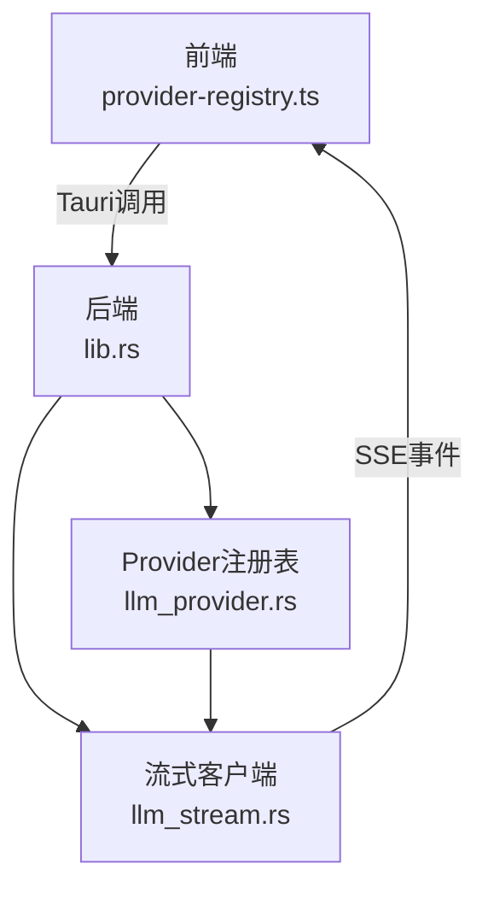
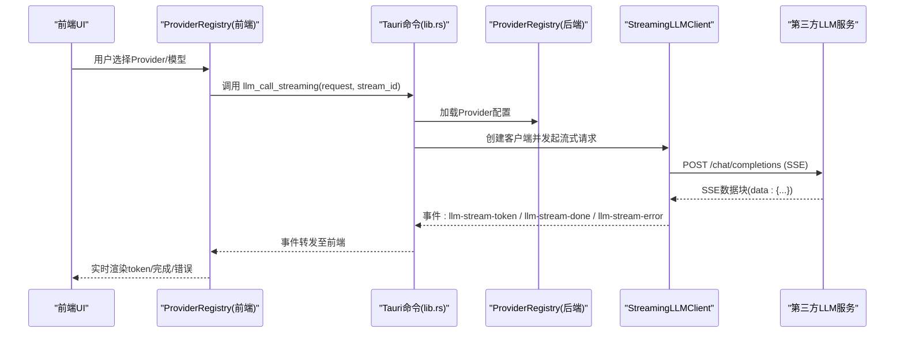
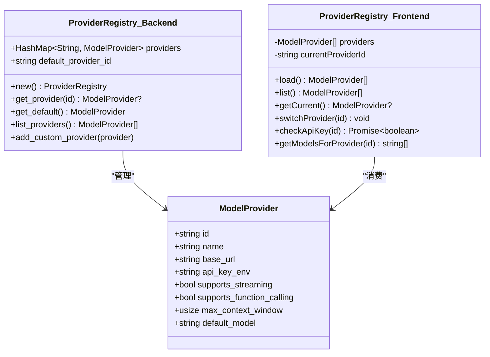
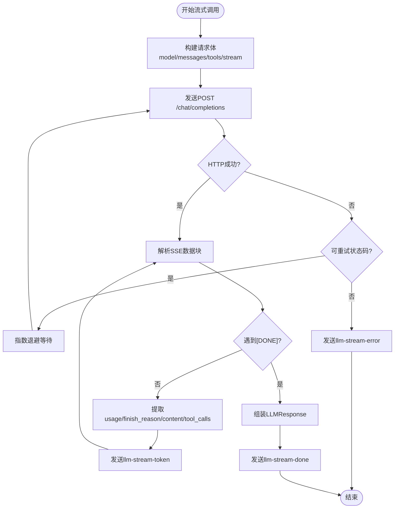
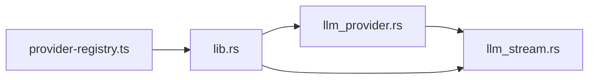

# LLM提供者集成

<cite>
**本文引用的文件**
- [provider-registry.ts](file://ai-experts/src/provider-registry.ts)
- [llm_provider.rs](file://ai-experts/src-tauri/src/llm_provider.rs)
- [llm_stream.rs](file://ai-experts/src-tauri/src/llm_stream.rs)
- [lib.rs](file://ai-experts/src-tauri/src/lib.rs)
- [main.rs](file://ai-experts/src-tauri/src/main.rs)
</cite>

## 目录
1. [简介](#简介)
2. [项目结构](#项目结构)
3. [核心组件](#核心组件)
4. [架构总览](#架构总览)
5. [详细组件分析](#详细组件分析)
6. [依赖关系分析](#依赖关系分析)
7. [性能考虑](#性能考虑)
8. [故障排查指南](#故障排查指南)
9. [结论](#结论)
10. [附录](#附录)

## 简介
本文件面向星图专家团工作台的LLM提供者集成模块，系统性阐述模型抽象接口设计、多模型支持机制、流式响应处理、Provider注册表管理、以及自定义扩展指南。文档同时给出关键流程的可视化图示与实操建议，帮助开发者快速理解并高效集成与优化。

## 项目结构
LLM提供者集成由前端TypeScript与后端Rust两部分协同实现：
- 前端负责Provider注册表的加载、切换、API Key校验与模型预设展示
- 后端负责Provider注册表的持久化定义、LLM请求/响应结构、流式与非流式调用、重试与事件推送

图表来源
- [provider-registry.ts:1-111](file://ai-experts/src/provider-registry.ts#L1-L111)
- [lib.rs:6944-6978](file://ai-experts/src-tauri/src/lib.rs#L6944-L6978)
- [llm_provider.rs:17-126](file://ai-experts/src-tauri/src/llm_provider.rs#L17-L126)
- [llm_stream.rs:49-342](file://ai-experts/src-tauri/src/llm_stream.rs#L49-L342)

章节来源
- [provider-registry.ts:1-111](file://ai-experts/src/provider-registry.ts#L1-L111)
- [llm_provider.rs:17-126](file://ai-experts/src-tauri/src/llm_provider.rs#L17-L126)
- [lib.rs:6944-6978](file://ai-experts/src-tauri/src/lib.rs#L6944-L6978)

## 核心组件
- 模型抽象接口：ModelProvider与ProviderRegistry在前后端保持一致的结构与职责
- LLM请求/响应：LLMRequest、ChatMessage、ToolSchema/ToolCall、LLMResponse、TokenUsage
- 流式客户端：StreamingLLMClient封装SSE解析、事件推送、指数退避重试
- 前端注册表：ProviderRegistry负责加载、切换、API Key校验与模型预设

章节来源
- [llm_provider.rs:4-198](file://ai-experts/src-tauri/src/llm_provider.rs#L4-L198)
- [provider-registry.ts:8-101](file://ai-experts/src/provider-registry.ts#L8-L101)

## 架构总览
整体采用“前端注册表 + 后端统一Provider定义 + 流式SSE事件”的架构模式，通过Tauri命令桥接前后端，实现跨语言的统一LLM调用体验。

图表来源
- [lib.rs:6944-6978](file://ai-experts/src-tauri/src/lib.rs#L6944-L6978)
- [llm_stream.rs:63-342](file://ai-experts/src-tauri/src/llm_stream.rs#L63-L342)
- [provider-registry.ts:26-76](file://ai-experts/src/provider-registry.ts#L26-L76)

## 详细组件分析

### 模型抽象接口与Provider注册表
- ModelProvider字段设计
  - 标识与元信息：id、name、default_model
  - 访问凭据：base_url、api_key_env
  - 能力开关：supports_streaming、supports_function_calling
  - 上下文限制：max_context_window
- ProviderRegistry职责
  - 后端：内置Provider集合、默认Provider、按ID查询、列出Provider、添加自定义Provider
  - 前端：加载Provider列表、切换当前Provider、检查API Key、展示模型预设

图表来源
- [llm_provider.rs:4-126](file://ai-experts/src-tauri/src/llm_provider.rs#L4-L126)
- [provider-registry.ts:8-101](file://ai-experts/src/provider-registry.ts#L8-L101)

章节来源
- [llm_provider.rs:4-126](file://ai-experts/src-tauri/src/llm_provider.rs#L4-L126)
- [provider-registry.ts:8-101](file://ai-experts/src/provider-registry.ts#L8-L101)

### 多模型支持机制
- 内置Provider覆盖：DeepSeek、OpenAI、Anthropic、阿里云百炼、Ollama
- 能力差异：各Provider在流式、函数调用、上下文窗口、默认模型上存在差异
- 前端模型预设：根据Provider ID返回预设模型列表，便于用户快速选择

章节来源
- [llm_provider.rs:24-103](file://ai-experts/src-tauri/src/llm_provider.rs#L24-L103)
- [provider-registry.ts:81-90](file://ai-experts/src/provider-registry.ts#L81-L90)

### 流式响应处理（llm_stream.rs）
- SSE解析与事件分发
  - 逐行解析SSE，提取usage、finish_reason、delta.content与delta.tool_calls
  - 通过Tauri事件向前端推送：llm-stream-token、llm-stream-done、llm-stream-error
- 重试与退避
  - 指数退避策略，支持最大重试次数、初始/最大退避时间、倍数
  - 可重试HTTP状态码：429、500、502、503、504
- 错误处理
  - 请求失败、HTTP非成功状态、SSE解析异常均转化为错误事件
  - 对不可重试错误直接发送错误事件并终止

图表来源
- [llm_stream.rs:106-342](file://ai-experts/src-tauri/src/llm_stream.rs#L106-L342)

章节来源
- [llm_stream.rs:8-503](file://ai-experts/src-tauri/src/llm_stream.rs#L8-L503)

### 前端实时数据处理
- Provider加载与切换
  - 通过invoke调用后端list_llm_providers，解析JSON并缓存
  - 切换Provider时同步到运行时配置
- API Key校验
  - 调用后端check_env_var，基于Provider的api_key_env判断是否已配置
- 模型预设展示
  - 根据Provider ID返回预设模型数组，供UI选择

章节来源
- [provider-registry.ts:26-76](file://ai-experts/src/provider-registry.ts#L26-L76)

### Tauri命令与事件桥接
- llm_call_streaming：接收前端请求，加载Provider，调用StreamingLLMClient，返回最终响应
- llm_call_blocking：非流式调用，适用于简短回复或兼容场景
- list_llm_providers：返回后端Provider注册表序列化后的字符串，供前端加载

章节来源
- [lib.rs:6944-6978](file://ai-experts/src-tauri/src/lib.rs#L6944-L6978)

## 依赖关系分析
- 模块耦合
  - 前端ProviderRegistry依赖后端提供的Provider定义与Tauri命令
  - 后端StreamingLLMClient依赖Provider定义、HTTP客户端、事件系统
- 数据契约
  - LLMRequest/LLMResponse在前后端保持一致，确保跨语言调用的稳定性
- 外部依赖
  - reqwest用于HTTP请求
  - serde用于JSON序列化/反序列化
  - tauri::Emitter用于事件推送

图表来源
- [llm_provider.rs:1-198](file://ai-experts/src-tauri/src/llm_provider.rs#L1-L198)
- [llm_stream.rs:1-504](file://ai-experts/src-tauri/src/llm_stream.rs#L1-L504)
- [lib.rs:34-35](file://ai-experts/src-tauri/src/lib.rs#L34-L35)
- [provider-registry.ts:1-111](file://ai-experts/src/provider-registry.ts#L1-L111)

章节来源
- [lib.rs:34-35](file://ai-experts/src-tauri/src/lib.rs#L34-L35)

## 性能考虑
- 流式传输优先：对长文本生成启用流式，降低首字延迟，提升交互体验
- 重试策略：合理设置最大重试次数与退避上限，避免雪崩
- 工具调用聚合：SSE中按索引聚合tool_calls，减少事件风暴
- 上下文窗口控制：结合max_context_window与消息裁剪策略，避免超限
- 并发与资源：限制并发流式请求数量，避免带宽与CPU瓶颈

## 故障排查指南
- API Key缺失
  - 现象：调用时报错提示未设置环境变量
  - 排查：确认Provider.api_key_env对应的环境变量已配置
- HTTP错误
  - 现象：llm-stream-error事件携带HTTP状态码与错误文本
  - 排查：检查base_url、网络连通性、配额与权限
- SSE解析异常
  - 现象：流中断或未收到[DONE]即结束
  - 排查：确认第三方服务SSE实现符合预期，关注缓冲与换行符
- 重试无效
  - 现象：多次重试仍失败
  - 排查：确认状态码是否属于可重试范围，调整重试参数

章节来源
- [llm_stream.rs:156-173](file://ai-experts/src-tauri/src/llm_stream.rs#L156-L173)
- [llm_stream.rs:499-502](file://ai-experts/src-tauri/src/llm_stream.rs#L499-L502)

## 结论
该LLM提供者集成以清晰的抽象接口与严格的前后端契约为基础，结合稳健的流式SSE处理与可配置的重试策略，实现了对主流Provider的统一接入。通过Provider注册表与Tauri命令桥接，既保证了扩展性，又兼顾了易用性与性能。

## 附录

### 自定义LLM提供者扩展指南
- 接口实现
  - 在后端ProviderRegistry中新增自定义Provider条目，设置base_url、api_key_env、能力开关与默认模型
  - 若需函数调用能力，确保tools字段在请求体中正确传递
- 配置管理
  - 为新Provider设置环境变量（若需要），并在前端ProviderRegistry中补充模型预设
- 错误处理策略
  - 明确可重试与不可重试状态码，合理设置退避参数
  - 在前端提供API Key校验入口，避免因凭据缺失导致的调用失败

章节来源
- [llm_provider.rs:122-126](file://ai-experts/src-tauri/src/llm_provider.rs#L122-L126)
- [provider-registry.ts:81-90](file://ai-experts/src/provider-registry.ts#L81-L90)