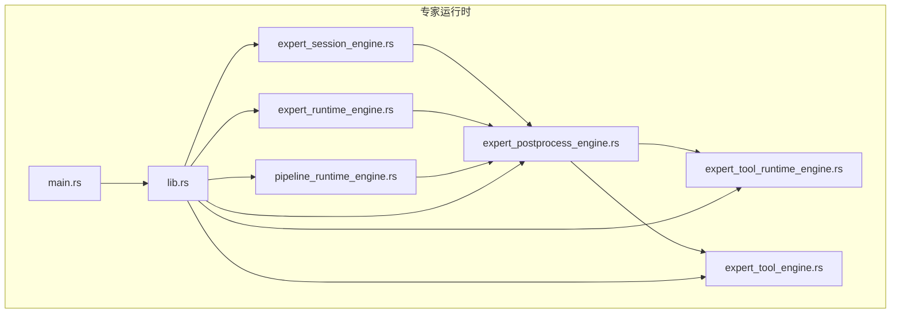
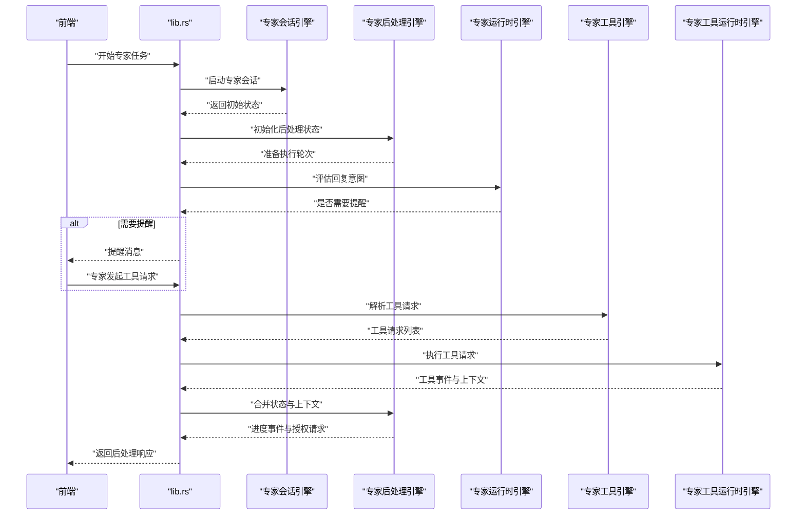
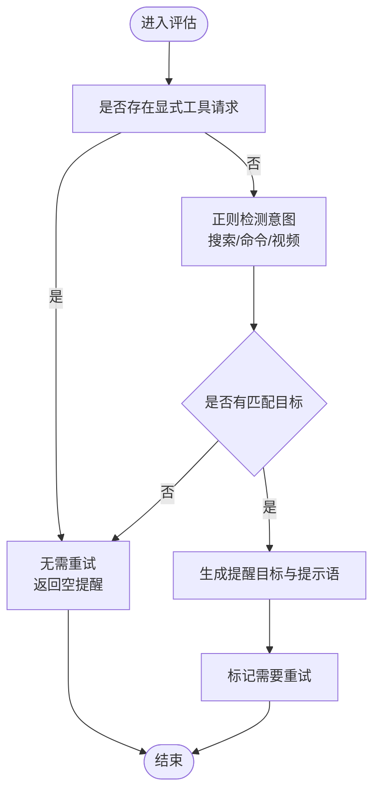
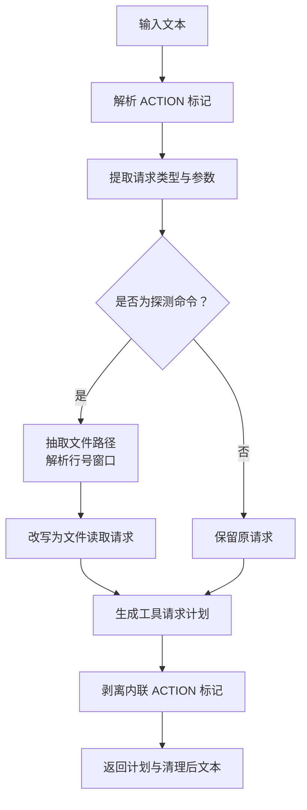
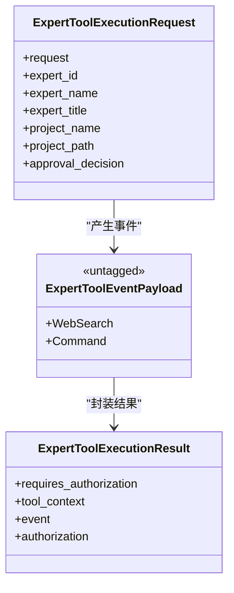
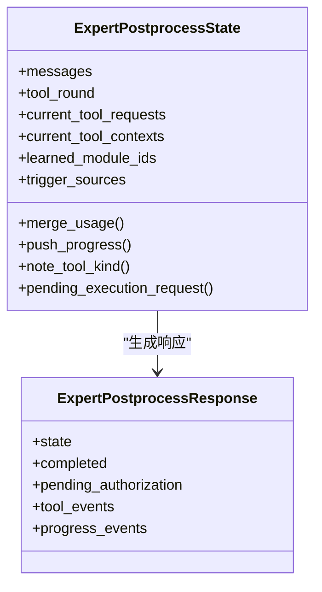
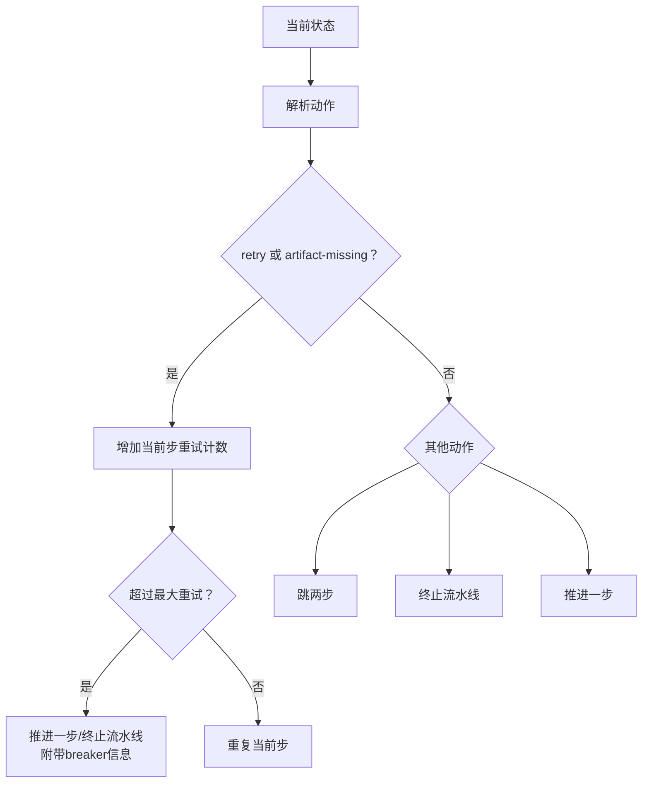
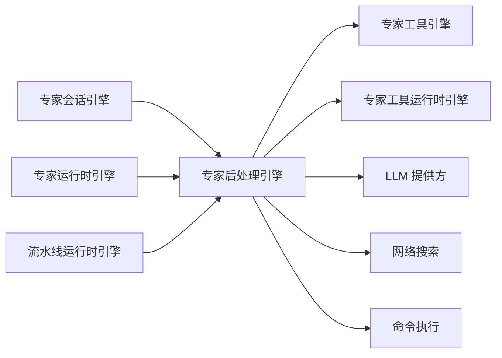

# 专家运行时引擎

<cite>
**本文引用的文件**
- [expert_runtime_engine.rs](file://ai-experts/src-tauri/src/expert_runtime_engine.rs)
- [expert_postprocess_engine.rs](file://ai-experts/src-tauri/src/expert_postprocess_engine.rs)
- [expert_session_engine.rs](file://ai-experts/src-tauri/src/expert_session_engine.rs)
- [expert_tool_engine.rs](file://ai-experts/src-tauri/src/expert_tool_engine.rs)
- [expert_tool_runtime_engine.rs](file://ai-experts/src-tauri/src/expert_tool_runtime_engine.rs)
- [pipeline_runtime_engine.rs](file://ai-experts/src-tauri/src/pipeline_runtime_engine.rs)
- [lib.rs](file://ai-experts/src-tauri/src/lib.rs)
- [main.rs](file://ai-experts/src-tauri/src/main.rs)
</cite>

## 目录
1. [引言](#引言)
2. [项目结构](#项目结构)
3. [核心组件](#核心组件)
4. [架构总览](#架构总览)
5. [详细组件分析](#详细组件分析)
6. [依赖关系分析](#依赖关系分析)
7. [性能考量](#性能考量)
8. [故障排查指南](#故障排查指南)
9. [结论](#结论)
10. [附录](#附录)

## 引言
本技术文档围绕“星图专家团工作台”的专家运行时引擎展开，系统性梳理从请求接收、专家选择与调度、工具执行与授权、结果回传与后处理，到状态管理与错误恢复的完整生命周期。文档同时覆盖专家后处理引擎在结果格式化、数据清洗与质量检查方面的实现原理，并提供监控与调试建议及实战案例与优化建议。

## 项目结构
该引擎位于 Rust 后端模块（Tauri）中，采用按功能域划分的文件组织方式，核心模块包括：
- 专家会话与状态：专家会话引擎、专家后处理引擎
- 专家工具链：工具请求解析与改写、工具执行与事件封装
- 运行时控制：专家运行时引擎（意图识别与提醒）、流水线运行时引擎
- 外部集成：LLM 提供方、网络搜索、命令执行等

图表来源
- [lib.rs:1-800](file://ai-experts/src-tauri/src/lib.rs#L1-L800)
- [expert_runtime_engine.rs:1-175](file://ai-experts/src-tauri/src/expert_runtime_engine.rs#L1-L175)
- [expert_postprocess_engine.rs:1-134](file://ai-experts/src-tauri/src/expert_postprocess_engine.rs#L1-L134)
- [expert_session_engine.rs:1-38](file://ai-experts/src-tauri/src/expert_session_engine.rs#L1-L38)
- [expert_tool_engine.rs:1-534](file://ai-experts/src-tauri/src/expert_tool_engine.rs#L1-L534)
- [expert_tool_runtime_engine.rs:1-510](file://ai-experts/src-tauri/src/expert_tool_runtime_engine.rs#L1-L510)
- [pipeline_runtime_engine.rs:1-214](file://ai-experts/src-tauri/src/pipeline_runtime_engine.rs#L1-L214)
- [main.rs:1-6](file://ai-experts/src-tauri/src/main.rs#L1-L6)

章节来源
- [lib.rs:1-800](file://ai-experts/src-tauri/src/lib.rs#L1-L800)
- [main.rs:1-6](file://ai-experts/src-tauri/src/main.rs#L1-L6)

## 核心组件
- 专家会话引擎：负责启动专家会话、初始化专家后处理状态、注入提示词与历史模块信息。
- 专家后处理引擎：承载专家执行状态、进度事件、工具上下文、令牌用量合并、授权请求构建等。
- 专家运行时引擎：对专家回复进行意图识别，决定是否触发工具提醒、构建后续消息。
- 专家工具引擎：解析专家回复中的 ACTION 标记，提取工具请求并改写为更精确的工具类型。
- 专家工具运行时引擎：封装工具执行结果与事件，支持网络搜索、文件读取、目录列举、命令执行与授权。
- 流水线运行时引擎：驱动多专家协作的步骤推进、重试上限与强制推进策略。

章节来源
- [expert_session_engine.rs:1-38](file://ai-experts/src-tauri/src/expert_session_engine.rs#L1-L38)
- [expert_postprocess_engine.rs:1-134](file://ai-experts/src-tauri/src/expert_postprocess_engine.rs#L1-L134)
- [expert_runtime_engine.rs:1-175](file://ai-experts/src-tauri/src/expert_runtime_engine.rs#L1-L175)
- [expert_tool_engine.rs:1-534](file://ai-experts/src-tauri/src/expert_tool_engine.rs#L1-L534)
- [expert_tool_runtime_engine.rs:1-510](file://ai-experts/src-tauri/src/expert_tool_runtime_engine.rs#L1-L510)
- [pipeline_runtime_engine.rs:1-214](file://ai-experts/src-tauri/src/pipeline_runtime_engine.rs#L1-L214)

## 架构总览
专家运行时引擎以“会话-状态-工具-事件-后处理-流水线”为主线，形成闭环：
- 会话初始化：由专家会话引擎创建初始状态，注入场景、提示词与模块信息。
- 后处理状态：专家后处理引擎维护专家执行的完整状态机，包括消息、工具轮次、待执行工具、授权请求等。
- 工具解析与执行：专家工具引擎解析 ACTION 并改写为具体工具请求；工具运行时引擎执行并产出事件与上下文。
- 运行时提醒：专家运行时引擎根据回复意图决定是否需要再次提醒专家发起工具动作。
- 流水线推进：流水线运行时引擎依据决策推进步骤、重试与强制推进，保障不原地空转。

图表来源
- [lib.rs:250-270](file://ai-experts/src-tauri/src/lib.rs#L250-L270)
- [expert_runtime_engine.rs:76-114](file://ai-experts/src-tauri/src/expert_runtime_engine.rs#L76-L114)
- [expert_tool_engine.rs:288-480](file://ai-experts/src-tauri/src/expert_tool_engine.rs#L288-L480)
- [expert_tool_runtime_engine.rs:77-84](file://ai-experts/src-tauri/src/expert_tool_runtime_engine.rs#L77-L84)
- [expert_postprocess_engine.rs:60-68](file://ai-experts/src-tauri/src/expert_postprocess_engine.rs#L60-L68)

## 详细组件分析

### 专家运行时引擎（意图识别与提醒）
- 功能要点
  - 对专家回复进行意图识别，判定是否需要网络搜索、命令执行或视频工作流。
  - 若存在显式工具请求则不再强制提醒；否则生成提醒目标与提示语。
  - 构建工具后续消息，汇总工具执行结果，避免重复请求。
- 关键算法
  - 正则匹配关键词与模式，识别搜索意图、命令意图与视频相关关键词。
  - 决策逻辑：若已存在工具请求则跳过重试；否则根据匹配结果生成提醒目标集合。
  - 后续消息拼接：将工具上下文按换行分隔整合，便于专家继续推理。

图表来源
- [expert_runtime_engine.rs:59-114](file://ai-experts/src-tauri/src/expert_runtime_engine.rs#L59-L114)

章节来源
- [expert_runtime_engine.rs:1-175](file://ai-experts/src-tauri/src/expert_runtime_engine.rs#L1-L175)

### 专家工具引擎（请求解析与改写）
- 功能要点
  - 解析专家回复中的 ACTION 标记，提取网络搜索、命令执行、文件读取、目录列举等请求。
  - 将探测型命令改写为精确的文件读取请求，自动推导行号窗口，提升准确性。
  - 规范化路径与工作目录，支持别名与相对路径转换。
- 关键算法
  - 参数解析：解析键值对参数，处理转义字符与引号。
  - 路径规范化：区分绝对/相对路径，必要时相对项目根目录裁剪。
  - 命令改写：从命令中抽取可读文件路径，结合上下文计算行号窗口，替换为文件读取请求。

图表来源
- [expert_tool_engine.rs:288-480](file://ai-experts/src-tauri/src/expert_tool_engine.rs#L288-L480)
- [expert_tool_engine.rs:406-453](file://ai-experts/src-tauri/src/expert_tool_engine.rs#L406-L453)

章节来源
- [expert_tool_engine.rs:1-534](file://ai-experts/src-tauri/src/expert_tool_engine.rs#L1-L534)

### 专家工具运行时引擎（执行与事件封装）
- 功能要点
  - 统一封装工具执行结果与事件，支持网络搜索、命令执行、文件读取、目录列举。
  - 事件包含专家身份、原因、状态、输出与错误；结果包含工具上下文与授权请求。
  - 文本截断与摘要：对大输出进行头尾截断与摘要，避免传输与显示开销。
- 关键算法
  - 授权模式判定：根据安全原因自动/受限/管理员三档。
  - 结果构造：根据不同工具类型生成统一的上下文与事件对象。
  - 截断策略：头部与尾部保留比例不同，确保上下文可读性。

图表来源
- [expert_tool_runtime_engine.rs:6-84](file://ai-experts/src-tauri/src/expert_tool_runtime_engine.rs#L6-L84)

章节来源
- [expert_tool_runtime_engine.rs:1-510](file://ai-experts/src-tauri/src/expert_tool_runtime_engine.rs#L1-L510)

### 专家后处理引擎（状态、进度与授权）
- 功能要点
  - 维护专家执行状态：消息、工具轮次、当前工具索引、上下文、学习模块与触发来源。
  - 合并令牌用量、推送进度事件、记录工具类型学习与触发来源。
  - 构建工具执行请求：携带专家身份与项目信息，支持授权决策。
- 关键算法
  - 状态合并：累加 prompt/completion/total tokens。
  - 去重记录：学习模块与触发来源使用唯一插入。
  - 执行请求：组装专家身份与项目上下文，传递授权决策。

图表来源
- [expert_postprocess_engine.rs:16-126](file://ai-experts/src-tauri/src/expert_postprocess_engine.rs#L16-L126)

章节来源
- [expert_postprocess_engine.rs:1-134](file://ai-experts/src-tauri/src/expert_postprocess_engine.rs#L1-L134)

### 专家会话引擎（初始化与模块注入）
- 功能要点
  - 接收专家标识、场景、任务描述、历史结果与提示词。
  - 返回初始后处理状态、提示词长度与模块 ID 列表。
- 关键算法
  - 初始化状态：复制专家身份、场景、任务描述与项目上下文。
  - 注入模块：合并历史提示模块与显式提示模块，去重并排序。

章节来源
- [expert_session_engine.rs:1-38](file://ai-experts/src-tauri/src/expert_session_engine.rs#L1-L38)

### 流水线运行时引擎（步骤推进与重试）
- 功能要点
  - 维护当前步骤索引、总步数、最大重试次数与每步重试计数。
  - 支持 retry/artifact-missing/skip-next/abort 等动作，超过重试上限时强制推进。
- 关键算法
  - 决策映射：将动作字符串映射为推进、重复或停止。
  - 强制推进：当连续重试超过上限且为 retry 时，推进一步并附带提示信息。
  - 资质缺失：当为 artifact-missing 且超限，直接终止流水线。

图表来源
- [pipeline_runtime_engine.rs:49-153](file://ai-experts/src-tauri/src/pipeline_runtime_engine.rs#L49-L153)

章节来源
- [pipeline_runtime_engine.rs:1-214](file://ai-experts/src-tauri/src/pipeline_runtime_engine.rs#L1-L214)

## 依赖关系分析
- 模块耦合
  - 专家会话引擎与专家后处理引擎强耦合：前者初始化状态，后者维护状态与事件。
  - 专家工具引擎与专家工具运行时引擎强耦合：前者解析请求，后者执行并产出事件。
  - 专家运行时引擎与专家工具引擎弱耦合：前者通过意图识别影响是否触发工具提醒。
  - 流水线运行时引擎与专家后处理引擎弱耦合：前者推进步骤，后者维护状态。
- 外部依赖
  - LLM 提供方：用于生成调度计划、审阅与快速回答。
  - 网络搜索：提供搜索结果作为工具上下文。
  - 命令执行：封装 shell 执行结果，支持授权与安全校验。

图表来源
- [lib.rs:14-52](file://ai-experts/src-tauri/src/lib.rs#L14-L52)
- [expert_runtime_engine.rs:1-175](file://ai-experts/src-tauri/src/expert_runtime_engine.rs#L1-L175)
- [expert_tool_engine.rs:1-534](file://ai-experts/src-tauri/src/expert_tool_engine.rs#L1-L534)
- [expert_tool_runtime_engine.rs:1-510](file://ai-experts/src-tauri/src/expert_tool_runtime_engine.rs#L1-L510)
- [pipeline_runtime_engine.rs:1-214](file://ai-experts/src-tauri/src/pipeline_runtime_engine.rs#L1-L214)

章节来源
- [lib.rs:14-52](file://ai-experts/src-tauri/src/lib.rs#L14-L52)

## 性能考量
- 文本截断与摘要
  - 对工具输出进行头尾截断与摘要，减少传输与渲染压力，提高交互流畅度。
- 令牌用量合并
  - 在后处理状态中累加 prompt/completion/total tokens，便于成本控制与审计。
- 正则匹配与路径解析
  - 使用预编译正则与路径规范化，降低重复计算与 IO 成本。
- 流水线重试上限
  - 设置最大重试次数，避免长时间阻塞；超过上限强制推进，防止原地空转。

## 故障排查指南
- 常见问题
  - 专家回复未触发工具提醒：检查意图识别正则是否覆盖关键词；确认是否存在显式工具请求。
  - 工具请求解析失败：检查 ACTION 标记格式与参数引号；核对路径与工作目录解析逻辑。
  - 命令执行未授权：检查安全原因与授权模式；确认用户决策是否传递至工具运行时。
  - 流水线停滞：检查重试次数与动作输入；关注强制推进的 breaker 信息。
- 调试建议
  - 开启后处理进度事件与工具事件日志，定位状态变更点。
  - 对大文本输出启用截断与摘要，缩小问题范围。
  - 使用单元测试覆盖关键解析与改写逻辑，确保边界条件正确。

章节来源
- [expert_runtime_engine.rs:125-175](file://ai-experts/src-tauri/src/expert_runtime_engine.rs#L125-L175)
- [expert_tool_engine.rs:482-534](file://ai-experts/src-tauri/src/expert_tool_engine.rs#L482-L534)
- [expert_tool_runtime_engine.rs:456-510](file://ai-experts/src-tauri/src/expert_tool_runtime_engine.rs#L456-L510)
- [pipeline_runtime_engine.rs:155-214](file://ai-experts/src-tauri/src/pipeline_runtime_engine.rs#L155-L214)

## 结论
专家运行时引擎通过“会话-状态-工具-事件-后处理-流水线”的闭环设计，实现了从请求到结果的全链路自动化与可观测性。意图识别与提醒机制提升了工具使用的确定性；工具解析与改写增强了准确性；事件与上下文封装保证了结果可追溯；流水线推进策略避免了停滞与资源浪费。配合完善的监控与调试手段，可有效支撑复杂场景下的专家协作与交付。

## 附录
- 实际执行案例（示例流程）
  - 会话启动：专家会话引擎初始化状态，注入场景与模块。
  - 后处理准备：专家后处理引擎准备执行轮次，记录工具轮次与上下文。
  - 意图评估：专家运行时引擎评估回复，若需提醒则生成提示语。
  - 工具解析：专家工具引擎解析 ACTION，必要时改写为文件读取。
  - 工具执行：专家工具运行时引擎执行并产出事件与上下文。
  - 状态合并：专家后处理引擎合并令牌用量与进度事件，生成授权请求。
  - 流水线推进：流水线运行时引擎根据决策推进步骤，必要时强制推进。
- 优化建议
  - 引入缓存：对常用搜索结果与文件读取内容进行短期缓存。
  - 并发执行：在授权允许的前提下并发执行独立工具请求。
  - 可观测性：扩展进度事件与指标上报，支持实时告警与容量规划。