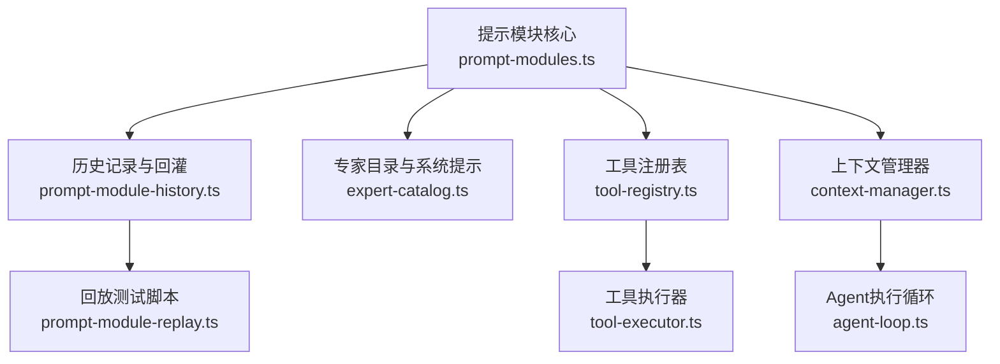
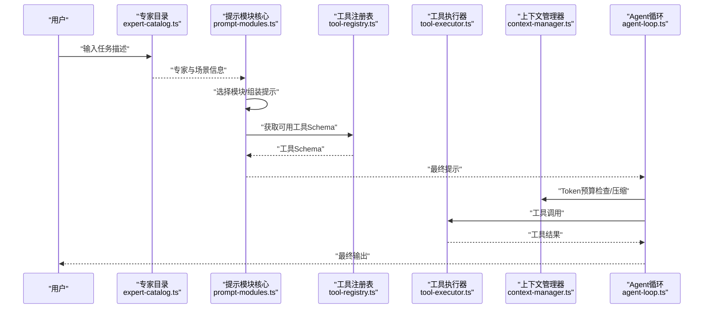
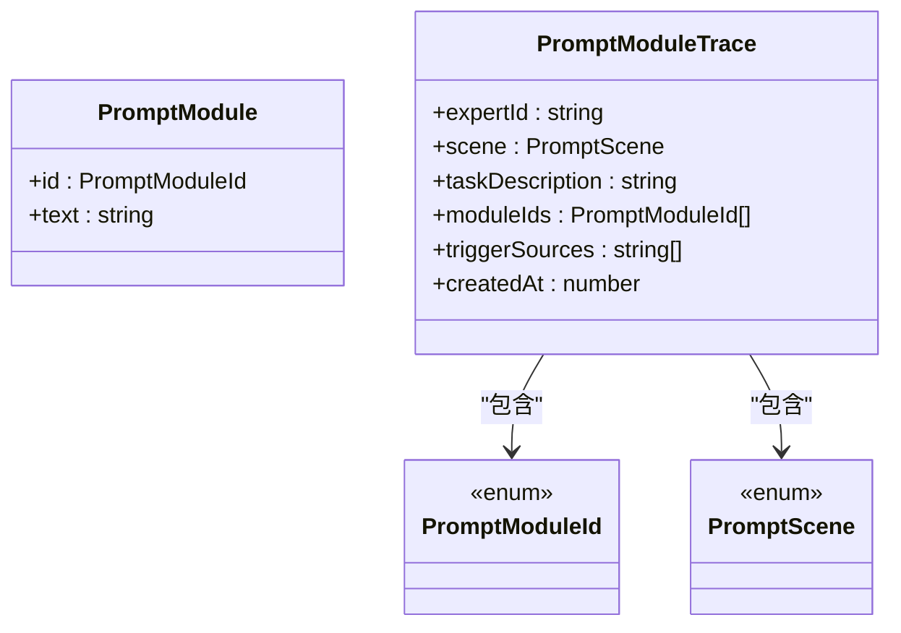
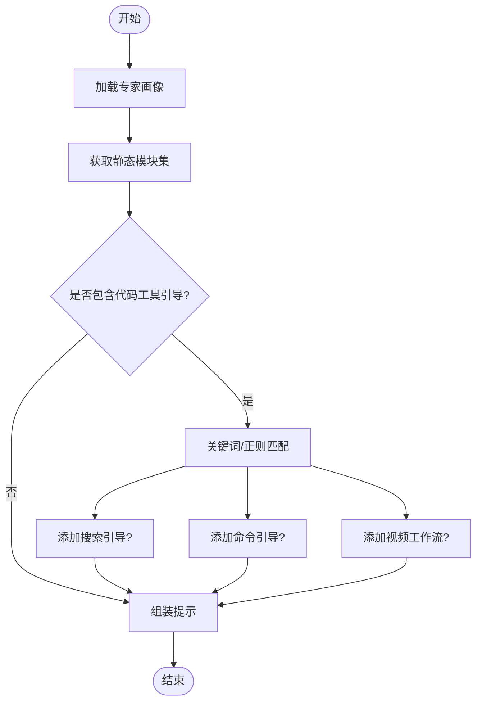
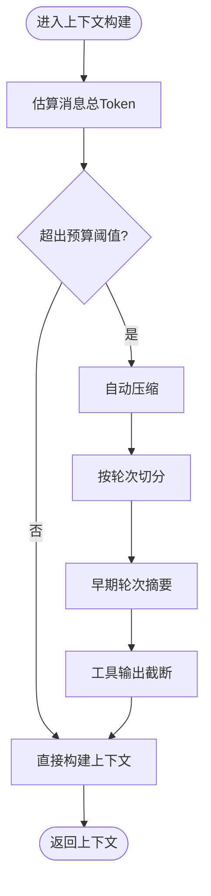
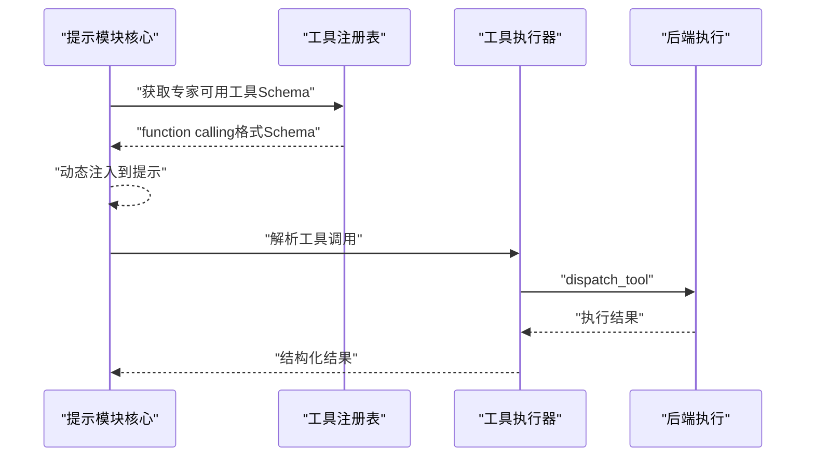
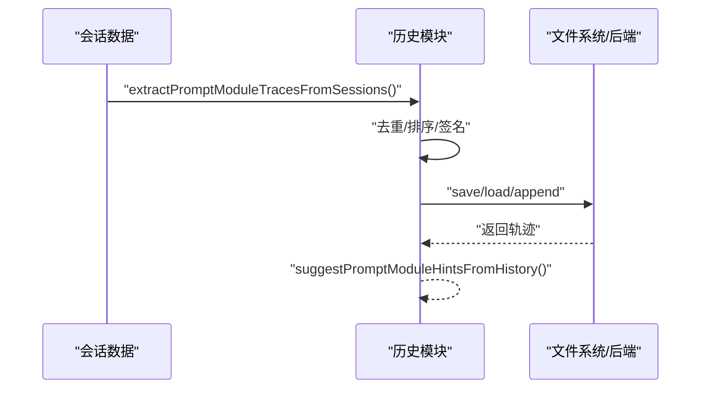
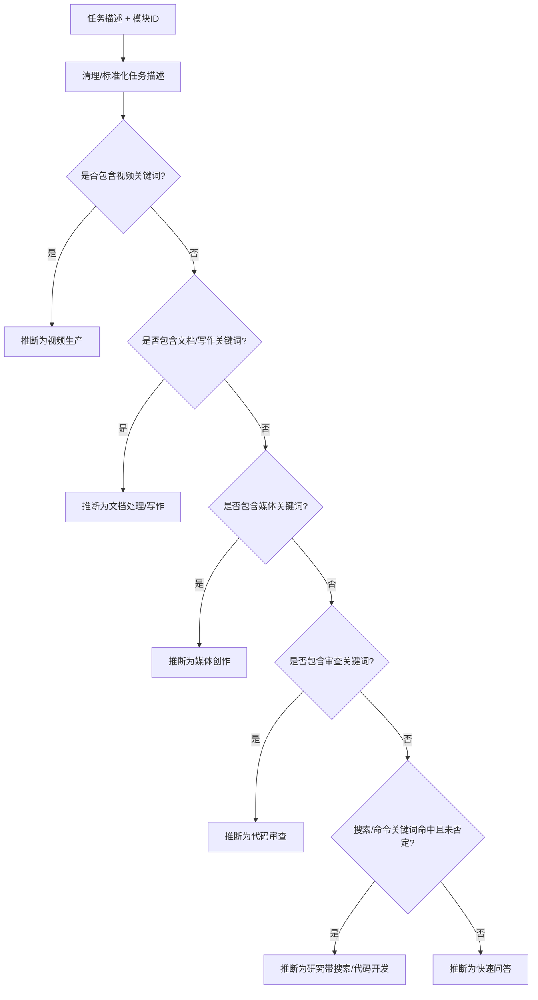
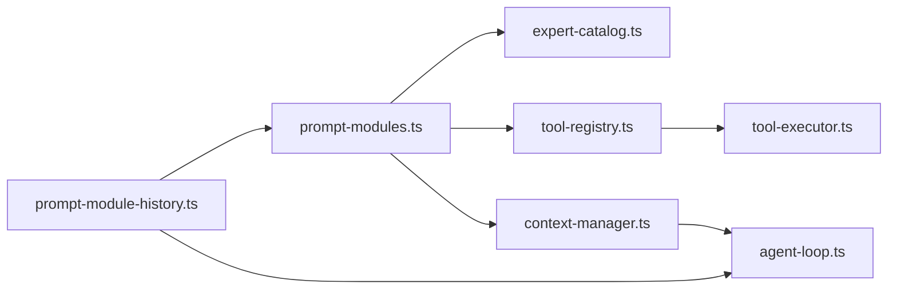

# 提示模块系统

<cite>
**本文档引用的文件**
- [prompt-modules.ts](file://ai-experts/src/prompt-modules.ts)
- [prompt-module-history.ts](file://ai-experts/src/prompt-module-history.ts)
- [context-manager.ts](file://ai-experts/src/context-manager.ts)
- [agent-loop.ts](file://ai-experts/src/agent-loop.ts)
- [tool-executor.ts](file://ai-experts/src/tool-executor.ts)
- [tool-registry.ts](file://ai-experts/src/tool-registry.ts)
- [expert-catalog.ts](file://ai-experts/src/expert-catalog.ts)
- [prompt-module-replay.ts](file://ai-experts/scripts/prompt-module-replay.ts)
</cite>

## 目录
1. [简介](#简介)
2. [项目结构](#项目结构)
3. [核心组件](#核心组件)
4. [架构总览](#架构总览)
5. [详细组件分析](#详细组件分析)
6. [依赖关系分析](#依赖关系分析)
7. [性能考量](#性能考量)
8. [故障排查指南](#故障排查指南)
9. [结论](#结论)
10. [附录](#附录)

## 简介
本文件面向“星图专家团工作台”的提示模块系统，系统性阐述提示模板管理的设计架构、动态提示生成算法、上下文注入机制、历史记录管理与对话追踪、开发指南与调试技巧，并提供性能优化策略与实际案例参考。目标是帮助开发者与产品人员在不深入源码的前提下，理解并高效使用与扩展提示模块系统。

## 项目结构
提示模块系统主要由以下模块构成：
- 提示模块定义与选择：定义模块集合、场景与触发规则、模块组装与场景推断
- 历史记录与回灌：从历史会话提取轨迹、缓存与持久化、基于历史的模块提示
- 上下文管理：Token预算、片段化上下文、自动压缩与摘要
- 工具系统：工具注册、Schema动态注入、工具调用解析与执行
- 专家系统：专家目录、系统提示构建、职责激活与派发
- 测试与回放：模块选择、意图检测、历史回灌与场景推断的回归测试

**图表来源**
- [prompt-modules.ts:1-775](file://ai-experts/src/prompt-modules.ts#L1-L775)
- [prompt-module-history.ts:1-121](file://ai-experts/src/prompt-module-history.ts#L1-L121)
- [context-manager.ts:1-276](file://ai-experts/src/context-manager.ts#L1-L276)
- [agent-loop.ts:1-404](file://ai-experts/src/agent-loop.ts#L1-L404)
- [tool-executor.ts:1-231](file://ai-experts/src/tool-executor.ts#L1-L231)
- [tool-registry.ts:1-192](file://ai-experts/src/tool-registry.ts#L1-L192)
- [expert-catalog.ts:1-657](file://ai-experts/src/expert-catalog.ts#L1-L657)
- [prompt-module-replay.ts:1-496](file://ai-experts/scripts/prompt-module-replay.ts#L1-L496)

**章节来源**
- [prompt-modules.ts:1-775](file://ai-experts/src/prompt-modules.ts#L1-L775)
- [prompt-module-history.ts:1-121](file://ai-experts/src/prompt-module-history.ts#L1-L121)
- [context-manager.ts:1-276](file://ai-experts/src/context-manager.ts#L1-L276)
- [agent-loop.ts:1-404](file://ai-experts/src/agent-loop.ts#L1-L404)
- [tool-executor.ts:1-231](file://ai-experts/src/tool-executor.ts#L1-L231)
- [tool-registry.ts:1-192](file://ai-experts/src/tool-registry.ts#L1-L192)
- [expert-catalog.ts:1-657](file://ai-experts/src/expert-catalog.ts#L1-L657)
- [prompt-module-replay.ts:1-496](file://ai-experts/scripts/prompt-module-replay.ts#L1-L496)

## 核心组件
- 提示模块定义与选择：集中管理模块ID、模块文本、场景与触发关键词、模块组装与场景推断
- 历史记录与回灌：从会话消息中抽取轨迹、去重与持久化、基于历史的模块提示
- 上下文管理：Token预算估算、片段化上下文、自动压缩与摘要
- 工具系统：工具Schema动态注入、工具调用解析与执行、权限与审批
- 专家系统：专家目录、系统提示构建、职责激活与派发
- 回放测试：模块选择、意图检测、历史回灌与场景推断的自动化验证

**章节来源**
- [prompt-modules.ts:39-165](file://ai-experts/src/prompt-modules.ts#L39-L165)
- [prompt-module-history.ts:13-121](file://ai-experts/src/prompt-module-history.ts#L13-L121)
- [context-manager.ts:21-276](file://ai-experts/src/context-manager.ts#L21-L276)
- [tool-registry.ts:6-192](file://ai-experts/src/tool-registry.ts#L6-L192)
- [tool-executor.ts:7-231](file://ai-experts/src/tool-executor.ts#L7-L231)
- [expert-catalog.ts:9-442](file://ai-experts/src/expert-catalog.ts#L9-L442)
- [prompt-module-replay.ts:16-496](file://ai-experts/scripts/prompt-module-replay.ts#L16-L496)

## 架构总览
提示模块系统围绕“专家角色 + 场景 + 任务描述”动态选择模块，结合历史与工具Schema生成最终提示，再由Agent循环驱动LLM与工具调用，实现上下文压缩与持续优化。

**图表来源**
- [expert-catalog.ts:351-442](file://ai-experts/src/expert-catalog.ts#L351-L442)
- [prompt-modules.ts:428-446](file://ai-experts/src/prompt-modules.ts#L428-L446)
- [tool-registry.ts:155-174](file://ai-experts/src/tool-registry.ts#L155-L174)
- [tool-executor.ts:24-53](file://ai-experts/src/tool-executor.ts#L24-L53)
- [context-manager.ts:115-156](file://ai-experts/src/context-manager.ts#L115-L156)
- [agent-loop.ts:76-211](file://ai-experts/src/agent-loop.ts#L76-L211)

## 详细组件分析

### 提示模块数据结构与生命周期
- 模块ID与文本：集中定义于模块集合，按专家与场景动态选择
- 场景枚举：涵盖代码开发、代码审查、技术调研、设计、快速问答、翻译、写作、办公、数据分析、文档处理、媒体创作、视频生产、带搜索的研究等
- 生命周期管理：从专家选择、场景推断、模块组装到最终提示注入

**图表来源**
- [prompt-modules.ts:1-37](file://ai-experts/src/prompt-modules.ts#L1-L37)
- [prompt-modules.ts:39-42](file://ai-experts/src/prompt-modules.ts#L39-L42)

**章节来源**
- [prompt-modules.ts:1-37](file://ai-experts/src/prompt-modules.ts#L1-L37)
- [prompt-modules.ts:39-42](file://ai-experts/src/prompt-modules.ts#L39-L42)

### 动态提示生成与模块选择算法
- 专家静态模块：根据专家工具画像确定初始模块集
- 动态模块：基于任务描述中的关键词与正则模式，结合场景推断，动态添加搜索、命令、视频工作流等模块
- 模块组装：将基础提示与选中模块文本拼接，形成最终提示

**图表来源**
- [prompt-modules.ts:177-202](file://ai-experts/src/prompt-modules.ts#L177-L202)
- [prompt-modules.ts:388-421](file://ai-experts/src/prompt-modules.ts#L388-L421)
- [prompt-modules.ts:423-426](file://ai-experts/src/prompt-modules.ts#L423-L426)

**章节来源**
- [prompt-modules.ts:177-226](file://ai-experts/src/prompt-modules.ts#L177-L226)
- [prompt-modules.ts:228-290](file://ai-experts/src/prompt-modules.ts#L228-L290)
- [prompt-modules.ts:291-317](file://ai-experts/src/prompt-modules.ts#L291-L317)
- [prompt-modules.ts:388-426](file://ai-experts/src/prompt-modules.ts#L388-L426)

### 上下文注入机制与Token预算
- 片段化上下文：将系统提示、RAG、记忆、黑板、工具Schema、用户指令等按优先级与Token上限注入
- Token估算：中文、英文、代码分别估算，叠加消息与工具调用开销
- 自动压缩：保留系统消息与最近若干轮，早期对话摘要化，工具输出截断

**图表来源**
- [context-manager.ts:55-87](file://ai-experts/src/context-manager.ts#L55-L87)
- [context-manager.ts:115-156](file://ai-experts/src/context-manager.ts#L115-L156)
- [context-manager.ts:178-203](file://ai-experts/src/context-manager.ts#L178-L203)

**章节来源**
- [context-manager.ts:29-49](file://ai-experts/src/context-manager.ts#L29-L49)
- [context-manager.ts:55-105](file://ai-experts/src/context-manager.ts#L55-L105)
- [context-manager.ts:115-156](file://ai-experts/src/context-manager.ts#L115-L156)
- [context-manager.ts:178-203](file://ai-experts/src/context-manager.ts#L178-L203)

### 工具Schema动态注入与调用解析
- Schema注入：根据专家可用工具生成function calling格式的工具Schema，注入到最终提示
- 调用解析：支持OpenAI function calling与ACTION标记两种格式，向后兼容
- 执行与审批：统一执行入口，处理审批流程与错误反馈

**图表来源**
- [prompt-modules.ts:762-774](file://ai-experts/src/prompt-modules.ts#L762-L774)
- [tool-registry.ts:155-174](file://ai-experts/src/tool-registry.ts#L155-L174)
- [tool-executor.ts:148-185](file://ai-experts/src/tool-executor.ts#L148-L185)
- [tool-executor.ts:24-53](file://ai-experts/src/tool-executor.ts#L24-L53)

**章节来源**
- [prompt-modules.ts:747-775](file://ai-experts/src/prompt-modules.ts#L747-L775)
- [tool-registry.ts:20-174](file://ai-experts/src/tool-registry.ts#L20-L174)
- [tool-executor.ts:148-222](file://ai-experts/src/tool-executor.ts#L148-L222)
- [tool-executor.ts:24-53](file://ai-experts/src/tool-executor.ts#L24-L53)

### 提示模块的历史记录管理与对话追踪
- 轨迹抽取：从会话消息中解析专家任务与工具事件，构建轨迹
- 去重与持久化：基于签名去重，缓存与持久化存储
- 历史提示：基于相似任务与场景，为新任务推荐模块

**图表来源**
- [prompt-module-history.ts:29-55](file://ai-experts/src/prompt-module-history.ts#L29-L55)
- [prompt-module-history.ts:79-87](file://ai-experts/src/prompt-module-history.ts#L79-L87)
- [prompt-module-history.ts:89-120](file://ai-experts/src/prompt-module-history.ts#L89-L120)
- [prompt-modules.ts:627-727](file://ai-experts/src/prompt-modules.ts#L627-L727)
- [prompt-modules.ts:518-561](file://ai-experts/src/prompt-modules.ts#L518-L561)

**章节来源**
- [prompt-module-history.ts:13-27](file://ai-experts/src/prompt-module-history.ts#L13-L27)
- [prompt-module-history.ts:29-55](file://ai-experts/src/prompt-module-history.ts#L29-L55)
- [prompt-module-history.ts:79-120](file://ai-experts/src/prompt-module-history.ts#L79-L120)
- [prompt-modules.ts:627-727](file://ai-experts/src/prompt-modules.ts#L627-L727)
- [prompt-modules.ts:518-561](file://ai-experts/src/prompt-modules.ts#L518-L561)

### 场景推断与意图检测
- 场景推断：基于任务描述与模块ID，推断当前场景（如代码开发、研究带搜索、视频生产等）
- 意图检测：在无ACTION标记时，通过正则与否定模式检测是否需要搜索、命令或视频工作流

**图表来源**
- [prompt-modules.ts:448-501](file://ai-experts/src/prompt-modules.ts#L448-L501)
- [prompt-modules.ts:729-744](file://ai-experts/src/prompt-modules.ts#L729-L744)

**章节来源**
- [prompt-modules.ts:448-501](file://ai-experts/src/prompt-modules.ts#L448-L501)
- [prompt-modules.ts:729-744](file://ai-experts/src/prompt-modules.ts#L729-L744)

### 开发指南：模板语法、最佳实践与调试技巧
- 模板语法
  - 模块ID：在专家画像基础上选择，支持白名单过滤
  - 关键词与正则：用于触发搜索、命令、视频工作流等模块
  - 场景推断：结合任务描述与模块ID自动推断
- 最佳实践
  - 仅在确需外部验证或最新信息时启用工具模块
  - 在代码开发/审查场景默认保留命令验证模块
  - 媒体专家在视频任务中启用视频工作流模块
  - 使用历史回灌提升模块选择的一致性与可复用性
- 调试技巧
  - 使用回放脚本验证模块选择、意图检测与历史回灌
  - 通过签名去重与轨迹排序定位异常
  - 在Agent循环中开启流式输出与压缩回调，观察Token使用与压缩效果

**章节来源**
- [prompt-modules.ts:448-501](file://ai-experts/src/prompt-modules.ts#L448-L501)
- [prompt-module-replay.ts:394-422](file://ai-experts/scripts/prompt-module-replay.ts#L394-L422)
- [prompt-module-replay.ts:428-438](file://ai-experts/scripts/prompt-module-replay.ts#L428-L438)
- [prompt-module-replay.ts:444-456](file://ai-experts/scripts/prompt-module-replay.ts#L444-L456)
- [prompt-module-replay.ts:462-476](file://ai-experts/scripts/prompt-module-replay.ts#L462-L476)
- [agent-loop.ts:223-268](file://ai-experts/src/agent-loop.ts#L223-L268)
- [context-manager.ts:115-156](file://ai-experts/src/context-manager.ts#L115-L156)

### 实际提示模板案例
- 代码开发：在任务描述包含“构建验证”“运行命令”等关键词时，自动添加命令细则模块
- 技术调研：在任务描述包含“最新资料”“官方文档”等关键词时，自动添加搜索细则模块
- 媒体创作：在任务描述包含“视频”“分镜”“storyboard”等关键词时，自动添加视频工作流模块
- 专家系统提示：根据专家领域构建知识库、方法论与职责触发倾向，指导专家输出

**章节来源**
- [prompt-modules.ts:388-421](file://ai-experts/src/prompt-modules.ts#L388-L421)
- [prompt-modules.ts:448-501](file://ai-experts/src/prompt-modules.ts#L448-L501)
- [expert-catalog.ts:351-381](file://ai-experts/src/expert-catalog.ts#L351-L381)

## 依赖关系分析
提示模块系统的关键依赖关系如下：
- 提示模块核心依赖专家目录与工具注册表，用于模块选择与Schema注入
- 上下文管理器依赖Agent循环，用于Token预算与压缩
- 工具执行器依赖工具注册表与后端桥接，用于工具调用与审批
- 历史模块依赖提示模块核心的轨迹抽取与签名算法

**图表来源**
- [prompt-modules.ts:169-175](file://ai-experts/src/prompt-modules.ts#L169-L175)
- [tool-registry.ts:1-18](file://ai-experts/src/tool-registry.ts#L1-L18)
- [tool-executor.ts:1-5](file://ai-experts/src/tool-executor.ts#L1-L5)
- [context-manager.ts:1-4](file://ai-experts/src/context-manager.ts#L1-L4)
- [agent-loop.ts:1-9](file://ai-experts/src/agent-loop.ts#L1-L9)
- [prompt-module-history.ts:1-11](file://ai-experts/src/prompt-module-history.ts#L1-L11)

**章节来源**
- [prompt-modules.ts:169-175](file://ai-experts/src/prompt-modules.ts#L169-L175)
- [tool-registry.ts:1-18](file://ai-experts/src/tool-registry.ts#L1-L18)
- [tool-executor.ts:1-5](file://ai-experts/src/tool-executor.ts#L1-L5)
- [context-manager.ts:1-4](file://ai-experts/src/context-manager.ts#L1-L4)
- [agent-loop.ts:1-9](file://ai-experts/src/agent-loop.ts#L1-L9)
- [prompt-module-history.ts:1-11](file://ai-experts/src/prompt-module-history.ts#L1-L11)

## 性能考量
- 模块选择优化
  - 使用关键词与正则匹配快速筛选模块，避免全量扫描
  - 通过白名单过滤与场景推断减少不必要的模块拼接
- 上下文压缩
  - 采用摘要与截断策略降低Token占用，提高吞吐
  - 保留系统消息与最近轮次，确保上下文连贯性
- 工具调用
  - 并行执行多个工具调用，缩短总延迟
  - 对file_patch失败进行结构化反馈与重试上限控制
- 历史回灌
  - 基于签名去重与滑动窗口缓存，控制内存与IO开销

[本节为通用指导，无需特定文件引用]

## 故障排查指南
- 模块未正确加载
  - 检查专家工具画像与模块白名单，确认模块ID有效
  - 使用回放脚本验证模块选择与组装结果
- 场景推断错误
  - 校验任务描述清洗与关键词匹配逻辑
  - 通过场景推断测试用例定位问题
- 历史回灌无效
  - 确认会话消息格式与轨迹抽取逻辑
  - 检查签名去重与缓存更新流程
- 上下文溢出
  - 调整Token预算与压缩阈值
  - 分析消息结构与工具输出长度，优化摘要策略
- 工具调用失败
  - 检查工具Schema与权限配置
  - 关注审批流程与错误反馈结构化输出

**章节来源**
- [prompt-module-replay.ts:371-422](file://ai-experts/scripts/prompt-module-replay.ts#L371-L422)
- [prompt-modules.ts:627-727](file://ai-experts/src/prompt-modules.ts#L627-L727)
- [context-manager.ts:115-156](file://ai-experts/src/context-manager.ts#L115-L156)
- [tool-executor.ts:346-383](file://ai-experts/src/tool-executor.ts#L346-L383)

## 结论
提示模块系统通过“专家画像 + 场景 + 任务描述”的动态模块选择、基于历史的智能提示、上下文预算与压缩、以及工具Schema的动态注入，实现了高效、可扩展、可复用的提示生成与执行闭环。配合完善的回放测试与历史回灌机制，系统在复杂任务场景中能够稳定提升提示质量与执行效率。

## 附录
- 回放测试脚本提供了模块选择、意图检测、历史回灌与场景推断的自动化验证，建议在新增模块或调整规则时运行以确保一致性
- 建议在团队内建立模块变更评审流程，确保模块ID、关键词与正则的可维护性与可追溯性

**章节来源**
- [prompt-module-replay.ts:1-496](file://ai-experts/scripts/prompt-module-replay.ts#L1-L496)