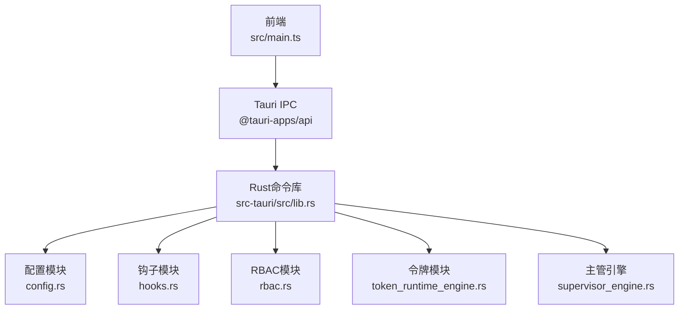
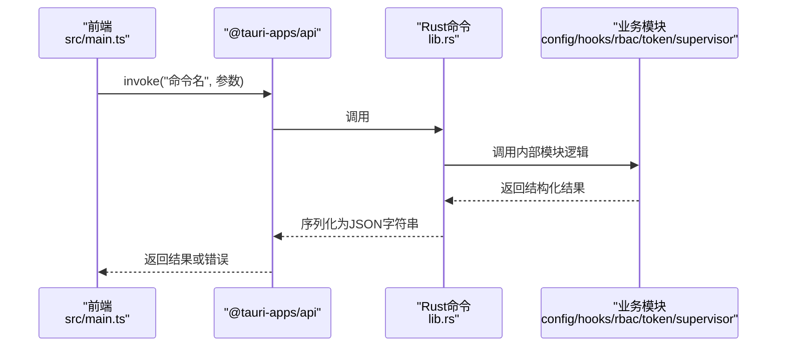
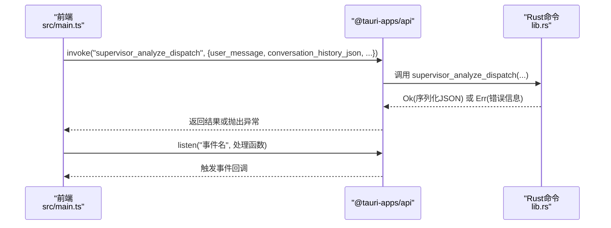
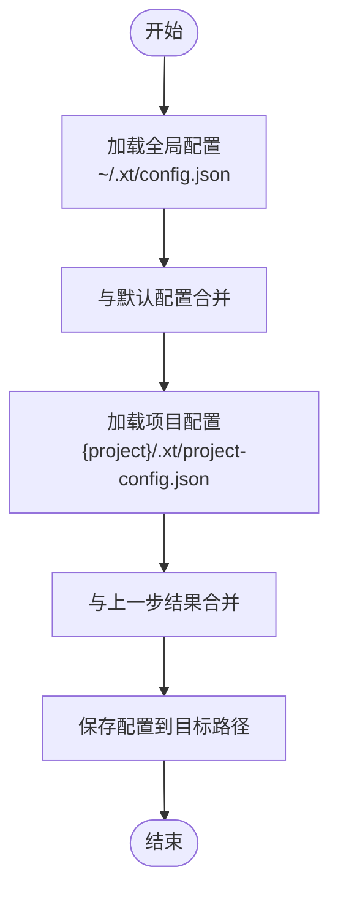
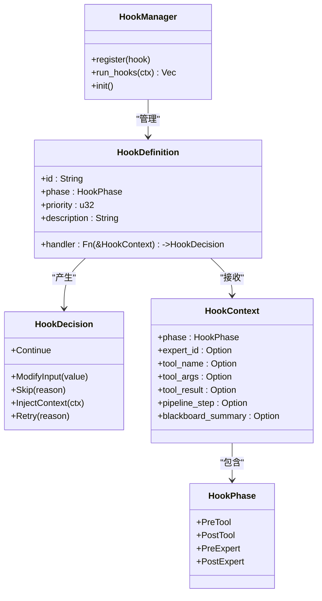
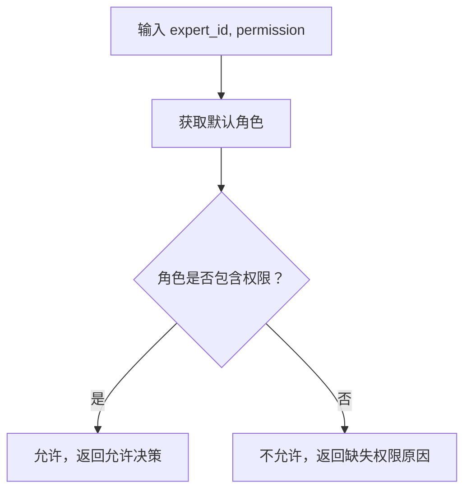
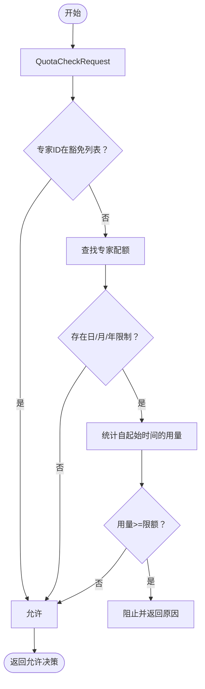
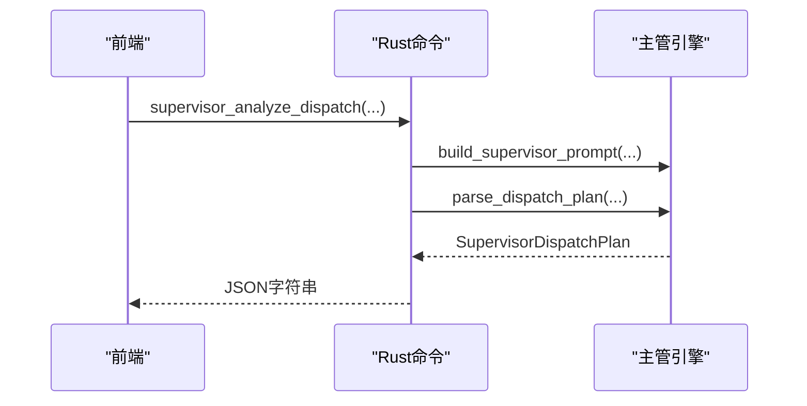
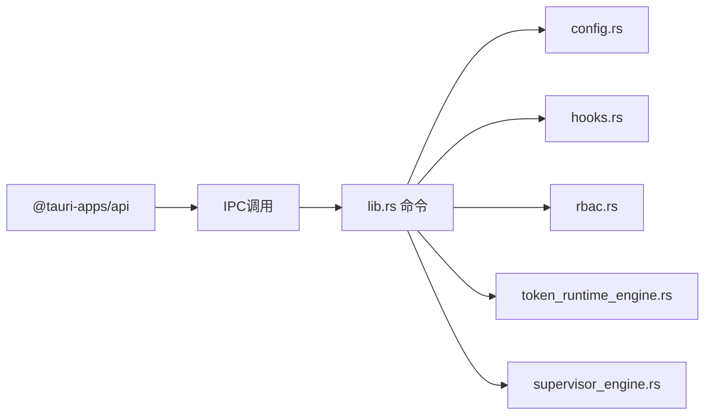

# API参考

<cite>
**本文引用的文件**
- [package.json](file://package.json)
- [tauri.conf.json](file://src-tauri/tauri.conf.json)
- [lib.rs](file://src-tauri/src/lib.rs)
- [Cargo.toml](file://src-tauri/Cargo.toml)
- [config.rs](file://src-tauri/src/config.rs)
- [hooks.rs](file://src-tauri/src/hooks.rs)
- [rbac.rs](file://src-tauri/src/rbac.rs)
- [token_runtime_engine.rs](file://src-tauri/src/token_runtime_engine.rs)
- [supervisor_engine.rs](file://src-tauri/src/supervisor_engine.rs)
- [main.ts](file://src/main.ts)
</cite>

## 目录
1. [简介](#简介)
2. [项目结构](#项目结构)
3. [核心组件](#核心组件)
4. [架构总览](#架构总览)
5. [详细组件分析](#详细组件分析)
6. [依赖关系分析](#依赖关系分析)
7. [性能考量](#性能考量)
8. [故障排查指南](#故障排查指南)
9. [结论](#结论)
10. [附录](#附录)

## 简介
本文件为“AI专家工作台”的API参考文档，覆盖以下方面：
- Tauri IPC（Rust命令）：命令注册、参数与返回值、错误处理与安全注意事项
- 前端调用（TypeScript）：invoke监听、事件订阅、窗口控制与拖拽集成
- 配置API：层叠配置加载与保存
- 钩子系统：阶段化扩展点与内置钩子
- RBAC权限控制：角色、权限与路径访问检查
- 令牌与配额：用量记录、配额检查与仪表盘快照
- 主管引擎：调度计划、跟进意图与中期检查
- 常见用例、客户端实现建议、性能优化与调试监控

## 项目结构
项目采用前端+Tauri后端的混合架构：
- 前端位于 src/，使用 @tauri-apps/api 进行IPC调用与事件监听
- 后端位于 src-tauri/src/，通过 #[tauri::command] 暴露IPC命令
- 配置、钩子、RBAC、令牌与主管引擎等核心模块在 src-tauri/src/ 内部组织

图表来源
- [main.ts:1-265](file://src/main.ts#L1-L265)
- [lib.rs:1-120](file://src-tauri/src/lib.rs#L1-L120)
- [config.rs:1-260](file://src-tauri/src/config.rs#L1-L260)
- [hooks.rs:1-190](file://src-tauri/src/hooks.rs#L1-L190)
- [rbac.rs:1-235](file://src-tauri/src/rbac.rs#L1-L235)
- [token_runtime_engine.rs:1-200](file://src-tauri/src/token_runtime_engine.rs#L1-L200)
- [supervisor_engine.rs:1-120](file://src-tauri/src/supervisor_engine.rs#L1-L120)

章节来源
- [package.json:1-28](file://package.json#L1-L28)
- [tauri.conf.json:1-38](file://src-tauri/tauri.conf.json#L1-L38)
- [main.ts:1-265](file://src/main.ts#L1-L265)
- [lib.rs:1-120](file://src-tauri/src/lib.rs#L1-L120)

## 核心组件
- Tauri IPC命令：通过 #[tauri::command] 注册，前端以 invoke 调用，返回JSON字符串或错误
- 配置系统：支持全局与项目级配置层叠合并，提供默认JSON与保存接口
- 钩子系统：阶段化扩展点（PreTool/PostTool/PreExpert/PostExpert），内置多项检查与注入
- RBAC权限：基于专家角色的权限矩阵，支持路径敏感性检查
- 令牌与配额：用量记录、配额检查、仪表盘快照与趋势统计
- 主管引擎：调度计划构建、跟进意图解析、中期检查决策

章节来源
- [lib.rs:707-800](file://src-tauri/src/lib.rs#L707-L800)
- [config.rs:170-260](file://src-tauri/src/config.rs#L170-L260)
- [hooks.rs:46-190](file://src-tauri/src/hooks.rs#L46-L190)
- [rbac.rs:10-172](file://src-tauri/src/rbac.rs#L10-L172)
- [token_runtime_engine.rs:181-295](file://src-tauri/src/token_runtime_engine.rs#L181-L295)
- [supervisor_engine.rs:108-175](file://src-tauri/src/supervisor_engine.rs#L108-L175)

## 架构总览
前端通过 @tauri-apps/api 与后端Rust命令交互，命令统一在 lib.rs 中注册并通过 tauri::command 宏暴露。核心业务逻辑分布在独立模块中，通过命令聚合对外提供服务。

图表来源
- [main.ts:244-261](file://src/main.ts#L244-L261)
- [lib.rs:707-800](file://src-tauri/src/lib.rs#L707-L800)
- [config.rs:170-260](file://src-tauri/src/config.rs#L170-L260)
- [hooks.rs:72-80](file://src-tauri/src/hooks.rs#L72-L80)
- [rbac.rs:106-127](file://src-tauri/src/rbac.rs#L106-L127)
- [token_runtime_engine.rs:269-295](file://src-tauri/src/token_runtime_engine.rs#L269-L295)
- [supervisor_engine.rs:361-449](file://src-tauri/src/supervisor_engine.rs#L361-L449)

## 详细组件分析

### Tauri IPC命令与前端调用
- 命令注册：在 lib.rs 中以 #[tauri::command] 声明，参数与返回值通过 serde 结构体传递
- 前端调用：使用 invoke("命令名", 参数) 发起调用，listen 订阅事件，getCurrentWindow 控制窗口
- 错误处理：命令返回 Result<String, String>，前端捕获错误并提示

图表来源
- [main.ts:244-261](file://src/main.ts#L244-L261)
- [lib.rs:732-788](file://src-tauri/src/lib.rs#L732-L788)

章节来源
- [main.ts:1-265](file://src/main.ts#L1-L265)
- [lib.rs:707-800](file://src-tauri/src/lib.rs#L707-L800)

### 配置API（层叠合并）
- 结构：AppConfig 包含 LLM、Shell、Approval、Agent、Pipeline、UI 等配置段
- 加载：全局 ~/.xt/config.json 与项目级 {project}/.xt/project-config.json 层叠合并
- 默认：提供默认配置JSON，便于UI展示
- 保存：将配置写入指定路径

图表来源
- [config.rs:170-260](file://src-tauri/src/config.rs#L170-L260)

章节来源
- [config.rs:1-260](file://src-tauri/src/config.rs#L1-L260)

### 钩子系统（Hooks）
- 阶段：PreTool、PostTool、PreExpert、PostExpert
- 决策：Continue、ModifyInput、Skip、InjectContext、Retry
- 管理：HookManager 提供注册、排序与执行；内置多项检查（退出码、黑板摘要、无进展、审批）
- 全局：ensure_hooks_initialized 异步初始化

图表来源
- [hooks.rs:5-80](file://src-tauri/src/hooks.rs#L5-L80)
- [hooks.rs:46-80](file://src-tauri/src/hooks.rs#L46-L80)

章节来源
- [hooks.rs:1-190](file://src-tauri/src/hooks.rs#L1-L190)

### RBAC权限控制
- 角色：Supervisor、LeadEngineer、Engineer、Reviewer、Researcher、Designer、Assistant
- 权限：ReadFiles、WriteFiles、DeleteFiles、ExecuteCode、CallExternalApi、AccessMemory、ModifyMemory、AccessTokenData、SupervisorOverride
- 路径检查：敏感路径（如 .git/credentials）仅主管可访问
- 角色映射：根据专家ID映射到默认角色

图表来源
- [rbac.rs:106-127](file://src-tauri/src/rbac.rs#L106-L127)
- [rbac.rs:129-172](file://src-tauri/src/rbac.rs#L129-L172)

章节来源
- [rbac.rs:1-235](file://src-tauri/src/rbac.rs#L1-L235)

### 令牌与配额（Token Runtime）
- 数据结构：TokenUsageRecord、TokenAllocation、TokenData、QuotaCheckRequest/Response、UsageSummary、TokenDashboardSnapshot
- 功能：配额检查（日/月/年）、用量追加、仪表盘快照、趋势统计
- 重置：按日/月/年重置时间计算

图表来源
- [token_runtime_engine.rs:181-267](file://src-tauri/src/token_runtime_engine.rs#L181-L267)

章节来源
- [token_runtime_engine.rs:1-200](file://src-tauri/src/token_runtime_engine.rs#L1-L200)
- [token_runtime_engine.rs:269-429](file://src-tauri/src/token_runtime_engine.rs#L269-L429)

### 主管引擎（Supervisor）
- 调度：build_supervisor_prompt 生成系统提示，parse_dispatch_plan 解析专家派发计划
- 跟进：build_followup_prompt 与 parse_followup_intent 解析用户中途意图
- 中期检查：build_mid_check_prompt 与 parse_mid_check_decision 生成决策
- 审查：build_review_prompt 与 enforce_review_fact 保证交付事实

图表来源
- [supervisor_engine.rs:118-175](file://src-tauri/src/supervisor_engine.rs#L118-L175)
- [supervisor_engine.rs:361-449](file://src-tauri/src/supervisor_engine.rs#L361-L449)

章节来源
- [supervisor_engine.rs:1-200](file://src-tauri/src/supervisor_engine.rs#L1-L200)
- [supervisor_engine.rs:206-268](file://src-tauri/src/supervisor_engine.rs#L206-L268)

## 依赖关系分析
- 前端依赖：@tauri-apps/api、@tauri-apps/plugin-dialog、@tauri-apps/plugin-opener
- 后端依赖：tauri、serde、serde_json、reqwest、tokio、sqlx、chrono、uuid、regex 等
- 命令依赖：各模块通过 lib.rs 聚合导出

图表来源
- [package.json:15-26](file://package.json#L15-L26)
- [Cargo.toml:20-46](file://src-tauri/Cargo.toml#L20-L46)
- [lib.rs:14-52](file://src-tauri/src/lib.rs#L14-L52)

章节来源
- [package.json:1-28](file://package.json#L1-L28)
- [Cargo.toml:1-46](file://src-tauri/Cargo.toml#L1-L46)
- [lib.rs:1-52](file://src-tauri/src/lib.rs#L1-L52)

## 性能考量
- 流式输出：UI配置中提供 streaming_enabled，可在前端启用流式渲染
- 工具调用：Shell超时与输出限制（默认最大输出字节与行数）防止资源滥用
- 重试策略：LLM调用支持指数回退与最大重试次数
- 并行流水线：Pipeline配置支持并行执行以提升吞吐
- 令牌统计：仪表盘快照与趋势统计可用于识别热点专家与模型

章节来源
- [config.rs:62-67](file://src-tauri/src/config.rs#L62-L67)
- [config.rs:32-38](file://src-tauri/src/config.rs#L32-L38)
- [config.rs:24-30](file://src-tauri/src/config.rs#L24-L30)
- [config.rs:55-60](file://src-tauri/src/config.rs#L55-L60)
- [token_runtime_engine.rs:297-429](file://src-tauri/src/token_runtime_engine.rs#L297-L429)

## 故障排查指南
- 常见错误
  - 命令参数解析失败：检查前端传参与后端反序列化字段名（驼峰）
  - 配额不足：查看配额检查返回reason，调整限额或等待重置
  - 路径访问被拒：敏感路径仅主管可访问，检查专家角色
  - 工具执行失败：检查退出码，必要时注入上下文或重试
- 调试建议
  - 前端：开启日志，使用 listen 订阅事件，观察事件内容与时机
  - 后端：在命令中打印关键上下文，使用测试用例验证解析逻辑
  - 监控：通过仪表盘快照查看专家用量与趋势，定位异常峰值

章节来源
- [lib.rs:321-338](file://src-tauri/src/lib.rs#L321-L338)
- [hooks.rs:84-106](file://src-tauri/src/hooks.rs#L84-L106)
- [rbac.rs:129-172](file://src-tauri/src/rbac.rs#L129-L172)
- [token_runtime_engine.rs:612-630](file://src-tauri/src/token_runtime_engine.rs#L612-L630)

## 结论
本API参考覆盖了前端IPC调用、后端命令实现、配置层叠、钩子扩展、RBAC权限、令牌配额与主管引擎等核心能力。通过清晰的命令契约、结构化数据与模块化设计，系统实现了可扩展、可观测且安全的专家协作工作台。

## 附录

### 前端调用与事件（要点）
- invoke("命令名", 参数)：调用后端命令
- listen("事件名", 处理函数)：订阅事件
- getCurrentWindow()：窗口控制（最小化、最大化、关闭、拖拽）

章节来源
- [main.ts:1-265](file://src/main.ts#L1-L265)

### 配置加载与保存（要点）
- 加载顺序：默认配置 → 全局配置 → 项目配置 → 运行时覆盖
- 保存：将配置写入指定路径，确保父目录存在

章节来源
- [config.rs:170-260](file://src-tauri/src/config.rs#L170-L260)

### 钩子注册与执行（要点）
- 注册：register(HookDefinition) 自动按优先级排序
- 执行：run_hooks(ctx) 过滤同阶段并执行处理器
- 内置：检查退出码、注入黑板摘要、检测无进展、审批检查

章节来源
- [hooks.rs:65-80](file://src-tauri/src/hooks.rs#L65-L80)
- [hooks.rs:82-168](file://src-tauri/src/hooks.rs#L82-L168)

### RBAC角色与权限（要点）
- 角色映射：根据专家ID映射到默认角色
- 权限矩阵：除主管外，多数角色共享基础权限
- 路径敏感性：敏感路径仅主管可访问

章节来源
- [rbac.rs:78-102](file://src-tauri/src/rbac.rs#L78-L102)
- [rbac.rs:129-172](file://src-tauri/src/rbac.rs#L129-L172)

### 令牌与配额（要点）
- 配额检查：日/月/年三档限额，支持豁免专家
- 用量追加：同时写入项目与用户数据集
- 仪表盘：今日/月/总用量、专家分布、模型统计、配额状态、趋势

章节来源
- [token_runtime_engine.rs:181-267](file://src-tauri/src/token_runtime_engine.rs#L181-L267)
- [token_runtime_engine.rs:269-295](file://src-tauri/src/token_runtime_engine.rs#L269-L295)
- [token_runtime_engine.rs:297-429](file://src-tauri/src/token_runtime_engine.rs#L297-L429)

### 主管引擎（要点）
- 调度：根据场景与关键词动态选择专家，限制数量
- 跟进：解析用户中途意图，决定追加、替换或直接回复
- 中期检查：根据当前步骤输出质量决定继续、重试、跳过或终止

章节来源
- [supervisor_engine.rs:108-175](file://src-tauri/src/supervisor_engine.rs#L108-L175)
- [supervisor_engine.rs:181-204](file://src-tauri/src/supervisor_engine.rs#L181-L204)
- [supervisor_engine.rs:270-359](file://src-tauri/src/supervisor_engine.rs#L270-L359)