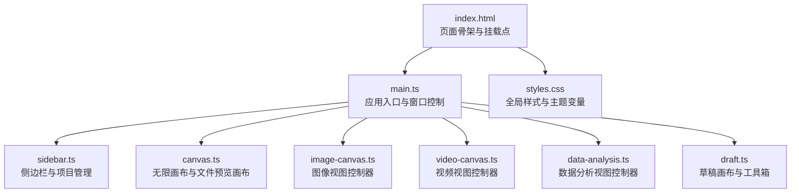
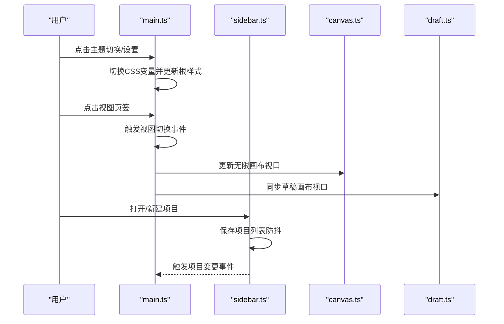
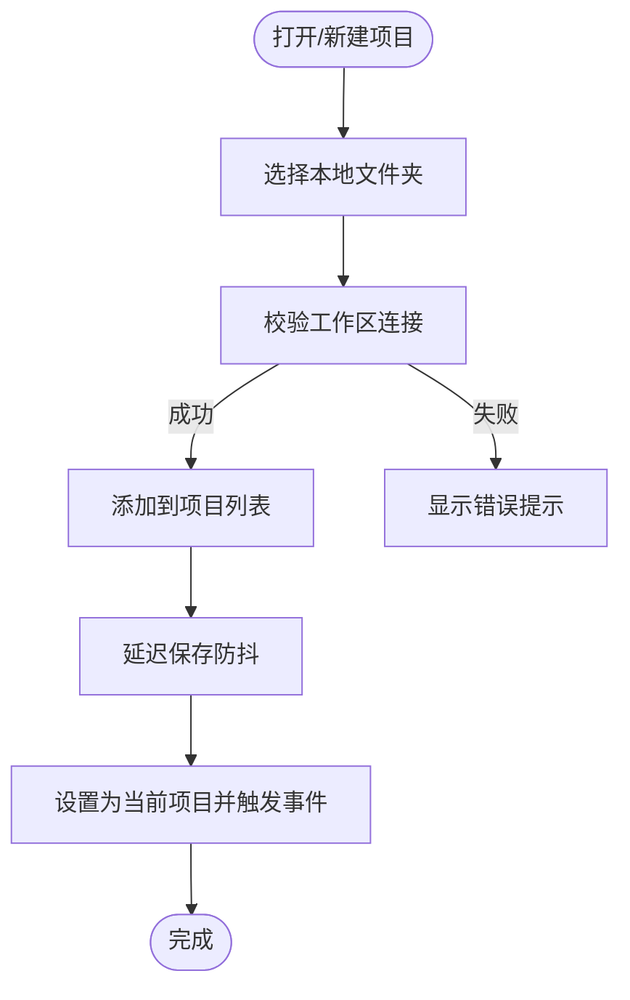
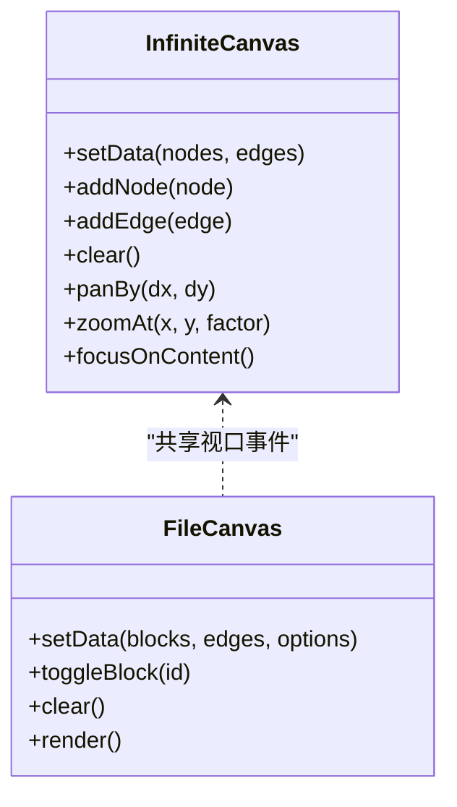
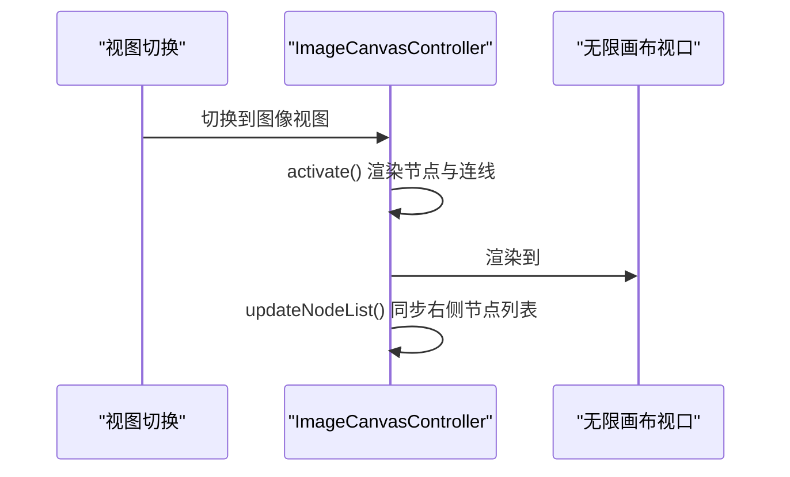
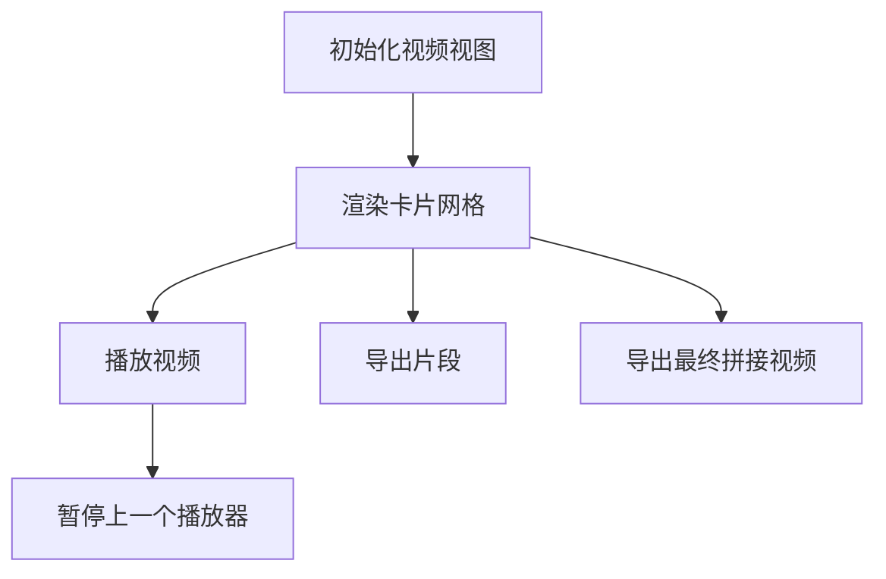
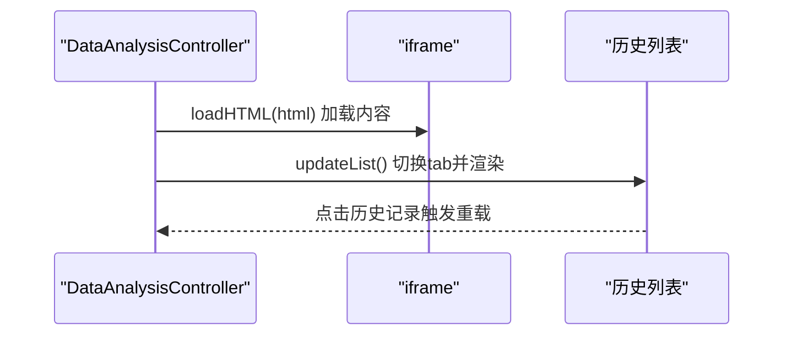
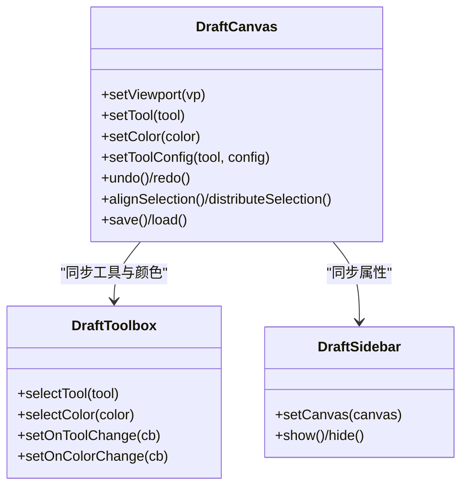
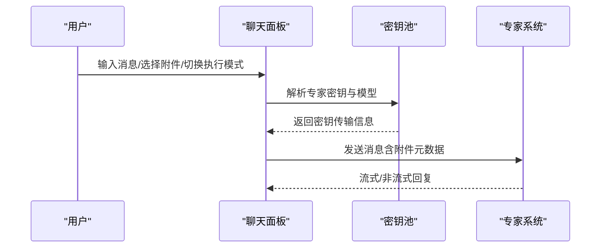
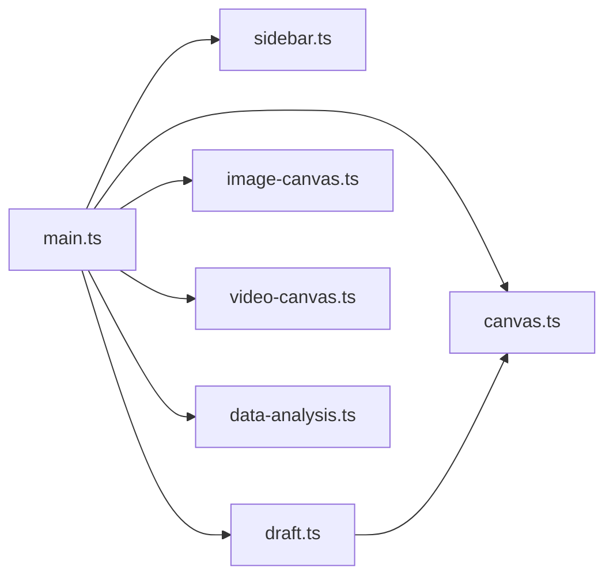

# UI组件系统

<cite>
**本文档引用的文件**
- [main.ts](file://ai-experts/src/main.ts)
- [sidebar.ts](file://ai-experts/src/sidebar.ts)
- [styles.css](file://ai-experts/src/styles.css)
- [index.html](file://ai-experts/index.html)
- [canvas.ts](file://ai-experts/src/canvas.ts)
- [image-canvas.ts](file://ai-experts/src/image-canvas.ts)
- [video-canvas.ts](file://ai-experts/src/video-canvas.ts)
- [data-analysis.ts](file://ai-experts/src/data-analysis.ts)
- [draft.ts](file://ai-experts/src/draft.ts)
</cite>

## 目录
1. [简介](#简介)
2. [项目结构](#项目结构)
3. [核心组件](#核心组件)
4. [架构总览](#架构总览)
5. [详细组件分析](#详细组件分析)
6. [依赖关系分析](#依赖关系分析)
7. [性能考量](#性能考量)
8. [故障排除指南](#故障排除指南)
9. [结论](#结论)
10. [附录](#附录)

## 简介
本文件面向星图专家团工作台的UI组件系统，系统采用前端框架与桌面端运行时结合的方式，围绕“无限画布 + 多视图面板 + 草稿系统”的架构组织UI功能。核心包括：
- 主界面组件：顶部标题栏、侧边栏项目管理、浮动视图页签、主内容区画布容器
- 画布系统：无限画布、文件预览画布、图像/视频/数据分析视图
- 草稿系统：高性能手绘画布、工具箱、属性栏、历史记录与图层管理
- 主题与可访问性：基于CSS变量的主题切换、键盘快捷键与无障碍交互
- 扩展与定制：模块化组件接口、可插拔视图、样式定制方案

## 项目结构
前端主要由入口脚本、HTML模板、样式表以及多个功能模块组成，采用模块化组织，便于按需加载与扩展。

**图表来源**
- [index.html:1-100](file://ai-experts/index.html#L1-L100)
- [main.ts:1-120](file://ai-experts/src/main.ts#L1-L120)
- [styles.css:1-120](file://ai-experts/src/styles.css#L1-L120)
- [sidebar.ts:1-120](file://ai-experts/src/sidebar.ts#L1-L120)
- [canvas.ts:1-120](file://ai-experts/src/canvas.ts#L1-L120)
- [image-canvas.ts:1-80](file://ai-experts/src/image-canvas.ts#L1-L80)
- [video-canvas.ts:1-80](file://ai-experts/src/video-canvas.ts#L1-L80)
- [data-analysis.ts:1-80](file://ai-experts/src/data-analysis.ts#L1-L80)
- [draft.ts:1-120](file://ai-experts/src/draft.ts#L1-L120)

**章节来源**
- [index.html:1-120](file://ai-experts/index.html#L1-L120)
- [main.ts:1-120](file://ai-experts/src/main.ts#L1-L120)
- [styles.css:1-120](file://ai-experts/src/styles.css#L1-L120)

## 核心组件
- 无限画布：支持缩放、平移、节点拖拽、连线渲染，自动定位到内容区域，与草稿画布共享视口变换
- 文件预览画布：文档块布局、树形/列布局、折叠展开、点击打开文件
- 图像视图：基于无限画布的节点与连线渲染，支持节点增删与列表同步
- 视频视图：卡片网格布局，播放器、状态徽章、导出按钮、进度条
- 数据分析视图：嵌入式iframe展示HTML结果，历史记录浏览
- 草稿系统：高性能Canvas渲染、双缓冲、历史记录、图层管理、工具箱与属性栏
- 侧边栏：项目列表、图标颜色、延迟保存、打开/新建项目对话框
- 主题系统：CSS变量驱动的深浅主题切换，动态更新根节点样式

**章节来源**
- [canvas.ts:1-200](file://ai-experts/src/canvas.ts#L1-L200)
- [image-canvas.ts:1-120](file://ai-experts/src/image-canvas.ts#L1-L120)
- [video-canvas.ts:1-120](file://ai-experts/src/video-canvas.ts#L1-L120)
- [data-analysis.ts:1-120](file://ai-experts/src/data-analysis.ts#L1-L120)
- [draft.ts:350-520](file://ai-experts/src/draft.ts#L350-L520)
- [sidebar.ts:26-120](file://ai-experts/src/sidebar.ts#L26-L120)
- [main.ts:260-360](file://ai-experts/src/main.ts#L260-L360)

## 架构总览
系统采用“模块化组件 + 事件驱动”的架构：
- 入口脚本负责窗口控制、菜单绑定、主题切换、设置页管理
- 画布与视图通过统一的事件机制进行切换与数据同步
- 草稿系统与主画布共享视口，实现右键平移与滚轮缩放联动

**图表来源**
- [main.ts:260-360](file://ai-experts/src/main.ts#L260-L360)
- [sidebar.ts:112-180](file://ai-experts/src/sidebar.ts#L112-L180)
- [canvas.ts:186-218](file://ai-experts/src/canvas.ts#L186-L218)
- [draft.ts:491-497](file://ai-experts/src/draft.ts#L491-L497)

## 详细组件分析

### 侧边栏设计与项目管理
- 功能要点
  - 项目列表渲染、图标颜色随机、延迟保存（防抖）
  - 打开/新建项目对话框，支持拖拽打开与数据库持久化
  - 项目激活后触发自定义事件，通知画布与聊天面板
- 数据持久化
  - 通过后端接口保存项目列表与状态，支持重启后恢复
- 用户交互
  - 双击重命名、右键菜单、点击切换、自动收起（展开状态下）

**图表来源**
- [sidebar.ts:194-370](file://ai-experts/src/sidebar.ts#L194-L370)

**章节来源**
- [sidebar.ts:26-120](file://ai-experts/src/sidebar.ts#L26-L120)
- [sidebar.ts:112-180](file://ai-experts/src/sidebar.ts#L112-L180)
- [sidebar.ts:371-462](file://ai-experts/src/sidebar.ts#L371-L462)

### 无限画布与文件预览画布
- 无限画布
  - 支持滚轮缩放、平移、节点拖拽、连线渲染
  - 自动定位到内容区域，避开左侧对话区
  - 与草稿画布共享视口事件，保持同步
- 文件预览画布
  - 文档块树形/列布局、折叠展开、点击打开文件
  - 内联Markdown渲染、HTML注入、事件绑定

**图表来源**
- [canvas.ts:30-316](file://ai-experts/src/canvas.ts#L30-L316)

**章节来源**
- [canvas.ts:1-200](file://ai-experts/src/canvas.ts#L1-L200)
- [canvas.ts:220-316](file://ai-experts/src/canvas.ts#L220-L316)

### 图像处理画布
- 设计要点
  - 复用无限画布的视口，渲染图像节点与连线
  - 提供节点增删、连线连接、状态查询与选择器
  - 与视图切换事件联动，激活/停用时渲染/清理
- 使用场景
  - 图像创作流程中的节点化编排与导出

**图表来源**
- [image-canvas.ts:24-80](file://ai-experts/src/image-canvas.ts#L24-L80)

**章节来源**
- [image-canvas.ts:1-120](file://ai-experts/src/image-canvas.ts#L1-L120)
- [image-canvas.ts:120-218](file://ai-experts/src/image-canvas.ts#L120-L218)

### 视频处理画布
- 设计要点
  - 卡片网格布局，每个镜头为独立卡片
  - 播放器、状态徽章、导出按钮、进度条
  - 支持批量设置镜头、更新状态、导出片段与最终拼接视频
- 交互特性
  - 防止多视频同时播放，自动暂停上一个播放器
  - 空状态提示与命令引导

**图表来源**
- [video-canvas.ts:16-80](file://ai-experts/src/video-canvas.ts#L16-L80)

**章节来源**
- [video-canvas.ts:1-120](file://ai-experts/src/video-canvas.ts#L1-L120)
- [video-canvas.ts:120-210](file://ai-experts/src/video-canvas.ts#L120-L210)
- [video-canvas.ts:210-273](file://ai-experts/src/video-canvas.ts#L210-L273)

### 数据可视化组件
- 设计要点
  - 嵌入式iframe承载HTML内容，支持动态加载与历史记录
  - 左侧浏览器tab切换“数据源/历史”，历史记录可点击重载
- 使用场景
  - 对话触发的数据分析结果展示与回溯

**图表来源**
- [data-analysis.ts:12-60](file://ai-experts/src/data-analysis.ts#L12-L60)

**章节来源**
- [data-analysis.ts:1-120](file://ai-experts/src/data-analysis.ts#L1-L120)
- [data-analysis.ts:120-138](file://ai-experts/src/data-analysis.ts#L120-L138)

### 草稿系统（高性能手绘画布）
- 核心能力
  - 双缓冲离屏Canvas渲染，避免闪烁与重复绘制
  - 高性能笔画、形状、便签、截图、小画布的交互与拖拽
  - 历史记录（撤销/重做）、图层管理、对齐与等间距分布
- 事件与快捷键
  - 右键平移、滚轮缩放转发至主画布
  - 工具快捷键（V/B/P/M/E/R/O/L/A/N等）、撤销/重做、删除、选择
- 数据持久化
  - 项目级草稿数据保存/加载，支持延迟保存

**图表来源**
- [draft.ts:350-520](file://ai-experts/src/draft.ts#L350-L520)
- [draft.ts:140-210](file://ai-experts/src/draft.ts#L140-L210)
- [draft.ts:2627-2802](file://ai-experts/src/draft.ts#L2627-L2802)

**章节来源**
- [draft.ts:1-200](file://ai-experts/src/draft.ts#L1-L200)
- [draft.ts:520-800](file://ai-experts/src/draft.ts#L520-L800)
- [draft.ts:800-1200](file://ai-experts/src/draft.ts#L800-L1200)
- [draft.ts:1200-1600](file://ai-experts/src/draft.ts#L1200-L1600)
- [draft.ts:1600-2000](file://ai-experts/src/draft.ts#L1600-L2000)
- [draft.ts:2000-2400](file://ai-experts/src/draft.ts#L2000-L2400)
- [draft.ts:2400-2802](file://ai-experts/src/draft.ts#L2400-L2802)

### 聊天界面与交互
- 功能要点
  - 历史记录下拉面板、新建对话、文件附件与执行模式
  - Slash命令面板（图像/视频），文件选择与多模态附件
  - 错误提示Toast、文件大小格式化、附件类型识别
- 与密钥池集成
  - 根据专家ID解析绑定密钥与模型，支持多模态能力筛选

**图表来源**
- [main.ts:532-695](file://ai-experts/src/main.ts#L532-L695)

**章节来源**
- [main.ts:532-757](file://ai-experts/src/main.ts#L532-L757)

## 依赖关系分析
- 模块耦合
  - main.ts作为中枢，依赖sidebar、canvas、draft等模块
  - 草稿系统与无限画布通过视口事件耦合，保证交互一致性
  - 各视图控制器（图像/视频/数据分析）通过视图切换事件与主画布协同
- 外部依赖
  - Tauri后端提供文件系统、对话与专家系统调用
  - highlight.js用于代码高亮（在文件预览中使用）

**图表来源**
- [main.ts:1-47](file://ai-experts/src/main.ts#L1-L47)
- [canvas.ts:1-30](file://ai-experts/src/canvas.ts#L1-L30)
- [draft.ts:1-10](file://ai-experts/src/draft.ts#L1-L10)

**章节来源**
- [main.ts:1-47](file://ai-experts/src/main.ts#L1-L47)

## 性能考量
- 画布渲染优化
  - 草稿画布采用双缓冲离屏Canvas，仅在offscreenDirty时重绘，减少主Canvas绘制压力
  - 视口裁剪：仅绘制在视口范围内的笔画与形状，降低绘制成本
  - requestAnimationFrame调度渲染，避免重复绘制
- 事件与交互
  - 侧边栏项目保存采用防抖（500ms），减少频繁IO
  - 无限画布缩放与平移使用事件委托与坐标转换优化
- 资源加载
  - 代码高亮样式按需引入，避免不必要的资源占用

**章节来源**
- [draft.ts:1714-1851](file://ai-experts/src/draft.ts#L1714-L1851)
- [draft.ts:1853-1884](file://ai-experts/src/draft.ts#L1853-L1884)
- [sidebar.ts:139-143](file://ai-experts/src/sidebar.ts#L139-L143)

## 故障排除指南
- 主题切换无效
  - 检查CSS变量是否正确更新，确认根节点样式是否生效
  - 确认设置页主题开关与应用状态一致
- 项目打开失败
  - 校验工作区连接，查看错误提示；必要时重新选择项目目录
  - 确认数据库保存/加载流程未抛出异常
- 画布无法缩放/平移
  - 检查鼠标滚轮事件与mosemove/mouseup事件绑定
  - 确认视口事件是否正确转发至草稿画布
- 草稿保存失败
  - 检查Tauri后端save_draft/load_draft接口调用
  - 查看控制台错误日志，确认JSON序列化/反序列化过程

**章节来源**
- [main.ts:260-360](file://ai-experts/src/main.ts#L260-L360)
- [sidebar.ts:391-422](file://ai-experts/src/sidebar.ts#L391-L422)
- [draft.ts:2390-2421](file://ai-experts/src/draft.ts#L2390-L2421)

## 结论
UI组件系统以模块化与事件驱动为核心，围绕无限画布构建了多视图协同的工作台。通过高性能渲染、完善的交互与主题系统，满足专家团在复杂项目中的可视化与协作需求。草稿系统进一步增强了创作与编辑体验，配合侧边栏与聊天面板形成完整的开发工作流。

## 附录
- 扩展接口
  - 视图控制器均暴露公共API（如addSegment、updateSegment、getState等），便于外部模块调用
  - 草稿系统提供工具箱与属性栏的事件回调，支持自定义工具与参数
- 自定义组件开发
  - 基于现有画布基类（InfiniteCanvas/FileCanvas）扩展新视图
  - 通过事件机制（view-changed、canvas-viewport-changed）与主系统集成
- 样式定制方案
  - 使用CSS变量统一管理主题色板与层级样式
  - 通过类名与布局容器（flex/grid）组合实现响应式布局
- 性能优化策略
  - 优先采用离屏Canvas与视口裁剪
  - 控制事件频率（防抖/节流）与批处理更新
- 动画与用户体验
  - 平滑缩放与过渡（scale元素文本更新）
  - 键盘快捷键提升效率，右键平移增强画布操控
- 使用案例
  - 图像创作：通过图像视图控制器添加节点与连线，实时预览
  - 视频创作：使用视频视图控制器批量设置镜头，逐个导出与拼接
  - 数据分析：将HTML结果注入iframe，支持历史记录回溯