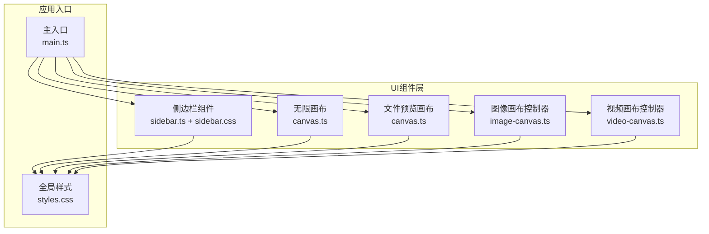
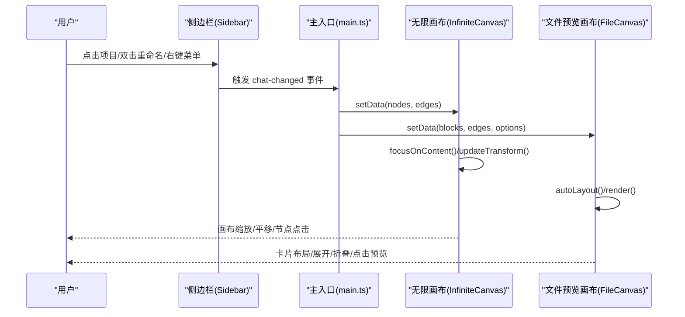
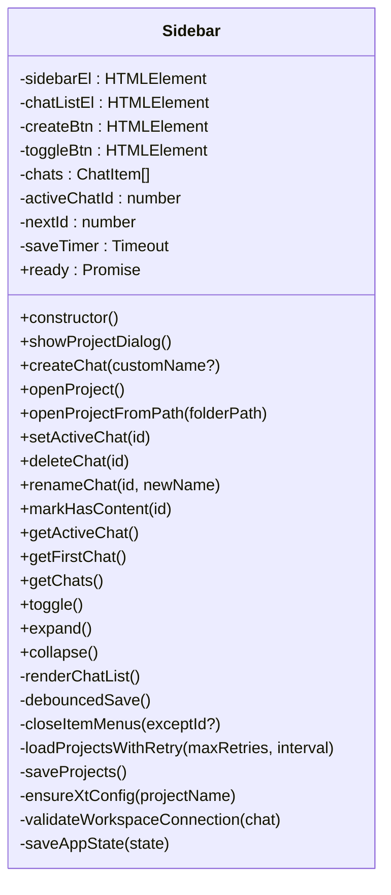
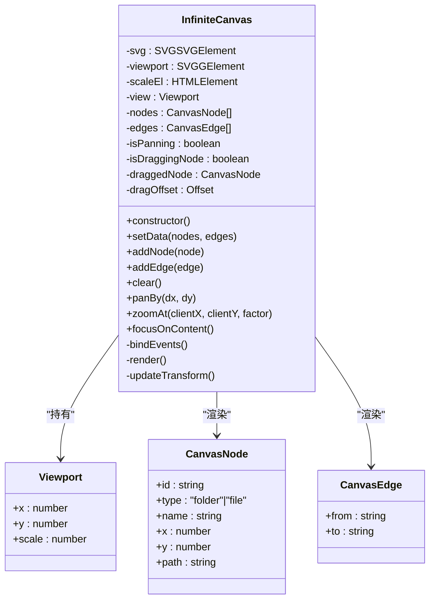
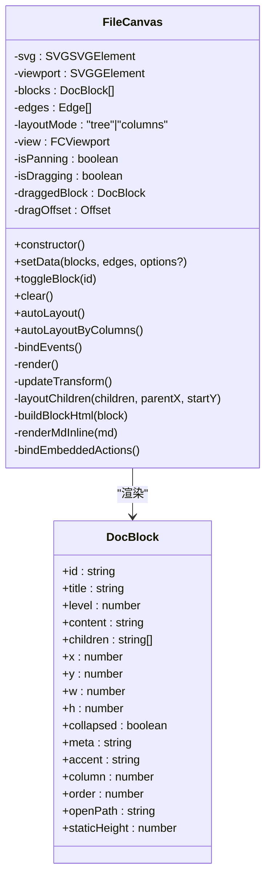
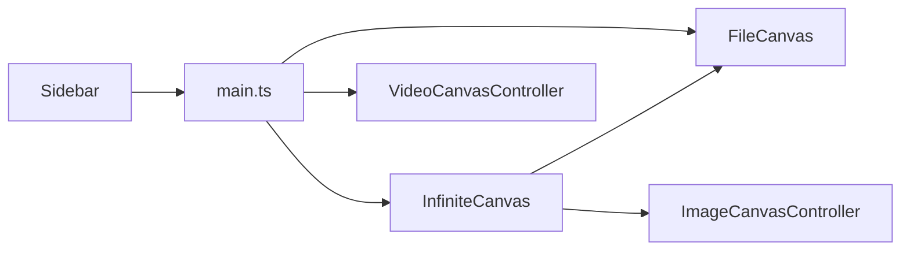

# UI组件系统

<cite>
**本文档引用的文件**
- [sidebar.ts](file://src/sidebar.ts)
- [sidebar.css](file://src/sidebar.css)
- [canvas.ts](file://src/canvas.ts)
- [image-canvas.ts](file://src/image-canvas.ts)
- [video-canvas.ts](file://src/video-canvas.ts)
- [main.ts](file://src/main.ts)
- [styles.css](file://src/styles.css)
</cite>

## 目录
1. [简介](#简介)
2. [项目结构](#项目结构)
3. [核心组件](#核心组件)
4. [架构总览](#架构总览)
5. [详细组件分析](#详细组件分析)
6. [依赖分析](#依赖分析)
7. [性能考虑](#性能考虑)
8. [故障排查指南](#故障排查指南)
9. [结论](#结论)
10. [附录](#附录)

## 简介
本文件面向UI组件系统，重点覆盖侧边栏组件与Canvas系统两大模块。侧边栏负责项目管理与导航，Canvas系统提供无限画布、文件预览画布以及视频创作视图。文档将从视觉外观、行为与交互、属性/事件/插槽/自定义选项、使用示例、响应式与无障碍、状态/动画/过渡、样式定制与主题、跨浏览器与性能优化、组件组合与集成等方面进行全面阐述。

## 项目结构
- 侧边栏：位于 src/sidebar.ts 与 src/sidebar.css，提供项目列表、创建/打开项目、重命名/删除、展开/收起等能力。
- Canvas系统：位于 src/canvas.ts，提供无限画布（节点/连线）、文件预览画布（DocBlock布局）、图像画布控制器、视频创作视图控制器。
- 主入口：src/main.ts 负责初始化、事件绑定、视图切换与错误提示等。
- 样式：src/styles.css 提供全局主题变量与响应式断点，支撑侧边栏与Canvas的视觉一致性。



图表来源
- [sidebar.ts:26-629](file://src/sidebar.ts#L26-L629)
- [sidebar.css:1-395](file://src/sidebar.css#L1-L395)
- [canvas.ts:30-664](file://src/canvas.ts#L30-L664)
- [image-canvas.ts:24-218](file://src/image-canvas.ts#L24-L218)
- [video-canvas.ts:16-273](file://src/video-canvas.ts#L16-L273)
- [main.ts:1-800](file://src/main.ts#L1-L800)
- [styles.css:1-800](file://src/styles.css#L1-L800)

章节来源
- [sidebar.ts:1-629](file://src/sidebar.ts#L1-L629)
- [sidebar.css:1-395](file://src/sidebar.css#L1-L395)
- [canvas.ts:1-664](file://src/canvas.ts#L1-L664)
- [image-canvas.ts:1-218](file://src/image-canvas.ts#L1-L218)
- [video-canvas.ts:1-273](file://src/video-canvas.ts#L1-L273)
- [main.ts:1-800](file://src/main.ts#L1-L800)
- [styles.css:1-800](file://src/styles.css#L1-L800)

## 核心组件
- 侧边栏组件（Sidebar）
  - 角色：项目管理与导航，支持创建/打开项目、重命名/删除、展开/收起、活跃项目切换与持久化。
  - 关键接口：构造函数、createChat、openProject、openProjectFromPath、setActiveChat、deleteChat、renameChat、markHasContent、getActiveChat、getFirstChat、getChats、toggle、expand、collapse。
  - 交互：点击项目切换、双击重命名、右键菜单操作、点击空白处关闭菜单。
  - 数据：ChatItem数组、活跃项目ID、图标色彩板、延时保存（防抖）。
- 无限画布（InfiniteCanvas）
  - 角色：无限缩放/平移的节点/连线画布，支持聚焦到内容区域、同步视口变化。
  - 关键接口：setData、addNode、addEdge、clear、panBy、zoomAt、focusOnContent。
  - 交互：滚轮缩放、鼠标拖拽平移、节点拖拽、点击节点打开预览。
- 文件预览画布（FileCanvas）
  - 角色：DocBlock卡片网格布局，支持树形/列布局、折叠/展开、连线渲染、点击打开预览。
  - 关键接口：setData、toggleBlock、clear、autoLayout、autoLayoutByColumns。
  - 交互：拖拽节点、滚轮缩放、点击展开/折叠、点击卡片打开预览。
- 图像画布控制器（ImageCanvasController）
  - 角色：基于现有画布的图像节点/连线渲染，支持激活/去激活、节点列表联动。
  - 关键接口：addNode、connect、removeNode、getState、setSelection、getSelection。
- 视频画布控制器（VideoCanvasController）
  - 角色：视频创作视图的卡片网格，支持生成状态管理、导出片段与最终视频。
  - 关键接口：addSegment、setSegments、updateSegment、removeSegment、clearSegments、getState、getSegments、loadState、exportFinal。

章节来源
- [sidebar.ts:26-629](file://src/sidebar.ts#L26-L629)
- [canvas.ts:30-664](file://src/canvas.ts#L30-L664)
- [image-canvas.ts:24-218](file://src/image-canvas.ts#L24-L218)
- [video-canvas.ts:16-273](file://src/video-canvas.ts#L16-L273)

## 架构总览
侧边栏与Canvas系统通过事件与DOM协作实现松耦合集成。侧边栏负责项目生命周期与活跃状态，Canvas系统负责可视化呈现与交互。主入口负责初始化与事件桥接。



图表来源
- [sidebar.ts:372-389](file://src/sidebar.ts#L372-L389)
- [main.ts:239-242](file://src/main.ts#L239-L242)
- [canvas.ts:220-246](file://src/canvas.ts#L220-L246)
- [canvas.ts:434-444](file://src/canvas.ts#L434-L444)

章节来源
- [sidebar.ts:372-389](file://src/sidebar.ts#L372-L389)
- [main.ts:239-242](file://src/main.ts#L239-L242)
- [canvas.ts:220-246](file://src/canvas.ts#L220-L246)
- [canvas.ts:434-444](file://src/canvas.ts#L434-L444)

## 详细组件分析

### 侧边栏组件（Sidebar）
- 视觉外观
  - 默认收起宽度44px，展开宽度240px；顶部新建按钮、底部切换按钮；对话项图标与名称；悬停/激活态样式；滚动条美化。
- 行为与交互
  - 展开/收起：点击切换按钮；点击项目在展开状态下自动收起。
  - 项目操作：右键菜单支持重命名/从列表移除；双击进入重命名输入框；输入回车或失焦保存。
  - 打开/创建：统一弹窗，支持打开已有项目（文件夹选择）与新建项目（名称/目录）。
  - 活跃项目：持久化记录 lastProjectId，启动时恢复；工作区连接验证。
- 属性/事件/插槽/自定义选项
  - 属性：无公开类属性（内部状态通过方法访问）。
  - 事件：chat-changed（切换活跃项目）、show-error（错误提示）。
  - 插槽：无（通过DOM结构与CSS类名组织）。
  - 自定义选项：图标色彩板（柔和不刺眼）；项目名称去重策略；延时保存（防抖）。
- 使用示例
  - 打开项目对话框：调用 showProjectDialog()。
  - 创建新项目：调用 createChat(customName?)。
  - 打开已有项目：调用 openProject() 或 openProjectFromPath(path)。
  - 设置活跃项目：setActiveChat(id)。
  - 删除项目：deleteChat(id)。
  - 重命名：renameChat(id, newName)。
  - 标记有内容：markHasContent(id)。
  - 获取当前/首个/全部项目：getActiveChat()、getFirstChat()、getChats()。
  - 展开/收起：toggle()、expand()、collapse()。
- 响应式与无障碍
  - 响应式：收起状态下隐藏文本；展开时显示按钮文字与名称；滚动条隐藏/显示。
  - 无障碍：按钮具备title与可访问性语义；菜单通过键盘可访问。
- 状态/动画/过渡
  - 状态：expanded（展开）、active（当前项目）、hover（悬停）、open（菜单展开）。
  - 动画/过渡：宽度切换0.2s；按钮hover背景/颜色过渡；滚动条美化。
- 样式定制与主题
  - 主题变量：--surface-sidebar、--accent-soft、--text-primary/secondary等；暗/亮主题切换。
  - 自定义：通过修改CSS变量与类名覆盖默认样式。
- 跨浏览器与性能
  - 事件委托与防抖：减少频繁保存与重绘。
  - DOM操作最小化：批量重建列表与延迟保存。
- 组件组合与集成
  - 与主入口：通过事件 chat-changed 与 show-error 与主流程集成。
  - 与Canvas：提供活跃项目信息，触发数据加载与视图更新。



图表来源
- [sidebar.ts:26-629](file://src/sidebar.ts#L26-L629)

章节来源
- [sidebar.ts:26-629](file://src/sidebar.ts#L26-L629)
- [sidebar.css:1-395](file://src/sidebar.css#L1-L395)

### 无限画布（InfiniteCanvas）
- 视觉外观
  - 节点：圆形图标+标签；连线：箭头样式；视口控制：缩放百分比显示。
- 行为与交互
  - 缩放：滚轮按鼠标位置缩放，限制缩放范围。
  - 平移：鼠标拖拽平移。
  - 节点拖拽：点击节点后拖拽更新节点位置。
  - 聚焦：focusOnContent() 自动适配内容区域，避开左侧对话区。
  - 视口同步：updateTransform() 同步视口到草稿画布。
- 属性/事件/插槽/自定义选项
  - 属性：nodes、edges、view（x,y,scale）。
  - 事件：canvas-viewport-changed（视口变化）。
  - 插槽：无。
  - 自定义选项：NODE_COLORS（文件/文件夹颜色）、NODE_RADIUS、缩放范围与适配策略。
- 使用示例
  - 初始化：initCanvas()。
  - 设置数据：setData(nodes, edges)。
  - 添加节点/连线：addNode(node)、addEdge(edge)。
  - 清空：clear()。
  - 平移/缩放：panBy(dx, dy)、zoomAt(clientX, clientY, factor)。
  - 聚焦：focusOnContent()。
- 响应式与无障碍
  - 响应式：视口适配容器尺寸；缩放范围限制。
  - 无障碍：鼠标交互为主，建议补充键盘快捷键。
- 状态/动画/过渡
  - 状态：panning/draggingNode。
  - 动画/过渡：transform变换与缩放百分比更新。
- 样式定制与主题
  - 主题变量：--surface-panel、--text-primary等；SVG元素颜色继承。
- 跨浏览器与性能
  - 事件节流：mousemove统一处理；requestAnimationFrame用于渲染调度。
  - DOM最小化：一次性innerHTML清空与重建。
- 组件组合与集成
  - 与主入口：通过事件同步视口；与FileCanvas共享SVG viewport。



图表来源
- [canvas.ts:30-302](file://src/canvas.ts#L30-L302)

章节来源
- [canvas.ts:30-302](file://src/canvas.ts#L30-L302)

### 文件预览画布（FileCanvas）
- 视觉外观
  - DocBlock卡片：标题、元信息、正文（Markdown内联渲染）、折叠/展开控件。
  - 连线：从父块底部到子块顶部的直线。
- 行为与交互
  - 布局：树形布局或列布局（column字段）；自动计算位置与高度。
  - 折叠/展开：toggleBlock(id)；展开时预留更高空间。
  - 预览：点击卡片或展开按钮触发预览。
- 属性/事件/插槽/自定义选项
  - 属性：blocks、edges、layoutMode（tree/columns）。
  - 事件：无（通过回调与DOM事件）。
  - 插槽：无。
  - 自定义选项：BLOCK_WIDTH/BLOCK_MIN_HEIGHT/BLOCK_COLLAPSED_HEIGHT、间隙与列排序。
- 使用示例
  - 设置数据：setData(blocks, edges, { layout? }).
  - 折叠/展开：toggleBlock(id).
  - 清空：clear().
- 响应式与无障碍
  - 响应式：列布局随窗口宽度变化；文本截断避免重叠。
  - 无障碍：点击区域明确，建议补充键盘导航。
- 状态/动画/过渡
  - 状态：collapsed/expanded；布局计算。
  - 动画/过渡：无（静态布局）。
- 样式定制与主题
  - 主题变量：--surface-panel、--text-primary等；卡片阴影与边框。
- 跨浏览器与性能
  - DOM最小化：一次性清空与重建；异步绑定事件。
- 组件组合与集成
  - 与主入口：通过事件触发预览；与无限画布共享SVG viewport。



图表来源
- [canvas.ts:351-664](file://src/canvas.ts#L351-L664)

章节来源
- [canvas.ts:351-664](file://src/canvas.ts#L351-L664)

### 图像画布控制器（ImageCanvasController）
- 视觉外观
  - 图像节点：矩形背景+图片+标签；连线为贝塞尔曲线箭头。
- 行为与交互
  - 激活/去激活：根据视图切换决定是否渲染。
  - 节点渲染：在现有 #canvas-viewport 中叠加SVG元素。
  - 节点列表：右侧节点列表联动更新。
- 属性/事件/插槽/自定义选项
  - 属性：nodes、connections、svgElements、active。
  - 事件：无。
  - 插槽：无。
  - 自定义选项：节点尺寸、连线样式。
- 使用示例
  - 添加节点：addNode(src, label, x?, y?).
  - 连接：connect(fromId, toId, label?).
  - 删除：removeNode(id).
  - 获取状态：getState().
- 响应式与无障碍
  - 响应式：节点尺寸固定；交互为鼠标点击。
  - 无障碍：建议补充键盘操作与ARIA标签。
- 状态/动画/过渡
  - 状态：active/inactive；渲染元素集合。
  - 动画/过渡：无。
- 样式定制与主题
  - 主题变量：--surface-panel、--text-primary等；深色背景与描边。
- 跨浏览器与性能
  - DOM最小化：清空后重建；事件绑定异步。
- 组件组合与集成
  - 与主入口：通过全局API暴露；与无限画布共享viewport。

```mermaid
classDiagram
class ImageCanvasController {
-nodes : ImageNode[]
-connections : ImageConnection[]
-svgElements : SVGElement[]
-active : boolean
+constructor()
+addNode(src, label, x?, y?) : string
+connect(fromId, toId, label?)
+removeNode(id)
+getState() : {nodes, connections}
+setSelection(rect)
+getSelection() : Rect|null
-activate()
-deactivate()
-render()
-clearRendered()
-updateNodeList()
-bindEvents()
}
class ImageNode {
+id : string
+x : number
+y : number
+label : string
+src : string
+width : number
+height : number
}
class ImageConnection {
+id : string
+fromId : string
+toId : string
+label : string
}
ImageCanvasController --> ImageNode : "管理"
ImageCanvasController --> ImageConnection : "管理"
```

图表来源
- [image-canvas.ts:24-218](file://src/image-canvas.ts#L24-L218)

章节来源
- [image-canvas.ts:24-218](file://src/image-canvas.ts#L24-L218)

### 视频画布控制器（VideoCanvasController）
- 视觉外观
  - 视频片段卡片：占位图/播放器、状态徽章、时长、导出按钮、进度条、错误提示。
- 行为与交互
  - 状态管理：pending/generating/done/error。
  - 导出：单片段导出；最终拼接导出。
  - 播放控制：互斥播放，避免多视频同时播放。
- 属性/事件/插槽/自定义选项
  - 属性：segments、active、currentPlayingId。
  - 事件：无。
  - 插槽：无。
  - 自定义选项：状态徽章文案与样式。
- 使用示例
  - 添加片段：addSegment(label, description?).
  - 设置片段：setSegments([{label, description?}]).
  - 更新状态：updateSegment(id, update).
  - 清空：clearSegments().
  - 导出：exportFinal().
- 响应式与无障碍
  - 响应式：卡片网格自适应；播放器controlslist禁用下载。
  - 无障碍：建议补充播放/暂停按钮的ARIA标签。
- 状态/动画/过渡
  - 状态：generating/done/error；进度条填充。
  - 动画/过渡：无。
- 样式定制与主题
  - 主题变量：--surface-panel、--text-primary等。
- 跨浏览器与性能
  - DOM最小化：清空后重建；事件绑定异步。
- 组件组合与集成
  - 与主入口：通过全局API暴露；导出事件由主入口处理。

```mermaid
classDiagram
class VideoCanvasController {
-segments : VideoSegment[]
-active : boolean
-currentPlayingId : string
+constructor()
+addSegment(label, description?) : string
+setSegments(segments) : string[]
+updateSegment(id, update)
+removeSegment(id)
+clearSegments()
+getState() : {segments}
+getSegments() : VideoSegment[]
+loadState(segments)
+exportFinal()
-activate()
-deactivate()
-stopAllPlayers()
-renderCardGrid()
-buildSegmentCard(seg) : HTMLElement
-statusBadge(status) : string
-clearCardGrid()
-exportSegment(id)
-bindEvents()
}
class VideoSegment {
+id : string
+label : string
+description : string
+videoUrl : string
+duration : number
+thumbnail : string
+status : "pending"|"generating"|"done"|"error"
+error : string
}
VideoCanvasController --> VideoSegment : "管理"
```

图表来源
- [video-canvas.ts:16-273](file://src/video-canvas.ts#L16-L273)

章节来源
- [video-canvas.ts:16-273](file://src/video-canvas.ts#L16-L273)

## 依赖分析
- 组件耦合
  - Sidebar 与 main.ts 通过事件通信；Sidebar 与 Canvas 通过数据与事件协作。
  - InfiniteCanvas 与 FileCanvas 共享 SVG viewport；ImageCanvasController 与 Canvas 共享 viewport。
  - VideoCanvasController 与 main.ts 通过导出事件协作。
- 外部依赖
  - @tauri-apps/api：invoke、listen、window等；用于与Rust后端通信与窗口控制。
  - highlight.js：代码高亮（在主入口引入）。
- 潜在循环依赖
  - 无直接循环依赖；事件驱动降低耦合。



图表来源
- [sidebar.ts:372-389](file://src/sidebar.ts#L372-L389)
- [main.ts:239-242](file://src/main.ts#L239-L242)
- [canvas.ts:30-302](file://src/canvas.ts#L30-L302)
- [image-canvas.ts:24-218](file://src/image-canvas.ts#L24-L218)
- [video-canvas.ts:16-273](file://src/video-canvas.ts#L16-L273)

章节来源
- [sidebar.ts:372-389](file://src/sidebar.ts#L372-L389)
- [main.ts:1-800](file://src/main.ts#L1-L800)
- [canvas.ts:30-302](file://src/canvas.ts#L30-L302)
- [image-canvas.ts:24-218](file://src/image-canvas.ts#L24-L218)
- [video-canvas.ts:16-273](file://src/video-canvas.ts#L16-L273)

## 性能考虑
- 事件与渲染
  - 侧边栏：防抖保存（setTimeout + clearTimeout），减少频繁写入。
  - 无限画布：一次性innerHTML清空与重建，避免逐项DOM操作。
  - 文件预览画布：异步绑定事件，避免阻塞渲染。
  - 图像画布控制器：清空后重建SVG元素，减少重复DOM。
  - 视频画布：清空后重建卡片网格，避免逐项更新。
- 视口与坐标
  - 无限画布：updateTransform统一更新viewport与scale显示；草稿画布同步视口。
  - 文件预览画布：autoLayout按需计算，避免重复布局。
- 资源与网络
  - 视频播放：互斥播放，避免资源竞争。
  - 图像渲染：SVG image元素按需加载，preserveAspectRatio保证显示质量。
- 建议
  - 大数据量场景：考虑虚拟滚动（侧边栏）、分批渲染（画布）。
  - 事件节流：mousemove与wheel事件可进一步节流/去抖。
  - 懒加载：图片/视频按需加载，减少初始渲染压力。

[本节为通用性能指导，无需特定文件引用]

## 故障排查指南
- 侧边栏
  - 无法加载项目：检查数据库初始化状态与重试机制；查看控制台错误与show-error事件。
  - 工作区连接异常：validate_workspace_connection失败时延迟显示错误提示。
  - 项目删除后重启恢复：确保saveProjects同步projects.json。
- 无限画布
  - 无节点时聚焦：focusOnContent()设置默认偏移位置。
  - 视口不同步：检查updateTransform与canvas-viewport-changed事件。
- 文件预览画布
  - 布局异常：检查layoutMode与column/order排序；确认autoLayoutByColumns。
  - 预览不生效：确认openPath与点击事件绑定。
- 图像画布控制器
  - 未激活渲染：检查view-changed事件与activate/deactivate。
- 视频画布
  - 导出失败：确认blob URL与下载链接；最终导出通过全局事件触发。

章节来源
- [sidebar.ts:391-411](file://src/sidebar.ts#L391-L411)
- [sidebar.ts:424-462](file://src/sidebar.ts#L424-L462)
- [canvas.ts:134-184](file://src/canvas.ts#L134-L184)
- [canvas.ts:186-199](file://src/canvas.ts#L186-L199)
- [canvas.ts:434-444](file://src/canvas.ts#L434-L444)
- [image-canvas.ts:34-48](file://src/image-canvas.ts#L34-L48)
- [video-canvas.ts:166-177](file://src/video-canvas.ts#L166-L177)
- [video-canvas.ts:179-183](file://src/video-canvas.ts#L179-L183)

## 结论
本UI组件系统以侧边栏为核心入口，配合Canvas系统实现强大的可视化与交互体验。通过事件驱动与模块化设计，系统具备良好的可扩展性与可维护性。建议在大数据量场景下进一步优化渲染与事件处理，并补充键盘与无障碍支持，以提升用户体验与可访问性。

[本节为总结性内容，无需特定文件引用]

## 附录
- 响应式设计要点
  - 使用CSS变量与媒体查询适配不同窗口宽度；侧边栏在窄屏下隐藏文本与按钮文字。
  - 画布与卡片布局随窗口宽度动态调整。
- 主题支持
  - 通过 :root[data-theme="dark"/"light"] 切换主题；全局变量统一控制颜色与阴影。
- 无障碍建议
  - 为按钮与菜单补充title与ARIA属性；为可交互元素提供键盘操作路径。
- 跨浏览器兼容
  - 使用标准DOM API与CSS变量；SVG渲染在主流浏览器中表现稳定。
- 最佳实践
  - 使用防抖与节流优化高频事件；最小化DOM操作；合理拆分模块职责。

[本节为通用指导，无需特定文件引用]