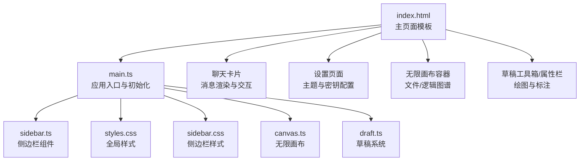
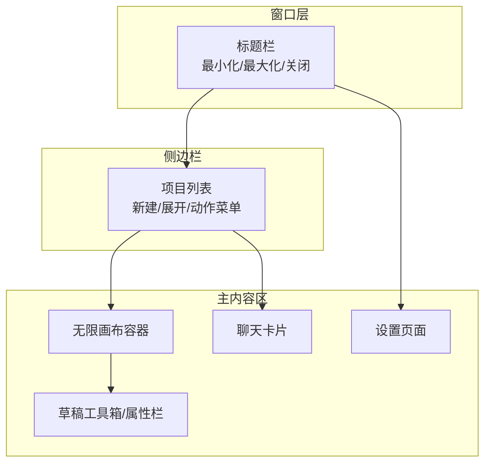
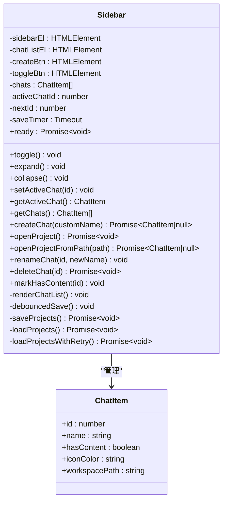
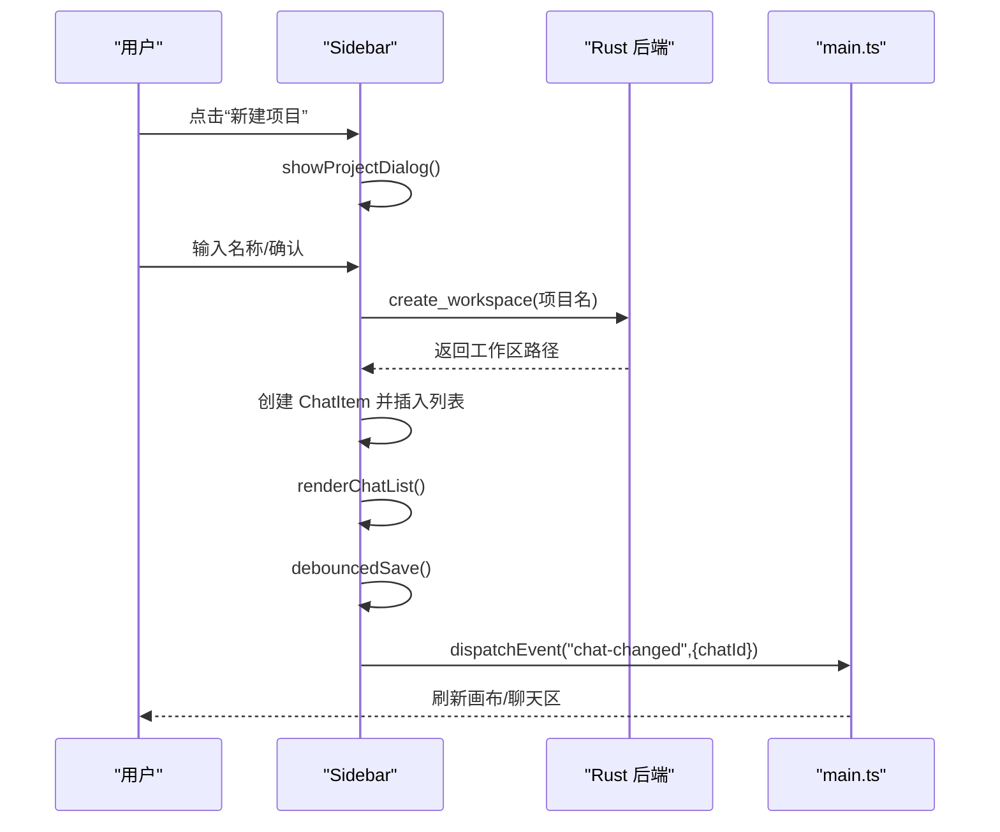
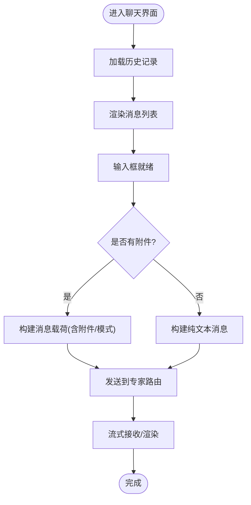
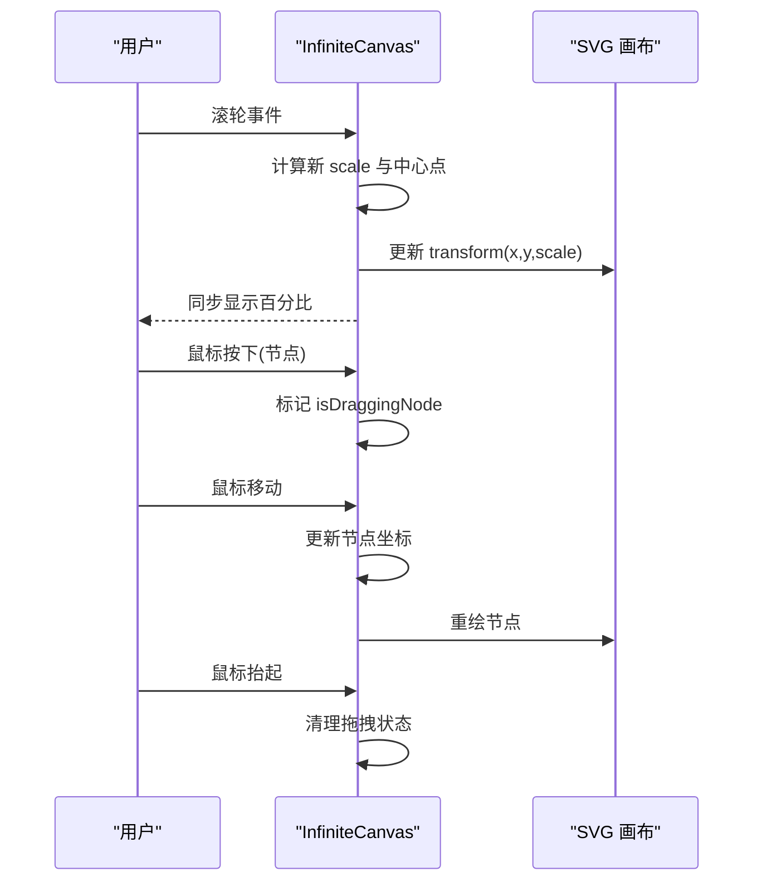
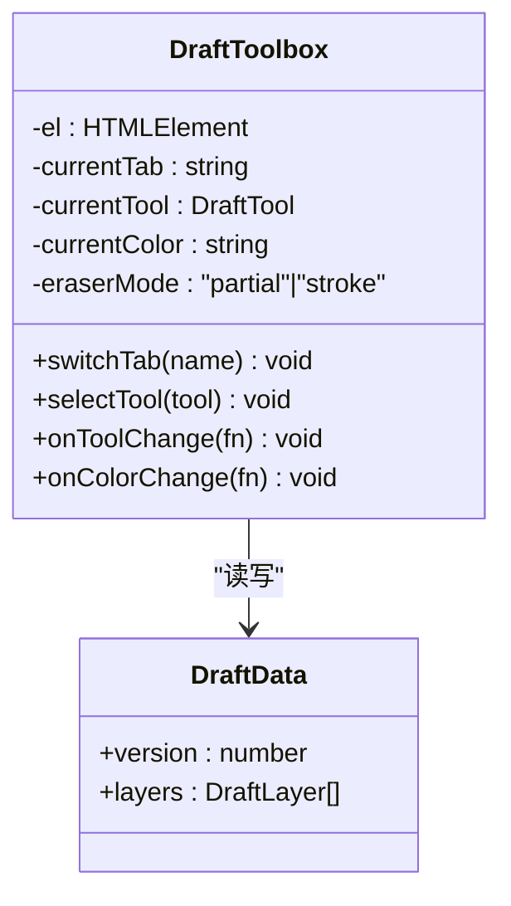
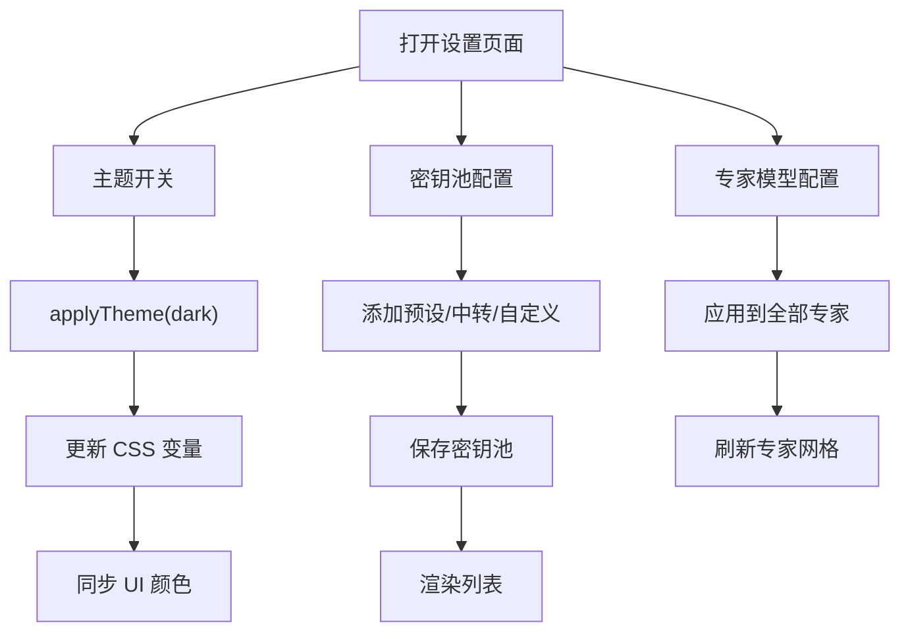
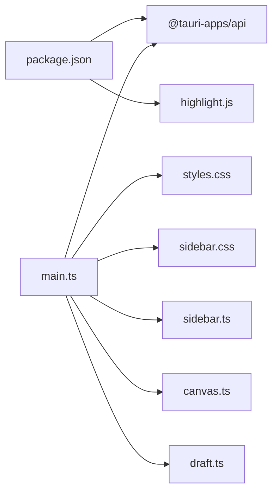

# 主界面组件

<cite>
**本文引用的文件**
- [main.ts](file://ai-experts/src/main.ts)
- [sidebar.ts](file://ai-experts/src/sidebar.ts)
- [sidebar.css](file://ai-experts/src/sidebar.css)
- [styles.css](file://ai-experts/src/styles.css)
- [canvas.ts](file://ai-experts/src/canvas.ts)
- [draft.ts](file://ai-experts/src/draft.ts)
- [index.html](file://ai-experts/index.html)
- [package.json](file://ai-experts/package.json)
</cite>

## 目录
1. [简介](#简介)
2. [项目结构](#项目结构)
3. [核心组件](#核心组件)
4. [架构总览](#架构总览)
5. [详细组件分析](#详细组件分析)
6. [依赖关系分析](#依赖关系分析)
7. [性能考量](#性能考量)
8. [故障排查指南](#故障排查指南)
9. [结论](#结论)
10. [附录](#附录)

## 简介
本文件面向“星图专家团工作台”的主界面组件，系统性梳理侧边栏、聊天界面、无限画布与草稿系统、设置页面等核心 UI 的设计架构、交互逻辑与状态管理。文档同时覆盖 CSS 样式体系、主题定制与响应式布局，并总结组件间通信机制、状态同步与数据流管理，提供可扩展的开发指引与性能优化策略。

## 项目结构
主界面由 HTML 模板与 TypeScript/SCSS 构成，采用 Tauri 作为原生外壳，前端负责 UI 与交互，Rust 后端提供文件系统、对话路由与持久化能力。核心入口为 HTML 页面，样式通过全局样式与侧边栏专用样式组织，运行时由 main.ts 初始化窗口、事件与主题，并协调各子系统。

图表来源
- [index.html:1-120](file://ai-experts/index.html#L1-L120)
- [main.ts:1-120](file://ai-experts/src/main.ts#L1-L120)
- [styles.css:1-120](file://ai-experts/src/styles.css#L1-L120)
- [sidebar.css:1-60](file://ai-experts/src/sidebar.css#L1-L60)
- [canvas.ts:1-60](file://ai-experts/src/canvas.ts#L1-L60)
- [draft.ts:1-60](file://ai-experts/src/draft.ts#L1-L60)

章节来源
- [index.html:1-120](file://ai-experts/index.html#L1-L120)
- [package.json:1-28](file://ai-experts/package.json#L1-L28)

## 核心组件
- 侧边栏组件：项目管理、展开/收起、新建/打开项目、重命名、删除、活跃项目切换与持久化。
- 聊天界面：历史记录、消息渲染、输入与附件、执行方式（普通/计划/目标）、Slash 命令面板。
- 无限画布：缩放/平移、节点拖拽、聚焦适配、图谱展示。
- 草稿系统：工具箱、笔刷/形状/注释/截图/小画布、撤销重做、视口同步。
- 设置页面：主题切换、密钥池配置（预设/中转/自定义）、专家模型配置。
- 样式系统：CSS 变量主题、响应式布局、滚动条美化、卡片化 UI。

章节来源
- [sidebar.ts:26-120](file://ai-experts/src/sidebar.ts#L26-L120)
- [main.ts:260-350](file://ai-experts/src/main.ts#L260-L350)
- [canvas.ts:30-132](file://ai-experts/src/canvas.ts#L30-L132)
- [draft.ts:140-200](file://ai-experts/src/draft.ts#L140-L200)
- [styles.css:8-35](file://ai-experts/src/styles.css#L8-L35)

## 架构总览
主界面采用“卡片化悬浮层 + 无限画布”的布局：侧边栏位于最左侧，聊天卡片悬浮在画布左侧，画布铺满主内容区，草稿工具箱与属性栏与画布同层级但层级更高。窗口控制、主题切换、设置页面与菜单交互在 main.ts 中集中处理，组件间通过 DOM 事件与自定义事件进行松耦合通信。

图表来源
- [index.html:12-120](file://ai-experts/index.html#L12-L120)
- [main.ts:149-185](file://ai-experts/src/main.ts#L149-L185)
- [styles.css:171-200](file://ai-experts/src/styles.css#L171-L200)

## 详细组件分析

### 侧边栏组件（项目管理器）
侧边栏负责项目生命周期管理与 UI 展开/收起。核心职责包括：
- 项目列表渲染与交互：点击切换活跃项目，双击重命名，悬停显示操作菜单（重命名/移除）。
- 新建/打开项目：统一弹窗，支持新建（自动命名与工作区路径）与打开（文件夹选择）。
- 活跃项目持久化：保存最后打开项目 ID，验证工作区连接。
- 延迟保存：防抖保存项目列表与 projects.json，保证外部 Rust 读取一致性。
- 与主界面通信：触发 chat-changed 自定义事件，通知画布与聊天区刷新。

图表来源
- [sidebar.ts:26-120](file://ai-experts/src/sidebar.ts#L26-L120)
- [sidebar.ts:508-620](file://ai-experts/src/sidebar.ts#L508-L620)

图表来源
- [sidebar.ts:194-296](file://ai-experts/src/sidebar.ts#L194-L296)
- [sidebar.ts:156-182](file://ai-experts/src/sidebar.ts#L156-L182)
- [sidebar.ts:371-389](file://ai-experts/src/sidebar.ts#L371-L389)
- [main.ts:226-249](file://ai-experts/src/main.ts#L226-L249)

章节来源
- [sidebar.ts:26-120](file://ai-experts/src/sidebar.ts#L26-L120)
- [sidebar.ts:194-296](file://ai-experts/src/sidebar.ts#L194-L296)
- [sidebar.ts:371-462](file://ai-experts/src/sidebar.ts#L371-L462)
- [sidebar.css:1-120](file://ai-experts/src/sidebar.css#L1-L120)

### 聊天界面（消息渲染与交互）
聊天卡片包含历史记录下拉、消息区域、输入与附件、Slash 命令面板与执行方式菜单。交互要点：
- 历史记录：下拉面板展示历史会话，点击切换。
- 消息渲染：用户消息与助手消息样式区分，支持文本、附件、日志块等。
- 输入与附件：支持文件附加、执行方式（普通/计划/目标）、Slash 命令触发。
- 主题与布局：卡片悬浮在画布左侧，随侧边栏展开/收起调整主内容区边距。

图表来源
- [index.html:348-460](file://ai-experts/index.html#L348-L460)
- [styles.css:554-797](file://ai-experts/src/styles.css#L554-L797)
- [main.ts:697-757](file://ai-experts/src/main.ts#L697-L757)

章节来源
- [index.html:348-460](file://ai-experts/index.html#L348-L460)
- [styles.css:554-797](file://ai-experts/src/styles.css#L554-L797)
- [main.ts:697-757](file://ai-experts/src/main.ts#L697-L757)

### 无限画布（缩放/平移/聚焦）
无限画布提供缩放、平移、节点拖拽与自动聚焦适配。交互流程：
- 鼠标滚轮缩放，以鼠标位置为中心缩放。
- 拖拽画布平移，拖拽节点移动。
- 点击缩放比例或回正按钮，自动计算最佳视口，避开左侧对话区。

图表来源
- [canvas.ts:54-132](file://ai-experts/src/canvas.ts#L54-L132)
- [canvas.ts:134-184](file://ai-experts/src/canvas.ts#L134-L184)

章节来源
- [canvas.ts:30-200](file://ai-experts/src/canvas.ts#L30-L200)

### 草稿系统（工具箱/属性栏）
草稿系统提供高性能的绘图与标注能力：
- 工具箱：选择、笔刷（圆珠笔/钢笔/记号笔）、形状（矩形/圆形/线/箭头）、注释、截图、小画布等。
- 属性栏：颜色、不透明度、笔刷大小、填充开关等。
- 历史与视口：历史状态管理、视口同步事件，与无限画布联动。

图表来源
- [draft.ts:140-200](file://ai-experts/src/draft.ts#L140-L200)
- [draft.ts:79-100](file://ai-experts/src/draft.ts#L79-L100)

章节来源
- [draft.ts:1-200](file://ai-experts/src/draft.ts#L1-L200)

### 设置页面（主题/密钥/专家）
设置页面提供主题切换、密钥池配置与专家模型配置：
- 主题切换：通过 CSS 变量批量更新背景、文字、边框与组件颜色。
- 密钥池：预设厂商、中转服务、自定义代码三类，支持模态能力编辑。
- 专家配置：全局模型应用、专家网格展示与批量配置。

图表来源
- [main.ts:260-350](file://ai-experts/src/main.ts#L260-L350)
- [main.ts:353-457](file://ai-experts/src/main.ts#L353-L457)
- [index.html:568-760](file://ai-experts/index.html#L568-L760)

章节来源
- [main.ts:260-350](file://ai-experts/src/main.ts#L260-L350)
- [main.ts:353-457](file://ai-experts/src/main.ts#L353-L457)
- [index.html:568-760](file://ai-experts/index.html#L568-L760)

## 依赖关系分析
- 运行时依赖：@tauri-apps/api 提供窗口、事件、对话框与调用后端能力；highlight.js 提供代码高亮。
- 样式依赖：全局样式与侧边栏样式分离，便于主题切换与局部重绘。
- 组件耦合：侧边栏与主界面通过自定义事件解耦；画布与草稿通过视口事件同步；设置页面与主题通过 CSS 变量耦合。

图表来源
- [package.json:15-26](file://ai-experts/package.json#L15-L26)
- [main.ts:1-29](file://ai-experts/src/main.ts#L1-L29)

章节来源
- [package.json:15-26](file://ai-experts/package.json#L15-L26)
- [main.ts:1-29](file://ai-experts/src/main.ts#L1-L29)

## 性能考量
- 侧边栏延迟保存：防抖保存项目列表，降低频繁写入与外部读取竞争。
- 画布缩放与拖拽：基于 SVG transform，避免重排；聚焦适配时仅计算一次包围盒与缩放。
- 草稿系统：使用缓存包围盒与脏矩形裁剪，减少重绘范围。
- 主题切换：批量更新 CSS 变量，避免逐元素样式计算。
- 事件绑定：统一在 DOMContentLoaded 后注册，避免重复绑定与内存泄漏。

## 故障排查指南
- 侧边栏无法打开项目：检查文件夹选择器返回值与后端 open_project_from_path 调用结果，关注异常事件派发。
- 画布无响应：确认 SVG 事件监听是否绑定成功，滚轮缩放与平移逻辑是否被阻止默认行为。
- 草稿工具不可用：检查工具箱与属性栏的 DOM 是否存在，事件绑定是否在页面加载后执行。
- 主题切换失效：确认 CSS 变量更新顺序与 UI 同步，检查设置页面开关状态是否与主题状态一致。
- 设置页面无法保存密钥：核对 invoke("save_key_pool") 返回，检查密钥池列表渲染与模态能力编辑弹窗。

章节来源
- [sidebar.ts:298-369](file://ai-experts/src/sidebar.ts#L298-L369)
- [canvas.ts:54-132](file://ai-experts/src/canvas.ts#L54-L132)
- [draft.ts:140-200](file://ai-experts/src/draft.ts#L140-L200)
- [main.ts:260-350](file://ai-experts/src/main.ts#L260-L350)

## 结论
主界面组件围绕“卡片化悬浮层 + 无限画布”的布局，通过侧边栏、聊天卡片、画布与草稿系统形成完整的项目与知识工作流。借助 Tauri 与 CSS 变量，系统实现了主题化与高性能交互。组件间通过事件与状态持久化实现松耦合协作，具备良好的扩展性与维护性。

## 附录
- 组件使用示例（路径参考）
  - 侧边栏创建项目：[sidebar.ts:156-182](file://ai-experts/src/sidebar.ts#L156-L182)
  - 侧边栏打开项目：[sidebar.ts:298-317](file://ai-experts/src/sidebar.ts#L298-L317)
  - 侧边栏切换活跃项目：[sidebar.ts:371-389](file://ai-experts/src/sidebar.ts#L371-L389)
  - 画布缩放/平移/聚焦：[canvas.ts:54-184](file://ai-experts/src/canvas.ts#L54-L184)
  - 草稿工具箱初始化：[draft.ts:140-200](file://ai-experts/src/draft.ts#L140-L200)
  - 主题切换应用：[main.ts:260-350](file://ai-experts/src/main.ts#L260-L350)
  - 设置页面打开/关闭：[main.ts:378-425](file://ai-experts/src/main.ts#L378-L425)
- 扩展开发指南
  - 新增侧边栏项目操作：在 ChatItem Actions 菜单中添加项，绑定 click 事件并实现业务逻辑。
  - 新增画布节点类型：在 CanvasNode 类型中扩展枚举值，并在渲染与交互中处理。
  - 新增草稿工具：在 DraftTool 类型与工具箱中注册新工具，实现绘制与存储逻辑。
  - 新增设置页面选项：在 settings-page 中新增 section 与 nav-item，并在 main.ts 中绑定事件。
- 性能优化策略
  - 使用防抖/节流处理高频事件（如窗口 resize、画布拖拽）。
  - 将昂贵计算放入 Web Worker 或后端（如文件树构建、图谱生成）。
  - 合理使用 CSS 变量与 transform，避免强制同步布局与重绘。
  - 对长列表（项目列表、历史记录）使用虚拟滚动或分页加载。