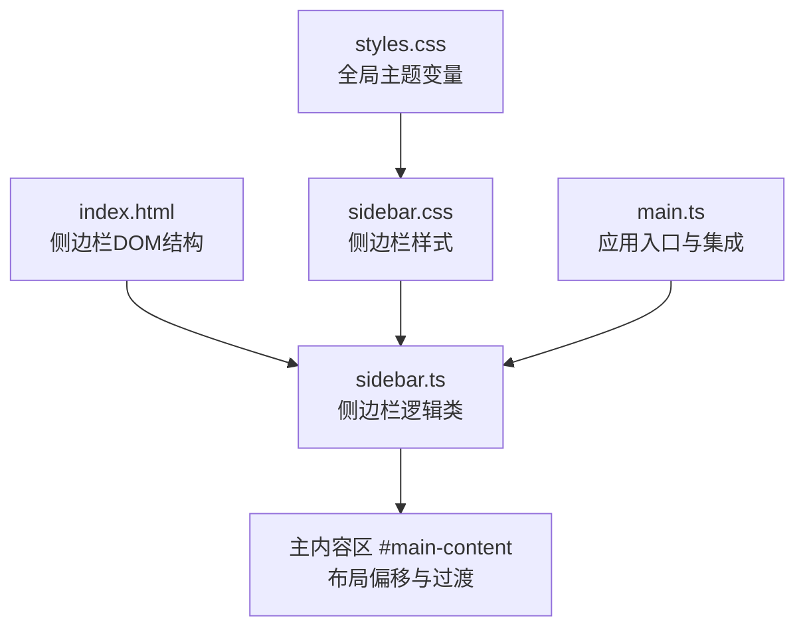
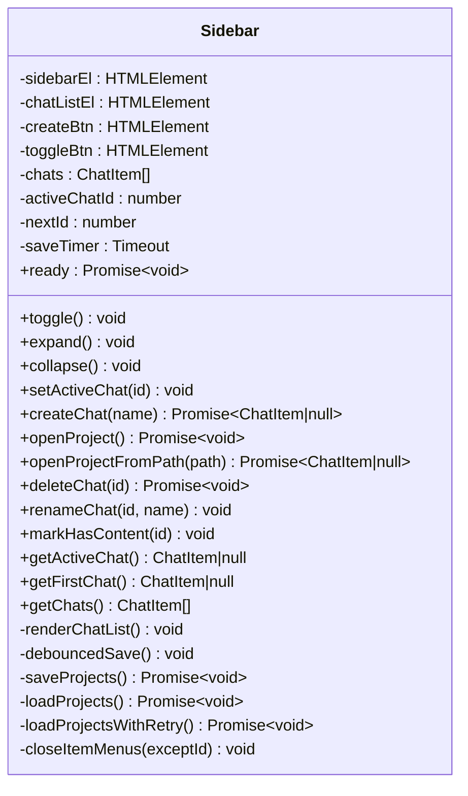
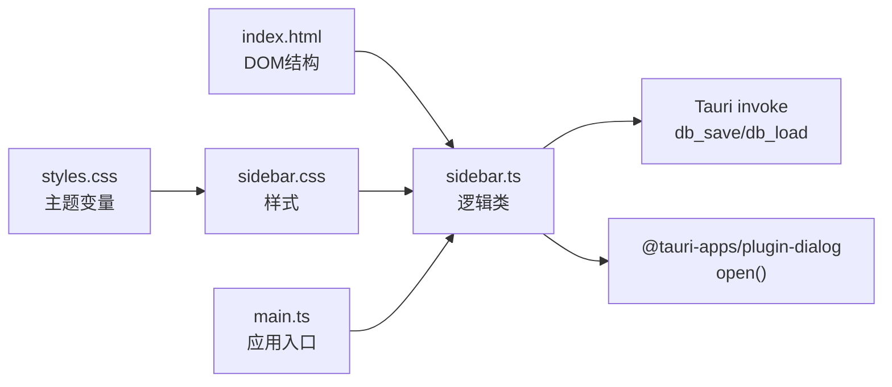

# 侧边栏组件

<cite>
**本文档引用的文件**
- [sidebar.ts](file://src/sidebar.ts)
- [sidebar.css](file://src/sidebar.css)
- [main.ts](file://src/main.ts)
- [index.html](file://index.html)
- [styles.css](file://src/styles.css)
</cite>

## 目录
1. [简介](#简介)
2. [项目结构](#项目结构)
3. [核心组件](#核心组件)
4. [架构总览](#架构总览)
5. [详细组件分析](#详细组件分析)
6. [依赖分析](#依赖分析)
7. [性能考虑](#性能考虑)
8. [故障排除指南](#故障排除指南)
9. [结论](#结论)
10. [附录](#附录)

## 简介
本文件为侧边栏组件的详细UI组件文档，面向开发者与产品设计人员，涵盖侧边栏的视觉外观、行为与交互模式，属性配置、事件处理机制与状态管理，以及与主内容区域的布局关系。文档还提供响应式设计指导、动画效果说明、样式定制与主题适配方法、无障碍访问与键盘导航指南，并包含使用示例与代码片段路径，帮助快速集成侧边栏到应用中。

## 项目结构
侧边栏由三部分组成：
- DOM结构：位于HTML模板中，包含侧边栏容器、新建按钮、分割线、对话列表、底部展开按钮等元素。
- 样式：位于CSS文件中，定义侧边栏的收起/展开状态、交互态、滚动条、主题变量适配等。
- 逻辑：位于TypeScript文件中，负责项目列表渲染、项目切换、对话操作、持久化、事件派发与窗口拖拽集成。

图表来源
- [index.html:62-83](file://index.html#L62-L83)
- [sidebar.ts:26-52](file://src/sidebar.ts#L26-L52)
- [sidebar.css:5-32](file://src/sidebar.css#L5-L32)
- [styles.css:8-36](file://src/styles.css#L8-L36)
- [main.ts:200-264](file://src/main.ts#L200-L264)

章节来源
- [index.html:62-83](file://index.html#L62-L83)
- [sidebar.ts:26-52](file://src/sidebar.ts#L26-L52)
- [sidebar.css:5-32](file://src/sidebar.css#L5-L32)
- [styles.css:8-36](file://src/styles.css#L8-L36)
- [main.ts:200-264](file://src/main.ts#L200-L264)

## 核心组件
- 侧边栏容器：固定定位，左侧窄栏，支持展开/收起，宽度切换配合主内容区偏移。
- 顶部区域：新建项目按钮，支持展开状态下显示文字与图标。
- 对话列表：动态渲染项目项，支持悬停显示操作菜单、双击重命名、点击切换活跃项目。
- 底部区域：展开/收起按钮，支持悬停态与图标切换。
- 对话项动作：每个项目项支持操作菜单（重命名、从列表移除），菜单支持悬停与点击打开。

章节来源
- [sidebar.ts:512-624](file://src/sidebar.ts#L512-L624)
- [sidebar.css:35-306](file://src/sidebar.css#L35-L306)
- [index.html:62-83](file://index.html#L62-L83)

## 架构总览
侧边栏通过类封装管理状态与交互，对外暴露方法如展开/收起、切换活跃项目、创建/打开项目等。应用入口通过事件监听与侧边栏实例交互，实现菜单触发、拖拽打开项目、错误提示等。

图表来源
- [sidebar.ts:26-629](file://src/sidebar.ts#L26-L629)

章节来源
- [sidebar.ts:26-629](file://src/sidebar.ts#L26-L629)

## 详细组件分析

### 视觉外观与布局
- 收起状态（默认）：宽度44px，仅显示图标，隐藏文字与名称；顶部与底部按钮居中对齐。
- 展开状态：宽度240px，显示文字与名称，按钮与列表项水平排列；主内容区通过CSS过渡向右偏移。
- 主题适配：使用CSS变量（如--surface-sidebar、--text-primary等）实现浅色/深色主题一致的外观。
- 滚动条美化：侧边栏列表滚动条宽度与颜色基于主题变量定制。

章节来源
- [sidebar.css:5-32](file://src/sidebar.css#L5-L32)
- [sidebar.css:307-315](file://src/sidebar.css#L307-L315)
- [sidebar.css:332-394](file://src/sidebar.css#L332-L394)
- [styles.css:8-36](file://src/styles.css#L8-L36)

### 行为与交互模式
- 展开/收起：点击底部按钮切换容器类名“expanded”，触发动画与布局偏移。
- 新建项目：点击顶部按钮弹出统一项目对话框，支持打开已有项目或新建项目。
- 切换活跃项目：点击项目项切换活跃状态，若处于展开状态且点击项目项，自动收起侧边栏。
- 项目操作：悬停或点击项目项右侧按钮打开操作菜单，支持重命名与从列表移除。
- 双击重命名：在项目项上双击名称进入输入框，失焦或回车确认，ESC取消。
- 拖拽打开项目：应用窗口注册拖拽事件，拖拽文件夹到窗口时自动尝试打开项目。

章节来源
- [sidebar.ts:496-509](file://src/sidebar.ts#L496-L509)
- [sidebar.ts:194-296](file://src/sidebar.ts#L194-L296)
- [sidebar.ts:536-547](file://src/sidebar.ts#L536-L547)
- [sidebar.ts:558-589](file://src/sidebar.ts#L558-L589)
- [sidebar.ts:592-620](file://src/sidebar.ts#L592-L620)
- [main.ts:243-262](file://src/main.ts#L243-L262)

### 数据结构与状态管理
- ChatItem：项目条目，包含id、名称、是否有内容、图标颜色、工作区路径等。
- 状态字段：chats数组、activeChatId、nextId、saveTimer。
- 状态变更：setActiveChat更新活跃项并触发自定义事件；deleteChat移除项目并同步持久化；renameChat即时更新并防抖保存。

章节来源
- [sidebar.ts:4-10](file://src/sidebar.ts#L4-L10)
- [sidebar.ts:31-35](file://src/sidebar.ts#L31-L35)
- [sidebar.ts:372-389](file://src/sidebar.ts#L372-L389)
- [sidebar.ts:424-462](file://src/sidebar.ts#L424-L462)
- [sidebar.ts:464-472](file://src/sidebar.ts#L464-L472)

### 事件处理机制
- DOM事件：按钮点击、文档点击（关闭菜单）、输入框失焦/按键事件。
- 自定义事件：切换活跃项目时派发“chat-changed”事件，供外部订阅。
- 错误提示：通过window事件派发“show-error”，统一显示错误提示。
- 拖拽事件：应用窗口监听拖拽释放事件，识别文件夹并尝试打开项目。

章节来源
- [sidebar.ts:46-48](file://src/sidebar.ts#L46-L48)
- [sidebar.ts:54-61](file://src/sidebar.ts#L54-L61)
- [sidebar.ts:386-388](file://src/sidebar.ts#L386-L388)
- [sidebar.ts:311-316](file://src/sidebar.ts#L311-L316)
- [main.ts:243-262](file://src/main.ts#L243-L262)

### 动画与过渡效果
- 宽度过渡：侧边栏宽度从44px到240px的平滑过渡，持续0.2秒。
- 主内容区偏移：主内容区margin-left随侧边栏展开状态变化，保持布局一致性。
- 悬停态：按钮与项目项hover态背景色渐变，提升交互反馈。
- 操作菜单：菜单显示/隐藏使用CSS display切换，配合定位与阴影。

章节来源
- [sidebar.css:16](file://src/sidebar.css#L16)
- [sidebar.css:309-315](file://src/sidebar.css#L309-L315)
- [sidebar.css:166-169](file://src/sidebar.css#L166-L169)
- [sidebar.css:209-213](file://src/sidebar.css#L209-L213)

### 与主内容区域的布局关系
- 侧边栏固定在左侧，主内容区通过CSS选择器“#sidebar.expanded ~ #main-content”在展开时自动增加左侧边距。
- 该布局关系保证侧边栏收起时不影响主内容可视区域，展开时自动让出空间。

章节来源
- [sidebar.css:307-315](file://src/sidebar.css#L307-L315)
- [index.html:84-134](file://index.html#L84-L134)

### 使用示例与代码片段路径
- 在HTML中引入样式与脚本后，即可使用侧边栏。示例路径：
  - [index.html:62-83](file://index.html#L62-L83)
  - [index.html:1-10](file://index.html#L1-L10)
- 在应用入口中绑定菜单与拖拽事件：
  - [main.ts:227-238](file://src/main.ts#L227-L238)
  - [main.ts:243-262](file://src/main.ts#L243-L262)
- 通过侧边栏实例进行交互：
  - [sidebar.ts:496-509](file://src/sidebar.ts#L496-L509)
  - [sidebar.ts:372-389](file://src/sidebar.ts#L372-L389)

章节来源
- [index.html:62-83](file://index.html#L62-L83)
- [index.html:1-10](file://index.html#L1-L10)
- [main.ts:227-238](file://src/main.ts#L227-L238)
- [main.ts:243-262](file://src/main.ts#L243-L262)
- [sidebar.ts:496-509](file://src/sidebar.ts#L496-L509)
- [sidebar.ts:372-389](file://src/sidebar.ts#L372-L389)

### 响应式设计指导
- 尺寸策略：侧边栏宽度在收起态为44px，展开态为240px，主内容区相应偏移。
- 主题变量：通过CSS变量统一控制背景、边框、文本与控件颜色，适配浅色/深色主题。
- 滚动条：侧边栏列表滚动条宽度与颜色基于主题变量定制，确保在不同主题下清晰可见。
- 媒体查询：全局样式包含多处媒体查询，用于在不同屏幕宽度下调整布局参数（如右侧栏宽度、面板间距等），可参考侧边栏的响应式实践。

章节来源
- [sidebar.css:5-32](file://src/sidebar.css#L5-L32)
- [sidebar.css:307-315](file://src/sidebar.css#L307-L315)
- [sidebar.css:332-394](file://src/sidebar.css#L332-L394)
- [styles.css:7742-7798](file://src/styles.css#L7742-L7798)

### CSS样式定制与主题适配
- 主题变量：通过--surface-sidebar、--text-primary、--text-secondary、--accent-soft、--border-color等变量控制外观。
- 控件态：hover、active、open等状态的颜色与背景通过变量组合实现一致风格。
- 滚动条：--text-muted、--surface-panel-strong等变量用于滚动条颜色与背景。
- 自定义颜色：项目图标颜色来自预设色板，可在创建项目时随机选择。

章节来源
- [styles.css:8-36](file://src/styles.css#L8-L36)
- [sidebar.css:332-394](file://src/sidebar.css#L332-L394)
- [sidebar.ts:13-24](file://src/sidebar.ts#L13-L24)

### 无障碍访问与键盘导航
- 当前实现要点：侧边栏按钮具备title属性，提供基础提示；对话项支持键盘点击与菜单操作。
- 建议增强：为按钮与菜单项添加ARIA属性（如aria-expanded、aria-haspopup），为列表项添加role与aria-selected；支持键盘操作（Tab切换、Enter/Space激活、Esc关闭菜单）以提升可访问性。

章节来源
- [index.html:64-79](file://index.html#L64-L79)
- [sidebar.ts:558-589](file://src/sidebar.ts#L558-L589)

## 依赖分析
- DOM依赖：侧边栏依赖HTML中的容器与按钮结构，样式依赖CSS类名与变量。
- 应用集成：应用入口通过事件监听与侧边栏实例交互，实现菜单触发、拖拽打开项目、错误提示。
- 数据持久化：通过invoke调用后端接口保存/加载项目列表与状态，确保重启后状态一致。
- Tauri集成：侧边栏与应用窗口、对话框插件协同工作，提供拖拽与对话框体验。

图表来源
- [index.html:62-83](file://index.html#L62-L83)
- [sidebar.ts:26-52](file://src/sidebar.ts#L26-L52)
- [sidebar.css:5-32](file://src/sidebar.css#L5-L32)
- [styles.css:8-36](file://src/styles.css#L8-L36)
- [main.ts:200-264](file://src/main.ts#L200-L264)

章节来源
- [index.html:62-83](file://index.html#L62-L83)
- [sidebar.ts:26-52](file://src/sidebar.ts#L26-L52)
- [sidebar.css:5-32](file://src/sidebar.css#L5-L32)
- [styles.css:8-36](file://src/styles.css#L8-L36)
- [main.ts:200-264](file://src/main.ts#L200-L264)

## 性能考虑
- 防抖保存：对项目重命名与列表变更采用防抖保存，降低频繁I/O压力。
- 渐进渲染：列表项逐项创建与插入，避免一次性大量DOM操作。
- 事件委托：通过文档级点击事件统一关闭菜单，减少重复监听。
- 动画优化：宽度与偏移使用CSS transition，避免JavaScript动画带来的卡顿。

章节来源
- [sidebar.ts:139-143](file://src/sidebar.ts#L139-L143)
- [sidebar.ts:512-624](file://src/sidebar.ts#L512-L624)
- [sidebar.ts:48-48](file://src/sidebar.ts#L48-L48)
- [sidebar.css:16](file://src/sidebar.css#L16)

## 故障排除指南
- 无法加载项目：侧边栏在启动时对数据库加载进行重试，若失败会抛出异常并阻止初始化流程。
- 工作区连接异常：切换活跃项目时验证工作区连接，失败时延迟显示错误提示。
- 打开项目失败：文件选择器或拖拽打开项目失败时，派发错误事件并提示用户。
- 删除项目失败：数据库删除失败时，提示用户并保留前端状态，避免“看起来删了但重启又出现”。

章节来源
- [sidebar.ts:101-110](file://src/sidebar.ts#L101-L110)
- [sidebar.ts:391-411](file://src/sidebar.ts#L391-L411)
- [sidebar.ts:300-317](file://src/sidebar.ts#L300-L317)
- [sidebar.ts:424-462](file://src/sidebar.ts#L424-L462)

## 结论
侧边栏组件通过清晰的类封装、完善的事件处理与主题适配，提供了稳定可靠的项目管理与导航体验。其展开/收起动画、主内容区联动布局与防抖持久化策略，兼顾了交互流畅性与数据一致性。建议在后续迭代中进一步完善无障碍访问与键盘导航，以提升可访问性与用户体验。

## 附录
- 代码片段路径参考：
  - [sidebar.ts:26-629](file://src/sidebar.ts#L26-L629)
  - [sidebar.css:5-395](file://src/sidebar.css#L5-L395)
  - [main.ts:200-264](file://src/main.ts#L200-L264)
  - [index.html:62-83](file://index.html#L62-L83)
  - [styles.css:8-36](file://src/styles.css#L8-L36)