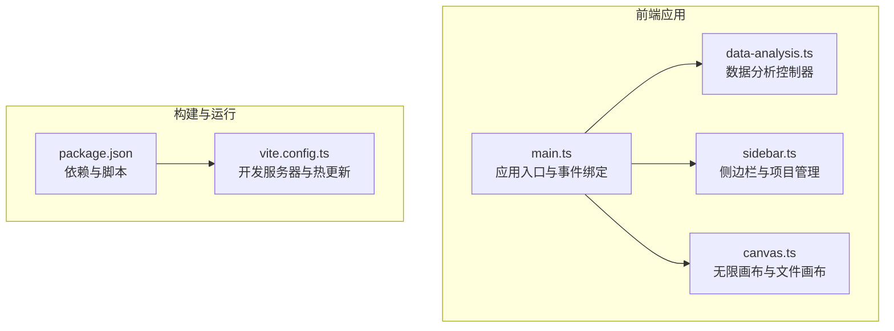
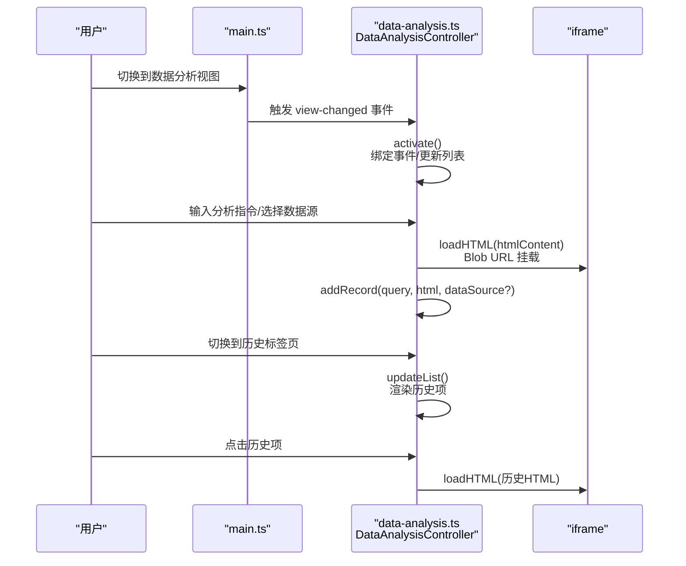
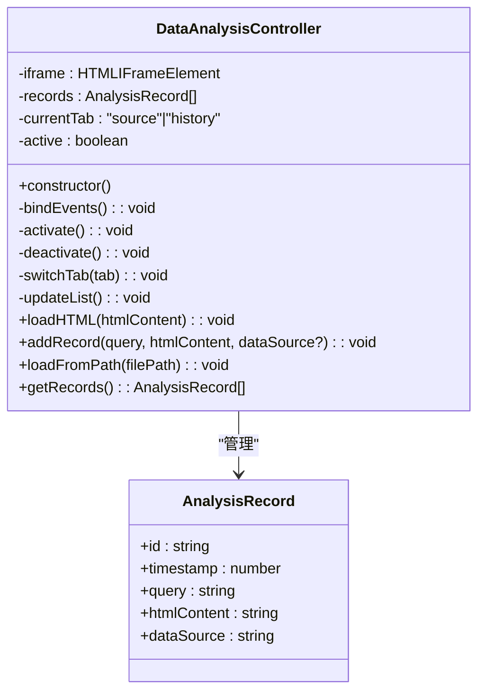
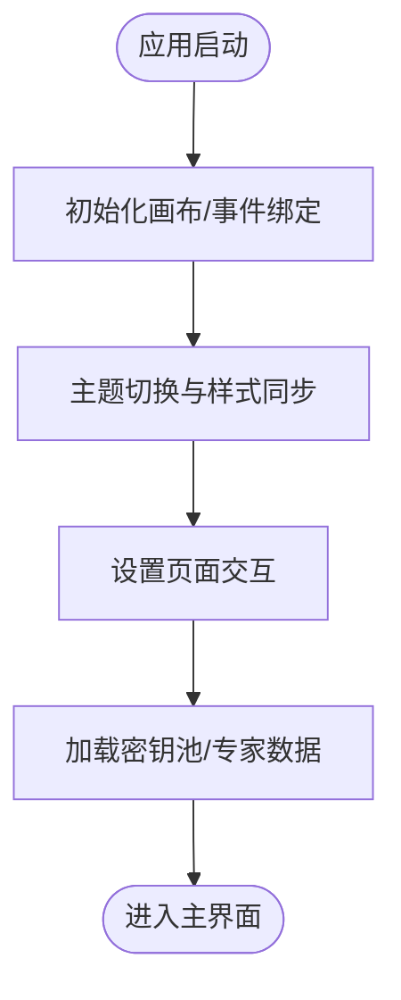
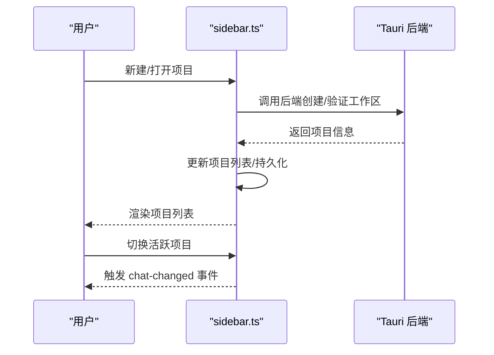
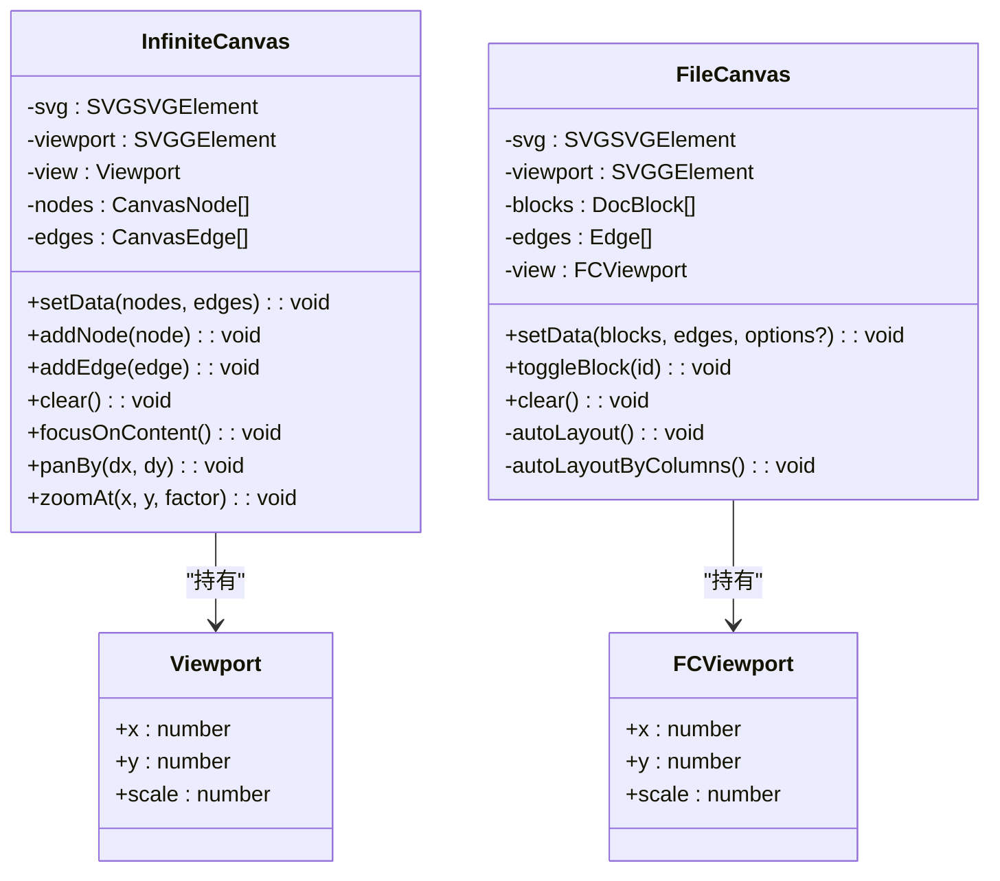
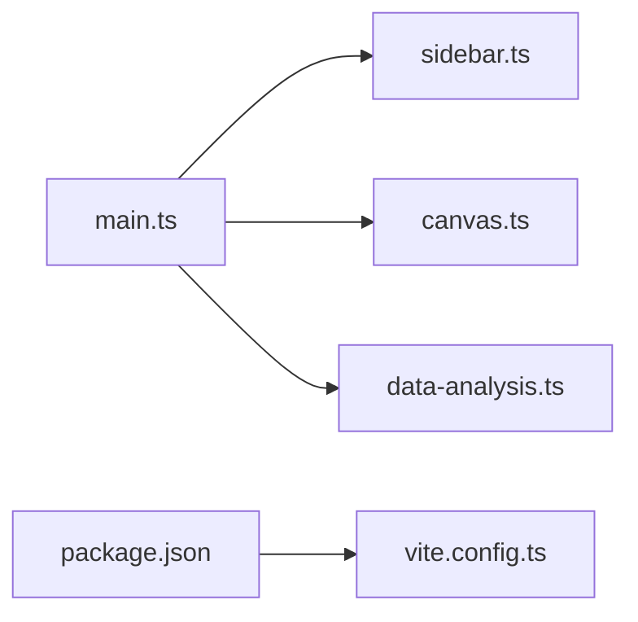

# 数据分析组件

<cite>
**本文引用的文件**   
- [data-analysis.ts](file://ai-experts/src/data-analysis.ts)
- [main.ts](file://ai-experts/src/main.ts)
- [sidebar.ts](file://ai-experts/src/sidebar.ts)
- [canvas.ts](file://ai-experts/src/canvas.ts)
- [package.json](file://ai-experts/package.json)
- [vite.config.ts](file://ai-experts/vite.config.ts)
</cite>

## 目录
1. [引言](#引言)
2. [项目结构](#项目结构)
3. [核心组件](#核心组件)
4. [架构总览](#架构总览)
5. [详细组件分析](#详细组件分析)
6. [依赖关系分析](#依赖关系分析)
7. [性能考虑](#性能考虑)
8. [故障排查指南](#故障排查指南)
9. [结论](#结论)
10. [附录](#附录)

## 引言
本技术文档聚焦于“星图专家团工作台”的数据分析组件，系统性阐述其整体架构、数据处理流程与可视化实现，覆盖数据导入导出机制、格式转换与预处理、统计分析算法实现、图表绘制与交互式可视化、数据验证与异常处理、性能优化策略，以及自定义分析组件的开发指南、图表库集成方案与主题定制选项。文档同时提供实际使用案例、组件扩展方法与最佳实践建议，帮助开发者快速理解并高效扩展该组件。

## 项目结构
数据分析组件位于前端主工程中，采用模块化组织方式，核心入口在主程序中进行初始化与事件绑定，数据分析控制器负责与嵌入式 iframe 的交互与历史记录管理。项目基于 Vite 构建，使用 Tauri 提供原生能力（如文件对话框、事件监听等）。主题系统通过 CSS 变量实现深浅模式切换，支持 UI 元素的统一风格。

**图表来源**
- [main.ts:1-800](file://ai-experts/src/main.ts#L1-L800)
- [data-analysis.ts:1-138](file://ai-experts/src/data-analysis.ts#L1-L138)
- [sidebar.ts:1-625](file://ai-experts/src/sidebar.ts#L1-L625)
- [canvas.ts:1-664](file://ai-experts/src/canvas.ts#L1-L664)
- [package.json:1-28](file://ai-experts/package.json#L1-L28)
- [vite.config.ts:1-31](file://ai-experts/vite.config.ts#L1-L31)

**章节来源**
- [main.ts:1-800](file://ai-experts/src/main.ts#L1-L800)
- [data-analysis.ts:1-138](file://ai-experts/src/data-analysis.ts#L1-L138)
- [package.json:1-28](file://ai-experts/package.json#L1-L28)
- [vite.config.ts:1-31](file://ai-experts/vite.config.ts#L1-L31)

## 核心组件
- 数据分析控制器：负责监听视图切换事件、管理左右侧面板 tab、维护分析历史记录、与 iframe 进行 HTML 内容加载与回放。
- 应用入口：负责初始化画布、绑定窗口事件、主题切换、设置页面交互、密钥池与专家配置等。
- 侧边栏：负责项目列表的增删改查、工作区连接校验、项目切换事件广播。
- 无限画布与文件画布：提供图形化展示与交互能力，支持拖拽、缩放、自动布局等。

**章节来源**
- [data-analysis.ts:12-138](file://ai-experts/src/data-analysis.ts#L12-L138)
- [main.ts:1-800](file://ai-experts/src/main.ts#L1-L800)
- [sidebar.ts:26-625](file://ai-experts/src/sidebar.ts#L26-L625)
- [canvas.ts:30-664](file://ai-experts/src/canvas.ts#L30-L664)

## 架构总览
数据分析组件采用“嵌入式 iframe + 控制器”的架构设计。控制器通过事件驱动的方式响应视图切换，动态加载 HTML 内容到 iframe 中，并维护历史记录列表。应用入口负责全局 UI 与主题管理，侧边栏负责项目生命周期管理，画布模块提供可视化承载与交互。

**图表来源**
- [main.ts:188-258](file://ai-experts/src/main.ts#L188-L258)
- [data-analysis.ts:22-138](file://ai-experts/src/data-analysis.ts#L22-L138)

## 详细组件分析

### 数据分析控制器（DataAnalysisController）
职责与行为
- 事件绑定：监听视图切换事件，激活/停用控制器；绑定右侧面板 tab 切换事件。
- 历史管理：维护分析记录数组，支持新增、回放与列表渲染。
- iframe 管理：接收 HTML 字符串，生成 Blob URL 并赋给 iframe 的 src，实现无刷新加载与隔离渲染。
- 公共 API：对外暴露加载、记录、查询历史等接口，便于上层模块调用。

**图表来源**
- [data-analysis.ts:4-138](file://ai-experts/src/data-analysis.ts#L4-L138)

**章节来源**
- [data-analysis.ts:12-138](file://ai-experts/src/data-analysis.ts#L12-L138)

### 应用入口（main.ts）
职责与行为
- 初始化与事件绑定：注册窗口控制按钮、拖拽打开项目、菜单交互、视图切换等。
- 主题系统：通过 CSS 变量实现深浅主题切换，同步设置页面开关状态。
- 设置页面：打开/关闭设置页，加载密钥池与专家数据，避免竞态。
- 全局 UI 状态：保存/恢复 UI 元素显示状态，保证设置页切换体验一致。

**图表来源**
- [main.ts:141-457](file://ai-experts/src/main.ts#L141-L457)

**章节来源**
- [main.ts:141-457](file://ai-experts/src/main.ts#L141-L457)

### 侧边栏（sidebar.ts）
职责与行为
- 项目管理：创建/打开/删除/重命名项目，持久化存储与去重。
- 工作区连接：验证项目工作区路径有效性，异常时延迟提示。
- 项目切换：设置当前活跃项目，触发自定义事件通知外部模块。
- 对话列表渲染：支持双击重命名、菜单操作、图标颜色随机分配。

**图表来源**
- [sidebar.ts:156-389](file://ai-experts/src/sidebar.ts#L156-L389)

**章节来源**
- [sidebar.ts:156-389](file://ai-experts/src/sidebar.ts#L156-L389)

### 无限画布与文件画布（canvas.ts）
职责与行为
- 无限画布：支持滚轮缩放、平移、节点拖拽、自动定位到内容区域，同步草稿画布视口。
- 文件画布：支持树形/列布局、块级元素拖拽、折叠/展开、内部交互绑定（如打开文件预览）。

**图表来源**
- [canvas.ts:30-316](file://ai-experts/src/canvas.ts#L30-L316)
- [canvas.ts:351-664](file://ai-experts/src/canvas.ts#L351-L664)

**章节来源**
- [canvas.ts:30-316](file://ai-experts/src/canvas.ts#L30-L316)
- [canvas.ts:351-664](file://ai-experts/src/canvas.ts#L351-L664)

## 依赖关系分析
- 模块耦合
  - main.ts 作为入口，依赖 sidebar.ts、canvas.ts、data-analysis.ts 等模块，形成高层协调关系。
  - data-analysis.ts 与 DOM 结构强耦合（iframe、tab 切换容器），通过事件与全局 API 与其他模块弱耦合。
  - canvas.ts 与 UI 画布元素绑定，提供通用的视口与布局能力。
- 外部依赖
  - @tauri-apps/api：窗口控制、事件监听、后端通信。
  - highlight.js：代码高亮（用于文档块渲染）。
  - vite：开发服务器与热更新配置。
- 潜在循环依赖
  - 当前模块间为单向依赖（入口 -> 子模块），未见循环依赖迹象。

**图表来源**
- [main.ts:1-800](file://ai-experts/src/main.ts#L1-L800)
- [data-analysis.ts:1-138](file://ai-experts/src/data-analysis.ts#L1-L138)
- [sidebar.ts:1-625](file://ai-experts/src/sidebar.ts#L1-L625)
- [canvas.ts:1-664](file://ai-experts/src/canvas.ts#L1-L664)
- [package.json:1-28](file://ai-experts/package.json#L1-L28)
- [vite.config.ts:1-31](file://ai-experts/vite.config.ts#L1-L31)

**章节来源**
- [main.ts:1-800](file://ai-experts/src/main.ts#L1-L800)
- [package.json:1-28](file://ai-experts/package.json#L1-L28)
- [vite.config.ts:1-31](file://ai-experts/vite.config.ts#L1-L31)

## 性能考虑
- iframe 隔离渲染
  - 使用 Blob URL 动态挂载 HTML，避免跨域与样式污染，提升渲染隔离性与安全性。
- 事件与 DOM 操作
  - 控制器在切换 tab 时批量更新列表，减少频繁 DOM 重排。
  - 无限画布与文件画布采用 SVG 渲染，缩放与平移通过变换矩阵实现，避免逐元素重绘。
- 主题切换
  - 通过 CSS 变量统一替换颜色与背景，避免逐元素样式计算。
- 构建与开发
  - Vite 配置固定端口与 HMR，严格端口占用与忽略 Rust 目录监听，降低开发时资源消耗。

**章节来源**
- [data-analysis.ts:95-103](file://ai-experts/src/data-analysis.ts#L95-L103)
- [canvas.ts:187-199](file://ai-experts/src/canvas.ts#L187-L199)
- [main.ts:263-347](file://ai-experts/src/main.ts#L263-L347)
- [vite.config.ts:14-29](file://ai-experts/vite.config.ts#L14-L29)

## 故障排查指南
- iframe 无法加载
  - 检查 HTML 字符串是否为空或包含非法内容；确认 Blob URL 生成与赋值流程。
  - 参考：[data-analysis.ts:95-103](file://ai-experts/src/data-analysis.ts#L95-L103)
- 历史记录不显示
  - 确认当前 tab 是否为 history；检查 updateList 渲染逻辑与事件绑定。
  - 参考：[data-analysis.ts:63-91](file://ai-experts/src/data-analysis.ts#L63-L91)
- 主题切换异常
  - 检查 CSS 变量是否正确设置；确认设置页面开关状态同步。
  - 参考：[main.ts:263-347](file://ai-experts/src/main.ts#L263-L347)
- 画布交互卡顿
  - 检查是否存在大量节点/块导致渲染压力；适当减少一次性渲染数量或启用虚拟化。
  - 参考：[canvas.ts:249-301](file://ai-experts/src/canvas.ts#L249-L301)
- 项目打开失败
  - 检查后端返回的工作区路径与权限；关注连接验证错误提示。
  - 参考：[sidebar.ts:392-411](file://ai-experts/src/sidebar.ts#L392-L411)

**章节来源**
- [data-analysis.ts:63-103](file://ai-experts/src/data-analysis.ts#L63-L103)
- [main.ts:263-347](file://ai-experts/src/main.ts#L263-L347)
- [canvas.ts:249-301](file://ai-experts/src/canvas.ts#L249-L301)
- [sidebar.ts:392-411](file://ai-experts/src/sidebar.ts#L392-L411)

## 结论
数据分析组件以“嵌入式 iframe + 控制器”为核心，结合应用入口的事件编排、侧边栏的项目生命周期管理与画布模块的可视化能力，形成了清晰、可扩展的数据分析工作流。通过 Blob URL 隔离渲染、CSS 变量主题系统与 SVG 画布，组件在易用性与性能之间取得良好平衡。建议在后续迭代中进一步完善数据导入导出协议、统计分析算法封装与图表库集成方案，以满足更复杂的分析场景。

## 附录

### 数据导入导出机制与格式转换
- 导入
  - 通过控制器公共 API 接收 HTML 字符串，生成 Blob URL 并注入 iframe，实现无刷新加载。
  - 预留 loadFromPath 接口，便于未来通过 Tauri 读取本地文件后调用 loadHTML。
- 导出
  - 历史记录以 AnalysisRecord 形式保存，包含查询语句、时间戳与 HTML 内容，便于回放与二次处理。
- 格式转换
  - 文件读取支持文本与 DataURL 两种方式，便于不同来源数据的统一接入。
- 预处理
  - 文件类型检测与附件分类，为后续分析提供基础数据准备。

**章节来源**
- [data-analysis.ts:95-121](file://ai-experts/src/data-analysis.ts#L95-L121)
- [data-analysis.ts:105-117](file://ai-experts/src/data-analysis.ts#L105-L117)
- [main.ts:637-653](file://ai-experts/src/main.ts#L637-L653)
- [main.ts:625-635](file://ai-experts/src/main.ts#L625-L635)

### 统计分析算法与图表绘制
- 算法实现
  - 当前组件以 HTML 内容承载为主，统计分析算法可由外部模块生成 HTML/JS 内容后交由控制器加载。
  - 建议在业务层封装常用统计函数（如均值、分位数、分布直方图等），并通过可视化库生成图表。
- 图表绘制
  - 可选方案：D3.js、Chart.js、ECharts 等，通过在生成的 HTML 中内联脚本或引入外部库实现。
  - 注意：为避免安全风险，建议对图表数据与脚本进行白名单校验与沙箱渲染。

### 交互式可视化与主题定制
- 交互
  - 无限画布与文件画布提供拖拽、缩放、折叠/展开等交互能力，可作为分析结果的承载容器。
- 主题
  - 通过 CSS 变量统一管理颜色与背景，支持深浅主题一键切换；可在设置页面扩展更多主题选项。

**章节来源**
- [canvas.ts:351-664](file://ai-experts/src/canvas.ts#L351-L664)
- [main.ts:263-347](file://ai-experts/src/main.ts#L263-L347)

### 自定义分析组件开发指南
- 组件结构
  - 建议遵循“输入参数 -> 数据处理 -> 可视化输出 -> 历史记录”的流水线设计。
  - 将可视化输出封装为 HTML 片段，交由控制器 loadHTML 注入 iframe。
- 数据验证
  - 对输入数据进行类型与范围校验，异常时抛出明确错误并提示用户。
- 性能优化
  - 分批渲染、懒加载、缓存中间结果，避免重复计算。
- 扩展方法
  - 在 main.ts 中注册新的视图与事件处理器，或在 data-analysis.ts 中扩展控制器能力。

### 实际使用案例
- 案例一：文本情感分析
  - 输入：用户上传 CSV 或粘贴文本；后端/前端进行清洗与分词；生成情感分布柱状图与词云，回放至 iframe。
- 案例二：项目指标仪表盘
  - 输入：项目度量数据（如提交次数、缺陷数）；生成折线图与 KPI 卡片；支持切换时间范围与指标维度。
- 案例三：文件结构分析
  - 输入：项目根目录；生成文件/文件夹树形图与大小分布；支持点击跳转到文件画布进行预览。

### 最佳实践建议
- 安全性
  - 严格校验与过滤用户输入，避免 XSS；对 iframe 内容进行最小权限策略。
- 可维护性
  - 将算法与可视化分离，便于单元测试与版本演进。
- 用户体验
  - 提供加载状态与错误提示；支持撤销/重做与历史回放。
- 性能
  - 合理分页与虚拟化；避免在主线程执行耗时任务；利用浏览器缓存与增量更新。