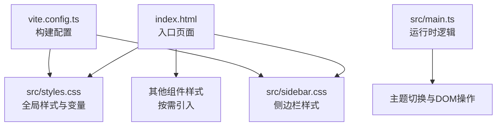
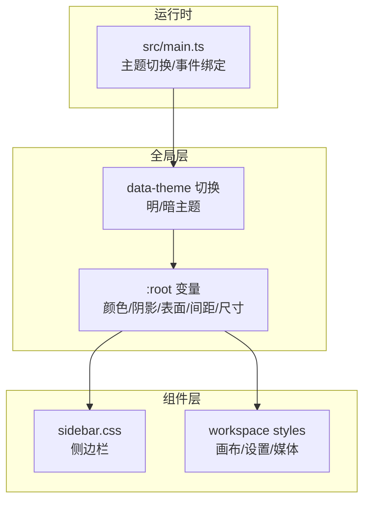
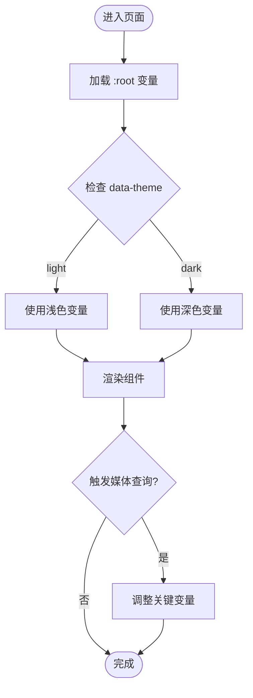
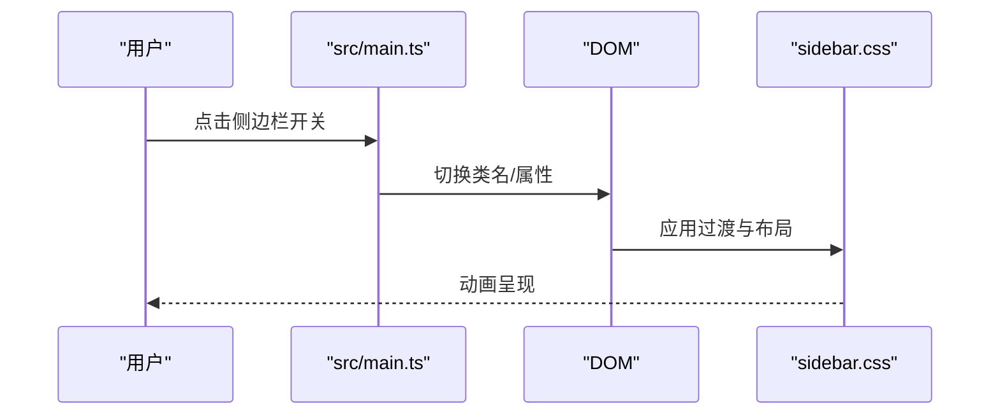
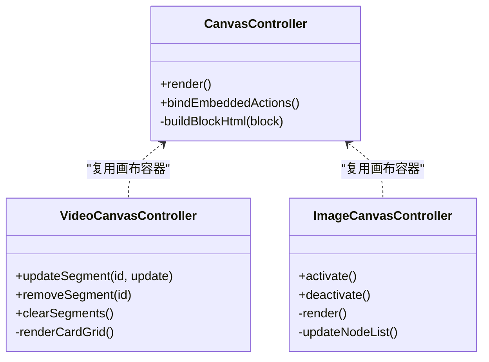
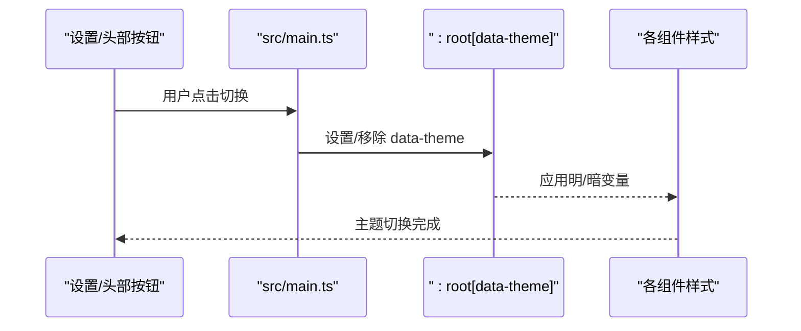
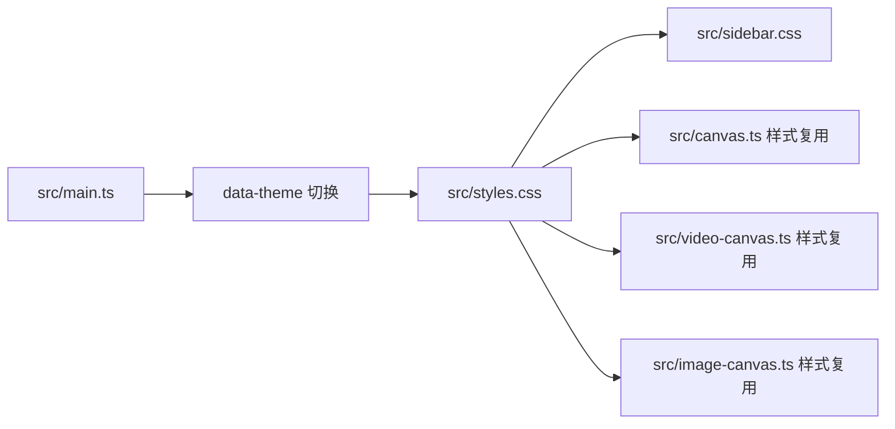

# 样式系统

<cite>
**本文引用的文件**
- [src/styles.css](file://src/styles.css)
- [src/sidebar.css](file://src/sidebar.css)
- [index.html](file://index.html)
- [dist/index.html](file://dist/index.html)
- [src/main.ts](file://src/main.ts)
- [src/canvas.ts](file://src/canvas.ts)
- [src/video-canvas.ts](file://src/video-canvas.ts)
- [src/image-canvas.ts](file://src/image-canvas.ts)
- [src-tauri/src/workflow_engine.rs](file://src-tauri/src/workflow_engine.rs)
- [src-tauri/src/prompt_module_engine.rs](file://src-tauri/src/prompt_module_engine.rs)
- [package.json](file://package.json)
- [vite.config.ts](file://vite.config.ts)
</cite>

## 目录
1. [简介](#简介)
2. [项目结构](#项目结构)
3. [核心组件](#核心组件)
4. [架构总览](#架构总览)
5. [详细组件分析](#详细组件分析)
6. [依赖分析](#依赖分析)
7. [性能考量](#性能考量)
8. [故障排查指南](#故障排查指南)
9. [结论](#结论)
10. [附录](#附录)

## 简介
本文件面向样式系统与UI组件，系统性梳理全局样式组织、CSS变量体系、命名规范、响应式断点、动画与过渡、模块化与可维护性、第三方集成与冲突规避、以及调试与性能优化策略。目标是帮助开发者在不深入源码的前提下，快速理解并高效扩展样式体系。

## 项目结构
样式系统主要由以下部分构成：
- 全局样式与变量：集中于全局CSS文件，定义主题变量、基础排版、阴影与表面材质等。
- 组件级样式：按功能区域拆分，如侧边栏、设置页、画布等。
- 响应式策略：通过媒体查询与CSS自定义属性协同，实现多断点适配。
- 动画与过渡：统一的过渡时序与动画序列，确保交互一致性。
- 构建与运行：Vite配置与HTML入口，负责样式打包与注入。

图表来源
- [index.html](file://index.html)
- [src/styles.css](file://src/styles.css)
- [src/sidebar.css](file://src/sidebar.css)
- [src/main.ts](file://src/main.ts)
- [vite.config.ts](file://vite.config.ts)

章节来源
- [index.html](file://index.html)
- [src/styles.css](file://src/styles.css)
- [src/sidebar.css](file://src/sidebar.css)
- [src/main.ts](file://src/main.ts)
- [vite.config.ts](file://vite.config.ts)

## 核心组件
- 全局变量与主题
  - 使用CSS自定义属性组织颜色、阴影、表面材质、间距与尺寸等，支持明暗两套主题。
  - 变量命名采用语义化前缀，如颜色类以“accent”“text”“bg”“surface”区分用途；尺寸类以“panel-gap”“card-width”等表达空间关系。
- 基础排版与可访问性
  - 字体族、字号、行高、抗锯齿与文本渲染优化，确保跨平台一致体验。
- 组件样式
  - 侧边栏、设置页、画布、视频/图像画布等区域各自拥有独立样式文件，遵循同一命名与变量体系。
- 响应式断点
  - 在多个宽度阈值下调整关键布局变量，保证在不同屏幕下的可用性与可读性。
- 动画与过渡
  - 统一的过渡时序与动画序列，避免视觉跳变，提升交互流畅度。

章节来源
- [src/styles.css](file://src/styles.css)
- [src/sidebar.css](file://src/sidebar.css)

## 架构总览
样式系统采用“全局变量 + 组件样式”的分层架构：
- 全局层：定义主题变量与通用规则，供所有组件共享。
- 组件层：按区域拆分样式，复用全局变量，局部微调。
- 运行时层：通过脚本切换主题、绑定事件，驱动样式生效。

图表来源
- [src/styles.css](file://src/styles.css)
- [src/sidebar.css](file://src/sidebar.css)
- [src/main.ts](file://src/main.ts)

## 详细组件分析

### 全局样式与变量体系
- 变量组织
  - 颜色：主色、强调色、柔和强调、危险色、文本色、边框色等，分别对应明/暗主题。
  - 表面材质：应用背景、面板、遮罩、侧栏等，支持渐变与透明度组合。
  - 尺寸与间距：卡片圆角、面板间距、聊天卡宽度、右侧栏与草稿侧栏宽度等，使用clamp与视口单位实现弹性布局。
  - 排版：字体族、字号、行高、文本渲染优化。
- 使用策略
  - 组件优先引用变量，避免硬编码颜色与尺寸。
  - 通过`:root[data-theme="dark"]`切换主题，无需修改组件样式。
- 响应式
  - 在多个断点下调小关键尺寸，减少横向滚动，隐藏冗余元素，保持信息密度合理。

图表来源
- [src/styles.css](file://src/styles.css)

章节来源
- [src/styles.css](file://src/styles.css)

### 侧边栏样式与交互
- 结构与定位
  - 侧边栏宽度、折叠状态、过渡动画均通过CSS变量与过渡控制。
- 交互行为
  - 通过运行时脚本控制侧边栏展开/收起与高亮状态，样式层仅负责呈现。
- 动画与过渡
  - 统一的过渡时序，确保滑动与颜色变化顺滑。

图表来源
- [src/main.ts](file://src/main.ts)
- [src/sidebar.css](file://src/sidebar.css)

章节来源
- [src/sidebar.css](file://src/sidebar.css)
- [src/main.ts](file://src/main.ts)

### 设置页与开关组件
- 设计要点
  - 行容器、标签与描述、开关滑块等，均基于统一的变量与过渡。
- 可访问性
  - 滑块具备键盘可达性与清晰的视觉反馈。
- 主题适配
  - 明/暗主题下颜色对比与阴影保持一致的可读性。

章节来源
- [src/styles.css](file://src/styles.css)

### 画布与媒体视图样式
- 无限画布
  - 画布区域的节点、连接、缩放与交互样式，复用全局变量与过渡。
- 视频画布
  - 镜头卡片网格、状态更新、渲染刷新等，样式与逻辑解耦。
- 图像画布
  - 复用无限画布的SVG容器，按需渲染图像节点与连线。

图表来源
- [src/canvas.ts](file://src/canvas.ts)
- [src/video-canvas.ts](file://src/video-canvas.ts)
- [src/image-canvas.ts](file://src/image-canvas.ts)

章节来源
- [src/canvas.ts](file://src/canvas.ts)
- [src/video-canvas.ts](file://src/video-canvas.ts)
- [src/image-canvas.ts](file://src/image-canvas.ts)

### 主题切换与运行时控制
- 切换机制
  - 通过运行时脚本设置或移除`data-theme`属性，驱动`:root[data-theme="dark"]`生效。
- DOM与事件
  - 主题切换按钮与设置页开关绑定事件，更新DOM属性并触发样式重绘。
- 一致性
  - 保证所有组件共享同一主题变量，避免局部覆盖导致的不一致。

图表来源
- [src/main.ts](file://src/main.ts)
- [src/styles.css](file://src/styles.css)
- [index.html](file://index.html)
- [dist/index.html](file://dist/index.html)

章节来源
- [src/main.ts](file://src/main.ts)
- [src/styles.css](file://src/styles.css)
- [index.html](file://index.html)
- [dist/index.html](file://dist/index.html)

### 响应式设计与断点策略
- 断点与变量联动
  - 在多个断点下调小卡片宽度、右侧栏与草稿侧栏宽度，减少面板间距，隐藏冗余元素。
- 适配原则
  - 优先保证内容密度与可读性，其次考虑交互元素的可见性与触达面积。
- 与布局变量协作
  - 通过调整`--chat-card-width`、`--right-rail-width`、`--draft-sidebar-width`、`--panel-gap`等变量，实现整体布局的弹性收缩。

章节来源
- [src/styles.css](file://src/styles.css)

### 动画与过渡的统一管理
- 过渡时序
  - 大多数交互采用统一的过渡时长，确保视觉节奏一致。
- 动画序列
  - 对于闪烁提示等场景，使用统一的动画序列与延迟，避免视觉干扰。
- 组件内一致性
  - 按钮、面板、开关等组件遵循相同的过渡曲线与时长，提升整体感知稳定性。

章节来源
- [src/styles.css](file://src/styles.css)

### 样式模块化与命名规范
- 文件拆分
  - 将侧边栏、设置、画布等区域样式拆分为独立文件，便于维护与按需加载。
- 命名约定
  - 采用语义化类名，如`.settings-row`、`.view-tab`、`.doc-block-*`等，避免过度依赖层级选择器。
- 变量复用
  - 组件内部优先引用全局变量，减少重复定义，降低维护成本。
- 可扩展性
  - 新增组件时，先在全局变量中补充必要值，再在组件样式中引用，确保主题一致性。

章节来源
- [src/styles.css](file://src/styles.css)
- [src/sidebar.css](file://src/sidebar.css)

### 与第三方UI框架的集成与冲突规避
- 集成建议
  - 若引入第三方UI库，优先使用其提供的主题变量或CSS自定义属性接口，避免直接覆盖其内部样式。
- 冲突规避
  - 通过作用域隔离（如命名空间类名）与更具体的CSS选择器，减少对第三方样式的意外影响。
- 一致性
  - 将第三方组件的样式纳入全局变量体系，使其与整体主题保持一致。

（本节为通用指导，不直接分析具体文件）

### 与构建系统的协作
- 构建配置
  - Vite负责样式打包与注入，确保全局样式与组件样式在生产环境正确合并。
- 资源定位
  - HTML入口负责挂载样式与脚本，运行时脚本负责主题切换与事件绑定。

章节来源
- [vite.config.ts](file://vite.config.ts)
- [index.html](file://index.html)

## 依赖分析
- 组件耦合
  - 组件样式依赖全局变量，耦合度低，便于独立演进。
- 运行时依赖
  - 主题切换依赖运行时脚本，样式层仅负责呈现，职责清晰。
- 第三方依赖
  - 仓库中包含语法高亮主题样式文件，可用于代码预览等场景，但非UI框架。

图表来源
- [src/styles.css](file://src/styles.css)
- [src/sidebar.css](file://src/sidebar.css)
- [src/canvas.ts](file://src/canvas.ts)
- [src/video-canvas.ts](file://src/video-canvas.ts)
- [src/image-canvas.ts](file://src/image-canvas.ts)
- [src/main.ts](file://src/main.ts)

章节来源
- [src/styles.css](file://src/styles.css)
- [src/sidebar.css](file://src/sidebar.css)
- [src/canvas.ts](file://src/canvas.ts)
- [src/video-canvas.ts](file://src/video-canvas.ts)
- [src/image-canvas.ts](file://src/image-canvas.ts)
- [src/main.ts](file://src/main.ts)

## 性能考量
- 减少重绘与回流
  - 优先使用变换与透明度等可合成属性，避免频繁修改布局属性。
- 变量与缓存
  - 复用CSS变量，减少重复计算与内存占用。
- 响应式优化
  - 合理设置断点，避免在窄屏下出现过多重排。
- 构建优化
  - 利用构建工具进行样式压缩与去重，减少传输体积。

（本节提供通用建议，不直接分析具体文件）

## 故障排查指南
- 主题不生效
  - 检查运行时是否正确设置了`data-theme`属性，确认`:root[data-theme="dark"]`被应用。
- 样式覆盖异常
  - 检查组件是否直接硬编码了颜色或尺寸，建议改用全局变量。
- 响应式异常
  - 确认媒体查询断点与关键变量调整逻辑，避免在特定宽度下布局错乱。
- 动画卡顿
  - 检查过渡时长与动画序列，避免在同一元素上叠加过多动画。

章节来源
- [src/main.ts](file://src/main.ts)
- [src/styles.css](file://src/styles.css)

## 结论
该样式系统以全局变量为核心，结合组件级样式与统一的过渡/动画策略，实现了主题一致、易于维护与可扩展的UI样式体系。通过明确的命名规范、模块化组织与响应式断点策略，能够在多设备与多主题环境下提供稳定一致的用户体验。建议在新增组件时严格遵循变量复用与命名规范，并在运行时层保持主题切换的一致性。

## 附录
- 关键变量与断点位置可参考全局样式文件中的变量定义与媒体查询段落。
- 组件样式文件按区域划分，便于按需查找与维护。

章节来源
- [src/styles.css](file://src/styles.css)
- [src/sidebar.css](file://src/sidebar.css)