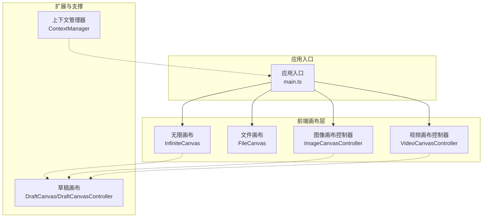
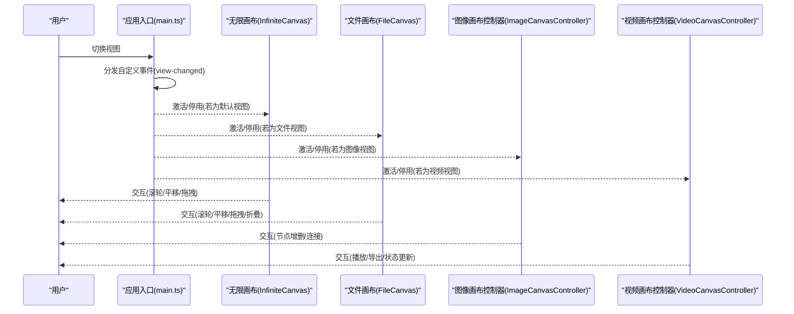
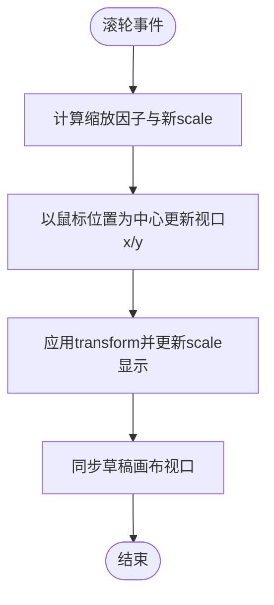
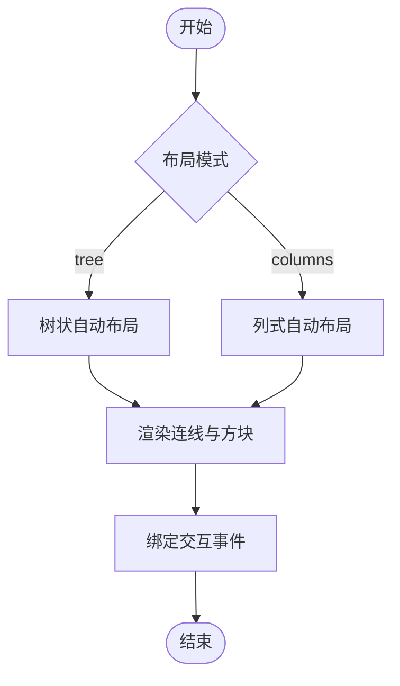
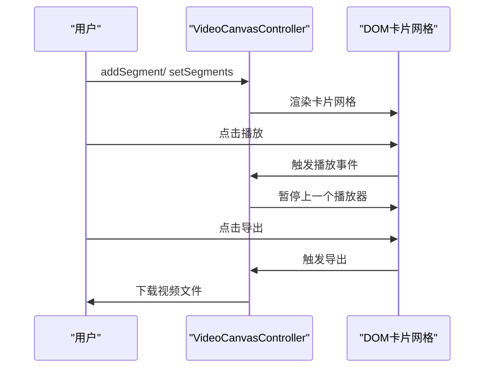
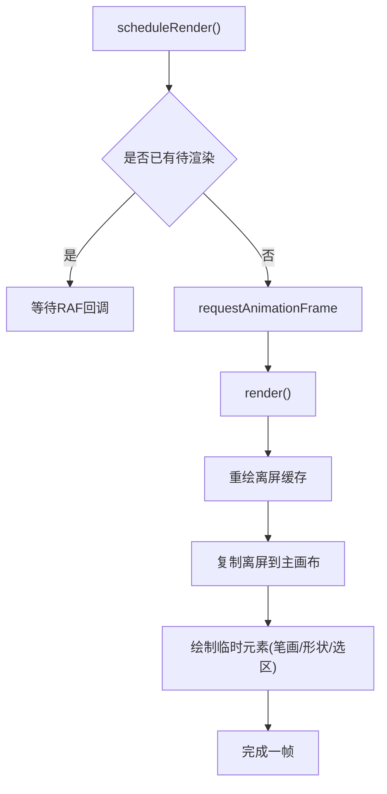
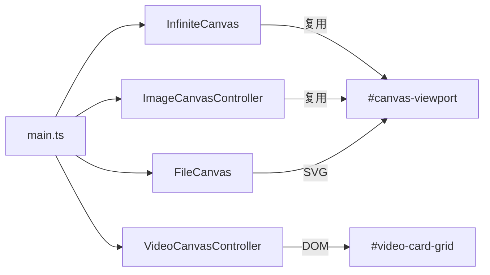

# 画布系统

<cite>
**本文档引用的文件**
- [canvas.ts](file://ai-experts/src/canvas.ts)
- [image-canvas.ts](file://ai-experts/src/image-canvas.ts)
- [video-canvas.ts](file://ai-experts/src/video-canvas.ts)
- [main.ts](file://ai-experts/src/main.ts)
- [draft.ts](file://ai-experts/src/draft.ts)
- [context-manager.ts](file://ai-experts/src/context-manager.ts)
</cite>

## 目录
1. [简介](#简介)
2. [项目结构](#项目结构)
3. [核心组件](#核心组件)
4. [架构总览](#架构总览)
5. [详细组件分析](#详细组件分析)
6. [依赖关系分析](#依赖关系分析)
7. [性能考量](#性能考量)
8. [故障排查指南](#故障排查指南)
9. [结论](#结论)
10. [附录](#附录)

## 简介
本文件面向“星图专家团工作台”的画布系统，系统性梳理无限画布、文件预览画布、图像处理画布与视频创作画布的架构设计与实现要点，覆盖多画布协同、交互操作（缩放、平移、拖拽）、渲染与性能优化策略、以及扩展与第三方库集成建议。文档旨在帮助开发者快速理解与高效扩展画布能力。

## 项目结构
画布系统由多个模块协同构成：
- 无限画布：支持节点与连线的 SVG 渲染、滚轮缩放、平移、节点拖拽与聚焦定位。
- 文件预览画布：基于 SVG 的文档块布局与交互，支持树状/列式布局、折叠展开、点击跳转。
- 图像处理画布：复用无限画布的视口，渲染图像节点与连接，提供节点增删与状态查询接口。
- 视频创作画布：卡片网格展示视频片段，支持播放控制、状态更新与导出。
- 草稿画布（扩展参考）：基于 Canvas 2D 的高性能渲染与离屏缓存，提供调度渲染与交互优化。



图表来源
- [canvas.ts:30-302](file://ai-experts/src/canvas.ts#L30-L302)
- [canvas.ts:351-664](file://ai-experts/src/canvas.ts#L351-L664)
- [image-canvas.ts:24-204](file://ai-experts/src/image-canvas.ts#L24-L204)
- [video-canvas.ts:16-256](file://ai-experts/src/video-canvas.ts#L16-L256)
- [main.ts:226-228](file://ai-experts/src/main.ts#L226-L228)

章节来源
- [canvas.ts:30-302](file://ai-experts/src/canvas.ts#L30-L302)
- [canvas.ts:351-664](file://ai-experts/src/canvas.ts#L351-L664)
- [image-canvas.ts:24-204](file://ai-experts/src/image-canvas.ts#L24-L204)
- [video-canvas.ts:16-256](file://ai-experts/src/video-canvas.ts#L16-L256)
- [main.ts:226-228](file://ai-experts/src/main.ts#L226-L228)

## 核心组件
- 无限画布（InfiniteCanvas）
  - 支持滚轮缩放、平移、节点拖拽、连线渲染、节点标签渲染、点击打开文件预览。
  - 提供公共 API：panBy、zoomAt、focusOnContent、setData/addNode/addEdge/clear。
- 文件画布（FileCanvas）
  - 基于 SVG 的文档块布局，支持树状/列式布局、折叠展开、点击跳转。
  - 提供公共 API：setData、toggleBlock、clear、render。
- 图像画布控制器（ImageCanvasController）
  - 复用无限画布的 #canvas-viewport，渲染图像节点与连接，提供节点增删与状态查询。
  - 提供公共 API：addNode/connect/removeNode/getState/setSelection/getSelection。
- 视频画布控制器（VideoCanvasController）
  - 卡片网格渲染视频片段，支持播放控制、状态更新、进度条、错误提示与导出。
  - 提供公共 API：addSegment/setSegments/updateSegment/removeSegment/clearSegments/loadState/exportFinal。
- 草稿画布（DraftCanvas/DraftCanvasController）
  - 基于 Canvas 2D 的高性能渲染，采用离屏缓存与 requestAnimationFrame 调度，支持拖拽、临时元素绘制与选区。
  - 提供公共 API：scheduleRender/render、updateNoteTransform/updateScreenshotTransform 等。

章节来源
- [canvas.ts:30-302](file://ai-experts/src/canvas.ts#L30-L302)
- [canvas.ts:351-664](file://ai-experts/src/canvas.ts#L351-L664)
- [image-canvas.ts:24-204](file://ai-experts/src/image-canvas.ts#L24-L204)
- [video-canvas.ts:16-256](file://ai-experts/src/video-canvas.ts#L16-L256)
- [draft.ts:1315-1757](file://ai-experts/src/draft.ts#L1315-L1757)

## 架构总览
画布系统采用“多画布协同 + 事件驱动”的架构：
- 应用入口负责初始化各画布实例，并通过自定义事件在视图切换时激活/停用对应画布。
- 无限画布作为基础画布，为文件画布与图像画布提供统一的交互体验与视口同步。
- 视频画布独立于 SVG，采用 DOM 卡片网格渲染，便于媒体播放与导出。
- 草稿画布提供高性能渲染路径，适合复杂图形与高频交互场景。



图表来源
- [main.ts:7338-7367](file://ai-experts/src/main.ts#L7338-L7367)
- [canvas.ts:55-132](file://ai-experts/src/canvas.ts#L55-L132)
- [canvas.ts:371-425](file://ai-experts/src/canvas.ts#L371-L425)
- [image-canvas.ts:34-48](file://ai-experts/src/image-canvas.ts#L34-L48)
- [video-canvas.ts:25-33](file://ai-experts/src/video-canvas.ts#L25-L33)

## 详细组件分析

### 无限画布（InfiniteCanvas）
- 数据结构与视口
  - 节点与连线：CanvasNode、CanvasEdge。
  - 视口状态：Viewport（x, y, scale），通过 transform 应用到 SVG 的 viewport 元素。
- 交互流程
  - 滚轮缩放：以鼠标位置为中心计算新 scale，并同步更新视口。
  - 平移：按下鼠标非节点区域进入平移模式，移动时更新视口。
  - 节点拖拽：命中节点后进入拖拽模式，实时更新节点坐标并重绘。
  - 聚焦定位：自动计算节点包围盒，适配可视区域并避开左侧对话区。
- 渲染流程
  - 先渲染连线，再渲染节点；节点包含圆形与标签；文件节点支持点击打开预览。
- 公共 API
  - panBy(dx, dy)、zoomAt(x, y, factor)、focusOnContent()、setData(nodes, edges)、addNode(node)、addEdge(edge)、clear()。



图表来源
- [canvas.ts:55-72](file://ai-experts/src/canvas.ts#L55-L72)
- [canvas.ts:187-199](file://ai-experts/src/canvas.ts#L187-L199)

章节来源
- [canvas.ts:30-302](file://ai-experts/src/canvas.ts#L30-L302)

### 文件画布（FileCanvas）
- 布局策略
  - 树状布局：根节点按列分布，子节点递归布局，支持折叠态高度自适应。
  - 列式布局：按 column 分组排序，支持 order 与标题排序，静态高度与动态高度混合。
- 交互策略
  - 滚轮缩放：以鼠标为中心缩放。
  - 平移与拖拽：拖拽文档块更新其 x/y。
  - 折叠/展开：切换 collapsed 更新高度并重绘。
- 渲染策略
  - 连线：从父块底部中间到子块顶部中间。
  - 方块：ForeignObject 内嵌 HTML，支持标题、元信息、正文与切换按钮。
- 公共 API
  - setData(blocks, edges, options)、toggleBlock(id)、clear()、render()。



图表来源
- [canvas.ts:446-522](file://ai-experts/src/canvas.ts#L446-L522)
- [canvas.ts:539-580](file://ai-experts/src/canvas.ts#L539-L580)

章节来源
- [canvas.ts:351-664](file://ai-experts/src/canvas.ts#L351-L664)

### 图像画布控制器（ImageCanvasController）
- 设计思路
  - 复用无限画布的 #canvas-viewport，避免额外 SVG 实例。
  - 渲染图像节点（背景矩形、图片、标签），连接使用曲线路径。
- 生命周期
  - 监听视图切换事件，激活时渲染并更新右侧节点列表；停用时清理已渲染元素。
- 公共 API
  - addNode(src, label, x?, y?)、connect(fromId, toId, label?)、removeNode(id)、getState()、setSelection()/getSelection()。

```mermaid
classDiagram
class ImageCanvasController {
-nodes : ImageNode[]
-connections : ImageConnection[]
-svgElements : SVGElement[]
-active : boolean
+addNode(src, label, x?, y?) : string
+connect(fromId, toId, label?) : void
+removeNode(id) : void
+getState() : {nodes, connections}
+setSelection(rect) : void
+getSelection() : object|null
-activate() : void
-deactivate() : void
-render() : void
-clearRendered() : void
-updateNodeList() : void
}
```

图表来源
- [image-canvas.ts:24-204](file://ai-experts/src/image-canvas.ts#L24-L204)

章节来源
- [image-canvas.ts:24-204](file://ai-experts/src/image-canvas.ts#L24-L204)

### 视频画布控制器（VideoCanvasController）
- 数据模型
  - VideoSegment：包含标签、描述、视频 URL、时长、缩略图、状态与错误信息。
- 渲染策略
  - 卡片网格：空状态提示、生成中动画、播放器、导出按钮、进度条、错误提示。
  - 播放控制：同一时刻仅允许一个视频播放，切换时暂停上一个。
- 公共 API
  - addSegment()/setSegments()/updateSegment()/removeSegment()/clearSegments()/loadState()/exportFinal()/getState()/getSegments()。



图表来源
- [video-canvas.ts:57-148](file://ai-experts/src/video-canvas.ts#L57-L148)
- [video-canvas.ts:166-183](file://ai-experts/src/video-canvas.ts#L166-L183)

章节来源
- [video-canvas.ts:16-256](file://ai-experts/src/video-canvas.ts#L16-L256)

### 草稿画布（DraftCanvas/DraftCanvasController）
- 渲染优化
  - 离屏缓存：在离屏 Canvas 中重绘，主 Canvas 仅复制，减少主渲染压力。
  - 调度渲染：通过 requestAnimationFrame 调度，避免每帧重复绘制。
- 交互优化
  - 拖拽：使用 DRAG_THRESHOLD 与 RAF 防抖，实时更新元素 transform。
  - 临时元素：当前笔画、形状、选区在主 Canvas 上叠加绘制，应用 viewport 变换。
- 公共 API
  - scheduleRender()、render()、updateNoteTransform()、updateScreenshotTransform()、updateMiniCanvasTransform()。



图表来源
- [draft.ts:1719-1757](file://ai-experts/src/draft.ts#L1719-L1757)

章节来源
- [draft.ts:1315-1757](file://ai-experts/src/draft.ts#L1315-L1757)

## 依赖关系分析
- 模块耦合
  - main.ts 作为入口，负责初始化无限画布与监听视图切换事件，向各画布控制器分发激活/停用。
  - 无限画布与文件画布共享 SVG 视口与交互模式，形成一致的缩放/平移体验。
  - 图像画布控制器复用无限画布的视口，降低 DOM 数量与重排成本。
  - 视频画布控制器独立于 SVG，通过 DOM 卡片网格渲染，便于媒体播放与导出。
- 外部依赖
  - highlight.js 用于代码高亮（在文档块渲染中使用）。
  - Tauri API 用于窗口控制与事件监听（在 main.ts 中使用）。



图表来源
- [main.ts:226-228](file://ai-experts/src/main.ts#L226-L228)
- [canvas.ts:45-48](file://ai-experts/src/canvas.ts#L45-L48)
- [image-canvas.ts:64-65](file://ai-experts/src/image-canvas.ts#L64-L65)
- [video-canvas.ts:59-60](file://ai-experts/src/video-canvas.ts#L59-L60)

章节来源
- [main.ts:226-228](file://ai-experts/src/main.ts#L226-L228)
- [canvas.ts:45-48](file://ai-experts/src/canvas.ts#L45-L48)
- [image-canvas.ts:64-65](file://ai-experts/src/image-canvas.ts#L64-L65)
- [video-canvas.ts:59-60](file://ai-experts/src/video-canvas.ts#L59-L60)

## 性能考量
- 渲染优化
  - 草稿画布采用离屏缓存与 RAF 调度，避免主渲染频繁重绘。
  - 无限画布与文件画布使用 SVG，适合大量节点与连线的矢量渲染。
  - 图像画布复用视口，减少 DOM 层级与重排。
- 交互优化
  - 无限画布与文件画布均采用事件委托与最小化重绘策略。
  - 视频画布仅在激活时渲染卡片网格，停用时清理 DOM。
- 内存管理
  - 控制器持有元素引用时需及时清理，避免内存泄漏（如图像画布的 svgElements）。
  - 草稿画布通过离屏缓存减少主画布元素数量。
- 第三方库集成
  - highlight.js 仅在文档块渲染时使用，注意按需加载与样式引入。

章节来源
- [draft.ts:1719-1757](file://ai-experts/src/draft.ts#L1719-L1757)
- [image-canvas.ts:133-138](file://ai-experts/src/image-canvas.ts#L133-L138)
- [canvas.ts:249-301](file://ai-experts/src/canvas.ts#L249-L301)
- [canvas.ts:539-580](file://ai-experts/src/canvas.ts#L539-L580)

## 故障排查指南
- 画布无响应或缩放异常
  - 检查事件绑定是否正确，确认 SVG 容器与 viewport 元素存在。
  - 确认滚轮事件未被其他元素拦截。
- 节点无法拖拽
  - 检查节点命中逻辑与 isDraggingNode 标志位。
  - 确认拖拽偏移 dragOffset 计算正确。
- 文件预览画布布局错乱
  - 检查列式布局的 column 与 order 字段，确保排序逻辑正确。
  - 折叠态高度与展开态高度切换是否触发重绘。
- 图像节点不显示
  - 检查 #canvas-viewport 是否存在且可写入。
  - 确认图片 URL 或 base64 是否有效。
- 视频播放冲突
  - 检查播放事件是否正确暂停上一个播放器。
  - 确认视频 URL 有效且未被跨域限制。
- 上下文管理器相关问题
  - 检查 token 预算与压缩阈值配置，确保消息总数估算合理。

章节来源
- [canvas.ts:55-132](file://ai-experts/src/canvas.ts#L55-L132)
- [canvas.ts:371-425](file://ai-experts/src/canvas.ts#L371-L425)
- [image-canvas.ts:62-131](file://ai-experts/src/image-canvas.ts#L62-L131)
- [video-canvas.ts:138-145](file://ai-experts/src/video-canvas.ts#L138-L145)
- [context-manager.ts:37-266](file://ai-experts/src/context-manager.ts#L37-L266)

## 结论
画布系统通过多画布协同与清晰的职责划分，实现了从概念图到文件预览、图像处理与视频创作的全链路可视化支持。无限画布提供统一的交互体验，文件画布与图像画布在 SVG 环境下高效渲染，视频画布以 DOM 卡片网格实现媒体播放与导出。草稿画布展示了高性能渲染与交互优化的最佳实践。未来可在以下方向持续演进：统一画布抽象、增强第三方库集成、完善性能监控与资源回收。

## 附录
- 实际使用案例
  - 切换视图：通过自定义事件触发画布激活/停用，见 [main.ts:7338-7367](file://ai-experts/src/main.ts#L7338-L7367)。
  - 无限画布缩放与平移：见 [canvas.ts:55-132](file://ai-experts/src/canvas.ts#L55-L132)。
  - 文件画布布局：见 [canvas.ts:446-522](file://ai-experts/src/canvas.ts#L446-L522)。
  - 图像画布节点增删：见 [image-canvas.ts:158-190](file://ai-experts/src/image-canvas.ts#L158-L190)。
  - 视频画布导出：见 [video-canvas.ts:166-183](file://ai-experts/src/video-canvas.ts#L166-L183)。
- 自定义画布开发建议
  - 复用 SVG 视口：参考无限画布与文件画布的 viewport transform 策略。
  - 事件与状态：统一使用自定义事件进行视图切换，保持画布生命周期一致。
  - 渲染与性能：优先考虑离屏缓存与 RAF 调度，减少主渲染压力。
- 第三方库集成指南
  - highlight.js：仅在文档块渲染时按需加载，避免影响整体性能。
  - Tauri：利用窗口控制与事件监听，增强桌面端体验。