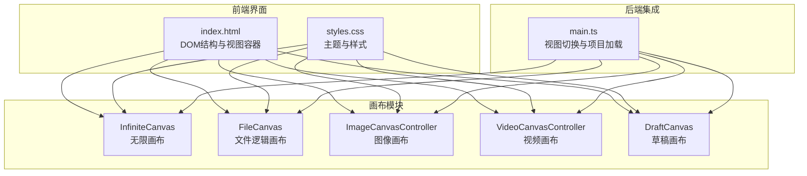
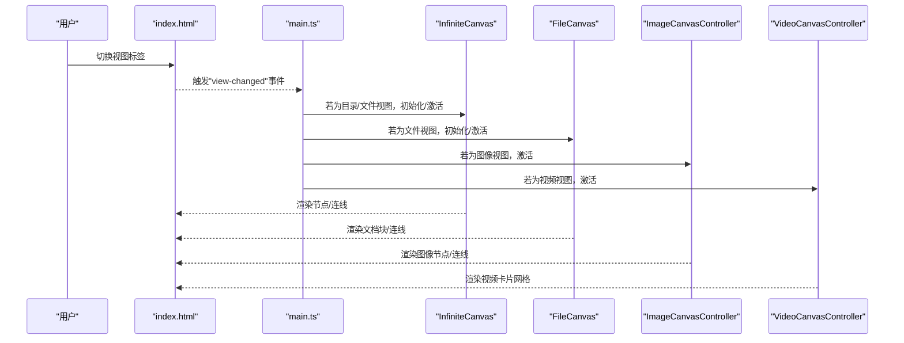
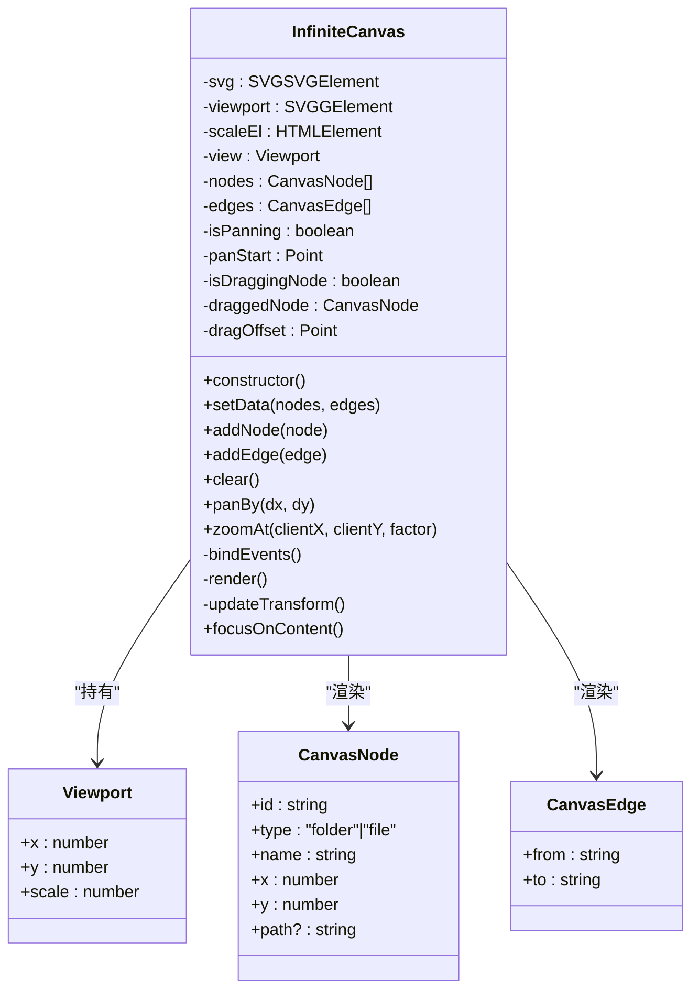
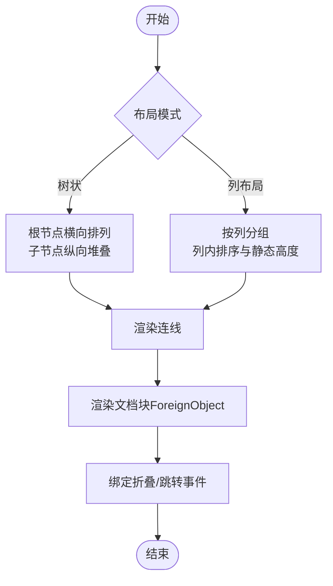
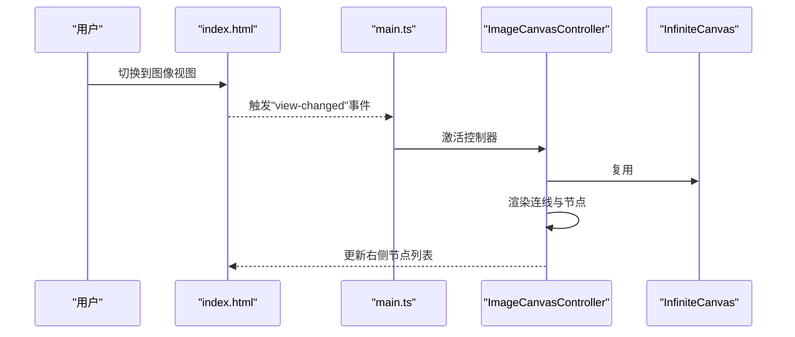
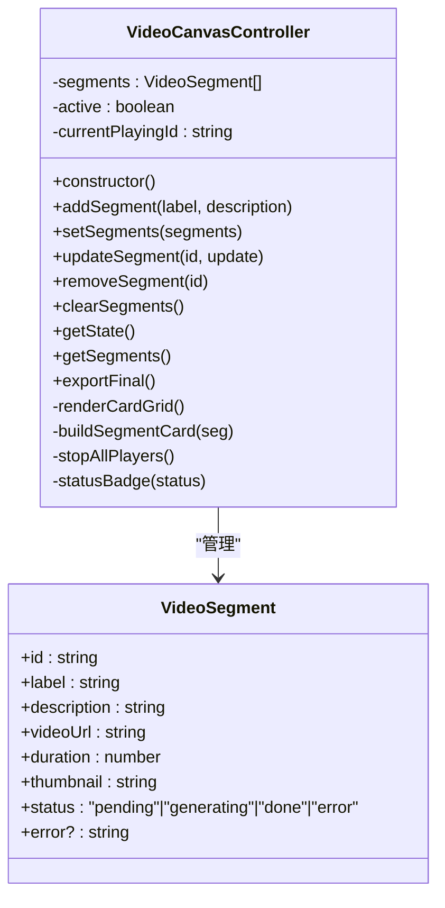
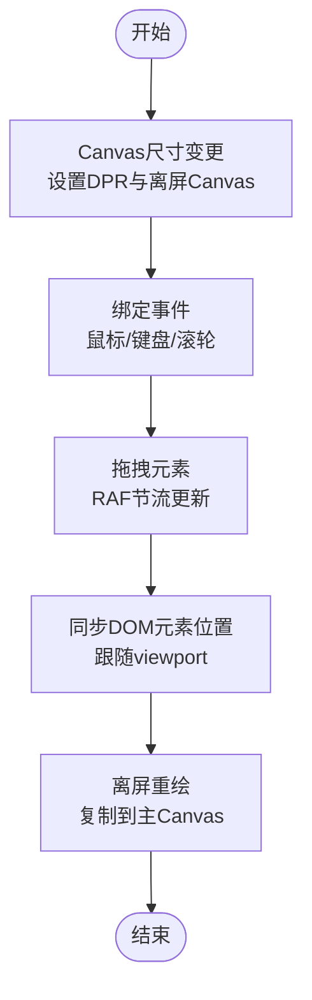
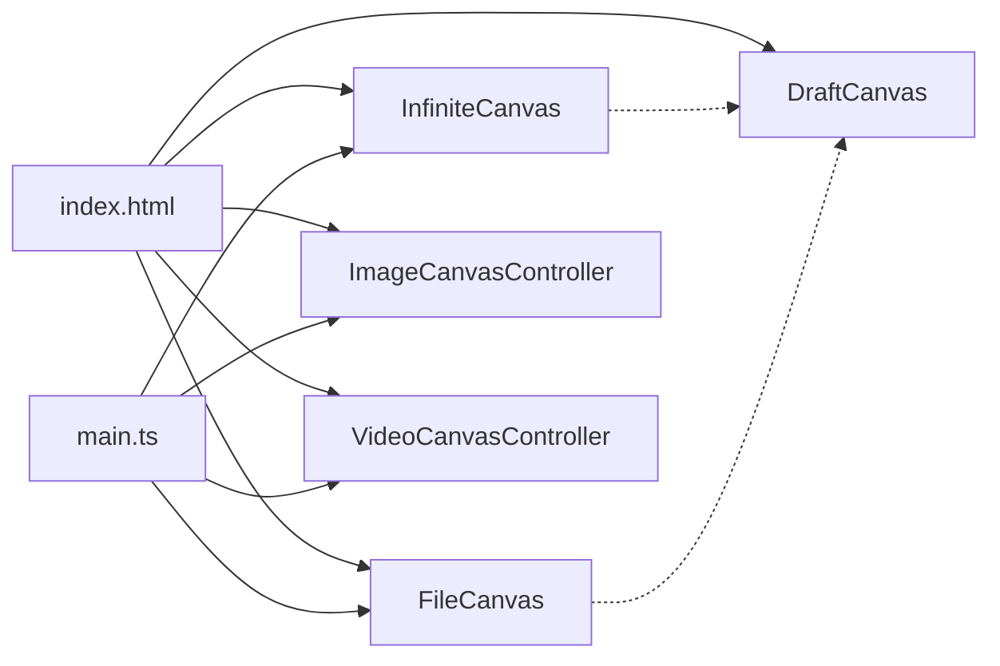

# 画布系统

<cite>
**本文档引用的文件**
- [canvas.ts](file://src/canvas.ts)
- [image-canvas.ts](file://src/image-canvas.ts)
- [video-canvas.ts](file://src/video-canvas.ts)
- [main.ts](file://src/main.ts)
- [index.html](file://index.html)
- [styles.css](file://src/styles.css)
- [draft.ts](file://src/draft.ts)
</cite>

## 目录
1. [简介](#简介)
2. [项目结构](#项目结构)
3. [核心组件](#核心组件)
4. [架构总览](#架构总览)
5. [详细组件分析](#详细组件分析)
6. [依赖关系分析](#依赖关系分析)
7. [性能考量](#性能考量)
8. [故障排查指南](#故障排查指南)
9. [结论](#结论)
10. [附录](#附录)

## 简介
本文件面向画布系统，系统性梳理无限画布、文件逻辑画布、图像画布与视频画布的架构设计与实现要点，覆盖交互（拖拽、缩放、平移）、渲染优化、状态管理、内存优化与错误处理，并说明与后端数据处理模块的集成方式。文档同时提供API接口说明、参数配置、返回值约定与最佳实践，帮助开发者快速上手与扩展。

## 项目结构
画布系统主要由以下模块构成：
- 无限画布：基于SVG的无限空间画布，支持节点与连线渲染、拖拽节点、平移与缩放、自动定位到内容区域。
- 文件逻辑画布：基于SVG的文档块画布，支持树状/列布局、折叠展开、连线渲染与点击跳转。
- 图像画布：复用无限画布的SVG视口，渲染图像节点与连线，提供节点增删与状态查询。
- 视频画布：卡片网格视图，展示视频片段状态、播放器与导出功能。
- 草稿画布：叠加在无限画布之上的Canvas 2D画布，支持手绘、便签、截图、小画布等元素，具备离屏缓存与RAF调度渲染。
- 主入口：负责视图切换事件、项目加载与画布初始化。

图表来源
- [index.html:125-176](file://index.html#L125-L176)
- [canvas.ts:30-302](file://src/canvas.ts#L30-L302)
- [image-canvas.ts:24-218](file://src/image-canvas.ts#L24-L218)
- [video-canvas.ts:16-273](file://src/video-canvas.ts#L16-L273)
- [draft.ts:429-535](file://src/draft.ts#L429-L535)
- [main.ts:239-241](file://src/main.ts#L239-L241)

章节来源
- [index.html:125-176](file://index.html#L125-L176)
- [styles.css:1-200](file://src/styles.css#L1-L200)

## 核心组件
本节概述四大画布组件的职责与关键能力：
- 无限画布（InfiniteCanvas）：提供SVG视口、节点与连线渲染、拖拽节点、平移与缩放、自动定位到内容区域、与草稿画布的视口同步。
- 文件逻辑画布（FileCanvas）：提供文档块渲染、树状/列布局、折叠展开、连线渲染、点击跳转与HTML内联渲染。
- 图像画布（ImageCanvasController）：复用无限画布的SVG视口，渲染图像节点与连线，提供节点增删与状态查询。
- 视频画布（VideoCanvasController）：卡片网格视图，展示视频片段状态、播放器与导出功能。
- 草稿画布（DraftCanvas）：Canvas 2D叠加画布，支持手绘、便签、截图、小画布等元素，具备离屏缓存与RAF调度渲染。

章节来源
- [canvas.ts:30-302](file://src/canvas.ts#L30-L302)
- [image-canvas.ts:24-218](file://src/image-canvas.ts#L24-L218)
- [video-canvas.ts:16-273](file://src/video-canvas.ts#L16-L273)
- [draft.ts:429-535](file://src/draft.ts#L429-L535)

## 架构总览
画布系统采用“视图容器 + 多画布控制器”的架构：
- 视图容器由index.html提供，包含无限画布SVG、文件逻辑画布SVG、视频面板、图像面板与草稿画布Canvas。
- 控制器通过事件驱动（如view-changed）在不同视图之间切换，分别渲染各自的数据模型。
- 主入口main.ts负责项目加载、视图切换事件监听与画布初始化。

图表来源
- [index.html:306-354](file://index.html#L306-L354)
- [main.ts:239-241](file://src/main.ts#L239-L241)
- [canvas.ts:30-302](file://src/canvas.ts#L30-L302)
- [image-canvas.ts:34-48](file://src/image-canvas.ts#L34-L48)
- [video-canvas.ts:25-33](file://src/video-canvas.ts#L25-L33)

## 详细组件分析

### 无限画布（InfiniteCanvas）
- 数据模型
  - 节点：包含id、类型（文件夹/文件）、名称、坐标与可选路径。
  - 边：包含from、to两个节点id。
- 交互
  - 鼠标滚轮缩放：以鼠标位置为中心缩放，限制缩放范围。
  - 鼠标拖拽：支持平移画布与拖拽节点，拖拽时即时更新节点坐标并重绘。
  - 点击重置：点击缩放比例按钮或回正按钮，自动定位到内容区域，避开左侧对话区。
- 渲染
  - 渲染顺序：先渲染连线（在节点下方），再渲染节点（含圆形与标签）。
  - 节点点击：文件节点点击触发预览（通过window.openFilePreview）。
- 视口同步
  - 更新transform并同步到草稿画布的视口事件。

图表来源
- [canvas.ts:30-302](file://src/canvas.ts#L30-L302)

章节来源
- [canvas.ts:30-302](file://src/canvas.ts#L30-L302)

### 文件逻辑画布（FileCanvas）
- 数据模型
  - 文档块：包含id、标题、层级、内容、子节点id数组、坐标、宽高、折叠状态、元信息、强调色、列序等。
- 布局
  - 树状布局：根节点横向排列，子节点纵向堆叠。
  - 列布局：按列分组，支持列内排序与静态高度。
- 交互
  - 鼠标滚轮缩放：以鼠标位置为中心缩放，限制缩放范围。
  - 鼠标拖拽：支持平移画布与拖拽文档块，拖拽时即时更新块坐标并重绘。
  - 折叠/展开：点击切换块高度，不重新布局。
- 渲染
  - 连线：从父块底部中心到子块顶部中心的折线。
  - 文档块：ForeignObject内嵌HTML，支持标题、元信息、正文与折叠按钮。
  - 内联渲染：将Markdown转换为HTML（标题、粗体、斜体、列表、代码块等）。

图表来源
- [canvas.ts:446-522](file://src/canvas.ts#L446-L522)
- [canvas.ts:539-662](file://src/canvas.ts#L539-L662)

章节来源
- [canvas.ts:351-663](file://src/canvas.ts#L351-L663)

### 图像画布（ImageCanvasController）
- 数据模型
  - 图像节点：包含id、坐标、标签、图片资源（路径或base64）、宽高。
  - 连接：包含id、fromId、toId、标签。
- 交互
  - 视图切换：监听"view-changed"事件，在图像视图激活时渲染，退出时清理。
  - 滚轮缩放：转发到主画布同步变换（由草稿画布处理）。
- 渲染
  - 连线：使用SVG path绘制曲线连接，带箭头标记。
  - 节点：矩形背景、图片、标签文本。
  - 节点列表：右侧列表展示节点，便于管理。

图表来源
- [image-canvas.ts:34-48](file://src/image-canvas.ts#L34-L48)
- [image-canvas.ts:62-131](file://src/image-canvas.ts#L62-L131)
- [canvas.ts:45-52](file://src/canvas.ts#L45-L52)

章节来源
- [image-canvas.ts:24-218](file://src/image-canvas.ts#L24-L218)

### 视频画布（VideoCanvasController）
- 数据模型
  - 视频片段：包含id、标签、描述、视频URL、时长、缩略图、状态（等待中/生成中/已完成/失败）、错误信息。
- 视图
  - 卡片网格：每个片段一个卡片，包含缩略图/播放器、状态徽章、时长、导出按钮、进度条与错误信息。
- 交互
  - 导出：点击导出按钮下载片段视频（blob URL通过a标签下载）。
  - 播放：同一时刻仅允许一个视频播放，避免多视频冲突。
  - 空状态：当无片段时显示引导文案。
- API
  - 添加/批量设置/更新/移除/清空片段。
  - 获取状态与片段列表。
  - 导出完整拼接视频（触发全局事件）。

图表来源
- [video-canvas.ts:16-273](file://src/video-canvas.ts#L16-L273)

章节来源
- [video-canvas.ts:16-273](file://src/video-canvas.ts#L16-L273)

### 草稿画布（DraftCanvas）
- 设计要点
  - 叠加在无限画布之上，使用Canvas 2D绘制。
  - 离屏缓存：在离屏Canvas中按主画布相同的viewport变换进行重绘，主Canvas仅复制离屏结果，降低重复绘制成本。
  - RAF调度：使用requestAnimationFrame避免每帧重复绘制，提升流畅度。
  - 视口同步：与无限画布共享viewport，滚动/缩放时同步DOM元素位置。
- 交互
  - 鼠标拖拽：支持拖拽便签、截图、小画布，使用RAF节流更新位置。
  - 右键平移：转发到主画布平移。
  - 滚轮缩放：转发到主画布缩放。
- 图层与元素
  - 支持多图层，包含笔画、形状、便签、截图、小画布等。

图表来源
- [draft.ts:468-495](file://src/draft.ts#L468-L495)
- [draft.ts:535-563](file://src/draft.ts#L535-L563)
- [draft.ts:1725-1732](file://src/draft.ts#L1725-L1732)
- [draft.ts:1734-1763](file://src/draft.ts#L1734-L1763)

章节来源
- [draft.ts:429-535](file://src/draft.ts#L429-L535)
- [draft.ts:1721-1941](file://src/draft.ts#L1721-L1941)

## 依赖关系分析
- DOM结构依赖：无限画布与文件画布依赖index.html中的SVG容器；视频画布依赖卡片网格容器；图像画布依赖无限画布的SVG视口；草稿画布依赖Canvas容器。
- 事件依赖：视图切换通过"view-changed"事件驱动；无限画布与文件画布通过"canvas-viewport-changed"事件与草稿画布同步视口。
- 主入口依赖：main.ts负责初始化无限画布、监听视图切换与项目加载。

图表来源
- [index.html:125-176](file://index.html#L125-L176)
- [main.ts:239-241](file://src/main.ts#L239-L241)
- [canvas.ts:196-198](file://src/canvas.ts#L196-L198)

章节来源
- [index.html:125-176](file://index.html#L125-L176)
- [main.ts:239-241](file://src/main.ts#L239-L241)
- [canvas.ts:196-198](file://src/canvas.ts#L196-L198)

## 性能考量
- SVG渲染优化
  - 无限画布与文件画布均采用SVG渲染，节点与连线按需重绘，避免全量重排。
  - 文件画布在渲染文档块时使用ForeignObject内嵌HTML，注意避免过度复杂DOM结构。
- Canvas渲染优化
  - 草稿画布采用离屏缓存与RAF调度，仅在脏标记时重绘，主Canvas直接复制离屏结果，显著降低CPU/GPU压力。
  - 笔画与形状绘制使用简化的路径与alpha混合策略，减少计算开销。
- 交互性能
  - 拖拽节点与拖拽元素使用RAF节流，避免高频重绘。
  - 滚轮缩放在无限画布与文件画布中限制缩放范围，避免极端缩放导致的重绘压力。
- 内存优化
  - 图像画布在视图切换时清理SVG元素，避免残留DOM占用内存。
  - 草稿画布在视图切换时重置离屏缓存标记，避免长期累积的脏数据。
- 最佳实践
  - 控制节点/块数量，避免一次性渲染过多元素。
  - 合理使用ForeignObject，避免在其中放置大量动态内容。
  - 使用RAF调度渲染，避免频繁的同步绘制。
  - 在视图切换时及时清理不再使用的DOM或Canvas资源。

[本节为通用性能指导，不直接分析具体文件]

## 故障排查指南
- 画布无法渲染
  - 检查DOM容器是否存在（无限画布SVG、文件画布SVG、视频卡片网格、图像面板、草稿Canvas）。
  - 确认主入口已初始化无限画布。
- 视图切换异常
  - 检查"view-changed"事件是否正确触发，控制器是否正确响应。
  - 确认控制器在激活时调用渲染，在失活时清理。
- 缩放/平移异常
  - 检查滚轮事件是否被preventDefault，确保缩放逻辑生效。
  - 确认视口变换更新成功并同步到草稿画布。
- 视频播放冲突
  - 检查播放事件是否正确暂停之前的播放器，确保同一时刻仅有一个视频播放。
- 导出失败
  - 检查视频URL是否为blob URL，确保a标签下载可用。
- 草稿画布渲染卡顿
  - 检查离屏缓存标记是否正确设置，RAF调度是否生效。
  - 确认元素拖拽时使用RAF节流，避免频繁重绘。

章节来源
- [canvas.ts:55-132](file://src/canvas.ts#L55-L132)
- [image-canvas.ts:34-48](file://src/image-canvas.ts#L34-L48)
- [video-canvas.ts:138-146](file://src/video-canvas.ts#L138-L146)
- [draft.ts:549-555](file://src/draft.ts#L549-L555)
- [draft.ts:1725-1732](file://src/draft.ts#L1725-L1732)

## 结论
画布系统通过清晰的模块划分与事件驱动机制，实现了多视图协同与高性能渲染。无限画布与文件画布提供基础的SVG渲染与交互能力，图像画布复用无限画布视口实现图像节点与连线渲染，视频画布以卡片网格形式管理视频片段状态与播放，草稿画布通过离屏缓存与RAF调度实现流畅的手绘体验。配合主入口的视图切换与项目加载，系统具备良好的扩展性与维护性。

[本节为总结性内容，不直接分析具体文件]

## 附录

### API参考与使用示例

- 无限画布（InfiniteCanvas）
  - 初始化与实例获取
    - 初始化：调用初始化函数以创建全局实例。
    - 获取实例：获取已存在的实例用于操作。
  - 数据与渲染
    - setData(nodes, edges)：设置节点与连线并渲染，随后自动定位到内容区域。
    - addNode(node)：添加单个节点并重绘。
    - addEdge(edge)：添加单个连线并重绘。
    - clear()：清空画布。
  - 视口控制
    - panBy(dx, dy)：相对偏移平移。
    - zoomAt(clientX, clientY, factor)：以屏幕坐标为锚点缩放。
    - focusOnContent()：自动定位到内容区域（避开左侧对话区）。
  - 交互事件
    - 绑定滚轮缩放、鼠标拖拽（平移/拖拽节点）、点击重置。

- 文件逻辑画布（FileCanvas）
  - 数据与布局
    - setData(blocks, edges, options)：设置文档块与连线，自动布局并渲染。
    - toggleBlock(id)：切换块的折叠/展开状态。
    - clear()：清空画布。
  - 布局模式
    - tree：树状布局（默认）。
    - columns：列布局（按列分组与排序）。
  - 渲染与交互
    - 渲染连线与文档块，绑定折叠按钮与跳转事件。

- 图像画布（ImageCanvasController）
  - 视图切换
    - 监听"view-changed"事件，在图像视图激活时渲染，退出时清理。
  - 节点管理
    - addNode(src, label, x?, y?)：添加图像节点并返回id。
    - connect(fromId, toId, label?)：建立节点间连线。
    - removeNode(id)：删除节点及关联连线。
    - getState()：获取当前节点与连线状态。
    - setSelection(rect)：预留选区功能。
    - getSelection()：预留选区查询。
  - 渲染
    - 渲染连线与节点（矩形背景、图片、标签），更新右侧节点列表。

- 视频画布（VideoCanvasController）
  - 片段管理
    - addSegment(label, description?)：添加片段并返回id。
    - setSegments(segments)：批量设置片段并返回ids。
    - updateSegment(id, update)：更新片段状态/URL/时长/缩略图/错误信息等。
    - removeSegment(id)：移除片段。
    - clearSegments()：清空所有片段。
    - getState()/getSegments()：获取状态与片段列表。
  - 导出
    - exportFinal()：触发全局导出事件，交由主入口处理。
  - 渲染
    - 渲染卡片网格，包含缩略图/播放器、状态徽章、时长、导出按钮、进度条与错误信息。

- 草稿画布（DraftCanvas）
  - 视口同步
    - setViewport(viewport)：设置视口并同步DOM元素位置。
  - 事件绑定
    - 鼠标拖拽：支持便签、截图、小画布拖拽，使用RAF节流。
    - 右键平移：转发到主画布。
    - 滚轮缩放：转发到主画布。
  - 渲染
    - 离屏重绘：在离屏Canvas中按主画布viewport变换重绘。
    - 主Canvas复制离屏结果，临时元素（笔画/形状/选区）应用viewport变换。

章节来源
- [canvas.ts:305-316](file://src/canvas.ts#L305-L316)
- [canvas.ts:220-246](file://src/canvas.ts#L220-L246)
- [canvas.ts:201-218](file://src/canvas.ts#L201-L218)
- [canvas.ts:134-184](file://src/canvas.ts#L134-L184)
- [canvas.ts:351-663](file://src/canvas.ts#L351-L663)
- [image-canvas.ts:156-204](file://src/image-canvas.ts#L156-L204)
- [video-canvas.ts:185-256](file://src/video-canvas.ts#L185-L256)
- [draft.ts:497-503](file://src/draft.ts#L497-L503)
- [draft.ts:535-563](file://src/draft.ts#L535-L563)
- [draft.ts:1734-1763](file://src/draft.ts#L1734-L1763)

### 与后端数据处理模块的集成
- 项目加载与画布初始化
  - 主入口在DOMContentLoaded后初始化无限画布，并监听拖拽事件以打开项目。
  - 项目加载完成后，根据当前视图加载对应的画布数据（目录/文件/仓库/Git/词元/设置）。
- 画布数据归一化
  - 目录卡片模式支持多种历史格式，主入口提供归一化逻辑，优先使用新格式子字段，旧字段作为兜底。
- 专家团流水线
  - 视图切换时，主入口负责加载专家团数据与令牌数据，为画布分析与消息发送提供支撑。

章节来源
- [main.ts:239-262](file://src/main.ts#L239-L262)
- [main.ts:5563-5573](file://src/main.ts#L5563-L5573)