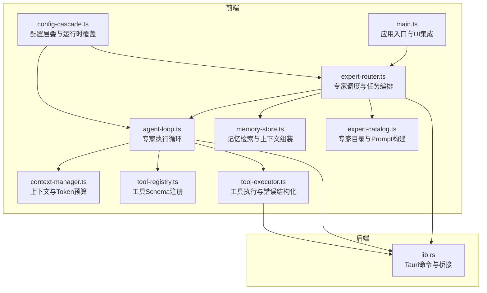
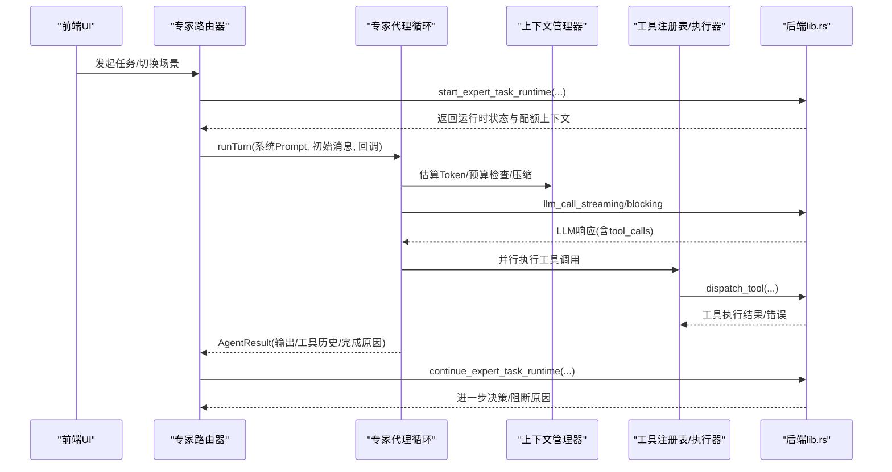
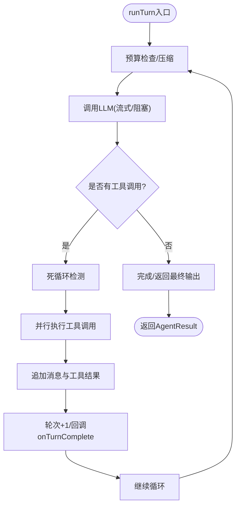
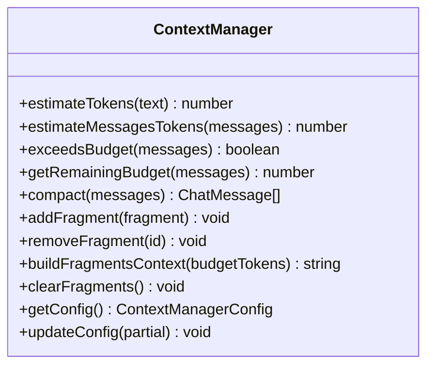
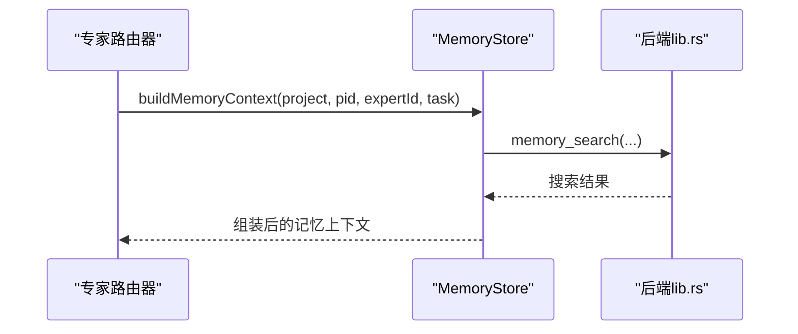
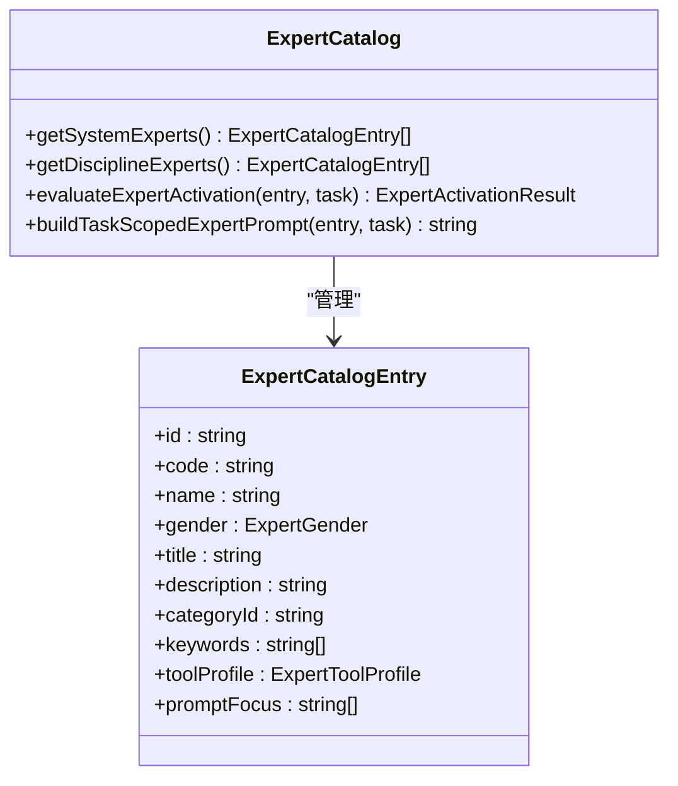
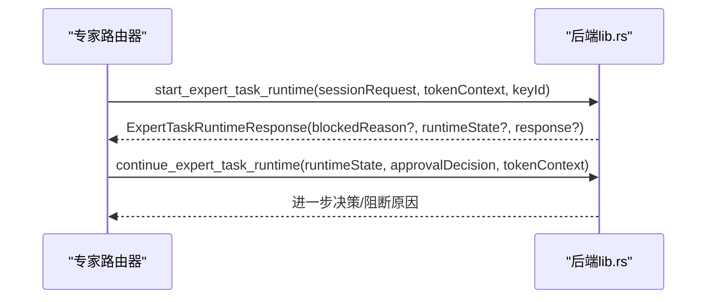
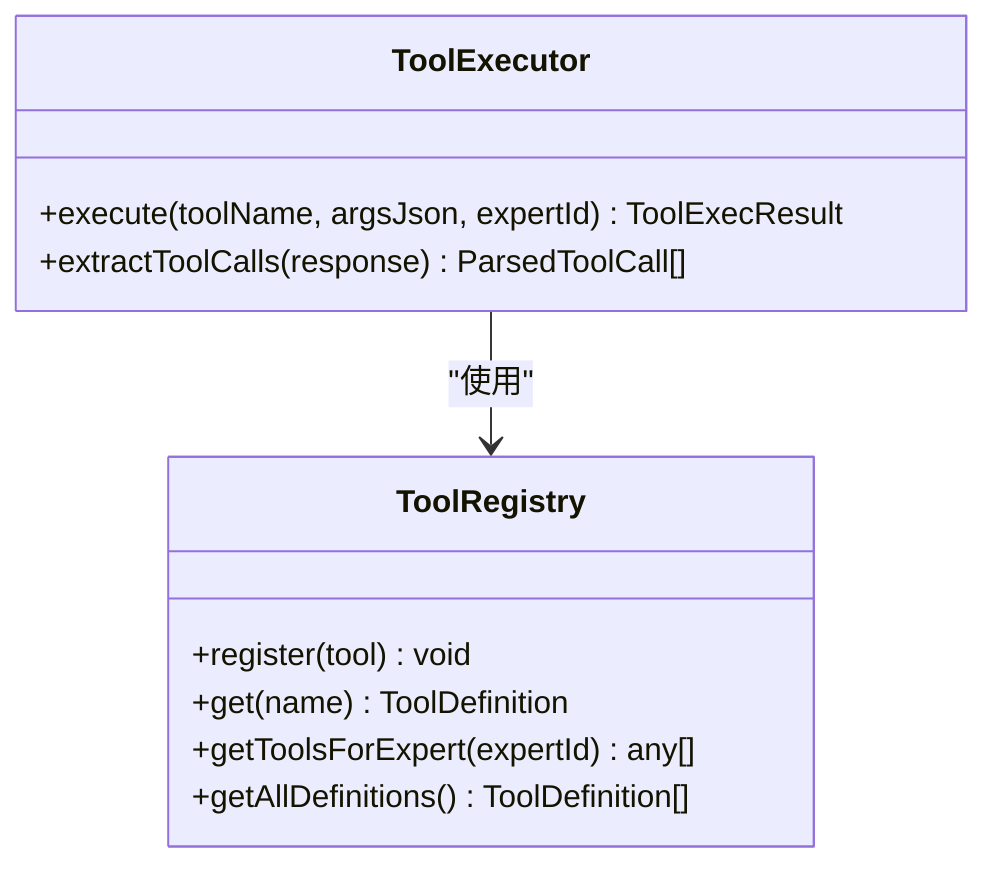
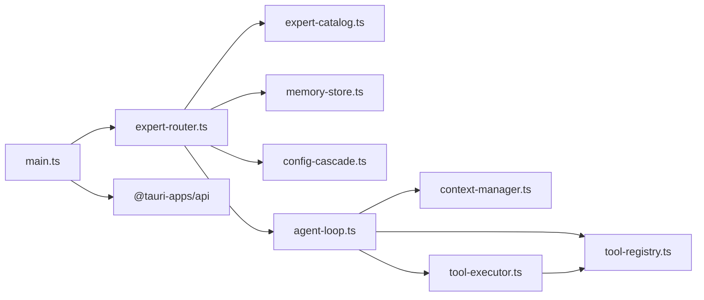
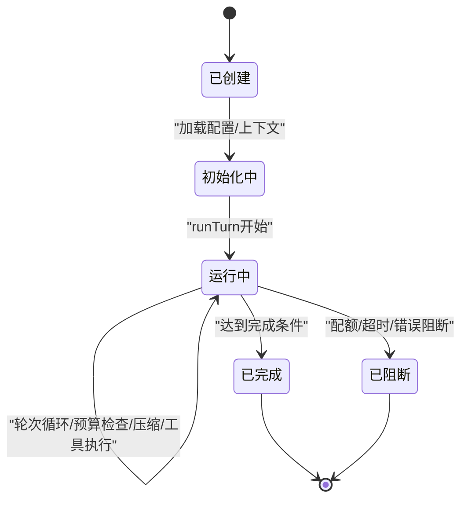

# 专家代理管理

<cite>
**本文档引用的文件**
- [src/main.ts](file://src/main.ts)
- [src/agent-loop.ts](file://src/agent-loop.ts)
- [src/context-manager.ts](file://src/context-manager.ts)
- [src/memory-store.ts](file://src/memory-store.ts)
- [src/expert-catalog.ts](file://src/expert-catalog.ts)
- [src/expert-router.ts](file://src/expert-router.ts)
- [src/tool-registry.ts](file://src/tool-registry.ts)
- [src/tool-executor.ts](file://src/tool-executor.ts)
- [src/config-cascade.ts](file://src/config-cascade.ts)
- [src-tauri/src/lib.rs](file://src-tauri/src/lib.rs)
- [package.json](file://package.json)
</cite>

## 目录
1. [简介](#简介)
2. [项目结构](#项目结构)
3. [核心组件](#核心组件)
4. [架构总览](#架构总览)
5. [详细组件分析](#详细组件分析)
6. [依赖分析](#依赖分析)
7. [性能考量](#性能考量)
8. [故障排查指南](#故障排查指南)
9. [结论](#结论)
10. [附录](#附录)

## 简介
本文件面向“专家代理管理系统”的使用者与开发者，系统性阐述专家代理的生命周期管理、专家代理循环机制、专家运行时引擎与专家会话引擎的协作流程、上下文与内存管理、令牌配额与超时控制、以及配置参数、性能调优与扩展接口。文档以代码为依据，辅以可视化图示，帮助读者快速理解并高效使用与扩展系统。

## 项目结构
前端采用 TypeScript/Vite，后端采用 Rust/Tauri，前后端通过命令桥接进行交互。前端负责用户界面、专家调度与任务编排、上下文与内存管理、工具注册与执行、配置层叠与运行时覆盖；后端负责专家会话与运行时状态管理、令牌配额与用量记录、流水线与黑板引擎、工具执行与安全审批、LLM调用与流式传输等。

**图示来源**
- [src/main.ts:1-800](file://src/main.ts#L1-L800)
- [src/expert-router.ts:1-800](file://src/expert-router.ts#L1-L800)
- [src/agent-loop.ts:1-404](file://src/agent-loop.ts#L1-L404)
- [src/context-manager.ts:1-276](file://src/context-manager.ts#L1-L276)
- [src/memory-store.ts:1-337](file://src/memory-store.ts#L1-L337)
- [src/tool-registry.ts:1-192](file://src/tool-registry.ts#L1-L192)
- [src/tool-executor.ts:1-231](file://src/tool-executor.ts#L1-L231)
- [src/config-cascade.ts:1-239](file://src/config-cascade.ts#L1-L239)
- [src/expert-catalog.ts:1-855](file://src/expert-catalog.ts#L1-L855)
- [src-tauri/src/lib.rs:1-800](file://src-tauri/src/lib.rs#L1-L800)

**章节来源**
- [src/main.ts:1-800](file://src/main.ts#L1-L800)
- [package.json:1-28](file://package.json#L1-L28)

## 核心组件
- 专家代理循环（AgentLoop）：负责单次专家交互的完整循环，包括Token预算检查、自动压缩、LLM调用、工具并行执行、死循环检测与流式输出。
- 上下文管理器（ContextManager）：估算消息Token、预算检查、自动压缩、Fragment上下文构建与优先级管理。
- 记忆存储（MemoryStore）：项目与用户级记忆的保存、检索、清理与生命周期管理，支持Token感知检索。
- 专家目录（ExpertCatalog）：专家定义、系统角色、工具画像、Prompt模板与职责触发评分。
- 专家路由器（ExpertRouter）：专家任务状态、令牌配额、流水线步骤、进度快照、运行时状态与后端桥接。
- 工具注册表（ToolRegistry）：工具Schema注册、权限控制、按专家过滤。
- 工具执行器（ToolExecutor）：统一工具执行入口、错误结构化反馈、ACTION标记兼容解析。
- 配置层叠（ConfigCascade）：内置默认、用户全局、项目级与运行时覆盖的四层配置合并与持久化。
- 后端桥接（lib.rs）：Tauri命令、专家会话与运行时、令牌用量记录、流水线与黑板、工具执行与安全审批。

**章节来源**
- [src/agent-loop.ts:1-404](file://src/agent-loop.ts#L1-L404)
- [src/context-manager.ts:1-276](file://src/context-manager.ts#L1-L276)
- [src/memory-store.ts:1-337](file://src/memory-store.ts#L1-L337)
- [src/expert-catalog.ts:1-855](file://src/expert-catalog.ts#L1-L855)
- [src/expert-router.ts:1-800](file://src/expert-router.ts#L1-L800)
- [src/tool-registry.ts:1-192](file://src/tool-registry.ts#L1-L192)
- [src/tool-executor.ts:1-231](file://src/tool-executor.ts#L1-L231)
- [src/config-cascade.ts:1-239](file://src/config-cascade.ts#L1-L239)
- [src-tauri/src/lib.rs:1-800](file://src-tauri/src/lib.rs#L1-L800)

## 架构总览
专家代理管理采用“前端驱动 + 后端执行”的双层架构。前端负责交互、调度、上下文与工具编排；后端负责专家会话、令牌配额、流水线与黑板、工具执行与安全审批。两者通过Tauri命令进行桥接，实现强一致的状态管理与可观测的执行过程。

**图示来源**
- [src/expert-router.ts:506-560](file://src/expert-router.ts#L506-L560)
- [src/agent-loop.ts:76-211](file://src/agent-loop.ts#L76-L211)
- [src/context-manager.ts:92-156](file://src/context-manager.ts#L92-L156)
- [src/tool-executor.ts:24-53](file://src/tool-executor.ts#L24-L53)
- [src-tauri/src/lib.rs:272-286](file://src-tauri/src/lib.rs#L272-L286)

## 详细组件分析

### 专家代理循环（AgentLoop）
- 生命周期
  - 初始化：读取配置层叠，构建上下文管理器与工具注册表，准备中止控制器与超时。
  - 运行：循环执行，每轮检查预算、压缩上下文、调用LLM、解析工具调用、并行执行工具、记录历史、回调通知。
  - 结束：根据轮次上限、Token耗尽、超时或模型最终输出决定完成原因。
- 关键机制
  - Token预算与自动压缩：超过阈值时进行摘要与截断，保留系统消息与最近轮次。
  - 死循环检测：对连续N次相同工具调用签名进行检测，注入提示终止循环。
  - 流式输出：监听后端事件，实时回调token。
  - 超时控制：基于专家超时配置，AbortController中止当前轮次。
  - 工具重试与结构化错误：file_patch失败时构造结构化错误反馈，提示修正patch。
- 回调与结果
  - 回调：token、工具调用开始/完成、轮次完成、压缩、错误。
  - 结果：最终输出、工具调用历史、总轮次、总Token使用、完成原因。

**图示来源**
- [src/agent-loop.ts:76-211](file://src/agent-loop.ts#L76-L211)
- [src/agent-loop.ts:336-341](file://src/agent-loop.ts#L336-L341)
- [src/agent-loop.ts:273-331](file://src/agent-loop.ts#L273-L331)

**章节来源**
- [src/agent-loop.ts:1-404](file://src/agent-loop.ts#L1-L404)

### 上下文管理器（ContextManager）
- 功能
  - Token估算：中文、英文/代码、换行与标点的启发式估算。
  - 预算检查：按阈值判断是否需要压缩。
  - 自动压缩：保留system消息与最近N轮，旧轮次摘要，工具输出截断。
  - Fragment管理：按优先级与最大Token限制构建上下文。
- 配置
  - 总预算、压缩阈值、预留比例、保留最近轮次、单Fragment最大Token。

**图示来源**
- [src/context-manager.ts:37-266](file://src/context-manager.ts#L37-L266)

**章节来源**
- [src/context-manager.ts:1-276](file://src/context-manager.ts#L1-L276)

### 记忆存储（MemoryStore）
- 能力
  - 保存记忆、检索记忆、删除与清空、运行生命周期、统计查询。
  - 从专家输出提取关键结论并保存为Working记忆，保存用户意图到Ephemeral记忆。
  - 组装专家/通用记忆上下文，支持Token感知检索（降级回退）。
- 关键流程
  - buildMemoryContext/buildGeneralMemoryContext：按任务描述检索历史记忆并拼接。
  - searchMemoryWithBudget：根据剩余Token预算截断结果。

**图示来源**
- [src/memory-store.ts:160-213](file://src/memory-store.ts#L160-L213)
- [src/memory-store.ts:310-335](file://src/memory-store.ts#L310-L335)

**章节来源**
- [src/memory-store.ts:1-337](file://src/memory-store.ts#L1-L337)

### 专家目录（ExpertCatalog）
- 专家定义：ID、代码、姓名、性别、头衔、描述、类别、关键词、工具画像、Prompt聚焦。
- 系统专家：主管与助手，具备系统角色与特殊权限。
- 专家激活评分：基于任务描述与专家关键词、工具画像进行评分与触发概率计算。
- Prompt构建：知识库、方法论、职责触发指导、工程/只读规则注入。
- 工具权限映射：按专家角色限制可用工具集合。

**图示来源**
- [src/expert-catalog.ts:11-680](file://src/expert-catalog.ts#L11-L680)

**章节来源**
- [src/expert-catalog.ts:1-855](file://src/expert-catalog.ts#L1-L855)

### 专家路由器（ExpertRouter）
- 专家任务状态：待处理、运行中、完成、错误，包含输入、输出、错误、Token使用、阶段信息。
- 令牌配额与阻断：项目/用户Token数据加载与持久化、运行时上下文、阻断消息展示。
- 流水线与黑板：步骤布局、执行回合、跟进任务、决策与阻断。
- 运行时状态：专家会话请求、令牌上下文、项目/工作区信息、消息与工具请求、交付尝试次数。
- 前端桥接：start_expert_task_runtime、continue_expert_task_runtime、构建流水线进度快照。

**图示来源**
- [src/expert-router.ts:506-560](file://src/expert-router.ts#L506-L560)
- [src-tauri/src/lib.rs:272-286](file://src-tauri/src/lib.rs#L272-L286)

**章节来源**
- [src/expert-router.ts:1-800](file://src/expert-router.ts#L1-L800)

### 工具注册表与执行器（ToolRegistry/ToolExecutor）
- 工具注册表：内置工具Schema（shell_exec、file_read、file_write、file_patch、file_list、web_search、memory_query、index_search），按专家权限过滤。
- 工具执行器：统一入口dispatch_tool，处理file_patch结构化错误反馈，兼容ACTION标记格式解析，映射到新工具系统。

**图示来源**
- [src/tool-registry.ts:20-182](file://src/tool-registry.ts#L20-L182)
- [src/tool-executor.ts:13-231](file://src/tool-executor.ts#L13-L231)

**章节来源**
- [src/tool-registry.ts:1-192](file://src/tool-registry.ts#L1-L192)
- [src/tool-executor.ts:1-231](file://src/tool-executor.ts#L1-L231)

### 配置层叠（ConfigCascade）
- 四层配置：内置默认 < 用户全局 < 项目级 < 运行时覆盖。
- 段落配置：LLM、Shell、审批、Agent、Pipeline、UI。
- 运行时覆盖：setRuntimeOverride即时生效，save持久化至后端。

**图示来源**
- [src/config-cascade.ts:108-239](file://src/config-cascade.ts#L108-L239)

**章节来源**
- [src/config-cascade.ts:1-239](file://src/config-cascade.ts#L1-L239)

### 后端桥接（lib.rs）
- 命令桥接：专家会话启动/继续、流水线回合结算、进度快照、工具执行、令牌用量记录、工作区预检、上下文组装等。
- 令牌配额：主管与专家的配额检查与用量追加。
- 上下文与记忆：当前项目上下文、通用记忆上下文、工作区预检。

**章节来源**
- [src-tauri/src/lib.rs:1-800](file://src-tauri/src/lib.rs#L1-L800)

## 依赖分析
- 前端模块耦合
  - expert-router 依赖 expert-catalog、memory-store、config-cascade。
  - agent-loop 依赖 context-manager、tool-registry、tool-executor、config-cascade。
  - tool-executor 依赖 tool-registry。
  - main.ts 依赖 expert-router、memory-store、config-cascade。
- 后端模块耦合
  - lib.rs 作为命令入口，调用各引擎模块（专家会话、令牌、流水线、工具系统等）。
- 外部依赖
  - @tauri-apps/api：事件监听、命令调用、窗口控制。
  - highlight.js：代码高亮。

**图示来源**
- [src/main.ts:1-800](file://src/main.ts#L1-L800)
- [src/expert-router.ts:1-800](file://src/expert-router.ts#L1-L800)
- [src/agent-loop.ts:1-404](file://src/agent-loop.ts#L1-L404)
- [src/context-manager.ts:1-276](file://src/context-manager.ts#L1-L276)
- [src/memory-store.ts:1-337](file://src/memory-store.ts#L1-L337)
- [src/tool-registry.ts:1-192](file://src/tool-registry.ts#L1-L192)
- [src/tool-executor.ts:1-231](file://src/tool-executor.ts#L1-L231)
- [src/config-cascade.ts:1-239](file://src/config-cascade.ts#L1-L239)

**章节来源**
- [src/main.ts:1-800](file://src/main.ts#L1-L800)
- [package.json:1-28](file://package.json#L1-L28)

## 性能考量
- Token预算与压缩
  - 合理设置压缩阈值与保留轮次，避免频繁压缩导致上下文丢失。
  - 对超长工具输出进行截断，减少Token占用。
- 工具并行执行
  - 并行执行工具调用，缩短总时延；注意后端工具执行的超时与输出大小限制。
- 流式输出
  - 开启流式输出可提升交互体验，但需合理处理事件监听与内存回收。
- 配置优化
  - 调整Agent轮次上限、Pipeline步数、Shell超时与输出限制，平衡吞吐与稳定性。
- 记忆检索
  - 使用Token感知检索，避免超预算；必要时降级回退到普通检索。

[本节为通用指导，无需特定文件引用]

## 故障排查指南
- 专家执行超时
  - 检查专家超时配置与AbortController中止逻辑；适当提高超时或优化工具执行。
- 死循环
  - 关注死循环检测日志与注入提示；检查工具调用签名是否一致。
- 工具执行失败
  - file_patch失败时查看结构化错误反馈，修正patch或改用file_write；其他工具失败查看错误消息与元数据。
- 令牌配额阻断
  - 检查项目/用户Token数据与配额分配；查看阻断消息并调整限额或清理用量。
- 记忆检索异常
  - 检查记忆查询参数与Token预算；降级回退到普通检索并记录告警。

**章节来源**
- [src/agent-loop.ts:336-383](file://src/agent-loop.ts#L336-L383)
- [src/tool-executor.ts:59-140](file://src/tool-executor.ts#L59-L140)
- [src/expert-router.ts:86-105](file://src/expert-router.ts#L86-L105)
- [src/memory-store.ts:310-335](file://src/memory-store.ts#L310-L335)

## 结论
本系统通过前端驱动的专家代理循环与后端强大的会话、令牌与流水线引擎，实现了高可扩展、可观测、可调优的专家代理管理。通过合理的配置层叠、上下文与记忆管理、工具权限控制与超时/配额保障，能够在复杂任务中稳定地完成专家协作与交付。

[本节为总结，无需特定文件引用]

## 附录

### 专家代理生命周期与运行时流程
- 创建：专家目录构建系统Prompt，路由器准备会话请求与令牌上下文。
- 初始化：加载配置层叠，准备上下文与工具注册表。
- 运行：循环执行，每轮检查预算、压缩上下文、调用LLM、并行工具执行、记录历史。
- 销毁：根据完成原因与阻断决策，持久化结果与用量，清理临时状态。

**图示来源**
- [src/agent-loop.ts:76-211](file://src/agent-loop.ts#L76-L211)
- [src/expert-router.ts:506-560](file://src/expert-router.ts#L506-L560)

### 专家运行时引擎工作流程（前端）
- 输入：专家ID、场景、任务描述、历史结果、API密钥、模型、项目信息、提示模块ID。
- 处理：构建任务scoped Prompt，调用后端启动专家任务运行时，接收运行时状态与响应。
- 输出：阻断原因、运行时状态、后端响应（含进度事件、工具事件、状态快照）。

**章节来源**
- [src/expert-router.ts:506-560](file://src/expert-router.ts#L506-L560)

### 专家会话引擎会话管理机制（前端）
- 任务状态管理：待处理、运行中、完成、错误，包含输入/输出/错误/阶段信息。
- 令牌配额：项目/用户Token数据加载与持久化，阻断消息展示。
- 流水线：步骤布局、执行回合、跟进任务、决策与阻断。
- 运行时状态：消息、工具请求、交付尝试次数、触发来源、模块学习记录。

**章节来源**
- [src/expert-router.ts:264-504](file://src/expert-router.ts#L264-L504)

### 配置参数与调优建议
- Agent配置
  - max_turns：轮次上限，避免无限循环。
  - token_budget：总预算，配合compact_threshold与reserve_ratio。
  - compact_threshold：触发压缩的比例阈值。
  - dead_loop_detection：连续相同调用检测轮数。
  - expert_timeout：单次专家执行超时。
- Pipeline配置
  - expert_timeout_ms：专家超时。
  - max_pipeline_steps：流水线最大步数。
  - enable_parallel：是否启用并行。
- UI配置
  - streaming_enabled：是否启用流式输出。
  - show_tool_calls/show_progress_bar：界面展示选项。
- 运行时覆盖
  - setRuntimeOverride：即时覆盖配置项，适用于调试与临时调优。

**章节来源**
- [src/config-cascade.ts:44-103](file://src/config-cascade.ts#L44-L103)
- [src/config-cascade.ts:166-183](file://src/config-cascade.ts#L166-L183)

### 扩展接口与最佳实践
- 自定义专家代理
  - 在专家目录中新增专家条目，定义工具画像与Prompt聚焦，使用buildTaskScopedExpertPrompt注入系统Prompt。
  - 通过getToolsForExpert限制工具权限，确保安全。
- 自定义工具
  - 在ToolRegistry中注册工具Schema，定义参数与权限；在ToolExecutor中处理执行与错误反馈。
- 自定义配置
  - 通过ConfigCascade加载/保存配置，或使用setRuntimeOverride进行临时覆盖。
- 异常处理
  - 使用AgentLoop回调与ToolExecutor错误结构化反馈，结合后端阻断消息进行用户提示与日志记录。

**章节来源**
- [src/expert-catalog.ts:549-680](file://src/expert-catalog.ts#L549-L680)
- [src/tool-registry.ts:20-182](file://src/tool-registry.ts#L20-L182)
- [src/tool-executor.ts:24-53](file://src/tool-executor.ts#L24-L53)
- [src/config-cascade.ts:108-195](file://src/config-cascade.ts#L108-L195)