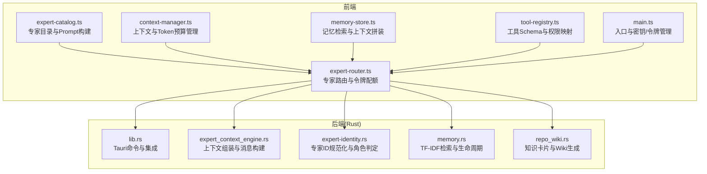
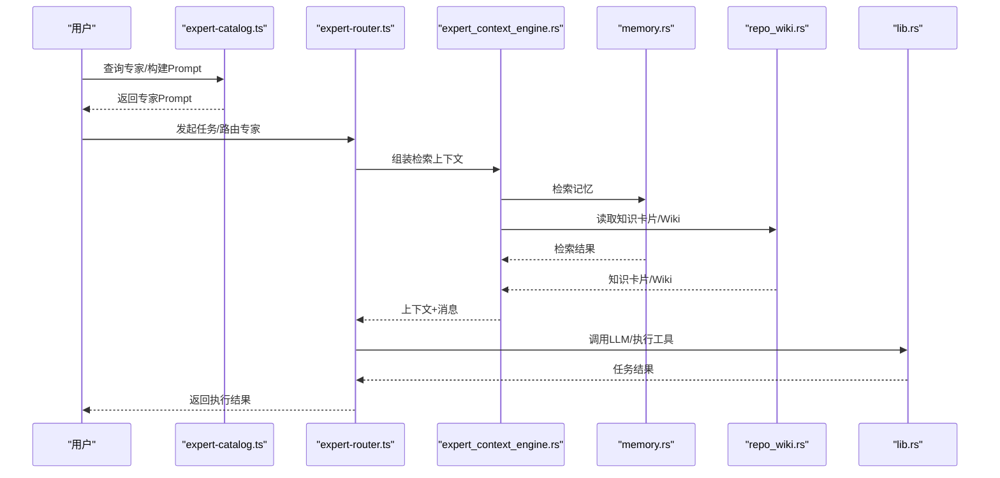
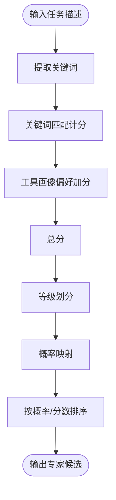
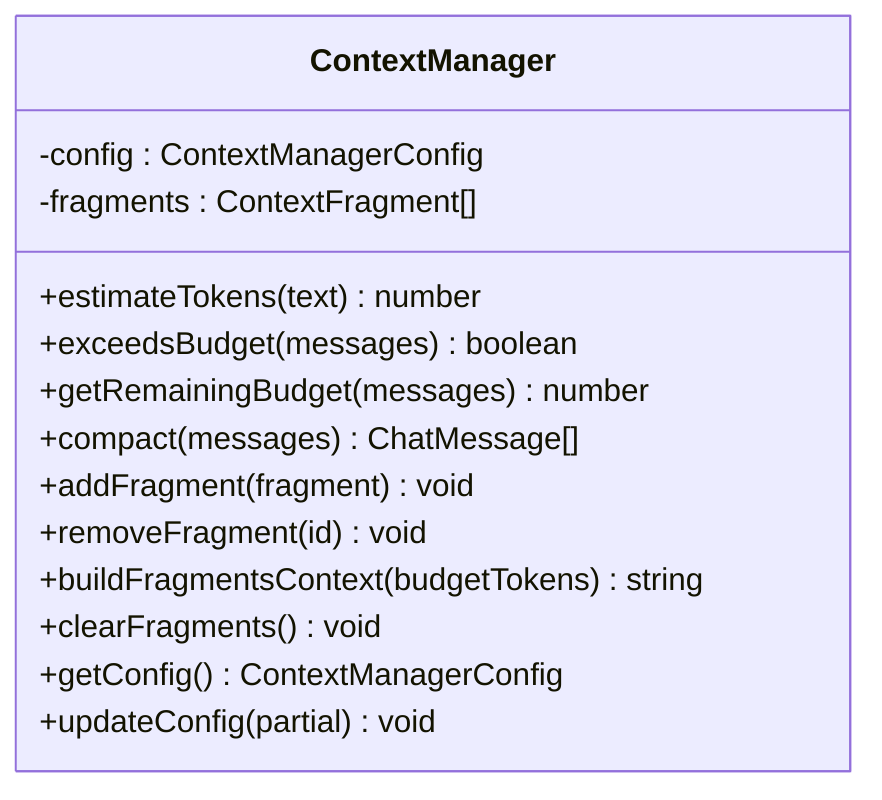
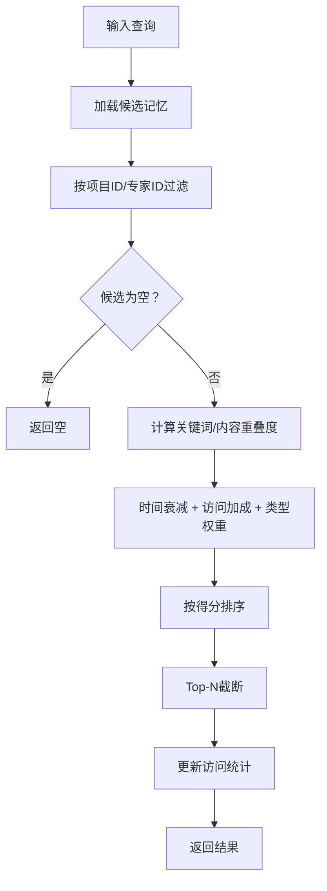
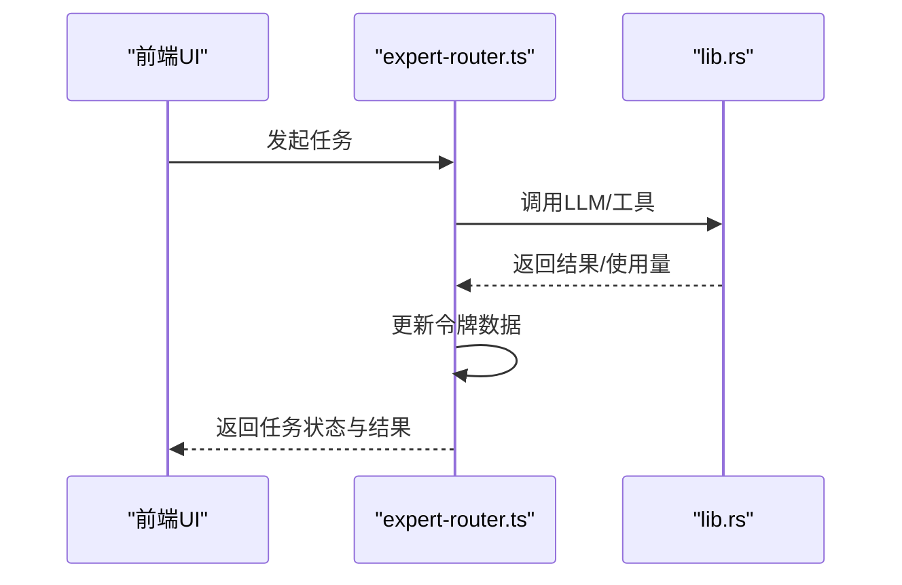
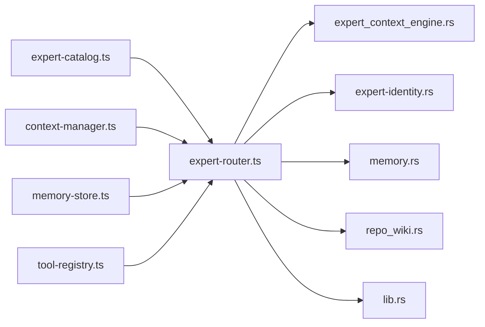

# 专家目录系统

<cite>
**本文档引用的文件**
- [expert-catalog.ts](file://src/expert-catalog.ts)
- [context-manager.ts](file://src/context-manager.ts)
- [memory-store.ts](file://src/memory-store.ts)
- [expert-router.ts](file://src/expert-router.ts)
- [tool-registry.ts](file://src/tool-registry.ts)
- [expert-context-engine.rs](file://src-tauri/src/expert_context_engine.rs)
- [expert-identity.rs](file://src-tauri/src/expert_identity.rs)
- [memory.rs](file://src-tauri/src/memory.rs)
- [repo_wiki.rs](file://src-tauri/src/repo_wiki.rs)
- [lib.rs](file://src-tauri/src/lib.rs)
- [main.ts](file://src/main.ts)
</cite>

## 目录
1. [简介](#简介)
2. [项目结构](#项目结构)
3. [核心组件](#核心组件)
4. [架构总览](#架构总览)
5. [详细组件分析](#详细组件分析)
6. [依赖关系分析](#依赖关系分析)
7. [性能考量](#性能考量)
8. [故障排查指南](#故障排查指南)
9. [结论](#结论)
10. [附录](#附录)

## 简介
本文件为“专家目录系统”的技术文档，面向开发者与高级用户，系统性阐述专家目录的数据结构设计、身份识别机制、上下文引擎工作原理、检索算法与配置选项。文档同时提供实际代码示例的路径指引，帮助读者快速定位实现细节并开展二次开发。

## 项目结构
系统采用前端 TypeScript + Tauri Rust 的混合架构：
- 前端模块负责专家目录、上下文管理、记忆检索、工具注册与路由调度
- 后端模块负责专家身份规范化、上下文组装、知识卡片与 Wiki 生成、记忆生命周期管理等

**图表来源**
- [expert-catalog.ts:1-916](file://src/expert-catalog.ts#L1-L916)
- [context-manager.ts:1-276](file://src/context-manager.ts#L1-L276)
- [memory-store.ts:1-337](file://src/memory-store.ts#L1-L337)
- [expert-router.ts:1-1634](file://src/expert-router.ts#L1-L1634)
- [tool-registry.ts:1-192](file://src/tool-registry.ts#L1-L192)
- [expert-context-engine.rs:1-260](file://src-tauri/src/expert_context_engine.rs#L1-L260)
- [expert-identity.rs:1-64](file://src-tauri/src/expert_identity.rs#L1-L64)
- [memory.rs:1-843](file://src-tauri/src/memory.rs#L1-L843)
- [repo_wiki.rs:1-646](file://src-tauri/src/repo_wiki.rs#L1-L646)
- [lib.rs:1-7190](file://src-tauri/src/lib.rs#L1-L7190)

**章节来源**
- [expert-catalog.ts:1-916](file://src/expert-catalog.ts#L1-L916)
- [context-manager.ts:1-276](file://src/context-manager.ts#L1-L276)
- [memory-store.ts:1-337](file://src/memory-store.ts#L1-L337)
- [expert-router.ts:1-1634](file://src/expert-router.ts#L1-L1634)
- [tool-registry.ts:1-192](file://src/tool-registry.ts#L1-L192)
- [expert-context-engine.rs:1-260](file://src-tauri/src/expert_context_engine.rs#L1-L260)
- [expert-identity.rs:1-64](file://src-tauri/src/expert_identity.rs#L1-L64)
- [memory.rs:1-843](file://src-tauri/src/memory.rs#L1-L843)
- [repo_wiki.rs:1-646](file://src-tauri/src/repo_wiki.rs#L1-L646)
- [lib.rs:1-7190](file://src-tauri/src/lib.rs#L1-L7190)
- [main.ts:1-9045](file://src/main.ts#L1-L9045)

## 核心组件
- 专家目录与Prompt构建：定义专家数据结构、学科分类、工具画像、Prompt模板与激活评分
- 上下文管理：Token预算估算、自动压缩、Fragment管理
- 记忆检索：TF-IDF关键词匹配、专家维度过滤、生命周期管理
- 专家路由：令牌配额校验、主管/专家运行时上下文、流水线执行
- 工具注册：工具Schema、权限映射、注入LLM调用
- 上下文引擎：知识卡片/向量/记忆/负向索引融合、初始消息构建
- 专家身份：ID规范化、角色判定、能力判定

**章节来源**
- [expert-catalog.ts:1-916](file://src/expert-catalog.ts#L1-L916)
- [context-manager.ts:1-276](file://src/context-manager.ts#L1-L276)
- [memory-store.ts:1-337](file://src/memory-store.ts#L1-L337)
- [expert-router.ts:1-1634](file://src/expert-router.ts#L1-L1634)
- [tool-registry.ts:1-192](file://src/tool-registry.ts#L1-L192)
- [expert-context-engine.rs:1-260](file://src-tauri/src/expert_context_engine.rs#L1-L260)
- [expert-identity.rs:1-64](file://src-tauri/src/expert-identity.rs#L1-L64)

## 架构总览
专家目录系统通过前端专家目录与Prompt构建、上下文管理、记忆检索与工具注册，结合后端的专家身份、上下文组装、知识卡片与记忆生命周期管理，形成完整的专家调度与执行闭环。

**图表来源**
- [expert-catalog.ts:549-579](file://src/expert-catalog.ts#L549-L579)
- [expert-router.ts:506-545](file://src/expert-router.ts#L506-L545)
- [expert-context-engine.rs:103-187](file://src-tauri/src/expert_context_engine.rs#L103-L187)
- [memory.rs:167-305](file://src-tauri/src/memory.rs#L167-L305)
- [repo_wiki.rs:106-136](file://src-tauri/src/repo_wiki.rs#L106-L136)
- [lib.rs:732-788](file://src-tauri/src/lib.rs#L732-L788)

## 详细组件分析

### 专家目录与Prompt构建
- 数据结构
  - 专家条目：包含ID、代码、姓名、性别、头衔、描述、分类ID/标签、关键词、工具画像、Prompt关注点、系统角色标记
  - 激活结果：包含分数、等级、触发概率
  - 专家画像：知识、方法论、Prompt关注点
- Prompt构建
  - 知识库构建：按工具画像生成对应领域的知识要点
  - 方法论构建：按工具画像生成对应的分析/工程/文档/创意/评审方法论
  - 工程/只读规则：针对不同工具画像注入执行规则
  - 任务作用域Prompt：整合专家系统Prompt、激活指导、顾问协作约束
- 激活评分与排序
  - 关键词匹配计分
  - 工具画像偏好加分
  - 概率映射与等级划分
  - 场景默认专家ID映射

**图表来源**
- [expert-catalog.ts:750-781](file://src/expert-catalog.ts#L750-L781)
- [expert-catalog.ts:627-639](file://src/expert-catalog.ts#L627-L639)
- [expert-catalog.ts:581-592](file://src/expert-catalog.ts#L581-L592)

**章节来源**
- [expert-catalog.ts:1-916](file://src/expert-catalog.ts#L1-L916)

### 上下文管理与Token预算
- 功能
  - Token估算：中文、英文/代码、换行等权重估算
  - 预算检查与剩余预算计算
  - 自动压缩：保留system消息、最近N轮、摘要早期对话、截断长工具输出
  - Fragment管理：按优先级与Token上限构建上下文
- 配置
  - 总预算、压缩阈值、预留比例、保留轮数、单片段最大Token

**图表来源**
- [context-manager.ts:29-266](file://src/context-manager.ts#L29-L266)

**章节来源**
- [context-manager.ts:1-276](file://src/context-manager.ts#L1-L276)

### 记忆检索与生命周期
- 检索算法
  - TF-IDF关键词匹配：查询词分词、关键词重叠度、内容词频重叠度
  - 时间衰减因子：按创建时间指数衰减
  - 访问频率加成：按访问次数加权
  - 记忆类型权重：长期/工作/临时权重
  - 专家维度过滤：优先返回同专家记忆
- 生命周期管理
  - Ephemeral → Working：访问≥2或内容长度≥200
  - Working → LongTerm：访问≥5且创建时间≤14天，内容压缩
  - 清理策略：按时间窗口清理

**图表来源**
- [memory.rs:167-305](file://src-tauri/src/memory.rs#L167-L305)

**章节来源**
- [memory-store.ts:1-337](file://src/memory-store.ts#L1-L337)
- [memory.rs:1-843](file://src-tauri/src/memory.rs#L1-L843)

### 专家路由与令牌配额
- 令牌配额
  - 专家运行时上下文：项目/用户令牌数据、密钥ID、豁免专家ID
  - 主管令牌上下文：包含专家额度配置
  - 阻断提示：在UI显示配额阻断消息
- 令牌仪表盘快照：统计今日/月/累计用量、专家分布、模型统计、配额状态、趋势
- 专家任务状态：待执行/运行中/完成/错误，包含令牌用量、阶段信息

**图表来源**
- [expert-router.ts:64-83](file://src/expert-router.ts#L64-L83)
- [expert-router.ts:123-159](file://src/expert-router.ts#L123-L159)
- [lib.rs:603-684](file://src-tauri/src/lib.rs#L603-L684)

**章节来源**
- [expert-router.ts:1-1634](file://src/expert-router.ts#L1-L1634)
- [lib.rs:1-7190](file://src-tauri/src/lib.rs#L1-L7190)
- [main.ts:1-9045](file://src/main.ts#L1-L9045)

### 工具注册与权限映射
- 工具Schema：内置工具包括shell_exec、file_read、file_write、file_patch、file_list、web_search、memory_query、index_search
- 权限映射：专家角色与工具权限映射，按专家ID动态注入允许的工具定义
- 注入LLM：将工具Schema转换为function calling格式

**章节来源**
- [tool-registry.ts:1-192](file://src/tool-registry.ts#L1-L192)
- [expert-catalog.ts:352-361](file://src/expert-catalog.ts#L352-L361)

### 上下文引擎与知识融合
- 上下文组装
  - 知识卡片概览：仓库知识概览
  - 代码定位：向量检索结果
  - 历史记忆：专家记忆/共享记忆
  - 负向索引：系统检索局限提示
- 初始消息构建：前置专家摘要 + 任务描述 + 检索上下文

**章节来源**
- [expert-context-engine.rs:1-260](file://src-tauri/src/expert_context_engine.rs#L1-L260)
- [repo_wiki.rs:1-646](file://src-tauri/src/repo_wiki.rs#L1-L646)

### 专家身份识别与角色判定
- ID规范化：将别名映射到标准学科ID
- 角色判定：主管、评审、创意、文档、实现、源码读写重写支持等

**章节来源**
- [expert-identity.rs:1-64](file://src-tauri/src/expert-identity.rs#L1-L64)

## 依赖关系分析
- 前端依赖后端命令：专家路由通过invoke调用后端命令，实现LLM调用、记忆检索、令牌统计等
- 专家目录依赖工具注册：工具权限映射来自专家目录的工具映射
- 上下文引擎依赖记忆与知识：检索上下文由记忆与知识卡片/Wiki共同构成

**图表来源**
- [expert-catalog.ts:1-916](file://src/expert-catalog.ts#L1-L916)
- [expert-router.ts:1-1634](file://src/expert-router.ts#L1-L1634)
- [expert-context-engine.rs:1-260](file://src-tauri/src/expert_context_engine.rs#L1-L260)
- [expert-identity.rs:1-64](file://src-tauri/src/expert-identity.rs#L1-L64)
- [memory.rs:1-843](file://src-tauri/src/memory.rs#L1-L843)
- [repo_wiki.rs:1-646](file://src-tauri/src/repo_wiki.rs#L1-L646)
- [lib.rs:1-7190](file://src-tauri/src/lib.rs#L1-L7190)

**章节来源**
- [expert-catalog.ts:1-916](file://src/expert-catalog.ts#L1-L916)
- [expert-router.ts:1-1634](file://src/expert-router.ts#L1-L1634)
- [expert-context-engine.rs:1-260](file://src-tauri/src/expert_context_engine.rs#L1-L260)
- [expert-identity.rs:1-64](file://src-tauri/src/expert-identity.rs#L1-L64)
- [memory.rs:1-843](file://src-tauri/src/memory.rs#L1-L843)
- [repo_wiki.rs:1-646](file://src-tauri/src/repo_wiki.rs#L1-L646)
- [lib.rs:1-7190](file://src-tauri/src/lib.rs#L1-L7190)

## 性能考量
- Token预算与压缩：通过Fragment优先级与阈值控制，避免超预算；自动压缩早期对话与长工具输出
- 检索效率：TF-IDF关键词匹配 + 专家维度过滤 + 时间衰减，减少无关结果
- 生命周期管理：Ephemeral→Working→LongTerm的自动化迁移，降低长期存储压力
- 并行执行：流水线步骤支持并行，提高整体吞吐

[本节为通用指导，无需特定文件引用]

## 故障排查指南
- 配额阻断：检查令牌配额上下文与豁免ID配置，查看UI显示的阻断消息
- 记忆检索异常：确认项目ID、专家ID过滤参数，检查关键词提取与停用词过滤
- 上下文过长：调整ContextManager配置，启用自动压缩或减少Fragment数量
- 工具权限不足：核对工具注册表与专家工具映射，确保专家ID在允许名单中

**章节来源**
- [expert-router.ts:85-105](file://src/expert-router.ts#L85-L105)
- [memory-store.ts:310-335](file://src/memory-store.ts#L310-L335)
- [context-manager.ts:115-156](file://src/context-manager.ts#L115-L156)
- [tool-registry.ts:155-174](file://src/tool-registry.ts#L155-L174)

## 结论
专家目录系统通过严谨的数据结构设计、完善的上下文管理与检索算法、灵活的专家身份识别与权限控制，实现了高效、可扩展的专家调度与执行体系。前端与后端的清晰分工与紧密协作，确保了在复杂任务场景下的稳定性与可维护性。

[本节为总结性内容，无需特定文件引用]

## 附录

### 实际代码示例（路径指引）
- 注册新专家
  - 在专家目录中添加新条目：[expert-catalog.ts:143-330](file://src/expert-catalog.ts#L143-L330)
  - 定义工具画像与Prompt关注点：[expert-catalog.ts:363-426](file://src/expert-catalog.ts#L363-L426)
- 查询专家信息
  - 获取专家条目：[expert-catalog.ts:722-724](file://src/expert-catalog.ts#L722-L724)
  - 获取学科显示名：[expert-catalog.ts:110-112](file://src/expert-catalog.ts#L110-L112)
- 管理专家关系
  - 设置场景默认专家：[expert-catalog.ts:335-350](file://src/expert-catalog.ts#L335-L350)
  - 获取专家专业化摘要：[expert-catalog.ts:698-708](file://src/expert-catalog.ts#L698-L708)
- 构建专家Prompt
  - 专家系统Prompt：[expert-catalog.ts:549-579](file://src/expert-catalog.ts#L549-L579)
  - 任务作用域Prompt：[expert-catalog.ts:688-696](file://src/expert-catalog.ts#L688-L696)
- 激活评分与排序
  - 评分函数：[expert-catalog.ts:750-781](file://src/expert-catalog.ts#L750-L781)
  - 激活等级与概率：[expert-catalog.ts:627-639](file://src/expert-catalog.ts#L627-L639)
- 上下文管理
  - Token估算与压缩：[context-manager.ts:55-156](file://src/context-manager.ts#L55-L156)
  - Fragment构建：[context-manager.ts:231-244](file://src/context-manager.ts#L231-L244)
- 记忆检索
  - TF-IDF检索：[memory.rs:167-305](file://src-tauri/src/memory.rs#L167-L305)
  - 增强检索（共现词/专家过滤/Token预算）：[memory.rs:622-681](file://src-tauri/src/memory.rs#L622-L681)
  - 前端检索封装：[memory-store.ts:50-68](file://src/memory-store.ts#L50-L68)
- 专家路由与令牌
  - 令牌上下文与配额检查：[expert-router.ts:64-83](file://src/expert-router.ts#L64-L83)
  - 令牌仪表盘快照：[expert-router.ts:123-159](file://src/expert-router.ts#L123-L159)
  - 专家任务运行时：[expert-router.ts:506-545](file://src/expert-router.ts#L506-L545)
- 工具注册
  - 工具Schema与权限映射：[tool-registry.ts:27-141](file://src/tool-registry.ts#L27-L141)
  - 注入LLM工具定义：[tool-registry.ts:155-174](file://src/tool-registry.ts#L155-L174)
- 上下文引擎
  - 检索上下文与消息构建：[expert-context-engine.rs:103-187](file://src-tauri/src/expert_context_engine.rs#L103-L187)
  - 知识卡片/Wiki格式化：[expert-context-engine.rs:63-101](file://src-tauri/src/expert_context_engine.rs#L63-L101)
- 专家身份
  - ID规范化与角色判定：[expert-identity.rs:3-63](file://src-tauri/src/expert_identity.rs#L3-L63)
- 知识卡片与Wiki
  - 读取知识卡片/Wiki：[repo_wiki.rs:106-136](file://src-tauri/src/repo_wiki.rs#L106-L136)
  - 生成卡片/Wiki：[repo_wiki.rs:362-447](file://src-tauri/src/repo_wiki.rs#L362-L447)
- 入口与密钥管理
  - API密钥解析与模型选择：[main.ts:490-545](file://src/main.ts#L490-L545)
  - 令牌数据持久化/加载：[expert-router.ts:161-220](file://src/expert-router.ts#L161-L220)