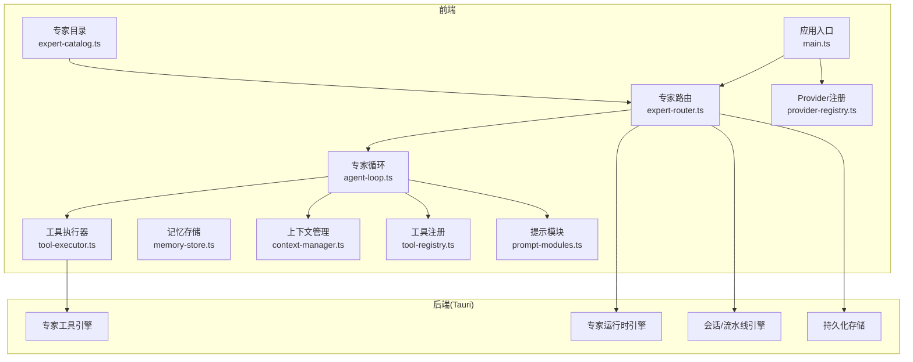
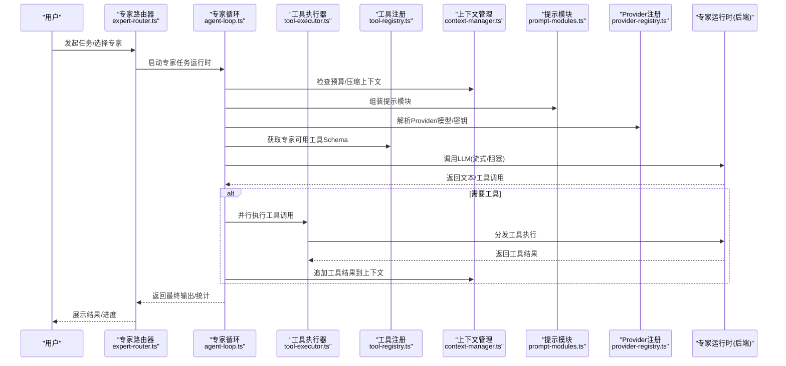
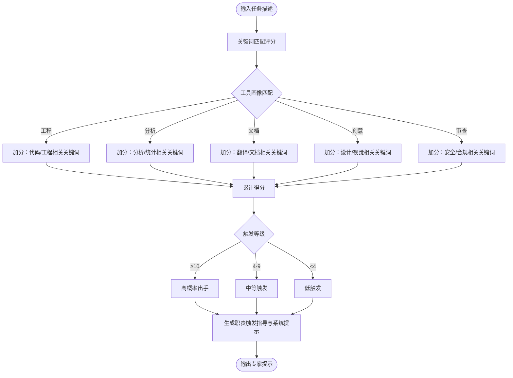
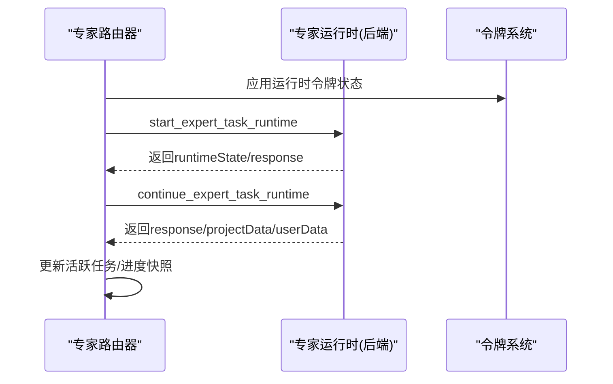
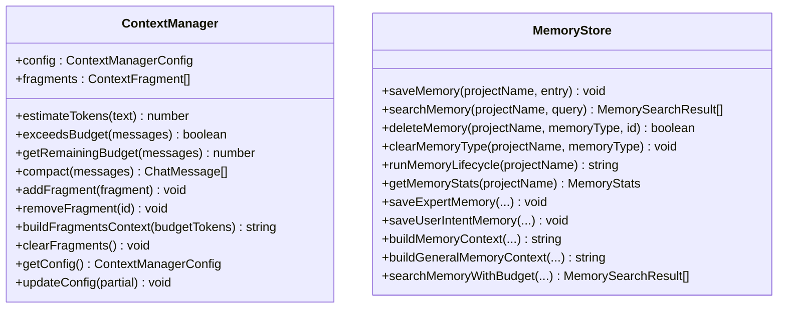
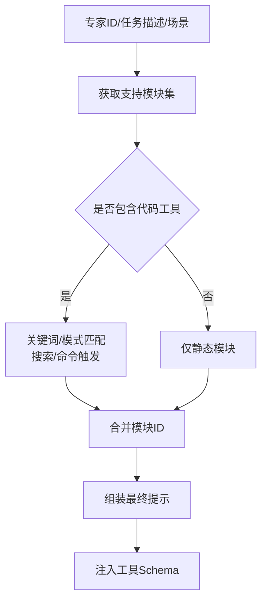
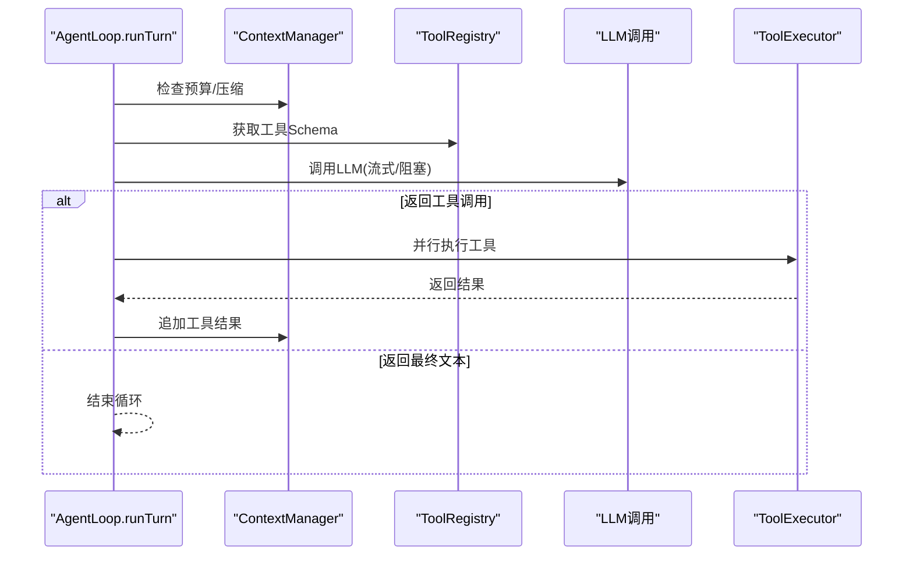
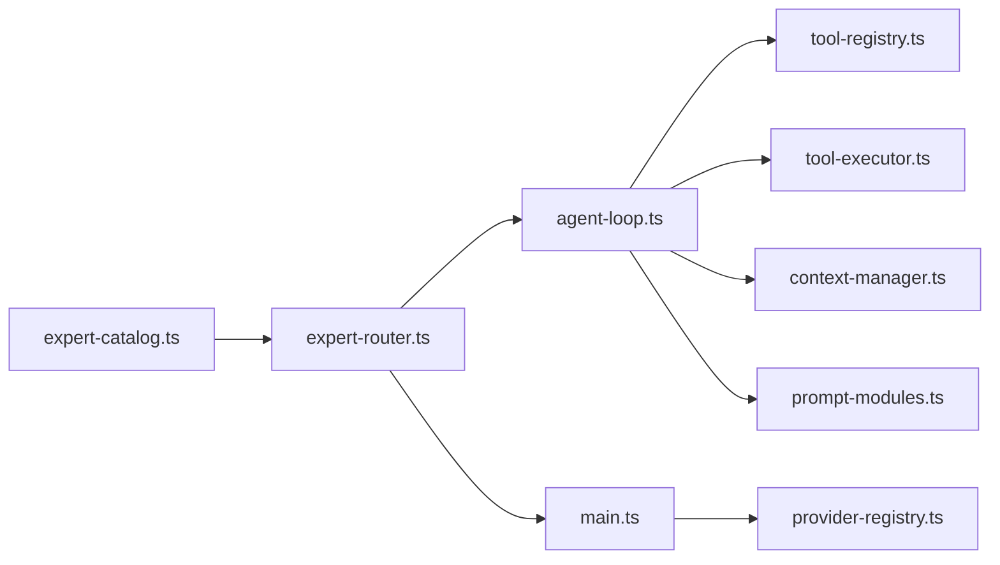

# 专家系统

<cite>
**本文档引用的文件**
- [expert-catalog.ts](file://src/expert-catalog.ts)
- [expert-router.ts](file://src/expert-router.ts)
- [context-manager.ts](file://src/context-manager.ts)
- [memory-store.ts](file://src/memory-store.ts)
- [tool-registry.ts](file://src/tool-registry.ts)
- [prompt-modules.ts](file://src/prompt-modules.ts)
- [agent-loop.ts](file://src/agent-loop.ts)
- [tool-executor.ts](file://src/tool-executor.ts)
- [provider-registry.ts](file://src/provider-registry.ts)
- [main.ts](file://src/main.ts)
</cite>

## 目录
1. [简介](#简介)
2. [项目结构](#项目结构)
3. [核心组件](#核心组件)
4. [架构总览](#架构总览)
5. [详细组件分析](#详细组件分析)
6. [依赖分析](#依赖分析)
7. [性能考量](#性能考量)
8. [故障排查指南](#故障排查指南)
9. [结论](#结论)
10. [附录](#附录)

## 简介
本项目是一个面向多学科领域的AI专家系统，提供专家目录、专家路由、专家会话与执行循环、工具与模块化提示工程、上下文与记忆管理、密钥与Provider管理等能力。系统采用前后端桥接（Tauri）的方式，前端负责UI与调度，后端负责专家执行、工具执行与持久化。

## 项目结构
- 前端核心模块
  - 专家目录与系统提示构建：expert-catalog.ts
  - 专家路由与流水线：expert-router.ts
  - 上下文与Token预算管理：context-manager.ts
  - 记忆检索与存储：memory-store.ts
  - 工具注册与权限：tool-registry.ts
  - 模块化提示工程：prompt-modules.ts
  - 专家执行循环：agent-loop.ts
  - 工具执行器：tool-executor.ts
  - Provider注册与切换：provider-registry.ts
  - 应用入口与密钥池：main.ts
- 后端（Rust，Tauri桥接）
  - 专家运行时、工具执行、会话与流水线引擎等位于 src-tauri/src 下（通过 invoke 调用）

**图表来源**
- [expert-catalog.ts:1-855](file://src/expert-catalog.ts#L1-L855)
- [expert-router.ts:1-1634](file://src/expert-router.ts#L1-L1634)
- [context-manager.ts:1-276](file://src/context-manager.ts#L1-L276)
- [memory-store.ts:1-337](file://src/memory-store.ts#L1-L337)
- [tool-registry.ts:1-192](file://src/tool-registry.ts#L1-L192)
- [prompt-modules.ts:1-775](file://src/prompt-modules.ts#L1-L775)
- [agent-loop.ts:1-404](file://src/agent-loop.ts#L1-L404)
- [tool-executor.ts:1-231](file://src/tool-executor.ts#L1-L231)
- [provider-registry.ts:1-111](file://src/provider-registry.ts#L1-L111)
- [main.ts:1-9009](file://src/main.ts#L1-L9009)

**章节来源**
- [expert-catalog.ts:1-855](file://src/expert-catalog.ts#L1-L855)
- [expert-router.ts:1-1634](file://src/expert-router.ts#L1-L1634)
- [context-manager.ts:1-276](file://src/context-manager.ts#L1-L276)
- [memory-store.ts:1-337](file://src/memory-store.ts#L1-L337)
- [tool-registry.ts:1-192](file://src/tool-registry.ts#L1-L192)
- [prompt-modules.ts:1-775](file://src/prompt-modules.ts#L1-L775)
- [agent-loop.ts:1-404](file://src/agent-loop.ts#L1-L404)
- [tool-executor.ts:1-231](file://src/tool-executor.ts#L1-L231)
- [provider-registry.ts:1-111](file://src/provider-registry.ts#L1-L111)
- [main.ts:1-9009](file://src/main.ts#L1-L9009)

## 核心组件
- 专家目录与系统提示
  - 定义专家类别、性别、关键词、工具画像、系统角色等
  - 构建专家系统提示、专属方法论、职责触发概率与任务限定提示
- 专家路由与流水线
  - 路由器持有专家集合，管理活跃任务、流水线步骤与进度快照
  - 支持令牌预算、配额豁免、Token仪表盘快照
- 上下文与记忆
  - Token预算估算、自动压缩、Fragment管理
  - 记忆检索、关键词抽取、Token感知检索
- 工具与模块化提示
  - 工具Schema注册、权限映射、动态注入
  - 按场景与专家画像选择提示模块，支持历史回溯与相似度启发
- 专家执行循环
  - 自适应轮次、流式/阻塞LLM调用、死循环检测、工具调用并行执行
- Provider与密钥
  - Provider列表、切换、API Key检查
  - 密钥池、模型解析、多模态能力筛选

**章节来源**
- [expert-catalog.ts:1-855](file://src/expert-catalog.ts#L1-L855)
- [expert-router.ts:1-1634](file://src/expert-router.ts#L1-L1634)
- [context-manager.ts:1-276](file://src/context-manager.ts#L1-L276)
- [memory-store.ts:1-337](file://src/memory-store.ts#L1-L337)
- [tool-registry.ts:1-192](file://src/tool-registry.ts#L1-L192)
- [prompt-modules.ts:1-775](file://src/prompt-modules.ts#L1-L775)
- [agent-loop.ts:1-404](file://src/agent-loop.ts#L1-L404)
- [provider-registry.ts:1-111](file://src/provider-registry.ts#L1-L111)
- [main.ts:1-9009](file://src/main.ts#L1-L9009)

## 架构总览
系统采用“前端调度 + 后端执行”的分层架构。前端负责专家目录、提示工程、上下文与记忆管理、工具注册与执行器、Provider与密钥管理；后端通过Tauri暴露能力，执行专家任务、工具调用、会话与流水线管理、持久化。

**图表来源**
- [expert-router.ts:506-545](file://src/expert-router.ts#L506-L545)
- [agent-loop.ts:76-211](file://src/agent-loop.ts#L76-L211)
- [tool-executor.ts:24-53](file://src/tool-executor.ts#L24-L53)
- [tool-registry.ts:155-174](file://src/tool-registry.ts#L155-L174)
- [context-manager.ts:107-156](file://src/context-manager.ts#L107-L156)
- [prompt-modules.ts:423-446](file://src/prompt-modules.ts#L423-L446)
- [provider-registry.ts:26-36](file://src/provider-registry.ts#L26-L36)

**章节来源**
- [expert-router.ts:506-545](file://src/expert-router.ts#L506-L545)
- [agent-loop.ts:76-211](file://src/agent-loop.ts#L76-L211)
- [tool-executor.ts:24-53](file://src/tool-executor.ts#L24-L53)
- [tool-registry.ts:155-174](file://src/tool-registry.ts#L155-L174)
- [context-manager.ts:107-156](file://src/context-manager.ts#L107-L156)
- [prompt-modules.ts:423-446](file://src/prompt-modules.ts#L423-L446)
- [provider-registry.ts:26-36](file://src/provider-registry.ts#L26-L36)

## 详细组件分析

### 专家目录与系统提示
- 专家条目结构：包含ID、代码、姓名、性别、头衔、描述、分类ID/标签、关键词、工具画像、prompt聚焦、系统角色标记等
- 专家激活评分与概率：基于关键词匹配、工具画像倾向、特定专家关键字，计算触发等级与概率
- 系统提示构建：按工具画像生成知识库、方法论、职责触发指导、工程/只读执行规则、输出要求
- 专家分类与默认场景：按学科领域划分，提供场景默认专家ID映射

**图表来源**
- [expert-catalog.ts:694-725](file://src/expert-catalog.ts#L694-L725)
- [expert-catalog.ts:594-640](file://src/expert-catalog.ts#L594-L640)

**章节来源**
- [expert-catalog.ts:1-855](file://src/expert-catalog.ts#L1-L855)

### 专家路由与流水线
- 路由器专家集合：从专家目录构建RouterExpert，包含系统提示
- 令牌预算与配额：支持项目级/用户级Token数据持久化与加载，配额豁免ID，主管专家的配额上下文
- 令牌仪表盘：按时间范围聚合使用情况、专家分布、模型统计、配额状态、趋势
- 活跃任务与流水线：维护专家任务状态、步骤执行计划、跟进任务、黑板任务、进度快照
- 任务运行时：启动/继续专家任务运行时，传递场景、任务描述、先前结果、提示模块、项目上下文

**图表来源**
- [expert-router.ts:506-545](file://src/expert-router.ts#L506-L545)
- [expert-router.ts:547-559](file://src/expert-router.ts#L547-L559)
- [expert-router.ts:672-704](file://src/expert-router.ts#L672-L704)

**章节来源**
- [expert-router.ts:1-1634](file://src/expert-router.ts#L1-L1634)

### 上下文与记忆
- 上下文管理
  - Token预算估算、阈值触发压缩、保留比例、最近轮次策略
  - 自动压缩：保留system消息、最近N轮、工具输出截断、早期assistant要点摘要
  - Fragment管理：按优先级与token预算构建上下文字符串
- 记忆检索
  - 保存/检索/删除/清理记忆，运行生命周期管理
  - 关键词提取（中英文混合、标点过滤、停用词过滤）
  - Token感知检索：根据预算截断结果

**图表来源**
- [context-manager.ts:37-276](file://src/context-manager.ts#L37-L276)
- [memory-store.ts:1-337](file://src/memory-store.ts#L1-L337)

**章节来源**
- [context-manager.ts:1-276](file://src/context-manager.ts#L1-L276)
- [memory-store.ts:1-337](file://src/memory-store.ts#L1-L337)

### 工具与模块化提示
- 工具注册
  - 内置工具：shell_exec、file_read、file_write、file_patch、file_list、web_search、memory_query、index_search
  - 权限映射：auto/confirm/block，按专家角色与_common组合过滤
- 模块化提示
  - 按专家工具画像选择静态模块，结合任务文本与场景动态添加web-search/command/video等引导模块
  - 历史回溯：基于任务描述与触发源相似度，启发提示模块建议

**图表来源**
- [prompt-modules.ts:388-421](file://src/prompt-modules.ts#L388-L421)
- [prompt-modules.ts:423-446](file://src/prompt-modules.ts#L423-L446)
- [tool-registry.ts:155-174](file://src/tool-registry.ts#L155-L174)

**章节来源**
- [tool-registry.ts:1-192](file://src/tool-registry.ts#L1-L192)
- [prompt-modules.ts:1-775](file://src/prompt-modules.ts#L1-L775)

### 专家执行循环
- 自适应轮次：模型自主决定工具调用轮数，上限保护
- 流式/阻塞：根据配置选择流式输出，事件监听token
- 死循环检测：连续相同工具调用签名检测，注入提示终止
- 工具调用并行：并发执行所有工具调用，记录历史与耗时
- Patch重试：file_patch失败时结构化反馈与重试上限提示

**图表来源**
- [agent-loop.ts:76-211](file://src/agent-loop.ts#L76-L211)
- [agent-loop.ts:273-331](file://src/agent-loop.ts#L273-L331)

**章节来源**
- [agent-loop.ts:1-404](file://src/agent-loop.ts#L1-L404)
- [tool-executor.ts:1-231](file://src/tool-executor.ts#L1-L231)

### Provider与密钥
- Provider注册：加载/切换Provider，检查API Key环境变量
- 密钥池：预设/中转/自定义密钥，多模态能力配置，按模态筛选
- 模型解析：根据专家绑定与密钥池解析模型名称

**章节来源**
- [provider-registry.ts:1-111](file://src/provider-registry.ts#L1-L111)
- [main.ts:408-554](file://src/main.ts#L408-L554)

## 依赖分析
- 组件耦合
  - expert-router 依赖 expert-catalog 构建专家提示与激活评估
  - agent-loop 依赖 tool-registry、tool-executor、context-manager、prompt-modules
  - main 依赖 expert-router、provider-registry 管理密钥与Provider
- 外部依赖
  - Tauri invoke 与后端引擎（专家运行时、工具执行、会话/流水线、持久化）

**图表来源**
- [expert-catalog.ts:1-855](file://src/expert-catalog.ts#L1-L855)
- [expert-router.ts:1-1634](file://src/expert-router.ts#L1-L1634)
- [agent-loop.ts:1-404](file://src/agent-loop.ts#L1-L404)
- [tool-registry.ts:1-192](file://src/tool-registry.ts#L1-L192)
- [tool-executor.ts:1-231](file://src/tool-executor.ts#L1-L231)
- [context-manager.ts:1-276](file://src/context-manager.ts#L1-L276)
- [prompt-modules.ts:1-775](file://src/prompt-modules.ts#L1-L775)
- [main.ts:1-9009](file://src/main.ts#L1-L9009)
- [provider-registry.ts:1-111](file://src/provider-registry.ts#L1-L111)

**章节来源**
- [expert-catalog.ts:1-855](file://src/expert-catalog.ts#L1-L855)
- [expert-router.ts:1-1634](file://src/expert-router.ts#L1-L1634)
- [agent-loop.ts:1-404](file://src/agent-loop.ts#L1-L404)
- [tool-registry.ts:1-192](file://src/tool-registry.ts#L1-L192)
- [tool-executor.ts:1-231](file://src/tool-executor.ts#L1-L231)
- [context-manager.ts:1-276](file://src/context-manager.ts#L1-L276)
- [prompt-modules.ts:1-775](file://src/prompt-modules.ts#L1-L775)
- [main.ts:1-9009](file://src/main.ts#L1-L9009)
- [provider-registry.ts:1-111](file://src/provider-registry.ts#L1-L111)

## 性能考量
- 上下文压缩
  - 估算策略：中文字符、英文/代码、换行特殊token，保留最近N轮，工具输出截断
  - 建议：合理设置token预算与保留比例，避免频繁压缩
- 工具调用
  - 并行执行提升吞吐，注意后端工具执行的并发与资源限制
- 提示模块
  - 动态选择与历史回溯减少冗余，提高专家专注度
- 令牌预算
  - 项目级/用户级配额与豁免，定期快照与趋势分析

[本节为通用指导，无需特定文件引用]

## 故障排查指南
- 令牌配额阻断
  - 现象：显示系统消息提示配额阻断
  - 排查：检查项目/用户令牌数据、配额豁免ID、令牌仪表盘快照
  - 位置：displayQuotaBlockMessage、buildTokenDashboardSnapshot、save/loadTokenData
- 上下文溢出
  - 现象：压缩后仍超预算，循环终止
  - 排查：检查token预算、保留比例、Fragment大小
  - 位置：exceedsBudget、compact、buildFragmentsContext
- 工具执行失败
  - 现象：file_patch多次失败，提示改用file_write或先file_read
  - 排查：查看工具执行器的结构化错误反馈
  - 位置：ToolExecutor.handlePatchResult、checkPatchRetryLimit
- Provider/API Key问题
  - 现象：无法调用LLM或模型不可用
  - 排查：检查Provider切换、API Key环境变量、模型支持能力
  - 位置：ProviderRegistry.switchProvider、checkApiKey、getModelsForProvider

**章节来源**
- [expert-router.ts:86-105](file://src/expert-router.ts#L86-L105)
- [context-manager.ts:92-105](file://src/context-manager.ts#L92-L105)
- [tool-executor.ts:59-94](file://src/tool-executor.ts#L59-L94)
- [provider-registry.ts:56-76](file://src/provider-registry.ts#L56-L76)

## 结论
本专家系统通过专家目录与系统提示、路由与流水线、上下文与记忆、工具与模块化提示、执行循环与Provider/密钥管理，形成完整的专家代理生命周期与调度机制。系统具备良好的扩展性与可维护性，适合在多学科任务中提供专业化、可追踪、可审计的智能协作能力。

[本节为总结，无需特定文件引用]

## 附录
- 使用模式与最佳实践
  - 创建专家代理：通过专家目录构建系统提示，结合场景与任务描述选择专家
  - 配置选项：在main.ts中配置密钥池、Provider、模型与多模态能力
  - 管理专家代理：利用expert-router的令牌预算、配额与进度快照进行监控与治理
  - 优化性能：合理设置AgentLoop的轮次上限、Token预算与压缩阈值，减少不必要的工具调用

**章节来源**
- [main.ts:408-554](file://src/main.ts#L408-L554)
- [agent-loop.ts:12-67](file://src/agent-loop.ts#L12-L67)
- [expert-router.ts:123-159](file://src/expert-router.ts#L123-L159)