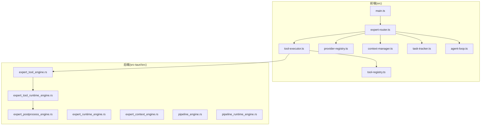
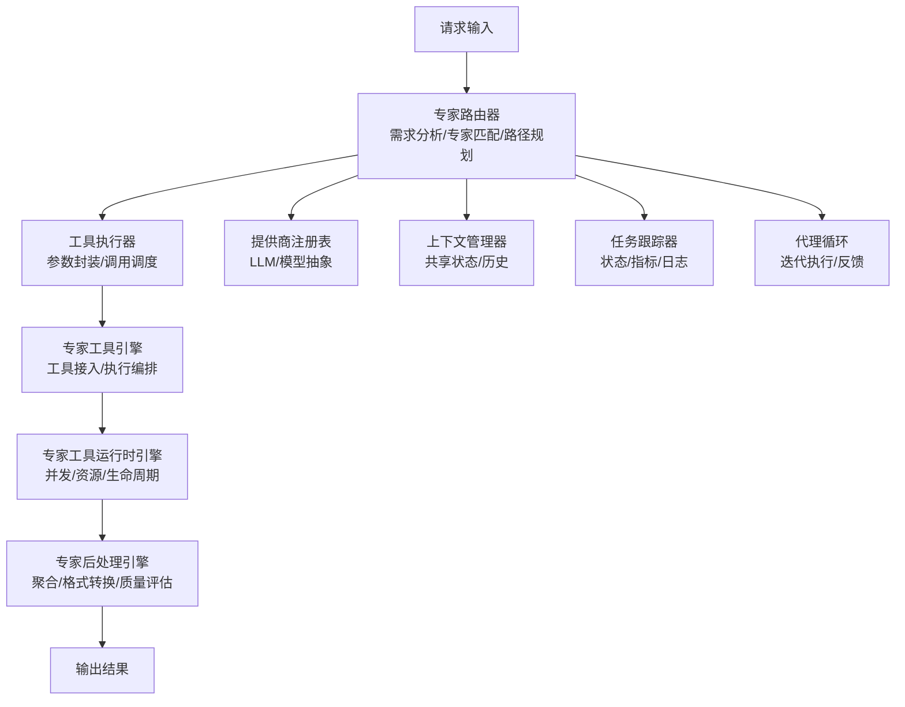
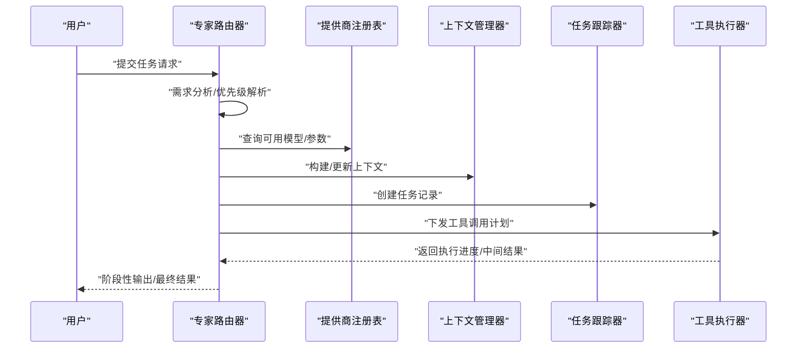
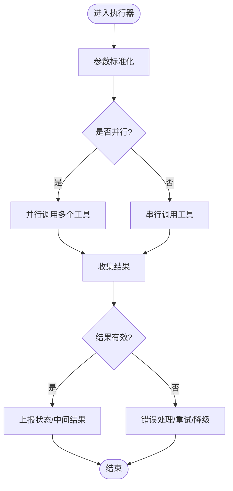
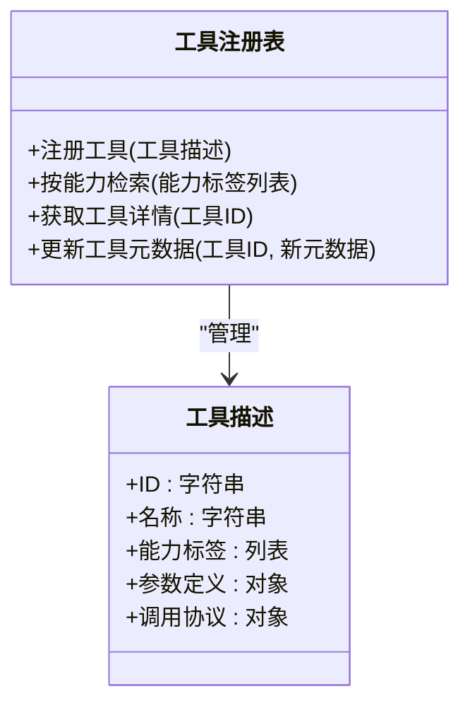
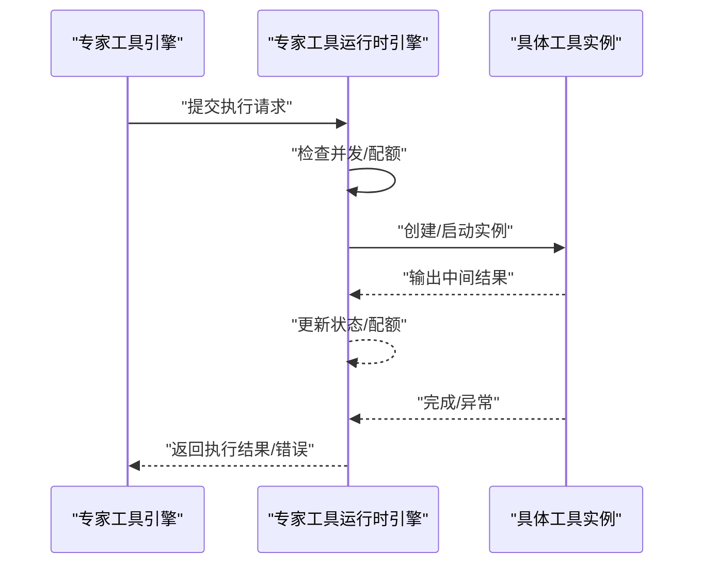
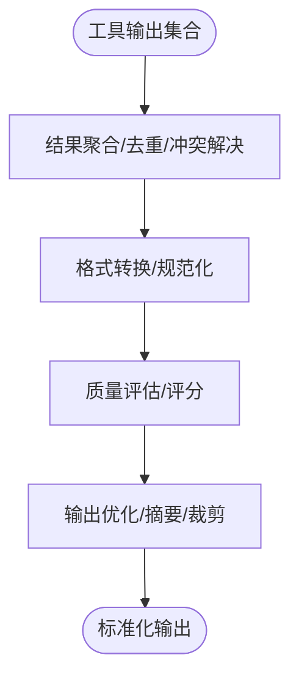
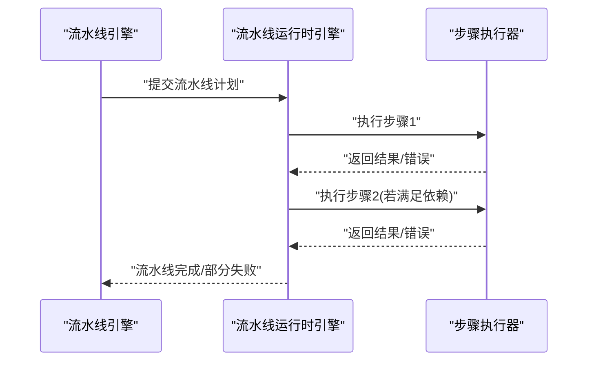
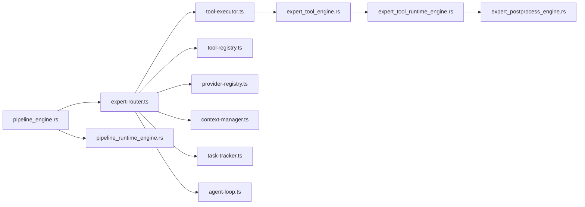

# 专家路由系统

<cite>
**本文引用的文件**
- [expert-router.ts](file://src/expert-router.ts)
- [tool-executor.ts](file://src/tool-executor.ts)
- [tool-registry.ts](file://src/tool-registry.ts)
- [expert-postprocess-engine.rs](file://src-tauri/src/expert_postprocess_engine.rs)
- [expert-tool-engine.rs](file://src-tauri/src/expert_tool_engine.rs)
- [expert-tool-runtime-engine.rs](file://src-tauri/src/expert_tool_runtime_engine.rs)
- [expert-runtime-engine.rs](file://src-tauri/src/expert_runtime_engine.rs)
- [expert-context-engine.rs](file://src-tauri/src/expert_context_engine.rs)
- [pipeline-engine.rs](file://src-tauri/src/pipeline_engine.rs)
- [pipeline-runtime-engine.rs](file://src-tauri/src/pipeline_runtime_engine.rs)
- [provider-registry.ts](file://src/provider-registry.ts)
- [context-manager.ts](file://src/context-manager.ts)
- [task-tracker.ts](file://src/task-tracker.ts)
- [agent-loop.ts](file://src/agent-loop.ts)
- [main.ts](file://src/main.ts)
</cite>

## 目录
1. [引言](#引言)
2. [项目结构](#项目结构)
3. [核心组件](#核心组件)
4. [架构总览](#架构总览)
5. [详细组件分析](#详细组件分析)
6. [依赖关系分析](#依赖关系分析)
7. [性能考虑](#性能考虑)
8. [故障排查指南](#故障排查指南)
9. [结论](#结论)
10. [附录](#附录)

## 引言
本技术文档围绕“专家路由系统”的设计与实现展开，重点覆盖以下方面：
- 专家路由的决策算法：需求分析、专家匹配与路径规划
- 专家工具引擎：工具调用、参数传递与结果处理
- 专家后处理引擎：结果聚合、格式转换与质量评估
- 路由系统的负载均衡策略：流量分配、性能监控与动态调整
- 路由配置选项、优先级设置与故障转移机制
- 实际代码示例路径：如何配置路由规则、监控路由性能与优化策略

本系统采用前端 TypeScript 与后端 Rust 的混合架构，通过工具注册中心、执行器与运行时引擎协同完成专家任务的路由与执行。

## 项目结构
项目采用前后端分离的模块化组织方式：
- 前端（src）：路由、工具、上下文管理、任务跟踪、主入口等
- 后端（src-tauri/src）：专家引擎、工具引擎、运行时引擎、流水线引擎等

图表来源
- [expert-router.ts](file://src/expert-router.ts)
- [tool-executor.ts](file://src/tool-executor.ts)
- [tool-registry.ts](file://src/tool-registry.ts)
- [expert-postprocess-engine.rs](file://src-tauri/src/expert_postprocess_engine.rs)
- [expert-tool-engine.rs](file://src-tauri/src/expert_tool_engine.rs)
- [expert-tool-runtime-engine.rs](file://src-tauri/src/expert_tool_runtime_engine.rs)
- [expert-runtime-engine.rs](file://src-tauri/src/expert_runtime_engine.rs)
- [expert-context-engine.rs](file://src-tauri/src/expert_context_engine.rs)
- [pipeline-engine.rs](file://src-tauri/src/pipeline_engine.rs)
- [pipeline-runtime-engine.rs](file://src-tauri/src/pipeline_runtime_engine.rs)
- [provider-registry.ts](file://src/provider-registry.ts)
- [context-manager.ts](file://src/context-manager.ts)
- [task-tracker.ts](file://src/task-tracker.ts)
- [agent-loop.ts](file://src/agent-loop.ts)
- [main.ts](file://src/main.ts)

章节来源
- [expert-router.ts](file://src/expert-router.ts)
- [tool-executor.ts](file://src/tool-executor.ts)
- [tool-registry.ts](file://src/tool-registry.ts)
- [expert-postprocess-engine.rs](file://src-tauri/src/expert_postprocess_engine.rs)
- [expert-tool-engine.rs](file://src-tauri/src/expert_tool_engine.rs)
- [expert-tool-runtime-engine.rs](file://src-tauri/src/expert_tool_runtime_engine.rs)
- [expert-runtime-engine.rs](file://src-tauri/src/expert_runtime_engine.rs)
- [expert-context-engine.rs](file://src-tauri/src/expert_context_engine.rs)
- [pipeline-engine.rs](file://src-tauri/src/pipeline_engine.rs)
- [pipeline-runtime-engine.rs](file://src-tauri/src/pipeline_runtime_engine.rs)
- [provider-registry.ts](file://src/provider-registry.ts)
- [context-manager.ts](file://src/context-manager.ts)
- [task-tracker.ts](file://src/task-tracker.ts)
- [agent-loop.ts](file://src/agent-loop.ts)
- [main.ts](file://src/main.ts)

## 核心组件
- 专家路由器（expert-router.ts）：负责接收请求、解析需求、选择专家、构建执行路径与调度工具调用
- 工具执行器（tool-executor.ts）：封装工具调用流程，统一参数传递与结果处理
- 工具注册表（tool-registry.ts）：维护可用工具清单与元数据，支持按类型/能力检索
- 专家工具引擎（expert-tool-engine.rs）：承接前端路由决策，驱动具体工具执行
- 专家工具运行时引擎（expert-tool-runtime-engine.rs）：管理工具生命周期、并发与资源隔离
- 专家后处理引擎（expert-postprocess-engine.rs）：对工具输出进行聚合、格式转换与质量评估
- 专家运行时引擎（expert-runtime-engine.rs）：协调上下文、会话与专家状态
- 专家上下文引擎（expert-context-engine.rs）：维护专家任务上下文与历史
- 流水线引擎（pipeline-engine.rs / pipeline-runtime-engine.rs）：将多步专家任务编排为可追踪的流水线
- 提供商注册表（provider-registry.ts）：抽象 LLM/模型提供商接口，便于切换与扩展
- 上下文管理器（context-manager.ts）：集中管理任务上下文与共享状态
- 任务跟踪器（task-tracker.ts）：记录任务生命周期、状态与性能指标
- 代理循环（agent-loop.ts）：驱动专家任务的迭代执行与反馈回路
- 主入口（main.ts）：应用启动与全局初始化

章节来源
- [expert-router.ts](file://src/expert-router.ts)
- [tool-executor.ts](file://src/tool-executor.ts)
- [tool-registry.ts](file://src/tool-registry.ts)
- [expert-tool-engine.rs](file://src-tauri/src/expert_tool_engine.rs)
- [expert-tool-runtime-engine.rs](file://src-tauri/src/expert_tool_runtime_engine.rs)
- [expert-postprocess-engine.rs](file://src-tauri/src/expert_postprocess_engine.rs)
- [expert-runtime-engine.rs](file://src-tauri/src/expert_runtime_engine.rs)
- [expert-context-engine.rs](file://src-tauri/src/expert_context_engine.rs)
- [pipeline-engine.rs](file://src-tauri/src/pipeline_engine.rs)
- [pipeline-runtime-engine.rs](file://src-tauri/src/pipeline_runtime_engine.rs)
- [provider-registry.ts](file://src/provider-registry.ts)
- [context-manager.ts](file://src/context-manager.ts)
- [task-tracker.ts](file://src/task-tracker.ts)
- [agent-loop.ts](file://src/agent-loop.ts)
- [main.ts](file://src/main.ts)

## 架构总览
专家路由系统采用“前端决策 + 后端执行”的分层架构。前端负责需求理解与专家选择，后端负责工具执行与结果后处理。流水线引擎贯穿整个过程，确保任务可追踪、可观测。

图表来源
- [expert-router.ts](file://src/expert-router.ts)
- [tool-executor.ts](file://src/tool-executor.ts)
- [expert-tool-engine.rs](file://src-tauri/src/expert_tool_engine.rs)
- [expert-tool-runtime-engine.rs](file://src-tauri/src/expert_tool_runtime_engine.rs)
- [expert-postprocess-engine.rs](file://src-tauri/src/expert_postprocess_engine.rs)
- [provider-registry.ts](file://src/provider-registry.ts)
- [context-manager.ts](file://src/context-manager.ts)
- [task-tracker.ts](file://src/task-tracker.ts)
- [agent-loop.ts](file://src/agent-loop.ts)

## 详细组件分析

### 专家路由器（expert-router.ts）
职责与流程
- 需求分析：解析用户输入，提取任务目标、约束条件与优先级
- 专家匹配：基于任务类型、领域知识与历史表现，从专家目录中筛选候选专家
- 路径规划：生成工具调用序列与执行顺序，考虑依赖关系与资源占用
- 调度执行：将规划好的步骤下发至工具执行器，并记录任务状态

关键交互
- 与工具注册表协作，获取可用工具的能力与参数规范
- 与提供商注册表协作，确定推理与生成所需的模型/参数
- 与上下文管理器协作，注入/更新任务上下文
- 与任务跟踪器协作，记录状态变更与性能指标

图表来源
- [expert-router.ts](file://src/expert-router.ts)
- [provider-registry.ts](file://src/provider-registry.ts)
- [context-manager.ts](file://src/context-manager.ts)
- [task-tracker.ts](file://src/task-tracker.ts)
- [tool-executor.ts](file://src/tool-executor.ts)

章节来源
- [expert-router.ts](file://src/expert-router.ts)
- [provider-registry.ts](file://src/provider-registry.ts)
- [context-manager.ts](file://src/context-manager.ts)
- [task-tracker.ts](file://src/task-tracker.ts)
- [tool-executor.ts](file://src/tool-executor.ts)

### 工具执行器（tool-executor.ts）
职责与流程
- 参数标准化：将前端传入的参数映射到工具期望的结构
- 调用编排：根据路由器规划的顺序，串行或并行调用工具
- 结果收集：汇总各工具输出，进行初步校验与错误处理
- 状态上报：向任务跟踪器与上下文管理器同步执行状态

图表来源
- [tool-executor.ts](file://src/tool-executor.ts)

章节来源
- [tool-executor.ts](file://src/tool-executor.ts)

### 工具注册表（tool-registry.ts）
职责与流程
- 维护工具清单：包含工具名称、能力标签、参数定义、调用协议
- 能力检索：根据任务类型与约束条件筛选合适工具
- 元数据管理：版本控制、兼容性检查与依赖声明

图表来源
- [tool-registry.ts](file://src/tool-registry.ts)

章节来源
- [tool-registry.ts](file://src/tool-registry.ts)

### 专家工具引擎（expert-tool-engine.rs）
职责与流程
- 接收前端路由器下发的工具调用计划
- 将计划转化为后端可执行的任务单元
- 协调工具运行时引擎进行实际执行

章节来源
- [expert-tool-engine.rs](file://src-tauri/src/expert_tool_engine.rs)

### 专家工具运行时引擎（expert-tool-runtime-engine.rs）
职责与流程
- 并发控制：限制同时运行的工具数量，避免资源争用
- 生命周期管理：创建、监控、回收工具实例
- 资源隔离：为不同工具提供独立的执行环境与内存/时间配额
- 错误恢复：捕获异常、记录日志、触发降级策略

图表来源
- [expert-tool-engine.rs](file://src-tauri/src/expert_tool_engine.rs)
- [expert-tool-runtime-engine.rs](file://src-tauri/src/expert_tool_runtime_engine.rs)

章节来源
- [expert-tool-runtime-engine.rs](file://src-tauri/src/expert_tool_runtime_engine.rs)

### 专家后处理引擎（expert-postprocess-engine.rs）
职责与流程
- 结果聚合：合并来自多个工具的输出，解决冲突与重复
- 格式转换：将非结构化/半结构化输出转换为统一格式
- 质量评估：计算置信度、完整性评分与一致性校验
- 输出优化：根据业务规则进行裁剪、排序与摘要生成

图表来源
- [expert-postprocess-engine.rs](file://src-tauri/src/expert_postprocess_engine.rs)

章节来源
- [expert-postprocess-engine.rs](file://src-tauri/src/expert_postprocess_engine.rs)

### 专家运行时引擎（expert-runtime-engine.rs）
职责与流程
- 专家状态管理：维护专家实例的生命周期与会话上下文
- 资源协调：在并发场景下协调 CPU/内存/GPU 等资源
- 性能监控：采集执行耗时、吞吐量与失败率等指标

章节来源
- [expert-runtime-engine.rs](file://src-tauri/src/expert_runtime_engine.rs)

### 专家上下文引擎（expert-context-engine.rs）
职责与流程
- 上下文持久化：保存任务上下文与历史记录
- 上下文注入：在执行过程中为工具提供必要的上下文信息
- 版本控制：支持上下文的增量更新与回滚

章节来源
- [expert-context-engine.rs](file://src-tauri/src/expert_context_engine.rs)

### 流水线引擎（pipeline-engine.rs / pipeline-runtime-engine.rs）
职责与流程
- 步骤编排：将多专家任务拆分为有序步骤，定义依赖关系
- 执行追踪：记录每一步的开始/结束时间、状态与结果
- 失败处理：在某步失败时触发回滚或跳过策略

图表来源
- [pipeline-engine.rs](file://src-tauri/src/pipeline_engine.rs)
- [pipeline-runtime-engine.rs](file://src-tauri/src/pipeline_runtime_engine.rs)

章节来源
- [pipeline-engine.rs](file://src-tauri/src/pipeline_engine.rs)
- [pipeline-runtime-engine.rs](file://src-tauri/src/pipeline_runtime_engine.rs)

### 提供商注册表（provider-registry.ts）
职责与流程
- 抽象模型提供商接口，屏蔽底层差异
- 支持多提供商切换与参数映射
- 提供统一的调用入口与错误处理

章节来源
- [provider-registry.ts](file://src/provider-registry.ts)

### 上下文管理器（context-manager.ts）
职责与流程
- 统一管理任务上下文，支持跨组件共享
- 提供上下文快照与恢复能力
- 与专家上下文引擎协同，保证一致性

章节来源
- [context-manager.ts](file://src/context-manager.ts)

### 任务跟踪器（task-tracker.ts）
职责与流程
- 记录任务状态：待执行、执行中、已完成、失败
- 指标采集：耗时、吞吐、错误率、资源使用
- 可视化支持：为前端提供实时状态与历史趋势

章节来源
- [task-tracker.ts](file://src/task-tracker.ts)

### 代理循环（agent-loop.ts）
职责与流程
- 驱动专家任务的迭代执行
- 处理反馈回路，根据中间结果动态调整后续步骤
- 与路由器协作，实现自适应优化

章节来源
- [agent-loop.ts](file://src/agent-loop.ts)

### 主入口（main.ts）
职责与流程
- 应用初始化：加载配置、注册工具与提供商
- 启动路由与执行服务
- 暴露监控与调试接口

章节来源
- [main.ts](file://src/main.ts)

## 依赖关系分析
- 前端耦合：expert-router 依赖 tool-executor、tool-registry、provider-registry、context-manager、task-tracker、agent-loop
- 后端耦合：expert-tool-engine 依赖 expert-tool-runtime-engine；expert-tool-runtime-engine 依赖 expert-postprocess-engine
- 流水线耦合：pipeline-engine 与 pipeline-runtime-engine 与专家引擎形成闭环

图表来源
- [expert-router.ts](file://src/expert-router.ts)
- [tool-executor.ts](file://src/tool-executor.ts)
- [tool-registry.ts](file://src/tool-registry.ts)
- [provider-registry.ts](file://src/provider-registry.ts)
- [context-manager.ts](file://src/context-manager.ts)
- [task-tracker.ts](file://src/task-tracker.ts)
- [agent-loop.ts](file://src/agent-loop.ts)
- [expert-tool-engine.rs](file://src-tauri/src/expert_tool_engine.rs)
- [expert-tool-runtime-engine.rs](file://src-tauri/src/expert_tool_runtime_engine.rs)
- [expert-postprocess-engine.rs](file://src-tauri/src/expert_postprocess_engine.rs)
- [pipeline-engine.rs](file://src-tauri/src/pipeline_engine.rs)
- [pipeline-runtime-engine.rs](file://src-tauri/src/pipeline_runtime_engine.rs)

章节来源
- [expert-router.ts](file://src/expert-router.ts)
- [tool-executor.ts](file://src/tool-executor.ts)
- [tool-registry.ts](file://src/tool-registry.ts)
- [provider-registry.ts](file://src/provider-registry.ts)
- [context-manager.ts](file://src/context-manager.ts)
- [task-tracker.ts](file://src/task-tracker.ts)
- [agent-loop.ts](file://src/agent-loop.ts)
- [expert-tool-engine.rs](file://src-tauri/src/expert_tool_engine.rs)
- [expert-tool-runtime-engine.rs](file://src-tauri/src/expert_tool_runtime_engine.rs)
- [expert-postprocess-engine.rs](file://src-tauri/src/expert_postprocess_engine.rs)
- [pipeline-engine.rs](file://src-tauri/src/pipeline_engine.rs)
- [pipeline-runtime-engine.rs](file://src-tauri/src/pipeline_runtime_engine.rs)

## 性能考虑
- 并发与配额：工具运行时引擎应限制并发数与资源配额，避免过载
- 缓存与复用：对重复任务或相似上下文进行缓存，减少重复计算
- 异步与流式：对长耗时任务采用异步与流式输出，提升用户体验
- 监控与告警：任务跟踪器应持续采集关键指标，结合阈值触发告警
- 动态调整：根据历史性能与实时负载，动态调整路由优先级与执行策略

## 故障排查指南
常见问题与定位方法
- 工具调用失败：检查工具注册表中的工具定义与参数映射，确认工具运行时引擎的日志
- 结果为空或异常：查看后处理引擎的聚合与格式转换逻辑，核对输入输出规范
- 路由不生效：检查路由器的匹配规则与优先级设置，确认上下文注入是否正确
- 性能瓶颈：通过任务跟踪器查看耗时分布，定位慢查询或阻塞点
- 会话丢失：核查上下文管理器与专家上下文引擎的状态同步机制

章节来源
- [task-tracker.ts](file://src/task-tracker.ts)
- [expert-tool-runtime-engine.rs](file://src-tauri/src/expert_tool_runtime_engine.rs)
- [expert-postprocess-engine.rs](file://src-tauri/src/expert_postprocess_engine.rs)
- [expert-context-engine.rs](file://src-tauri/src/expert_context_engine.rs)

## 结论
专家路由系统通过前后端协同实现了从需求分析到结果交付的全链路自动化。前端负责智能决策与路径规划，后端负责稳定执行与质量保障。配合流水线编排与任务跟踪，系统具备良好的可观测性与可扩展性。建议在生产环境中结合监控指标与负载测试，持续优化路由策略与资源配置。

## 附录
- 配置示例路径
  - 路由规则配置：参考 expert-router.ts 中的专家匹配与路径规划相关实现
  - 工具调用配置：参考 tool-executor.ts 中的参数标准化与调用编排
  - 后处理配置：参考 expert-postprocess-engine.rs 中的结果聚合与格式转换
  - 负载均衡策略：结合 task-tracker.ts 的指标采集与 expert-tool-runtime-engine.rs 的并发控制
- 监控与优化
  - 使用任务跟踪器记录状态与指标，结合代理循环进行自适应优化
  - 通过流水线引擎对复杂任务进行分步执行与依赖管理

章节来源
- [expert-router.ts](file://src/expert-router.ts)
- [tool-executor.ts](file://src/tool-executor.ts)
- [expert-postprocess-engine.rs](file://src-tauri/src/expert_postprocess_engine.rs)
- [task-tracker.ts](file://src/task-tracker.ts)
- [expert-tool-runtime-engine.rs](file://src-tauri/src/expert_tool_runtime_engine.rs)
- [pipeline-engine.rs](file://src-tauri/src/pipeline_engine.rs)