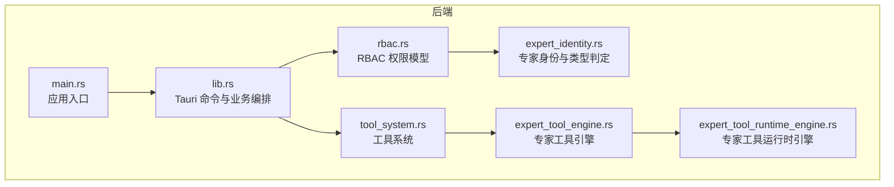
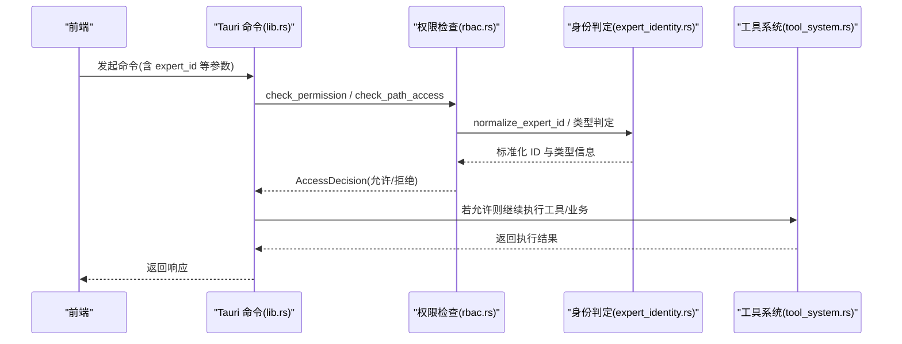
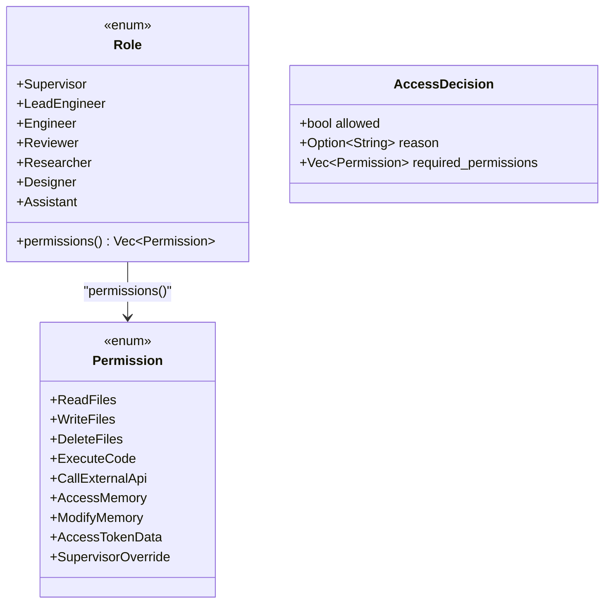
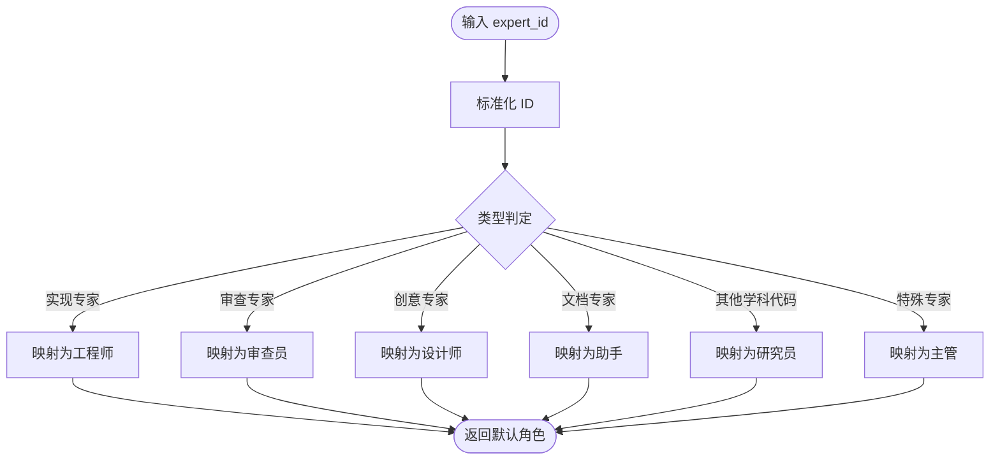
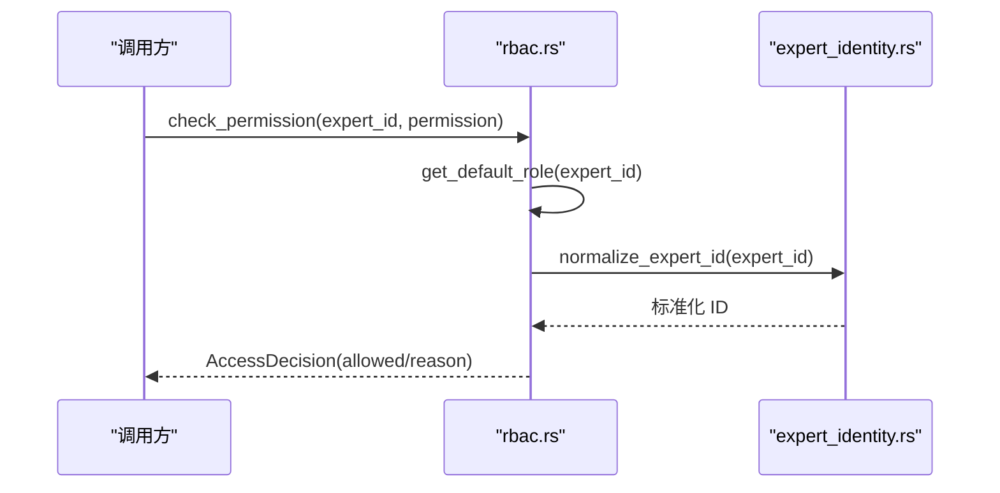
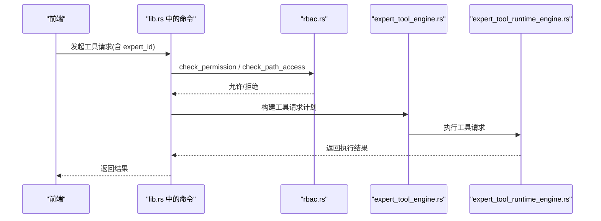
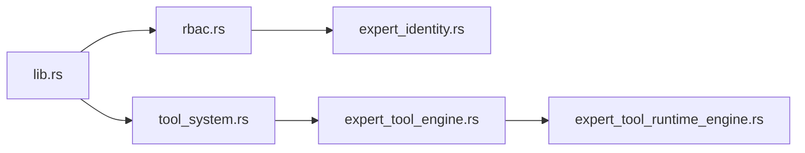

# 专家权限控制

<cite>
**本文引用的文件**
- [expert_identity.rs](file://ai-experts/src-tauri/src/expert_identity.rs)
- [rbac.rs](file://ai-experts/src-tauri/src/rbac.rs)
- [lib.rs](file://ai-experts/src-tauri/src/lib.rs)
- [main.rs](file://ai-experts/src-tauri/src/main.rs)
- [tool_system.rs](file://ai-experts/src-tauri/src/tool_system.rs)
- [expert_tool_engine.rs](file://ai-experts/src-tauri/src/expert_tool_engine.rs)
- [expert_tool_runtime_engine.rs](file://ai-experts/src-tauri/src/expert_tool_runtime_engine.rs)
</cite>

## 目录
1. [引言](#引言)
2. [项目结构](#项目结构)
3. [核心组件](#核心组件)
4. [架构总览](#架构总览)
5. [详细组件分析](#详细组件分析)
6. [依赖关系分析](#依赖关系分析)
7. [性能考量](#性能考量)
8. [故障排查指南](#故障排查指南)
9. [结论](#结论)
10. [附录](#附录)

## 引言
本技术文档聚焦“星图专家团工作台”的专家权限控制系统，围绕 RBAC（基于角色的访问控制）模型展开，系统性阐述权限定义、角色映射与权限继承机制，以及专家身份管理在系统中的作用。文档还覆盖权限在工具访问、专家协作与系统管理等场景的应用方式，给出最佳实践、审计与安全策略建议，并提供扩展接口与自定义规则指南，帮助读者在不牺牲安全性与数据保密性的前提下，正确使用与扩展权限体系。

## 项目结构
权限控制相关代码主要集中在 Rust 后端模块中，前端通过 Tauri 命令与后端交互，后端在执行具体操作前进行权限校验。关键文件与职责如下：
- expert_identity.rs：专家身份标准化、专家类型判定与能力开关
- rbac.rs：权限枚举、角色定义、角色到权限映射、访问决策与路径访问控制
- tool_system.rs / expert_tool_engine.rs / expert_tool_runtime_engine.rs：工具系统与专家工具执行链路，涉及权限前置校验与执行
- lib.rs：Tauri 命令入口，集中调用权限检查与业务逻辑
- main.rs：应用入口，启动后端服务

图表来源
- [main.rs:1-6](file://ai-experts/src-tauri/src/main.rs#L1-L6)
- [lib.rs:1-52](file://ai-experts/src-tauri/src/lib.rs#L1-L52)
- [rbac.rs:1-235](file://ai-experts/src-tauri/src/rbac.rs#L1-L235)
- [expert_identity.rs:1-64](file://ai-experts/src-tauri/src/expert_identity.rs#L1-L64)
- [tool_system.rs](file://ai-experts/src-tauri/src/tool_system.rs)
- [expert_tool_engine.rs](file://ai-experts/src-tauri/src/expert_tool_engine.rs)
- [expert_tool_runtime_engine.rs](file://ai-experts/src-tauri/src/expert_tool_runtime_engine.rs)

章节来源
- [main.rs:1-6](file://ai-experts/src-tauri/src/main.rs#L1-L6)
- [lib.rs:1-52](file://ai-experts/src-tauri/src/lib.rs#L1-L52)

## 核心组件
- 权限枚举（Permission）：定义可执行的操作集合，如文件读写、执行代码、调用外部 API、访问/修改记忆、访问令牌数据、主管覆盖等。
- 角色枚举（Role）：定义专家角色，如主管、主工程师、工程师、审查员、研究员、设计师、助手。每个角色对应一组权限集合。
- 访问决策（AccessDecision）：封装权限检查结果，包含是否允许、原因与所需权限列表。
- 专家身份与类型判定：对专家 ID 进行标准化与类型识别，支持旧 ID 映射与学科代码映射，提供多种专家能力判定函数。
- 路径访问控制：对敏感路径进行白名单式保护，仅主管可访问敏感资源。

章节来源
- [rbac.rs:12-74](file://ai-experts/src-tauri/src/rbac.rs#L12-L74)
- [rbac.rs:25-67](file://ai-experts/src-tauri/src/rbac.rs#L25-L67)
- [rbac.rs:69-74](file://ai-experts/src-tauri/src/rbac.rs#L69-L74)
- [expert_identity.rs:3-63](file://ai-experts/src-tauri/src/expert_identity.rs#L3-L63)

## 架构总览
权限控制贯穿前端命令到后端执行的全链路。前端通过 Tauri 命令触发后端处理，后端在进入具体业务逻辑之前，先根据专家 ID 与目标操作进行权限检查，再决定是否放行。对于工具类操作，还会结合工具系统与专家工具引擎进行二次校验。

图表来源
- [lib.rs:5973-5979](file://ai-experts/src-tauri/src/lib.rs#L5973-L5979)
- [rbac.rs:106-172](file://ai-experts/src-tauri/src/rbac.rs#L106-L172)
- [expert_identity.rs:3-63](file://ai-experts/src-tauri/src/expert_identity.rs#L3-L63)
- [tool_system.rs](file://ai-experts/src-tauri/src/tool_system.rs)

## 详细组件分析

### RBAC 权限模型与角色映射
- 权限与角色：权限以枚举形式定义，角色以枚举形式定义，角色到权限的映射集中于角色方法中，非主管角色共享同一套权限集，主管拥有额外的删除、令牌数据与覆盖权限。
- 默认角色映射：根据专家 ID 的标准化结果与类型判定，将专家映射到默认角色。该映射同时考虑旧 ID、学科代码与特定专家标识。
- 访问决策：提供单权限检查与批量权限检查，返回统一的决策结构，便于上层处理。

图表来源
- [rbac.rs:12-74](file://ai-experts/src-tauri/src/rbac.rs#L12-L74)
- [rbac.rs:25-67](file://ai-experts/src-tauri/src/rbac.rs#L25-L67)
- [rbac.rs:69-74](file://ai-experts/src-tauri/src/rbac.rs#L69-L74)

章节来源
- [rbac.rs:12-74](file://ai-experts/src-tauri/src/rbac.rs#L12-L74)
- [rbac.rs:25-67](file://ai-experts/src-tauri/src/rbac.rs#L25-L67)
- [rbac.rs:78-102](file://ai-experts/src-tauri/src/rbac.rs#L78-L102)

### 专家身份管理与类型判定
- ID 标准化：将旧 ID 映射为新的学科代码或保留原 ID，保证后续角色与权限判定的一致性。
- 专家类型判定：提供多种专家类型的判断函数，用于更细粒度的能力开关与访问控制。
- 敏感路径保护：对包含敏感关键词的路径进行访问限制，仅主管可访问。

图表来源
- [expert_identity.rs:3-63](file://ai-experts/src-tauri/src/expert_identity.rs#L3-L63)
- [rbac.rs:78-102](file://ai-experts/src-tauri/src/rbac.rs#L78-L102)

章节来源
- [expert_identity.rs:3-63](file://ai-experts/src-tauri/src/expert_identity.rs#L3-L63)
- [rbac.rs:129-172](file://ai-experts/src-tauri/src/rbac.rs#L129-L172)

### 权限检查流程与路径访问控制
- 单权限检查：根据专家 ID 获取默认角色，查询角色权限集，判断是否具备目标权限。
- 批量权限检查：用于一次性校验多个权限，减少重复查询。
- 路径访问控制：对包含敏感关键词的路径进行拦截，仅主管可访问。

图表来源
- [rbac.rs:106-127](file://ai-experts/src-tauri/src/rbac.rs#L106-L127)
- [rbac.rs:78-102](file://ai-experts/src-tauri/src/rbac.rs#L78-L102)
- [expert_identity.rs:3-22](file://ai-experts/src-tauri/src/expert_identity.rs#L3-L22)

章节来源
- [rbac.rs:106-127](file://ai-experts/src-tauri/src/rbac.rs#L106-L127)
- [rbac.rs:175-199](file://ai-experts/src-tauri/src/rbac.rs#L175-L199)
- [rbac.rs:129-172](file://ai-experts/src-tauri/src/rbac.rs#L129-L172)

### 工具访问权限与执行链路
- 命令入口：Tauri 命令在进入工具执行前调用权限检查，确保专家具备相应权限。
- 工具系统：工具系统负责解析与调度工具请求，结合专家工具引擎与运行时引擎完成具体执行。
- 权限与工具的衔接：工具执行前的权限检查由 rbac.rs 提供，工具执行过程中的日志与事件可用于审计。

图表来源
- [lib.rs:1663-1678](file://ai-experts/src-tauri/src/lib.rs#L1663-L1678)
- [lib.rs:1744-1785](file://ai-experts/src-tauri/src/lib.rs#L1744-L1785)
- [rbac.rs:106-172](file://ai-experts/src-tauri/src/rbac.rs#L106-L172)
- [expert_tool_engine.rs](file://ai-experts/src-tauri/src/expert_tool_engine.rs)
- [expert_tool_runtime_engine.rs](file://ai-experts/src-tauri/src/expert_tool_runtime_engine.rs)

章节来源
- [lib.rs:1663-1678](file://ai-experts/src-tauri/src/lib.rs#L1663-L1678)
- [lib.rs:1744-1785](file://ai-experts/src-tauri/src/lib.rs#L1744-L1785)

## 依赖关系分析
- 模块耦合：lib.rs 作为命令入口，依赖 rbac.rs 与 expert_identity.rs 进行权限与身份判定；工具链路依赖 tool_system.rs、expert_tool_engine.rs 与 expert_tool_runtime_engine.rs。
- 外部依赖：权限模型使用 serde 进行序列化/反序列化；工具链路可能依赖外部工具与系统命令执行环境。
- 可能的循环依赖：当前文件间未见直接循环导入；角色与权限定义位于 rbac.rs，被 lib.rs 与工具链路间接使用，符合分层设计。

图表来源
- [lib.rs:1-52](file://ai-experts/src-tauri/src/lib.rs#L1-L52)
- [rbac.rs:1-8](file://ai-experts/src-tauri/src/rbac.rs#L1-L8)
- [expert_identity.rs:1-2](file://ai-experts/src-tauri/src/expert_identity.rs#L1-L2)
- [tool_system.rs](file://ai-experts/src-tauri/src/tool_system.rs)
- [expert_tool_engine.rs](file://ai-experts/src-tauri/src/expert_tool_engine.rs)
- [expert_tool_runtime_engine.rs](file://ai-experts/src-tauri/src/expert_tool_runtime_engine.rs)

章节来源
- [lib.rs:1-52](file://ai-experts/src-tauri/src/lib.rs#L1-L52)
- [rbac.rs:1-8](file://ai-experts/src-tauri/src/rbac.rs#L1-L8)

## 性能考量
- 权限检查复杂度：角色到权限映射为常数时间查找，整体检查复杂度近似 O(n)，其中 n 为批量权限数量。
- ID 标准化与类型判定：字符串匹配与前缀解析成本低，适合高频调用。
- 路径敏感词检查：对路径进行一次小规模关键字匹配，开销极低。
- 建议：在高频路径上缓存专家默认角色与权限集合，避免重复计算；对批量权限检查进行去重与合并，减少重复 I/O。

## 故障排查指南
- 权限不足：当 AccessDecision 的 allowed 为 false 且 reason 存在时，需检查专家 ID 是否正确、是否需要主管覆盖权限。
- 路径访问被拒：若路径包含敏感关键词，仅主管可访问；确认专家身份与角色映射是否正确。
- 工具执行失败：检查工具请求构建与执行链路的日志，结合权限检查结果定位问题。
- 审计与追踪：在命令入口处记录权限检查结果与专家 ID，便于审计与回溯。

章节来源
- [rbac.rs:106-127](file://ai-experts/src-tauri/src/rbac.rs#L106-L127)
- [rbac.rs:129-172](file://ai-experts/src-tauri/src/rbac.rs#L129-L172)
- [lib.rs:5973-5979](file://ai-experts/src-tauri/src/lib.rs#L5973-L5979)

## 结论
本权限控制系统以 RBAC 为核心，结合专家身份标准化与类型判定，实现了清晰的角色到权限映射与路径访问控制。通过在命令入口集中进行权限检查，有效保障了工具访问、专家协作与系统管理的安全性与数据保密性。建议在生产环境中配合审计与配额策略，持续优化权限模型与扩展接口，以满足不断演进的业务需求。

## 附录

### 权限配置最佳实践
- 明确角色边界：非主管角色共享权限集，避免过度授权；主管角色仅在必要时启用覆盖权限。
- 使用标准化 ID：统一专家 ID 格式，减少映射歧义。
- 路径保护优先：对敏感路径采用白名单式保护，仅主管可访问。
- 批量权限检查：在一次操作中一次性校验所有必需权限，减少重复调用。

### 权限审计机制与安全策略
- 审计记录：在命令入口记录专家 ID、权限检查结果、所需权限与拒绝原因。
- 配额与用量：结合令牌用量与配额策略，防止滥用。
- 最小权限原则：默认授予完成任务所需的最小权限集合。

### 扩展接口与自定义权限规则
- 新增权限：在权限枚举中添加新权限项，并在角色映射中明确其授予范围。
- 自定义角色：新增角色枚举并在角色方法中定义其权限集合。
- 自定义类型判定：在专家身份模块中扩展类型判定逻辑，影响默认角色映射。
- 路径规则扩展：在路径访问控制中增加敏感词或路径模式，细化访问策略。

章节来源
- [rbac.rs:12-74](file://ai-experts/src-tauri/src/rbac.rs#L12-L74)
- [rbac.rs:25-67](file://ai-experts/src-tauri/src/rbac.rs#L25-L67)
- [expert_identity.rs:3-63](file://ai-experts/src-tauri/src/expert_identity.rs#L3-L63)
- [rbac.rs:129-172](file://ai-experts/src-tauri/src/rbac.rs#L129-L172)