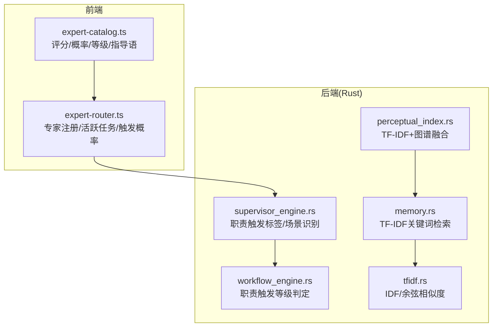
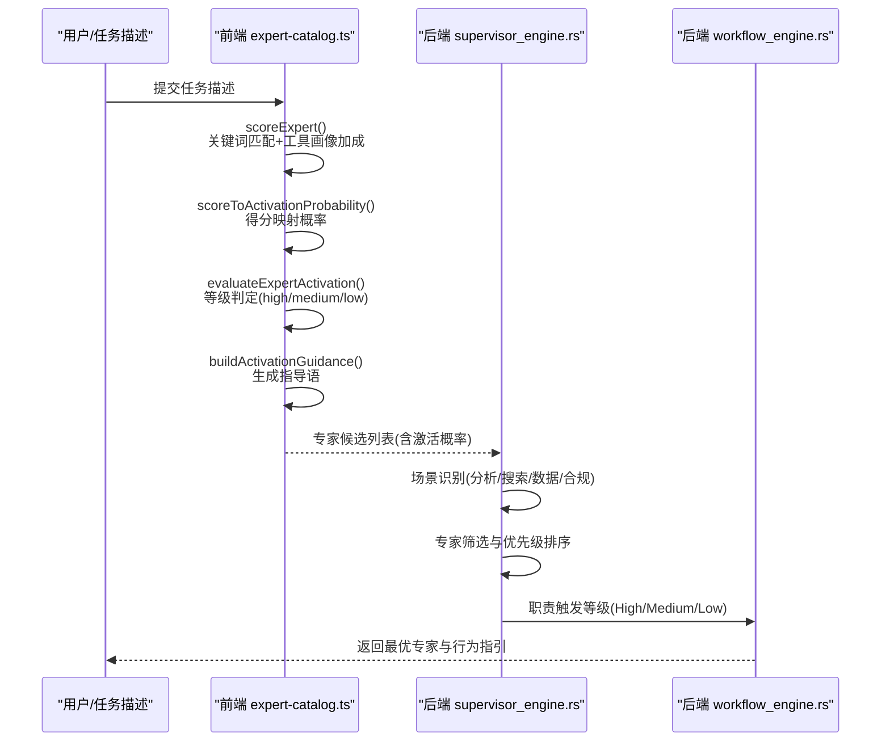
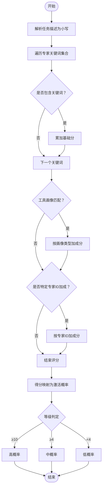
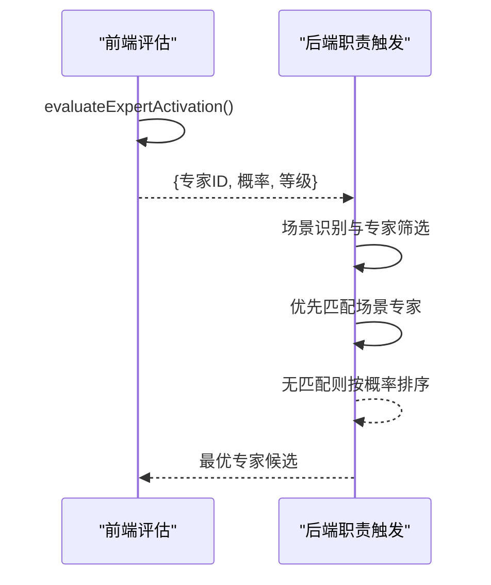
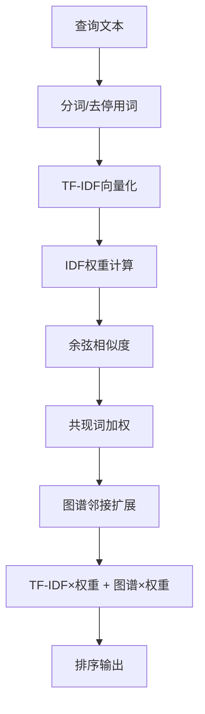
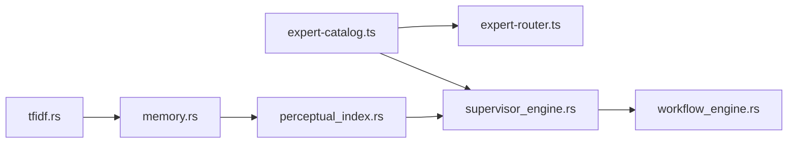

# 专家激活机制

<cite>
**本文引用的文件**
- [expert-catalog.ts](file://ai-experts/src/expert-catalog.ts)
- [expert-router.ts](file://ai-experts/src/expert-router.ts)
- [supervisor_engine.rs](file://ai-experts/src-tauri/src/supervisor_engine.rs)
- [workflow_engine.rs](file://ai-experts/src-tauri/src/workflow_engine.rs)
- [perceptual_index.rs](file://ai-experts/src-tauri/src/perceptual_index.rs)
- [memory.rs](file://ai-experts/src-tauri/src/memory.rs)
- [tfidf.rs](file://ai-experts/src-tauri/src/tfidf.rs)
</cite>

## 目录
1. [引言](#引言)
2. [项目结构](#项目结构)
3. [核心组件](#核心组件)
4. [架构总览](#架构总览)
5. [详细组件分析](#详细组件分析)
6. [依赖关系分析](#依赖关系分析)
7. [性能考量](#性能考量)
8. [故障排查指南](#故障排查指南)
9. [结论](#结论)
10. [附录](#附录)

## 引言
本技术文档围绕“星图专家团工作台”的专家激活机制展开，系统性阐述专家激活评分算法、激活概率计算、激活等级划分、评估流程、指导语生成、职责触发概率与权限策略，以及可配置项与性能优化建议。读者可据此理解从任务描述解析到专家匹配度计算的完整过程，并掌握如何基于任务特征自动选择最适合的专家。

## 项目结构
专家激活机制主要分布在前端 TypeScript 模块与 Rust 后端模块中：
- 前端负责专家关键词匹配评分、激活概率映射、激活等级判定与专家行为指导语生成。
- 后端负责专家职责触发的综合判断、场景识别与专家选择策略。

图表来源
- [expert-catalog.ts:383-426](file://ai-experts/src/expert-catalog.ts#L383-L426)
- [expert-router.ts:646-669](file://ai-experts/src/expert-router.ts#L646-L669)
- [supervisor_engine.rs:711-738](file://ai-experts/src-tauri/src/supervisor_engine.rs#L711-L738)
- [workflow_engine.rs:216-258](file://ai-experts/src-tauri/src/workflow_engine.rs#L216-L258)
- [perceptual_index.rs:368-404](file://ai-experts/src-tauri/src/perceptual_index.rs#L368-L404)
- [memory.rs:165-200](file://ai-experts/src-tauri/src/memory.rs#L165-L200)
- [tfidf.rs:232-280](file://ai-experts/src-tauri/src/tfidf.rs#L232-L280)

章节来源
- [expert-catalog.ts:383-426](file://ai-experts/src/expert-catalog.ts#L383-L426)
- [expert-router.ts:646-669](file://ai-experts/src/expert-router.ts#L646-L669)
- [supervisor_engine.rs:711-738](file://ai-experts/src-tauri/src/supervisor_engine.rs#L711-L738)
- [workflow_engine.rs:216-258](file://ai-experts/src-tauri/src/workflow_engine.rs#L216-L258)
- [perceptual_index.rs:368-404](file://ai-experts/src-tauri/src/perceptual_index.rs#L368-L404)
- [memory.rs:165-200](file://ai-experts/src-tauri/src/memory.rs#L165-L200)
- [tfidf.rs:232-280](file://ai-experts/src-tauri/src/tfidf.rs#L232-L280)

## 核心组件
- 专家激活评分与概率映射：前端通过关键词匹配计算专家与任务描述的契合度得分，并映射为激活概率与等级。
- 专家激活评估流程：从前端评分到后端职责触发等级的统一判定。
- 指导语生成：基于激活等级输出专家行为准则与权限提示。
- 场景识别与专家选择：后端根据任务场景与职责触发概率进行专家筛选与优先级排序。
- 检索增强：TF-IDF 与图谱融合提升匹配精度，支撑专家激活决策。

章节来源
- [expert-catalog.ts:383-426](file://ai-experts/src/expert-catalog.ts#L383-L426)
- [expert-catalog.ts:496-527](file://ai-experts/src/expert-catalog.ts#L496-L527)
- [expert-catalog.ts:410-426](file://ai-experts/src/expert-catalog.ts#L410-L426)
- [supervisor_engine.rs:711-738](file://ai-experts/src-tauri/src/supervisor_engine.rs#L711-L738)
- [perceptual_index.rs:368-404](file://ai-experts/src-tauri/src/perceptual_index.rs#L368-L404)
- [memory.rs:165-200](file://ai-experts/src-tauri/src/memory.rs#L165-L200)
- [tfidf.rs:232-280](file://ai-experts/src-tauri/src/tfidf.rs#L232-L280)

## 架构总览
专家激活机制的端到端流程如下：

图表来源
- [expert-catalog.ts:396-408](file://ai-experts/src/expert-catalog.ts#L396-L408)
- [expert-catalog.ts:496-527](file://ai-experts/src/expert-catalog.ts#L496-L527)
- [expert-catalog.ts:410-426](file://ai-experts/src/expert-catalog.ts#L410-L426)
- [supervisor_engine.rs:711-738](file://ai-experts/src-tauri/src/supervisor_engine.rs#L711-L738)
- [workflow_engine.rs:216-258](file://ai-experts/src-tauri/src/workflow_engine.rs#L216-L258)

## 详细组件分析

### 1) 专家激活评分算法与概率映射
- 关键词匹配逻辑
  - 对专家词条中的关键词集合进行遍历，若任务描述包含某关键词，则按固定分值累加。
  - 工具画像加成：针对不同工具画像（工程/分析/文档/创意/审查），当任务描述包含对应领域关键词时，额外加分。
  - 特定专家加成：对特定专家 ID 的任务描述包含相关关键词时，额外加分。
- 得分到激活概率映射
  - 采用分段映射函数，将得分映射为激活概率，得分越高，触发概率越大。
- 激活等级划分
  - 高：得分阈值较高，概率较高，专家具备主责倾向。
  - 中：得分中等，概率中等，专家作为辅助参与。
  - 低：得分较低，概率较低，专家默认不主动出手。

图表来源
- [expert-catalog.ts:496-527](file://ai-experts/src/expert-catalog.ts#L496-L527)
- [expert-catalog.ts:383-390](file://ai-experts/src/expert-catalog.ts#L383-L390)
- [expert-catalog.ts:396-408](file://ai-experts/src/expert-catalog.ts#L396-L408)

章节来源
- [expert-catalog.ts:496-527](file://ai-experts/src/expert-catalog.ts#L496-L527)
- [expert-catalog.ts:383-390](file://ai-experts/src/expert-catalog.ts#L383-L390)
- [expert-catalog.ts:396-408](file://ai-experts/src/expert-catalog.ts#L396-L408)

### 2) 专家激活评估流程
- 前端评估
  - 使用专家目录条目与任务描述调用评分函数，得到得分、概率与等级。
  - 生成专家行为指导语，明确主责/辅助定位与权限边界。
- 后端职责触发
  - 基于任务场景识别（分析/搜索/数据/合规），优先选择与场景匹配的专家。
  - 若无场景特异专家，则按职责触发概率进行首轮挑选，后续再按策略补充。

图表来源
- [expert-catalog.ts:396-408](file://ai-experts/src/expert-catalog.ts#L396-L408)
- [expert-catalog.ts:410-426](file://ai-experts/src/expert-catalog.ts#L410-L426)
- [supervisor_engine.rs:711-738](file://ai-experts/src-tauri/src/supervisor_engine.rs#L711-L738)

章节来源
- [expert-catalog.ts:396-408](file://ai-experts/src/expert-catalog.ts#L396-L408)
- [expert-catalog.ts:410-426](file://ai-experts/src/expert-catalog.ts#L410-L426)
- [supervisor_engine.rs:711-738](file://ai-experts/src-tauri/src/supervisor_engine.rs#L711-L738)

### 3) 指导语生成与权限策略
- 指导语结构
  - 头部：当前任务与学科匹配度、触发分、职责触发概率。
  - 行为准则：高概率主责、中概率辅助、低概率默认不主动。
  - 权限说明：权限完整但触发概率决定出手强度与主次。
- 权限与职责
  - 高概率专家在当前任务中承担主责，可主导结论与实现。
  - 中概率专家补充视角、发现风险、校正假设，避免越俎代庖。
  - 低概率专家默认不主动，除非学科证据足够强。

章节来源
- [expert-catalog.ts:410-426](file://ai-experts/src/expert-catalog.ts#L410-L426)

### 4) 激活概率到触发概率的转换机制
- 概率映射函数
  - 通过分段映射将专家评分转换为职责触发概率，得分越高，触发概率越高。
- 触发概率在后端的应用
  - 场景识别阶段：根据任务场景关键词或场景标签，优先选择与场景匹配的专家。
  - 专家筛选阶段：若存在场景特异专家则优先；否则按职责触发概率排序选取。

章节来源
- [expert-catalog.ts:383-390](file://ai-experts/src/expert-catalog.ts#L383-L390)
- [supervisor_engine.rs:711-738](file://ai-experts/src-tauri/src/supervisor_engine.rs#L711-L738)

### 5) 激活等级与职责触发概率
- 等级划分
  - 高：职责触发概率高，专家主责倾向强。
  - 中：职责触发概率中等，专家辅助参与。
  - 低：职责触发概率低，专家默认不主动。
- 等级在后端的体现
  - 职责触发等级用于工作流引擎的决策分支，影响专家的职责强度与动作范围。

章节来源
- [expert-catalog.ts:396-408](file://ai-experts/src/expert-catalog.ts#L396-L408)
- [workflow_engine.rs:252-258](file://ai-experts/src-tauri/src/workflow_engine.rs#L252-L258)

### 6) 专家激活指导语生成逻辑
- 生成步骤
  - 评估激活结果（得分、等级、概率）。
  - 生成头部摘要与行为准则。
  - 输出权限与主次定位说明。
- 不同等级的行为准则
  - 高：主责专家，主导结论与实现，必要时提出辅助专家补位。
  - 中：辅助专家，补充视角、发现风险、校正假设，不抢占主责。
  - 低：默认不主动，除非学科证据足够强。

章节来源
- [expert-catalog.ts:410-426](file://ai-experts/src/expert-catalog.ts#L410-L426)

### 7) 检索增强与匹配度提升
- TF-IDF 关键词匹配
  - 基于 IDF 与余弦相似度计算查询与候选内容的相似度。
- 共现词加权
  - 查询词在同一记忆中出现越多，相似度额外加分，提升相关性。
- 图谱扩展融合
  - 对 TF-IDF 结果进行图谱邻接扩展，融合图谱得分与 TF-IDF 权重，进行最终排序。

图表来源
- [memory.rs:622-648](file://ai-experts/src-tauri/src/memory.rs#L622-L648)
- [perceptual_index.rs:368-404](file://ai-experts/src-tauri/src/perceptual_index.rs#L368-L404)
- [tfidf.rs:232-280](file://ai-experts/src-tauri/src/tfidf.rs#L232-L280)

章节来源
- [memory.rs:165-200](file://ai-experts/src-tauri/src/memory.rs#L165-L200)
- [memory.rs:622-648](file://ai-experts/src-tauri/src/memory.rs#L622-L648)
- [perceptual_index.rs:368-404](file://ai-experts/src-tauri/src/perceptual_index.rs#L368-L404)
- [tfidf.rs:232-280](file://ai-experts/src-tauri/src/tfidf.rs#L232-L280)

### 8) 实际使用场景与最佳实践
- 自动选择专家
  - 将任务描述交给前端评估，得到专家候选及其职责触发概率。
  - 在后端场景识别阶段，优先选择与任务场景匹配的专家；若无匹配，则按概率排序。
- 配置与定制
  - 可调整关键词集合、工具画像加成分值与等级阈值，以适配不同业务场景。
  - 可扩展特定专家加成规则，提升关键专家的触发概率。
- 性能优化
  - 限制关键词数量与工具画像匹配范围，减少不必要的加成分支。
  - 对 TF-IDF 向量与图谱扩展结果进行缓存与增量更新，降低重复计算成本。

章节来源
- [expert-catalog.ts:496-527](file://ai-experts/src/expert-catalog.ts#L496-L527)
- [expert-catalog.ts:383-390](file://ai-experts/src/expert-catalog.ts#L383-L390)
- [supervisor_engine.rs:711-738](file://ai-experts/src-tauri/src/supervisor_engine.rs#L711-L738)
- [perceptual_index.rs:368-404](file://ai-experts/src-tauri/src/perceptual_index.rs#L368-L404)

## 依赖关系分析

图表来源
- [expert-catalog.ts:396-408](file://ai-experts/src/expert-catalog.ts#L396-L408)
- [expert-router.ts:646-669](file://ai-experts/src/expert-router.ts#L646-L669)
- [supervisor_engine.rs:711-738](file://ai-experts/src-tauri/src/supervisor_engine.rs#L711-L738)
- [workflow_engine.rs:216-258](file://ai-experts/src-tauri/src/workflow_engine.rs#L216-L258)
- [perceptual_index.rs:368-404](file://ai-experts/src-tauri/src/perceptual_index.rs#L368-L404)
- [memory.rs:165-200](file://ai-experts/src-tauri/src/memory.rs#L165-L200)
- [tfidf.rs:232-280](file://ai-experts/src-tauri/src/tfidf.rs#L232-L280)

章节来源
- [expert-catalog.ts:396-408](file://ai-experts/src/expert-catalog.ts#L396-L408)
- [expert-router.ts:646-669](file://ai-experts/src/expert-router.ts#L646-L669)
- [supervisor_engine.rs:711-738](file://ai-experts/src-tauri/src/supervisor_engine.rs#L711-L738)
- [workflow_engine.rs:216-258](file://ai-experts/src-tauri/src/workflow_engine.rs#L216-L258)
- [perceptual_index.rs:368-404](file://ai-experts/src-tauri/src/perceptual_index.rs#L368-L404)
- [memory.rs:165-200](file://ai-experts/src-tauri/src/memory.rs#L165-L200)
- [tfidf.rs:232-280](file://ai-experts/src-tauri/src/tfidf.rs#L232-L280)

## 性能考量
- 评分阶段
  - 控制关键词集合规模，避免过多匹配分支导致时间复杂度上升。
  - 工具画像加成仅在命中时加分，避免全量扫描。
- 概率映射
  - 分段映射为常数时间，开销极低。
- 场景识别与专家筛选
  - 场景关键词集合较小，匹配成本可控。
  - 优先匹配场景专家可显著减少后续排序成本。
- 检索增强
  - TF-IDF 与余弦相似度计算可缓存向量与 IDF 表。
  - 共现词加权与图谱扩展需注意内存占用，建议按需启用与增量更新。

[本节为通用性能建议，无需特定文件引用]

## 故障排查指南
- 专家未被触发
  - 检查任务描述是否包含专家关键词或工具画像相关词汇。
  - 核对等级阈值与概率映射是否符合预期。
- 指导语不符合预期
  - 确认评估流程已正确生成激活等级与概率。
  - 检查指导语模板是否被正确拼接。
- 场景专家未被优先选择
  - 确认场景关键词识别逻辑是否覆盖任务描述。
  - 检查是否存在场景特异专家且处于可用状态。

章节来源
- [expert-catalog.ts:396-408](file://ai-experts/src/expert-catalog.ts#L396-L408)
- [expert-catalog.ts:410-426](file://ai-experts/src/expert-catalog.ts#L410-L426)
- [supervisor_engine.rs:711-738](file://ai-experts/src-tauri/src/supervisor_engine.rs#L711-L738)

## 结论
专家激活机制通过前端关键词匹配评分与概率映射、后端场景识别与职责触发等级判定，实现了从任务描述到专家选择与行为指引的闭环。结合 TF-IDF 与图谱融合的检索增强，进一步提升了匹配精度与决策质量。通过合理的配置与优化，可在保证性能的同时满足多样化的专家激活需求。

[本节为总结性内容，无需特定文件引用]

## 附录
- 关键实现路径参考
  - 评分与概率映射：[expert-catalog.ts:383-390](file://ai-experts/src/expert-catalog.ts#L383-L390)
  - 评估与等级判定：[expert-catalog.ts:396-408](file://ai-experts/src/expert-catalog.ts#L396-L408)
  - 指导语生成：[expert-catalog.ts:410-426](file://ai-experts/src/expert-catalog.ts#L410-L426)
  - 关键词匹配与加成：[expert-catalog.ts:496-527](file://ai-experts/src/expert-catalog.ts#L496-L527)
  - 场景识别与专家筛选：[supervisor_engine.rs:711-738](file://ai-experts/src-tauri/src/supervisor_engine.rs#L711-L738)
  - 职责触发等级：[workflow_engine.rs:252-258](file://ai-experts/src-tauri/src/workflow_engine.rs#L252-L258)
  - TF-IDF 与检索增强：[memory.rs:622-648](file://ai-experts/src-tauri/src/memory.rs#L622-L648)、[perceptual_index.rs:368-404](file://ai-experts/src-tauri/src/perceptual_index.rs#L368-L404)、[tfidf.rs:232-280](file://ai-experts/src-tauri/src/tfidf.rs#L232-L280)

[本节为参考清单，无需特定文件引用]