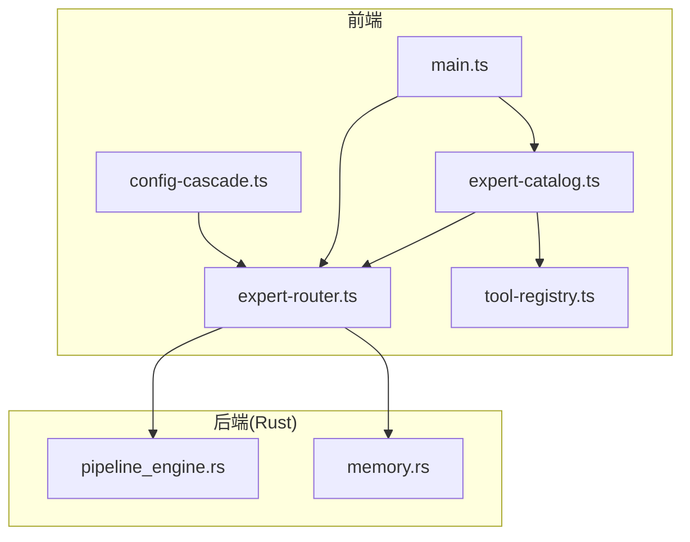
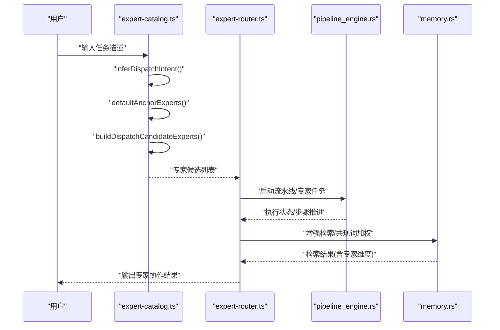
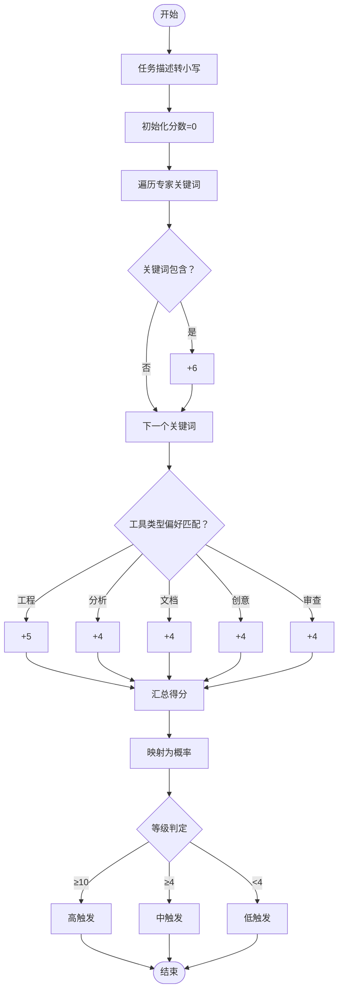
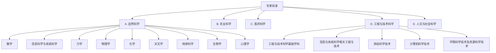
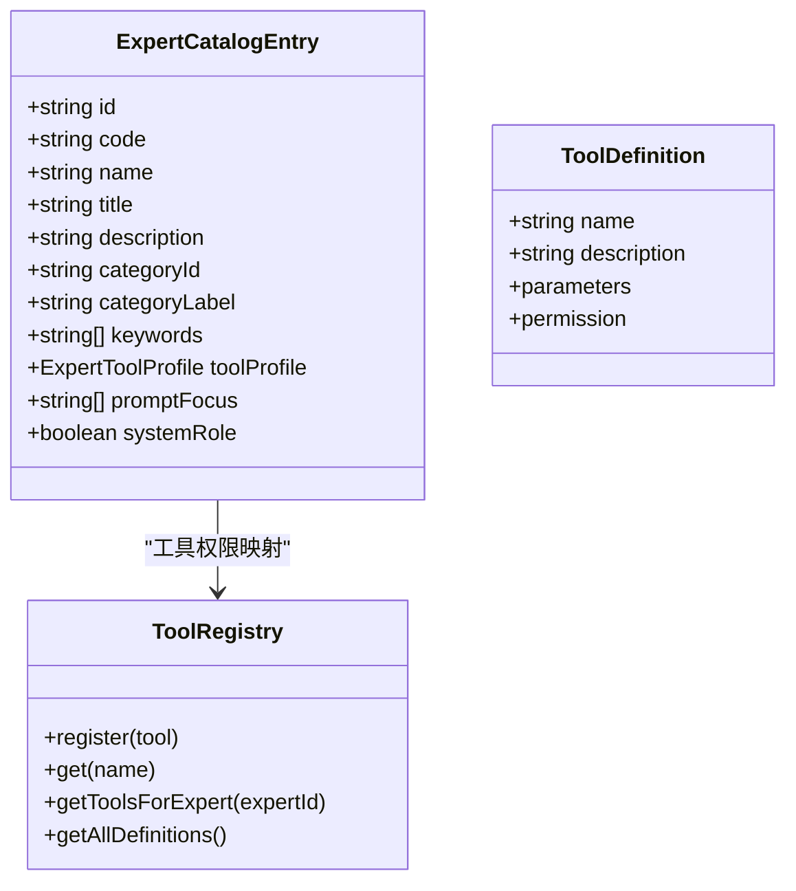
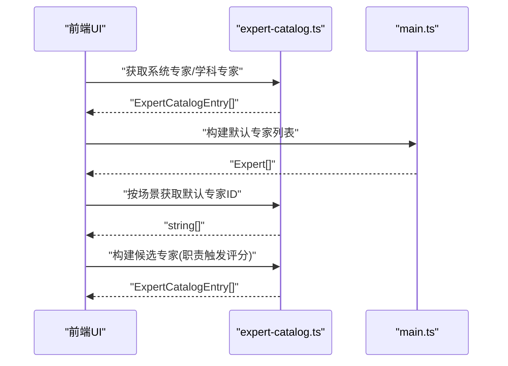
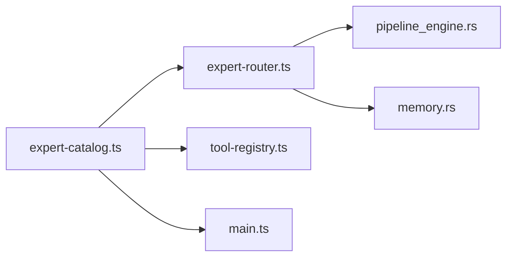

# 专家目录管理

<cite>
**本文档引用的文件**
- [expert-catalog.ts](file://ai-experts/src/expert-catalog.ts)
- [expert-router.ts](file://ai-experts/src/expert-router.ts)
- [tool-registry.ts](file://ai-experts/src/tool-registry.ts)
- [main.ts](file://ai-experts/src/main.ts)
- [config-cascade.ts](file://ai-experts/src/config-cascade.ts)
- [pipeline_engine.rs](file://ai-experts/src-tauri/src/pipeline_engine.rs)
- [memory.rs](file://ai-experts/src-tauri/src/memory.rs)
</cite>

## 目录
1. [简介](#简介)
2. [项目结构](#项目结构)
3. [核心组件](#核心组件)
4. [架构总览](#架构总览)
5. [详细组件分析](#详细组件分析)
6. [依赖分析](#依赖分析)
7. [性能考量](#性能考量)
8. [故障排查指南](#故障排查指南)
9. [结论](#结论)
10. [附录](#附录)

## 简介
本文件面向“星图专家团工作台”的专家目录管理功能，系统化阐述专家目录的数据结构设计、专家类型与工具配置、关键词匹配与职责触发评分、专家分类体系与层次结构、初始化与查询流程、以及扩展与最佳实践。文档以代码为依据，辅以可视化图示，帮助开发者与使用者高效理解与使用专家目录。

## 项目结构
专家目录管理主要由前端 TypeScript 模块与后端 Rust 引擎协同完成：
- 前端核心模块
  - expert-catalog.ts：专家目录数据结构、专家条目、职责触发评分、系统 Prompt 构建、默认专家与场景映射、工具权限映射等。
  - expert-router.ts：专家路由与调度、令牌配额与仪表盘、任务状态与流水线集成。
  - tool-registry.ts：工具注册表与专家工具权限映射。
  - main.ts：专家卡片渲染、UI 分组与分类展示、专家信息聚合。
  - config-cascade.ts：配置层叠系统（LLM、Shell、审批、Agent、Pipeline、UI）。
- 后端引擎模块
  - pipeline_engine.rs：流水线与专家类别常量（研究、设计、工程、审查）。
  - memory.rs：增强的记忆检索（共现词加权、专家维度过滤）。

**图示来源**
- [expert-catalog.ts](file://ai-experts/src/expert-catalog.ts)
- [expert-router.ts](file://ai-experts/src/expert-router.ts)
- [tool-registry.ts](file://ai-experts/src/tool-registry.ts)
- [main.ts](file://ai-experts/src/main.ts)
- [config-cascade.ts](file://ai-experts/src/config-cascade.ts)
- [pipeline_engine.rs](file://ai-experts/src-tauri/src/pipeline_engine.rs)
- [memory.rs](file://ai-experts/src-tauri/src/memory.rs)

**章节来源**
- [expert-catalog.ts](file://ai-experts/src/expert-catalog.ts)
- [expert-router.ts](file://ai-experts/src/expert-router.ts)
- [tool-registry.ts](file://ai-experts/src/tool-registry.ts)
- [main.ts](file://ai-experts/src/main.ts)
- [config-cascade.ts](file://ai-experts/src/config-cascade.ts)
- [pipeline_engine.rs](file://ai-experts/src-tauri/src/pipeline_engine.rs)
- [memory.rs](file://ai-experts/src-tauri/src/memory.rs)

## 核心组件
- 专家目录数据结构
  - ExpertCatalogEntry：专家条目字段（id/code/name/title/description/categoryId/categoryLabel/keywords/toolProfile/promptFocus/systemRole）。
  - 专家类型：system（系统角色）、discipline（学科专家），分别定义在 SYSTEM_EXPERTS 与 DISCIPLINE_EXPERTS。
  - 专家激活评分与触发概率：evaluateExpertActivation、scoreExpert、scoreToActivationProbability。
  - Prompt 构建：buildExpertSystemPrompt、buildTaskScopedExpertPrompt、buildActivationGuidance。
- 专家分类与场景
  - 专家分类标签：categoryId、categoryLabel（如 natural、agriculture、medical、engineering、humanities）。
  - 场景默认专家映射：SCENE_DEFAULT_EXPERT_IDS。
  - 专家类型判定：isImplementationDisciplineExpert、isReviewDisciplineExpert、isDocumentationDisciplineExpert、isCreativeMediaDisciplineExpert、isQuantitativeAnalysisDisciplineExpert。
- 工具与权限
  - 专家工具映射：buildExpertToolMap、ToolRegistry 提供工具注册与权限过滤。
  - 常用工具：shell_exec、file_read、file_write、file_patch、file_list、web_search、memory_query、index_search。
- 路由与调度
  - RouterExpert、ExpertTask、TokenDashboardSnapshot 等类型。
  - 令牌配额与豁免：QUOTA_EXEMPT_IDS、tokenData/userTokenData、displayQuotaBlockMessage。
  - 专家候选构建：buildDispatchCandidateExperts、defaultAnchorExperts、inferDispatchIntent。
- UI 与配置
  - 专家卡片渲染与分组：buildDefaultExperts、工具栏标签映射 toolProfileLabel。
  - 配置层叠：LLM、Shell、Approval、Agent、Pipeline、UI 配置与运行时覆盖。

**章节来源**
- [expert-catalog.ts](file://ai-experts/src/expert-catalog.ts)
- [expert-router.ts](file://ai-experts/src/expert-router.ts)
- [tool-registry.ts](file://ai-experts/src/tool-registry.ts)
- [main.ts](file://ai-experts/src/main.ts)
- [config-cascade.ts](file://ai-experts/src/config-cascade.ts)

## 架构总览
专家目录管理的端到端流程如下：
- 输入任务描述，系统先进行场景推断与锚点专家选择。
- 对学科专家集合进行职责触发评分，按概率与分数排序。
- 生成专家系统 Prompt 并注入工具权限，进入任务执行阶段。
- 后端流水线引擎与记忆检索配合，完成专家协作与知识复用。

**图示来源**
- [expert-catalog.ts](file://ai-experts/src/expert-catalog.ts)
- [expert-router.ts](file://ai-experts/src/expert-router.ts)
- [pipeline_engine.rs](file://ai-experts/src-tauri/src/pipeline_engine.rs)
- [memory.rs](file://ai-experts/src-tauri/src/memory.rs)

## 详细组件分析

### 专家目录数据结构与职责触发评分
- ExpertCatalogEntry 字段
  - id：唯一标识
  - code：学科代码
  - name/title/description：专家名称、头衔与职责描述
  - categoryId/categoryLabel：分类与标签
  - keywords：关键词列表，用于匹配任务描述
  - toolProfile：工具配置类型（engineering/analysis/documentation/creative/review）
  - promptFocus：高频关注点
  - systemRole：是否为系统角色
- 专家类型
  - system：系统角色（主管/助手），用于任务协调与系统级辅助。
  - discipline：学科专家，覆盖自然科学、农业科学、医药科学、工程与技术科学、人文与社会科学等。
- 职责触发评分
  - scoreExpert：基于关键词匹配与工具类型偏好计算得分。
  - evaluateExpertActivation：将得分映射为高/中/低触发等级与触发概率。
  - buildActivationGuidance：生成专家在当前任务中的职责定位与行动建议。

**图示来源**
- [expert-catalog.ts](file://ai-experts/src/expert-catalog.ts)

**章节来源**
- [expert-catalog.ts](file://ai-experts/src/expert-catalog.ts)

### 专家分类体系与层次结构
- 分类标签
  - categoryId：如 natural、agriculture、medical、engineering、humanities。
  - categoryLabel：如 “A. 自然科学”、“B. 农业科学”、“C. 医药科学”、“D. 工程与技术科学”、“E. 人文与社会科学”。
- 层次结构
  - 一级学科群（如“自然科学”、“工程与技术科学”）下包含多个二级学科专家。
  - UI 中按 categoryLabel 分组展示，支持展开/折叠与排序。

**图示来源**
- [expert-catalog.ts](file://ai-experts/src/expert-catalog.ts)
- [main.ts](file://ai-experts/src/main.ts)

**章节来源**
- [expert-catalog.ts](file://ai-experts/src/expert-catalog.ts)
- [main.ts](file://ai-experts/src/main.ts)

### 专家类型定义与工具配置
- 专家类型（toolProfile）
  - engineering：工程实现专家，具备执行落盘动作的能力。
  - analysis：分析建模专家，强调证据与推理链。
  - documentation：文献整理专家，强调结构化与可检索性。
  - creative：创意表达专家，强调风格与落地平衡。
  - review：审查验收专家，强调风险边界与证据完整性。
- Prompt 构建
  - buildExpertSystemPrompt：构建专家系统 Prompt，包含“初始化小型知识库”“专属方法论”“当前高频关注”“工作规则/变更与执行规则”等。
  - buildTaskScopedExpertPrompt：在系统 Prompt 基础上叠加职责触发倾向与行动建议。
- 工具权限映射
  - buildExpertToolMap：为每个专家授予通用工具集。
  - ToolRegistry：注册内置工具（shell_exec、file_*、web_search、memory_query、index_search），并按专家 ID 过滤可用工具。

**图示来源**
- [expert-catalog.ts](file://ai-experts/src/expert-catalog.ts)
- [tool-registry.ts](file://ai-experts/src/tool-registry.ts)

**章节来源**
- [expert-catalog.ts](file://ai-experts/src/expert-catalog.ts)
- [tool-registry.ts](file://ai-experts/src/tool-registry.ts)

### 专家目录初始化与查询流程
- 初始化
  - getSystemExperts/getDisciplineExperts/getAllExpertEntries：获取系统专家与学科专家集合。
  - buildDefaultExperts：将系统专家与学科专家映射为前端展示用 Expert[]。
- 查询与匹配
  - findExpertEntry：按 id 查找专家条目。
  - buildDispatchCandidateExperts：综合职责触发评分与场景锚点，返回候选专家列表。
  - getSceneDefaultExpertIds：按场景返回默认专家 ID 列表。
- UI 渲染
  - 按 categoryLabel 分组，支持展开/折叠与排序。
  - 工具栏标签映射 toolProfileLabel：将 toolProfile 显示为“工程执行/分析建模/文献整理/创意表达/审查验收”。

**图示来源**
- [expert-catalog.ts](file://ai-experts/src/expert-catalog.ts)
- [main.ts](file://ai-experts/src/main.ts)

**章节来源**
- [expert-catalog.ts](file://ai-experts/src/expert-catalog.ts)
- [main.ts](file://ai-experts/src/main.ts)

### 专家目录扩展接口与自定义添加指南
- 新增专家条目
  - 在 DISCIPLINE_EXPERTS 中新增 ExpertCatalogEntry 条目，填写 id/code/name/title/description/categoryId/categoryLabel/keywords/toolProfile/promptFocus（可选）。
  - 若有专属知识/方法论，可在 SPECIALIZATION_PROFILES 中补充 knowledge/methodology/promptFocus。
- 场景默认专家映射
  - 在 SCENE_DEFAULT_EXPERT_IDS 中为新场景添加默认专家 ID 列表。
- 工具权限
  - 若需限制或扩展工具权限，修改 buildExpertToolMap 或 ToolRegistry 注册项。
- 专家类型判定
  - 若新增专家属于特定类型（工程/审查/文档/创意/统计），可扩展相应 isXxxDisciplineExpert 函数。
- 最佳实践
  - 关键词应覆盖任务描述中的高频词，确保职责触发评分合理。
  - promptFocus 用于聚焦高频关注点，提升专家在特定任务中的专注度。
  - systemRole 仅限系统角色使用，避免与普通专家混淆。

**章节来源**
- [expert-catalog.ts](file://ai-experts/src/expert-catalog.ts)
- [tool-registry.ts](file://ai-experts/src/tool-registry.ts)

### 实际使用场景与示例
- 关键词匹配
  - 任务描述包含“代码/开发/工程/重构/项目/系统/前端/后端/引擎”时，工程类专家获得额外加分。
  - 计算机专家 discipline-520 在涉及“typescript/javascript/rust/tauri/前端/后端/代码/仓库”时获得额外加分。
- 场景锚点
  - 翻译场景默认锚点为语言学与文献整理专家；代码开发场景默认锚点为计算机专家与系统架构专家。
- 职责触发与行动建议
  - 高触发：主责专家，优先给出主判断或主实现。
  - 中触发：辅助专家，补充视角、发现风险、校正假设。
  - 低触发：建议转交更匹配专家或提供局部帮助。

**章节来源**
- [expert-catalog.ts](file://ai-experts/src/expert-catalog.ts)

## 依赖分析
- 前端模块耦合
  - expert-catalog.ts 为核心数据与逻辑中心，被 expert-router.ts、tool-registry.ts、main.ts 多处依赖。
  - expert-router.ts 依赖 expert-catalog.ts 的职责触发与 Prompt 构建能力，并与后端引擎交互。
  - tool-registry.ts 依赖 expert-catalog.ts 的工具映射。
  - main.ts 依赖 expert-catalog.ts 的专家信息与 UI 渲染。
- 后端模块耦合
  - pipeline_engine.rs 定义专家类别常量，与前端工程/审查/设计/研究专家类型形成一致映射。
  - memory.rs 的增强检索与专家维度过滤，与前端专家目录的职责触发评分形成互补。

**图示来源**
- [expert-catalog.ts](file://ai-experts/src/expert-catalog.ts)
- [expert-router.ts](file://ai-experts/src/expert-router.ts)
- [tool-registry.ts](file://ai-experts/src/tool-registry.ts)
- [main.ts](file://ai-experts/src/main.ts)
- [pipeline_engine.rs](file://ai-experts/src-tauri/src/pipeline_engine.rs)
- [memory.rs](file://ai-experts/src-tauri/src/memory.rs)

**章节来源**
- [expert-catalog.ts](file://ai-experts/src/expert-catalog.ts)
- [expert-router.ts](file://ai-experts/src/expert-router.ts)
- [tool-registry.ts](file://ai-experts/src/tool-registry.ts)
- [main.ts](file://ai-experts/src/main.ts)
- [pipeline_engine.rs](file://ai-experts/src-tauri/src/pipeline_engine.rs)
- [memory.rs](file://ai-experts/src-tauri/src/memory.rs)

## 性能考量
- 职责触发评分
  - 关键词匹配与工具类型偏好检查为 O(N)（N 为关键词数量），对学科专家集合排序为 O(M log M)，M 为专家数量。
- Prompt 构建
  - Prompt 组装为线性拼接，开销与关键词/方法论长度线性相关。
- 工具权限过滤
  - 通过 Set 去重与 Map 查找，过滤成本较低。
- 后端增强检索
  - 共现词加权与专家维度过滤在内存中完成，适合中小规模记忆库；大规模场景建议分页与缓存。

[本节为通用指导，无需具体文件分析]

## 故障排查指南
- 专家未被触发
  - 检查任务描述是否包含专家关键词；适当增加与任务相关的关键词。
  - 确认专家 toolProfile 与任务类型匹配（工程/分析/文档/创意/审查）。
- 工具权限不足
  - 确认专家 ID 是否在 buildExpertToolMap 中；检查 ToolRegistry 的权限配置。
- 场景锚点异常
  - 检查 SCENE_DEFAULT_EXPERT_IDS 中对应场景的默认专家 ID 列表。
- UI 分组显示异常
  - 检查 categoryLabel 与 categoryId 是否正确；确认 main.ts 的分组与排序逻辑。

**章节来源**
- [expert-catalog.ts](file://ai-experts/src/expert-catalog.ts)
- [tool-registry.ts](file://ai-experts/src/tool-registry.ts)
- [main.ts](file://ai-experts/src/main.ts)

## 结论
专家目录管理通过清晰的数据结构、完善的职责触发评分、灵活的工具权限与场景锚点，实现了专家的智能调度与协作。前端与后端模块协同，既保证了专家的职责边界，又提供了可扩展的配置与工具体系。遵循本文的最佳实践，可高效扩展专家目录并稳定运行专家协作流水线。

## 附录
- 专家类型速览
  - system：系统角色（主管/助手）
  - discipline：学科专家（覆盖自然科学、农业科学、医药科学、工程与技术科学、人文与社会科学）
- 常用工具速览
  - shell_exec、file_read、file_write、file_patch、file_list、web_search、memory_query、index_search
- 配置层叠
  - LLM、Shell、Approval、Agent、Pipeline、UI 配置可通过 config-cascade.ts 进行加载、覆盖与保存。

**章节来源**
- [expert-catalog.ts](file://ai-experts/src/expert-catalog.ts)
- [tool-registry.ts](file://ai-experts/src/tool-registry.ts)
- [config-cascade.ts](file://ai-experts/src/config-cascade.ts)