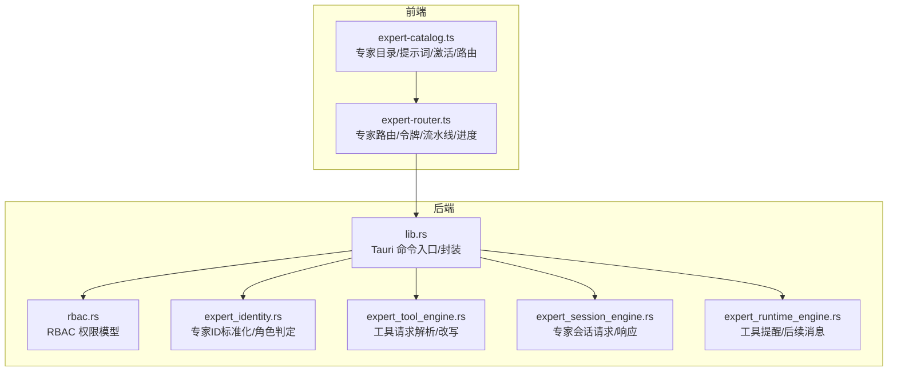
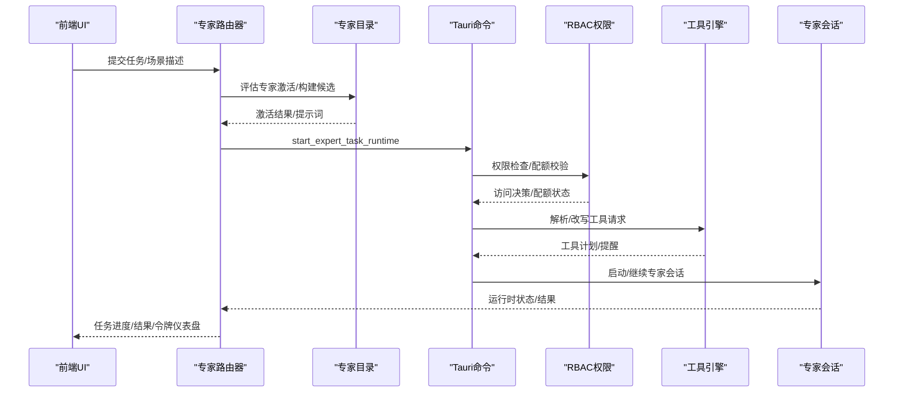
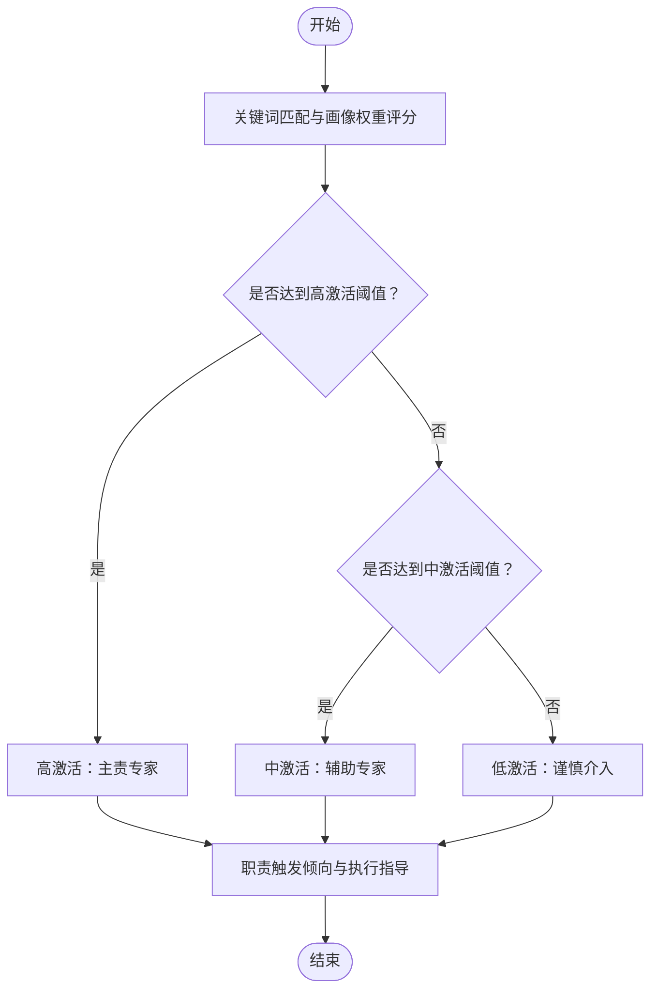
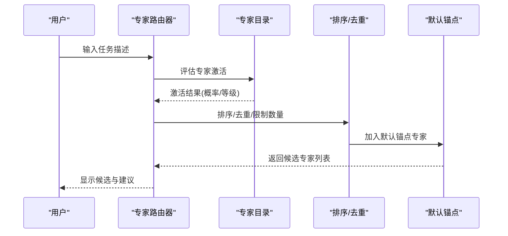
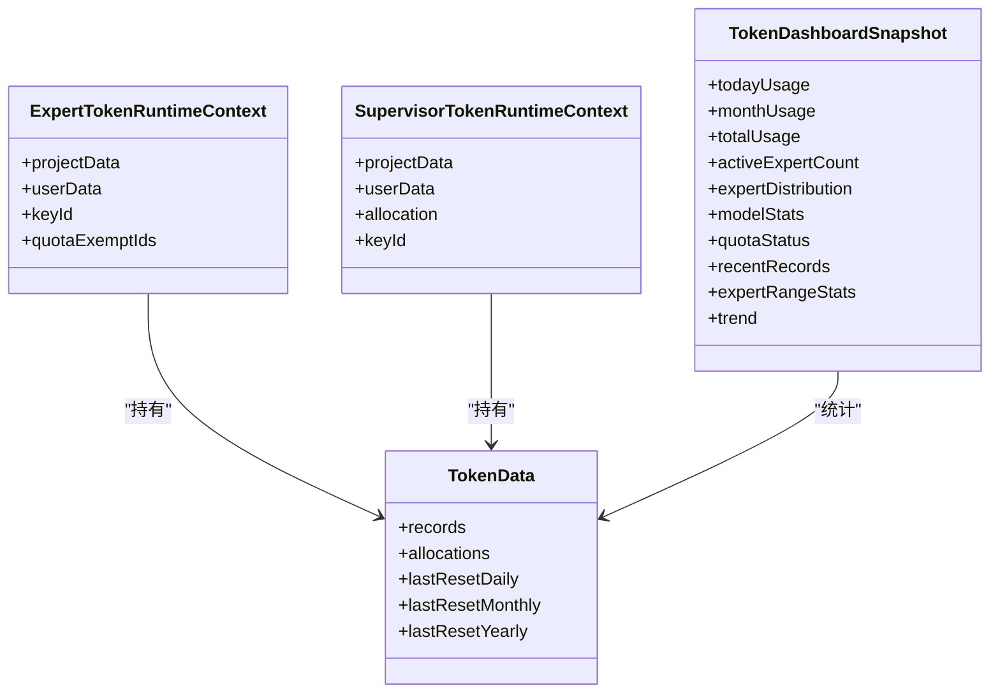
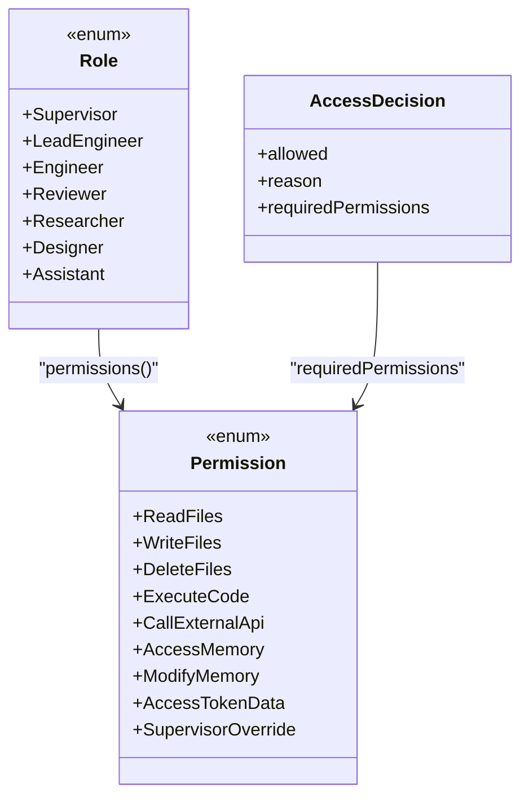
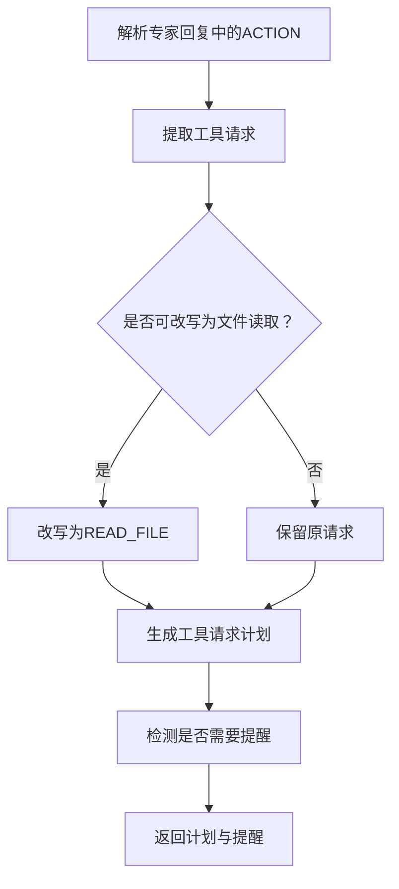
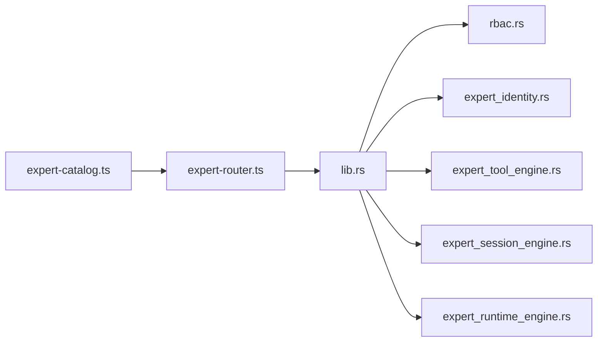

# 专家系统模块

<cite>
**本文档引用的文件**
- [expert-catalog.ts](file://ai-experts/src/expert-catalog.ts)
- [expert-router.ts](file://ai-experts/src/expert-router.ts)
- [expert_identity.rs](file://ai-experts/src-tauri/src/expert_identity.rs)
- [expert_runtime_engine.rs](file://ai-experts/src-tauri/src/expert_runtime_engine.rs)
- [rbac.rs](file://ai-experts/src-tauri/src/rbac.rs)
- [lib.rs](file://ai-experts/src-tauri/src/lib.rs)
- [expert_session_engine.rs](file://ai-experts/src-tauri/src/expert_session_engine.rs)
- [expert_tool_engine.rs](file://ai-experts/src-tauri/src/expert_tool_engine.rs)
- [package.json](file://ai-experts/package.json)
</cite>

## 目录
1. [简介](#简介)
2. [项目结构](#项目结构)
3. [核心组件](#核心组件)
4. [架构总览](#架构总览)
5. [详细组件分析](#详细组件分析)
6. [依赖分析](#依赖分析)
7. [性能考量](#性能考量)
8. [故障排查指南](#故障排查指南)
9. [结论](#结论)
10. [附录](#附录)

## 简介
本文件面向“星图专家团工作台”的专家系统模块，系统性阐述专家目录管理、专家激活机制、专家权限控制、专家类型与配置、专家分类体系、专家选择算法、激活概率计算、专家路由策略、RBAC 权限模型与继承、安全访问控制、扩展接口与自定义专家开发指南，以及最佳实践与使用场景。

## 项目结构
专家系统模块由前端 TypeScript 与后端 Rust 双栈构成：
- 前端模块（ai-experts/src）：专家目录、专家提示词构建、专家路由与任务调度、令牌配额与仪表盘、UI 交互与持久化。
- 后端模块（ai-experts/src-tauri/src）：专家身份标准化、权限控制（RBAC）、工具请求解析与改写、专家会话与运行时、令牌配额检查与持久化、主管分析与复核等。

**图表来源**
- [expert-catalog.ts:1-657](file://ai-experts/src/expert-catalog.ts#L1-L657)
- [expert-router.ts:1-800](file://ai-experts/src/expert-router.ts#L1-L800)
- [lib.rs:1-800](file://ai-experts/src-tauri/src/lib.rs#L1-L800)
- [rbac.rs:1-235](file://ai-experts/src-tauri/src/rbac.rs#L1-L235)
- [expert_identity.rs:1-64](file://ai-experts/src-tauri/src/expert_identity.rs#L1-L64)
- [expert_tool_engine.rs:1-534](file://ai-experts/src-tauri/src/expert_tool_engine.rs#L1-L534)
- [expert_session_engine.rs:1-38](file://ai-experts/src-tauri/src/expert_session_engine.rs#L1-L38)
- [expert_runtime_engine.rs:1-175](file://ai-experts/src-tauri/src/expert_runtime_engine.rs#L1-L175)

**章节来源**
- [package.json:1-28](file://ai-experts/package.json#L1-L28)

## 核心组件
- 专家目录与提示词构建：定义专家条目、工具画像、知识库与方法论模板、系统提示词与任务场景提示词、激活评分与概率计算。
- 专家激活与选择：关键词匹配、工具画像权重、场景意图推断、锚点专家与候选集排序、默认锚点策略。
- 专家路由与令牌配额：令牌数据持久化与加载、令牌仪表盘快照、配额豁免与主管配额守卫、任务运行时状态流转。
- RBAC 权限控制：角色到权限映射、路径访问控制、批量权限检查、主管覆写与敏感路径保护。
- 工具引擎：标准 ACTION 解析、命令改写为文件读取、工作区路径规范化、工具提醒与后续消息。
- 专家会话与运行时：启动/继续专家任务、令牌上下文传递、使用量追加与持久化。

**章节来源**
- [expert-catalog.ts:1-657](file://ai-experts/src/expert-catalog.ts#L1-L657)
- [expert-router.ts:1-800](file://ai-experts/src/expert-router.ts#L1-L800)
- [rbac.rs:1-235](file://ai-experts/src-tauri/src/rbac.rs#L1-L235)
- [expert_tool_engine.rs:1-534](file://ai-experts/src-tauri/src/expert_tool_engine.rs#L1-L534)
- [expert_session_engine.rs:1-38](file://ai-experts/src-tauri/src/expert_session_engine.rs#L1-L38)
- [expert_runtime_engine.rs:1-175](file://ai-experts/src-tauri/src/expert_runtime_engine.rs#L1-L175)

## 架构总览
专家系统采用前后端分层：
- 前端负责专家目录、提示词构建、专家选择与路由、令牌仪表盘与 UI 交互。
- 后端负责专家身份标准化、权限控制、工具请求解析与改写、专家会话与运行时、令牌配额检查与持久化。

**图表来源**
- [expert-router.ts:505-544](file://ai-experts/src/expert-router.ts#L505-L544)
- [expert-catalog.ts:395-442](file://ai-experts/src/expert-catalog.ts#L395-L442)
- [rbac.rs:106-127](file://ai-experts/src-tauri/src/rbac.rs#L106-L127)
- [expert_tool_engine.rs:455-480](file://ai-experts/src-tauri/src/expert_tool_engine.rs#L455-L480)
- [expert_session_engine.rs:12-37](file://ai-experts/src-tauri/src/expert_session_engine.rs#L12-L37)

## 详细组件分析

### 专家目录与提示词构建
- 专家类型与画像
  - 工具画像：research/engineering/analysis/documentation/creative/review。
  - 专家条目字段：id/code/name/title/description/categoryId/categoryLabel/keywords/toolProfile/promptFocus/systemRole。
  - 系统专家：主管与助手，具备系统级权限与职责。
  - 学科专家：覆盖自然科学、农业科学、医药科学、工程与技术、人文与社会科学等分类。
- 知识库与方法论模板
  - 根据工具画像生成知识库要点与方法论要点。
  - 特定专家的专长知识与方法论补充。
- 系统提示词与任务场景提示词
  - 构建系统提示词：角色定位、初始化知识库、专属方法论、职责触发倾向与执行规则。
  - 任务场景提示词：在系统提示词基础上叠加职责触发倾向与执行指导。
- 激活评分与概率
  - 关键词匹配得分、工具画像权重、特定专家领域权重。
  - 激活等级与概率映射，格式化概率展示。
- 专家选择与路由
  - 场景意图推断：翻译、写作、数据、法律审查、设计、文档、代码审查、代码开发、学科分析。
  - 默认锚点专家：针对不同场景的锚点专家集合。
  - 候选集排序：按激活概率与评分降序，去重并限制数量，兜底返回锚点专家。

**图表来源**
- [expert-catalog.ts:496-527](file://ai-experts/src/expert-catalog.ts#L496-L527)
- [expert-catalog.ts:395-408](file://ai-experts/src/expert-catalog.ts#L395-L408)
- [expert-catalog.ts:410-436](file://ai-experts/src/expert-catalog.ts#L410-L436)

**章节来源**
- [expert-catalog.ts:1-657](file://ai-experts/src/expert-catalog.ts#L1-L657)

### 专家激活与选择算法
- 评分函数
  - 对输入任务描述进行小写化处理，遍历专家关键词，累加分数。
  - 工具画像相关关键词额外加分。
  - 特定专家（如计算机学科、系统架构、统计学）对相应关键词额外加分。
- 概率映射
  - 分数区间映射到概率，形成高/中/低激活等级。
- 候选集构建
  - 先按激活概率与评分排序。
  - 优先加入默认锚点专家，再加入高概率专家，去重并限制数量。
  - 若无高概率专家，则返回默认锚点专家。

**图表来源**
- [expert-catalog.ts:611-644](file://ai-experts/src/expert-catalog.ts#L611-L644)
- [expert-catalog.ts:540-567](file://ai-experts/src/expert-catalog.ts#L540-L567)
- [expert-catalog.ts:624-636](file://ai-experts/src/expert-catalog.ts#L624-L636)

**章节来源**
- [expert-catalog.ts:540-644](file://ai-experts/src/expert-catalog.ts#L540-L644)

### 专家路由与令牌配额
- 令牌数据结构
  - 项目级与用户级 TokenData：记录使用明细、分配额度、每日/月/年重置时间。
- 配额校验与豁免
  - 豁免专家ID集合：主管与助手。
  - 主管配额守卫：主管专家拥有独立配额与豁免。
- 令牌仪表盘
  - 快照构建：支持今日/周/月/年/全部时间范围。
  - 统计指标：当日/月/总用量、活跃专家数、专家分布、模型统计、配额状态、近期记录、专家范围统计、趋势。
- 任务运行时
  - 启动专家任务：传递令牌上下文、专家系统提示词、场景与任务描述。
  - 继续专家任务：根据运行时状态与审批决策继续执行。
  - 使用量追加与持久化：LLM 使用量记录到项目级与用户级数据。

**图表来源**
- [expert-router.ts:26-32](file://ai-experts/src/expert-router.ts#L26-L32)
- [expert-router.ts:54-61](file://ai-experts/src/expert-router.ts#L54-L61)
- [expert-router.ts:122-158](file://ai-experts/src/expert-router.ts#L122-L158)
- [expert-router.ts:505-544](file://ai-experts/src/expert-router.ts#L505-L544)

**章节来源**
- [expert-router.ts:1-800](file://ai-experts/src/expert-router.ts#L1-L800)

### RBAC 权限模型与安全访问控制
- 角色定义
  - Supervisor：全部权限，含删除文件、令牌数据访问、主管覆写。
  - LeadEngineer/Engineer/Reviewer/Researcher/Designer/Assistant：共享权限集合。
- 权限映射
  - 共享权限：读写文件、执行代码、调用外部API、访问/修改记忆。
  - 不同专家默认角色映射：工程类、审查类、设计类、文档类、助手、普通学科专家等。
- 路径访问控制
  - 敏感路径（如密钥、证书、凭据）仅主管可访问。
- 权限检查
  - 单项权限检查与批量权限检查，返回允许/拒绝与原因。

**图表来源**
- [rbac.rs:25-74](file://ai-experts/src-tauri/src/rbac.rs#L25-L74)
- [rbac.rs:78-102](file://ai-experts/src-tauri/src/rbac.rs#L78-L102)
- [rbac.rs:106-127](file://ai-experts/src-tauri/src/rbac.rs#L106-L127)
- [rbac.rs:129-172](file://ai-experts/src-tauri/src/rbac.rs#L129-L172)

**章节来源**
- [rbac.rs:1-235](file://ai-experts/src-tauri/src/rbac.rs#L1-L235)

### 专家身份标准化与工具引擎
- 专家ID标准化
  - 将历史别名映射到标准 discipline ID，识别主管、审查、创意、文档、实现专家。
- 工具请求解析与改写
  - 标准 ACTION 解析：网络搜索、命令执行、文件读取、目录列举。
  - 命令改写为文件读取：针对源码探查命令自动改写为 READ_FILE，提升安全性与准确性。
  - 工作区路径规范化：相对路径与绝对路径处理、项目根目录别名解析。
  - 工具提醒与后续消息：检测“建议搜索/执行命令/视频工作流”但未发起标准 ACTION 时，触发重试提醒与工具上下文后续消息。

**图表来源**
- [expert_tool_engine.rs:288-404](file://ai-experts/src-tauri/src/expert_tool_engine.rs#L288-L404)
- [expert_tool_engine.rs:406-453](file://ai-experts/src-tauri/src/expert_tool_engine.rs#L406-L453)
- [expert_runtime_engine.rs:59-114](file://ai-experts/src-tauri/src/expert_runtime_engine.rs#L59-L114)

**章节来源**
- [expert_identity.rs:1-64](file://ai-experts/src-tauri/src/expert_identity.rs#L1-L64)
- [expert_tool_engine.rs:1-534](file://ai-experts/src-tauri/src/expert_tool_engine.rs#L1-L534)
- [expert_runtime_engine.rs:1-175](file://ai-experts/src-tauri/src/expert_runtime_engine.rs#L1-L175)

### 专家会话与运行时
- 会话请求
  - 专家ID/姓名/头衔、基础提示词、场景、任务描述、前置结果、API密钥、模型、项目信息、提示模块ID。
- 运行时状态
  - 专家回复、消息历史、工具轮次、待处理请求、完成状态、学习模块ID、触发来源等。
- 命令封装
  - start_expert_task_runtime/continue_expert_task_runtime，传递令牌上下文与运行时状态。

**章节来源**
- [expert_session_engine.rs:1-38](file://ai-experts/src-tauri/src/expert_session_engine.rs#L1-L38)
- [lib.rs:254-270](file://ai-experts/src-tauri/src/lib.rs#L254-L270)

## 依赖分析
- 前端依赖
  - @tauri-apps/api：与后端 Tauri 命令交互。
  - 开发依赖：@tauri/cli、typescript、vite。
- 模块间依赖
  - expert-catalog.ts 为 expert-router.ts 的上游依赖（激活/提示词/专家查询）。
  - expert-router.ts 通过 Tauri 命令调用 lib.rs，lib.rs 再调用 rbac.rs、expert_identity.rs、expert_tool_engine.rs、expert_session_engine.rs、expert_runtime_engine.rs 等。

**图表来源**
- [expert-catalog.ts:1-657](file://ai-experts/src/expert-catalog.ts#L1-L657)
- [expert-router.ts:1-800](file://ai-experts/src/expert-router.ts#L1-L800)
- [lib.rs:1-800](file://ai-experts/src-tauri/src/lib.rs#L1-L800)

**章节来源**
- [package.json:15-26](file://ai-experts/package.json#L15-L26)

## 性能考量
- 专家激活评分与排序
  - 关键词匹配与工具画像权重计算为 O(N×M)（N 为专家数，M 为关键词数），可通过缓存与预计算优化。
- 工具请求解析
  - 正则解析与路径规范化为线性复杂度，注意避免在超大回复中重复解析。
- 令牌配额检查
  - 配额检查为常数级，但持久化 IO 可能成为瓶颈，建议批量写入与异步保存。
- UI 渲染
  - 令牌仪表盘与任务列表渲染应分页与虚拟化，避免大量 DOM 更新。

## 故障排查指南
- 令牌配额阻断
  - 现象：对话区出现配额阻断系统消息。
  - 处理：检查项目级/用户级配额与重置时间，确认专家是否在豁免名单。
  - 参考：令牌仪表盘快照与配额状态。
- 权限拒绝
  - 现象：专家尝试访问敏感路径或执行受限操作被拒绝。
  - 处理：确认专家角色与默认权限映射，必要时由主管覆写。
- 工具请求未执行
  - 现象：专家回复中出现“建议搜索/执行命令”，但未发起标准 ACTION。
  - 处理：工具提醒会触发重试，或手动发起标准 ACTION；必要时改写为 READ_FILE。
- 专家未被选中
  - 现象：候选集中无合适专家。
  - 处理：检查任务描述关键词与工具画像匹配度，调整场景意图或增加锚点专家。

**章节来源**
- [expert-router.ts:84-104](file://ai-experts/src/expert-router.ts#L84-L104)
- [rbac.rs:129-172](file://ai-experts/src-tauri/src/rbac.rs#L129-L172)
- [expert_runtime_engine.rs:76-114](file://ai-experts/src-tauri/src/expert_runtime_engine.rs#L76-L114)

## 结论
专家系统模块通过“专家目录—激活评分—专家选择—RBAC 权限—工具引擎—专家会话”的完整链路，实现了可扩展、可审计、可配额控制的专家协作体系。前端负责提示词构建与路由，后端负责权限与工具安全控制，二者通过 Tauri 命令紧密协作，满足从单一专家到多专家流水线的复杂任务场景。

## 附录

### 专家类型与配置管理
- 工具画像与职责
  - research：研究探索类任务。
  - engineering：工程实现类任务。
  - analysis：分析评估类任务。
  - documentation：文档整理类任务。
  - creative：创意设计类任务。
  - review：审查验收类任务。
- 专家配置
  - 关键词、promptFocus、systemRole 标记、工具权限映射。
- 系统专家
  - 主管与助手：具备系统级权限与职责，可豁免配额。

**章节来源**
- [expert-catalog.ts:1-657](file://ai-experts/src/expert-catalog.ts#L1-L657)

### 专家分类体系设计原理
- 分类维度
  - 自然科学、农业科学、医药科学、工程与技术、人文与社会科学。
- 分类标签与学科代码
  - 便于任务描述与专家匹配，支持场景默认专家映射。

**章节来源**
- [expert-catalog.ts:42-132](file://ai-experts/src/expert-catalog.ts#L42-L132)

### 专家路由策略与扩展接口
- 路由策略
  - 场景意图推断与默认锚点专家优先。
  - 激活概率与评分排序，限制候选数量。
- 扩展接口
  - 新增专家：在专家目录中添加条目，配置关键词与工具画像。
  - 新增场景：在场景推断与默认锚点映射中新增场景类型与锚点专家。
  - 新增工具：在工具引擎中扩展 ACTION 解析与改写规则。
  - 新增权限：在 RBAC 中扩展角色与权限映射。

**章节来源**
- [expert-catalog.ts:540-610](file://ai-experts/src/expert-catalog.ts#L540-L610)
- [expert_tool_engine.rs:6-37](file://ai-experts/src-tauri/src/expert_tool_engine.rs#L6-L37)
- [rbac.rs:25-102](file://ai-experts/src-tauri/src/rbac.rs#L25-L102)

### 自定义专家开发指南与最佳实践
- 开发步骤
  - 定义专家条目与工具画像，配置关键词与 promptFocus。
  - 在专家目录中注册，确保分类与标签正确。
  - 在场景映射中配置默认锚点专家。
  - 在 RBAC 中确认默认角色与权限。
  - 在工具引擎中确认是否需要命令改写为文件读取。
- 最佳实践
  - 关键词应覆盖任务核心领域，避免歧义。
  - 方法论与知识库要点应可复核、可沉淀。
  - 激活概率与职责触发倾向应清晰传达给专家。
  - 对敏感路径与高风险操作严格控制权限。
  - 使用令牌仪表盘监控使用情况，合理设置配额。

**章节来源**
- [expert-catalog.ts:351-381](file://ai-experts/src/expert-catalog.ts#L351-L381)
- [rbac.rs:129-172](file://ai-experts/src-tauri/src/rbac.rs#L129-L172)
- [expert_router_engine.rs:116-123](file://ai-experts/src-tauri/src/expert_runtime_engine.rs#L116-L123)