# 专家路由策略

<cite>
**本文档引用的文件**
- [expert-router.ts](file://ai-experts/src/expert-router.ts)
- [expert-catalog.ts](file://ai-experts/src/expert-catalog.ts)
- [context-manager.ts](file://ai-experts/src/context-manager.ts)
- [memory-store.ts](file://ai-experts/src/memory-store.ts)
- [task-tracker.ts](file://ai-experts/src/task-tracker.ts)
- [prompt-modules.ts](file://ai-experts/src/prompt-modules.ts)
- [main.ts](file://ai-experts/src/main.ts)
</cite>

## 目录
1. [简介](#简介)
2. [项目结构](#项目结构)
3. [核心组件](#核心组件)
4. [架构总览](#架构总览)
5. [详细组件分析](#详细组件分析)
6. [依赖分析](#依赖分析)
7. [性能考量](#性能考量)
8. [故障排查指南](#故障排查指南)
9. [结论](#结论)
10. [附录](#附录)

## 简介
本文件面向“星图专家团工作台”的专家路由策略，系统性阐述专家选择算法、评分与优先级排序、候选专家筛选流程，以及从任务描述解析到专家匹配、排序与最终选择的完整过程。文档还覆盖默认锚点专家选择、场景特定专家推荐、紧急情况下的专家调度机制，以及性能优化、缓存与实时调整策略，并提供配置选项、自定义路由规则与效果评估方法。

## 项目结构
专家路由策略相关代码主要分布在以下模块：
- expert-router.ts：专家路由与流水线执行、令牌预算与配额、进度快照与主管介入
- expert-catalog.ts：专家目录、专家激活评分、默认锚点与场景映射、系统专家与工具集
- context-manager.ts：上下文预算与自动压缩（Token感知）
- memory-store.ts：专家记忆检索与上下文组装（Token感知）
- prompt-modules.ts：提示模块与专家工具引导（按需注入）
- main.ts：密钥池、专家与专家路由的集成入口

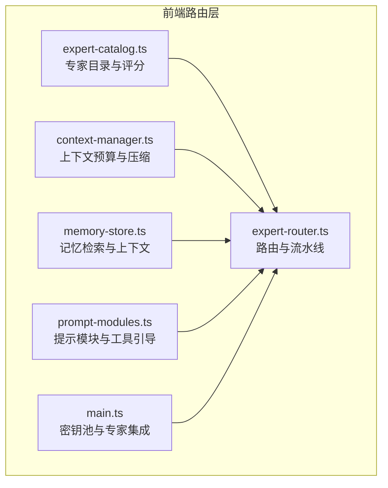

**图表来源**
- [expert-router.ts](file://ai-experts/src/expert-router.ts)
- [expert-catalog.ts](file://ai-experts/src/expert-catalog.ts)
- [context-manager.ts](file://ai-experts/src/context-manager.ts)
- [memory-store.ts](file://ai-experts/src/memory-store.ts)
- [prompt-modules.ts](file://ai-experts/src/prompt-modules.ts)
- [main.ts](file://ai-experts/src/main.ts)

**章节来源**
- [expert-router.ts](file://ai-experts/src/expert-router.ts)
- [expert-catalog.ts](file://ai-experts/src/expert-catalog.ts)
- [context-manager.ts](file://ai-experts/src/context-manager.ts)
- [memory-store.ts](file://ai-experts/src/memory-store.ts)
- [prompt-modules.ts](file://ai-experts/src/prompt-modules.ts)
- [main.ts](file://ai-experts/src/main.ts)

## 核心组件
- 专家激活评分与概率：基于关键词匹配与专家工具画像，计算专家与任务的匹配度与触发概率
- 默认锚点专家：针对不同场景的锚点专家集合，确保主责专家优先参与
- 候选专家筛选：综合概率阈值与上限，结合锚点优先策略，生成候选专家列表
- 任务级提示模块：按任务场景与关键词动态注入工具引导与工作流模块
- 上下文预算与压缩：Token预算估算、阈值触发与自动压缩，保障长对话稳定性
- 记忆检索与上下文：基于关键词与剩余预算的Token感知检索，提升上下文复用
- 令牌配额与主管介入：项目/用户级Token配额、豁免与阻断提示，主管可介入决策

**章节来源**
- [expert-catalog.ts](file://ai-experts/src/expert-catalog.ts)
- [expert-router.ts](file://ai-experts/src/expert-router.ts)
- [prompt-modules.ts](file://ai-experts/src/prompt-modules.ts)
- [context-manager.ts](file://ai-experts/src/context-manager.ts)
- [memory-store.ts](file://ai-experts/src/memory-store.ts)

## 架构总览
专家路由策略采用“任务描述解析 → 专家激活评分 → 锚点优先筛选 → 提示模块注入 → 上下文预算与记忆 → 令牌配额与主管介入 → 流水线执行”的闭环流程。

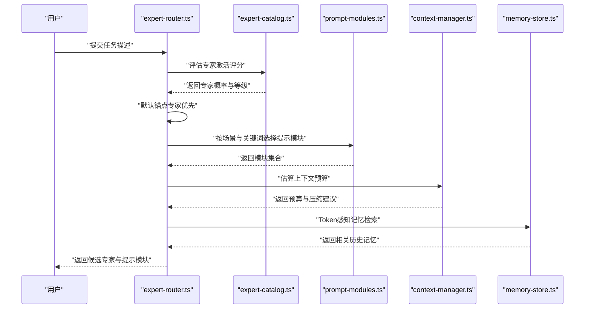

**图表来源**
- [expert-router.ts](file://ai-experts/src/expert-router.ts)
- [expert-catalog.ts](file://ai-experts/src/expert-catalog.ts)
- [prompt-modules.ts](file://ai-experts/src/prompt-modules.ts)
- [context-manager.ts](file://ai-experts/src/context-manager.ts)
- [memory-store.ts](file://ai-experts/src/memory-store.ts)

## 详细组件分析

### 专家激活评分与优先级排序
- 评分机制：关键词匹配权重 + 专家工具画像权重（工程/分析/文档/创意/审查）
- 概率映射：根据分数区间映射为高/中/低触发概率
- 排序策略：优先按触发概率降序，其次按分数降序
- 锚点优先：默认锚点专家优先加入候选，再补充高概率专家至上限

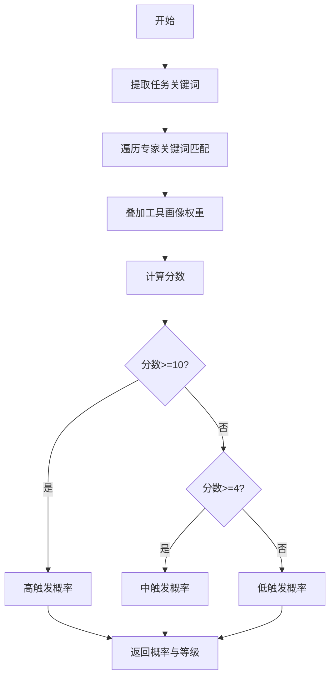

**图表来源**
- [expert-catalog.ts](file://ai-experts/src/expert-catalog.ts)

**章节来源**
- [expert-catalog.ts](file://ai-experts/src/expert-catalog.ts)

### 默认锚点专家与场景映射
- 场景到锚点：不同场景（如代码开发、代码审查、翻译、写作、数据分析、设计、文档处理、法律审查、技术研究等）映射到一组锚点专家
- 锚点扩展：根据任务关键词进一步扩展锚点（如代码开发可叠加系统架构/安全审查专家）

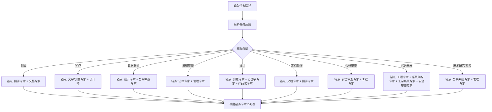

**图表来源**
- [expert-catalog.ts](file://ai-experts/src/expert-catalog.ts)

**章节来源**
- [expert-catalog.ts](file://ai-experts/src/expert-catalog.ts)

### 候选专家筛选与上限控制
- 生成候选：锚点专家优先，随后按概率阈值与分数排序补充
- 上限控制：默认上限为6，若无高概率专家则回退到锚点专家

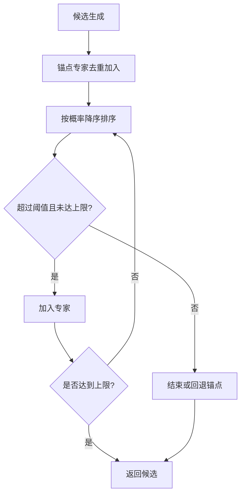

**图表来源**
- [expert-catalog.ts](file://ai-experts/src/expert-catalog.ts)

**章节来源**
- [expert-catalog.ts](file://ai-experts/src/expert-catalog.ts)

### 任务级提示模块与专家工具引导
- 模块选择：根据专家工具画像与任务场景动态选择模块（网络搜索、命令执行、文档工具、媒体工具、视频工作流、交付物落盘等）
- 关键词触发：通过关键词命中与否定模式过滤，避免误触发
- 模块注入：将模块文本拼接到专家基础提示中

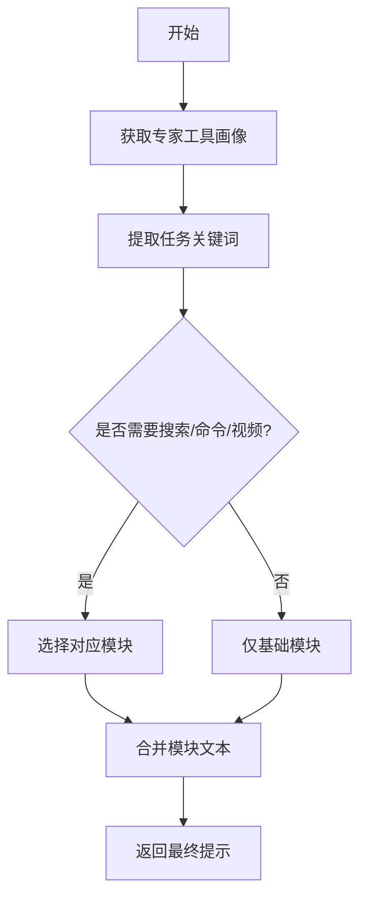

**图表来源**
- [prompt-modules.ts](file://ai-experts/src/prompt-modules.ts)

**章节来源**
- [prompt-modules.ts](file://ai-experts/src/prompt-modules.ts)

### 上下文预算与自动压缩
- 预算估算：中文、英文与代码的Token估算策略
- 触发压缩：超过阈值（预算×压缩阈值）时触发压缩
- 压缩策略：保留system消息、最近N轮对话、工具输出截断、早期assistant要点压缩

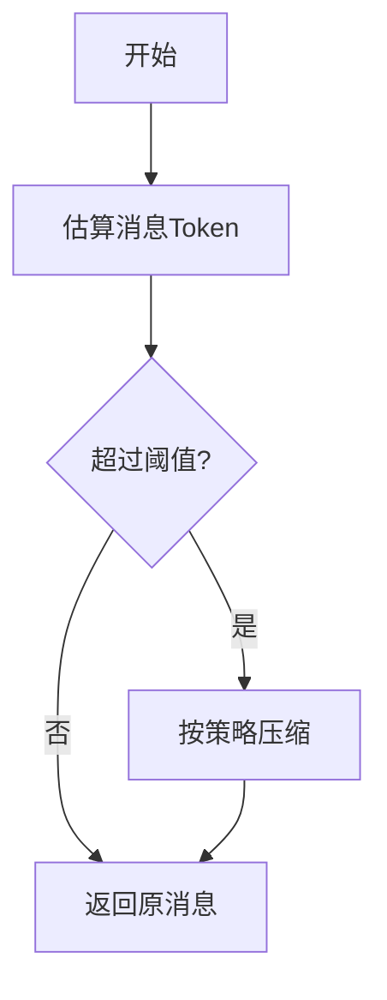

**图表来源**
- [context-manager.ts](file://ai-experts/src/context-manager.ts)

**章节来源**
- [context-manager.ts](file://ai-experts/src/context-manager.ts)

### 记忆检索与上下文组装（Token感知）
- 关键词提取：中英文混合分词与停用词过滤
- Token感知检索：根据剩余预算截断检索结果，避免超限
- 上下文组装：将检索到的历史记忆拼接到专家提示中

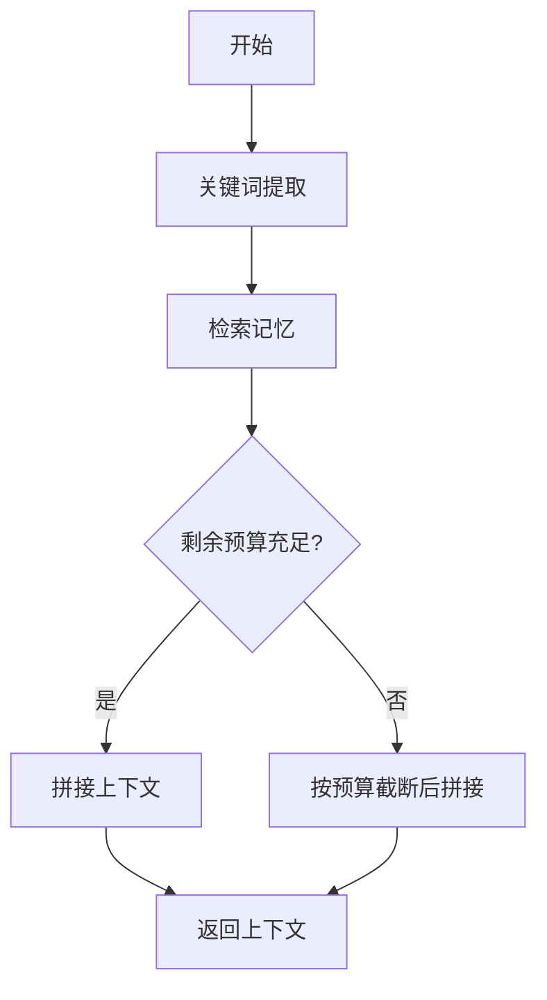

**图表来源**
- [memory-store.ts](file://ai-experts/src/memory-store.ts)

**章节来源**
- [memory-store.ts](file://ai-experts/src/memory-store.ts)

### 令牌配额与主管介入
- 令牌配额：项目级与用户级Token使用记录与限额
- 豁免机制：系统专家豁免配额限制
- 阻断提示：当配额不足时在对话区显示阻断消息
- 主管介入：主管可对流水线执行进行决策与干预

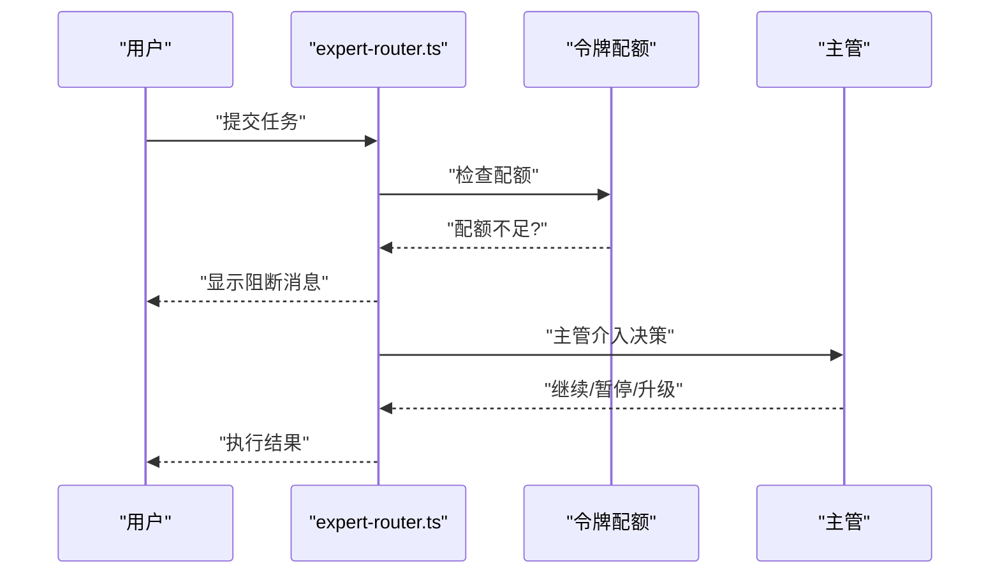

**图表来源**
- [expert-router.ts](file://ai-experts/src/expert-router.ts)

**章节来源**
- [expert-router.ts](file://ai-experts/src/expert-router.ts)

### 专家路由的完整流程（从任务到执行）
- 任务描述解析：推断场景与意图，选择提示模块
- 专家激活与筛选：评分、概率、锚点优先、上限控制
- 上下文与记忆：预算估算、压缩、记忆检索
- 令牌配额：检查限额、必要时阻断
- 流水线执行：按步骤并行/串行调度专家，主管监督与决策

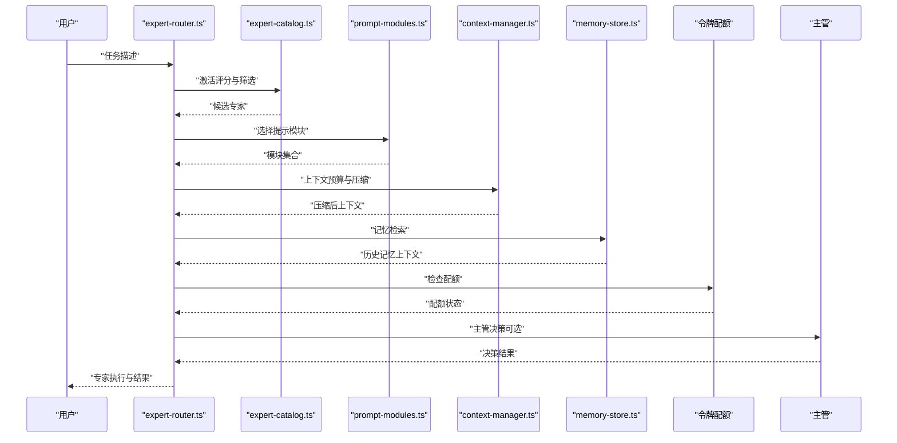

**图表来源**
- [expert-router.ts](file://ai-experts/src/expert-router.ts)
- [expert-catalog.ts](file://ai-experts/src/expert-catalog.ts)
- [prompt-modules.ts](file://ai-experts/src/prompt-modules.ts)
- [context-manager.ts](file://ai-experts/src/context-manager.ts)
- [memory-store.ts](file://ai-experts/src/memory-store.ts)

**章节来源**
- [expert-router.ts](file://ai-experts/src/expert-router.ts)
- [expert-catalog.ts](file://ai-experts/src/expert-catalog.ts)
- [prompt-modules.ts](file://ai-experts/src/prompt-modules.ts)
- [context-manager.ts](file://ai-experts/src/context-manager.ts)
- [memory-store.ts](file://ai-experts/src/memory-store.ts)

## 依赖分析
- expert-catalog.ts 为 expert-router.ts 的核心依赖，提供专家激活评分、默认锚点与场景映射
- prompt-modules.ts 为 expert-router.ts 的提示模块依赖，提供按需工具引导
- context-manager.ts 与 memory-store.ts 为 expert-router.ts 的上下文与记忆依赖，提供预算与历史上下文
- main.ts 为密钥池与专家集成入口，为专家路由提供API密钥与模型解析

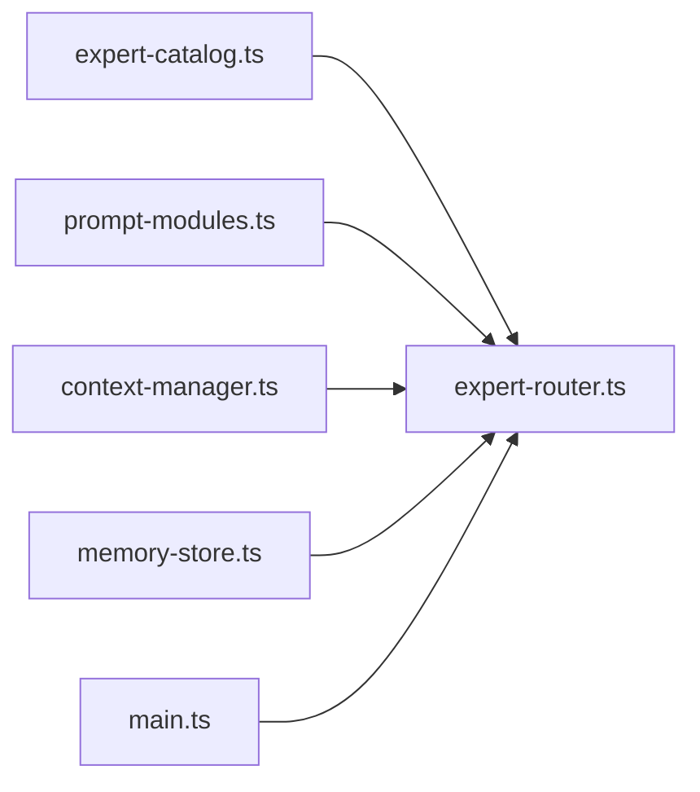

**图表来源**
- [expert-router.ts](file://ai-experts/src/expert-router.ts)
- [expert-catalog.ts](file://ai-experts/src/expert-catalog.ts)
- [prompt-modules.ts](file://ai-experts/src/prompt-modules.ts)
- [context-manager.ts](file://ai-experts/src/context-manager.ts)
- [memory-store.ts](file://ai-experts/src/memory-store.ts)
- [main.ts](file://ai-experts/src/main.ts)

**章节来源**
- [expert-router.ts](file://ai-experts/src/expert-router.ts)
- [expert-catalog.ts](file://ai-experts/src/expert-catalog.ts)
- [prompt-modules.ts](file://ai-experts/src/prompt-modules.ts)
- [context-manager.ts](file://ai-experts/src/context-manager.ts)
- [memory-store.ts](file://ai-experts/src/memory-store.ts)
- [main.ts](file://ai-experts/src/main.ts)

## 性能考量
- 评分与排序：O(N)专家遍历与一次排序，N为专家总数
- 候选筛选：锚点O(1) + 概率阈值过滤 + 排序，上限M，整体O(M log M)
- 上下文预算：消息Token估算O(L)，L为消息长度；压缩按轮次与片段处理
- 记忆检索：关键词提取O(T)，T为文本长度；检索与截断O(K)，K为检索条目数
- 令牌配额：读取与持久化为I/O，建议异步批量处理
- 建议优化：
  - 缓存专家激活评分结果（按任务关键词哈希）
  - 上下文压缩阈值与保留轮次可配置
  - 记忆检索按专家ID与任务描述双重过滤
  - 令牌配额状态本地缓存，定期刷新

[本节为通用性能指导，不直接分析具体文件]

## 故障排查指南
- 专家未被激活：检查任务关键词是否覆盖专家关键词；确认工具画像权重是否满足
- 候选专家不足：确认概率阈值与上限设置；检查锚点专家是否被正确加入
- 上下文超限：调整保留轮次与压缩阈值；启用Token感知检索
- 记忆检索异常：检查关键词提取与停用词过滤；确认检索结果按预算截断
- 令牌配额阻断：检查项目/用户配额；确认豁免专家ID；查看阻断消息
- 主管介入：确认主管API密钥与模型配置；检查决策回调

**章节来源**
- [expert-router.ts](file://ai-experts/src/expert-router.ts)
- [expert-catalog.ts](file://ai-experts/src/expert-catalog.ts)
- [context-manager.ts](file://ai-experts/src/context-manager.ts)
- [memory-store.ts](file://ai-experts/src/memory-store.ts)

## 结论
本专家路由策略通过“任务描述解析 + 专家激活评分 + 锚点优先 + 提示模块注入 + 上下文预算与记忆 + 令牌配额与主管介入”的闭环，实现了高匹配度、高可执行性的专家选择与调度。系统在保证专家职责清晰的同时，提供了灵活的场景适配、实时调整与主管干预能力，适合在复杂任务场景中稳定运行。

[本节为总结性内容，不直接分析具体文件]

## 附录

### 配置选项与自定义规则
- 专家激活阈值与概率映射：可按场景调整分数区间与概率阈值
- 候选上限：根据任务复杂度调整默认上限
- 上下文预算：可调整预算、压缩阈值、保留轮次与单片段最大Token
- 记忆检索：可调整关键词提取策略与检索上限
- 令牌配额：可调整项目/用户配额与豁免专家ID
- 提示模块：可按专家工具画像与任务场景自定义模块集合

**章节来源**
- [expert-catalog.ts](file://ai-experts/src/expert-catalog.ts)
- [context-manager.ts](file://ai-experts/src/context-manager.ts)
- [memory-store.ts](file://ai-experts/src/memory-store.ts)
- [prompt-modules.ts](file://ai-experts/src/prompt-modules.ts)
- [expert-router.ts](file://ai-experts/src/expert-router.ts)

### 实际使用场景示例
- 代码开发：默认锚点工程专家 + 系统架构专家 + 安全审查专家；启用网络搜索与命令执行模块
- 代码审查：默认锚点安全/法律审查专家；启用交付物落盘模块
- 翻译与写作：默认锚点翻译/创意专家；启用文档工具模块
- 数据分析：默认锚点统计专家 + 复杂系统专家；启用命令执行模块
- 设计与媒体：默认锚点创意专家 + 心理学专家 + 产品化专家；启用视频工作流模块

**章节来源**
- [expert-catalog.ts](file://ai-experts/src/expert-catalog.ts)
- [prompt-modules.ts](file://ai-experts/src/prompt-modules.ts)

### 路由效果评估方法
- 专家命中率：统计任务描述与专家关键词的匹配次数
- 专家满意度：通过专家输出质量与任务完成度评估
- 流水线效率：统计每步专家执行时间与错误率
- 令牌消耗：统计项目/用户级Token使用与配额使用率
- 记忆复用：统计历史记忆检索命中与上下文压缩比例

**章节来源**
- [task-tracker.ts](file://ai-experts/src/task-tracker.ts)
- [expert-router.ts](file://ai-experts/src/expert-router.ts)
- [memory-store.ts](file://ai-experts/src/memory-store.ts)