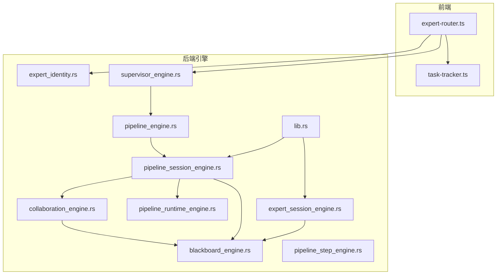
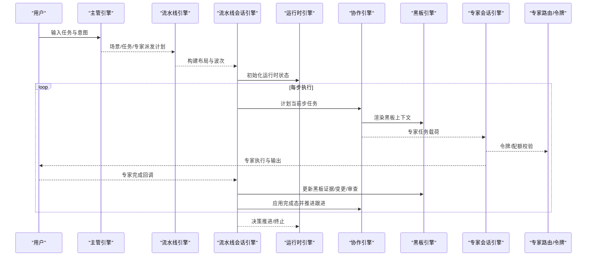
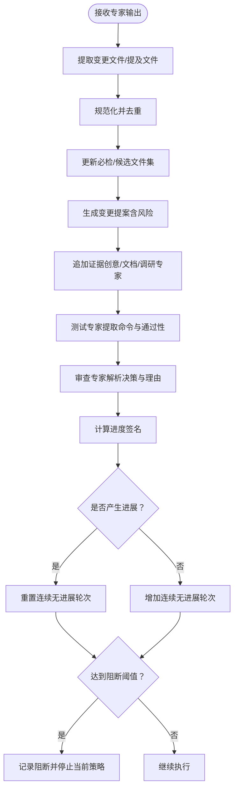
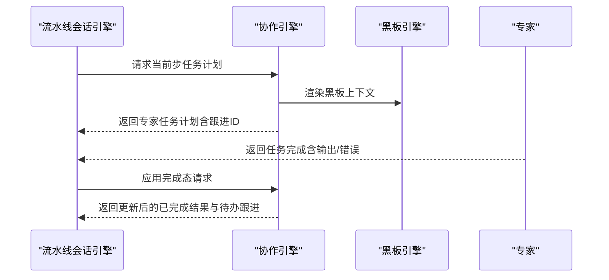
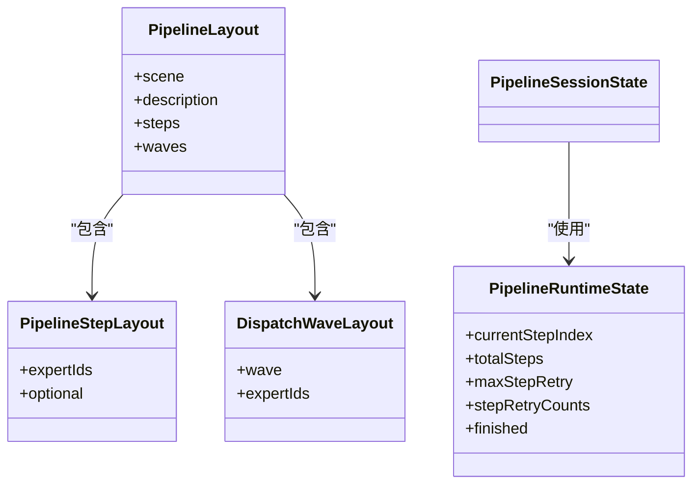
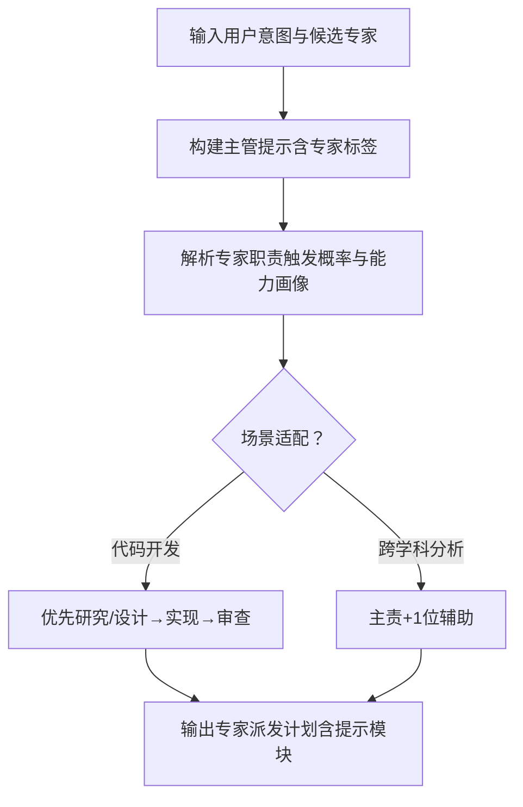
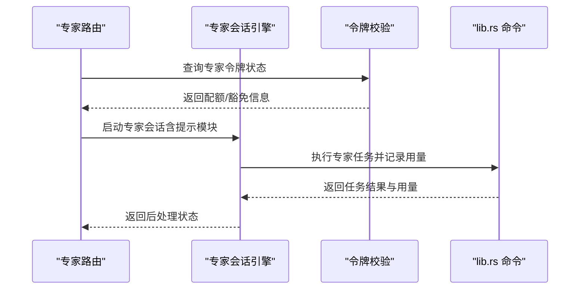
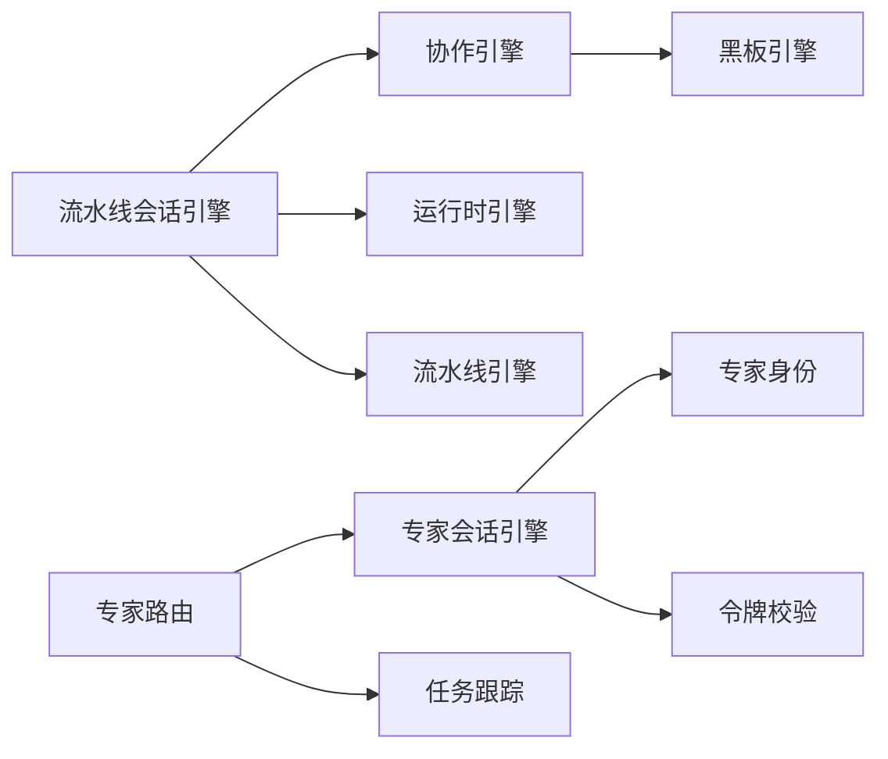

# 专家协调

<cite>
**本文引用的文件**
- [blackboard_engine.rs](file://ai-experts/src-tauri/src/blackboard_engine.rs)
- [collaboration_engine.rs](file://ai-experts/src-tauri/src/collaboration_engine.rs)
- [pipeline_session_engine.rs](file://ai-experts/src-tauri/src/pipeline_session_engine.rs)
- [pipeline_engine.rs](file://ai-experts/src-tauri/src/pipeline_engine.rs)
- [pipeline_runtime_engine.rs](file://ai-experts/src-tauri/src/pipeline_runtime_engine.rs)
- [pipeline_step_engine.rs](file://ai-experts/src-tauri/src/pipeline_step_engine.rs)
- [expert_identity.rs](file://ai-experts/src-tauri/src/expert_identity.rs)
- [expert_session_engine.rs](file://ai-experts/src-tauri/src/expert_session_engine.rs)
- [task-tracker.ts](file://ai-experts/src/task-tracker.ts)
- [expert-router.ts](file://ai-experts/src/expert-router.ts)
- [lib.rs](file://ai-experts/src-tauri/src/lib.rs)
- [supervisor_engine.rs](file://ai-experts/src-tauri/src/supervisor_engine.rs)
</cite>

## 目录
1. [简介](#简介)
2. [项目结构](#项目结构)
3. [核心组件](#核心组件)
4. [架构总览](#架构总览)
5. [详细组件分析](#详细组件分析)
6. [依赖关系分析](#依赖关系分析)
7. [性能考量](#性能考量)
8. [故障排查指南](#故障排查指南)
9. [结论](#结论)
10. [附录](#附录)

## 简介
本文件面向“星图专家团工作台”的专家协调功能，系统化解析专家调度算法、资源分配优化与冲突解决机制，阐述黑板引擎如何协调多专家协作（任务分配、资源共享与冲突处理），并给出数据结构设计、通信与同步策略、一致性保障、与任务跟踪系统的集成方式，以及能力匹配与负载均衡实践。

## 项目结构
- 后端 Rust 引擎层负责专家调度、流水线编排、黑板状态维护与任务完成态合并。
- 前端 TypeScript 层负责专家路由、令牌配额与用量、任务跟踪与交付清单渲染。
- 关键模块：
  - 黑板引擎：维护共享上下文、证据、变更提案、验证与审查决策、阻断项与进度签名。
  - 协作引擎：基于黑板与待办跟进，生成专家任务载荷，推进完成态与跟进轮次。
  - 流水线引擎：根据场景与专家类别构建步骤布局与波次，驱动执行轮次。
  - 会话与运行时：启动专家会话、推进运行时状态、处理工具与提示模块。
  - 令牌与配额：前端侧令牌仪表盘与后端侧配额校验，保障资源使用可控。

**图表来源**
- [expert-router.ts:1-200](file://ai-experts/src/expert-router.ts#L1-L200)
- [task-tracker.ts:1-200](file://ai-experts/src/task-tracker.ts#L1-L200)
- [blackboard_engine.rs:1-670](file://ai-experts/src-tauri/src/blackboard_engine.rs#L1-L670)
- [collaboration_engine.rs:1-435](file://ai-experts/src-tauri/src/collaboration_engine.rs#L1-L435)
- [pipeline_engine.rs:1-200](file://ai-experts/src-tauri/src/pipeline_engine.rs#L1-L200)
- [pipeline_session_engine.rs:1-111](file://ai-experts/src-tauri/src/pipeline_session_engine.rs#L1-L111)
- [pipeline_runtime_engine.rs:1-47](file://ai-experts/src-tauri/src/pipeline_runtime_engine.rs#L1-L47)
- [pipeline_step_engine.rs:244-276](file://ai-experts/src-tauri/src/pipeline_step_engine.rs#L244-L276)
- [expert_identity.rs:1-64](file://ai-experts/src-tauri/src/expert_identity.rs#L1-L64)
- [expert_session_engine.rs:1-38](file://ai-experts/src-tauri/src/expert_session_engine.rs#L1-L38)
- [supervisor_engine.rs:1-200](file://ai-experts/src-tauri/src/supervisor_engine.rs#L1-L200)
- [lib.rs:1386-1419](file://ai-experts/src-tauri/src/lib.rs#L1386-L1419)

**章节来源**
- [expert-router.ts:1-200](file://ai-experts/src/expert-router.ts#L1-L200)
- [task-tracker.ts:1-200](file://ai-experts/src/task-tracker.ts#L1-L200)
- [lib.rs:1386-1419](file://ai-experts/src-tauri/src/lib.rs#L1386-L1419)

## 核心组件
- 黑板任务（BlackboardTask）：统一承载任务目标、工作区快照、证据、假设、问题、变更提案、验证运行、审查决策、阻断项、进度轮次与进度签名，作为所有专家协作的单一事实来源。
- 专家任务构建（ExpertTaskBuildRequest/Response）：将当前步骤专家集合、待办跟进、黑板上下文整合为专家任务载荷，支持“仅当前轮次”与“全量”两种投递模式。
- 任务完成态推进（apply_task_completion_state）：合并专家输出，消费已使用的跟进项，维护已完成结果与待办跟进列表。
- 跟进轮次计划（plan_step_followup_round）：针对当前轮次内可投递的跟进项，生成专家任务计划，避免跨轮次误投。
- 流水线布局与波次（PipelineLayout/DispatchWaveLayout）：按场景自动拆分研究、设计、实现、审查等步骤，支持可选专家与波次调度。
- 运行时状态（PipelineRuntimeState）：记录当前步骤索引、总步数、最大重试次数、每步重试计数、完成态，用于推进/回退/终止决策。
- 专家身份与能力（expert_identity）：专家 ID 规范化、专家类别识别（审查、创意、文档、工程等）、支持源读写/重写能力判定。
- 专家会话（StartExpertSessionRequest）：封装专家执行所需的系统提示、场景、任务描述、历史结果、模型与项目上下文。
- 令牌与配额（expert-router.ts + lib.rs 的令牌接口）：前端构建令牌仪表盘，后端进行配额校验与豁免控制。

**章节来源**
- [blackboard_engine.rs:48-130](file://ai-experts/src-tauri/src/blackboard_engine.rs#L48-L130)
- [collaboration_engine.rs:25-106](file://ai-experts/src-tauri/src/collaboration_engine.rs#L25-L106)
- [collaboration_engine.rs:172-214](file://ai-experts/src-tauri/src/collaboration_engine.rs#L172-L214)
- [collaboration_engine.rs:216-261](file://ai-experts/src-tauri/src/collaboration_engine.rs#L216-L261)
- [pipeline_engine.rs:27-34](file://ai-experts/src-tauri/src/pipeline_engine.rs#L27-L34)
- [pipeline_runtime_engine.rs:4-12](file://ai-experts/src-tauri/src/pipeline_runtime_engine.rs#L4-L12)
- [expert_identity.rs:1-64](file://ai-experts/src-tauri/src/expert_identity.rs#L1-L64)
- [expert_session_engine.rs:12-37](file://ai-experts/src-tauri/src/expert_session_engine.rs#L12-L37)
- [expert-router.ts:34-82](file://ai-experts/src/expert-router.ts#L34-L82)
- [lib.rs:205-270](file://ai-experts/src-tauri/src/lib.rs#L205-L270)

## 架构总览
专家协调以“主管-流水线-黑板-专家”的分层架构运行：
- 主管（Supervisor）解析用户意图，生成场景、任务描述与专家派发计划。
- 流水线引擎根据场景与专家类别构建步骤布局与波次，驱动执行轮次。
- 黑板引擎维护共享上下文，专家输出被归档为证据、变更提案、验证与审查决策，形成进度签名与阻断项。
- 协作引擎将黑板与跟进项注入专家任务载荷，推进完成态与跟进轮次。
- 专家会话引擎启动专家执行，结合令牌与配额控制资源消耗。
- 任务跟踪与交付清单在前端渲染，后端提供生成与持久化接口。

**图表来源**
- [supervisor_engine.rs:108-116](file://ai-experts/src-tauri/src/supervisor_engine.rs#L108-L116)
- [pipeline_engine.rs:107-188](file://ai-experts/src-tauri/src/pipeline_engine.rs#L107-L188)
- [pipeline_session_engine.rs:1-111](file://ai-experts/src-tauri/src/pipeline_session_engine.rs#L1-L111)
- [pipeline_runtime_engine.rs:39-47](file://ai-experts/src-tauri/src/pipeline_runtime_engine.rs#L39-L47)
- [collaboration_engine.rs:263-295](file://ai-experts/src-tauri/src/collaboration_engine.rs#L263-L295)
- [blackboard_engine.rs:132-280](file://ai-experts/src-tauri/src/blackboard_engine.rs#L132-L280)
- [expert_session_engine.rs:12-37](file://ai-experts/src-tauri/src/expert_session_engine.rs#L12-L37)
- [expert-router.ts:34-82](file://ai-experts/src/expert-router.ts#L34-L82)

## 详细组件分析

### 黑板引擎：共享上下文与进度治理
- 数据结构要点
  - BlackboardTask：包含目标、工作区文件/根目录、必检/候选文件集、证据、假设、问题、变更提案、验证运行、审查决策、阻断项、连续无进展轮次、进度签名。
  - 证据抽取与文件解析：从专家输出中提取变更文件、提及文件，解析规范化路径，去重并纳入必检清单。
  - 变更提案与风险：依据输出中的动作标记推断风险等级，区分高/中风险，推动“待执行动作”与“已执行动作”的区分。
  - 审查与验证：测试专家输出提取命令与通过性，审查专家输出解析决策与理由，形成阻断项。
  - 进度推进与阻断：基于进度签名（证据/变更/验证/审查计数拼接）判断是否产生进展，连续无进展超过阈值则阻断并记录。
  - 上下文渲染：将黑板内容结构化为专家可读的协作规则与提示，强调“证据优先、动作优先、文件名一致性”。

**图表来源**
- [blackboard_engine.rs:132-280](file://ai-experts/src-tauri/src/blackboard_engine.rs#L132-L280)
- [blackboard_engine.rs:282-333](file://ai-experts/src-tauri/src/blackboard_engine.rs#L282-L333)
- [blackboard_engine.rs:335-447](file://ai-experts/src-tauri/src/blackboard_engine.rs#L335-L447)

**章节来源**
- [blackboard_engine.rs:48-130](file://ai-experts/src-tauri/src/blackboard_engine.rs#L48-L130)
- [blackboard_engine.rs:132-280](file://ai-experts/src-tauri/src/blackboard_engine.rs#L132-L280)
- [blackboard_engine.rs:282-333](file://ai-experts/src-tauri/src/blackboard_engine.rs#L282-L333)
- [blackboard_engine.rs:335-447](file://ai-experts/src-tauri/src/blackboard_engine.rs#L335-L447)

### 协作引擎：任务构建、完成态与跟进轮次
- 专家任务构建
  - 根据专家 ID、当前步专家集合、待办跟进与黑板上下文，生成专家任务文本与关联的跟进 ID 列表。
  - 支持“仅当前轮次”过滤，避免跨轮次误投。
- 任务完成态推进
  - 合并专家输出至已完成结果，消费已使用的跟进项，确保每个跟进项只被一位专家消费。
- 跟进轮次计划
  - 针对当前步专家集合，筛选可投递的跟进项，生成专家任务计划，避免“下一相关轮次”误投。

**图表来源**
- [collaboration_engine.rs:263-295](file://ai-experts/src-tauri/src/collaboration_engine.rs#L263-L295)
- [collaboration_engine.rs:172-214](file://ai-experts/src-tauri/src/collaboration_engine.rs#L172-L214)
- [collaboration_engine.rs:216-261](file://ai-experts/src-tauri/src/collaboration_engine.rs#L216-L261)
- [pipeline_session_engine.rs:216-251](file://ai-experts/src-tauri/src/pipeline_session_engine.rs#L216-L251)

**章节来源**
- [collaboration_engine.rs:25-106](file://ai-experts/src-tauri/src/collaboration_engine.rs#L25-L106)
- [collaboration_engine.rs:172-214](file://ai-experts/src-tauri/src/collaboration_engine.rs#L172-L214)
- [collaboration_engine.rs:216-261](file://ai-experts/src-tauri/src/collaboration_engine.rs#L216-L261)
- [pipeline_session_engine.rs:216-251](file://ai-experts/src-tauri/src/pipeline_session_engine.rs#L216-L251)

### 流水线引擎与会话：步骤布局、波次与执行轮次
- 步骤布局
  - 根据场景与专家类别自动拆分：研究、设计、实现、审查等步骤，支持可选专家与去重。
  - 针对“代码开发”场景，优先组织研究/设计→实现→审查的顺序。
- 会话状态
  - PipelineSessionState 维护流水线 ID、场景、任务描述、步骤布局、运行时状态、黑板、已完成结果、待办跟进、任务历史。
- 运行时推进
  - PipelineRuntimeState 记录当前步索引、总步数、最大重试次数、每步重试计数与完成态，用于推进/回退/终止决策。

**图表来源**
- [pipeline_engine.rs:27-34](file://ai-experts/src-tauri/src/pipeline_engine.rs#L27-L34)
- [pipeline_runtime_engine.rs:4-12](file://ai-experts/src-tauri/src/pipeline_runtime_engine.rs#L4-L12)
- [pipeline_session_engine.rs:15-27](file://ai-experts/src-tauri/src/pipeline_session_engine.rs#L15-L27)

**章节来源**
- [pipeline_engine.rs:107-188](file://ai-experts/src-tauri/src/pipeline_engine.rs#L107-L188)
- [pipeline_session_engine.rs:15-27](file://ai-experts/src-tauri/src/pipeline_session_engine.rs#L15-L27)
- [pipeline_runtime_engine.rs:39-47](file://ai-experts/src-tauri/src/pipeline_runtime_engine.rs#L39-L47)

### 专家身份与能力：匹配与负载均衡
- 专家 ID 规范化与类别识别：审查、创意、文档、工程等类别，支持源读写/重写能力判定。
- 负载均衡策略
  - 专家派发克制：通常不超过 1–3 位专家，跨学科时再适度增加。
  - 职责触发概率优先：高触发概率主责专家优先，避免低概率专家越责主导。
  - 场景适配：代码开发优先使用 code-development，跨学科分析先主责后辅责。

**图表来源**
- [supervisor_engine.rs:118-175](file://ai-experts/src-tauri/src/supervisor_engine.rs#L118-L175)
- [expert_identity.rs:24-63](file://ai-experts/src-tauri/src/expert_identity.rs#L24-L63)

**章节来源**
- [supervisor_engine.rs:118-175](file://ai-experts/src-tauri/src/supervisor_engine.rs#L118-L175)
- [expert_identity.rs:24-63](file://ai-experts/src-tauri/src/expert_identity.rs#L24-L63)

### 专家会话与令牌配额：执行与资源控制
- 专家会话
  - StartExpertSessionRequest 封装专家执行所需上下文（系统提示、场景、任务描述、历史结果、模型、项目路径、提示模块）。
- 令牌与配额
  - 前端构建令牌仪表盘，后端进行配额校验与豁免控制（主管专家豁免、专家额度分配）。
  - 令牌记录持久化与时间范围统计，支持日/月/年维度的使用趋势与专家分布。

**图表来源**
- [expert_session_engine.rs:12-37](file://ai-experts/src-tauri/src/expert_session_engine.rs#L12-L37)
- [expert-router.ts:34-82](file://ai-experts/src/expert-router.ts#L34-L82)
- [lib.rs:205-270](file://ai-experts/src-tauri/src/lib.rs#L205-L270)

**章节来源**
- [expert_session_engine.rs:12-37](file://ai-experts/src-tauri/src/expert_session_engine.rs#L12-L37)
- [expert-router.ts:34-82](file://ai-experts/src/expert-router.ts#L34-L82)
- [lib.rs:205-270](file://ai-experts/src-tauri/src/lib.rs#L205-L270)

### 任务跟踪与交付清单：前端集成与渲染
- 交付清单 API：生成并保存交付清单，支持加载与列举。
- 渲染逻辑：统计代码变更（创建/修改/删除）、审查意见（严重/警告/建议）、测试建议，按专家贡献聚合令牌用量与响应时间。
- 与后端集成：通过 Tauri 命令调用后端生成/列举接口，返回 JSON 并在前端渲染。

**章节来源**
- [task-tracker.ts:1-200](file://ai-experts/src/task-tracker.ts#L1-L200)
- [lib.rs:5878-5903](file://ai-experts/src-tauri/src/lib.rs#L5878-L5903)

## 依赖关系分析
- 组件耦合
  - 流水线会话引擎依赖协作引擎与黑板引擎，负责状态推进与完成态合并。
  - 协作引擎依赖黑板引擎渲染上下文，生成专家任务载荷。
  - 专家会话引擎依赖专家身份与令牌系统，确保能力匹配与资源控制。
- 外部依赖
  - 前端通过 Tauri 命令与后端交互，令牌与交付清单均通过命令桥接。
- 循环依赖
  - 各引擎模块间采用单向依赖（会话→协作→黑板），未见循环依赖迹象。

**图表来源**
- [pipeline_session_engine.rs:1-111](file://ai-experts/src-tauri/src/pipeline_session_engine.rs#L1-L111)
- [collaboration_engine.rs:1-435](file://ai-experts/src-tauri/src/collaboration_engine.rs#L1-L435)
- [blackboard_engine.rs:1-670](file://ai-experts/src-tauri/src/blackboard_engine.rs#L1-L670)
- [pipeline_runtime_engine.rs:1-47](file://ai-experts/src-tauri/src/pipeline_runtime_engine.rs#L1-L47)
- [pipeline_engine.rs:1-200](file://ai-experts/src-tauri/src/pipeline_engine.rs#L1-L200)
- [expert_session_engine.rs:1-38](file://ai-experts/src-tauri/src/expert_session_engine.rs#L1-L38)
- [expert_identity.rs:1-64](file://ai-experts/src-tauri/src/expert_identity.rs#L1-L64)
- [expert-router.ts:1-200](file://ai-experts/src/expert-router.ts#L1-L200)
- [task-tracker.ts:1-200](file://ai-experts/src/task-tracker.ts#L1-L200)

**章节来源**
- [pipeline_session_engine.rs:1-111](file://ai-experts/src-tauri/src/pipeline_session_engine.rs#L1-L111)
- [collaboration_engine.rs:1-435](file://ai-experts/src-tauri/src/collaboration_engine.rs#L1-L435)
- [blackboard_engine.rs:1-670](file://ai-experts/src-tauri/src/blackboard_engine.rs#L1-L670)
- [expert_router.rs:1-200](file://ai-experts/src/expert-router.ts#L1-L200)

## 性能考量
- 黑板上下文渲染与进度签名计算为 O(N) 级别（N 为证据/变更/验证/审查项数量），在高频专家输出场景下建议：
  - 缓存黑板上下文片段，仅在必要时重建。
  - 控制证据/变更/验证/审查列表长度上限，避免过度膨胀。
- 令牌校验与配额查询建议：
  - 前端本地缓存专家令牌额度与最近使用记录，减少后端调用频率。
  - 对批量专家任务进行并发限制，避免瞬时令牌峰值。
- 任务完成态合并：
  - 使用哈希表快速定位专家已完成结果，降低合并复杂度。
- 流水线推进：
  - 运行时状态采用轻量结构，重试计数与步进决策尽量避免深度拷贝。

## 故障排查指南
- 专家输出未进入黑板
  - 检查专家输出是否包含标准动作标记（如文件变更动作），若无则不会生成变更提案。
  - 确认文件路径是否可规范化与解析，避免大小写/斜杠差异导致的解析失败。
- 连续无进展阻断
  - 查看黑板进度签名是否变化，确认证据/变更/验证/审查是否有实质性推进。
  - 检查阻断消息是否被记录，必要时调整任务方向或引入新证据。
- 跟进项未被消费
  - 确认 apply_task_completion_state 是否正确更新 consumed_by 列表。
  - 检查 delivery_mode 与 target_expert_ids 是否匹配当前轮次专家集合。
- 令牌配额阻断
  - 检查专家令牌额度与重置周期，确认是否触发豁免（主管专家）。
  - 查看前端配额阻断消息提示，定位具体原因。

**章节来源**
- [blackboard_engine.rs:282-333](file://ai-experts/src-tauri/src/blackboard_engine.rs#L282-L333)
- [collaboration_engine.rs:172-214](file://ai-experts/src-tauri/src/collaboration_engine.rs#L172-L214)
- [expert-router.ts:84-104](file://ai-experts/src/expert-router.ts#L84-L104)

## 结论
本系统通过“主管-流水线-黑板-专家”的协同架构，实现了专家调度、资源分配与冲突解决的闭环：黑板作为单一事实来源，协作引擎负责任务构建与完成态推进，流水线引擎按场景与专家类别自动拆分步骤与波次，令牌与配额保障资源可控。该设计在复杂项目中具备良好的扩展性与稳定性，适合大规模专家协作与持续交付。

## 附录
- 实际应用场景
  - 复杂项目：研究→设计→实现→审查的完整闭环，利用黑板上下文与进度签名避免空转。
  - 能力匹配：依据专家类别与职责触发概率，优先主责专家，辅以跨学科专家。
  - 负载均衡：控制专家数量与轮次，避免过度并行导致资源瓶颈。
- 与任务跟踪系统集成
  - 前端通过任务跟踪 API 生成/加载交付清单，后端提供持久化与列举接口，实现可视化交付与审计。