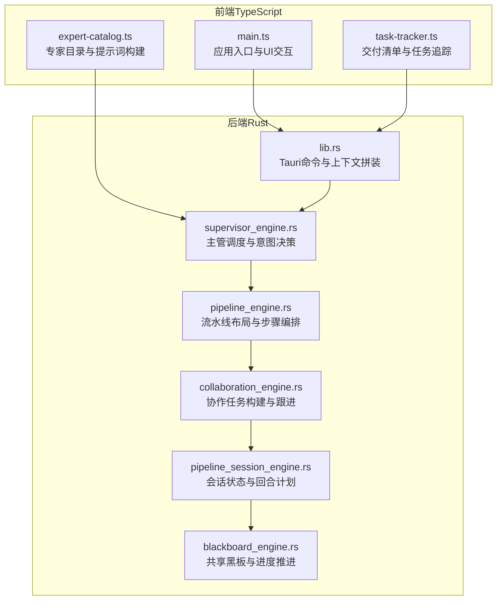
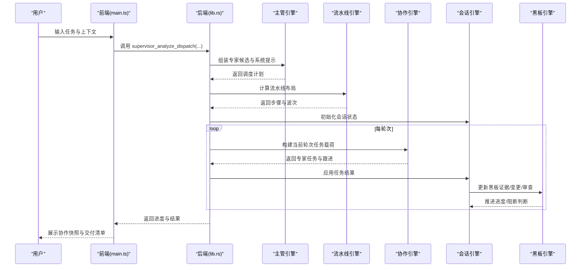
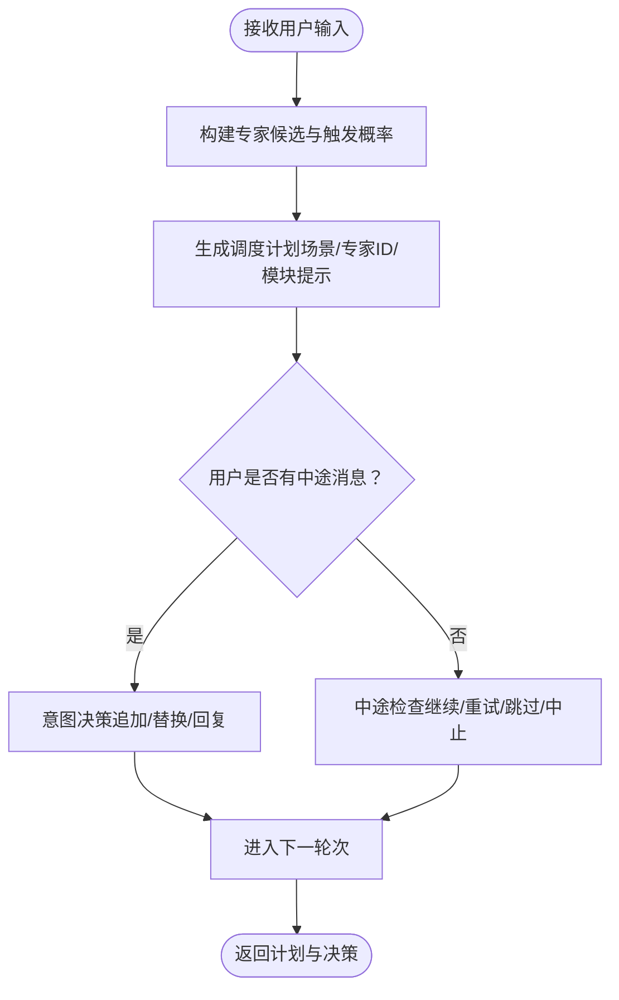
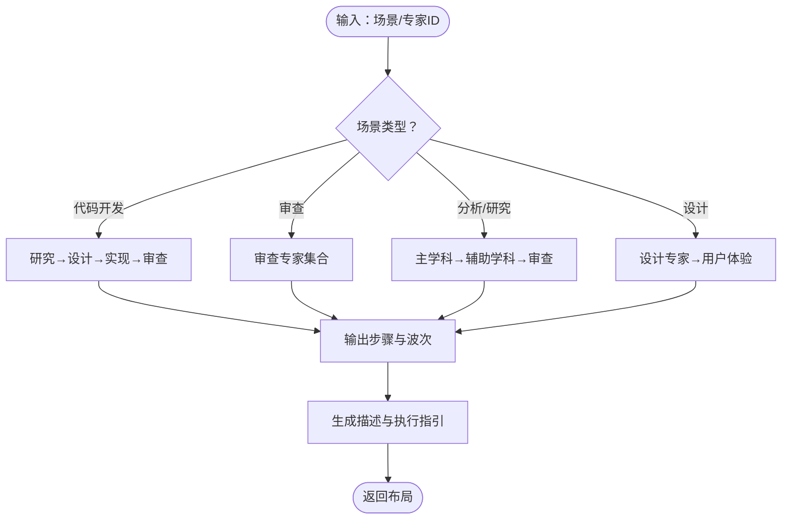
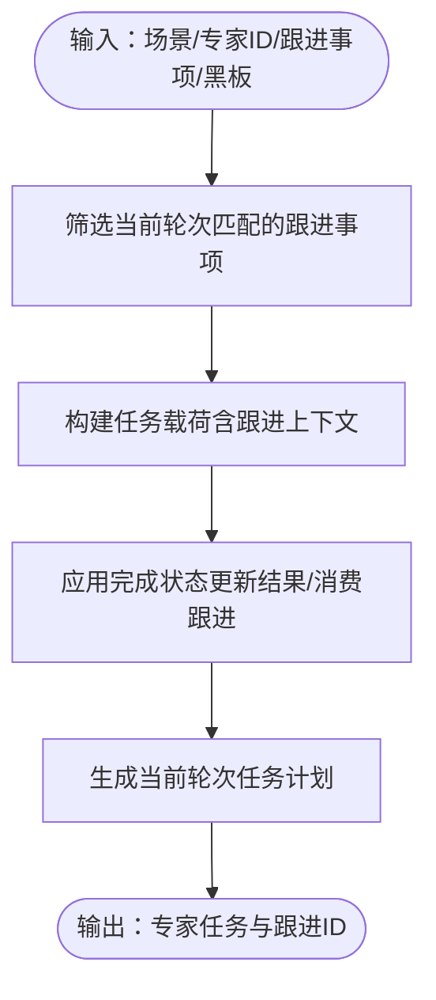
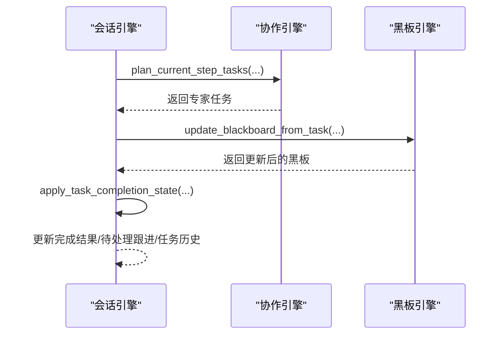
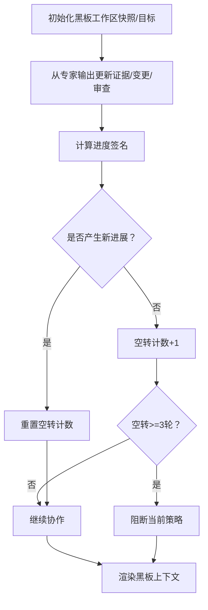
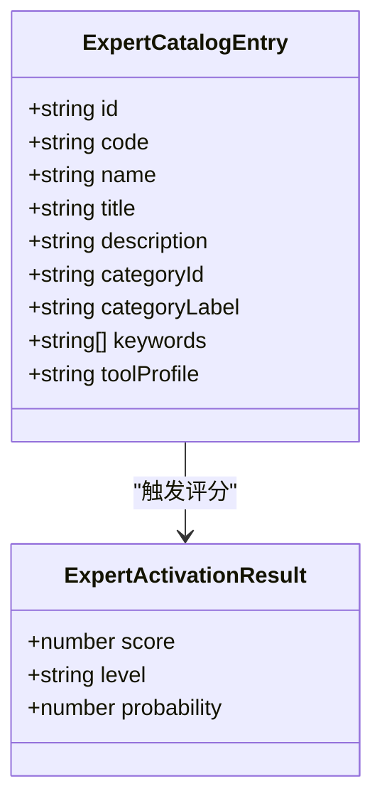
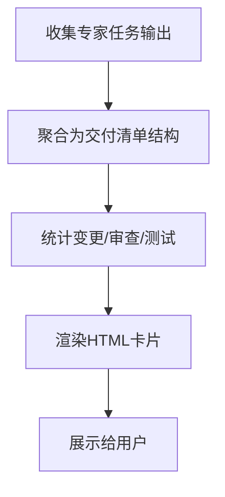
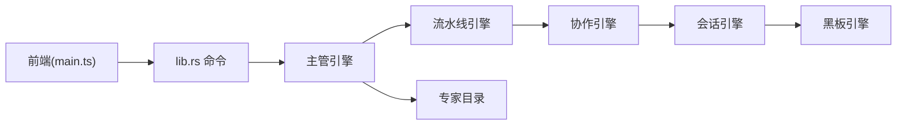

# 协作引擎

<cite>
**本文档引用的文件**
- [main.ts](file://ai-experts/src/main.ts)
- [lib.rs](file://ai-experts/src-tauri/src/lib.rs)
- [collaboration_engine.rs](file://ai-experts/src-tauri/src/collaboration_engine.rs)
- [supervisor_engine.rs](file://ai-experts/src-tauri/src/supervisor_engine.rs)
- [pipeline_engine.rs](file://ai-experts/src-tauri/src/pipeline_engine.rs)
- [blackboard_engine.rs](file://ai-experts/src-tauri/src/blackboard_engine.rs)
- [pipeline_session_engine.rs](file://ai-experts/src-tauri/src/pipeline_session_engine.rs)
- [expert-catalog.ts](file://ai-experts/src/expert-catalog.ts)
- [task-tracker.ts](file://ai-experts/src/task-tracker.ts)
</cite>

## 目录
1. [简介](#简介)
2. [项目结构](#项目结构)
3. [核心组件](#核心组件)
4. [架构总览](#架构总览)
5. [详细组件分析](#详细组件分析)
6. [依赖关系分析](#依赖关系分析)
7. [性能考量](#性能考量)
8. [故障排查指南](#故障排查指南)
9. [结论](#结论)
10. [附录](#附录)

## 简介
本文件面向“星图专家团工作台”的协作引擎，系统性阐述团队协作机制、知识共享与专家协调等核心功能。文档聚焦以下方面：
- 多专家协调、任务分配策略与进度跟踪
- 知识传播机制、社交互动与共享权限控制
- 专家调度算法、资源分配优化与冲突解决机制
- 扩展接口、自定义协调策略与性能优化方案
- 实际协作场景案例与最佳实践
- 协作引擎与专家系统、工具系统的集成方式

## 项目结构
协作引擎由前端 TypeScript 与后端 Rust 双栈构成，前后端通过 Tauri 命令桥接。前端负责 UI、交互与部分上下文拼装，后端负责专家调度、流水线编排、黑板与进度跟踪等核心逻辑。

**图表来源**
- [main.ts:1-800](file://ai-experts/src/main.ts#L1-L800)
- [lib.rs:1-800](file://ai-experts/src-tauri/src/lib.rs#L1-L800)
- [supervisor_engine.rs:1-982](file://ai-experts/src-tauri/src/supervisor_engine.rs#L1-L982)
- [pipeline_engine.rs:1-600](file://ai-experts/src-tauri/src/pipeline_engine.rs#L1-L600)
- [collaboration_engine.rs:1-435](file://ai-experts/src-tauri/src/collaboration_engine.rs#L1-L435)
- [pipeline_session_engine.rs:1-593](file://ai-experts/src-tauri/src/pipeline_session_engine.rs#L1-L593)
- [blackboard_engine.rs:1-670](file://ai-experts/src-tauri/src/blackboard_engine.rs#L1-L670)
- [expert-catalog.ts:1-657](file://ai-experts/src/expert-catalog.ts#L1-L657)
- [task-tracker.ts:1-208](file://ai-experts/src/task-tracker.ts#L1-L208)

**章节来源**
- [main.ts:1-800](file://ai-experts/src/main.ts#L1-L800)
- [lib.rs:1-800](file://ai-experts/src-tauri/src/lib.rs#L1-L800)

## 核心组件
- 主管引擎（Supervisor Engine）：负责接收用户输入，构建专家候选列表，输出场景化调度计划与意图决策，驱动后续流水线。
- 流水线引擎（Pipeline Engine）：将场景化的任务拆解为若干步骤与波次，形成可执行的流水线布局。
- 协作引擎（Collaboration Engine）：针对当前轮次与专家，构建任务载荷、合并跟进事项、更新完成状态。
- 会话引擎（Pipeline Session Engine）：维护流水线会话状态、当前轮次计划、任务历史与黑板状态。
- 黑板引擎（Blackboard Engine）：汇聚证据、文件变更、测试与审查决策，推进协作进度并阻断空转。
- 专家目录（Expert Catalog）：提供专家能力画像、职责触发概率、系统提示词模板与默认专家映射。
- 任务追踪（Task Tracker）：生成与渲染交付清单，汇总代码变更、审查意见与测试建议。

**章节来源**
- [supervisor_engine.rs:1-982](file://ai-experts/src-tauri/src/supervisor_engine.rs#L1-L982)
- [pipeline_engine.rs:1-600](file://ai-experts/src-tauri/src/pipeline_engine.rs#L1-L600)
- [collaboration_engine.rs:1-435](file://ai-experts/src-tauri/src/collaboration_engine.rs#L1-L435)
- [pipeline_session_engine.rs:1-593](file://ai-experts/src-tauri/src/pipeline_session_engine.rs#L1-L593)
- [blackboard_engine.rs:1-670](file://ai-experts/src-tauri/src/blackboard_engine.rs#L1-L670)
- [expert-catalog.ts:1-657](file://ai-experts/src/expert-catalog.ts#L1-L657)
- [task-tracker.ts:1-208](file://ai-experts/src/task-tracker.ts#L1-L208)

## 架构总览
协作引擎采用“主管-流水线-专家”的三层协作架构：
- 主管层：解析用户意图、构建专家候选、输出场景化任务与专家组合。
- 流水线层：将任务拆解为步骤与波次，限定执行顺序与并行度。
- 专家层：在每轮次内按专家职责与黑板上下文执行任务，产出证据与变更。

**图表来源**
- [lib.rs:732-788](file://ai-experts/src-tauri/src/lib.rs#L732-L788)
- [supervisor_engine.rs:118-175](file://ai-experts/src-tauri/src/supervisor_engine.rs#L118-L175)
- [pipeline_engine.rs:359-383](file://ai-experts/src-tauri/src/pipeline_engine.rs#L359-L383)
- [collaboration_engine.rs:139-170](file://ai-experts/src-tauri/src/collaboration_engine.rs#L139-L170)
- [pipeline_session_engine.rs:149-185](file://ai-experts/src-tauri/src/pipeline_session_engine.rs#L149-L185)
- [blackboard_engine.rs:282-333](file://ai-experts/src-tauri/src/blackboard_engine.rs#L282-L333)

## 详细组件分析

### 主管引擎（Supervisor Engine）
- 专家候选构建：基于专家目录与关键词匹配，计算职责触发概率与等级，输出系统提示词。
- 调度计划：解析用户输入，输出场景、任务描述与专家 ID 列表，支持提示模块建议。
- 意图决策：对用户中途消息进行意图判断，决定追加、替换或直接回复。
- 中途检查：对当前轮次输出进行继续/重试/跳过/中止的决策。

**图表来源**
- [supervisor_engine.rs:118-175](file://ai-experts/src-tauri/src/supervisor_engine.rs#L118-L175)
- [supervisor_engine.rs:181-192](file://ai-experts/src-tauri/src/supervisor_engine.rs#L181-L192)
- [supervisor_engine.rs:194-204](file://ai-experts/src-tauri/src/supervisor_engine.rs#L194-L204)

**章节来源**
- [supervisor_engine.rs:1-982](file://ai-experts/src-tauri/src/supervisor_engine.rs#L1-L982)
- [expert-catalog.ts:396-442](file://ai-experts/src/expert-catalog.ts#L396-L442)

### 流水线引擎（Pipeline Engine）
- 场景化拆解：根据场景（如代码开发、审查、分析、研究、设计等）拆分为若干步骤与波次。
- 步骤编排：将专家按学科属性（研究/工程/设计/审查）分层，形成最小可行步骤集。
- 描述生成：为每一步骤生成可读的描述，便于主管与专家理解协作节奏。

**图表来源**
- [pipeline_engine.rs:107-188](file://ai-experts/src-tauri/src/pipeline_engine.rs#L107-L188)
- [pipeline_engine.rs:190-278](file://ai-experts/src-tauri/src/pipeline_engine.rs#L190-L278)
- [pipeline_engine.rs:280-289](file://ai-experts/src-tauri/src/pipeline_engine.rs#L280-L289)
- [pipeline_engine.rs:359-383](file://ai-experts/src-tauri/src/pipeline_engine.rs#L359-L383)

**章节来源**
- [pipeline_engine.rs:1-600](file://ai-experts/src-tauri/src/pipeline_engine.rs#L1-L600)

### 协作引擎（Collaboration Engine）
- 任务载荷构建：根据当前轮次专家与待处理跟进事项，生成专家任务文本与关联的跟进 ID。
- 完成状态应用：更新已完成结果与待处理跟进，标记专家消费情况。
- 跟进轮次计划：仅对当前轮次专家生成补充/修正任务，避免跨轮次扩散。

**图表来源**
- [collaboration_engine.rs:108-137](file://ai-experts/src-tauri/src/collaboration_engine.rs#L108-L137)
- [collaboration_engine.rs:139-170](file://ai-experts/src-tauri/src/collaboration_engine.rs#L139-L170)
- [collaboration_engine.rs:172-214](file://ai-experts/src-tauri/src/collaboration_engine.rs#L172-L214)
- [collaboration_engine.rs:216-261](file://ai-experts/src-tauri/src/collaboration_engine.rs#L216-L261)

**章节来源**
- [collaboration_engine.rs:1-435](file://ai-experts/src-tauri/src/collaboration_engine.rs#L1-L435)

### 会话引擎（Pipeline Session Engine）
- 会话初始化：根据流水线布局与黑板状态初始化会话。
- 轮次计划：获取当前轮次的专家任务与执行模式（串行/并行）。
- 结果应用：将专家输出更新至黑板、完成结果与任务历史。
- 轮次结果批处理：支持批量应用当前轮次与跟进轮次的任务结果。

**图表来源**
- [pipeline_session_engine.rs:149-185](file://ai-experts/src-tauri/src/pipeline_session_engine.rs#L149-L185)
- [pipeline_session_engine.rs:212-251](file://ai-experts/src-tauri/src/pipeline_session_engine.rs#L212-L251)
- [blackboard_engine.rs:132-280](file://ai-experts/src-tauri/src/blackboard_engine.rs#L132-L280)

**章节来源**
- [pipeline_session_engine.rs:1-593](file://ai-experts/src-tauri/src/pipeline_session_engine.rs#L1-L593)

### 黑板引擎（Blackboard Engine）
- 黑板初始化：基于工作区快照与目标，生成初始证据与必检文件清单。
- 证据更新：从专家输出抽取文件变更、测试命令与审查结论，更新黑板。
- 进度推进：基于证据/变更/审查签名推进轮次，若连续多轮无进展则阻断空转。
- 上下文渲染：生成共享黑板上下文，指导专家协作与避免误判。

**图表来源**
- [blackboard_engine.rs:87-130](file://ai-experts/src-tauri/src/blackboard_engine.rs#L87-L130)
- [blackboard_engine.rs:132-280](file://ai-experts/src-tauri/src/blackboard_engine.rs#L132-L280)
- [blackboard_engine.rs:282-333](file://ai-experts/src-tauri/src/blackboard_engine.rs#L282-L333)
- [blackboard_engine.rs:335-447](file://ai-experts/src-tauri/src/blackboard_engine.rs#L335-L447)

**章节来源**
- [blackboard_engine.rs:1-670](file://ai-experts/src-tauri/src/blackboard_engine.rs#L1-L670)

### 专家目录（Expert Catalog）
- 专家画像：提供专家代码、名称、头衔、描述、类别、关键词与工具画像。
- 触发评分：基于关键词与任务描述计算职责触发分数与概率，输出高/中/低等级。
- 系统提示词：为专家生成系统提示词与方法论，包含工程实现规则或只读分析规则。
- 默认专家映射：按场景返回默认专家 ID 列表，支持锚点专家与候选专家构建。

**图表来源**
- [expert-catalog.ts:9-41](file://ai-experts/src/expert-catalog.ts#L9-L41)
- [expert-catalog.ts:24-28](file://ai-experts/src/expert-catalog.ts#L24-L28)
- [expert-catalog.ts:351-381](file://ai-experts/src/expert-catalog.ts#L351-L381)

**章节来源**
- [expert-catalog.ts:1-657](file://ai-experts/src/expert-catalog.ts#L1-L657)

### 任务追踪（Task Tracker）
- 交付清单：聚合专家输出，生成代码变更、审查意见与测试建议的结构化清单。
- 渲染展示：将交付清单渲染为 HTML，包含统计与列表，便于用户查看。
- API 接口：提供生成、加载与列举交付清单的前端调用封装。

**图表来源**
- [task-tracker.ts:30-83](file://ai-experts/src/task-tracker.ts#L30-L83)
- [task-tracker.ts:87-173](file://ai-experts/src/task-tracker.ts#L87-L173)

**章节来源**
- [task-tracker.ts:1-208](file://ai-experts/src/task-tracker.ts#L1-L208)

## 依赖关系分析
- 前端依赖后端命令：前端通过 Tauri invoke 调用后端命令，后端负责专家调度与流水线编排。
- 后端模块内聚：主管引擎依赖专家目录；流水线引擎独立于专家；协作引擎与会话引擎紧密耦合；黑板引擎贯穿专家输出更新。
- 数据流：用户输入 → 主管引擎 → 流水线引擎 → 协作引擎 → 会话引擎 → 黑板引擎 → 结果回传。

**图表来源**
- [lib.rs:707-788](file://ai-experts/src-tauri/src/lib.rs#L707-L788)
- [supervisor_engine.rs:118-175](file://ai-experts/src-tauri/src/supervisor_engine.rs#L118-L175)
- [pipeline_engine.rs:359-383](file://ai-experts/src-tauri/src/pipeline_engine.rs#L359-L383)
- [collaboration_engine.rs:139-170](file://ai-experts/src-tauri/src/collaboration_engine.rs#L139-L170)
- [pipeline_session_engine.rs:149-185](file://ai-experts/src-tauri/src/pipeline_session_engine.rs#L149-L185)
- [blackboard_engine.rs:282-333](file://ai-experts/src-tauri/src/blackboard_engine.rs#L282-L333)
- [expert-catalog.ts:351-381](file://ai-experts/src/expert-catalog.ts#L351-L381)

**章节来源**
- [lib.rs:1-800](file://ai-experts/src-tauri/src/lib.rs#L1-L800)

## 性能考量
- 专家候选裁剪：主管引擎对专家 ID 进行去重与上限控制，避免过度派发。
- 流水线步骤最小化：按场景拆解为必要步骤，减少不必要的专家轮次。
- 并行执行：当步骤内专家数量大于 1 时采用并行模式，缩短总时长。
- 黑板签名推进：通过进度签名避免空转，降低无效轮次的计算与通信开销。
- 前端渲染优化：交付清单按需渲染，统计先行，避免大列表重复计算。

[本节为通用指导，不直接分析具体文件]

## 故障排查指南
- 专家输出未落盘：主管引擎在复核阶段对“未实际创建或修改任何项目文件”的回复进行阻断，确保交付质量。
- 文件变更误判：黑板引擎对 ACTION/变更 JSON/参数路径进行解析，避免误判未落盘文件。
- 审查阻断：当审查专家给出阻断或返工建议时，黑板记录阻断项，推动问题闭环。
- 超限额与配额：前端与后端均提供配额检查与用量记录，避免超额使用。

**章节来源**
- [lib.rs:257-268](file://ai-experts/src-tauri/src/lib.rs#L257-L268)
- [blackboard_engine.rs:132-280](file://ai-experts/src-tauri/src/blackboard_engine.rs#L132-L280)
- [main.ts:532-596](file://ai-experts/src/main.ts#L532-L596)

## 结论
协作引擎通过“主管-流水线-专家-黑板”的闭环设计，实现了多专家协调、任务分配与进度跟踪的自动化与可视化。专家目录提供职责触发与系统提示词，保障专家在各自领域内的专业性与一致性；黑板引擎确保知识共享与协作透明；交付清单与任务追踪提升交付质量与可追溯性。该架构具备良好的扩展性，可通过自定义场景、专家画像与提示模块进一步优化。

[本节为总结性内容，不直接分析具体文件]

## 附录

### 实际协作场景与最佳实践
- 代码开发场景：先研究现状，再设计必要方案，随后由主力专家实现，最后按需复核。避免跨轮次扩散，严格遵循黑板上下文。
- 技术研究场景：主学科专家先摸清现状，再由辅助学科交叉调研，最后进行风险复核。
- 审查场景：质量与合规专家并行介入，明确阻断项与修改建议，确保交付质量。
- 文档/翻译/设计场景：以文档组织与创意表达为主，强调术语一致性与落地路径。

[本节为概念性内容，不直接分析具体文件]

### 扩展接口与自定义策略
- 场景扩展：在流水线引擎中增加新场景的步骤编排规则，映射到专家职责与执行模式。
- 专家画像扩展：在专家目录中新增专家条目与触发评分逻辑，支持更细粒度的能力画像。
- 提示模块扩展：在主管引擎中扩展提示模块提示，引导专家加载特定能力模块。
- 协作策略扩展：在协作引擎中扩展任务载荷构建与跟进轮次计划，支持更复杂的专家交互模式。

[本节为概念性内容，不直接分析具体文件]