# 团队协作机制

<cite>
**本文引用的文件**   
- [collaboration_engine.rs](file://ai-experts/src-tauri/src/collaboration_engine.rs)
- [pipeline_engine.rs](file://ai-experts/src-tauri/src/pipeline_engine.rs)
- [blackboard_engine.rs](file://ai-experts/src-tauri/src/blackboard_engine.rs)
- [pipeline_session_engine.rs](file://ai-experts/src-tauri/src/pipeline_session_engine.rs)
- [pipeline_progress_engine.rs](file://ai-experts/src-tauri/src/pipeline_progress_engine.rs)
- [task-tracker.ts](file://ai-experts/src/task-tracker.ts)
- [expert-router.ts](file://ai-experts/src/expert-router.ts)
- [expert-catalog.ts](file://ai-experts/src/expert-catalog.ts)
</cite>

## 目录
1. [引言](#引言)
2. [项目结构](#项目结构)
3. [核心组件](#核心组件)
4. [架构总览](#架构总览)
5. [详细组件分析](#详细组件分析)
6. [依赖分析](#依赖分析)
7. [性能考虑](#性能考虑)
8. [故障排查指南](#故障排查指南)
9. [结论](#结论)
10. [附录](#附录)

## 引言
本文件面向“星图专家团工作台”的团队协作机制，系统性阐述多专家协调、任务分配策略与进度跟踪的核心实现原理。重点包括：
- 协作引擎如何管理专家之间的任务流转、状态同步与结果汇总
- 任务构建请求、完成状态应用与跟进计划的关键流程设计
- 协作机制与流水线引擎的集成方式，以及专家间依赖关系与资源竞争的处理
- 面向实战的 API 使用示例与最佳实践、性能优化建议

## 项目结构
协作机制横跨前端与后端两部分：
- 后端 Rust 模块负责流水线编排、专家角色识别、黑板共享、协作状态与任务计划
- 前端 TypeScript 模块负责专家任务跟踪、交付清单生成与渲染

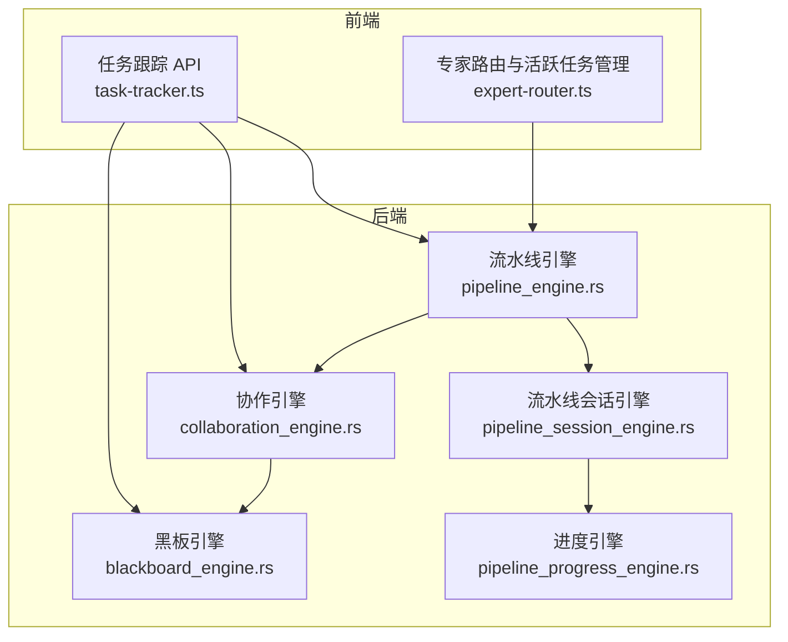

图表来源
- [pipeline_engine.rs:1-600](file://ai-experts/src-tauri/src/pipeline_engine.rs#L1-L600)
- [collaboration_engine.rs:1-435](file://ai-experts/src-tauri/src/collaboration_engine.rs#L1-L435)
- [blackboard_engine.rs:1-670](file://ai-experts/src-tauri/src/blackboard_engine.rs#L1-L670)
- [pipeline_session_engine.rs](file://ai-experts/src-tauri/src/pipeline_session_engine.rs)
- [pipeline_progress_engine.rs](file://ai-experts/src-tauri/src/pipeline_progress_engine.rs)
- [task-tracker.ts:1-208](file://ai-experts/src/task-tracker.ts#L1-L208)
- [expert-router.ts:646-1418](file://ai-experts/src/expert-router.ts#L646-L1418)

章节来源
- [pipeline_engine.rs:1-600](file://ai-experts/src-tauri/src/pipeline_engine.rs#L1-L600)
- [collaboration_engine.rs:1-435](file://ai-experts/src-tauri/src/collaboration_engine.rs#L1-L435)
- [blackboard_engine.rs:1-670](file://ai-experts/src-tauri/src/blackboard_engine.rs#L1-L670)
- [task-tracker.ts:1-208](file://ai-experts/src/task-tracker.ts#L1-L208)
- [expert-router.ts:646-1418](file://ai-experts/src/expert-router.ts#L646-L1418)

## 核心组件
- 流水线引擎：根据场景与专家集合生成步骤布局与派发波次，提供描述性叙事与剩余步骤摘要
- 协作引擎：负责任务构建请求、完成状态应用、跟进计划与当前步骤任务规划
- 黑板引擎：维护共享上下文（证据、文件、变更动作、测试与审查决策），推进协作进度并检测停滞
- 任务跟踪与交付：前端提供专家任务跟踪与交付清单生成/渲染能力
- 专家路由与激活：前端侧专家注册、激活引导与活跃任务管理

章节来源
- [pipeline_engine.rs:359-417](file://ai-experts/src-tauri/src/pipeline_engine.rs#L359-L417)
- [collaboration_engine.rs:139-295](file://ai-experts/src-tauri/src/collaboration_engine.rs#L139-L295)
- [blackboard_engine.rs:87-447](file://ai-experts/src-tauri/src/blackboard_engine.rs#L87-L447)
- [task-tracker.ts:30-83](file://ai-experts/src/task-tracker.ts#L30-L83)
- [expert-router.ts:646-669](file://ai-experts/src/expert-router.ts#L646-L669)

## 架构总览
协作机制以“流水线”为骨架，“黑板”为纽带，“协作引擎”为中枢，贯穿任务构建、状态同步与结果汇总。

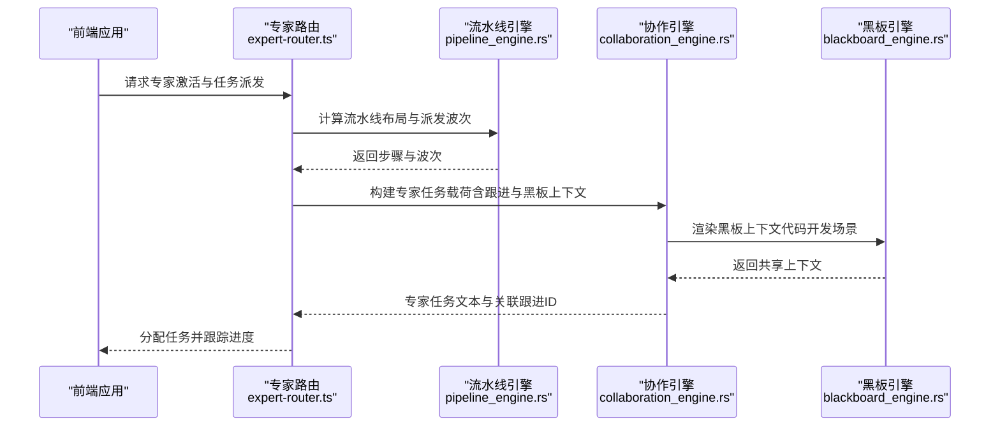

图表来源
- [expert-router.ts:1383-1418](file://ai-experts/src/expert-router.ts#L1383-L1418)
- [pipeline_engine.rs:359-417](file://ai-experts/src-tauri/src/pipeline_engine.rs#L359-L417)
- [collaboration_engine.rs:139-170](file://ai-experts/src-tauri/src/collaboration_engine.rs#L139-L170)
- [blackboard_engine.rs:335-447](file://ai-experts/src-tauri/src/blackboard_engine.rs#L335-L447)

## 详细组件分析

### 协作引擎：任务构建、完成状态与跟进计划
协作引擎围绕以下数据结构与流程展开：
- 任务构建请求：包含基础任务描述、当前步骤专家集合、待处理跟进、是否仅限当前步骤、黑板上下文
- 任务完成状态请求：包含已完成结果、待处理跟进、当前专家任务摘要、本次消费的跟进ID
- 跟进计划请求：包含场景、基础任务描述、当前步骤专家集合、待处理跟进、黑板任务
- 关键函数：
  - 任务载荷构建：过滤并拼接跟进信息与黑板上下文
  - 完成状态应用：更新已完成结果、标记跟进被消费
  - 步骤跟进轮计划：仅针对当前步骤专家生成“本轮修正/补充”任务
  - 当前步骤任务计划：为当前步骤所有专家生成任务

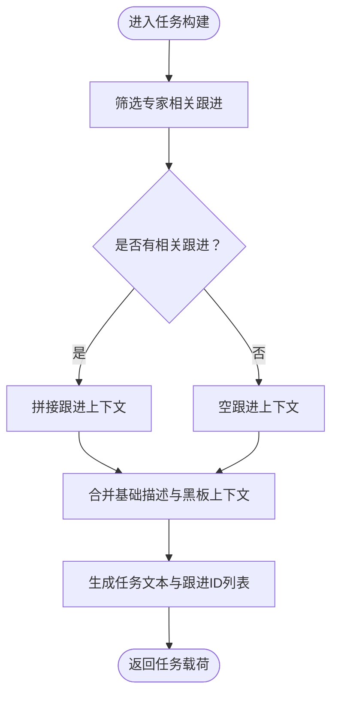

图表来源
- [collaboration_engine.rs:108-170](file://ai-experts/src-tauri/src/collaboration_engine.rs#L108-L170)

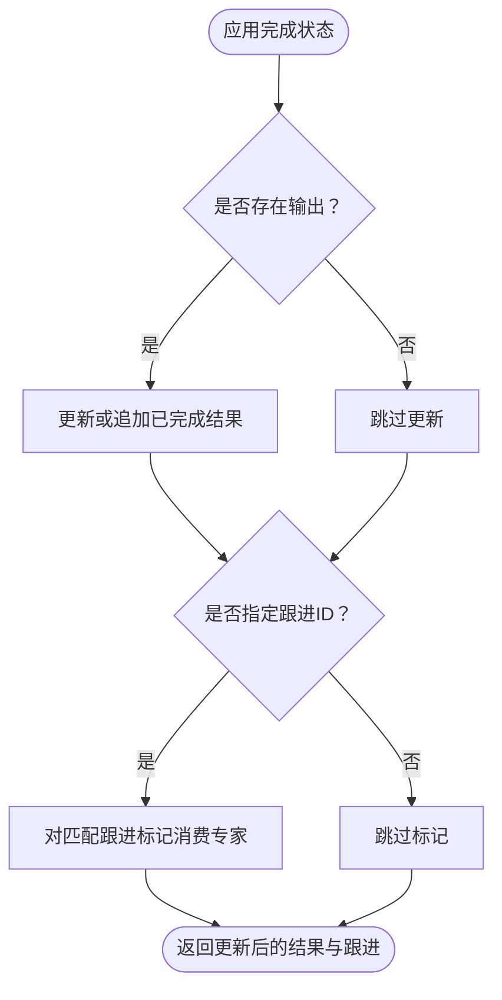

图表来源
- [collaboration_engine.rs:172-214](file://ai-experts/src-tauri/src/collaboration_engine.rs#L172-L214)

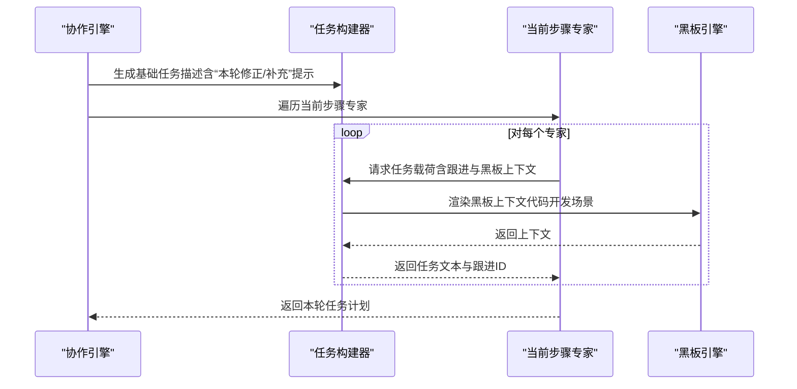

图表来源
- [collaboration_engine.rs:216-295](file://ai-experts/src-tauri/src/collaboration_engine.rs#L216-L295)
- [blackboard_engine.rs:335-447](file://ai-experts/src-tauri/src/blackboard_engine.rs#L335-L447)

章节来源
- [collaboration_engine.rs:139-295](file://ai-experts/src-tauri/src/collaboration_engine.rs#L139-L295)

### 流水线引擎：场景化步骤布局与派发波次
流水线引擎根据场景与专家集合自动拆解步骤与波次：
- 场景分支：代码开发、学科分析、技术调研、带检索的调研等
- 角色识别：研究、设计、工程、审查专家集合
- 布局生成：去重、分组、可选阶段标记
- 描述性叙事：生成“主管”派发说明与剩余步骤摘要

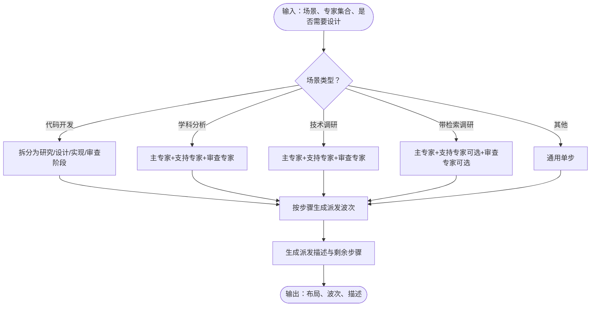

图表来源
- [pipeline_engine.rs:107-188](file://ai-experts/src-tauri/src/pipeline_engine.rs#L107-L188)
- [pipeline_engine.rs:190-278](file://ai-experts/src-tauri/src/pipeline_engine.rs#L190-L278)
- [pipeline_engine.rs:280-289](file://ai-experts/src-tauri/src/pipeline_engine.rs#L280-L289)
- [pipeline_engine.rs:291-357](file://ai-experts/src-tauri/src/pipeline_engine.rs#L291-L357)
- [pipeline_engine.rs:359-417](file://ai-experts/src-tauri/src/pipeline_engine.rs#L359-L417)

章节来源
- [pipeline_engine.rs:359-417](file://ai-experts/src-tauri/src/pipeline_engine.rs#L359-L417)

### 黑板引擎：共享上下文与协作进度推进
黑板引擎维护共享知识库，驱动专家协同与质量控制：
- 上下文结构：证据、假设、问题、补丁提案、验证运行、审查决策、阻断项
- 任务更新：从专家输出抽取文件变更、测试命令与审查结论，更新黑板
- 进度推进：基于签名对比检测是否产生新进展，超过阈值轮次无进展则停止

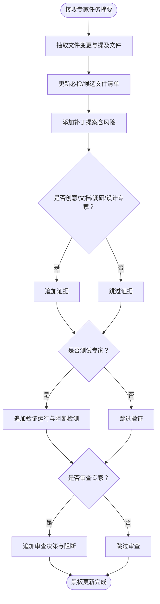

图表来源
- [blackboard_engine.rs:132-280](file://ai-experts/src-tauri/src/blackboard_engine.rs#L132-L280)

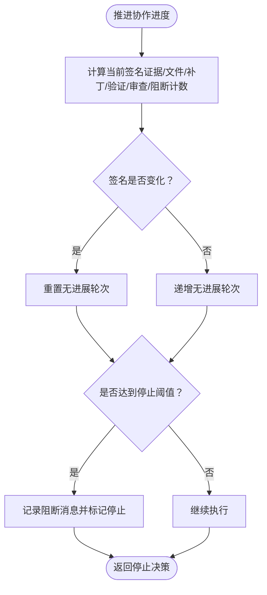

图表来源
- [blackboard_engine.rs:282-333](file://ai-experts/src-tauri/src/blackboard_engine.rs#L282-L333)

章节来源
- [blackboard_engine.rs:87-447](file://ai-experts/src-tauri/src/blackboard_engine.rs#L87-L447)

### 任务跟踪与交付：前端 API 与渲染
前端提供专家任务跟踪与交付清单生成/渲染：
- 交付清单 API：生成并保存、加载、列举交付清单
- 渲染逻辑：摘要、代码变更统计与列表、审查意见统计与列表、测试建议
- 专家任务结构：状态、输入输出、时间戳、错误信息

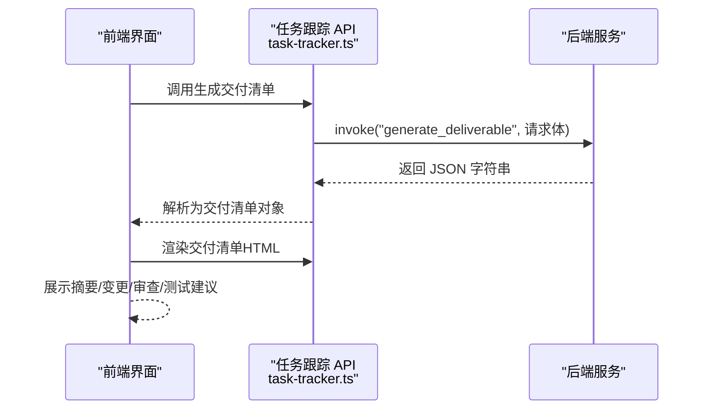

图表来源
- [task-tracker.ts:30-83](file://ai-experts/src/task-tracker.ts#L30-L83)
- [task-tracker.ts:88-173](file://ai-experts/src/task-tracker.ts#L88-L173)

章节来源
- [task-tracker.ts:1-208](file://ai-experts/src/task-tracker.ts#L1-L208)

### 专家路由与激活：职责触发与主责定位
前端专家路由与激活机制：
- 专家注册表：构建系统提示与专家信息
- 激活引导：根据任务描述评估专家职责触发倾向，决定主责/辅助定位
- 活跃任务管理：维护当前流水线ID、当前步骤专家集合与任务计数

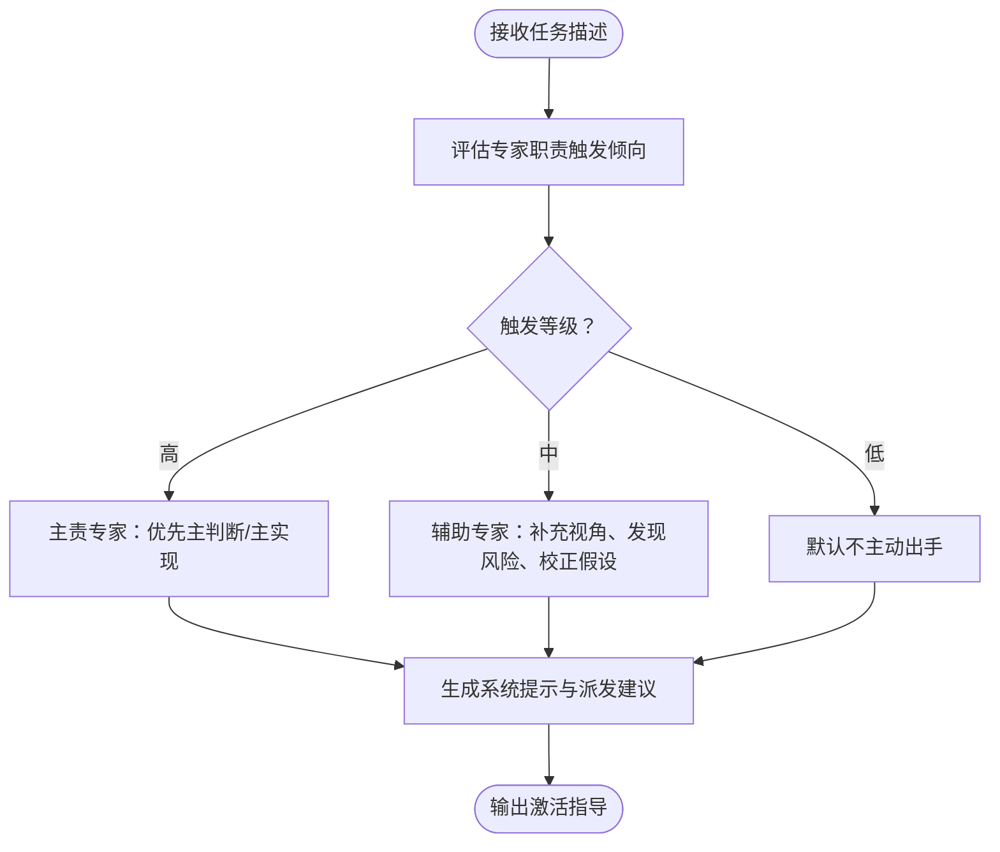

图表来源
- [expert-router.ts:646-669](file://ai-experts/src/expert-router.ts#L646-L669)
- [expert-catalog.ts:410-426](file://ai-experts/src/expert-catalog.ts#L410-L426)

章节来源
- [expert-router.ts:646-669](file://ai-experts/src/expert-router.ts#L646-L669)
- [expert-catalog.ts:410-426](file://ai-experts/src/expert-catalog.ts#L410-L426)

## 依赖分析
协作机制的关键依赖关系如下：
- 流水线引擎为协作引擎提供场景化步骤与专家集合
- 协作引擎依赖黑板引擎提供共享上下文
- 前端任务跟踪 API 与流水线/协作引擎交互，用于交付与进度可视化
- 专家路由与激活依赖专家目录与系统提示，影响任务派发与职责定位

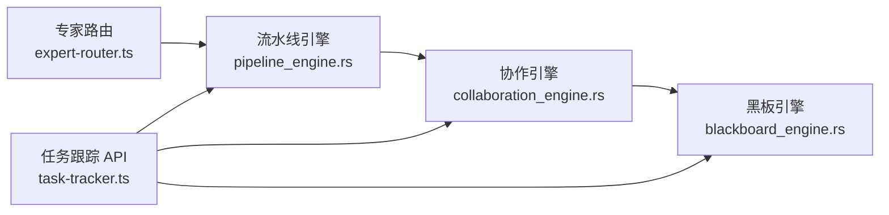

图表来源
- [expert-router.ts:1383-1418](file://ai-experts/src/expert-router.ts#L1383-L1418)
- [pipeline_engine.rs:359-417](file://ai-experts/src-tauri/src/pipeline_engine.rs#L359-L417)
- [collaboration_engine.rs:139-170](file://ai-experts/src-tauri/src/collaboration_engine.rs#L139-L170)
- [blackboard_engine.rs:335-447](file://ai-experts/src-tauri/src/blackboard_engine.rs#L335-L447)
- [task-tracker.ts:30-83](file://ai-experts/src/task-tracker.ts#L30-L83)

章节来源
- [expert-router.ts:1383-1418](file://ai-experts/src/expert-router.ts#L1383-L1418)
- [pipeline_engine.rs:359-417](file://ai-experts/src-tauri/src/pipeline_engine.rs#L359-L417)
- [collaboration_engine.rs:139-170](file://ai-experts/src-tauri/src/collaboration_engine.rs#L139-L170)
- [blackboard_engine.rs:335-447](file://ai-experts/src-tauri/src/blackboard_engine.rs#L335-L447)
- [task-tracker.ts:30-83](file://ai-experts/src/task-tracker.ts#L30-L83)

## 性能考虑
- 数据结构与算法复杂度
  - 任务构建与跟进筛选：O(F)（F 为跟进数量），过滤与拼接为 O(T)（T 为文本长度）
  - 完成状态应用：哈希查找与更新已完成结果，平均 O(R)（R 为已存在结果数）
  - 步骤计划生成：对当前步骤专家逐一构建任务，整体 O(E×(F+T))（E 为专家数）
  - 黑板进度推进：签名计算与比较 O(S)（S 为各类指标计数）
- 优化建议
  - 缓存黑板上下文渲染结果，避免重复计算
  - 对专家ID与跟进ID使用索引结构，加速匹配与去重
  - 在前端对任务跟踪数据进行分页与懒加载，减少 DOM 压力
  - 控制黑板字段上限（证据/补丁/验证/审查），防止无限增长导致性能退化

## 故障排查指南
- 专家未收到相关跟进
  - 检查跟进目标专家列表与“仅当前步骤”标志位
  - 确认消费标记是否正确写入
  - 参考：[collaboration_engine.rs:108-137](file://ai-experts/src-tauri/src/collaboration_engine.rs#L108-L137)，[collaboration_engine.rs:195-208](file://ai-experts/src-tauri/src/collaboration_engine.rs#L195-L208)
- 交付清单为空或解析失败
  - 核对后端 invoke 返回值与 JSON 结构
  - 检查异常捕获与日志输出
  - 参考：[task-tracker.ts:30-83](file://ai-experts/src/task-tracker.ts#L30-L83)
- 协作停滞
  - 检查黑板进度签名是否变化
  - 查看阻断消息与停止条件
  - 参考：[blackboard_engine.rs:282-333](file://ai-experts/src-tauri/src/blackboard_engine.rs#L282-L333)
- 专家职责触发倾向与派发偏差
  - 校验专家激活评估与系统提示构建
  - 参考：[expert-catalog.ts:410-426](file://ai-experts/src/expert-catalog.ts#L410-L426)，[expert-router.ts:1383-1418](file://ai-experts/src/expert-router.ts#L1383-L1418)

章节来源
- [collaboration_engine.rs:108-137](file://ai-experts/src-tauri/src/collaboration_engine.rs#L108-L137)
- [collaboration_engine.rs:195-208](file://ai-experts/src-tauri/src/collaboration_engine.rs#L195-L208)
- [task-tracker.ts:30-83](file://ai-experts/src/task-tracker.ts#L30-L83)
- [blackboard_engine.rs:282-333](file://ai-experts/src-tauri/src/blackboard_engine.rs#L282-L333)
- [expert-catalog.ts:410-426](file://ai-experts/src/expert-catalog.ts#L410-L426)
- [expert-router.ts:1383-1418](file://ai-experts/src/expert-router.ts#L1383-L1418)

## 结论
本协作机制通过“流水线引擎—协作引擎—黑板引擎”的分层设计，实现了多专家在统一上下文下的有序协作。任务构建、状态同步与结果汇总在前后端协同下高效运转，配合专家激活与职责定位，确保复杂任务在不同学科专家之间顺畅流转与高质量交付。

## 附录

### 协作 API 使用示例（路径指引）
- 生成交付清单
  - 调用路径：[task-tracker.ts:30-83](file://ai-experts/src/task-tracker.ts#L30-L83)
  - 后端接口：invoke("generate_deliverable", 请求体)
- 渲染交付清单
  - 调用路径：[task-tracker.ts:88-173](file://ai-experts/src/task-tracker.ts#L88-L173)
- 专家任务构建请求
  - 数据结构：[collaboration_engine.rs:27-41](file://ai-experts/src-tauri/src/collaboration_engine.rs#L27-L41)
  - 实现函数：[collaboration_engine.rs:139-170](file://ai-experts/src-tauri/src/collaboration_engine.rs#L139-L170)
- 完成状态应用
  - 数据结构：[collaboration_engine.rs:45-66](file://ai-experts/src-tauri/src/collaboration_engine.rs#L45-L66)
  - 实现函数：[collaboration_engine.rs:172-214](file://ai-experts/src-tauri/src/collaboration_engine.rs#L172-L214)
- 跟进计划与当前步骤任务
  - 数据结构：[collaboration_engine.rs:70-106](file://ai-experts/src-tauri/src/collaboration_engine.rs#L70-L106)
  - 实现函数：[collaboration_engine.rs:216-295](file://ai-experts/src-tauri/src/collaboration_engine.rs#L216-L295)
- 流水线布局与派发描述
  - 数据结构：[pipeline_engine.rs:6-34](file://ai-experts/src-tauri/src/pipeline_engine.rs#L6-L34)
  - 实现函数：[pipeline_engine.rs:359-417](file://ai-experts/src-tauri/src/pipeline_engine.rs#L359-L417)