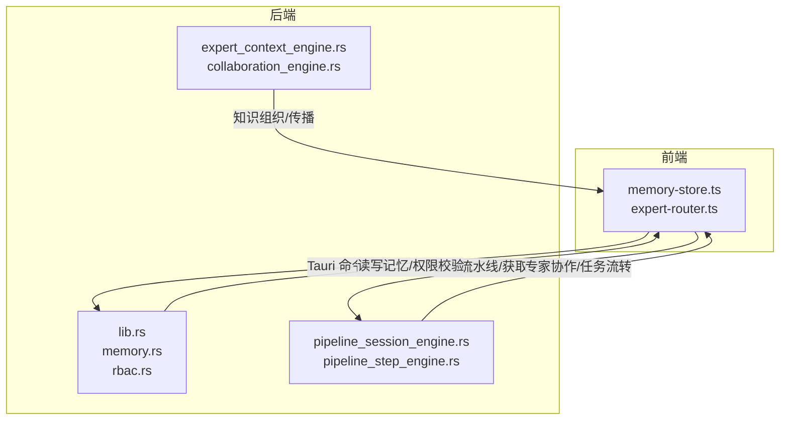
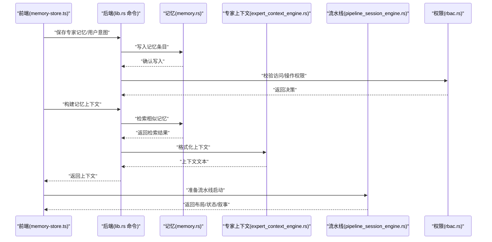
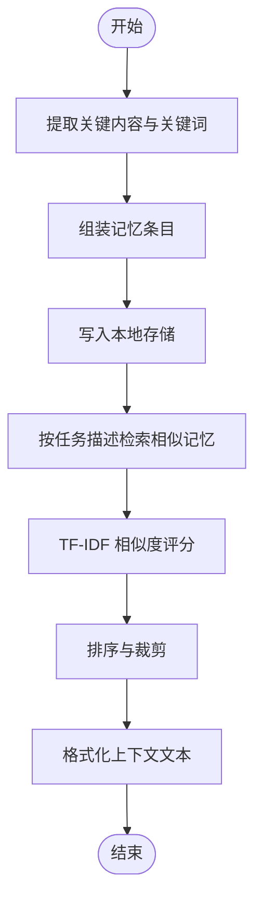
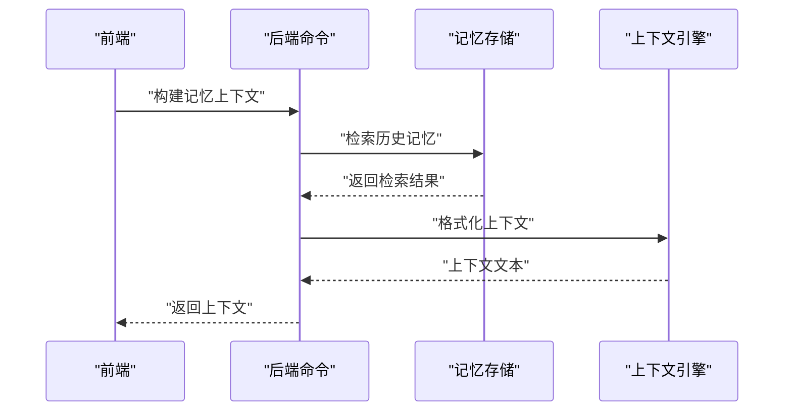
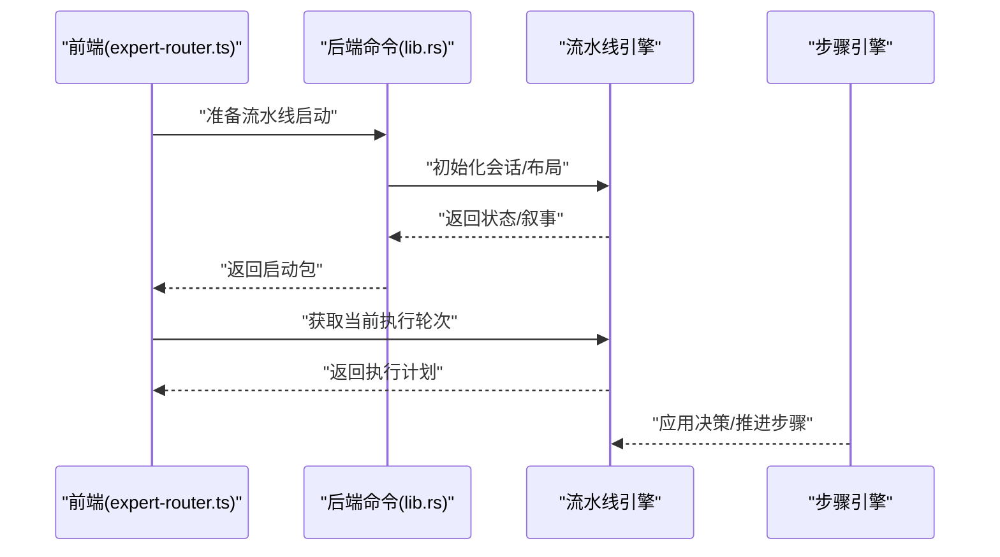
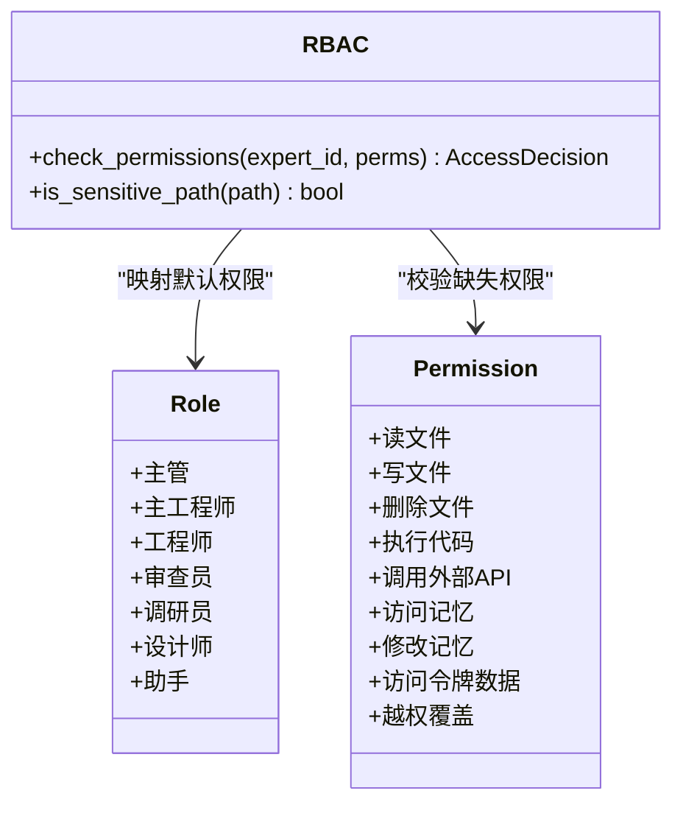
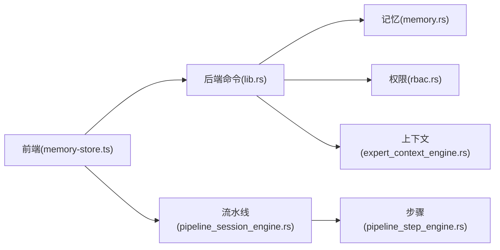

# 知识共享

<cite>
**本文引用的文件**
- [ai-experts/src-tauri/src/lib.rs](file://ai-experts/src-tauri/src/lib.rs)
- [ai-experts/src-tauri/src/memory.rs](file://ai-experts/src-tauri/src/memory.rs)
- [ai-experts/src/memory-store.ts](file://ai-experts/src/memory-store.ts)
- [ai-experts/src-tauri/src/rbac.rs](file://ai-experts/src-tauri/src/rbac.rs)
- [ai-experts/src-tauri/gen/schemas/desktop-schema.json](file://ai-experts/src-tauri/gen/schemas/desktop-schema.json)
- [ai-experts/src-tauri/gen/schemas/windows-schema.json](file://ai-experts/src-tauri/gen/schemas/windows-schema.json)
- [ai-experts/src-tauri/src/expert_context_engine.rs](file://ai-experts/src-tauri/src/expert_context_engine.rs)
- [ai-experts/src-tauri/src/collaboration_engine.rs](file://ai-experts/src-tauri/src/collaboration_engine.rs)
- [ai-experts/src-tauri/src/pipeline_session_engine.rs](file://ai-experts/src-tauri/src/pipeline_session_engine.rs)
- [ai-experts/src-tauri/src/pipeline_step_engine.rs](file://ai-experts/src-tauri/src/pipeline_step_engine.rs)
- [ai-experts/src/expert-router.ts](file://ai-experts/src/expert-router.ts)
</cite>

## 目录
1. [引言](#引言)
2. [项目结构](#项目结构)
3. [核心组件](#核心组件)
4. [架构总览](#架构总览)
5. [详细组件分析](#详细组件分析)
6. [依赖关系分析](#依赖关系分析)
7. [性能考量](#性能考量)
8. [故障排查指南](#故障排查指南)
9. [结论](#结论)
10. [附录](#附录)

## 引言
本文件面向“星图专家团工作台”的知识共享能力，系统化阐述知识传播机制、社交互动功能与共享权限控制的设计与实现。重点覆盖以下方面：
- 专家上下文引擎如何实现知识的动态共享与传播，包括知识片段的提取、组织与分发机制；
- 专家间知识交流、讨论与协作模式；
- 共享权限控制的实现原理，包括访问控制、权限继承与安全策略；
- 知识共享与记忆存储系统的集成方式，以及一致性与完整性保障；
- 知识共享相关的数据模型、API 接口与使用示例。

## 项目结构
知识共享能力横跨前端 TypeScript 与后端 Rust 两部分：
- 前端负责任务编排、记忆构建与上下文组装、与后端命令交互；
- 后端负责持久化存储、检索与权限校验、专家上下文与协作引擎。

图表来源
- [ai-experts/src/memory-store.ts:103-191](file://ai-experts/src/memory-store.ts#L103-L191)
- [ai-experts/src-tauri/src/lib.rs:1116-1464](file://ai-experts/src-tauri/src/lib.rs#L1116-L1464)
- [ai-experts/src-tauri/src/memory.rs:1-51](file://ai-experts/src-tauri/src/memory.rs#L1-L51)
- [ai-experts/src-tauri/src/rbac.rs:1-34](file://ai-experts/src-tauri/src/rbac.rs#L1-L34)
- [ai-experts/src-tauri/src/expert_context_engine.rs](file://ai-experts/src-tauri/src/expert_context_engine.rs)
- [ai-experts/src-tauri/src/collaboration_engine.rs](file://ai-experts/src-tauri/src/collaboration_engine.rs)
- [ai-experts/src-tauri/src/pipeline_session_engine.rs:324-344](file://ai-experts/src-tauri/src/pipeline_session_engine.rs#L324-L344)
- [ai-experts/src-tauri/src/pipeline_step_engine.rs:1-33](file://ai-experts/src-tauri/src/pipeline_step_engine.rs#L1-L33)

章节来源
- [ai-experts/src/memory-store.ts:103-191](file://ai-experts/src/memory-store.ts#L103-L191)
- [ai-experts/src-tauri/src/lib.rs:1116-1464](file://ai-experts/src-tauri/src/lib.rs#L1116-L1464)

## 核心组件
- 记忆存储与检索（本地 SQLite + TF-IDF）：提供知识条目的持久化、关键词索引与相似度检索，支撑知识片段的提取与复用。
- 专家上下文引擎：将检索到的历史记忆与任务上下文融合，形成专家可用的动态知识上下文。
- 协作引擎：驱动多专家协同、任务分发与进度推进，促进知识在专家间的流动与沉淀。
- 权限控制（RBAC）：基于专家角色的细粒度权限模型，控制对文件、记忆与外部 API 的访问。
- 前端记忆工具与流水线编排：封装记忆保存、检索与上下文组装，协调专家路由与流水线执行。

章节来源
- [ai-experts/src-tauri/src/memory.rs:1-51](file://ai-experts/src-tauri/src/memory.rs#L1-L51)
- [ai-experts/src-tauri/src/rbac.rs:1-34](file://ai-experts/src-tauri/src/rbac.rs#L1-L34)
- [ai-experts/src-tauri/src/expert_context_engine.rs](file://ai-experts/src-tauri/src/expert_context_engine.rs)
- [ai-experts/src-tauri/src/collaboration_engine.rs](file://ai-experts/src-tauri/src/collaboration_engine.rs)
- [ai-experts/src-tauri/src/pipeline_session_engine.rs:324-344](file://ai-experts/src-tauri/src/pipeline_session_engine.rs#L324-L344)
- [ai-experts/src-tauri/src/pipeline_step_engine.rs:1-33](file://ai-experts/src-tauri/src/pipeline_step_engine.rs#L1-L33)

## 架构总览
知识共享的端到端流程由“前端记忆工具”触发，经“后端命令与引擎”处理，最终反馈给前端进行展示与下一步编排。

图表来源
- [ai-experts/src/memory-store.ts:103-191](file://ai-experts/src/memory-store.ts#L103-L191)
- [ai-experts/src-tauri/src/lib.rs:1116-1464](file://ai-experts/src-tauri/src/lib.rs#L1116-L1464)
- [ai-experts/src-tauri/src/memory.rs:1-51](file://ai-experts/src-tauri/src/memory.rs#L1-L51)
- [ai-experts/src-tauri/src/expert_context_engine.rs](file://ai-experts/src-tauri/src/expert_context_engine.rs)
- [ai-experts/src-tauri/src/pipeline_session_engine.rs:324-344](file://ai-experts/src-tauri/src/pipeline_session_engine.rs#L324-L344)
- [ai-experts/src-tauri/src/rbac.rs:147-184](file://ai-experts/src-tauri/src/rbac.rs#L147-L184)

## 详细组件分析

### 记忆存储与检索（本地知识库）
- 数据模型
  - 记忆条目：包含唯一标识、项目 ID、专家 ID、类型（短期/工作/长期）、内容、关键词、上下文摘要、时间戳与访问统计等字段。
  - 检索请求：支持按项目、专家、查询文本与类型限制进行检索，并设置返回数量上限。
  - 检索结果：记忆条目与相似度分数。
- 存储位置：每个项目根目录下的隐藏目录中按类型分文件存储。
- 检索策略：TF-IDF 关键词匹配与相似度打分，结合时间与访问热度进行排序。
- 前端封装
  - 保存专家记忆：从专家输出截取关键片段，抽取关键词，生成记忆条目并持久化。
  - 保存用户意图：将用户输入转为“瞬时记忆”，便于后续上下文组装。
  - 构建记忆上下文：按任务描述检索相关历史，拼接成可注入到专家提示中的上下文文本。

图表来源
- [ai-experts/src/memory-store.ts:103-191](file://ai-experts/src/memory-store.ts#L103-L191)
- [ai-experts/src-tauri/src/memory.rs:1-51](file://ai-experts/src-tauri/src/memory.rs#L1-L51)

章节来源
- [ai-experts/src-tauri/src/memory.rs:1-51](file://ai-experts/src-tauri/src/memory.rs#L1-L51)
- [ai-experts/src/memory-store.ts:103-191](file://ai-experts/src/memory-store.ts#L103-L191)

### 专家上下文引擎（知识动态共享与传播）
- 职责
  - 将检索到的历史记忆与当前任务描述融合，形成专家可直接使用的上下文。
  - 支持“相关历史记忆”“通用记忆上下文”等不同维度的上下文组装。
  - 在专家提示中注入上下文，提升回答一致性与可追溯性。
- 传播机制
  - 通过“工作记忆”沉淀专家输出的关键结论，形成可复用的知识片段。
  - 多轮对话与任务迭代中，逐步累积上下文，减少重复输入，增强专家协作效率。
- 与记忆系统的集成
  - 读取本地记忆文件，进行关键词匹配与相似度计算，筛选最相关的若干条目。
  - 对检索结果进行格式化，统一为可注入提示的文本块。

图表来源
- [ai-experts/src-tauri/src/lib.rs:1605-1624](file://ai-experts/src-tauri/src/lib.rs#L1605-L1624)
- [ai-experts/src-tauri/src/memory.rs:1-51](file://ai-experts/src-tauri/src/memory.rs#L1-L51)
- [ai-experts/src-tauri/src/expert_context_engine.rs](file://ai-experts/src-tauri/src/expert_context_engine.rs)

章节来源
- [ai-experts/src-tauri/src/lib.rs:1605-1624](file://ai-experts/src-tauri/src/lib.rs#L1605-L1624)
- [ai-experts/src-tauri/src/expert_context_engine.rs](file://ai-experts/src-tauri/src/expert_context_engine.rs)

### 协作引擎（专家间知识交流与协作）
- 流水线编排
  - 专家路由根据任务场景与意图，锚定合适的专家集合与协作波次。
  - 启动流水线会话，生成布局与执行计划，推动多专家并行/串行协作。
- 任务快照与结果汇总
  - 记录专家输出与错误信息，便于回溯与复盘。
  - 支持主管级复核与交付评估，确保知识质量与一致性。
- 社交互动
  - 通过“等待加入的任务”“叙事描述”等机制，促进专家间的信息同步与协作节奏管理。

图表来源
- [ai-experts/src/expert-router.ts:917-967](file://ai-experts/src/expert-router.ts#L917-L967)
- [ai-experts/src-tauri/src/lib.rs:1446-1464](file://ai-experts/src-tauri/src/lib.rs#L1446-L1464)
- [ai-experts/src-tauri/src/pipeline_session_engine.rs:324-344](file://ai-experts/src-tauri/src/pipeline_session_engine.rs#L324-L344)
- [ai-experts/src-tauri/src/pipeline_step_engine.rs:1-33](file://ai-experts/src-tauri/src/pipeline_step_engine.rs#L1-L33)

章节来源
- [ai-experts/src/expert-router.ts:917-967](file://ai-experts/src/expert-router.ts#L917-L967)
- [ai-experts/src-tauri/src/pipeline_session_engine.rs:324-344](file://ai-experts/src-tauri/src/pipeline_session_engine.rs#L324-L344)
- [ai-experts/src-tauri/src/pipeline_step_engine.rs:1-33](file://ai-experts/src-tauri/src/pipeline_step_engine.rs#L1-L33)

### 权限控制（RBAC）
- 角色与权限
  - 角色：主管、主工程师、工程师、审查员、调研员、设计师、助手等。
  - 权限：文件读写、执行代码、访问/修改记忆、调用外部 API、令牌数据、越权覆盖等。
- 访问控制
  - 针对敏感路径进行白名单式限制，仅主管可访问。
  - 批量权限检查，确保操作所需权限满足。
- 文件系统权限
  - Tauri 能力配置中包含对应用配置目录的读写与元数据访问能力，用于记忆存储与项目上下文读取。

图表来源
- [ai-experts/src-tauri/src/rbac.rs:1-34](file://ai-experts/src-tauri/src/rbac.rs#L1-L34)
- [ai-experts/src-tauri/src/rbac.rs:147-184](file://ai-experts/src-tauri/src/rbac.rs#L147-L184)
- [ai-experts/src-tauri/gen/schemas/desktop-schema.json:228-4361](file://ai-experts/src-tauri/gen/schemas/desktop-schema.json#L228-L4361)
- [ai-experts/src-tauri/gen/schemas/windows-schema.json:228-4361](file://ai-experts/src-tauri/gen/schemas/windows-schema.json#L228-L4361)

章节来源
- [ai-experts/src-tauri/src/rbac.rs:1-34](file://ai-experts/src-tauri/src/rbac.rs#L1-L34)
- [ai-experts/src-tauri/src/rbac.rs:147-184](file://ai-experts/src-tauri/src/rbac.rs#L147-L184)
- [ai-experts/src-tauri/gen/schemas/desktop-schema.json:228-4361](file://ai-experts/src-tauri/gen/schemas/desktop-schema.json#L228-L4361)
- [ai-experts/src-tauri/gen/schemas/windows-schema.json:228-4361](file://ai-experts/src-tauri/gen/schemas/windows-schema.json#L228-L4361)

### 知识共享的数据模型与 API
- 数据模型
  - 记忆条目：id、project_id、expert_id、memory_type、content、keywords、context_summary、created_at、access_count、last_accessed。
  - 检索请求：project_id、expert_id、query_text、memory_type、limit。
  - 检索结果：entry、score。
- API（命令）
  - 保存专家记忆：从前端传入项目、专家、任务描述与专家输出，后端截取关键片段并写入工作记忆。
  - 保存用户意图：将用户消息写入瞬时记忆。
  - 构建记忆上下文：按任务描述检索相关历史，返回可注入提示的上下文文本。
  - 准备流水线启动：前端发起，后端返回布局、状态与叙事，驱动专家协作。

章节来源
- [ai-experts/src-tauri/src/memory.rs:1-51](file://ai-experts/src-tauri/src/memory.rs#L1-L51)
- [ai-experts/src/memory-store.ts:103-191](file://ai-experts/src/memory-store.ts#L103-L191)
- [ai-experts/src-tauri/src/lib.rs:1116-1464](file://ai-experts/src-tauri/src/lib.rs#L1116-L1464)
- [ai-experts/src/expert-router.ts:917-967](file://ai-experts/src/expert-router.ts#L917-L967)

## 依赖关系分析
- 前端依赖后端命令完成记忆写入、检索与上下文组装；
- 后端依赖记忆存储模块进行持久化与检索；
- 上下文引擎依赖检索结果进行格式化；
- 协作引擎依赖流水线状态推进专家任务；
- 权限控制贯穿文件系统访问与敏感路径保护。

图表来源
- [ai-experts/src/memory-store.ts:103-191](file://ai-experts/src/memory-store.ts#L103-L191)
- [ai-experts/src-tauri/src/lib.rs:1116-1464](file://ai-experts/src-tauri/src/lib.rs#L1116-L1464)
- [ai-experts/src-tauri/src/memory.rs:1-51](file://ai-experts/src-tauri/src/memory.rs#L1-L51)
- [ai-experts/src-tauri/src/rbac.rs:1-34](file://ai-experts/src-tauri/src/rbac.rs#L1-L34)
- [ai-experts/src-tauri/src/expert_context_engine.rs](file://ai-experts/src-tauri/src/expert_context_engine.rs)
- [ai-experts/src-tauri/src/pipeline_session_engine.rs:324-344](file://ai-experts/src-tauri/src/pipeline_session_engine.rs#L324-L344)
- [ai-experts/src-tauri/src/pipeline_step_engine.rs:1-33](file://ai-experts/src-tauri/src/pipeline_step_engine.rs#L1-L33)

章节来源
- [ai-experts/src-tauri/src/lib.rs:1116-1464](file://ai-experts/src-tauri/src/lib.rs#L1116-L1464)
- [ai-experts/src-tauri/src/memory.rs:1-51](file://ai-experts/src-tauri/src/memory.rs#L1-L51)
- [ai-experts/src-tauri/src/rbac.rs:1-34](file://ai-experts/src-tauri/src/rbac.rs#L1-L34)
- [ai-experts/src-tauri/src/expert_context_engine.rs](file://ai-experts/src-tauri/src/expert_context_engine.rs)
- [ai-experts/src-tauri/src/pipeline_session_engine.rs:324-344](file://ai-experts/src-tauri/src/pipeline_session_engine.rs#L324-L344)
- [ai-experts/src-tauri/src/pipeline_step_engine.rs:1-33](file://ai-experts/src-tauri/src/pipeline_step_engine.rs#L1-L33)

## 性能考量
- 检索性能
  - TF-IDF 关键词检索具备较好的可扩展性，建议限制检索窗口与返回条数，避免大规模扫描。
  - 可引入缓存热点记忆，降低高频检索延迟。
- 写入与一致性
  - 写入采用原子落盘策略，避免并发写入导致的数据损坏。
  - 对于高并发场景，建议引入队列化写入与批量合并策略。
- 上下文组装
  - 控制上下文长度，避免超过模型上下文窗口；必要时进行摘要与裁剪。
- 权限检查
  - 批量权限检查应尽量减少重复计算，对角色权限进行缓存。

## 故障排查指南
- 记忆检索为空
  - 检查任务描述是否包含足够的关键词；确认记忆类型与专家过滤条件是否合理。
  - 查看检索异常日志，确认存储路径与文件是否存在。
- 权限拒绝
  - 确认专家角色是否具备相应权限；敏感路径仅主管可访问。
  - 检查 Tauri 能力配置是否包含必要的文件系统访问权限。
- 流水线启动失败
  - 检查专家路由与布局配置；确认当前执行轮次与任务状态。
  - 核对步骤引擎的决策与过渡逻辑，确保前置条件满足。

章节来源
- [ai-experts/src-tauri/src/lib.rs:1605-1624](file://ai-experts/src-tauri/src/lib.rs#L1605-L1624)
- [ai-experts/src-tauri/src/rbac.rs:147-184](file://ai-experts/src-tauri/src/rbac.rs#L147-L184)
- [ai-experts/src-tauri/gen/schemas/desktop-schema.json:228-4361](file://ai-experts/src-tauri/gen/schemas/desktop-schema.json#L228-L4361)

## 结论
知识共享体系通过“前端记忆工具 + 后端命令与引擎 + RBAC 权限控制”的组合，实现了知识的动态提取、组织与传播。记忆存储提供一致、可检索的知识基座，专家上下文引擎将历史经验转化为可复用的上下文，协作引擎推动多专家协同与任务推进，权限控制确保访问安全与合规。整体架构在可扩展性、安全性与易用性之间取得平衡，为专家工作台的知识沉淀与复用提供了坚实基础。

## 附录
- 使用示例（路径指引）
  - 保存专家记忆：参考 [ai-experts/src/memory-store.ts:103-135](file://ai-experts/src/memory-store.ts#L103-L135)
  - 保存用户意图：参考 [ai-experts/src/memory-store.ts:137-157](file://ai-experts/src/memory-store.ts#L137-L157)
  - 构建记忆上下文：参考 [ai-experts/src/memory-store.ts:159-186](file://ai-experts/src/memory-store.ts#L159-L186)
  - 准备流水线启动：参考 [ai-experts/src/expert-router.ts:917-967](file://ai-experts/src/expert-router.ts#L917-L967)
  - 后端命令入口：参考 [ai-experts/src-tauri/src/lib.rs:1116-1464](file://ai-experts/src-tauri/src/lib.rs#L1116-L1464)
- 数据模型定义
  - 记忆条目与检索请求：参考 [ai-experts/src-tauri/src/memory.rs:1-51](file://ai-experts/src-tauri/src/memory.rs#L1-L51)
- 权限与能力
  - 角色与权限枚举：参考 [ai-experts/src-tauri/src/rbac.rs:1-34](file://ai-experts/src-tauri/src/rbac.rs#L1-L34)
  - 敏感路径与批量校验：参考 [ai-experts/src-tauri/src/rbac.rs:147-184](file://ai-experts/src-tauri/src/rbac.rs#L147-L184)
  - 文件系统能力配置：参考 [ai-experts/src-tauri/gen/schemas/desktop-schema.json:228-4361](file://ai-experts/src-tauri/gen/schemas/desktop-schema.json#L228-L4361) 与 [ai-experts/src-tauri/gen/schemas/windows-schema.json:228-4361](file://ai-experts/src-tauri/gen/schemas/windows-schema.json#L228-L4361)