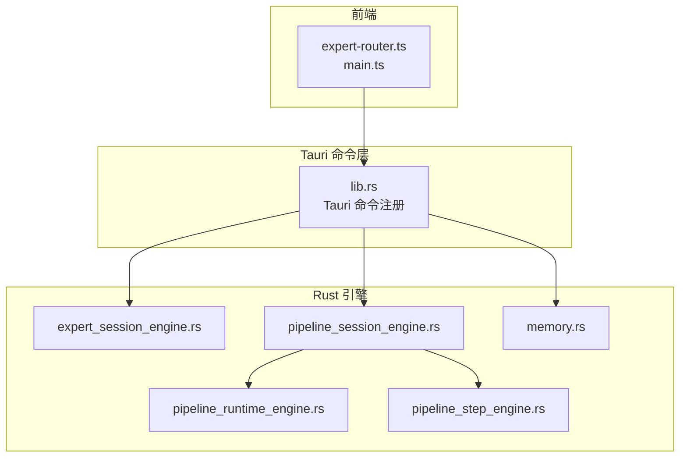
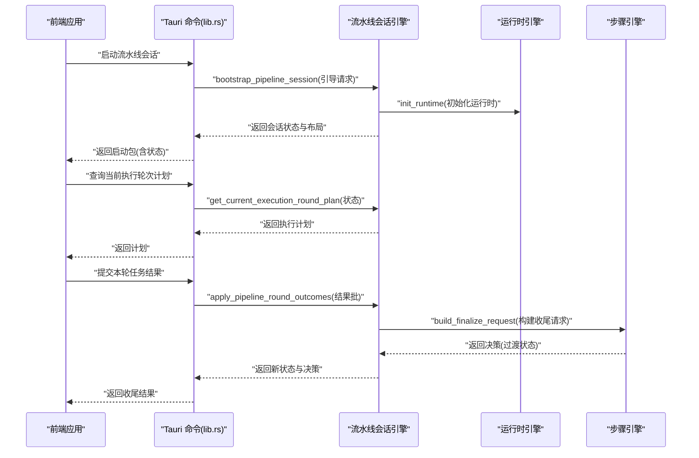
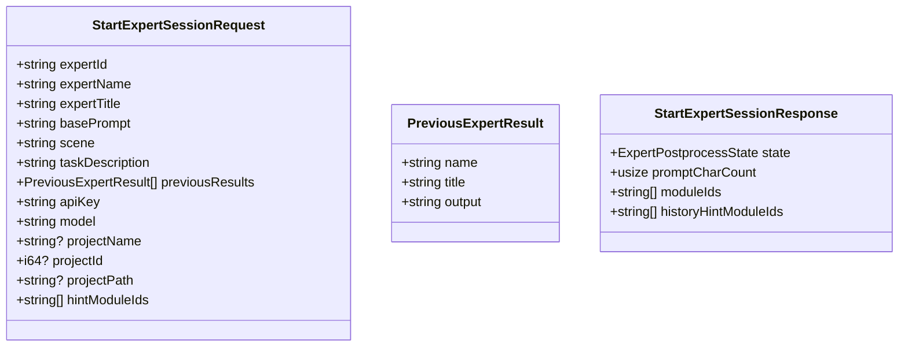
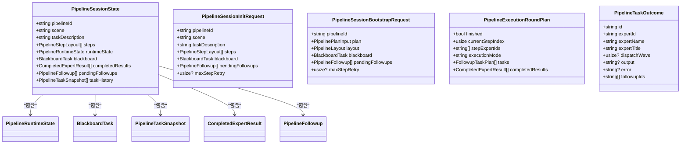
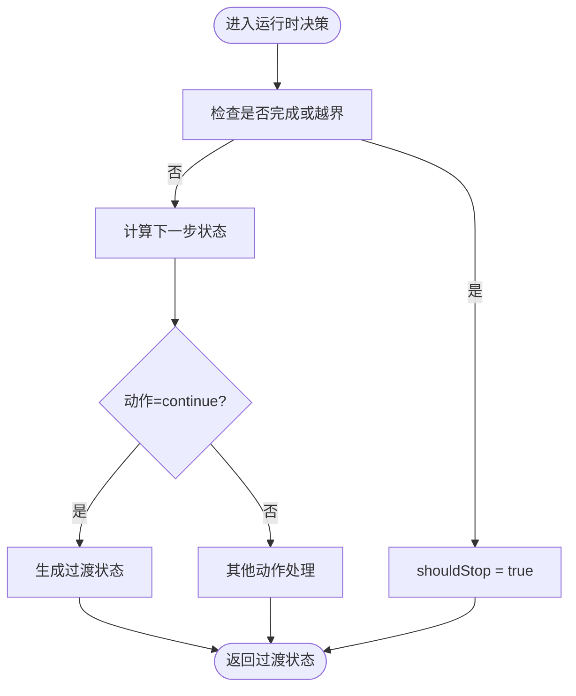
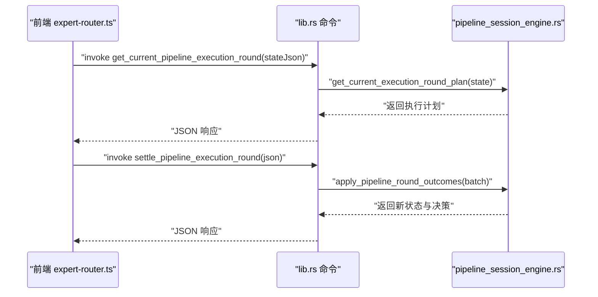
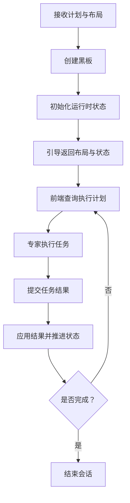
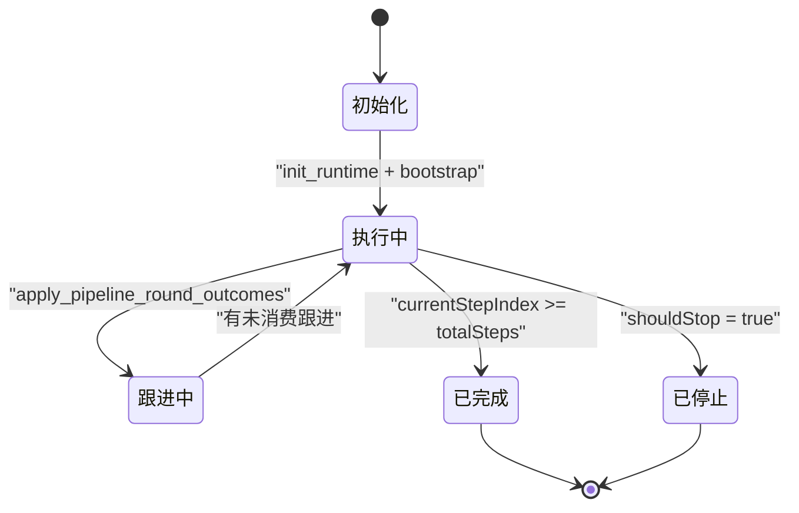
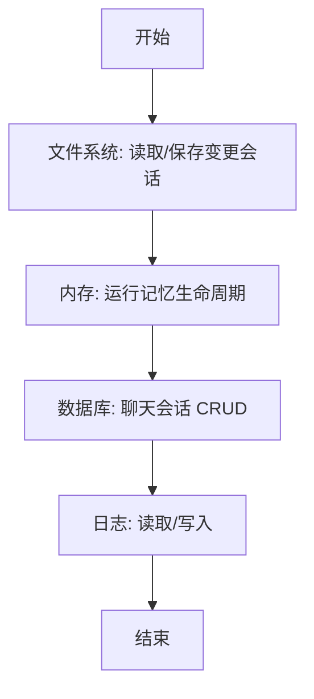
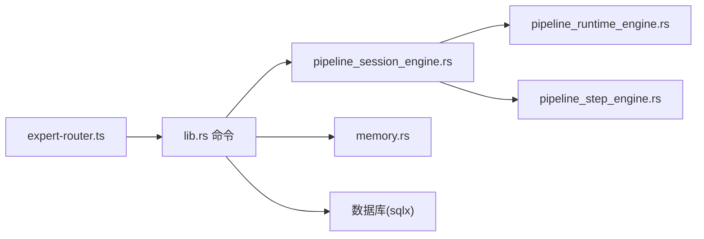

# 会话控制

<cite>
**本文引用的文件**
- [expert_session_engine.rs](file://src-tauri/src/expert_session_engine.rs)
- [pipeline_session_engine.rs](file://src-tauri/src/pipeline_session_engine.rs)
- [pipeline_runtime_engine.rs](file://src-tauri/src/pipeline_runtime_engine.rs)
- [pipeline_step_engine.rs](file://src-tauri/src/pipeline_step_engine.rs)
- [lib.rs](file://src-tauri/src/lib.rs)
- [expert-router.ts](file://src/expert-router.ts)
- [main.ts](file://src/main.ts)
- [memory.rs](file://src-tauri/src/memory.rs)
- [prompt-modules.ts](file://src/prompt-modules.ts)
- [windows-schema.json](file://src-tauri/gen/schemas/windows-schema.json)
- [desktop-schema.json](file://src-tauri/gen/schemas/desktop-schema.json)
</cite>

## 目录
1. [简介](#简介)
2. [项目结构](#项目结构)
3. [核心组件](#核心组件)
4. [架构总览](#架构总览)
5. [详细组件分析](#详细组件分析)
6. [依赖分析](#依赖分析)
7. [性能考虑](#性能考虑)
8. [故障排查指南](#故障排查指南)
9. [结论](#结论)
10. [附录](#附录)

## 简介
本技术文档围绕“会话控制系统”展开，系统以 Rust 后端为核心，结合前端 TypeScript 调用层，形成完整的会话生命周期管理能力。文档重点覆盖以下方面：
- 会话引擎设计原理与数据模型
- 会话生命周期与状态管理（初始化、执行、跟进、收尾）
- 会话创建流程（参数校验、环境准备、启动）
- 状态转换机制（活跃、挂起、完成、失败）
- 持久化与恢复策略（内存与文件）
- 超时控制、资源清理与安全保护
- 监控指标、日志与审计追踪
- 实际操作示例（创建、状态查询、生命周期管理）

## 项目结构
后端采用模块化组织，前端通过 Tauri 命令桥接调用 Rust 引擎。核心模块如下：
- 专家会话引擎：专家级会话的启动与状态封装
- 流水线会话引擎：多专家协作的会话编排与状态推进
- 运行时引擎：步骤级运行时状态与决策
- 步骤引擎：单步收尾与下一步过渡
- 前端路由与命令桥接：前端发起会话、查询计划、提交结果
- 持久化与审计：本地文件与数据库交互
- 日志与权限：日志目录访问与能力配置

图表来源
- [lib.rs:1-200](file://src-tauri/src/lib.rs#L1-L200)
- [expert_session_engine.rs:1-38](file://src-tauri/src/expert_session_engine.rs#L1-L38)
- [pipeline_session_engine.rs:1-200](file://src-tauri/src/pipeline_session_engine.rs#L1-L200)
- [pipeline_runtime_engine.rs:1-47](file://src-tauri/src/pipeline_runtime_engine.rs#L1-L47)
- [pipeline_step_engine.rs:146-171](file://src-tauri/src/pipeline_step_engine.rs#L146-L171)
- [memory.rs:817-842](file://src-tauri/src/memory.rs#L817-L842)

章节来源
- [lib.rs:1-200](file://src-tauri/src/lib.rs#L1-L200)

## 核心组件
- 专家会话引擎：定义专家会话请求与响应的数据结构，用于专家任务的启动与状态返回。
- 流水线会话引擎：定义会话状态、初始化与引导、执行轮次计划、跟进轮次计划、任务结果应用与批量处理。
- 运行时引擎：维护步骤索引、最大重试次数、重试计数与完成标志等运行时状态。
- 步骤引擎：根据运行时状态生成下一步过渡决策，支持重复步骤、前进或停止。
- 前端路由与命令桥接：前端通过 invoke 调用 Rust 命令，获取当前执行轮次计划、提交任务结果并收尾。
- 持久化与审计：本地文件系统保存/加载会话；数据库交互用于聊天会话持久化；日志目录具备读写能力配置。

章节来源
- [expert_session_engine.rs:1-38](file://src-tauri/src/expert_session_engine.rs#L1-L38)
- [pipeline_session_engine.rs:1-200](file://src-tauri/src/pipeline_session_engine.rs#L1-L200)
- [pipeline_runtime_engine.rs:1-47](file://src-tauri/src/pipeline_runtime_engine.rs#L1-L47)
- [pipeline_step_engine.rs:146-171](file://src-tauri/src/pipeline_step_engine.rs#L146-L171)
- [expert-router.ts:706-739](file://src/expert-router.ts#L706-L739)
- [main.ts:2042-2199](file://src/main.ts#L2042-L2199)

## 架构总览
系统采用“前端驱动 + Rust 引擎”的分层架构。前端负责交互与调度，通过 Tauri 命令调用后端引擎，引擎内部通过状态机推进会话生命周期，并在必要时与监督者进行决策交互。

图表来源
- [lib.rs:1390-1536](file://src-tauri/src/lib.rs#L1390-L1536)
- [pipeline_session_engine.rs:113-200](file://src-tauri/src/pipeline_session_engine.rs#L113-L200)
- [pipeline_runtime_engine.rs:39-47](file://src-tauri/src/pipeline_runtime_engine.rs#L39-L47)
- [pipeline_step_engine.rs:146-171](file://src-tauri/src/pipeline_step_engine.rs#L146-L171)

## 详细组件分析

### 专家会话引擎
- 设计要点
  - 请求体封装专家任务所需上下文（场景、任务描述、历史结果、模型与密钥等）
  - 响应体包含后处理状态与提示词统计、模块 ID 列表等
- 数据模型
  - StartExpertSessionRequest：专家会话启动参数
  - StartExpertSessionResponse：专家会话状态与统计信息
- 使用场景
  - 单专家任务启动与状态查询
  - 与流水线会话配合，形成专家链路

图表来源
- [expert_session_engine.rs:1-38](file://src-tauri/src/expert_session_engine.rs#L1-L38)

章节来源
- [expert_session_engine.rs:1-38](file://src-tauri/src/expert_session_engine.rs#L1-L38)

### 流水线会话引擎
- 设计要点
  - 会话状态包含流水线标识、场景、任务描述、步骤列表、运行时状态、黑板、已完成结果、待跟进任务与任务历史
  - 提供初始化、引导、执行轮次计划、跟进轮次计划、任务结果应用与批量处理
- 关键函数
  - init_pipeline_session：基于请求初始化会话状态
  - bootstrap_pipeline_session：同时返回布局与状态
  - get_current_execution_round_plan：生成当前步骤的执行计划
  - get_current_followup_execution_round_plan：生成当前步骤的跟进计划
  - apply_pipeline_task_outcome/apply_pipeline_task_outcomes/apply_pipeline_round_outcomes：应用任务结果并推进状态
- 状态字段
  - runtime_state：步骤索引、总步数、最大重试、重试计数、完成标志
  - blackboard：任务目标、工作区文件、证据、假设、问题、补丁建议、评审决策、阻塞器等
  - completed_results/pending_followups/task_history：结果与历史记录

图表来源
- [pipeline_session_engine.rs:1-200](file://src-tauri/src/pipeline_session_engine.rs#L1-L200)

章节来源
- [pipeline_session_engine.rs:1-200](file://src-tauri/src/pipeline_session_engine.rs#L1-L200)

### 运行时引擎
- 设计要点
  - 维护当前步骤索引、总步数、最大重试次数、每步重试计数与完成标志
  - 初始化时可设置最大重试次数，默认值由请求决定
- 决策接口
  - 支持基于动作（如 continue）的决策请求，返回过渡状态（是否重复步骤、前进步数、是否停止、中断消息）

图表来源
- [pipeline_runtime_engine.rs:1-47](file://src-tauri/src/pipeline_runtime_engine.rs#L1-L47)
- [pipeline_step_engine.rs:146-171](file://src-tauri/src/pipeline_step_engine.rs#L146-L171)

章节来源
- [pipeline_runtime_engine.rs:1-47](file://src-tauri/src/pipeline_runtime_engine.rs#L1-L47)
- [pipeline_step_engine.rs:146-171](file://src-tauri/src/pipeline_step_engine.rs#L146-L171)

### 前端会话控制与命令桥接
- 设计要点
  - 前端通过 invoke 调用 Rust 命令，获取当前执行轮次计划、当前跟进轮次计划
  - 提交任务结果后触发会话状态更新与下一步决策
- 关键流程
  - 启动流水线会话：后端引导并返回状态与布局
  - 查询计划：后端根据当前状态生成执行/跟进计划
  - 提交结果：后端应用结果并返回新状态与决策

图表来源
- [expert-router.ts:706-739](file://src/expert-router.ts#L706-L739)
- [lib.rs:1446-1536](file://src-tauri/src/lib.rs#L1446-L1536)
- [pipeline_session_engine.rs:212-278](file://src-tauri/src/pipeline_session_engine.rs#L212-L278)

章节来源
- [expert-router.ts:706-739](file://src/expert-router.ts#L706-L739)
- [lib.rs:1446-1536](file://src-tauri/src/lib.rs#L1446-L1536)

### 会话创建流程
- 参数校验与环境准备
  - 后端接收流水线计划与布局，创建黑板（包含目标、工作区、证据、假设、问题、补丁建议、评审决策、阻塞器等）
  - 初始化运行时状态（步骤索引、总步数、最大重试、重试计数、完成标志）
- 启动与引导
  - 引导阶段返回流水线布局与初始会话状态，前端据此渲染执行计划
- 执行与跟进
  - 前端轮询当前执行轮次计划，专家执行任务后提交结果
  - 后端应用结果并生成下一步决策，支持跟进轮次与阻塞处理

图表来源
- [lib.rs:1390-1444](file://src-tauri/src/lib.rs#L1390-L1444)
- [pipeline_session_engine.rs:113-147](file://src-tauri/src/pipeline_session_engine.rs#L113-L147)

章节来源
- [lib.rs:1390-1444](file://src-tauri/src/lib.rs#L1390-L1444)
- [pipeline_session_engine.rs:113-147](file://src-tauri/src/pipeline_session_engine.rs#L113-L147)

### 状态转换与生命周期管理
- 状态模型
  - PipelineSessionState：会话整体状态
  - PipelineRuntimeState：步骤级运行时状态
  - BlackboardTask：共享知识与证据
  - CompletedExpertResult/PendingFollowup/TaskHistory：结果与历史
- 转换规则
  - 从初始化到执行：运行时状态推进当前步骤索引
  - 执行完成后进入跟进阶段：生成跟进任务并应用结果
  - 决策阶段：步骤引擎根据运行时状态生成过渡决策（重复步骤、前进、停止）
  - 完成条件：步骤索引达到总步数或满足停止条件

图表来源
- [pipeline_session_engine.rs:212-278](file://src-tauri/src/pipeline_session_engine.rs#L212-L278)
- [pipeline_runtime_engine.rs:39-47](file://src-tauri/src/pipeline_runtime_engine.rs#L39-L47)
- [pipeline_step_engine.rs:146-171](file://src-tauri/src/pipeline_step_engine.rs#L146-L171)

章节来源
- [pipeline_session_engine.rs:212-278](file://src-tauri/src/pipeline_session_engine.rs#L212-L278)
- [pipeline_runtime_engine.rs:39-47](file://src-tauri/src/pipeline_runtime_engine.rs#L39-L47)
- [pipeline_step_engine.rs:146-171](file://src-tauri/src/pipeline_step_engine.rs#L146-L171)

### 持久化机制
- 文件系统持久化
  - 变更会话：读取与保存到项目目录下的变更会话文件
  - 内存记忆：运行记忆生命周期，进行短期/长期记忆迁移
- 数据库持久化
  - 聊天会话：前端提供会话列表与删除操作，后端通过 invoke 与数据库交互
- 日志与审计
  - 日志目录具备读写能力配置，便于审计与追踪

图表来源
- [lib.rs:4107-4119](file://src-tauri/src/lib.rs#L4107-L4119)
- [memory.rs:817-842](file://src-tauri/src/memory.rs#L817-L842)
- [main.ts:2042-2199](file://src/main.ts#L2042-L2199)
- [windows-schema.json:4873-4890](file://src-tauri/gen/schemas/windows-schema.json#L4873-L4890)
- [desktop-schema.json:4873-4890](file://src-tauri/gen/schemas/desktop-schema.json#L4873-L4890)

章节来源
- [lib.rs:4107-4119](file://src-tauri/src/lib.rs#L4107-L4119)
- [memory.rs:817-842](file://src-tauri/src/memory.rs#L817-L842)
- [main.ts:2042-2199](file://src/main.ts#L2042-L2199)
- [windows-schema.json:4873-4890](file://src-tauri/gen/schemas/windows-schema.json#L4873-L4890)
- [desktop-schema.json:4873-4890](file://src-tauri/gen/schemas/desktop-schema.json#L4873-L4890)

### 超时控制、资源清理与安全保护
- 超时控制
  - 前端在构建感知索引时存在等待逻辑，避免长时间阻塞
- 资源清理
  - 删除会话时同步清理数据库与本地文件
- 安全保护
  - 日志目录具备读写能力配置，避免越权访问
  - 专家会话请求包含 API Key 与模型参数，需在后端严格校验与使用

章节来源
- [main.ts:2195-2199](file://src/main.ts#L2195-L2199)
- [lib.rs:4107-4119](file://src-tauri/src/lib.rs#L4107-L4119)
- [expert_session_engine.rs:14-37](file://src-tauri/src/expert_session_engine.rs#L14-L37)

### 监控指标、日志记录与审计追踪
- 监控指标
  - 令牌使用仪表盘快照：按月度趋势聚合令牌用量
- 日志记录
  - 日志目录具备读写能力，便于审计与问题定位
- 审计追踪
  - 会话历史与任务历史记录，支持回溯与分析
  - 提示模块轨迹提取：从会话中抽取模块使用痕迹

章节来源
- [lib.rs:1539-1557](file://src-tauri/src/lib.rs#L1539-L1557)
- [windows-schema.json:4873-4890](file://src-tauri/gen/schemas/windows-schema.json#L4873-L4890)
- [prompt-modules.ts:627-659](file://src/prompt-modules.ts#L627-L659)

## 依赖分析
- 模块耦合
  - 流水线会话引擎依赖运行时引擎与步骤引擎，形成清晰的分层
  - 前端通过 Tauri 命令层与后端交互，命令层统一编排各引擎
- 外部依赖
  - 序列化/反序列化（Serde）
  - 时间戳（SystemTime）
  - 数据库连接池（sqlx）
  - 日志与路径处理（std/fs、dunce）

图表来源
- [lib.rs:1-200](file://src-tauri/src/lib.rs#L1-L200)
- [pipeline_session_engine.rs:1-200](file://src-tauri/src/pipeline_session_engine.rs#L1-L200)
- [pipeline_runtime_engine.rs:1-47](file://src-tauri/src/pipeline_runtime_engine.rs#L1-L47)
- [pipeline_step_engine.rs:146-171](file://src-tauri/src/pipeline_step_engine.rs#L146-L171)
- [memory.rs:817-842](file://src-tauri/src/memory.rs#L817-L842)

章节来源
- [lib.rs:1-200](file://src-tauri/src/lib.rs#L1-L200)

## 性能考虑
- 并行执行
  - 当前步骤专家数量大于 1 时，执行模式为并行，提升吞吐
- 批量处理
  - 任务结果支持批量应用，减少多次状态更新开销
- 内存与磁盘
  - 记忆生命周期迁移减少长期占用，文件系统持久化降低数据库压力

章节来源
- [pipeline_session_engine.rs:177-181](file://src-tauri/src/pipeline_session_engine.rs#L177-L181)
- [pipeline_session_engine.rs:253-278](file://src-tauri/src/pipeline_session_engine.rs#L253-L278)
- [memory.rs:817-842](file://src-tauri/src/memory.rs#L817-L842)

## 故障排查指南
- 常见错误
  - 解析失败：命令参数 JSON 解析错误，检查前端传参格式
  - 会话状态异常：运行时状态越界或完成标志异常，检查步骤索引与总步数
  - 结果应用失败：任务输出/错误字段为空导致后续处理异常，确保输出完整性
- 排查步骤
  - 查看日志目录读写能力配置
  - 校验数据库连接与事务一致性
  - 检查前端 invoke 调用链路与返回值

章节来源
- [lib.rs:1446-1536](file://src-tauri/src/lib.rs#L1446-L1536)
- [windows-schema.json:4873-4890](file://src-tauri/gen/schemas/windows-schema.json#L4873-L4890)
- [main.ts:2042-2199](file://src/main.ts#L2042-L2199)

## 结论
本会话控制系统以模块化引擎为核心，结合前端命令桥接与后端状态机，实现了从创建、执行、跟进到收尾的完整生命周期管理。通过运行时引擎与步骤引擎的协同，系统能够灵活处理并行与串行执行、重试与停止策略，并提供完善的持久化、监控与审计能力。建议在生产环境中进一步完善超时与重试策略、增强安全校验与日志分级。

## 附录
- 实际操作示例（代码片段路径）
  - 启动流水线会话：[lib.rs:1390-1444](file://src-tauri/src/lib.rs#L1390-L1444)
  - 查询当前执行轮次计划：[lib.rs:1446-1454](file://src-tauri/src/lib.rs#L1446-L1454)，[expert-router.ts:706-719](file://src/expert-router.ts#L706-L719)
  - 提交任务结果并收尾：[lib.rs:1466-1536](file://src-tauri/src/lib.rs#L1466-L1536)，[pipeline_session_engine.rs:212-278](file://src-tauri/src/pipeline_session_engine.rs#L212-L278)
  - 专家会话启动参数：[expert_session_engine.rs:14-37](file://src-tauri/src/expert_session_engine.rs#L14-L37)
  - 令牌仪表盘快照：[lib.rs:1539-1557](file://src-tauri/src/lib.rs#L1539-L1557)
  - 变更会话读取/保存：[lib.rs:4107-4119](file://src-tauri/src/lib.rs#L4107-L4119)
  - 聊天会话持久化与删除：[main.ts:2042-2199](file://src/main.ts#L2042-L2199)
  - 日志目录能力配置：[windows-schema.json:4873-4890](file://src-tauri/gen/schemas/windows-schema.json#L4873-L4890)，[desktop-schema.json:4873-4890](file://src-tauri/gen/schemas/desktop-schema.json#L4873-L4890)
  - 提示模块轨迹提取：[prompt-modules.ts:627-659](file://src/prompt-modules.ts#L627-L659)