# 工作流引擎

<cite>
**本文引用的文件**
- [workflow_engine.rs](file://src-tauri/src/workflow_engine.rs)
- [pipeline_engine.rs](file://src-tauri/src/pipeline_engine.rs)
- [pipeline_runtime_engine.rs](file://src-tauri/src/pipeline_runtime_engine.rs)
- [pipeline_session_engine.rs](file://src-tauri/src/pipeline_session_engine.rs)
- [pipeline_step_engine.rs](file://src-tauri/src/pipeline_step_engine.rs)
- [blackboard_engine.rs](file://src-tauri/src/blackboard_engine.rs)
- [collaboration_engine.rs](file://src-tauri/src/collaboration_engine.rs)
- [supervisor_engine.rs](file://src-tauri/src/supervisor_engine.rs)
- [expert_identity.rs](file://src-tauri/src/expert_identity.rs)
- [pipeline_progress_engine.rs](file://src-tauri/src/pipeline_progress_engine.rs)
- [lib.rs](file://src-tauri/src/lib.rs)
- [Cargo.toml](file://src-tauri/Cargo.toml)
</cite>

## 目录
1. [引言](#引言)
2. [项目结构](#项目结构)
3. [核心组件](#核心组件)
4. [架构总览](#架构总览)
5. [详细组件分析](#详细组件分析)
6. [依赖分析](#依赖分析)
7. [性能考量](#性能考量)
8. [故障排查指南](#故障排查指南)
9. [结论](#结论)
10. [附录](#附录)

## 引言
本技术文档面向“工作流引擎”，系统性阐述其编排设计、执行模型与状态管理，覆盖管道引擎、运行时引擎、会话引擎与步骤引擎的实现要点。文档同时解释任务调度、资源分配、进度跟踪、交付物校验、协作门禁与主管监督机制，并提供配置选项、性能调优与扩展接口说明，以及监控指标、日志与故障诊断方法。

## 项目结构
工作流引擎位于 Rust 后端模块 src-tauri 下，采用“领域驱动”的模块划分：
- 编排与场景：pipeline_engine.rs、pipeline_runtime_engine.rs、pipeline_session_engine.rs、pipeline_step_engine.rs、pipeline_progress_engine.rs
- 协作与黑板：blackboard_engine.rs、collaboration_engine.rs
- 主管与专家：supervisor_engine.rs、expert_identity.rs
- 工作流交付与校验：workflow_engine.rs
- 前端桥接与命令导出：lib.rs
- 依赖与构建：Cargo.toml

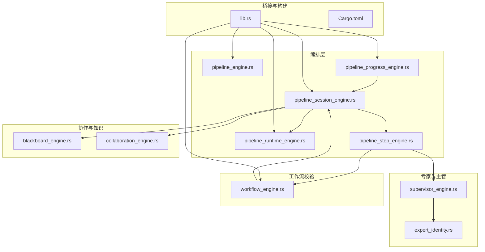

图表来源
- [pipeline_engine.rs:1-383](file://src-tauri/src/pipeline_engine.rs#L1-L383)
- [pipeline_runtime_engine.rs:1-153](file://src-tauri/src/pipeline_runtime_engine.rs#L1-L153)
- [pipeline_session_engine.rs:1-285](file://src-tauri/src/pipeline_session_engine.rs#L1-L285)
- [pipeline_step_engine.rs:1-171](file://src-tauri/src/pipeline_step_engine.rs#L1-L171)
- [pipeline_progress_engine.rs:1-63](file://src-tauri/src/pipeline_progress_engine.rs#L1-L63)
- [blackboard_engine.rs:1-130](file://src-tauri/src/blackboard_engine.rs#L1-L130)
- [collaboration_engine.rs:1-106](file://src-tauri/src/collaboration_engine.rs#L1-L106)
- [supervisor_engine.rs:1-175](file://src-tauri/src/supervisor_engine.rs#L1-L175)
- [expert_identity.rs:1-64](file://src-tauri/src/expert_identity.rs#L1-L64)
- [workflow_engine.rs:1-80](file://src-tauri/src/workflow_engine.rs#L1-L80)
- [lib.rs:1-120](file://src-tauri/src/lib.rs#L1-L120)
- [Cargo.toml:1-46](file://src-tauri/Cargo.toml#L1-L46)

章节来源
- [lib.rs:1-120](file://src-tauri/src/lib.rs#L1-L120)
- [Cargo.toml:1-46](file://src-tauri/Cargo.toml#L1-L46)

## 核心组件
- 管道引擎：根据场景与专家集合生成步骤布局与波次，支持代码开发、审查、研究、跨学科分析等场景。
- 管道运行时引擎：维护当前步骤索引、最大重试次数、重试计数与推进决策，提供“重试/跳过/中止/继续”等动作。
- 管道会话引擎：承载会话状态、黑板、已完成结果、待跟进任务与任务历史，提供执行回合计划与结果归档。
- 管道步骤引擎：负责步骤终局决策（协作门禁、黑板进度守卫）、主管中期检查请求构建与步骤完成请求组装。
- 黑板引擎：统一沉淀证据、文件变更提案、测试验证、审查决策与阻塞项，提供进度签名与空转检测。
- 协作引擎：为当前步骤与跟进回合生成专家任务载荷，维护已完成结果与待处理跟进。
- 主管引擎：构建派发计划、中期检查与评审摘要提示词，解析 JSON 输出并进行专家动态组合。
- 专家身份引擎：专家 ID 规范化、类别判定与能力支持判定。
- 工作流引擎：交付物分析、工作区预检、步骤/专家交付物门禁、动作参数解析与变更集抽取。
- 进度引擎：生成进度快照，汇总当前步骤专家、剩余专家与活跃任务摘要。
- 前端桥接：暴露 Tauri 命令，封装令牌用量统计、上下文拼装与响应封装。

章节来源
- [pipeline_engine.rs:1-383](file://src-tauri/src/pipeline_engine.rs#L1-L383)
- [pipeline_runtime_engine.rs:1-153](file://src-tauri/src/pipeline_runtime_engine.rs#L1-L153)
- [pipeline_session_engine.rs:1-285](file://src-tauri/src/pipeline_session_engine.rs#L1-L285)
- [pipeline_step_engine.rs:1-171](file://src-tauri/src/pipeline_step_engine.rs#L1-L171)
- [blackboard_engine.rs:1-130](file://src-tauri/src/blackboard_engine.rs#L1-L130)
- [collaboration_engine.rs:1-106](file://src-tauri/src/collaboration_engine.rs#L1-L106)
- [supervisor_engine.rs:1-175](file://src-tauri/src/supervisor_engine.rs#L1-L175)
- [expert_identity.rs:1-64](file://src-tauri/src/expert_identity.rs#L1-L64)
- [workflow_engine.rs:1-80](file://src-tauri/src/workflow_engine.rs#L1-L80)
- [pipeline_progress_engine.rs:1-63](file://src-tauri/src/pipeline_progress_engine.rs#L1-L63)
- [lib.rs:1-120](file://src-tauri/src/lib.rs#L1-L120)

## 架构总览
工作流引擎以“场景-步骤-回合-任务”为主线，结合黑板与主管监督形成闭环：
- 场景输入经主管引擎解析为派发计划（场景、任务描述、专家集合、设计需求等）。
- 管道引擎将计划转化为步骤布局与波次，运行时引擎据此推进。
- 会话引擎承载状态，协作引擎为每轮生成专家任务，黑板引擎持续沉淀证据与阻塞。
- 步骤引擎在每步终局进行交付物门禁与黑板进度守卫，必要时触发主管中期检查。
- 最终评审由主管引擎汇总专家输出，进行事实校验与自然语言总结。

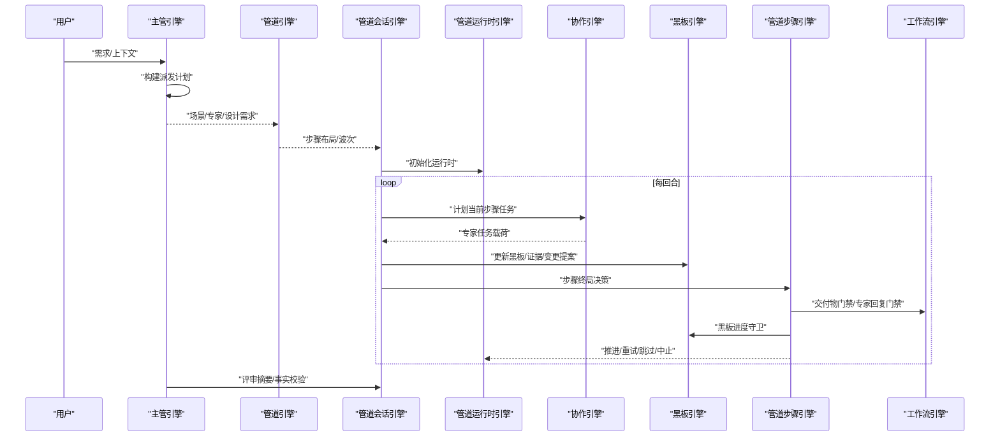

图表来源
- [supervisor_engine.rs:171-204](file://src-tauri/src/supervisor_engine.rs#L171-L204)
- [pipeline_engine.rs:359-383](file://src-tauri/src/pipeline_engine.rs#L359-L383)
- [pipeline_session_engine.rs:113-147](file://src-tauri/src/pipeline_session_engine.rs#L113-L147)
- [pipeline_runtime_engine.rs:39-153](file://src-tauri/src/pipeline_runtime_engine.rs#L39-L153)
- [collaboration_engine.rs:263-295](file://src-tauri/src/collaboration_engine.rs#L263-L295)
- [blackboard_engine.rs:132-333](file://src-tauri/src/blackboard_engine.rs#L132-L333)
- [pipeline_step_engine.rs:73-171](file://src-tauri/src/pipeline_step_engine.rs#L73-L171)
- [workflow_engine.rs:448-582](file://src-tauri/src/workflow_engine.rs#L448-L582)

## 详细组件分析

### 管道引擎（场景与步骤布局）
- 职责：根据场景与专家集合生成步骤布局与波次，描述各阶段协作方式。
- 关键点：
  - 代码开发场景自动拆解为“调研/设计/实现/审查”，并保持实现与审查分离。
  - 跨学科分析与技术研究场景按主学科-辅助学科-审查的顺序组织。
  - 支持“可选”标记（如搜索型研究），用于指导专家执行策略。
- 数据结构：PipelinePlanInput、PipelineStepLayout、DispatchWaveLayout、PipelineLayout。

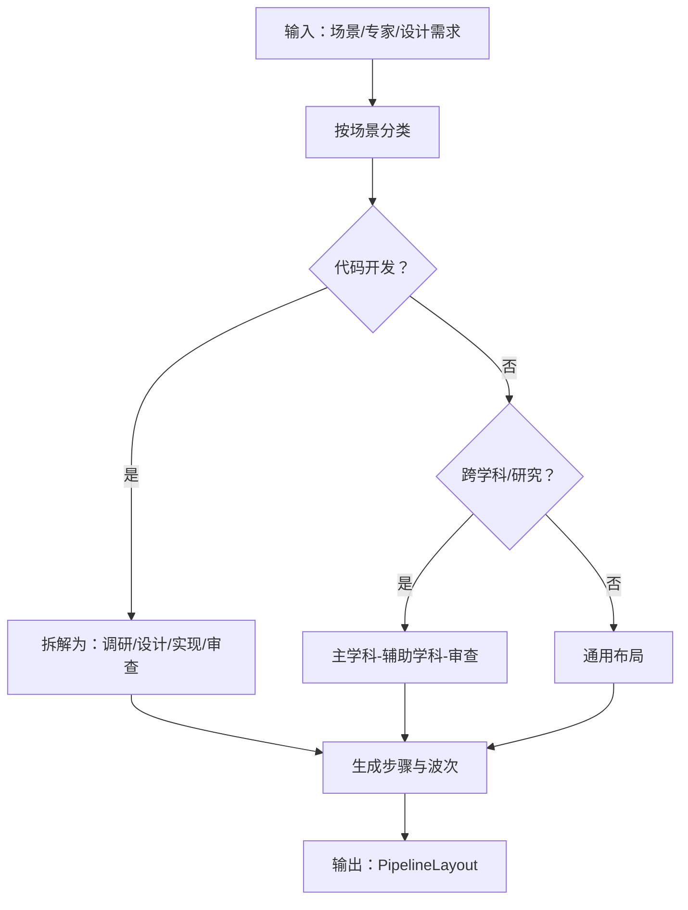

图表来源
- [pipeline_engine.rs:107-188](file://src-tauri/src/pipeline_engine.rs#L107-L188)
- [pipeline_engine.rs:190-278](file://src-tauri/src/pipeline_engine.rs#L190-L278)
- [pipeline_engine.rs:280-289](file://src-tauri/src/pipeline_engine.rs#L280-L289)
- [pipeline_engine.rs:291-357](file://src-tauri/src/pipeline_engine.rs#L291-L357)
- [pipeline_engine.rs:359-383](file://src-tauri/src/pipeline_engine.rs#L359-L383)

章节来源
- [pipeline_engine.rs:1-383](file://src-tauri/src/pipeline_engine.rs#L1-L383)

### 管道运行时引擎（状态与推进）
- 职责：维护当前步骤索引、最大重试次数、重试计数，依据动作推进状态。
- 关键点：
  - 动作类型：retry/artifact-missing/skip-next/abort/continue。
  - 超限重试触发“breaker”推进，避免空转。
  - 艺术创作/文档/测试/审查等角色输出会影响黑板与守卫逻辑。
- 数据结构：PipelineRuntimeState、PipelineRuntimeInitRequest、PipelineRuntimeDecisionRequest、PipelineRuntimeTransition。

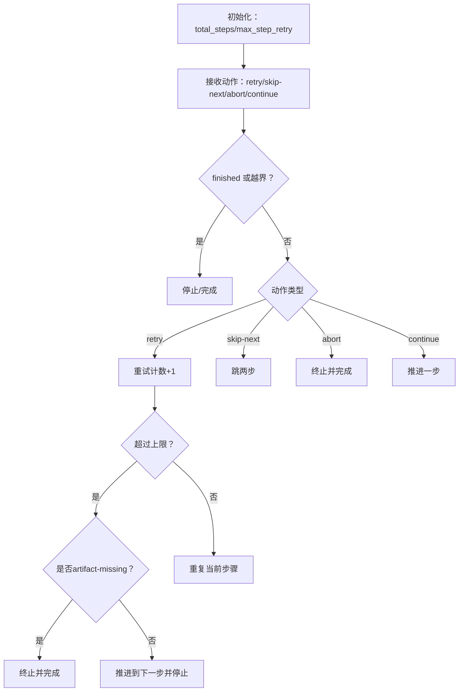

图表来源
- [pipeline_runtime_engine.rs:39-153](file://src-tauri/src/pipeline_runtime_engine.rs#L39-L153)

章节来源
- [pipeline_runtime_engine.rs:1-153](file://src-tauri/src/pipeline_runtime_engine.rs#L1-L153)

### 管道会话引擎（生命周期与回合计划）
- 职责：承载会话状态、黑板、已完成结果、待跟进任务与任务历史；生成当前回合与跟进回合计划。
- 关键点：
  - 初始化与引导：bootstrap_pipeline_session 同步布局与状态。
  - 当前回合计划：根据步骤专家集合与黑板上下文生成任务。
  - 跟进回合计划：仅针对当前步骤相关专家与当前黑板上下文。
  - 结果归档：apply_pipeline_task_outcome 归档输出、更新黑板与消费跟进。
- 数据结构：PipelineSessionState、PipelineSessionInitRequest、PipelineExecutionRoundPlan、PipelineFollowupExecutionRoundPlan、PipelineTaskOutcome。

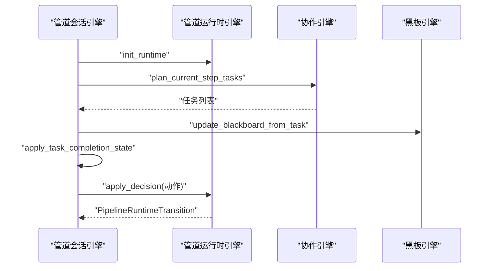

图表来源
- [pipeline_session_engine.rs:113-147](file://src-tauri/src/pipeline_session_engine.rs#L113-L147)
- [pipeline_session_engine.rs:149-185](file://src-tauri/src/pipeline_session_engine.rs#L149-L185)
- [pipeline_session_engine.rs:187-199](file://src-tauri/src/pipeline_session_engine.rs#L187-L199)
- [pipeline_session_engine.rs:212-264](file://src-tauri/src/pipeline_session_engine.rs#L212-L264)
- [collaboration_engine.rs:263-295](file://src-tauri/src/collaboration_engine.rs#L263-L295)
- [blackboard_engine.rs:132-280](file://src-tauri/src/blackboard_engine.rs#L132-L280)

章节来源
- [pipeline_session_engine.rs:1-285](file://src-tauri/src/pipeline_session_engine.rs#L1-L285)
- [collaboration_engine.rs:1-295](file://src-tauri/src/collaboration_engine.rs#L1-L295)
- [blackboard_engine.rs:1-280](file://src-tauri/src/blackboard_engine.rs#L1-L280)

### 管道步骤引擎（终局决策与主管检查）
- 职责：步骤终局决策、交付物门禁、黑板进度守卫、主管中期检查请求构建。
- 关键点：
  - 交付物门禁：根据步骤专家类型与输出内容判断是否需要真实落盘动作。
  - 黑板进度守卫：连续多轮无进展则中止，避免空转。
  - 主管中期检查：汇总已完成结果、剩余步骤与跟进上下文，决定 continue/retry/skip-next/abort。
- 数据结构：PipelineStepFinalizeRequest、PipelineStepFinalizeDecision、SupervisorStepResult。

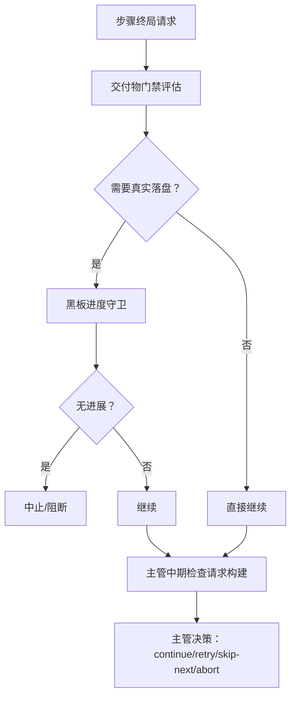

图表来源
- [pipeline_step_engine.rs:73-171](file://src-tauri/src/pipeline_step_engine.rs#L73-L171)
- [workflow_engine.rs:448-494](file://src-tauri/src/workflow_engine.rs#L448-L494)
- [blackboard_engine.rs:282-333](file://src-tauri/src/blackboard_engine.rs#L282-L333)
- [supervisor_engine.rs:194-204](file://src-tauri/src/supervisor_engine.rs#L194-L204)

章节来源
- [pipeline_step_engine.rs:1-171](file://src-tauri/src/pipeline_step_engine.rs#L1-L171)
- [workflow_engine.rs:448-494](file://src-tauri/src/workflow_engine.rs#L448-L494)
- [blackboard_engine.rs:282-333](file://src-tauri/src/blackboard_engine.rs#L282-L333)
- [supervisor_engine.rs:194-204](file://src-tauri/src/supervisor_engine.rs#L194-L204)

### 黑板引擎（知识沉淀与守卫）
- 职责：统一沉淀证据、文件变更提案、测试验证、审查决策与阻塞项；计算进度签名，空转检测。
- 关键点：
  - 证据提取：从专家输出中抽取文件变更与提及，维护必检/候选文件清单。
  - 测试与审查：解析测试命令与结果，记录审查决策与阻塞。
  - 进度签名：基于多项指标生成签名，连续无进展则守卫中止。
- 数据结构：BlackboardTask、EvidenceItem、PatchProposal、ValidationRun、ReviewDecision、BlackboardProgressDecision。

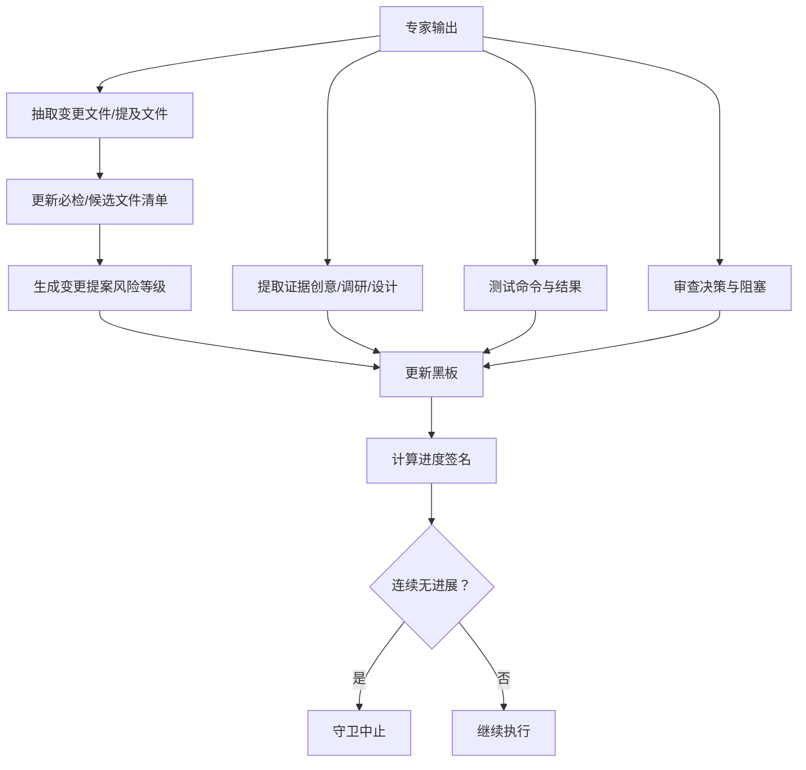

图表来源
- [blackboard_engine.rs:132-333](file://src-tauri/src/blackboard_engine.rs#L132-L333)

章节来源
- [blackboard_engine.rs:1-333](file://src-tauri/src/blackboard_engine.rs#L1-L333)

### 协作引擎（任务载荷与状态）
- 职责：为当前步骤与跟进回合生成专家任务载荷；维护已完成结果与待处理跟进。
- 关键点：
  - 任务载荷：合并基础任务描述、跟进上下文与黑板上下文。
  - 跟进消费：专家完成任务后标记消费，避免重复下发。
- 数据结构：ExpertTaskBuildRequest/Response、TaskCompletionStateRequest/Response、FollowupRoundPlanRequest/Response、StepTaskPlanRequest/Response。

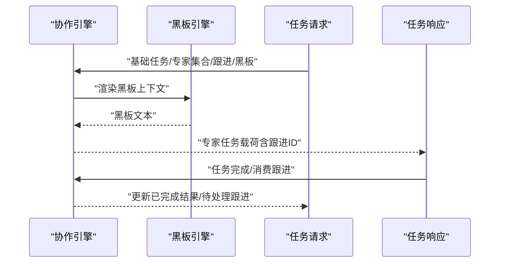

图表来源
- [collaboration_engine.rs:139-214](file://src-tauri/src/collaboration_engine.rs#L139-L214)
- [blackboard_engine.rs:335-447](file://src-tauri/src/blackboard_engine.rs#L335-L447)

章节来源
- [collaboration_engine.rs:1-295](file://src-tauri/src/collaboration_engine.rs#L1-L295)
- [blackboard_engine.rs:335-447](file://src-tauri/src/blackboard_engine.rs#L335-L447)

### 主管引擎（派发与监督）
- 职责：构建派发计划、中期检查与评审摘要提示词；解析 JSON 输出并进行专家动态组合。
- 关键点：
  - 派发计划：根据场景与关键词动态选择专家，限制人数并考虑职责触发概率。
  - 中期检查：基于已完成结果、剩余步骤与跟进上下文，决定继续/重试/跳过/中止。
  - 评审摘要：对专家输出进行事实校验与自然语言总结。
- 数据结构：SupervisorDispatchPlan、MidCheckRequest/Decision、FollowupIntentRequest/Decision。

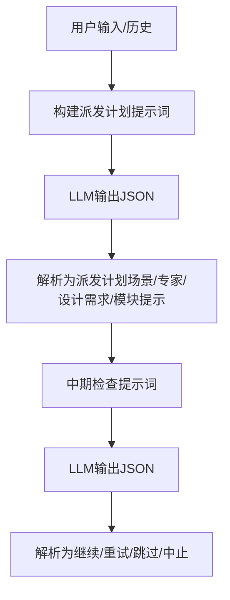

图表来源
- [supervisor_engine.rs:118-175](file://src-tauri/src/supervisor_engine.rs#L118-L175)
- [supervisor_engine.rs:194-204](file://src-tauri/src/supervisor_engine.rs#L194-L204)
- [supervisor_engine.rs:361-449](file://src-tauri/src/supervisor_engine.rs#L361-L449)

章节来源
- [supervisor_engine.rs:1-449](file://src-tauri/src/supervisor_engine.rs#L1-L449)

### 专家身份引擎（ID 规范化与类别判定）
- 职责：专家 ID 规范化、类别判定（实现/审查/创意/文档）、能力支持判定。
- 数据结构：专家 ID 映射表与判定函数。

章节来源
- [expert_identity.rs:1-64](file://src-tauri/src/expert_identity.rs#L1-L64)

### 工作流引擎（交付物与门禁）
- 职责：交付物分析、工作区预检、步骤/专家交付物门禁、动作参数解析与变更集抽取。
- 关键点：
  - 交付物分析：统计解析动作数量、结构化变更数量、所需文件与可执行变更。
  - 门禁：设计/实现/审查不同阶段对真实落盘动作的要求不同。
  - 动作解析：支持多种 ACTION/结构化变更格式与参数解析。
- 数据结构：WorkflowInputSource、WorkflowChangeSet、DeliveryAnalysis、StepDeliverableGuardRequest/Decision、ExpertReplyGuardRequest/Decision。

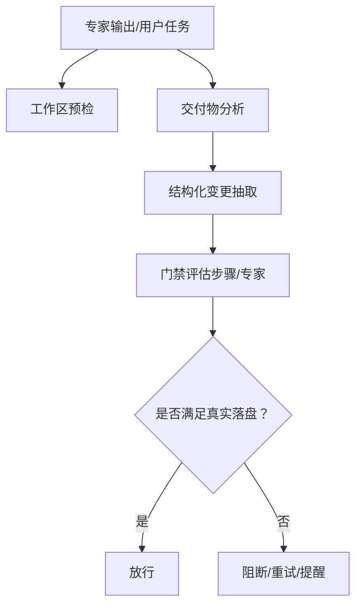

图表来源
- [workflow_engine.rs:282-341](file://src-tauri/src/workflow_engine.rs#L282-L341)
- [workflow_engine.rs:448-582](file://src-tauri/src/workflow_engine.rs#L448-L582)
- [workflow_engine.rs:584-786](file://src-tauri/src/workflow_engine.rs#L584-L786)

章节来源
- [workflow_engine.rs:1-786](file://src-tauri/src/workflow_engine.rs#L1-L786)

### 进度引擎（快照与报告）
- 职责：生成进度快照，汇总当前步骤专家、剩余专家与活跃任务摘要。
- 数据结构：PipelineProgressSnapshotRequest、PipelineProgressSnapshot、PipelineProgressTask、PipelineProgressExpertLabel。

章节来源
- [pipeline_progress_engine.rs:1-213](file://src-tauri/src/pipeline_progress_engine.rs#L1-L213)

### 前端桥接与命令导出
- 职责：暴露 Tauri 命令，封装令牌用量统计、上下文拼装与响应封装。
- 关键点：
  - 工作区预检与交付物分析命令。
  - 主管分析/评审/快速问答等命令。
  - 令牌用量追加与配额守卫。
- 数据结构：Envelope 类型与上下文封装。

章节来源
- [lib.rs:707-800](file://src-tauri/src/lib.rs#L707-L800)
- [lib.rs:1-120](file://src-tauri/src/lib.rs#L1-L120)

## 依赖分析
- 模块耦合：
  - pipeline_* 与 collaboration/blackboard 紧密协作，形成“布局-任务-结果-黑板”的闭环。
  - workflow_engine 与 pipeline_step_engine 在交付物门禁处耦合。
  - supervisor_engine 与 expert_identity 协作进行专家动态组合。
- 外部依赖：
  - 令牌用量统计、SQLite、HTTP 客户端、正则表达式、异步运行时等。

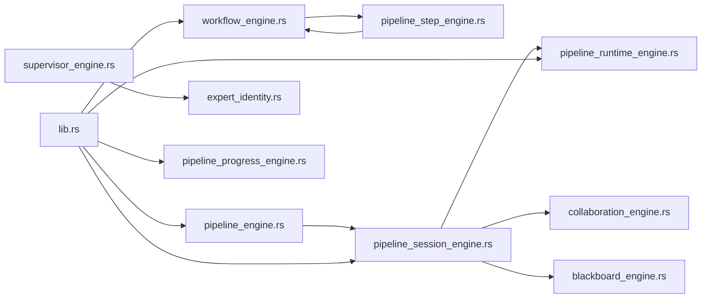

图表来源
- [workflow_engine.rs:1-80](file://src-tauri/src/workflow_engine.rs#L1-L80)
- [pipeline_step_engine.rs:1-171](file://src-tauri/src/pipeline_step_engine.rs#L1-L171)
- [pipeline_session_engine.rs:1-147](file://src-tauri/src/pipeline_session_engine.rs#L1-L147)
- [pipeline_runtime_engine.rs:1-47](file://src-tauri/src/pipeline_runtime_engine.rs#L1-L47)
- [collaboration_engine.rs:1-106](file://src-tauri/src/collaboration_engine.rs#L1-L106)
- [blackboard_engine.rs:1-130](file://src-tauri/src/blackboard_engine.rs#L1-L130)
- [pipeline_engine.rs:1-106](file://src-tauri/src/pipeline_engine.rs#L1-L106)
- [supervisor_engine.rs:1-106](file://src-tauri/src/supervisor_engine.rs#L1-L106)
- [expert_identity.rs:1-64](file://src-tauri/src/expert_identity.rs#L1-L64)
- [lib.rs:1-120](file://src-tauri/src/lib.rs#L1-L120)
- [pipeline_progress_engine.rs:1-63](file://src-tauri/src/pipeline_progress_engine.rs#L1-L63)

章节来源
- [Cargo.toml:20-46](file://src-tauri/Cargo.toml#L20-L46)

## 性能考量
- 并行执行：当步骤专家数大于 1 时，执行模式为并行，提升吞吐；注意资源竞争与黑板一致性。
- 重试与 breaker：合理设置 max_step_retry，避免无限重试导致空转；artifact-missing 超限时直接推进。
- 正则与文本解析：动作解析与文件变更抽取使用正则，建议在高频路径缓存编译后的正则对象。
- 黑板签名：进度签名基于多项指标，避免频繁重建快照；可按轮次或阈值触发。
- I/O 与数据库：令牌用量与历史记录写入 SQLite，建议批量写入与连接池复用。

## 故障排查指南
- 交付物门禁阻断
  - 症状：步骤被阻断，提示缺少真实落盘动作。
  - 排查：确认专家输出是否包含可执行 ACTION/结构化变更；检查是否为近似/截断补丁。
  - 参考：evaluate_step_deliverable_guard、evaluate_expert_reply_guard。
- 黑板空转守卫
  - 症状：连续多轮无进展，流程被中止。
  - 排查：查看黑板证据/文件清单/变更动作/审查进展是否增长。
  - 参考：advance_blackboard_progress。
- 运行时推进异常
  - 症状：重试超限或推进不符合预期。
  - 排查：检查 max_step_retry 配置、动作类型与当前步骤专家集合。
  - 参考：apply_decision。
- 主管中期检查误判
  - 症状：主管建议重试/跳过/中止不合理。
  - 排查：核对已完成结果摘要、剩余步骤描述与跟进上下文。
  - 参考：build_mid_check_prompt、parse_mid_check_decision。
- 工作区预检失败
  - 症状：工作区接入状态检查失败。
  - 排查：确认关键文件存在与内容匹配，检查路径规范化。
  - 参考：verify_workspace_delivery。

章节来源
- [workflow_engine.rs:448-582](file://src-tauri/src/workflow_engine.rs#L448-L582)
- [blackboard_engine.rs:282-333](file://src-tauri/src/blackboard_engine.rs#L282-L333)
- [pipeline_runtime_engine.rs:39-153](file://src-tauri/src/pipeline_runtime_engine.rs#L39-L153)
- [supervisor_engine.rs:194-359](file://src-tauri/src/supervisor_engine.rs#L194-L359)
- [lib.rs:394-413](file://src-tauri/src/lib.rs#L394-L413)

## 结论
本工作流引擎以场景驱动的管道编排为核心，结合黑板知识沉淀与主管监督，形成“可执行、可追踪、可守卫”的闭环。通过严格的交付物门禁与进度守卫，有效避免空转与无效输出；通过并行执行与合理的重试策略，兼顾效率与鲁棒性。建议在生产环境中配合令牌用量监控、日志采样与告警策略，持续优化专家组合与模块提示。

## 附录
- 使用模式与示例（以路径引用代替代码）
  - 创建派发计划：[supervisor_analyze_dispatch:733-788](file://src-tauri/src/lib.rs#L733-L788)
  - 分析专家交付物：[analyze_agent_delivery:717-730](file://src-tauri/src/lib.rs#L717-L730)
  - 工作区预检：[verify_workspace_delivery:708-714](file://src-tauri/src/lib.rs#L708-L714)
  - 步骤终局决策：[finalize_step_without_supervisor:73-171](file://src-tauri/src/pipeline_step_engine.rs#L73-L171)
  - 会话初始化与回合计划：[bootstrap_pipeline_session:130-147](file://src-tauri/src/pipeline_session_engine.rs#L130-L147)、[get_current_execution_round_plan:149-185](file://src-tauri/src/pipeline_session_engine.rs#L149-L185)
  - 进度快照：[build_progress_snapshot:43-63](file://src-tauri/src/pipeline_progress_engine.rs#L43-L63)