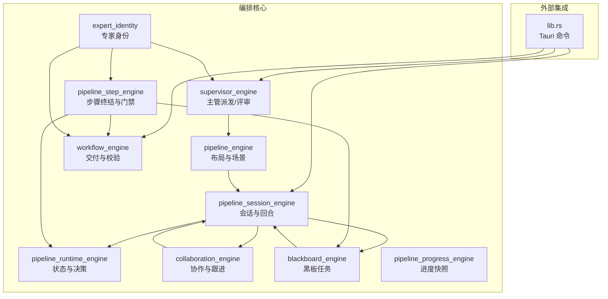
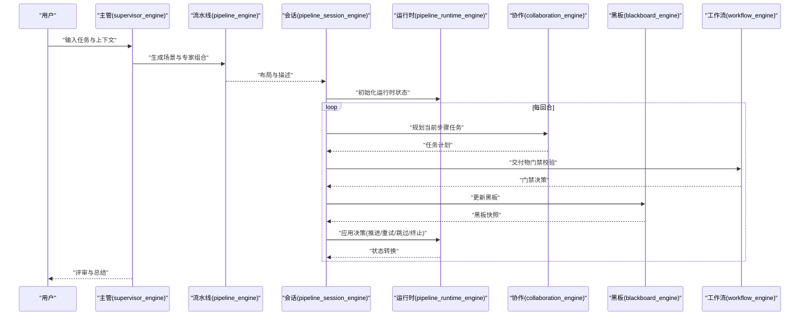
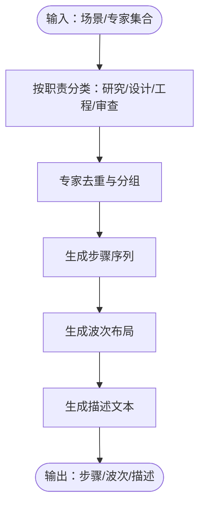
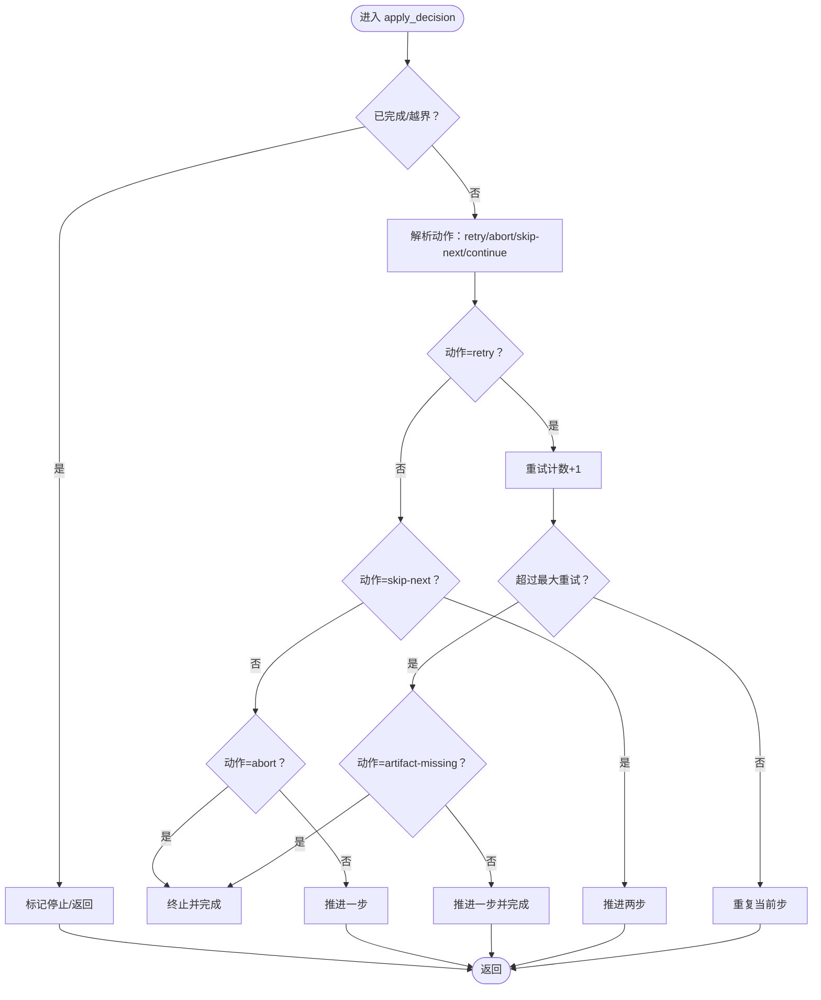
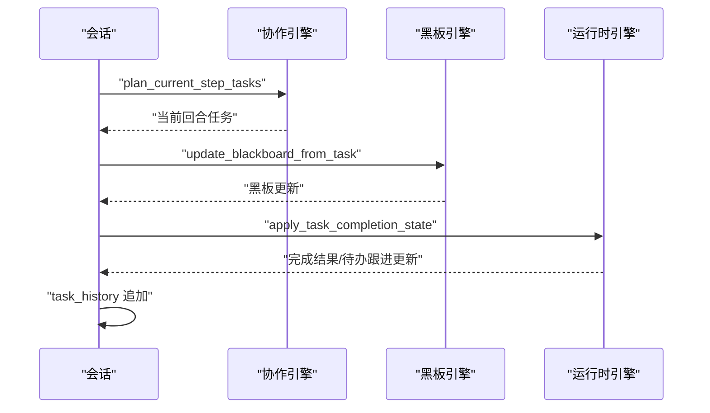
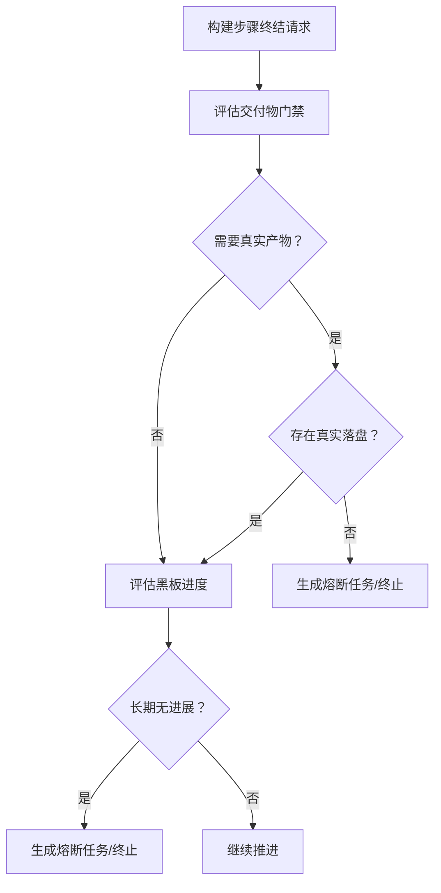
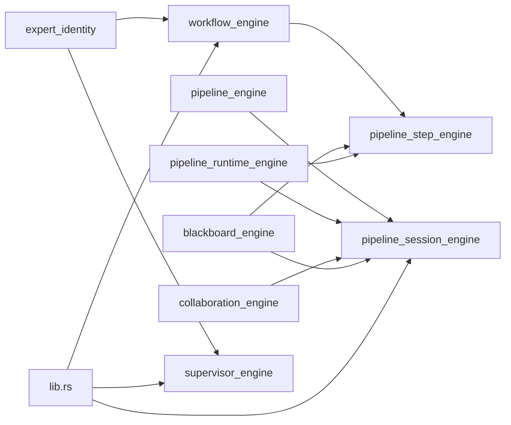

# 工作流编排

<cite>
**本文引用的文件**
- [workflow_engine.rs](file://src-tauri/src/workflow_engine.rs)
- [pipeline_engine.rs](file://src-tauri/src/pipeline_engine.rs)
- [pipeline_runtime_engine.rs](file://src-tauri/src/pipeline_runtime_engine.rs)
- [pipeline_session_engine.rs](file://src-tauri/src/pipeline_session_engine.rs)
- [pipeline_step_engine.rs](file://src-tauri/src/pipeline_step_engine.rs)
- [collaboration_engine.rs](file://src-tauri/src/collaboration_engine.rs)
- [blackboard_engine.rs](file://src-tauri/src/blackboard_engine.rs)
- [supervisor_engine.rs](file://src-tauri/src/supervisor_engine.rs)
- [pipeline_progress_engine.rs](file://src-tauri/src/pipeline_progress_engine.rs)
- [expert_identity.rs](file://src-tauri/src/expert_identity.rs)
- [lib.rs](file://src-tauri/src/lib.rs)
</cite>

## 目录
1. [引言](#引言)
2. [项目结构](#项目结构)
3. [核心组件](#核心组件)
4. [架构总览](#架构总览)
5. [详细组件分析](#详细组件分析)
6. [依赖分析](#依赖分析)
7. [性能考量](#性能考量)
8. [故障排查指南](#故障排查指南)
9. [结论](#结论)
10. [附录](#附录)

## 引言
本技术文档围绕“工作流编排系统”展开，系统以“专家流水线”为核心，结合“主管决策”“协作门禁”“黑板任务”“进度快照”等模块，形成从任务定义、节点关系映射、依赖解析、生命周期管理到并发控制与故障恢复的完整闭环。文档重点解释：
- 工作流定义与节点关系映射（场景、步骤、波次）
- 生命周期管理（创建、启动、推进、暂停/重试/跳过/终止）
- 并发控制与任务调度（串行/并行、重试上限、熔断与推进）
- 配置项与扩展点（场景类型、专家职责、提示模块）
- 监控指标与错误处理（进度快照、阻塞器、熔断器）
- 实际执行模式与交付校验（ACTION 语法、变更集解析、工作区预检）

## 项目结构
系统采用模块化 Rust 设计，核心模块如下：
- 流水线定义与布局：pipeline_engine
- 运行时状态与决策：pipeline_runtime_engine
- 会话与回合计划：pipeline_session_engine
- 步骤终结与门禁：pipeline_step_engine
- 专家协作与跟进：collaboration_engine
- 黑板任务与进度：blackboard_engine
- 主管派发与评审：supervisor_engine
- 进度快照与可视化：pipeline_progress_engine
- 专家身份与职责：expert_identity
- 工作流交付与校验：workflow_engine
- Tauri 命令与集成：lib.rs

**图表来源**
- [lib.rs:37-52](file://src-tauri/src/lib.rs#L37-L52)
- [pipeline_engine.rs:1-60](file://src-tauri/src/pipeline_engine.rs#L1-L60)
- [pipeline_runtime_engine.rs:1-47](file://src-tauri/src/pipeline_runtime_engine.rs#L1-L47)
- [pipeline_session_engine.rs:1-50](file://src-tauri/src/pipeline_session_engine.rs#L1-L50)
- [pipeline_step_engine.rs:1-25](file://src-tauri/src/pipeline_step_engine.rs#L1-L25)
- [collaboration_engine.rs:1-25](file://src-tauri/src/collaboration_engine.rs#L1-L25)
- [blackboard_engine.rs:1-65](file://src-tauri/src/blackboard_engine.rs#L1-L65)
- [supervisor_engine.rs:1-55](file://src-tauri/src/supervisor_engine.rs#L1-L55)
- [pipeline_progress_engine.rs:1-41](file://src-tauri/src/pipeline_progress_engine.rs#L1-L41)
- [workflow_engine.rs:1-38](file://src-tauri/src/workflow_engine.rs#L1-L38)
- [expert_identity.rs:1-22](file://src-tauri/src/expert_identity.rs#L1-L22)

**章节来源**
- [lib.rs:37-52](file://src-tauri/src/lib.rs#L37-L52)
- [pipeline_engine.rs:1-60](file://src-tauri/src/pipeline_engine.rs#L1-L60)
- [pipeline_runtime_engine.rs:1-47](file://src-tauri/src/pipeline_runtime_engine.rs#L1-L47)
- [pipeline_session_engine.rs:1-50](file://src-tauri/src/pipeline_session_engine.rs#L1-L50)
- [pipeline_step_engine.rs:1-25](file://src-tauri/src/pipeline_step_engine.rs#L1-L25)
- [collaboration_engine.rs:1-25](file://src-tauri/src/collaboration_engine.rs#L1-L25)
- [blackboard_engine.rs:1-65](file://src-tauri/src/blackboard_engine.rs#L1-L65)
- [supervisor_engine.rs:1-55](file://src-tauri/src/supervisor_engine.rs#L1-L55)
- [pipeline_progress_engine.rs:1-41](file://src-tauri/src/pipeline_progress_engine.rs#L1-L41)
- [workflow_engine.rs:1-38](file://src-tauri/src/workflow_engine.rs#L1-L38)
- [expert_identity.rs:1-22](file://src-tauri/src/expert_identity.rs#L1-L22)

## 核心组件
- 流水线布局与场景（pipeline_engine）
  - 输入：场景、任务描述、专家集合、是否需要设计
  - 输出：步骤序列与波次布局，描述文本
  - 关键逻辑：按场景拆解步骤，专家归类与去重，构建描述
- 运行时状态与决策（pipeline_runtime_engine）
  - 输入：初始化请求（总步数、最大重试）
  - 输出：当前状态、推进/重试/跳过/终止决策
  - 关键逻辑：重试计数、超限熔断、推进步数
- 会话与回合计划（pipeline_session_engine）
  - 输入：布局、黑板、待办跟进、最大重试
  - 输出：当前回合计划（串行/并行）、完成结果、任务历史
  - 关键逻辑：当前步骤任务规划、跟进回合计划、状态更新
- 步骤终结与门禁（pipeline_step_engine）
  - 输入：步骤任务快照、黑板、专家结果、剩余步骤描述
  - 输出：黑板更新、运行时转换、阻塞任务、主管介入请求
  - 关键逻辑：交付物门禁、黑板进度判定、熔断与推进
- 专家协作与跟进（collaboration_engine）
  - 输入：专家任务构建请求、完成状态请求
  - 输出：专家任务文本、跟进任务计划、完成结果更新
  - 关键逻辑：按专家筛选跟进、任务摘要与状态合并
- 黑板任务与进度（blackboard_engine）
  - 输入：专家任务摘要、工作区文件、变更文件
  - 输出：黑板任务、变更提案、阻塞器、进度签名
  - 关键逻辑：变更文件提取与去重、风险评估、阻塞判定
- 主管派发与评审（supervisor_engine）
  - 输入：可用专家、任务上下文、中期检查请求
  - 输出：派发计划、评审回复、中期检查决策
  - 关键逻辑：职责触发概率、场景适配、中期检查 JSON 决策
- 进度快照与可视化（pipeline_progress_engine）
  - 输入：活动任务、当前步骤专家、计划专家、专家标签
  - 输出：进度报告、当前步骤摘要、剩余专家摘要、活动任务摘要
  - 关键逻辑：状态图标化、摘要截断、统计计数
- 专家身份与职责（expert_identity）
  - 输入：专家 ID
  - 输出：标准化 ID、是否审查/实现/创意/文档等
  - 关键逻辑：ID 归一化、学科类别判定
- 工作流交付与校验（workflow_engine）
  - 输入：专家输出源、用户任务、工作区路径
  - 输出：交付分析、变更集、工作区预检、门禁决策
  - 关键逻辑：ACTION 语法解析、变更集抽取、工作区一致性校验

**章节来源**
- [pipeline_engine.rs:107-188](file://src-tauri/src/pipeline_engine.rs#L107-L188)
- [pipeline_runtime_engine.rs:39-153](file://src-tauri/src/pipeline_runtime_engine.rs#L39-L153)
- [pipeline_session_engine.rs:113-278](file://src-tauri/src/pipeline_session_engine.rs#L113-L278)
- [pipeline_step_engine.rs:73-159](file://src-tauri/src/pipeline_step_engine.rs#L73-L159)
- [collaboration_engine.rs:108-206](file://src-tauri/src/collaboration_engine.rs#L108-L206)
- [blackboard_engine.rs:132-200](file://src-tauri/src/blackboard_engine.rs#L132-L200)
- [supervisor_engine.rs:108-200](file://src-tauri/src/supervisor_engine.rs#L108-L200)
- [pipeline_progress_engine.rs:43-150](file://src-tauri/src/pipeline_progress_engine.rs#L43-L150)
- [expert_identity.rs:3-64](file://src-tauri/src/expert_identity.rs#L3-L64)
- [workflow_engine.rs:282-582](file://src-tauri/src/workflow_engine.rs#L282-L582)

## 架构总览
系统以“主管-流水线-专家”三层协同为核心：
- 主管层：根据用户意图与专家画像生成场景与专家组合，提供中期检查与评审
- 流水线层：将场景分解为步骤与波次，驱动会话与回合，维护运行时状态
- 专家层：执行任务、产出变更、更新黑板、响应跟进

**图表来源**
- [supervisor_engine.rs:108-200](file://src-tauri/src/supervisor_engine.rs#L108-L200)
- [pipeline_engine.rs:359-383](file://src-tauri/src/pipeline_engine.rs#L359-L383)
- [pipeline_session_engine.rs:113-185](file://src-tauri/src/pipeline_session_engine.rs#L113-L185)
- [pipeline_runtime_engine.rs:39-153](file://src-tauri/src/pipeline_runtime_engine.rs#L39-L153)
- [collaboration_engine.rs:139-206](file://src-tauri/src/collaboration_engine.rs#L139-L206)
- [blackboard_engine.rs:132-200](file://src-tauri/src/blackboard_engine.rs#L132-L200)
- [workflow_engine.rs:448-494](file://src-tauri/src/workflow_engine.rs#L448-L494)

## 详细组件分析

### 流水线布局与场景（pipeline_engine）
- 设计要点
  - 场景到步骤的映射：代码开发、学科分析、技术调研、带搜索调研、通用场景
  - 专家分类：研究、设计、工程、审查，自动分组与去重
  - 描述生成：根据步骤集合生成自然语言描述，指导主管与用户理解
- 关键流程
  - 输入场景与专家集合，按职责类型拆解步骤
  - 生成步骤与波次布局，描述文本用于主管派发与用户沟通
- 复杂度与优化
  - 时间复杂度：O(n)，n 为专家数量；空间复杂度：O(n)
  - 优化：去重与分类在单次遍历中完成，减少多次扫描

**图表来源**
- [pipeline_engine.rs:107-188](file://src-tauri/src/pipeline_engine.rs#L107-L188)
- [pipeline_engine.rs:359-383](file://src-tauri/src/pipeline_engine.rs#L359-L383)

**章节来源**
- [pipeline_engine.rs:107-188](file://src-tauri/src/pipeline_engine.rs#L107-L188)
- [pipeline_engine.rs:291-357](file://src-tauri/src/pipeline_engine.rs#L291-L357)
- [pipeline_engine.rs:359-383](file://src-tauri/src/pipeline_engine.rs#L359-L383)

### 运行时状态与决策（pipeline_runtime_engine）
- 设计要点
  - 初始化：设置当前步索引、总步数、最大重试次数、完成标志
  - 决策：支持 retry/artifact-missing/skip-next/abort/continue
  - 超限熔断：超过最大重试次数时强制推进或终止
- 关键流程
  - 接收决策请求，更新重试计数
  - 根据动作类型决定是否重复当前步、推进步数、终止
  - 返回状态转换与熔断消息

**图表来源**
- [pipeline_runtime_engine.rs:49-153](file://src-tauri/src/pipeline_runtime_engine.rs#L49-L153)

**章节来源**
- [pipeline_runtime_engine.rs:39-153](file://src-tauri/src/pipeline_runtime_engine.rs#L39-L153)

### 会话与回合计划（pipeline_session_engine）
- 设计要点
  - 初始化：创建会话状态，包含流水线布局、运行时状态、黑板、完成结果、待办跟进、任务历史
  - 回合计划：根据当前步骤专家集合与黑板，生成当前回合任务与执行模式（串行/并行）
  - 跟进回合：基于待办跟进生成后续任务
  - 状态更新：应用任务结果，更新黑板、完成结果、任务历史
- 关键流程
  - 获取当前回合计划：查询当前步骤任务、执行模式、完成结果
  - 获取跟进回合计划：查询当前步骤的跟进任务
  - 应用任务结果：更新黑板、完成结果、任务历史

**图表来源**
- [pipeline_session_engine.rs:149-210](file://src-tauri/src/pipeline_session_engine.rs#L149-L210)
- [pipeline_session_engine.rs:212-278](file://src-tauri/src/pipeline_session_engine.rs#L212-L278)
- [collaboration_engine.rs:139-206](file://src-tauri/src/collaboration_engine.rs#L139-L206)
- [blackboard_engine.rs:132-200](file://src-tauri/src/blackboard_engine.rs#L132-L200)

**章节来源**
- [pipeline_session_engine.rs:113-278](file://src-tauri/src/pipeline_session_engine.rs#L113-L278)
- [collaboration_engine.rs:139-206](file://src-tauri/src/collaboration_engine.rs#L139-L206)
- [blackboard_engine.rs:132-200](file://src-tauri/src/blackboard_engine.rs#L132-L200)

### 步骤终结与门禁（pipeline_step_engine）
- 设计要点
  - 交付物门禁：针对设计/实现/审查等不同职责，校验是否存在真实落盘动作
  - 黑板进度：若长期无进展，触发熔断
  - 运行时转换：根据门禁与进度决策，返回推进/重试/终止
- 关键流程
  - 构建步骤终结请求：包含场景、任务描述、步骤专家、黑板、完成结果、剩余步骤描述、跟进上下文
  - 评估门禁：检查是否存在真实落盘动作，是否需要真实产物
  - 更新黑板与运行时：根据门禁与进度，返回熔断任务与运行时转换

**图表来源**
- [pipeline_step_engine.rs:73-159](file://src-tauri/src/pipeline_step_engine.rs#L73-L159)
- [workflow_engine.rs:448-494](file://src-tauri/src/workflow_engine.rs#L448-L494)
- [blackboard_engine.rs:132-200](file://src-tauri/src/blackboard_engine.rs#L132-L200)

**章节来源**
- [pipeline_step_engine.rs:73-159](file://src-tauri/src/pipeline_step_engine.rs#L73-L159)
- [workflow_engine.rs:448-494](file://src-tauri/src/workflow_engine.rs#L448-L494)

### 专家协作与跟进（collaboration_engine）
- 设计要点
  - 专家任务构建：根据专家 ID、当前步骤专家、待办跟进、黑板上下文生成任务文本
  - 完成状态更新：合并专家输出，更新完成结果与待办跟进
  - 跟进任务计划：按专家筛选当前步骤或下一相关步骤的跟进任务
- 关键流程
  - 专家任务构建：拼接任务描述、跟进上下文、黑板上下文
  - 完成状态更新：查找或新增专家结果，更新待办跟进消费状态
  - 跟进回合计划：筛选符合专家与交付模式的跟进任务

**章节来源**
- [collaboration_engine.rs:108-206](file://src-tauri/src/collaboration_engine.rs#L108-L206)

### 黑板任务与进度（blackboard_engine）
- 设计要点
  - 变更文件提取：从专家输出中提取变更文件，去重并更新所需文件
  - 变更提案：根据输出类型与风险等级生成提案
  - 阻塞器：记录协作阻塞原因，触发熔断
  - 进度签名：记录进度状态，用于长期无进展判定
- 关键流程
  - 从任务摘要更新黑板：提取变更文件、更新所需文件、生成变更提案
  - 进度推进：根据场景推进黑板进度，可能触发熔断

**章节来源**
- [blackboard_engine.rs:132-200](file://src-tauri/src/blackboard_engine.rs#L132-L200)

### 主管派发与评审（supervisor_engine）
- 设计要点
  - 派发计划：根据专家画像与任务上下文生成场景、专家组合、是否需要设计、提示模块
  - 中期检查：基于当前步骤、剩余专家、进度报告生成 JSON 决策
  - 评审回复：生成面向用户的自然语言评审摘要
- 关键流程
  - 构建主管提示：专家列表、场景说明、派发要求、能力模块提示
  - 中期检查提示：当前步骤、剩余专家、进度报告、专家信息
  - 评审提示：面向用户的结果摘要

**章节来源**
- [supervisor_engine.rs:108-200](file://src-tauri/src/supervisor_engine.rs#L108-L200)
- [supervisor_engine.rs:195-200](file://src-tauri/src/supervisor_engine.rs#L195-L200)

### 进度快照与可视化（pipeline_progress_engine）
- 设计要点
  - 进度报告：将活动任务状态图标化，生成简洁报告
  - 专家摘要：当前步骤专家与计划专家的标签化摘要
  - 活动任务摘要：截断输出/错误/输入，生成简要摘要
- 关键流程
  - 构建进度快照：汇总活动任务、当前步骤专家、计划专家、专家标签
  - 生成报告与摘要：状态统计、专家列表、任务摘要

**章节来源**
- [pipeline_progress_engine.rs:43-150](file://src-tauri/src/pipeline_progress_engine.rs#L43-L150)

### 专家身份与职责（expert_identity）
- 设计要点
  - ID 归一化：将别名映射为标准学科 ID
  - 职责判定：是否审查、实现、创意、文档等
  - 支持能力：是否支持源码读取与重写
- 关键流程
  - 归一化专家 ID
  - 分类判定与能力判定

**章节来源**
- [expert_identity.rs:3-64](file://src-tauri/src/expert_identity.rs#L3-L64)

### 工作流交付与校验（workflow_engine）
- 设计要点
  - 交付物门禁：针对设计/实现/审查等职责，校验是否存在真实落盘动作
  - 变更集解析：解析 ACTION 语法、结构化变更、代码块内容
  - 工作区预检：校验工作区接入完整性与全局替换状态
- 关键流程
  - 评估步骤交付物门禁：检查是否存在真实落盘动作
  - 评估专家回复门禁：检查是否越责、是否提供精确变更、是否为空口白话
  - 工作区预检：读取关键文件，校验接入与替换状态

**章节来源**
- [workflow_engine.rs:448-582](file://src-tauri/src/workflow_engine.rs#L448-L582)
- [workflow_engine.rs:282-341](file://src-tauri/src/workflow_engine.rs#L282-L341)

## 依赖分析
- 模块耦合
  - pipeline_session_engine 依赖 pipeline_engine、pipeline_runtime_engine、collaboration_engine、blackboard_engine
  - pipeline_step_engine 依赖 workflow_engine、blackboard_engine、pipeline_runtime_engine
  - collaboration_engine 依赖 blackboard_engine
  - supervisor_engine 依赖 expert_identity
  - workflow_engine 依赖 expert_identity
- 外部依赖
  - Tauri 命令：lib.rs 暴露工作流与流水线相关命令，供前端调用
- 循环依赖
  - 未发现循环依赖；模块间为单向依赖

**图表来源**
- [lib.rs:37-52](file://src-tauri/src/lib.rs#L37-L52)
- [pipeline_engine.rs:1-60](file://src-tauri/src/pipeline_engine.rs#L1-L60)
- [pipeline_runtime_engine.rs:1-47](file://src-tauri/src/pipeline_runtime_engine.rs#L1-L47)
- [pipeline_session_engine.rs:1-50](file://src-tauri/src/pipeline_session_engine.rs#L1-L50)
- [pipeline_step_engine.rs:1-25](file://src-tauri/src/pipeline_step_engine.rs#L1-L25)
- [collaboration_engine.rs:1-25](file://src-tauri/src/collaboration_engine.rs#L1-L25)
- [blackboard_engine.rs:1-65](file://src-tauri/src/blackboard_engine.rs#L1-L65)
- [supervisor_engine.rs:1-55](file://src-tauri/src/supervisor_engine.rs#L1-L55)
- [workflow_engine.rs:1-38](file://src-tauri/src/workflow_engine.rs#L1-L38)
- [expert_identity.rs:1-22](file://src-tauri/src/expert_identity.rs#L1-L22)

**章节来源**
- [lib.rs:37-52](file://src-tauri/src/lib.rs#L37-L52)

## 性能考量
- 时间复杂度
  - 流水线布局：O(n)，n 为专家数量
  - 运行时决策：O(1)，常量时间状态转换
  - 会话回合：O(m)，m 为当前回合任务数
  - 黑板更新：O(k)，k 为变更文件数
- 空间复杂度
  - 会话状态：O(t)，t 为任务历史长度
  - 黑板：O(f)，f 为所需文件与变更提案数量
- 优化建议
  - 专家去重与分类在布局阶段一次性完成，避免重复扫描
  - 任务摘要与黑板上下文截断，降低传输与渲染开销
  - 跟进任务按专家筛选，减少无效计算

[本节为通用性能讨论，不直接分析具体文件]

## 故障排查指南
- 交付物门禁
  - 症状：步骤被熔断，提示缺少真实交付物
  - 排查：确认专家输出是否包含真实落盘动作（ACTION 语法、结构化变更、代码块）
  - 处理：补充精确变更或调整专家职责
- 黑板长期无进展
  - 症状：进度报告提示长期无进展，触发熔断
  - 排查：检查黑板变更提案、所需文件是否被满足
  - 处理：补充变更或调整任务方向
- 专家越责
  - 症状：专家回复门禁提示越责修改，需要转交更匹配专家
  - 排查：检查专家职责触发概率与任务匹配度
  - 处理：调整专家组合或提供更明确的落盘指令
- 工作区预检失败
  - 症状：工作区预检返回未完整接入或替换残留
  - 排查：检查关键文件是否存在与接入状态
  - 处理：补齐接入或清理残留

**章节来源**
- [workflow_engine.rs:448-582](file://src-tauri/src/workflow_engine.rs#L448-L582)
- [blackboard_engine.rs:132-200](file://src-tauri/src/blackboard_engine.rs#L132-L200)
- [pipeline_runtime_engine.rs:64-107](file://src-tauri/src/pipeline_runtime_engine.rs#L64-L107)

## 结论
本工作流编排系统通过“主管-流水线-专家”三层协同，实现了从任务定义到执行推进、从并发控制到故障熔断的完整闭环。其核心优势在于：
- 清晰的场景到步骤映射与专家职责划分
- 基于门禁与黑板的交付物与进度保障
- 可扩展的提示模块与主管介入机制
- 可观测的进度快照与可追踪的任务历史

[本节为总结性内容，不直接分析具体文件]

## 附录

### 工作流生命周期管理
- 创建：生成流水线布局与会话状态
- 启动：初始化运行时状态，进入第一回合
- 推进：应用决策，推进步数或重试
- 暂停/重试/跳过/终止：根据门禁与进度决策执行
- 终止：完成或熔断后结束

**章节来源**
- [pipeline_session_engine.rs:113-185](file://src-tauri/src/pipeline_session_engine.rs#L113-L185)
- [pipeline_runtime_engine.rs:39-153](file://src-tauri/src/pipeline_runtime_engine.rs#L39-L153)

### 并发控制机制
- 串行/并行：根据当前步骤专家数量决定执行模式
- 重试上限：每步重试次数受 max_step_retry 控制
- 熔断推进：超过重试上限强制推进或终止
- 跟进回合：按专家筛选当前步骤或下一相关步骤的跟进任务

**章节来源**
- [pipeline_session_engine.rs:177-184](file://src-tauri/src/pipeline_session_engine.rs#L177-L184)
- [pipeline_runtime_engine.rs:64-107](file://src-tauri/src/pipeline_runtime_engine.rs#L64-L107)
- [collaboration_engine.rs:108-137](file://src-tauri/src/collaboration_engine.rs#L108-L137)

### 工作流配置选项与扩展接口
- 场景类型：code-development、code-review、disciplinary-analysis、technical-research、research-with-search、design、translation、writing、office、data-analysis、document-processing、media-creation、video-production、quick-answer
- 专家职责：研究、设计、工程、审查、创意、文档、数据、翻译
- 提示模块：code-tool-primer、web-search-guidance、command-guidance、document-tool-primer、media-tool-primer、video-workflow
- Tauri 命令：主管分析、工作区预检、专家任务执行、流水线回合结算等

**章节来源**
- [supervisor_engine.rs:9-28](file://src-tauri/src/supervisor_engine.rs#L9-L28)
- [supervisor_engine.rs:108-176](file://src-tauri/src/supervisor_engine.rs#L108-L176)
- [lib.rs:707-730](file://src-tauri/src/lib.rs#L707-L730)

### 监控指标与错误处理
- 监控指标：活动任务计数、当前步骤摘要、剩余专家摘要、活动任务摘要
- 错误处理：门禁熔断、黑板阻塞器、运行时超限推进、主管介入

**章节来源**
- [pipeline_progress_engine.rs:43-150](file://src-tauri/src/pipeline_progress_engine.rs#L43-L150)
- [pipeline_step_engine.rs:73-159](file://src-tauri/src/pipeline_step_engine.rs#L73-L159)
- [blackboard_engine.rs:132-200](file://src-tauri/src/blackboard_engine.rs#L132-L200)

### 实际执行模式与交付语法
- ACTION 语法：CREATE_FILE、WRITE_FILE、EDIT_FILE、READ_FILE 等
- 结构化变更：operation/path/searchText/replaceText/content/risk
- 代码块格式：支持 fenced 代码块与标注块
- 工作区预检：校验关键文件接入与替换状态

**章节来源**
- [workflow_engine.rs:715-786](file://src-tauri/src/workflow_engine.rs#L715-L786)
- [workflow_engine.rs:282-341](file://src-tauri/src/workflow_engine.rs#L282-L341)