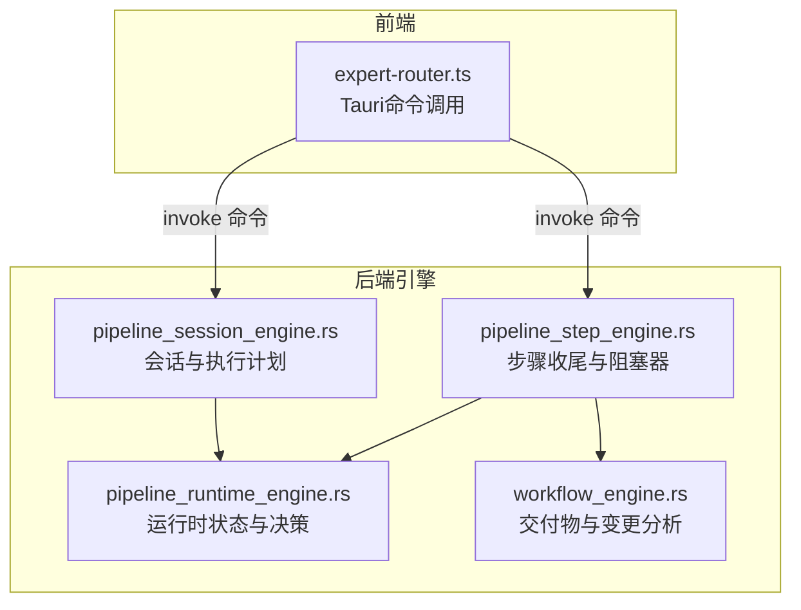
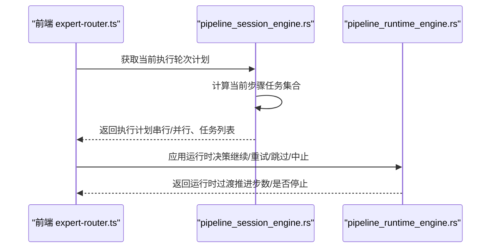
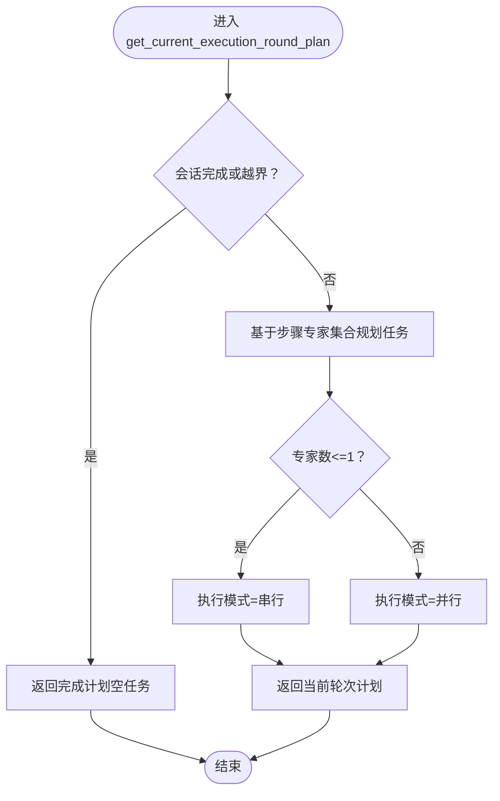
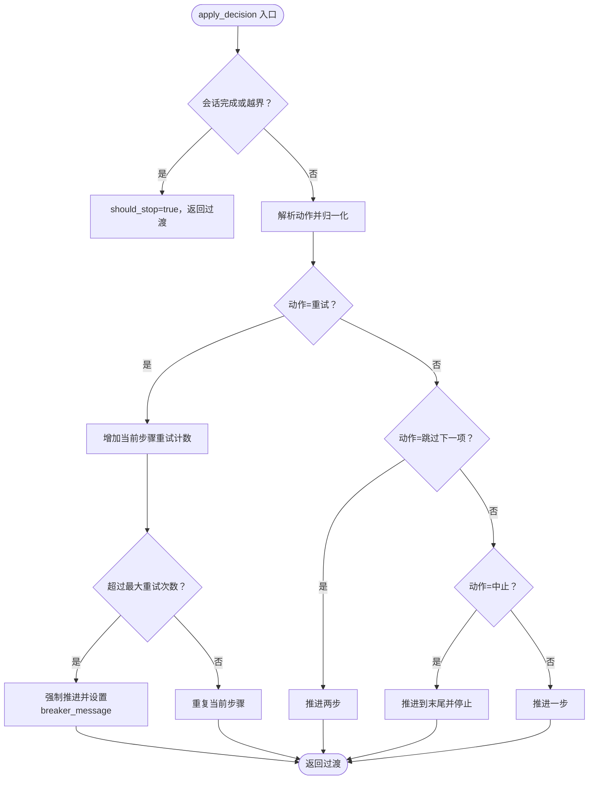
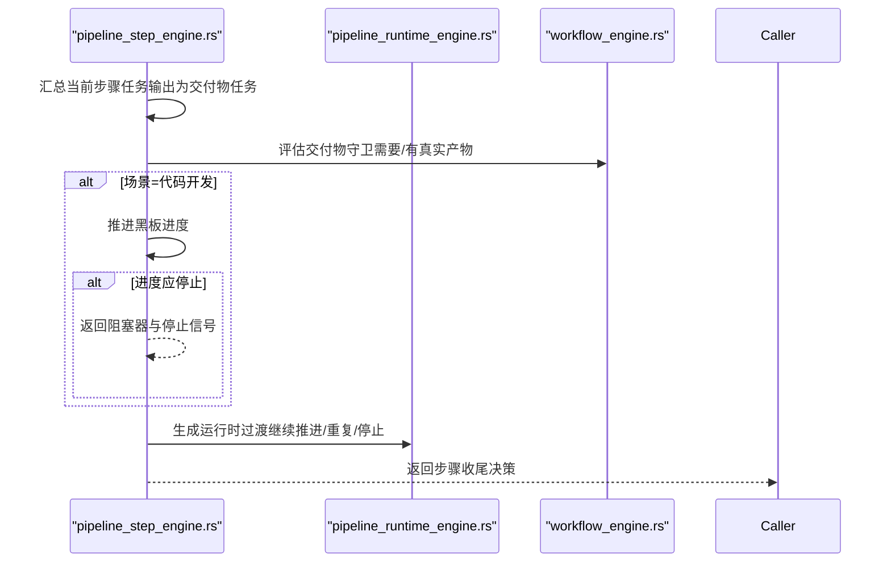
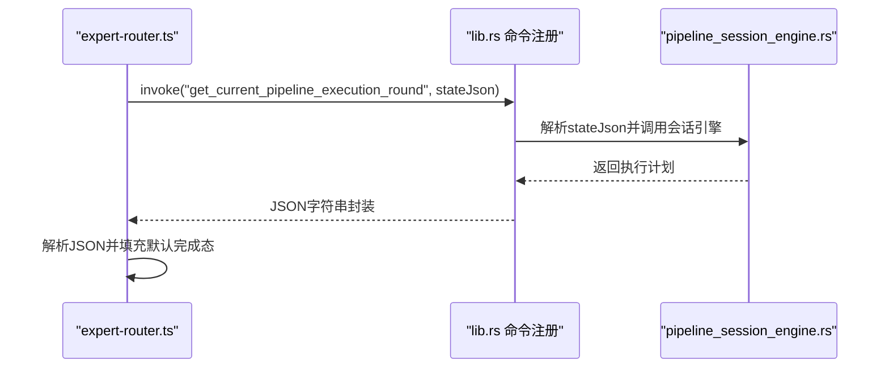
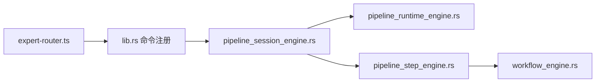

# 步骤执行

<cite>
**本文引用的文件**
- [pipeline_session_engine.rs](file://src-tauri/src/pipeline_session_engine.rs)
- [pipeline_runtime_engine.rs](file://src-tauri/src/pipeline_runtime_engine.rs)
- [pipeline_step_engine.rs](file://src-tauri/src/pipeline_step_engine.rs)
- [workflow_engine.rs](file://src-tauri/src/workflow_engine.rs)
- [expert-router.ts](file://src/expert-router.ts)
- [lib.rs](file://src-tauri/src/lib.rs)
</cite>

## 目录
1. [引言](#引言)
2. [项目结构](#项目结构)
3. [核心组件](#核心组件)
4. [架构总览](#架构总览)
5. [详细组件分析](#详细组件分析)
6. [依赖分析](#依赖分析)
7. [性能考虑](#性能考虑)
8. [故障排查指南](#故障排查指南)
9. [结论](#结论)
10. [附录：步骤定义与执行示例路径](#附录步骤定义与执行示例路径)

## 引言
本技术文档围绕“步骤执行系统”展开，目标是全面阐述步骤引擎的设计架构、步骤类型（同步、异步、条件、循环）、执行流程（验证、参数传递、调度、结果处理）、依赖关系管理（前置/后置校验、依赖链）、错误处理策略（重试、降级、异常传播），以及性能监控与资源消耗统计、执行时间分析方法。文档同时提供可追溯的代码示例路径，帮助读者快速定位实现细节。

## 项目结构
步骤执行系统主要由 Rust 后端引擎与前端路由桥接组成：
- 后端引擎
  - 流水线会话引擎：负责初始化会话状态、生成当前轮次执行计划（串行/并行）
  - 流水线运行时引擎：负责运行时状态管理与决策（前进/重试/跳过/中止）
  - 流水线步骤引擎：负责步骤收尾决策、黑板进度推进、阻塞器与主管介入
  - 工作流引擎：负责交付物提取与可执行变更集分析
- 前端桥接
  - 专家路由：通过 Tauri 命令调用后端，获取当前轮次执行计划与后续跟进轮次

图表来源
- [expert-router.ts:706-739](file://src/expert-router.ts#L706-L739)
- [pipeline_session_engine.rs:113-185](file://src-tauri/src/pipeline_session_engine.rs#L113-L185)
- [pipeline_runtime_engine.rs:1-153](file://src-tauri/src/pipeline_runtime_engine.rs#L1-L153)
- [pipeline_step_engine.rs:73-171](file://src-tauri/src/pipeline_step_engine.rs#L73-L171)
- [workflow_engine.rs:1291-1312](file://src-tauri/src/workflow_engine.rs#L1291-L1312)

章节来源
- [expert-router.ts:706-739](file://src/expert-router.ts#L706-L739)
- [pipeline_session_engine.rs:113-185](file://src-tauri/src/pipeline_session_engine.rs#L113-L185)
- [pipeline_runtime_engine.rs:1-153](file://src-tauri/src/pipeline_runtime_engine.rs#L1-L153)
- [pipeline_step_engine.rs:73-171](file://src-tauri/src/pipeline_step_engine.rs#L73-L171)
- [workflow_engine.rs:1291-1312](file://src-tauri/src/workflow_engine.rs#L1291-L1312)

## 核心组件
- 流水线会话引擎
  - 初始化会话状态、计算当前步骤任务集合、决定执行模式（串行/并行）
- 流水线运行时引擎
  - 维护运行时状态（当前步骤索引、最大重试次数、重试计数）
  - 基于动作（继续/重试/跳过下一项/中止）推进或回退
- 流水线步骤引擎
  - 结合任务输出评估交付物是否满足要求
  - 推进黑板进度，必要时返回阻塞器或触发主管介入
- 工作流引擎
  - 提取可执行变更集、结构化变更集与所需文件清单，用于交付物分析

章节来源
- [pipeline_session_engine.rs:113-185](file://src-tauri/src/pipeline_session_engine.rs#L113-L185)
- [pipeline_runtime_engine.rs:1-153](file://src-tauri/src/pipeline_runtime_engine.rs#L1-L153)
- [pipeline_step_engine.rs:73-171](file://src-tauri/src/pipeline_step_engine.rs#L73-L171)
- [workflow_engine.rs:1291-1312](file://src-tauri/src/workflow_engine.rs#L1291-L1312)

## 架构总览
步骤执行系统采用“前端驱动 + 后端引擎”的分层设计：
- 前端通过 Tauri 命令向后端查询当前轮次执行计划
- 后端根据会话状态与步骤配置生成任务列表与执行模式
- 执行完成后，后端返回步骤收尾决策（推进/重试/阻塞/中止）

图表来源
- [expert-router.ts:706-739](file://src/expert-router.ts#L706-L739)
- [pipeline_session_engine.rs:149-185](file://src-tauri/src/pipeline_session_engine.rs#L149-L185)
- [pipeline_runtime_engine.rs:49-153](file://src-tauri/src/pipeline_runtime_engine.rs#L49-L153)

## 详细组件分析

### 组件A：流水线会话引擎（执行计划与模式选择）
- 职责
  - 初始化会话状态与运行时状态
  - 基于当前步骤专家集合决定执行模式（单专家=串行，多专家=并行）
  - 生成当前步骤任务集合
- 关键点
  - 当前步骤索引越界或已完成时，返回完成态计划
  - 执行模式依据专家数量动态切换
  - 任务集合来源于步骤任务规划请求

图表来源
- [pipeline_session_engine.rs:149-185](file://src-tauri/src/pipeline_session_engine.rs#L149-L185)

章节来源
- [pipeline_session_engine.rs:113-185](file://src-tauri/src/pipeline_session_engine.rs#L113-L185)

### 组件B：流水线运行时引擎（决策与推进）
- 职责
  - 维护运行时状态（当前步骤索引、最大重试次数、重试计数）
  - 基于动作推进或回退（继续/重试/跳过下一项/中止）
  - 超过最大重试次数时，按规则强制推进并给出提示消息
- 关键点
  - 动作大小写不敏感，统一归一化处理
  - “重试”超过阈值时，生成“强制推进”提示
  - “跳过下一项”推进两步；默认推进一步

图表来源
- [pipeline_runtime_engine.rs:49-153](file://src-tauri/src/pipeline_runtime_engine.rs#L49-L153)

章节来源
- [pipeline_runtime_engine.rs:1-153](file://src-tauri/src/pipeline_runtime_engine.rs#L1-L153)

### 组件C：流水线步骤引擎（收尾与阻塞）
- 职责
  - 将当前步骤任务输出汇总为交付物任务输入
  - 评估交付物守卫（是否需要真实产物、是否有真实产物）
  - 在特定场景（如代码开发场景）推进黑板进度，必要时返回阻塞器
  - 若需主管介入，封装主管动作与原因
- 关键点
  - 黑板进度推进在代码开发场景下触发
  - 阻塞器携带专家标识、标题与错误信息
  - 支持从运行时状态转换为过渡对象

图表来源
- [pipeline_step_engine.rs:73-171](file://src-tauri/src/pipeline_step_engine.rs#L73-L171)
- [workflow_engine.rs:1291-1312](file://src-tauri/src/workflow_engine.rs#L1291-L1312)
- [pipeline_runtime_engine.rs:161-171](file://src-tauri/src/pipeline_runtime_engine.rs#L161-L171)

章节来源
- [pipeline_step_engine.rs:73-171](file://src-tauri/src/pipeline_step_engine.rs#L73-L171)
- [workflow_engine.rs:1291-1312](file://src-tauri/src/workflow_engine.rs#L1291-L1312)
- [pipeline_runtime_engine.rs:161-171](file://src-tauri/src/pipeline_runtime_engine.rs#L161-L171)

### 组件D：前端桥接（Tauri命令）
- 职责
  - 通过 invoke 调用后端命令，获取当前轮次执行计划与后续跟进轮次
  - 对返回的 JSON 进行解析，若为空则回退到完成态计划
- 关键点
  - 将会话状态序列化为 JSON 传入后端
  - 对“当前轮次”和“跟进轮次”分别进行查询

图表来源
- [expert-router.ts:706-739](file://src/expert-router.ts#L706-L739)
- [lib.rs:1253-1266](file://src-tauri/src/lib.rs#L1253-L1266)
- [pipeline_session_engine.rs:149-185](file://src-tauri/src/pipeline_session_engine.rs#L149-L185)

章节来源
- [expert-router.ts:706-739](file://src/expert-router.ts#L706-L739)
- [lib.rs:1253-1266](file://src-tauri/src/lib.rs#L1253-L1266)

## 依赖分析
- 组件耦合
  - 会话引擎依赖运行时引擎的状态与决策能力
  - 步骤引擎依赖会话引擎的任务规划结果与运行时状态
  - 步骤引擎依赖工作流引擎的交付物守卫评估
  - 前端通过 Tauri 命令依赖后端命令注册
- 外部依赖
  - Tauri invoke 机制用于前后端通信
  - JSON 序列化/反序列化用于跨边界数据传输

图表来源
- [expert-router.ts:706-739](file://src/expert-router.ts#L706-L739)
- [lib.rs:1253-1266](file://src-tauri/src/lib.rs#L1253-L1266)
- [pipeline_session_engine.rs:113-185](file://src-tauri/src/pipeline_session_engine.rs#L113-L185)
- [pipeline_runtime_engine.rs:1-153](file://src-tauri/src/pipeline_runtime_engine.rs#L1-L153)
- [pipeline_step_engine.rs:73-171](file://src-tauri/src/pipeline_step_engine.rs#L73-L171)
- [workflow_engine.rs:1291-1312](file://src-tauri/src/workflow_engine.rs#L1291-L1312)

章节来源
- [expert-router.ts:706-739](file://src/expert-router.ts#L706-L739)
- [lib.rs:1253-1266](file://src-tauri/src/lib.rs#L1253-L1266)

## 性能考虑
- 并行执行模式
  - 当步骤专家数大于 1 时采用并行模式，提升吞吐量
- 重试与强制推进
  - 通过最大重试次数限制空转风险，超限后强制推进避免死锁
- 交付物守卫
  - 通过守卫评估减少无效执行，确保产出质量
- 监控建议
  - 记录每步执行耗时、重试次数、推进步数与阻塞器触发次数
  - 统计黑板进度推进频率与阻塞器命中率，识别协作瓶颈

## 故障排查指南
- 常见问题
  - 步骤长时间无进展：检查黑板进度推进逻辑与阻塞器返回
  - 重试过多仍失败：确认最大重试次数设置与强制推进提示
  - 交付物不符合要求：核查交付物守卫评估与任务输出
- 定位方法
  - 查看运行时过渡中的 breaker_message 与 should_stop 标记
  - 检查步骤收尾决策中的 supervisor_action/supervisor_reason
  - 确认前端 invoke 返回的执行计划是否符合预期

章节来源
- [pipeline_runtime_engine.rs:62-82](file://src-tauri/src/pipeline_runtime_engine.rs#L62-L82)
- [pipeline_step_engine.rs:120-144](file://src-tauri/src/pipeline_step_engine.rs#L120-L144)
- [lib.rs:1253-1266](file://src-tauri/src/lib.rs#L1253-L1266)

## 结论
步骤执行系统通过“会话-运行时-步骤-工作流”四层引擎协同，结合前端 Tauri 命令桥接，实现了对步骤的全生命周期管理。系统支持多种执行模式、完善的重试与强制推进策略、交付物守卫与黑板协作阻塞机制，并具备清晰的前后端交互路径。建议在生产环境中配合性能监控与日志审计，持续优化执行效率与稳定性。

## 附录：步骤定义与执行示例路径
以下为可直接定位到实现细节的代码路径（仅列出路径，不展示具体代码内容）：
- 当前轮次执行计划获取
  - [expert-router.ts:706-739](file://src/expert-router.ts#L706-L739)
  - [lib.rs:1253-1266](file://src-tauri/src/lib.rs#L1253-L1266)
  - [pipeline_session_engine.rs:149-185](file://src-tauri/src/pipeline_session_engine.rs#L149-L185)
- 运行时决策与推进
  - [pipeline_runtime_engine.rs:49-153](file://src-tauri/src/pipeline_runtime_engine.rs#L49-L153)
- 步骤收尾与阻塞器
  - [pipeline_step_engine.rs:73-171](file://src-tauri/src/pipeline_step_engine.rs#L73-L171)
  - [pipeline_step_engine.rs:120-144](file://src-tauri/src/pipeline_step_engine.rs#L120-L144)
- 交付物守卫与变更分析
  - [workflow_engine.rs:1291-1312](file://src-tauri/src/workflow_engine.rs#L1291-L1312)
  - [workflow_engine.rs:1360-1382](file://src-tauri/src/workflow_engine.rs#L1360-L1382)
  - [workflow_engine.rs:1523-1551](file://src-tauri/src/workflow_engine.rs#L1523-L1551)