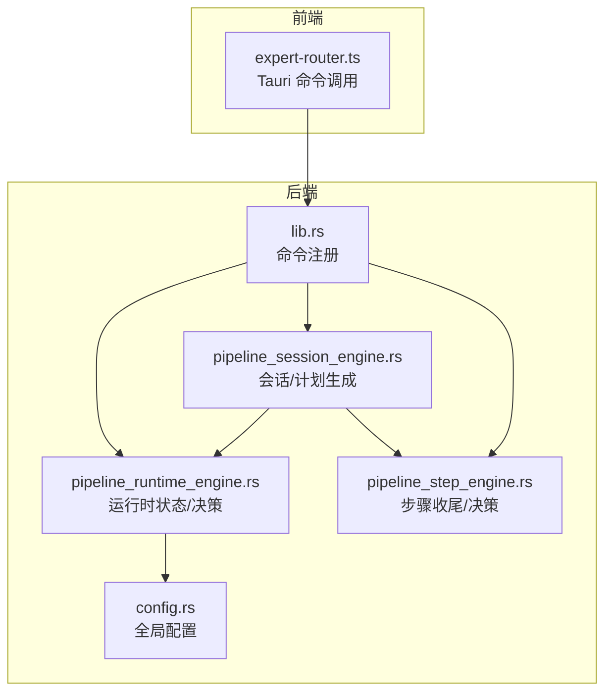
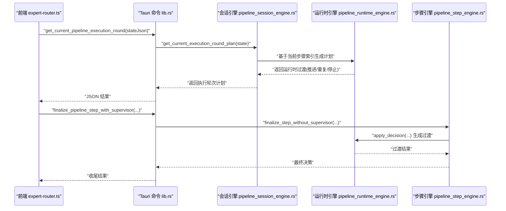
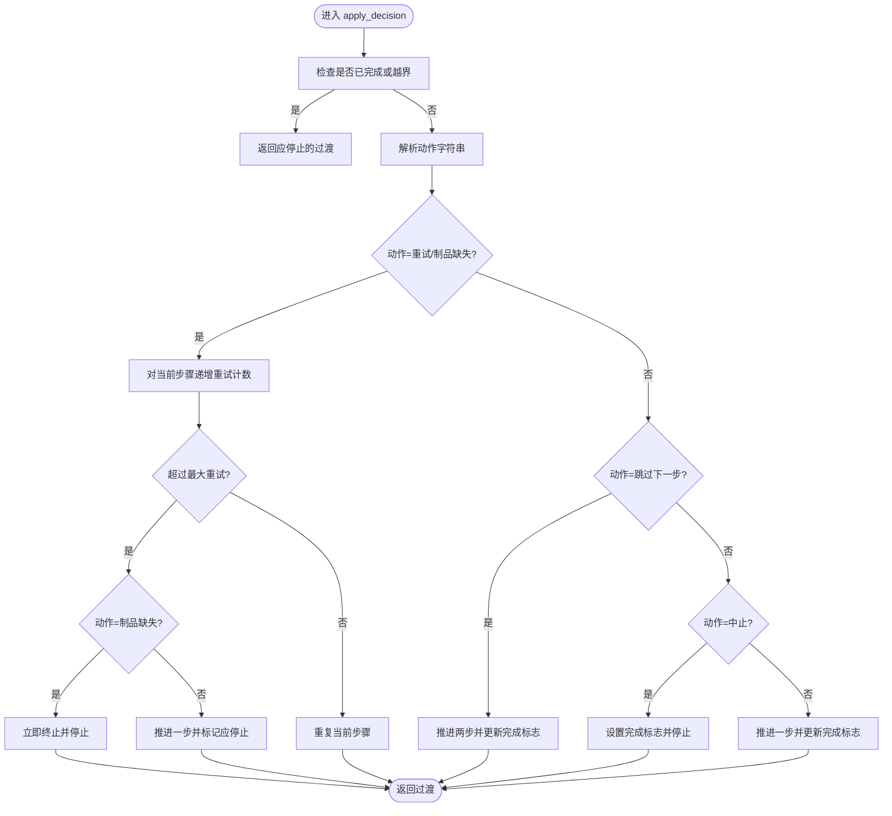
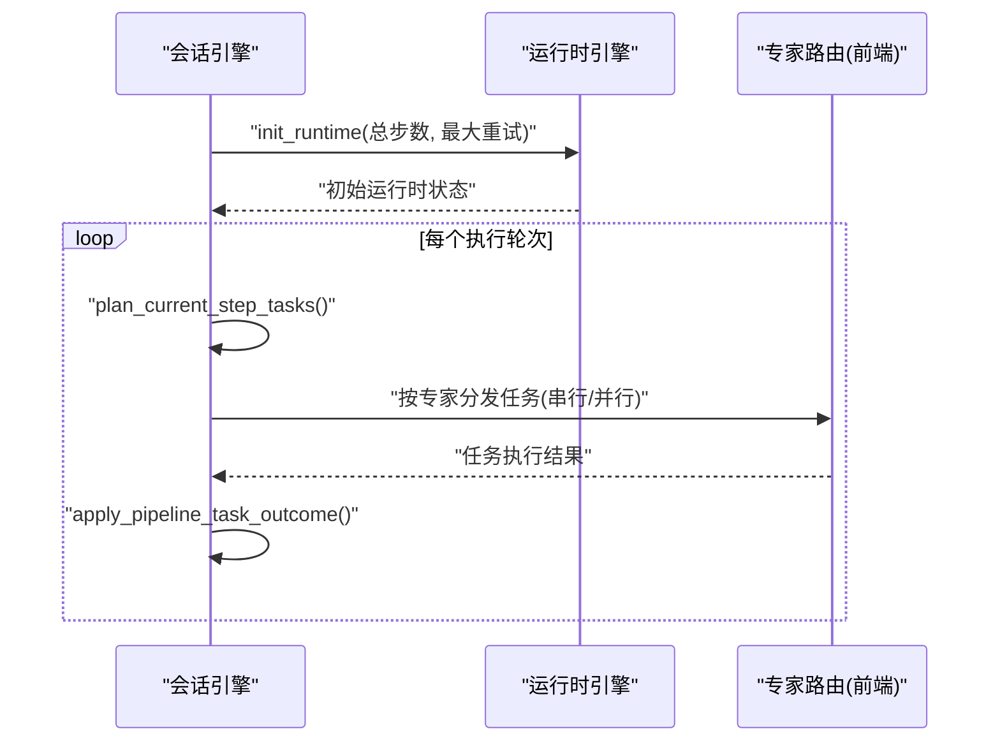
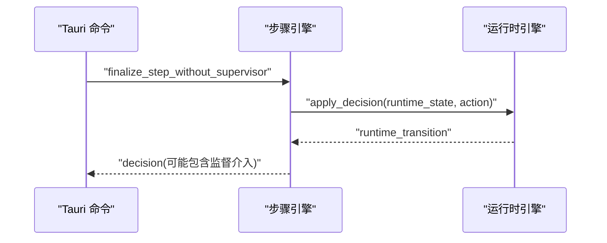
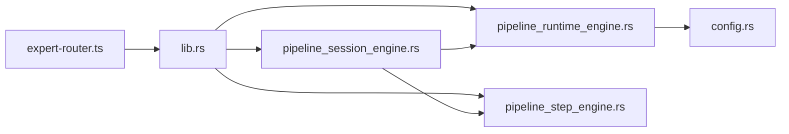

# 管道管理

<cite>
**本文引用的文件**
- [pipeline_runtime_engine.rs](file://src-tauri/src/pipeline_runtime_engine.rs)
- [pipeline_session_engine.rs](file://src-tauri/src/pipeline_session_engine.rs)
- [pipeline_step_engine.rs](file://src-tauri/src/pipeline_step_engine.rs)
- [expert-router.ts](file://src/expert-router.ts)
- [lib.rs](file://src-tauri/src/lib.rs)
- [config.rs](file://src-tauri/src/config.rs)
</cite>

## 目录
1. [引言](#引言)
2. [项目结构](#项目结构)
3. [核心组件](#核心组件)
4. [架构总览](#架构总览)
5. [详细组件分析](#详细组件分析)
6. [依赖关系分析](#依赖关系分析)
7. [性能考虑](#性能考虑)
8. [故障排查指南](#故障排查指南)
9. [结论](#结论)
10. [附录](#附录)

## 引言
本文件面向“管道管理系统”的技术文档，聚焦于管道引擎的设计与实现，涵盖以下主题：
- 管道引擎的整体架构与数据模型
- 管道定义与执行模型：步骤布局、专家编排、任务计划
- 运行时引擎：实例化、状态管理、决策与推进
- 生命周期管理：创建、初始化、执行监控、销毁
- 并行执行机制：任务分割、负载均衡、同步协调
- 配置参数、性能调优与扩展点
- 错误处理、异常恢复与监控告警
- 实际示例路径：展示如何定义、执行与查询状态

## 项目结构
本仓库中与“管道管理”直接相关的后端模块主要位于 src-tauri/src 下，前端与后端交互通过 Tauri 命令桥接。核心文件如下：
- 运行时引擎：pipeline_runtime_engine.rs
- 会话引擎：pipeline_session_engine.rs
- 步骤引擎：pipeline_step_engine.rs
- 前端路由与命令桥接：expert-router.ts
- Tauri 命令注册：lib.rs
- 全局配置：config.rs

图表来源
- [lib.rs:1-200](file://src-tauri/src/lib.rs#L1-L200)
- [pipeline_runtime_engine.rs:1-153](file://src-tauri/src/pipeline_runtime_engine.rs#L1-L153)
- [pipeline_session_engine.rs:113-210](file://src-tauri/src/pipeline_session_engine.rs#L113-L210)
- [pipeline_step_engine.rs:146-171](file://src-tauri/src/pipeline_step_engine.rs#L146-L171)
- [config.rs:150-170](file://src-tauri/src/config.rs#L150-L170)

章节来源
- [lib.rs:1-200](file://src-tauri/src/lib.rs#L1-L200)
- [pipeline_runtime_engine.rs:1-153](file://src-tauri/src/pipeline_runtime_engine.rs#L1-L153)
- [pipeline_session_engine.rs:113-210](file://src-tauri/src/pipeline_session_engine.rs#L113-L210)
- [pipeline_step_engine.rs:146-171](file://src-tauri/src/pipeline_step_engine.rs#L146-L171)
- [config.rs:150-170](file://src-tauri/src/config.rs#L150-L170)

## 核心组件
- 运行时引擎（pipeline_runtime_engine.rs）
  - 负责维护当前步骤索引、总步数、最大重试次数、每步重试计数、完成标志等状态
  - 提供初始化与决策应用函数，支持“重试/跳过下一步/中止/默认推进”等动作
- 会话引擎（pipeline_session_engine.rs）
  - 维护一次管道执行的完整上下文：管道标识、场景、任务描述、步骤布局、黑板、已完成结果、待跟进任务、历史记录
  - 提供会话初始化、执行轮次计划生成、跟进轮次计划生成、任务结果应用等能力
- 步骤引擎（pipeline_step_engine.rs）
  - 在步骤收尾阶段进行最终决策，结合运行时过渡结果决定是否停止、是否阻塞、是否需要主管介入
- 前端桥接（expert-router.ts）
  - 通过 Tauri 命令向后端查询当前执行轮次计划、跟进轮次计划等
- 命令注册（lib.rs）
  - 将后端逻辑暴露为 Tauri 命令，供前端调用
- 全局配置（config.rs）
  - 定义各类运行时配置项，如重试策略、超时、输出限制等

章节来源
- [pipeline_runtime_engine.rs:1-153](file://src-tauri/src/pipeline_runtime_engine.rs#L1-L153)
- [pipeline_session_engine.rs:113-210](file://src-tauri/src/pipeline_session_engine.rs#L113-L210)
- [pipeline_step_engine.rs:146-171](file://src-tauri/src/pipeline_step_engine.rs#L146-L171)
- [expert-router.ts:706-739](file://src/expert-router.ts#L706-L739)
- [lib.rs:1253-1266](file://src-tauri/src/lib.rs#L1253-L1266)
- [config.rs:150-170](file://src-tauri/src/config.rs#L150-L170)

## 架构总览
下图展示了从前端到后端的典型调用链路，以及各引擎之间的协作关系。

图表来源
- [expert-router.ts:706-739](file://src/expert-router.ts#L706-L739)
- [lib.rs:1253-1266](file://src-tauri/src/lib.rs#L1253-L1266)
- [pipeline_session_engine.rs:149-185](file://src-tauri/src/pipeline_session_engine.rs#L149-L185)
- [pipeline_runtime_engine.rs:49-153](file://src-tauri/src/pipeline_runtime_engine.rs#L49-L153)
- [pipeline_step_engine.rs:146-171](file://src-tauri/src/pipeline_step_engine.rs#L146-L171)

## 详细组件分析

### 运行时引擎（状态与决策）
- 数据模型
  - 运行时状态：包含当前步骤索引、总步数、最大重试次数、每步重试计数映射、完成标志
  - 初始化请求：指定总步数与可选的最大重试次数
  - 决策请求：携带当前状态、动作字符串、当前步骤专家 ID 列表
  - 过渡结果：包含新状态、是否重复当前步骤、向前推进的步数、是否应停止、阻断消息
- 关键行为
  - 初始化：根据总步数与默认重试上限设置初始状态
  - 决策应用：根据动作字符串推进或回退步骤，更新重试计数；超过重试上限时触发“强制推进”并可能产生阻断消息；当动作为“制品缺失”且重试上限为 0 时直接终止
- 复杂度
  - 时间复杂度：O(1)（哈希表访问与常数步进）
  - 空间复杂度：O(N)（N 为步骤数量，用于存储每步重试计数）

图表来源
- [pipeline_runtime_engine.rs:49-153](file://src-tauri/src/pipeline_runtime_engine.rs#L49-L153)

章节来源
- [pipeline_runtime_engine.rs:1-153](file://src-tauri/src/pipeline_runtime_engine.rs#L1-L153)

### 会话引擎（生命周期与计划）
- 会话状态
  - 包含管道 ID、场景、任务描述、步骤布局、运行时状态、黑板、已完成结果、待跟进任务、任务历史
- 生命周期
  - 初始化：从布局与计划构建会话状态，内部调用运行时引擎初始化
  - 执行轮次计划：根据当前步骤索引生成本轮任务列表，自动判断串行/并行模式（专家数 > 1 时并行）
  - 跟进轮次计划：为当前步骤生成后续跟进任务
  - 应用任务结果：将任务产出合并入会话状态，更新已完成结果与待跟进任务
- 并行执行
  - 当前步骤专家数大于 1 时，执行模式为并行；否则串行
  - 任务由专家路由模块按专家分发

图表来源
- [pipeline_session_engine.rs:113-210](file://src-tauri/src/pipeline_session_engine.rs#L113-L210)
- [expert-router.ts:706-739](file://src/expert-router.ts#L706-L739)

章节来源
- [pipeline_session_engine.rs:113-210](file://src-tauri/src/pipeline_session_engine.rs#L113-L210)
- [expert-router.ts:706-739](file://src/expert-router.ts#L706-L739)

### 步骤引擎（收尾与监督）
- 收尾流程
  - 在无主管介入时先生成基础决策
  - 若不应停止，则尝试通过主管接口进行收尾
  - 返回包裹后的最终决策
- 与运行时的关系
  - 步骤收尾决策会结合运行时过渡结果，决定是否阻塞、是否停止、是否需要主管介入

图表来源
- [lib.rs:1253-1266](file://src-tauri/src/lib.rs#L1253-L1266)
- [pipeline_step_engine.rs:146-171](file://src-tauri/src/pipeline_step_engine.rs#L146-L171)
- [pipeline_runtime_engine.rs:49-153](file://src-tauri/src/pipeline_runtime_engine.rs#L49-L153)

章节来源
- [lib.rs:1253-1266](file://src-tauri/src/lib.rs#L1253-L1266)
- [pipeline_step_engine.rs:146-171](file://src-tauri/src/pipeline_step_engine.rs#L146-L171)

### 前端桥接（命令与计划）
- 前端通过 Tauri 命令向后端查询当前执行轮次计划与跟进轮次计划
- 命令参数为序列化的会话状态 JSON，返回值为计划对象
- 前端据此调度专家执行任务

章节来源
- [expert-router.ts:706-739](file://src/expert-router.ts#L706-L739)

## 依赖关系分析
- 耦合与内聚
  - 会话引擎对运行时引擎与步骤引擎存在直接依赖，负责编排与状态聚合
  - 前端仅通过命令与后端交互，耦合度低
- 外部依赖
  - Tauri 命令系统作为前后端通信桥梁
  - 配置模块为运行时提供通用参数（如重试、超时等）

图表来源
- [lib.rs:1-200](file://src-tauri/src/lib.rs#L1-L200)
- [pipeline_session_engine.rs:113-210](file://src-tauri/src/pipeline_session_engine.rs#L113-L210)
- [pipeline_runtime_engine.rs:1-153](file://src-tauri/src/pipeline_runtime_engine.rs#L1-L153)
- [pipeline_step_engine.rs:146-171](file://src-tauri/src/pipeline_step_engine.rs#L146-L171)
- [config.rs:150-170](file://src-tauri/src/config.rs#L150-L170)

章节来源
- [lib.rs:1-200](file://src-tauri/src/lib.rs#L1-L200)
- [pipeline_session_engine.rs:113-210](file://src-tauri/src/pipeline_session_engine.rs#L113-L210)
- [pipeline_runtime_engine.rs:1-153](file://src-tauri/src/pipeline_runtime_engine.rs#L1-L153)
- [pipeline_step_engine.rs:146-171](file://src-tauri/src/pipeline_step_engine.rs#L146-L171)
- [config.rs:150-170](file://src-tauri/src/config.rs#L150-L170)

## 性能考虑
- 并行执行
  - 当前步骤专家数 > 1 时采用并行模式，提升吞吐；建议合理控制专家数量，避免资源争用
- 重试与阻断
  - 运行时引擎在超过最大重试次数时会强制推进，防止空转；可通过配置调整最大重试与回退策略
- 输出与超时
  - 配置模块提供超时、输出大小与行数限制，避免单步任务占用过多资源
- 建议
  - 对长耗时步骤启用合理的最大重试与超时阈值
  - 并行任务应避免共享写冲突，必要时引入幂等设计

章节来源
- [pipeline_session_engine.rs:177-181](file://src-tauri/src/pipeline_session_engine.rs#L177-L181)
- [pipeline_runtime_engine.rs:64-106](file://src-tauri/src/pipeline_runtime_engine.rs#L64-L106)
- [config.rs:97-152](file://src-tauri/src/config.rs#L97-L152)

## 故障排查指南
- 管道卡死或空转
  - 现象：步骤多次重试但未产出制品
  - 处理：运行时引擎在超过最大重试时会强制推进并给出阻断消息；可在前端查看该消息并人工干预
- 制品缺失导致终止
  - 现象：动作“制品缺失”触发终止
  - 处理：检查任务执行是否成功产出预期制品；必要时放宽重试策略或调整任务描述
- 步骤收尾异常
  - 现象：步骤收尾阶段需要主管介入
  - 处理：通过主管收尾命令完成收尾；若不应停止，需确保运行时过渡允许继续
- 前端无法获取计划
  - 现象：命令调用返回空计划
  - 处理：确认会话状态 JSON 序列化正确；检查当前步骤索引与总步数一致性

章节来源
- [pipeline_runtime_engine.rs:72-106](file://src-tauri/src/pipeline_runtime_engine.rs#L72-L106)
- [lib.rs:1253-1266](file://src-tauri/src/lib.rs#L1253-L1266)
- [expert-router.ts:706-739](file://src/expert-router.ts#L706-L739)

## 结论
本管道管理系统以“会话-运行时-步骤”三层引擎协同为核心，通过明确的状态机与动作语义实现稳定的执行推进与容错恢复。前端通过 Tauri 命令与后端解耦，便于扩展与演进。建议在生产环境中结合配置参数与监控告警，持续优化并行粒度与重试策略，保障高吞吐与稳定性。

## 附录

### 管道生命周期（创建—执行—销毁）
- 创建：前端构造布局与计划，调用后端初始化会话
- 初始化：后端根据布局与计划生成会话状态与初始运行时状态
- 执行监控：前端周期性查询执行轮次计划，专家并行/串行执行任务
- 销毁：当运行时状态完成或被中止，会话结束

章节来源
- [pipeline_session_engine.rs:130-147](file://src-tauri/src/pipeline_session_engine.rs#L130-L147)
- [pipeline_session_engine.rs:149-185](file://src-tauri/src/pipeline_session_engine.rs#L149-L185)

### 并行执行机制
- 任务分割：按当前步骤专家列表拆分任务
- 负载均衡：专家数 > 1 时并行执行，减少整体延迟
- 同步协调：运行时引擎推进与回退，避免竞态与死锁

章节来源
- [pipeline_session_engine.rs:177-181](file://src-tauri/src/pipeline_session_engine.rs#L177-L181)
- [pipeline_runtime_engine.rs:140-151](file://src-tauri/src/pipeline_runtime_engine.rs#L140-L151)

### 配置参数与扩展点
- 配置项参考
  - 重试策略：最大重试次数、初始/最大退避时间
  - Shell 执行：默认/最大超时、输出大小与行数限制
  - 审批策略：缓存开关、自动放行与拦截模式
  - Agent 行为：最大轮次、令牌预算、紧凑阈值、死循环检测
- 扩展点
  - 新的动作语义可在运行时引擎中扩展
  - 步骤收尾逻辑可接入主管接口进行扩展

章节来源
- [config.rs:97-152](file://src-tauri/src/config.rs#L97-L152)
- [config.rs:150-170](file://src-tauri/src/config.rs#L150-L170)

### 错误处理、异常恢复与监控告警
- 错误处理
  - 运行时引擎在重试超限时强制推进并返回阻断消息
  - “制品缺失”动作可直接终止管道
- 异常恢复
  - 通过“跳过下一步”或“中止”动作快速恢复
- 监控告警
  - 建议在前端监听阻断消息与完成事件，触发告警与日志记录

章节来源
- [pipeline_runtime_engine.rs:72-106](file://src-tauri/src/pipeline_runtime_engine.rs#L72-L106)
- [pipeline_runtime_engine.rs:129-139](file://src-tauri/src/pipeline_runtime_engine.rs#L129-L139)

### 实际示例（代码片段路径）
- 定义与初始化会话
  - [bootstrap_pipeline_session:130-147](file://src-tauri/src/pipeline_session_engine.rs#L130-L147)
- 生成执行轮次计划
  - [get_current_execution_round_plan:149-185](file://src-tauri/src/pipeline_session_engine.rs#L149-L185)
- 生成跟进轮次计划
  - [get_current_followup_execution_round_plan:201-210](file://src-tauri/src/pipeline_session_engine.rs#L201-L210)
- 应用任务结果
  - [apply_pipeline_task_outcome:212-323](file://src-tauri/src/pipeline_session_engine.rs#L212-L323)
- 运行时决策与推进
  - [apply_decision:49-153](file://src-tauri/src/pipeline_runtime_engine.rs#L49-L153)
- 步骤收尾与主管介入
  - [finalize_pipeline_step_with_supervisor:1253-1266](file://src-tauri/src/lib.rs#L1253-L1266)
  - [pipeline_step_engine 决策:146-171](file://src-tauri/src/pipeline_step_engine.rs#L146-L171)
- 前端命令调用
  - [getCurrentPipelineExecutionRound:706-719](file://src/expert-router.ts#L706-L719)
  - [getCurrentPipelineFollowupExecutionRound:727-739](file://src/expert-router.ts#L727-L739)