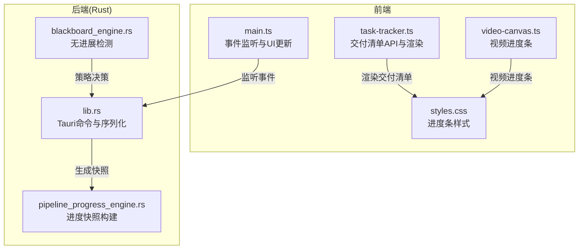
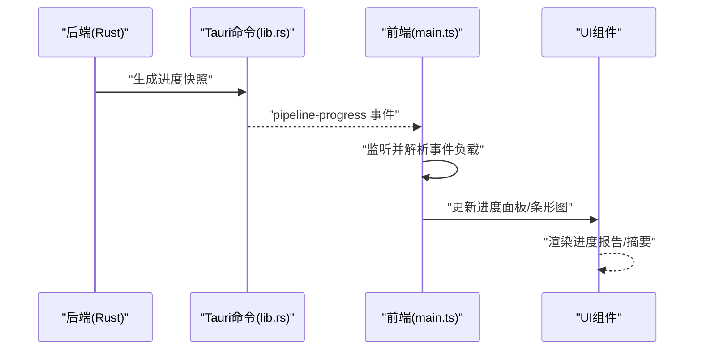
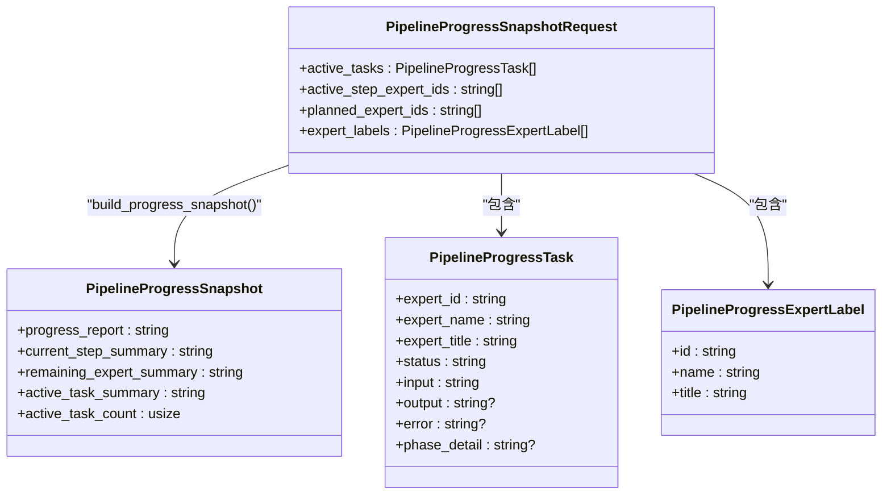
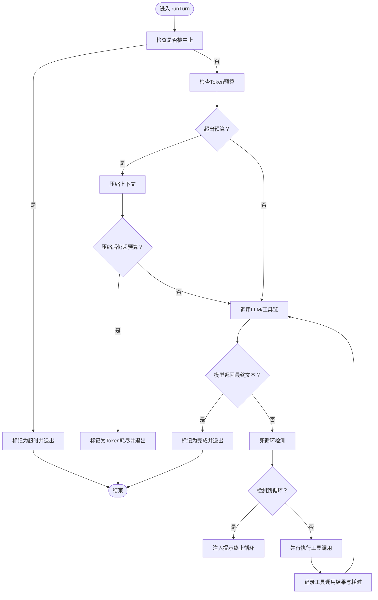
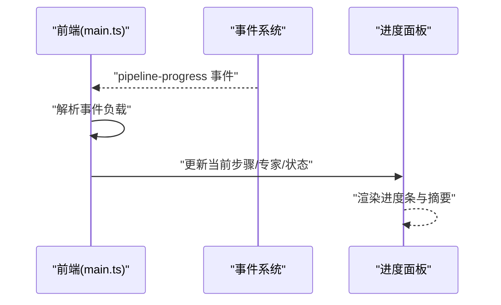
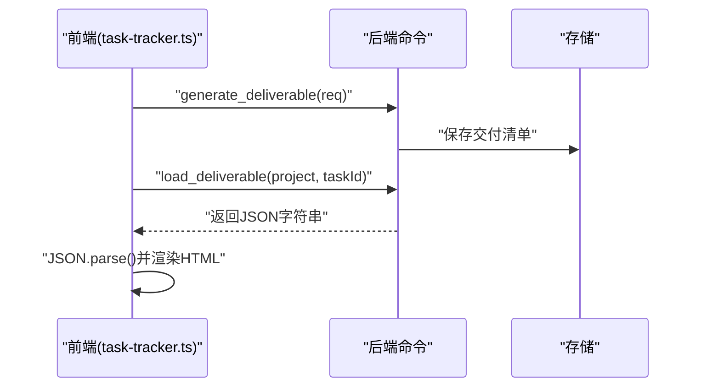
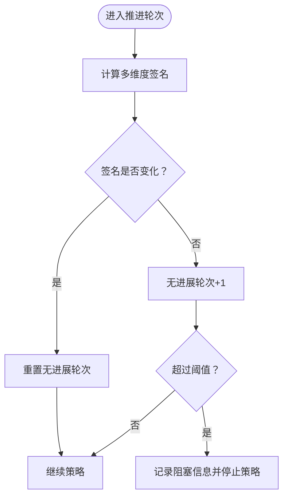
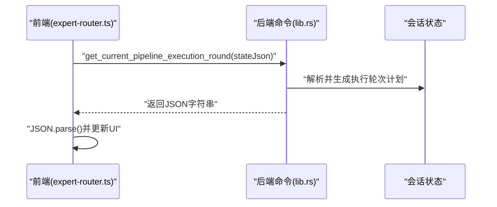
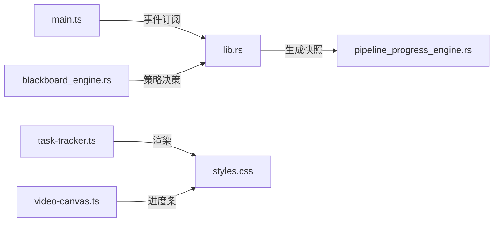

# 进度监控

<cite>
**本文引用的文件**
- [pipeline_progress_engine.rs](file://src-tauri/src/pipeline_progress_engine.rs)
- [task-tracker.ts](file://src/task-tracker.ts)
- [agent-loop.ts](file://src/agent-loop.ts)
- [main.ts](file://src/main.ts)
- [expert-router.ts](file://src/expert-router.ts)
- [lib.rs](file://src-tauri/src/lib.rs)
- [blackboard_engine.rs](file://src-tauri/src/blackboard_engine.rs)
- [styles.css](file://src/styles.css)
- [video-canvas.ts](file://src/video-canvas.ts)
- [README.md](file://README.md)
</cite>

## 目录
1. [简介](#简介)
2. [项目结构](#项目结构)
3. [核心组件](#核心组件)
4. [架构总览](#架构总览)
5. [详细组件分析](#详细组件分析)
6. [依赖关系分析](#依赖关系分析)
7. [性能考量](#性能考量)
8. [故障排查指南](#故障排查指南)
9. [结论](#结论)
10. [附录](#附录)

## 简介
本技术文档围绕“进度监控系统”展开，聚焦于进度引擎的设计原理、监控指标与实时反馈机制，系统化阐述进度跟踪的数据结构、进度事件的生成与传播、进度数据的可视化展示、配置项与性能影响控制，以及进度异常的检测与处理（卡顿、超时、自动恢复）。文档同时提供进度查询、事件订阅与状态同步的实现模式示例路径，帮助开发者快速集成与扩展。

## 项目结构
进度监控涉及前后端协同：Rust 后端负责构建进度快照与推进策略，前端通过 Tauri 事件监听与 UI 组件渲染进度。关键模块包括：
- Rust 进度引擎：构建进度快照、专家标签与任务摘要
- 前端事件监听：接收 pipeline-progress 事件并更新 UI
- 专家执行循环：提供超时控制与工具调用统计
- 交付清单与可视化：渲染交付成果与进度条样式
- 黑板引擎：基于轮次无进展检测的自动停顿机制

**图表来源**
- [main.ts:3183-3198](file://src/main.ts#L3183-L3198)
- [pipeline_progress_engine.rs:1-213](file://src-tauri/src/pipeline_progress_engine.rs#L1-L213)
- [lib.rs:1436-1464](file://src-tauri/src/lib.rs#L1436-L1464)
- [blackboard_engine.rs:296-332](file://src-tauri/src/blackboard_engine.rs#L296-L332)
- [styles.css:6971-6984](file://src/styles.css#L6971-L6984)
- [video-canvas.ts:126-126](file://src/video-canvas.ts#L126-L126)

**章节来源**
- [main.ts:3183-3198](file://src/main.ts#L3183-L3198)
- [pipeline_progress_engine.rs:1-213](file://src-tauri/src/pipeline_progress_engine.rs#L1-L213)
- [lib.rs:1436-1464](file://src-tauri/src/lib.rs#L1436-L1464)
- [blackboard_engine.rs:296-332](file://src-tauri/src/blackboard_engine.rs#L296-L332)
- [styles.css:6971-6984](file://src/styles.css#L6971-L6984)
- [video-canvas.ts:126-126](file://src/video-canvas.ts#L126-L126)

## 核心组件
- 进度快照构建器：将活动任务、当前步骤专家、计划专家与专家标签汇总，生成进度报告、当前步骤摘要、剩余专家摘要、活动任务摘要与活动任务计数。
- 专家执行循环：提供专家单次执行超时控制、工具调用统计、死循环检测与流式输出回调。
- 前端事件监听：订阅 pipeline-progress 事件，驱动 UI 更新。
- 交付清单：提供生成、加载、列表与 Markdown 路径管理，并渲染为 HTML。
- 黑板引擎：基于多维度签名比较，检测连续无进展并触发停顿策略。
- 可视化样式：提供通用进度条容器与填充元素，视频进度条等。

**章节来源**
- [pipeline_progress_engine.rs:43-63](file://src-tauri/src/pipeline_progress_engine.rs#L43-L63)
- [agent-loop.ts:12-28](file://src/agent-loop.ts#L12-L28)
- [main.ts:3183-3198](file://src/main.ts#L3183-L3198)
- [task-tracker.ts:30-83](file://src/task-tracker.ts#L30-L83)
- [blackboard_engine.rs:296-332](file://src-tauri/src/blackboard_engine.rs#L296-L332)
- [styles.css:6971-6984](file://src/styles.css#L6971-L6984)

## 架构总览
进度监控采用“后端生成快照 + 前端事件驱动 + 可视化渲染”的分层架构。后端根据当前会话状态与专家执行计划生成进度快照；前端通过 Tauri 事件订阅接收快照并更新 UI；同时结合黑板引擎的无进展检测，实现策略性停顿与异常提示。

**图表来源**
- [lib.rs:1436-1464](file://src-tauri/src/lib.rs#L1436-L1464)
- [main.ts:3183-3198](file://src/main.ts#L3183-L3198)
- [pipeline_progress_engine.rs:43-63](file://src-tauri/src/pipeline_progress_engine.rs#L43-L63)

**章节来源**
- [lib.rs:1436-1464](file://src-tauri/src/lib.rs#L1436-L1464)
- [main.ts:3183-3198](file://src/main.ts#L3183-L3198)
- [pipeline_progress_engine.rs:43-63](file://src-tauri/src/pipeline_progress_engine.rs#L43-L63)

## 详细组件分析

### 进度快照与数据结构
- 数据结构
  - 专家标签：包含专家标识、名称与头衔
  - 任务：包含专家标识、名称、头衔、状态、输入、输出、错误、阶段细节
  - 快照请求：包含活动任务、当前步骤专家集合、计划专家集合、专家标签
  - 快照：包含进度报告、当前步骤摘要、剩余专家摘要、活动任务摘要、活动任务计数
- 构建逻辑
  - 进度报告：按任务状态映射图标与状态文案，拼接当前任务进度
  - 当前/剩余专家摘要：根据专家 ID 与标签映射生成摘要
  - 活动任务摘要：根据状态与输出/错误/阶段细节截断拼接
  - 活动任务计数：统计状态为运行中的任务数量

**图表来源**
- [pipeline_progress_engine.rs:3-41](file://src-tauri/src/pipeline_progress_engine.rs#L3-L41)

**章节来源**
- [pipeline_progress_engine.rs:3-63](file://src-tauri/src/pipeline_progress_engine.rs#L3-L63)

### 专家执行循环与异常处理
- 关键能力
  - 专家单次执行超时控制：通过 AbortController 与定时器在超时后中止
  - 工具调用统计：记录每次工具调用的名称、参数、结果、成功与否与耗时
  - 死循环检测：对最近 N 次工具调用签名进行一致性判断，必要时注入提示终止
  - 流式输出回调：通过事件通道推送流式 token
- 异常处理
  - 超时：设置 finishReason 为 timeout
  - Token 预算耗尽：自动压缩上下文后仍超预算则停止
  - 工具执行失败：记录错误并继续流程
  - file_patch 失败重试：对同一文件最多重试固定次数，超过阈值提示改用覆盖写入

**图表来源**
- [agent-loop.ts:76-211](file://src/agent-loop.ts#L76-L211)
- [agent-loop.ts:273-331](file://src/agent-loop.ts#L273-L331)
- [agent-loop.ts:336-341](file://src/agent-loop.ts#L336-L341)

**章节来源**
- [agent-loop.ts:12-28](file://src/agent-loop.ts#L12-L28)
- [agent-loop.ts:76-211](file://src/agent-loop.ts#L76-L211)
- [agent-loop.ts:273-331](file://src/agent-loop.ts#L273-L331)
- [agent-loop.ts:336-341](file://src/agent-loop.ts#L336-L341)

### 前端事件订阅与 UI 更新
- 事件订阅
  - 监听 pipeline-progress 事件，解析负载并更新进度面板
- UI 组件
  - 进度面板：显示当前步骤、总步数、当前专家、工具轮次与状态
  - 进度条样式：提供容器与填充元素，支持不同状态下的视觉反馈

**图表来源**
- [main.ts:3183-3198](file://src/main.ts#L3183-L3198)
- [styles.css:6971-6984](file://src/styles.css#L6971-L6984)

**章节来源**
- [main.ts:3183-3198](file://src/main.ts#L3183-L3198)
- [styles.css:6971-6984](file://src/styles.css#L6971-L6984)

### 交付清单与可视化
- 交付清单 API
  - 生成并保存：将专家输出整合为标准结构并通过后端命令生成交付清单
  - 加载与列举：支持按项目名加载与列出历史交付清单
  - Markdown 路径：提供交付清单 Markdown 文件路径
- 渲染逻辑
  - 摘要、代码变更统计与列表、审查意见统计与列表、测试建议列表
  - HTML 输出：使用安全转义与格式化时间戳

**图表来源**
- [task-tracker.ts:30-83](file://src/task-tracker.ts#L30-L83)

**章节来源**
- [task-tracker.ts:30-83](file://src/task-tracker.ts#L30-L83)
- [task-tracker.ts:92-177](file://src/task-tracker.ts#L92-L177)

### 黑板引擎的无进展检测与停顿
- 策略
  - 基于多维度签名比较（所需文件、证据、补丁提案、验证运行、审查决策、阻塞项）
  - 若签名未变化，则无进展轮次加一；达到阈值（如3轮）后停止当前策略并记录阻塞信息
- 影响
  - 避免空转，提升资源利用效率，向用户提示策略停顿原因

**图表来源**
- [blackboard_engine.rs:296-332](file://src-tauri/src/blackboard_engine.rs#L296-L332)

**章节来源**
- [blackboard_engine.rs:296-332](file://src-tauri/src/blackboard_engine.rs#L296-L332)

### 进度查询与状态同步
- 查询接口
  - 获取当前流水线执行轮次计划与跟进轮次计划，支持序列化与反序列化
- 状态同步
  - 前端通过 invoke 调用后端命令，解析返回的计划对象，驱动 UI 与后续执行

**图表来源**
- [expert-router.ts:706-719](file://src/expert-router.ts#L706-L719)
- [lib.rs:1446-1454](file://src-tauri/src/lib.rs#L1446-L1454)

**章节来源**
- [expert-router.ts:706-719](file://src/expert-router.ts#L706-L719)
- [lib.rs:1446-1454](file://src-tauri/src/lib.rs#L1446-L1454)

## 依赖关系分析
- 前后端耦合
  - 前端通过 Tauri 事件订阅后端生成的进度快照，保持低耦合与高内聚
- 数据契约
  - 进度快照请求与响应遵循统一的字段命名与序列化约定，便于跨语言传递
- 外部依赖
  - Tauri 事件系统、流式输出通道、窗口进度条能力（在权限配置中体现）

**图表来源**
- [main.ts:3183-3198](file://src/main.ts#L3183-L3198)
- [lib.rs:1436-1464](file://src-tauri/src/lib.rs#L1436-L1464)
- [pipeline_progress_engine.rs:43-63](file://src-tauri/src/pipeline_progress_engine.rs#L43-L63)
- [task-tracker.ts:92-177](file://src/task-tracker.ts#L92-L177)
- [styles.css:6971-6984](file://src/styles.css#L6971-L6984)
- [video-canvas.ts:126-126](file://src/video-canvas.ts#L126-L126)
- [blackboard_engine.rs:296-332](file://src-tauri/src/blackboard_engine.rs#L296-L332)

**章节来源**
- [main.ts:3183-3198](file://src/main.ts#L3183-L3198)
- [lib.rs:1436-1464](file://src-tauri/src/lib.rs#L1436-L1464)
- [pipeline_progress_engine.rs:43-63](file://src-tauri/src/pipeline_progress_engine.rs#L43-L63)
- [task-tracker.ts:92-177](file://src/task-tracker.ts#L92-L177)
- [styles.css:6971-6984](file://src/styles.css#L6971-L6984)
- [video-canvas.ts:126-126](file://src/video-canvas.ts#L126-L126)
- [blackboard_engine.rs:296-332](file://src-tauri/src/blackboard_engine.rs#L296-L332)

## 性能考量
- 采样频率与历史数据
  - 建议在前端按需订阅事件，避免高频轮询；后端仅在状态变化时生成快照
- 性能影响控制
  - 控制快照构建复杂度（过滤与拼接），避免大文本重复处理
  - 在 UI 层采用虚拟滚动与懒渲染，减少 DOM 压力
- 资源限制
  - 专家执行超时、Token 预算与死循环检测共同降低长尾任务对系统的影响

**章节来源**
- [agent-loop.ts:12-19](file://src/agent-loop.ts#L12-L19)
- [README.md:208-208](file://README.md#L208-L208)

## 故障排查指南
- 事件未更新
  - 检查前端是否正确监听 pipeline-progress 事件
  - 确认后端命令是否正常序列化并发出事件
- 进度报告为空
  - 核对快照请求中的活动任务与专家标签是否正确传入
- 专家执行卡住
  - 查看是否触发死循环检测与超时中止
  - 检查工具调用耗时与失败记录
- 黑板策略停顿
  - 查看无进展轮次与阻塞信息，确认是否达到阈值

**章节来源**
- [main.ts:3183-3198](file://src/main.ts#L3183-L3198)
- [lib.rs:1436-1464](file://src-tauri/src/lib.rs#L1436-L1464)
- [pipeline_progress_engine.rs:65-93](file://src-tauri/src/pipeline_progress_engine.rs#L65-L93)
- [agent-loop.ts:132-152](file://src/agent-loop.ts#L132-L152)
- [agent-loop.ts:90-98](file://src/agent-loop.ts#L90-L98)
- [blackboard_engine.rs:314-322](file://src-tauri/src/blackboard_engine.rs#L314-L322)

## 结论
本进度监控系统通过 Rust 后端的快照构建与前端事件驱动的 UI 更新形成闭环，辅以专家执行循环的超时与异常处理、黑板引擎的无进展检测，实现了稳定、可观测且可扩展的进度监控能力。配合交付清单渲染与通用进度条样式，满足从数据到可视化的完整需求。

## 附录
- 实现模式示例路径
  - 进度查询与状态同步：[expert-router.ts:706-719](file://src/expert-router.ts#L706-L719)，[lib.rs:1446-1454](file://src-tauri/src/lib.rs#L1446-L1454)
  - 事件订阅与 UI 更新：[main.ts:3183-3198](file://src/main.ts#L3183-L3198)，[styles.css:6971-6984](file://src/styles.css#L6971-L6984)
  - 快照构建与摘要生成：[pipeline_progress_engine.rs:43-150](file://src-tauri/src/pipeline_progress_engine.rs#L43-L150)
  - 专家执行与异常处理：[agent-loop.ts:76-211](file://src/agent-loop.ts#L76-L211)，[agent-loop.ts:273-331](file://src/agent-loop.ts#L273-L331)
  - 交付清单生成与渲染：[task-tracker.ts:30-83](file://src/task-tracker.ts#L30-L83)，[task-tracker.ts:92-177](file://src/task-tracker.ts#L92-L177)
  - 无进展检测与停顿策略：[blackboard_engine.rs:296-332](file://src-tauri/src/blackboard_engine.rs#L296-L332)
  - 视频进度条样式：[video-canvas.ts:126-126](file://src/video-canvas.ts#L126-L126)