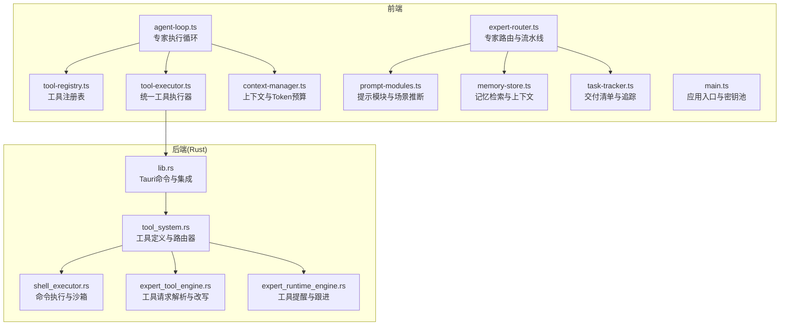
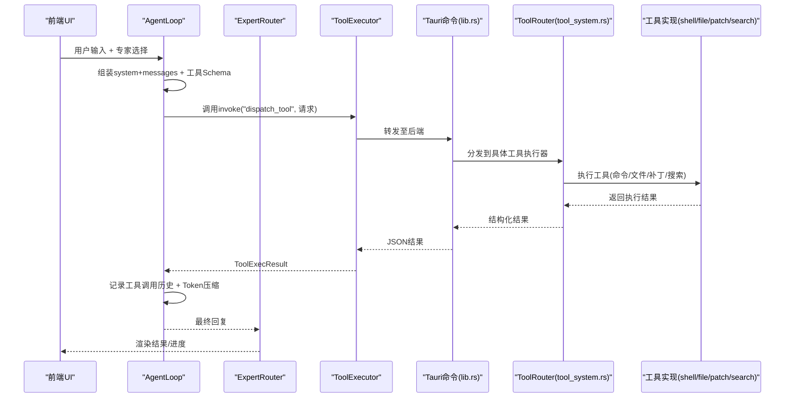
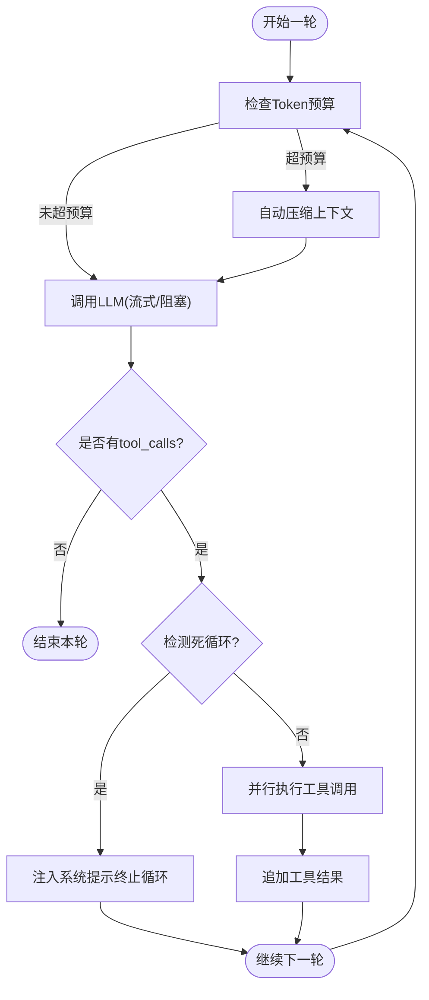
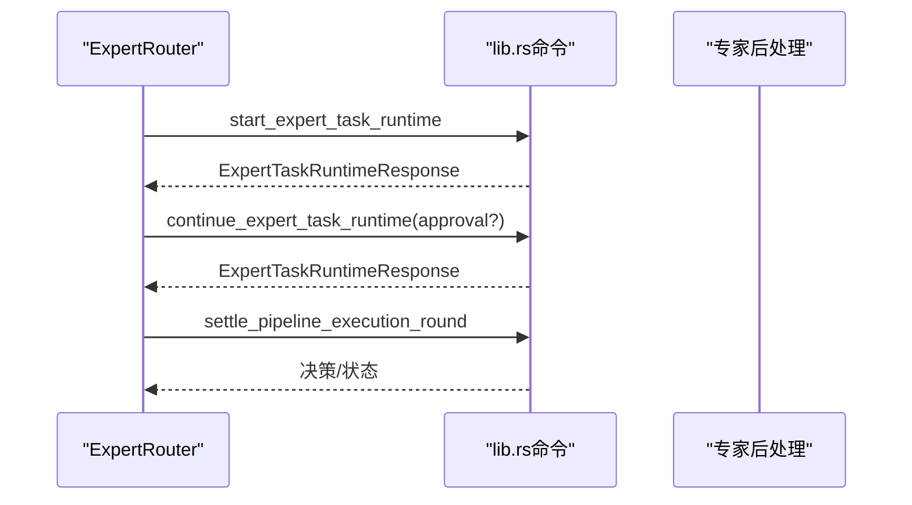
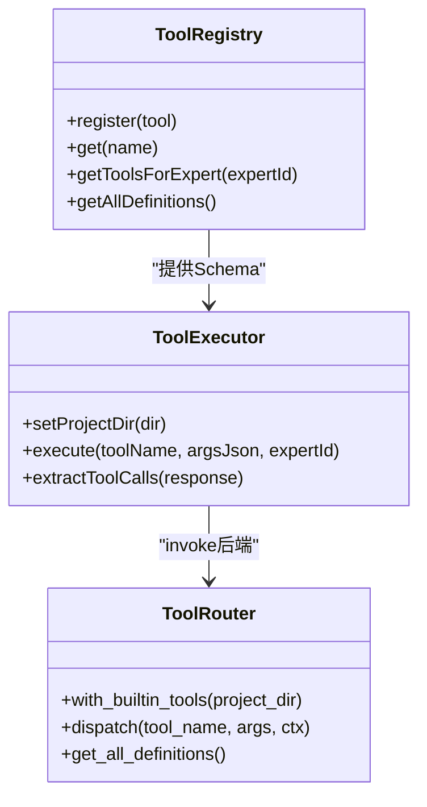
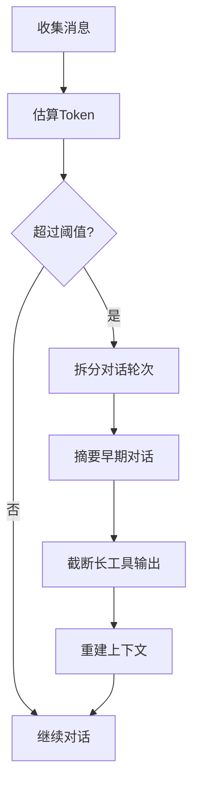
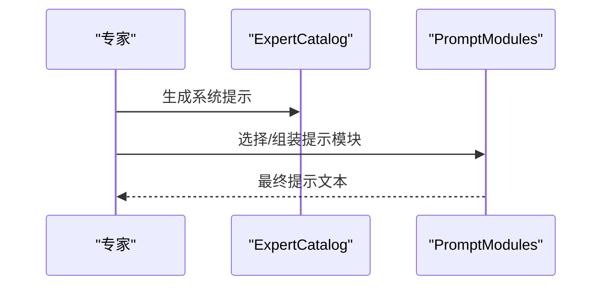
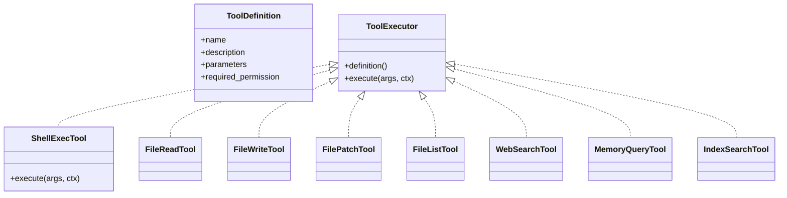
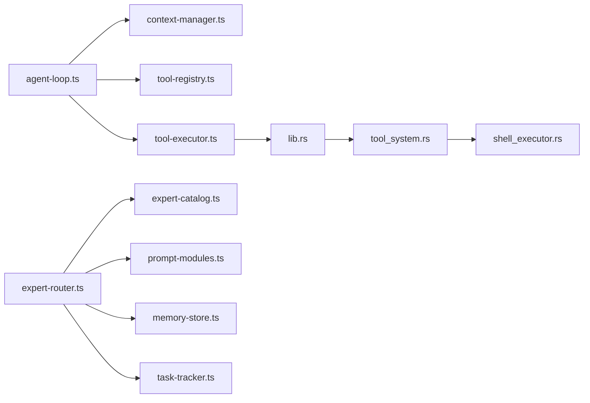

# 专家工具引擎

<cite>
**本文档引用的文件**
- [tool-executor.ts](file://src/tool-executor.ts)
- [tool-registry.ts](file://src/tool-registry.ts)
- [context-manager.ts](file://src/context-manager.ts)
- [expert-catalog.ts](file://src/expert-catalog.ts)
- [expert-router.ts](file://src/expert-router.ts)
- [prompt-modules.ts](file://src/prompt-modules.ts)
- [memory-store.ts](file://src/memory-store.ts)
- [task-tracker.ts](file://src/task-tracker.ts)
- [agent-loop.ts](file://src/agent-loop.ts)
- [main.ts](file://src/main.ts)
- [lib.rs](file://src-tauri/src/lib.rs)
- [expert_tool_engine.rs](file://src-tauri/src/expert_tool_engine.rs)
- [expert_runtime_engine.rs](file://src-tauri/src/expert_runtime_engine.rs)
- [tool_system.rs](file://src-tauri/src/tool_system.rs)
- [shell_executor.rs](file://src-tauri/src/shell_executor.rs)
</cite>

## 目录
1. [简介](#简介)
2. [项目结构](#项目结构)
3. [核心组件](#核心组件)
4. [架构总览](#架构总览)
5. [详细组件分析](#详细组件分析)
6. [依赖分析](#依赖分析)
7. [性能考量](#性能考量)
8. [故障排查指南](#故障排查指南)
9. [结论](#结论)
10. [附录](#附录)

## 简介
本文件面向“专家工具引擎”的技术文档，系统阐述其设计架构、工具编排、状态管理与决策逻辑，覆盖工具生命周期管理（选择算法、执行顺序与优先级调度）、执行上下文构建与传递机制（参数注入、环境变量设置与依赖解析）、智能决策机制（工具推荐、性能评估与结果优化），以及配置选项（执行策略、资源限制与超时设置）。文档同时解释与AI专家系统的集成方式与通信协议，提供可操作的配置示例与复杂场景处理指引。

## 项目结构
前端采用TypeScript + Tauri架构，后端以Rust实现核心引擎与工具系统。前端负责专家路由、上下文管理、工具注册与执行、提示模块与记忆检索；后端负责工具路由、执行器、安全沙箱、命令执行与内存检索等。

图表来源
- [agent-loop.ts:1-404](file://src/agent-loop.ts#L1-L404)
- [expert-router.ts:1-800](file://src/expert-router.ts#L1-L800)
- [tool-registry.ts:1-192](file://src/tool-registry.ts#L1-L192)
- [tool-executor.ts:1-231](file://src/tool-executor.ts#L1-L231)
- [context-manager.ts:1-276](file://src/context-manager.ts#L1-L276)
- [prompt-modules.ts:1-775](file://src/prompt-modules.ts#L1-L775)
- [memory-store.ts:1-337](file://src/memory-store.ts#L1-L337)
- [task-tracker.ts:1-212](file://src/task-tracker.ts#L1-L212)
- [main.ts:1-9045](file://src/main.ts#L1-L9045)
- [lib.rs:1-800](file://src-tauri/src/lib.rs#L1-L800)
- [tool_system.rs:1-841](file://src-tauri/src/tool_system.rs#L1-L841)
- [shell_executor.rs:1-656](file://src-tauri/src/shell_executor.rs#L1-L656)
- [expert_tool_engine.rs:1-534](file://src-tauri/src/expert_tool_engine.rs#L1-L534)
- [expert_runtime_engine.rs:1-175](file://src-tauri/src/expert_runtime_engine.rs#L1-L175)

章节来源
- [agent-loop.ts:1-404](file://src/agent-loop.ts#L1-L404)
- [expert-router.ts:1-800](file://src/expert-router.ts#L1-L800)
- [tool-registry.ts:1-192](file://src/tool-registry.ts#L1-L192)
- [tool-executor.ts:1-231](file://src/tool-executor.ts#L1-L231)
- [context-manager.ts:1-276](file://src/context-manager.ts#L1-L276)
- [prompt-modules.ts:1-775](file://src/prompt-modules.ts#L1-L775)
- [memory-store.ts:1-337](file://src/memory-store.ts#L1-L337)
- [task-tracker.ts:1-212](file://src/task-tracker.ts#L1-L212)
- [main.ts:1-9045](file://src/main.ts#L1-L9045)
- [lib.rs:1-800](file://src-tauri/src/lib.rs#L1-L800)
- [tool_system.rs:1-841](file://src-tauri/src/tool_system.rs#L1-L841)
- [shell_executor.rs:1-656](file://src-tauri/src/shell_executor.rs#L1-L656)
- [expert_tool_engine.rs:1-534](file://src-tauri/src/expert_tool_engine.rs#L1-L534)
- [expert_runtime_engine.rs:1-175](file://src-tauri/src/expert_runtime_engine.rs#L1-L175)

## 核心组件
- 专家执行循环（AgentLoop）：驱动单个专家的多轮对话与工具调用，内置Token预算压缩、死循环检测与超时控制。
- 专家路由（ExpertRouter）：负责专家选择、任务状态管理、流水线推进与令牌配额校验。
- 工具注册表（ToolRegistry）：声明工具Schema与权限，按专家角色过滤可用工具。
- 统一工具执行器（ToolExecutor）：前后端桥接，调用后端dispatch_tool，处理file_patch等特殊错误反馈。
- 上下文管理（ContextManager）：Token预算估算、自动压缩与Fragment管理。
- 提示模块（PromptModules）：按场景与专家类型动态注入工具Schema与指导模块。
- 记忆检索（MemoryStore）：项目级记忆检索与Token感知截断。
- 交付追踪（TaskTracker）：生成与渲染交付清单。
- 后端工具系统（tool_system.rs）：工具定义、路由器与内置工具实现。
- 命令执行（shell_executor.rs）：跨平台命令执行、沙箱与安全策略。
- 工具请求解析（expert_tool_engine.rs）：从专家回复中抽取ACTION指令并改写为标准化工具请求。
- 运行时提醒（expert_runtime_engine.rs）：检测未使用ACTION的工具意图并提醒重试。

章节来源
- [agent-loop.ts:1-404](file://src/agent-loop.ts#L1-L404)
- [expert-router.ts:1-800](file://src/expert-router.ts#L1-L800)
- [tool-registry.ts:1-192](file://src/tool-registry.ts#L1-L192)
- [tool-executor.ts:1-231](file://src/tool-executor.ts#L1-L231)
- [context-manager.ts:1-276](file://src/context-manager.ts#L1-L276)
- [prompt-modules.ts:1-775](file://src/prompt-modules.ts#L1-L775)
- [memory-store.ts:1-337](file://src/memory-store.ts#L1-L337)
- [task-tracker.ts:1-212](file://src/task-tracker.ts#L1-L212)
- [tool_system.rs:1-841](file://src-tauri/src/tool_system.rs#L1-L841)
- [shell_executor.rs:1-656](file://src-tauri/src/shell_executor.rs#L1-L656)
- [expert_tool_engine.rs:1-534](file://src-tauri/src/expert_tool_engine.rs#L1-L534)
- [expert_runtime_engine.rs:1-175](file://src-tauri/src/expert_runtime_engine.rs#L1-L175)

## 架构总览
专家工具引擎采用“前端驱动 + 后端执行”的双层架构。前端负责专家选择、提示组装、上下文压缩与工具调用编排；后端负责工具路由、执行器、安全沙箱与资源限制。前后端通过Tauri命令桥接，统一的dispatch_tool入口承载所有工具调用。

图表来源
- [agent-loop.ts:1-404](file://src/agent-loop.ts#L1-L404)
- [tool-executor.ts:1-231](file://src/tool-executor.ts#L1-L231)
- [lib.rs:1-800](file://src-tauri/src/lib.rs#L1-L800)
- [tool_system.rs:1-841](file://src-tauri/src/tool_system.rs#L1-L841)

## 详细组件分析

### 专家执行循环（AgentLoop）
- 设计要点
  - 基于模型自主决定工具调用轮数，避免硬编码轮次。
  - Token预算检查与自动压缩，防止上下文溢出。
  - 死循环检测：连续相同工具调用触发系统提示终止。
  - 超时控制：单次专家执行超时保护。
- 关键流程
  - 估算Token → 超预算则压缩 → 调用LLM → 解析tool_calls → 并行执行工具 → 追加工具结果 → 继续对话直至完成。
- 代码路径
  - [agent-loop.ts:76-211](file://src/agent-loop.ts#L76-L211)

图表来源
- [agent-loop.ts:100-190](file://src/agent-loop.ts#L100-L190)

章节来源
- [agent-loop.ts:1-404](file://src/agent-loop.ts#L1-L404)

### 专家路由与流水线（ExpertRouter）
- 设计要点
  - 专家注册表与系统专家集合，按场景与专家角色生成系统提示。
  - 令牌配额校验与豁免机制，支持项目级与用户级Token数据持久化。
  - 流水线步骤与波次推进，支持并行与串行执行模式。
  - 专家任务状态管理与UI进度快照。
- 关键流程
  - 启动专家任务运行时 → 继续运行时（支持审批决策）→ 推进流水线步骤 → 生成交付清单。
- 代码路径
  - [expert-router.ts:506-559](file://src/expert-router.ts#L506-L559)
  - [expert-router.ts:706-740](file://src/expert-router.ts#L706-L740)
  - [expert-router.ts:750-790](file://src/expert-router.ts#L750-L790)

图表来源
- [expert-router.ts:506-559](file://src/expert-router.ts#L506-L559)
- [expert-router.ts:750-790](file://src/expert-router.ts#L750-L790)

章节来源
- [expert-router.ts:1-800](file://src/expert-router.ts#L1-L800)

### 工具注册与执行（ToolRegistry + ToolExecutor）
- 设计要点
  - 前端工具注册表定义Schema与权限（auto/confirm/block）。
  - 统一工具执行器封装invoke调用，处理file_patch错误反馈与结构化消息。
  - 后端工具系统提供工具定义、路由器与内置工具实现。
- 关键流程
  - 前端根据专家角色过滤可用工具 → LLM返回tool_calls → ToolExecutor.execute → 后端dispatch_tool → 工具执行器返回结果。
- 代码路径
  - [tool-registry.ts:27-141](file://src/tool-registry.ts#L27-L141)
  - [tool-executor.ts:24-53](file://src/tool-executor.ts#L24-L53)
  - [tool_system.rs:62-95](file://src-tauri/src/tool_system.rs#L62-L95)

图表来源
- [tool-registry.ts:20-192](file://src/tool-registry.ts#L20-L192)
- [tool-executor.ts:13-231](file://src/tool-executor.ts#L13-L231)
- [tool_system.rs:97-142](file://src-tauri/src/tool_system.rs#L97-L142)

章节来源
- [tool-registry.ts:1-192](file://src/tool-registry.ts#L1-L192)
- [tool-executor.ts:1-231](file://src/tool-executor.ts#L1-L231)
- [tool_system.rs:1-841](file://src-tauri/src/tool_system.rs#L1-L841)

### 上下文管理与Token预算（ContextManager）
- 设计要点
  - Token估算策略（中文、英文、代码权重）。
  - 自动压缩：保留系统消息、最近N轮、工具输出截断、早期对话摘要。
  - Fragment管理：按优先级与单片段Token上限选择性构建上下文。
- 关键流程
  - 估算消息Token → 超预算压缩 → 重建上下文 → 继续对话。
- 代码路径
  - [context-manager.ts:55-105](file://src/context-manager.ts#L55-L105)
  - [context-manager.ts:115-156](file://src/context-manager.ts#L115-L156)
  - [context-manager.ts:231-244](file://src/context-manager.ts#L231-L244)

图表来源
- [context-manager.ts:100-156](file://src/context-manager.ts#L100-L156)

章节来源
- [context-manager.ts:1-276](file://src/context-manager.ts#L1-L276)

### 提示模块与专家系统提示（PromptModules + ExpertCatalog）
- 设计要点
  - 按专家角色与场景动态注入工具Schema与指导模块（如网络搜索、命令执行、精确修改、交付落盘）。
  - 专家系统提示：知识库、方法论、关注焦点与执行规则。
  - 场景推断：根据任务文本与模块提示推断场景类型。
- 关键流程
  - 选择专家 → 生成专家系统提示 → 动态注入提示模块 → 组装最终提示 → 交给AgentLoop。
- 代码路径
  - [prompt-modules.ts:423-446](file://src/prompt-modules.ts#L423-L446)
  - [prompt-modules.ts:448-501](file://src/prompt-modules.ts#L448-L501)
  - [expert-catalog.ts:549-579](file://src/expert-catalog.ts#L549-L579)
  - [expert-catalog.ts:688-696](file://src/expert-catalog.ts#L688-L696)

图表来源
- [prompt-modules.ts:423-446](file://src/prompt-modules.ts#L423-L446)
- [expert-catalog.ts:549-579](file://src/expert-catalog.ts#L549-L579)

章节来源
- [prompt-modules.ts:1-775](file://src/prompt-modules.ts#L1-L775)
- [expert-catalog.ts:1-916](file://src/expert-catalog.ts#L1-L916)

### 记忆检索与上下文增强（MemoryStore）
- 设计要点
  - 项目级记忆检索：按专家/场景关键词检索，支持Token感知截断。
  - 记忆上下文组装：将检索结果注入到专家提示中。
  - 生命周期管理：定期清理与统计。
- 关键流程
  - 检索记忆 → 组装上下文 → 注入提示 → 继续对话。
- 代码路径
  - [memory-store.ts:51-68](file://src/memory-store.ts#L51-L68)
  - [memory-store.ts:160-186](file://src/memory-store.ts#L160-L186)
  - [memory-store.ts:310-335](file://src/memory-store.ts#L310-L335)

章节来源
- [memory-store.ts:1-337](file://src/memory-store.ts#L1-L337)

### 交付清单与追踪（TaskTracker）
- 设计要点
  - 生成交付清单：汇总代码变更、审查意见、测试建议与专家贡献。
  - 渲染交付清单：HTML卡片，支持统计与详情。
- 关键流程
  - 收集专家输出 → 生成交付清单 → 渲染展示。
- 代码路径
  - [task-tracker.ts:31-59](file://src/task-tracker.ts#L31-L59)
  - [task-tracker.ts:92-177](file://src/task-tracker.ts#L92-L177)

章节来源
- [task-tracker.ts:1-212](file://src/task-tracker.ts#L1-L212)

### 后端工具系统与命令执行
- 设计要点
  - 工具定义与路由器：统一工具接口、权限级别与执行上下文。
  - 内置工具：shell_exec、file_read/write、file_patch、file_list、web_search、memory_query、index_search。
  - 命令执行：跨平台、沙箱、超时与输出截断、Windows PowerShell兼容。
  - 工具请求解析：从专家回复中抽取ACTION指令并标准化。
  - 运行时提醒：检测未使用ACTION的工具意图并提示重试。
- 关键流程
  - 前端invoke → 后端dispatch_tool → ToolRouter分发 → 工具执行器执行 → 返回结果。
- 代码路径
  - [tool_system.rs:144-800](file://src-tauri/src/tool_system.rs#L144-L800)
  - [shell_executor.rs:498-633](file://src-tauri/src/shell_executor.rs#L498-L633)
  - [expert_tool_engine.rs:288-480](file://src-tauri/src/expert_tool_engine.rs#L288-L480)
  - [expert_runtime_engine.rs:76-123](file://src-tauri/src/expert_runtime_engine.rs#L76-L123)

图表来源
- [tool_system.rs:14-95](file://src-tauri/src/tool_system.rs#L14-L95)
- [tool_system.rs:144-800](file://src-tauri/src/tool_system.rs#L144-L800)

章节来源
- [tool_system.rs:1-841](file://src-tauri/src/tool_system.rs#L1-L841)
- [shell_executor.rs:1-656](file://src-tauri/src/shell_executor.rs#L1-L656)
- [expert_tool_engine.rs:1-534](file://src-tauri/src/expert_tool_engine.rs#L1-L534)
- [expert_runtime_engine.rs:1-175](file://src-tauri/src/expert_runtime_engine.rs#L1-L175)

## 依赖分析
- 前端依赖
  - AgentLoop依赖ContextManager、ToolRegistry、ToolExecutor与配置。
  - ExpertRouter依赖ExpertCatalog、PromptModules、MemoryStore与TaskTracker。
  - ToolExecutor依赖Tauri invoke与后端dispatch_tool。
- 后端依赖
  - lib.rs提供Tauri命令入口，委托tool_system.rs工具系统。
  - shell_executor.rs提供命令执行与安全策略。
  - expert_tool_engine.rs与expert_runtime_engine.rs提供工具请求解析与运行时提醒。

图表来源
- [agent-loop.ts:1-404](file://src/agent-loop.ts#L1-L404)
- [context-manager.ts:1-276](file://src/context-manager.ts#L1-L276)
- [tool-registry.ts:1-192](file://src/tool-registry.ts#L1-L192)
- [tool-executor.ts:1-231](file://src/tool-executor.ts#L1-L231)
- [lib.rs:1-800](file://src-tauri/src/lib.rs#L1-L800)
- [tool_system.rs:1-841](file://src-tauri/src/tool_system.rs#L1-L841)
- [shell_executor.rs:1-656](file://src-tauri/src/shell_executor.rs#L1-L656)
- [expert-router.ts:1-800](file://src/expert-router.ts#L1-L800)
- [expert-catalog.ts:1-916](file://src/expert-catalog.ts#L1-L916)
- [prompt-modules.ts:1-775](file://src/prompt-modules.ts#L1-L775)
- [memory-store.ts:1-337](file://src/memory-store.ts#L1-L337)
- [task-tracker.ts:1-212](file://src/task-tracker.ts#L1-L212)

章节来源
- [agent-loop.ts:1-404](file://src/agent-loop.ts#L1-L404)
- [expert-router.ts:1-800](file://src/expert-router.ts#L1-L800)
- [tool-registry.ts:1-192](file://src/tool-registry.ts#L1-L192)
- [tool-executor.ts:1-231](file://src/tool-executor.ts#L1-L231)
- [context-manager.ts:1-276](file://src/context-manager.ts#L1-L276)
- [prompt-modules.ts:1-775](file://src/prompt-modules.ts#L1-L775)
- [memory-store.ts:1-337](file://src/memory-store.ts#L1-L337)
- [task-tracker.ts:1-212](file://src/task-tracker.ts#L1-L212)
- [lib.rs:1-800](file://src-tauri/src/lib.rs#L1-L800)
- [tool_system.rs:1-841](file://src-tauri/src/tool_system.rs#L1-L841)
- [shell_executor.rs:1-656](file://src-tauri/src/shell_executor.rs#L1-L656)
- [expert_tool_engine.rs:1-534](file://src-tauri/src/expert_tool_engine.rs#L1-L534)
- [expert_runtime_engine.rs:1-175](file://src-tauri/src/expert_runtime_engine.rs#L1-L175)

## 性能考量
- Token预算与压缩
  - 通过ContextManager的自动压缩与Fragment管理，避免上下文溢出导致的性能退化。
- 工具调用并发
  - AgentLoop并行执行多个tool_calls，提升工具链路吞吐。
- 命令执行优化
  - shell_executor.rs采用异步读取、Head+Tail缓冲与超时控制，避免大输出阻塞。
- 提示模块按需注入
  - PromptModules仅注入专家所需模块，减少无关上下文。

[本节为通用指导，不直接分析具体文件]

## 故障排查指南
- 工具执行错误
  - file_patch失败：ToolExecutor会构造结构化错误反馈，包含失败文件、行号与已应用文件列表，指导模型修正补丁。
  - 命令执行失败：shell_executor.rs返回退出码、截断标志与KILLED标记，便于定位超时或被杀进程。
- 死循环检测
  - AgentLoop检测连续相同工具调用，注入系统提示终止循环。
- 令牌配额阻断
  - ExpertRouter在UI中显示配额阻断消息，便于用户理解限制原因。
- 记忆检索异常
  - memory-store.ts提供增强检索（Token感知），失败时回退到普通检索。

章节来源
- [tool-executor.ts:59-104](file://src/tool-executor.ts#L59-L104)
- [shell_executor.rs:624-633](file://src-tauri/src/shell_executor.rs#L624-L633)
- [agent-loop.ts:134-152](file://src/agent-loop.ts#L134-L152)
- [expert-router.ts:86-105](file://src/expert-router.ts#L86-L105)
- [memory-store.ts:315-335](file://src/memory-store.ts#L315-L335)

## 结论
专家工具引擎通过前后端协同实现了灵活、安全、可扩展的专家工具编排与执行。前端负责智能提示、上下文压缩与工具调用编排，后端提供工具路由、安全沙箱与资源控制。系统支持动态提示模块注入、专家角色权限控制、Token预算与超时保护，以及复杂的流水线推进与交付追踪。该架构既满足工程实现的落地需求，也为未来扩展（如更多工具、更细粒度的权限与审计）提供了清晰的扩展点。

[本节为总结性内容，不直接分析具体文件]

## 附录

### 配置选项与示例
- AgentLoop配置（前端）
  - maxTurns：最大轮次（默认20）
  - tokenBudget：Token预算
  - compactThreshold：压缩触发比例（默认0.8）
  - deadLoopDetection：连续相同调用检测（默认3）
  - streamingEnabled：是否启用流式输出
  - expertTimeout：单次专家执行总超时（毫秒）
  - 代码路径：[agent-loop.ts:12-67](file://src/agent-loop.ts#L12-L67)
- 专家路由与令牌配额（前端）
  - 令牌配额豁免专家ID列表（QUOTA_EXEMPT_IDS）
  - 项目级/用户级Token数据持久化与加载
  - 代码路径：[expert-router.ts:37-62](file://src/expert-router.ts#L37-L62)，[expert-router.ts:162-220](file://src/expert-router.ts#L162-L220)
- 工具权限与Schema（前端）
  - auto/confirm/block权限控制
  - 代码路径：[tool-registry.ts:17-19](file://src/tool-registry.ts#L17-L19)，[tool-registry.ts:27-141](file://src/tool-registry.ts#L27-L141)
- 命令执行配置（后端）
  - timeout_ms、max_output_bytes、max_output_lines、kill_on_timeout、working_dir_sandbox、env_overrides
  - 代码路径：[shell_executor.rs:336-358](file://src-tauri/src/shell_executor.rs#L336-L358)
- 提示模块与场景推断（前端）
  - 按专家角色与场景动态注入模块
  - 代码路径：[prompt-modules.ts:423-446](file://src/prompt-modules.ts#L423-L446)，[prompt-modules.ts:448-501](file://src/prompt-modules.ts#L448-L501)

### 复杂场景处理示例
- 多专家并行流水线
  - 通过ExpertRouter的PipelineStep与并行模式，实现多专家并行推进与波次调度。
  - 代码路径：[expert-router.ts:562-588](file://src/expert-router.ts#L562-L588)，[expert-router.ts:706-740](file://src/expert-router.ts#L706-L740)
- 工具意图提醒与重试
  - 当专家回复中出现工具意图但未使用ACTION时，expert_runtime_engine.rs会提示重试。
  - 代码路径：[expert_runtime_engine.rs:76-114](file://src-tauri/src/expert_runtime_engine.rs#L76-L114)
- 从回复中抽取工具调用
  - ToolExecutor.extractToolCalls支持OpenAI function calling与ACTION标记格式。
  - 代码路径：[tool-executor.ts:148-185](file://src/tool-executor.ts#L148-L185)

### 专家工具引擎与AI专家系统的集成
- 通信协议
  - 前端通过Tauri invoke调用后端命令（如dispatch_tool、llm_call_streaming/llm_call_blocking），后端返回JSON结构化结果。
  - 代码路径：[tool-executor.ts:24-53](file://src/tool-executor.ts#L24-L53)，[lib.rs:707-788](file://src-tauri/src/lib.rs#L707-L788)
- 专家系统提示与场景推断
  - 通过expert-catalog.ts与prompt-modules.ts组合生成专家系统提示与场景模块，注入到AgentLoop。
  - 代码路径：[expert-catalog.ts:549-579](file://src/expert-catalog.ts#L549-L579)，[prompt-modules.ts:423-446](file://src/prompt-modules.ts#L423-L446)