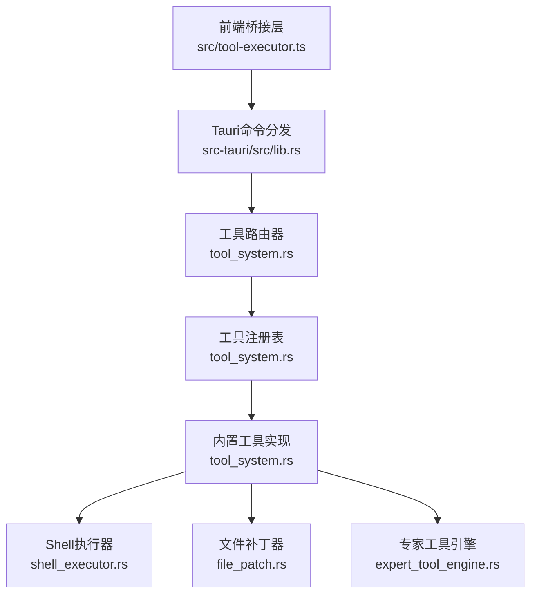
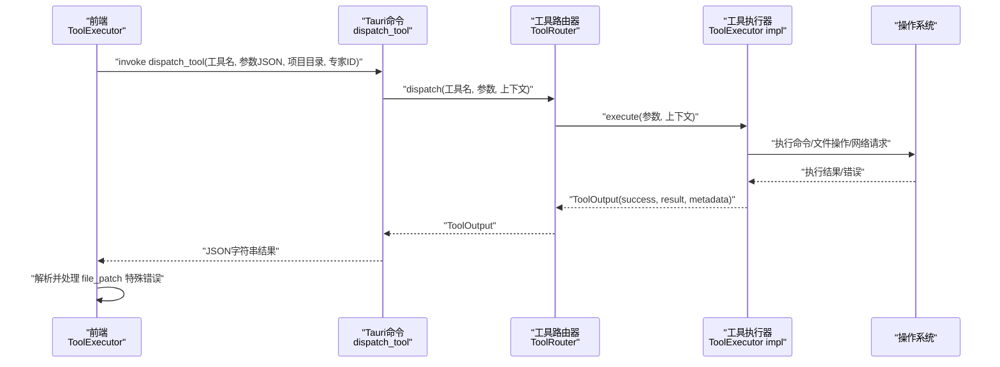
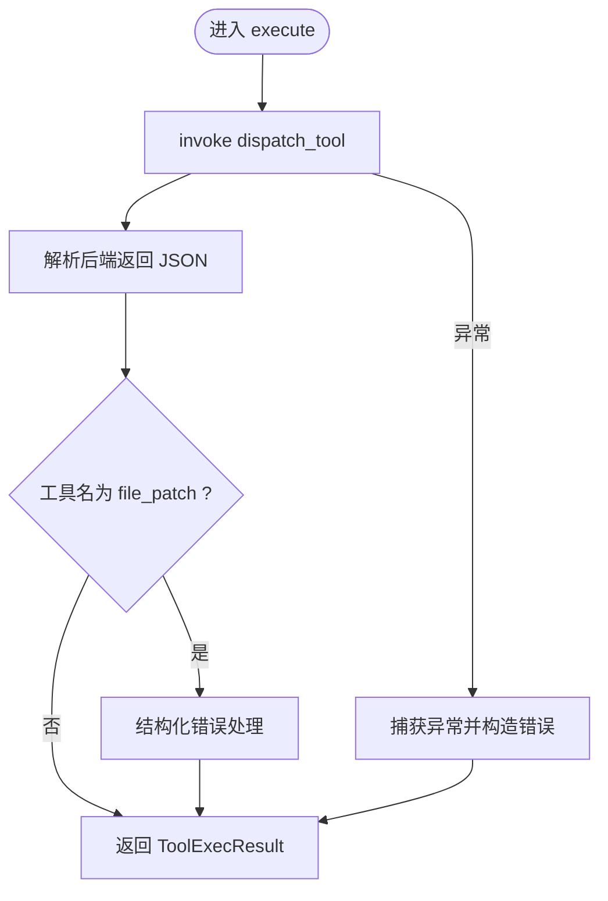
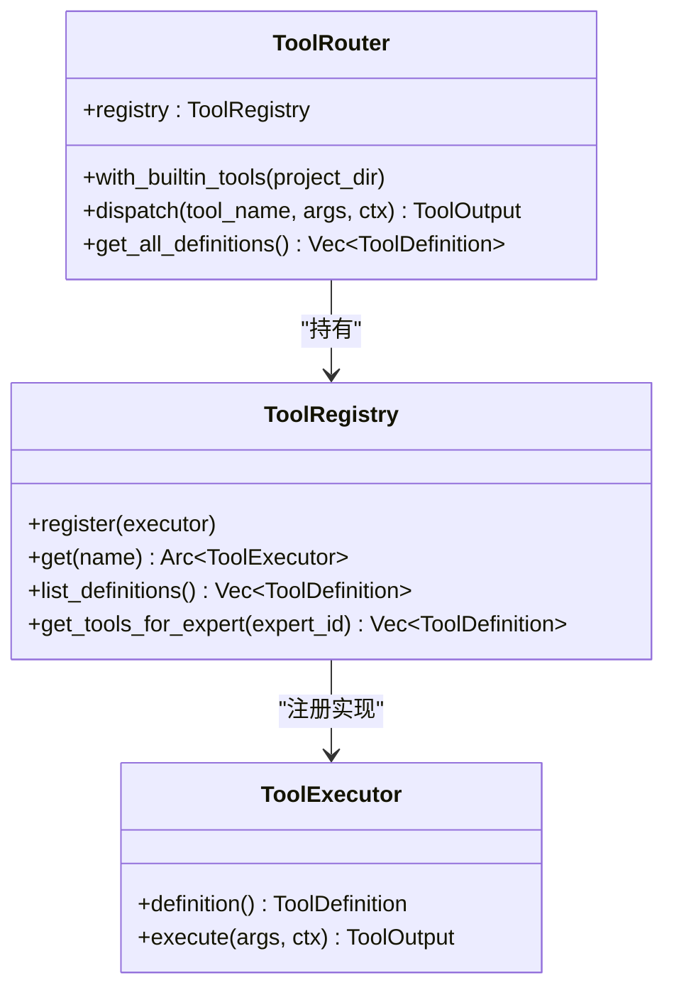
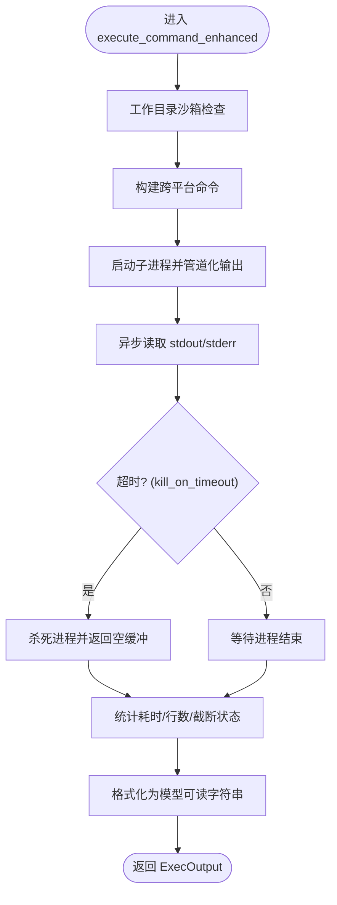
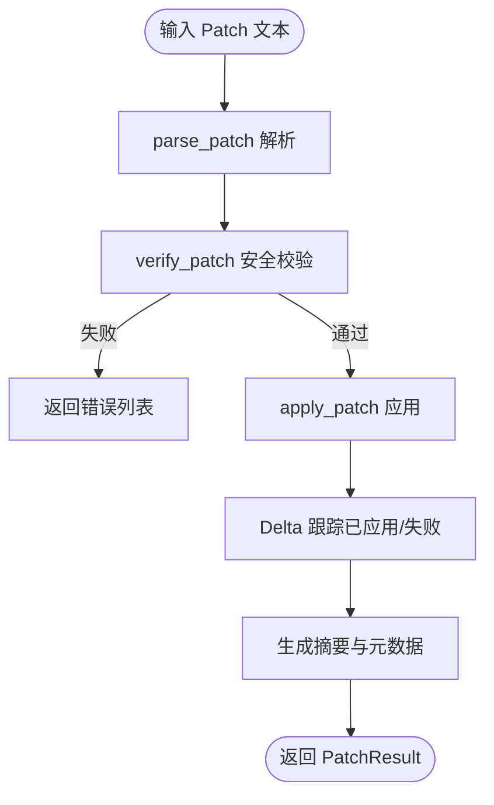
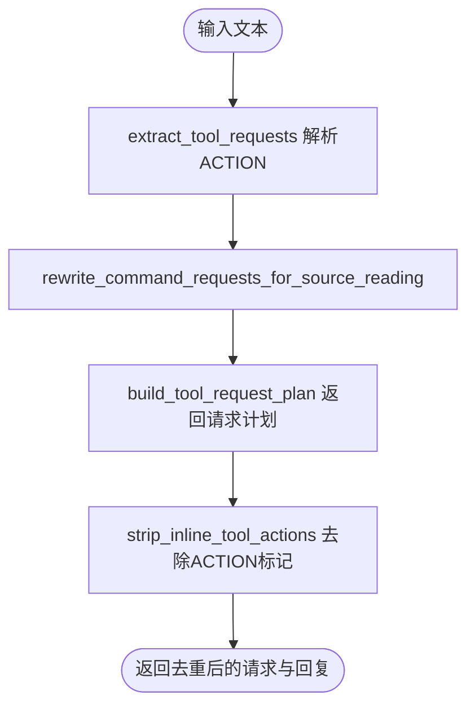
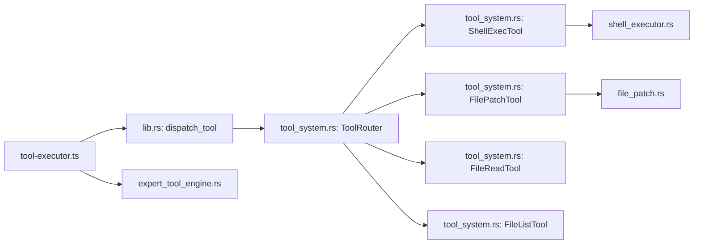

# 工具执行器

<cite>
**本文档引用的文件**
- [tool-executor.ts](file://src/tool-executor.ts)
- [tool-registry.ts](file://src/tool-registry.ts)
- [tool_system.rs](file://src-tauri/src/tool_system.rs)
- [shell_executor.rs](file://src-tauri/src/shell_executor.rs)
- [file_patch.rs](file://src-tauri/src/file_patch.rs)
- [expert_tool_engine.rs](file://src-tauri/src/expert_tool_engine.rs)
- [lib.rs](file://src-tauri/src/lib.rs)
</cite>

## 目录
1. [简介](#简介)
2. [项目结构](#项目结构)
3. [核心组件](#核心组件)
4. [架构总览](#架构总览)
5. [详细组件分析](#详细组件分析)
6. [依赖分析](#依赖分析)
7. [性能考虑](#性能考虑)
8. [故障排查指南](#故障排查指南)
9. [结论](#结论)
10. [附录](#附录)

## 简介
本文件面向“工具执行器”的技术文档，系统阐述其核心工作原理、调用流程、参数校验、结果处理、异步执行与并发控制、资源管理、生命周期管理、错误处理与恢复、性能监控与优化、超时控制、安全隔离与沙箱配置，以及如何调用不同类型的工具。文档以仓库现有代码为依据，结合前后端桥接层与后端工具系统，给出可操作的说明与可视化图示。

## 项目结构
工具执行器由前端桥接层与后端工具系统两部分组成：
- 前端桥接层：负责将工具调用请求发送至后端，统一封装结果与错误；支持从LLM响应中抽取工具调用（双轨协议）。
- 后端工具系统：提供工具注册表、路由器、具体工具实现（Shell执行、文件读写、文件补丁、网络搜索、索引搜索、记忆查询等），并内置安全与资源控制。

图表来源
- [tool-executor.ts:1-231](file://src/tool-executor.ts#L1-L231)
- [lib.rs:6289-6310](file://src-tauri/src/lib.rs#L6289-L6310)
- [tool_system.rs:97-142](file://src-tauri/src/tool_system.rs#L97-L142)

章节来源
- [tool-executor.ts:1-231](file://src/tool-executor.ts#L1-L231)
- [tool-registry.ts:1-192](file://src/tool-registry.ts#L1-L192)
- [tool_system.rs:97-142](file://src-tauri/src/tool_system.rs#L97-L142)
- [lib.rs:6289-6310](file://src-tauri/src/lib.rs#L6289-L6310)

## 核心组件
- 前端工具执行器（ToolExecutor）
  - 提供统一执行入口，封装 invoke 调用，处理后端返回结果与异常；对 file_patch 工具进行结构化错误回传。
  - 支持从 LLM 响应中抽取工具调用（OpenAI function calling 与 ACTION 标记双轨协议）。
- 前端工具注册表（ToolRegistry）
  - 定义各工具的 JSON Schema 参数、描述与权限级别；按专家角色过滤可用工具。
- 后端工具系统
  - 抽象工具接口、工具定义、执行上下文、执行结果与错误类型。
  - 工具路由器负责根据名称分发到具体工具实现。
  - 内置工具：shell_exec、file_read、file_write、file_patch、file_list、web_search、memory_query、index_search。
- 执行器与引擎
  - Shell 执行器：跨平台命令执行、输出截断、超时控制、工作目录沙箱、危险命令检测。
  - 文件补丁器：结构化补丁解析、路径安全校验、四级容错匹配、Delta 跟踪与部分应用。
  - 专家工具引擎：从文本中提取工具请求、改写命令为文件读取、路径规范化与工作目录解析。

章节来源
- [tool-executor.ts:13-53](file://src/tool-executor.ts#L13-L53)
- [tool-executor.ts:148-222](file://src/tool-executor.ts#L148-L222)
- [tool-registry.ts:20-181](file://src/tool-registry.ts#L20-L181)
- [tool_system.rs:51-60](file://src-tauri/src/tool_system.rs#L51-L60)
- [tool_system.rs:97-142](file://src-tauri/src/tool_system.rs#L97-L142)
- [shell_executor.rs:498-633](file://src-tauri/src/shell_executor.rs#L498-L633)
- [file_patch.rs:151-289](file://src-tauri/src/file_patch.rs#L151-L289)
- [expert_tool_engine.rs:288-404](file://src-tauri/src/expert_tool_engine.rs#L288-L404)

## 架构总览
工具执行器采用“前端桥接 + 后端路由 + 工具实现”的分层设计。前端通过 Tauri 命令将工具名与参数传递给后端路由器，路由器根据名称选择对应工具执行器，执行完成后将结构化结果返回前端。

图表来源
- [lib.rs:6289-6310](file://src-tauri/src/lib.rs#L6289-L6310)
- [tool_system.rs:123-136](file://src-tauri/src/tool_system.rs#L123-L136)
- [tool-executor.ts:24-53](file://src/tool-executor.ts#L24-L53)

## 详细组件分析

### 前端工具执行器（ToolExecutor）
- 统一执行入口：execute(toolName, argsJson, expertId)
  - 通过 invoke 调用后端 dispatch_tool，参数自动序列化；解析后端返回的 ToolExecResult。
  - 对 file_patch 的失败结果进行结构化错误反馈，便于模型自我修复。
- LLM工具调用抽取：extractToolCalls(response)
  - 支持 OpenAI function calling 与 ACTION 标记两种格式，向后兼容。
  - 将 ACTION 标记映射到新工具系统（如 EDIT_FILE -> file_patch）。
- 错误处理：invoke 级别异常时，file_patch 构造结构化错误字符串；其他工具返回通用错误提示。

图表来源
- [tool-executor.ts:24-53](file://src/tool-executor.ts#L24-L53)
- [tool-executor.ts:59-104](file://src/tool-executor.ts#L59-L104)

章节来源
- [tool-executor.ts:13-53](file://src/tool-executor.ts#L13-L53)
- [tool-executor.ts:148-222](file://src/tool-executor.ts#L148-L222)

### 前端工具注册表（ToolRegistry）
- 注册内置工具：shell_exec、file_read、file_write、file_patch、file_list、web_search、memory_query、index_search。
- Schema 定义：参数类型、属性、必填项；权限级别 auto/confirm/block。
- 角色过滤：根据专家 ID 获取可用工具集合，转换为 OpenAI function calling 格式。

章节来源
- [tool-registry.ts:20-181](file://src/tool-registry.ts#L20-L181)

### 后端工具路由器与工具系统
- 抽象接口：ToolExecutor trait 定义 definition 与 execute。
- 路由器：ToolRouter.with_builtin_tools 注册所有内置工具，dispatch 分发执行。
- 工具定义：ToolDefinition 包含名称、描述、JSON Schema 参数与所需权限级别。
- 执行上下文：ToolContext 包含 working_dir、project_dir、expert_id、session_id。

图表来源
- [tool_system.rs:51-60](file://src-tauri/src/tool_system.rs#L51-L60)
- [tool_system.rs:97-142](file://src-tauri/src/tool_system.rs#L97-L142)
- [tool_system.rs:63-95](file://src-tauri/src/tool_system.rs#L63-L95)

章节来源
- [tool_system.rs:51-60](file://src-tauri/src/tool_system.rs#L51-L60)
- [tool_system.rs:97-142](file://src-tauri/src/tool_system.rs#L97-L142)

### Shell 执行器（shell_exec）
- 参数校验：必需参数 command；可选 working_dir、timeout_ms。
- 超时控制：默认 60000ms；可配置 kill_on_timeout。
- 输出截断：Head+Tail Buffer 保留首尾若干行，超过阈值截断并标注。
- 工作目录沙箱：仅允许在 project_dir 内部；可禁用沙箱。
- 危险命令检测：预设危险模式与需要提权的命令前缀。
- 跨平台：Windows 使用 PowerShell/cmd；Unix 使用 sh -c。

图表来源
- [shell_executor.rs:498-633](file://src-tauri/src/shell_executor.rs#L498-L633)
- [shell_executor.rs:336-371](file://src-tauri/src/shell_executor.rs#L336-L371)

章节来源
- [shell_executor.rs:182-222](file://src-tauri/src/shell_executor.rs#L182-L222)
- [shell_executor.rs:498-633](file://src-tauri/src/shell_executor.rs#L498-L633)

### 文件补丁器（file_patch）
- 补丁格式：Begin/End 包裹的 Add/Delete/Update/Move 操作，支持 @@ 上下文定位。
- 路径安全：拒绝绝对路径、路径穿越、符号链接；规范化路径并确保在 project_dir 内。
- 四级容错匹配：精确匹配、右trim、两侧trim、Unicode归一化，提升鲁棒性。
- 部分应用与 Delta 跟踪：即使部分失败，也记录已应用文件与失败原因，便于模型后续修正。

图表来源
- [file_patch.rs:151-289](file://src-tauri/src/file_patch.rs#L151-L289)
- [file_patch.rs:515-618](file://src-tauri/src/file_patch.rs#L515-L618)
- [file_patch.rs:665-833](file://src-tauri/src/file_patch.rs#L665-L833)

章节来源
- [file_patch.rs:151-289](file://src-tauri/src/file_patch.rs#L151-L289)
- [file_patch.rs:515-618](file://src-tauri/src/file_patch.rs#L515-L618)
- [file_patch.rs:665-833](file://src-tauri/src/file_patch.rs#L665-L833)

### 专家工具引擎（专家指令解析与改写）
- 从文本中提取工具请求：WEB_SEARCH、EXECUTE_CMD、READ_FILE、LIST_FILES。
- 命令改写：将探测源码的命令改写为 READ_FILE，并根据上下文窗口定位。
- 路径与工作目录：规范化路径、解析相对工作目录、支持项目根目录别名。
- 去除内联工具动作：剥离 ACTION 标记，保留干净回复。

图表来源
- [expert_tool_engine.rs:288-404](file://src-tauri/src/expert_tool_engine.rs#L288-L404)
- [expert_tool_engine.rs:406-453](file://src-tauri/src/expert_tool_engine.rs#L406-L453)
- [expert_tool_engine.rs:455-480](file://src-tauri/src/expert_tool_engine.rs#L455-L480)

章节来源
- [expert_tool_engine.rs:288-404](file://src-tauri/src/expert_tool_engine.rs#L288-L404)
- [expert_tool_engine.rs:406-453](file://src-tauri/src/expert_tool_engine.rs#L406-L453)
- [expert_tool_engine.rs:455-480](file://src-tauri/src/expert_tool_engine.rs#L455-L480)

## 依赖分析
- 前端依赖后端 Tauri 命令 dispatch_tool，后者通过 ToolRouter 调用具体工具实现。
- Shell 执行器依赖 tokio 子进程与异步 IO；文件补丁器依赖路径规范化与文件系统操作。
- 专家工具引擎依赖正则表达式与路径解析，辅助将命令改写为更安全的文件读取。

图表来源
- [lib.rs:6289-6310](file://src-tauri/src/lib.rs#L6289-L6310)
- [tool_system.rs:123-136](file://src-tauri/src/tool_system.rs#L123-L136)
- [shell_executor.rs:498-633](file://src-tauri/src/shell_executor.rs#L498-L633)
- [file_patch.rs:992-1005](file://src-tauri/src/file_patch.rs#L992-L1005)

章节来源
- [lib.rs:6289-6310](file://src-tauri/src/lib.rs#L6289-L6310)
- [tool_system.rs:123-136](file://src-tauri/src/tool_system.rs#L123-L136)

## 性能考虑
- 异步执行与并发
  - Shell 执行器使用 tokio 并发读取 stdout/stderr，避免阻塞；超时后可选择杀死进程。
  - 工具注册表使用 Arc 动态分发，减少锁竞争。
- 资源控制
  - 输出截断：Head+Tail Buffer 控制内存占用与传输大小。
  - 超时与最大行数：可配置 timeout_ms、max_output_lines、max_output_bytes。
  - 工作目录沙箱：防止越界访问与资源泄露。
- I/O 优化
  - 文件补丁器采用逆向应用策略，从后向前替换，避免行号偏移导致的重复扫描。
  - 文件列表工具支持最大递归深度，避免深层目录遍历带来的开销。
- 监控指标建议
  - 执行耗时（wall_time_ms）、是否被截断（truncated）、是否被杀（killed）、总行数（total_lines）。
  - 工具成功率、失败原因分布、已应用文件数量、失败操作数量。

章节来源
- [shell_executor.rs:336-371](file://src-tauri/src/shell_executor.rs#L336-L371)
- [shell_executor.rs:498-633](file://src-tauri/src/shell_executor.rs#L498-L633)
- [tool_system.rs:534-581](file://src-tauri/src/tool_system.rs#L534-L581)

## 故障排查指南
- 常见错误与定位
  - 工具未找到：检查工具名是否正确，或是否在 ToolRouter 注册。
  - 参数缺失：检查 ToolDefinition 的 required 字段与前端传参。
  - 路径越界：file_patch 与文件工具均会拒绝绝对路径与路径穿越；确认 working_dir 与 project_dir。
  - 命令超时：调整 timeout_ms；必要时 kill_on_timeout。
  - 危险命令：触发危险模式或需要提权的命令会被拦截。
- 恢复策略
  - 对 file_patch：前端将结构化错误反馈给模型，指导其修正补丁。
  - 对 shell_exec：根据 metadata 中的 wall_time_ms、truncated、killed 判断是否重试或缩短输出。
  - 对网络搜索：错误标记 retryable=true，可进行指数退避重试。
- 日志与调试
  - 后端工具执行器返回的 ToolOutput.result 与 metadata 是诊断关键；前端可据此生成更友好的错误提示。

章节来源
- [tool_system.rs:182-222](file://src-tauri/src/tool_system.rs#L182-L222)
- [tool_system.rs:495-506](file://src-tauri/src/tool_system.rs#L495-L506)
- [tool-executor.ts:59-104](file://src/tool-executor.ts#L59-L104)

## 结论
工具执行器通过前后端协作，实现了统一的工具调用入口、灵活的参数校验与结果处理、完善的错误与安全控制，以及可观测的性能指标。Shell 执行器与文件补丁器分别针对命令执行与文件变更提供了高鲁棒性的实现；专家工具引擎进一步提升了从自然语言到工具调用的自动化程度。整体架构清晰、职责分离、易于扩展新的工具与能力。

## 附录

### 生命周期管理
- 初始化：前端 ToolExecutor 设置项目目录；后端 ToolRouter 注册内置工具。
- 执行：前端调用 execute，后端路由到具体工具实现。
- 监控：工具返回 ToolOutput，包含 success、result、metadata。
- 清理：进程被杀死或正常退出；文件系统变更持久化。

章节来源
- [tool-executor.ts:16-18](file://src/tool-executor.ts#L16-L18)
- [tool_system.rs:109-121](file://src-tauri/src/tool_system.rs#L109-L121)
- [tool_system.rs:123-136](file://src-tauri/src/tool_system.rs#L123-L136)

### 异步执行与并发控制
- 后端：Tokio 异步任务并发读取子进程输出，超时后可杀死进程。
- 前端：invoke 为异步调用，等待后端完成后再解析结果。
- 并发：工具注册表使用 Arc 分发，避免锁争用。

章节来源
- [shell_executor.rs:556-596](file://src-tauri/src/shell_executor.rs#L556-L596)
- [tool_system.rs:62-95](file://src-tauri/src/tool_system.rs#L62-L95)

### 超时控制与资源管理
- Shell 执行器：可配置 timeout_ms、max_output_bytes、max_output_lines、kill_on_timeout、working_dir_sandbox。
- 文件补丁器：通过路径安全检查与四级匹配降低无效重试成本。
- 专家工具引擎：解析与改写阶段尽量减少不必要的 I/O。

章节来源
- [shell_executor.rs:336-358](file://src-tauri/src/shell_executor.rs#L336-L358)
- [file_patch.rs:102-147](file://src-tauri/src/file_patch.rs#L102-L147)

### 安全隔离与沙箱
- 路径安全：拒绝绝对路径、路径穿越、符号链接；规范化路径并在 project_dir 内校验。
- 工作目录沙箱：Shell 执行器默认启用 working_dir_sandbox，防止越界。
- 危险命令检测：预设危险模式与需要提权的命令前缀，拦截高风险操作。

章节来源
- [file_patch.rs:102-147](file://src-tauri/src/file_patch.rs#L102-L147)
- [shell_executor.rs:507-516](file://src-tauri/src/shell_executor.rs#L507-L516)
- [shell_executor.rs:476-495](file://src-tauri/src/shell_executor.rs#L476-L495)

### 如何调用不同类型的工具（示例路径）
- Shell 执行：调用后端 dispatch_tool，参数包含 command、working_dir、timeout_ms。
  - 示例路径：[lib.rs:6289-6310](file://src-tauri/src/lib.rs#L6289-L6310)
- 文件读取：参数 path，可选 start_line、end_line。
  - 示例路径：[tool_system.rs:257-312](file://src-tauri/src/tool_system.rs#L257-L312)
- 文件写入：参数 path、content，可选 append。
  - 示例路径：[tool_system.rs:347-426](file://src-tauri/src/tool_system.rs#L347-L426)
- 文件补丁：参数 patch（Begin/End 包裹的结构化补丁）。
  - 示例路径：[tool_system.rs:459-506](file://src-tauri/src/tool_system.rs#L459-L506)
- 文件列表：参数 path、recursive、max_depth。
  - 示例路径：[tool_system.rs:540-581](file://src-tauri/src/tool_system.rs#L540-L581)
- 网络搜索：参数 query、max_results。
  - 示例路径：[tool_system.rs:653-686](file://src-tauri/src/tool_system.rs#L653-L686)
- 记忆查询：参数 query、memory_type。
  - 示例路径：[tool_system.rs:720-744](file://src-tauri/src/tool_system.rs#L720-L744)
- 索引搜索：参数 query、file_pattern。
  - 示例路径：[tool_system.rs:778-798](file://src-tauri/src/tool_system.rs#L778-L798)