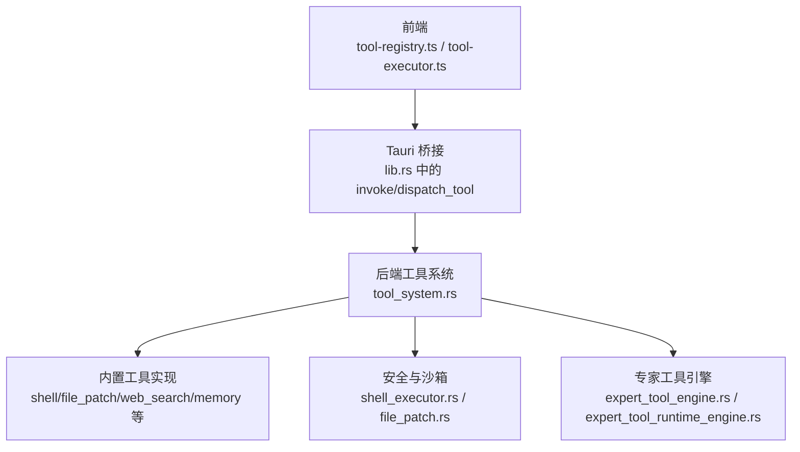
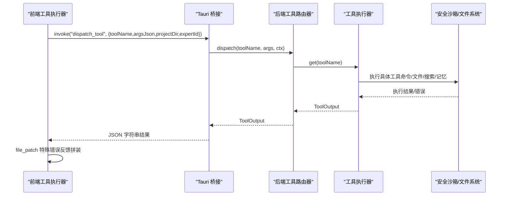
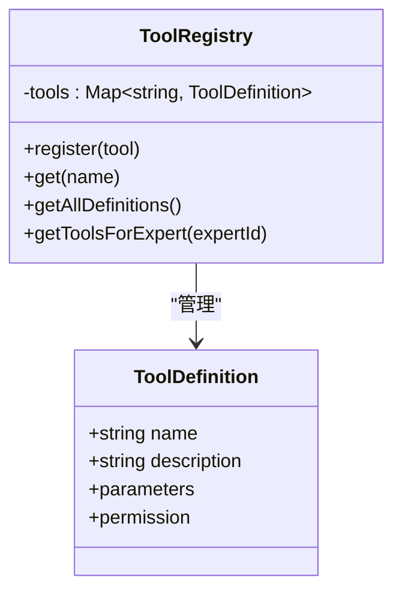
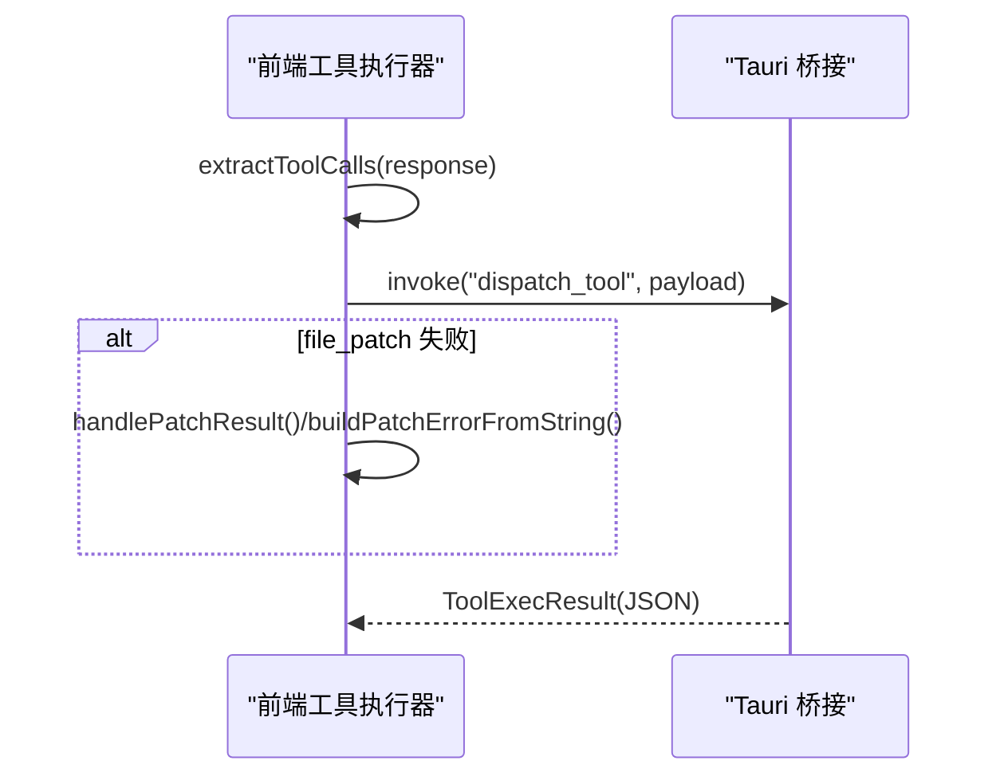
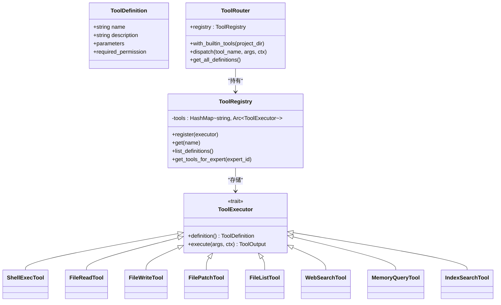
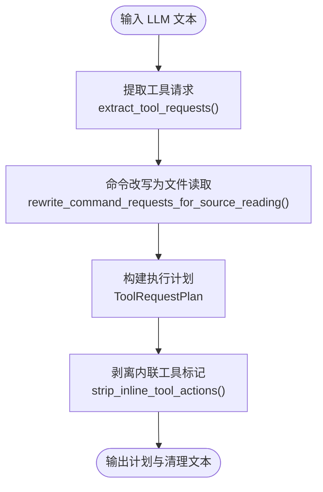
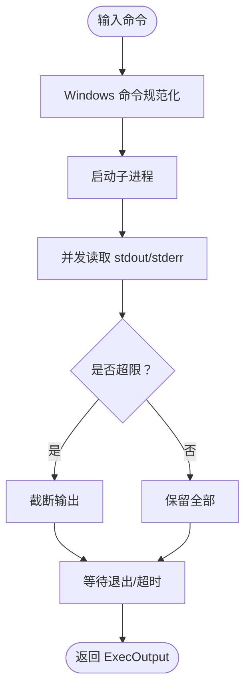
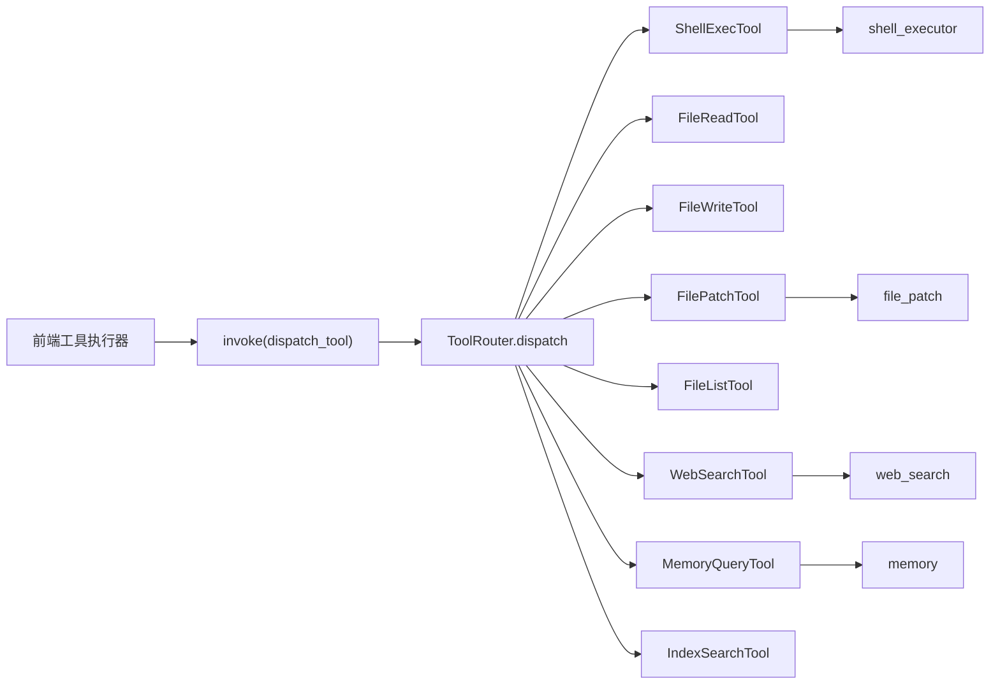

# 工具执行系统

<cite>
**本文档引用的文件**
- [src/tool-registry.ts](file://src/tool-registry.ts)
- [src/tool-executor.ts](file://src/tool-executor.ts)
- [src-tauri/src/tool_system.rs](file://src-tauri/src/tool_system.rs)
- [src-tauri/src/expert_tool_engine.rs](file://src-tauri/src/expert_tool_engine.rs)
- [src-tauri/src/expert_tool_runtime_engine.rs](file://src-tauri/src/expert_tool_runtime_engine.rs)
- [src-tauri/src/shell_executor.rs](file://src-tauri/src/shell_executor.rs)
- [src-tauri/src/file_patch.rs](file://src-tauri/src/file_patch.rs)
- [src-tauri/src/web_search.rs](file://src-tauri/src/web_search.rs)
- [src-tauri/src/memory.rs](file://src-tauri/src/memory.rs)
- [src-tauri/src/lib.rs](file://src-tauri/src/lib.rs)
- [src-tauri/src/main.rs](file://src-tauri/src/main.rs)
</cite>

## 目录
1. [简介](#简介)
2. [项目结构](#项目结构)
3. [核心组件](#核心组件)
4. [架构总览](#架构总览)
5. [详细组件分析](#详细组件分析)
6. [依赖关系分析](#依赖关系分析)
7. [性能考虑](#性能考虑)
8. [故障排查指南](#故障排查指南)
9. [结论](#结论)
10. [附录](#附录)

## 简介
本文件面向“工具执行系统”的技术文档，涵盖工具注册表管理、工具发现与加载、工具执行器工作机制（工具调用、参数传递、结果处理）、专家工具引擎实现细节（生命周期管理、状态跟踪、错误处理）、配置选项、安全策略、性能优化方法、最佳实践、接口规范、测试指南以及监控与日志调试支持。文档同时提供具体代码示例的路径指引，帮助开发者快速上手与扩展。

## 项目结构
工具执行系统由前端 TypeScript 与后端 Rust 两部分协同组成：
- 前端负责工具定义与调用提取、参数解析与结果封装
- 后端负责工具注册表、路由分发、执行器实现、安全沙箱与资源控制

图表来源
- [src/tool-registry.ts:1-192](file://src/tool-registry.ts#L1-L192)
- [src/tool-executor.ts:1-231](file://src/tool-executor.ts#L1-L231)
- [src-tauri/src/lib.rs:707-841](file://src-tauri/src/lib.rs#L707-L841)
- [src-tauri/src/tool_system.rs:62-142](file://src-tauri/src/tool_system.rs#L62-L142)
- [src-tauri/src/shell_executor.rs:498-633](file://src-tauri/src/shell_executor.rs#L498-L633)
- [src-tauri/src/file_patch.rs:665-800](file://src-tauri/src/file_patch.rs#L665-L800)
- [src-tauri/src/web_search.rs:16-68](file://src-tauri/src/web_search.rs#L16-L68)
- [src-tauri/src/memory.rs:167-305](file://src-tauri/src/memory.rs#L167-L305)
- [src-tauri/src/expert_tool_engine.rs:288-480](file://src-tauri/src/expert_tool_engine.rs#L288-L480)
- [src-tauri/src/expert_tool_runtime_engine.rs:1-120](file://src-tauri/src/expert_tool_runtime_engine.rs#L1-L120)

章节来源
- [src/tool-registry.ts:1-192](file://src/tool-registry.ts#L1-L192)
- [src/tool-executor.ts:1-231](file://src/tool-executor.ts#L1-L231)
- [src-tauri/src/lib.rs:707-841](file://src-tauri/src/lib.rs#L707-L841)

## 核心组件
- 工具注册表（前端）：定义工具 Schema 与权限，按专家角色过滤可用工具
- 工具执行器（前端）：统一入口调用后端，处理 file_patch 特殊错误反馈
- 工具系统（后端）：注册表、路由、工具抽象与内置工具实现
- 专家工具引擎：从 LLM 输出中提取工具请求、改写命令为文件读取、构建执行计划
- 安全与沙箱：命令执行安全检查、路径沙箱、输出截断与超时控制
- 结构化补丁：解析与应用 Patch，容错匹配与 Delta 跟踪
- 搜索与记忆：网络搜索、页面正文抽取、本地记忆检索与生命周期管理

章节来源
- [src/tool-registry.ts:20-192](file://src/tool-registry.ts#L20-L192)
- [src/tool-executor.ts:13-231](file://src/tool-executor.ts#L13-L231)
- [src-tauri/src/tool_system.rs:62-142](file://src-tauri/src/tool_system.rs#L62-L142)
- [src-tauri/src/expert_tool_engine.rs:288-480](file://src-tauri/src/expert_tool_engine.rs#L288-L480)
- [src-tauri/src/shell_executor.rs:498-633](file://src-tauri/src/shell_executor.rs#L498-L633)
- [src-tauri/src/file_patch.rs:665-800](file://src-tauri/src/file_patch.rs#L665-L800)
- [src-tauri/src/web_search.rs:16-68](file://src-tauri/src/web_search.rs#L16-L68)
- [src-tauri/src/memory.rs:167-305](file://src-tauri/src/memory.rs#L167-L305)

## 架构总览
系统采用“前后端分离 + Tauri 桥接”的设计：
- 前端通过 invoke 调用后端命令 dispatch_tool，传入工具名、参数、项目目录与专家 ID
- 后端 ToolRouter 根据工具名查找对应工具执行器，执行后返回统一结果结构
- file_patch 工具在前端进行结构化错误反馈拼装，便于模型自我修正

图表来源
- [src/tool-executor.ts:24-53](file://src/tool-executor.ts#L24-L53)
- [src-tauri/src/lib.rs:707-841](file://src-tauri/src/lib.rs#L707-L841)
- [src-tauri/src/tool_system.rs:123-142](file://src-tauri/src/tool_system.rs#L123-L142)

## 详细组件分析

### 工具注册表（前端）
- 职责：维护工具定义（名称、描述、参数 Schema、权限），按专家角色过滤可用工具
- 设计要点：使用 Map 存储工具定义，提供 getToolsForExpert 生成 OpenAI function calling 格式
- 权限模型：auto/confirm/block，结合专家角色映射控制可用工具集

图表来源
- [src/tool-registry.ts:20-192](file://src/tool-registry.ts#L20-L192)

章节来源
- [src/tool-registry.ts:20-192](file://src/tool-registry.ts#L20-L192)

### 工具执行器（前端）
- 职责：统一工具调用入口，封装 invoke 调用，处理 file_patch 的结构化错误反馈
- 提取能力：支持 OpenAI function calling 与旧 ACTION 标记两种格式
- 错误处理：对 file_patch 的 invoke 级别异常进行结构化反馈，指导模型修正 Patch

图表来源
- [src/tool-executor.ts:148-231](file://src/tool-executor.ts#L148-L231)
- [src/tool-executor.ts:24-53](file://src/tool-executor.ts#L24-L53)

章节来源
- [src/tool-executor.ts:13-231](file://src/tool-executor.ts#L13-L231)

### 工具系统（后端）
- 职责：工具抽象、注册表、路由器、内置工具实现
- 抽象：ToolExecutor trait 定义工具定义与异步执行接口
- 注册表：ToolRegistry 存放 Arc<dyn ToolExecutor>，支持按专家过滤
- 路由器：ToolRouter.with_builtin_tools 初始化内置工具，dispatch 分发执行
- 内置工具：ShellExec/FileRead/FileWrite/FilePatch/FileList/WebSearch/MemoryQuery/IndexSearch

图表来源
- [src-tauri/src/tool_system.rs:52-142](file://src-tauri/src/tool_system.rs#L52-L142)
- [src-tauri/src/tool_system.rs:146-800](file://src-tauri/src/tool_system.rs#L146-L800)

章节来源
- [src-tauri/src/tool_system.rs:52-142](file://src-tauri/src/tool_system.rs#L52-L142)
- [src-tauri/src/tool_system.rs:146-800](file://src-tauri/src/tool_system.rs#L146-L800)

### 专家工具引擎
- 职责：从 LLM 输出中提取工具请求（ACTION 标记与函数调用），改写命令为文件读取，构建执行计划
- 功能点：ACTION 标记解析、参数解码、命令安全改写、路径规范化、工作目录解析、请求计划构建

图表来源
- [src-tauri/src/expert_tool_engine.rs:288-480](file://src-tauri/src/expert_tool_engine.rs#L288-L480)
- [src-tauri/src/expert_tool_engine.rs:455-480](file://src-tauri/src/expert_tool_engine.rs#L455-L480)

章节来源
- [src-tauri/src/expert_tool_engine.rs:288-480](file://src-tauri/src/expert_tool_engine.rs#L288-L480)

### 专家工具运行时引擎
- 职责：封装工具执行事件、授权请求、结果汇总与上下文构建
- 功能点：WebSearch/Command 事件构建、授权模式判定、输出截断与摘要、错误事件封装

章节来源
- [src-tauri/src/expert_tool_runtime_engine.rs:1-120](file://src-tauri/src/expert_tool_runtime_engine.rs#L1-L120)
- [src-tauri/src/expert_tool_runtime_engine.rs:139-431](file://src-tauri/src/expert_tool_runtime_engine.rs#L139-L431)

### 安全与沙箱（命令执行）
- 职责：跨平台命令执行、安全检查、路径沙箱、输出截断、超时控制
- 特性：Windows PowerShell/命令行自动识别与兼容、危险命令检测、工作目录沙箱、Head+Tail 缓冲、超时 Kill

图表来源
- [src-tauri/src/shell_executor.rs:498-633](file://src-tauri/src/shell_executor.rs#L498-L633)

章节来源
- [src-tauri/src/shell_executor.rs:498-633](file://src-tauri/src/shell_executor.rs#L498-L633)

### 结构化补丁（file_patch）
- 职责：解析 Patch 文本、安全路径校验、容错匹配、应用补丁、Delta 跟踪
- 特性：Add/Update/Delete/Move 四种操作、上下文锚点定位、Unicode 归一化、路径穿越防护

章节来源
- [src-tauri/src/file_patch.rs:665-800](file://src-tauri/src/file_patch.rs#L665-L800)
- [src-tauri/src/file_patch.rs:151-289](file://src-tauri/src/file_patch.rs#L151-L289)

### 搜索与记忆
- 网络搜索：Bing RSS/HTML 解析、DuckDuckGo 备用、结果缓存、Token 截断
- 本地记忆：TF-IDF 关键词检索、生命周期管理（Ephemeral/Working/LongTerm）

章节来源
- [src-tauri/src/web_search.rs:16-68](file://src-tauri/src/web_search.rs#L16-L68)
- [src-tauri/src/web_search.rs:309-348](file://src-tauri/src/web_search.rs#L309-L348)
- [src-tauri/src/memory.rs:167-305](file://src-tauri/src/memory.rs#L167-L305)
- [src-tauri/src/memory.rs:384-392](file://src-tauri/src/memory.rs#L384-L392)

## 依赖关系分析
- 前端依赖后端通过 Tauri invoke 调用 dispatch_tool
- 后端工具系统依赖 shell_executor/file_patch/web_search/memory 等模块
- 专家工具引擎与运行时引擎分别负责请求提取与事件封装
- 安全沙箱贯穿命令执行与文件操作

图表来源
- [src-tauri/src/lib.rs:707-841](file://src-tauri/src/lib.rs#L707-L841)
- [src-tauri/src/tool_system.rs:123-142](file://src-tauri/src/tool_system.rs#L123-L142)
- [src-tauri/src/shell_executor.rs:498-633](file://src-tauri/src/shell_executor.rs#L498-L633)
- [src-tauri/src/file_patch.rs:665-800](file://src-tauri/src/file_patch.rs#L665-L800)
- [src-tauri/src/web_search.rs:16-68](file://src-tauri/src/web_search.rs#L16-L68)
- [src-tauri/src/memory.rs:167-305](file://src-tauri/src/memory.rs#L167-L305)

章节来源
- [src-tauri/src/lib.rs:707-841](file://src-tauri/src/lib.rs#L707-L841)
- [src-tauri/src/tool_system.rs:123-142](file://src-tauri/src/tool_system.rs#L123-L142)

## 性能考虑
- 输出截断：Head+Tail 缓冲减少大输出内存占用，超限时截断并提示
- 超时控制：可配置超时与 Kill 行为，避免长时间阻塞
- I/O 优化：文件读写按需创建父目录，避免重复 I/O
- 搜索缓存：网络搜索结果缓存，降低重复请求成本
- Token 截断：记忆检索与搜索结果按 Token 预算截断，控制上下文大小

章节来源
- [src-tauri/src/shell_executor.rs:401-465](file://src-tauri/src/shell_executor.rs#L401-L465)
- [src-tauri/src/shell_executor.rs:557-633](file://src-tauri/src/shell_executor.rs#L557-L633)
- [src-tauri/src/web_search.rs:306-348](file://src-tauri/src/web_search.rs#L306-L348)
- [src-tauri/src/memory.rs:683-694](file://src-tauri/src/memory.rs#L683-L694)

## 故障排查指南
- file_patch 错误反馈：前端对失败结果进行结构化拼装，包含错误、失败文件、行号、文件片段与已应用文件列表，指导模型修正 Patch
- 命令安全检查：工作目录越界、危险命令模式、管理员权限需求会被拒绝并返回明确原因
- 路径安全：file_patch 使用多层路径校验（绝对路径拒绝、路径穿越、符号链接禁止、规范化比较）
- 搜索失败：Bing 失败时自动降级至 DuckDuckGo，最终构造可访问的搜索链接
- 记忆生命周期：定期提升/凝练记忆，清理过期条目，避免无限增长

章节来源
- [src/tool-executor.ts:59-104](file://src/tool-executor.ts#L59-L104)
- [src-tauri/src/shell_executor.rs:212-259](file://src-tauri/src/shell_executor.rs#L212-L259)
- [src-tauri/src/file_patch.rs:101-147](file://src-tauri/src/file_patch.rs#L101-L147)
- [src-tauri/src/web_search.rs:322-348](file://src-tauri/src/web_search.rs#L322-L348)
- [src-tauri/src/memory.rs:384-392](file://src-tauri/src/memory.rs#L384-L392)

## 结论
工具执行系统通过前后端协作与严格的沙箱安全策略，实现了可扩展、可观测、可恢复的工具链路。前端负责工具定义与调用提取，后端提供统一的工具抽象与内置实现，并通过专家工具引擎与运行时引擎实现从 LLM 到真实执行的闭环。配套的安全检查、输出截断与生命周期管理确保系统在复杂场景下的稳定性与安全性。

## 附录

### 配置选项与安全策略
- 执行配置（ExecConfig）：超时、最大输出字节、最大输出行数、超时 Kill、工作目录沙箱、环境变量覆盖
- 权限级别：Auto/Confirm/Block，结合专家角色映射控制工具可用性
- 危险命令检测：预置危险模式与管理员命令前缀检测
- 路径安全：拒绝绝对路径、路径穿越、符号链接，规范化路径比较

章节来源
- [src-tauri/src/tool_system.rs:9-15](file://src-tauri/src/tool_system.rs#L9-L15)
- [src-tauri/src/tool_system.rs:17-24](file://src-tauri/src/tool_system.rs#L17-L24)
- [src-tauri/src/shell_executor.rs:336-358](file://src-tauri/src/shell_executor.rs#L336-L358)
- [src-tauri/src/shell_executor.rs:476-495](file://src-tauri/src/shell_executor.rs#L476-L495)
- [src-tauri/src/file_patch.rs:101-147](file://src-tauri/src/file_patch.rs#L101-L147)

### 性能优化方法
- 合理设置超时与输出限制，避免大输出导致内存压力
- 使用文件读取的行范围参数，减少不必要的内容传输
- 搜索与记忆按 Token 预算截断，控制上下文规模
- 启用搜索缓存，减少重复请求

章节来源
- [src-tauri/src/shell_executor.rs:336-358](file://src-tauri/src/shell_executor.rs#L336-L358)
- [src-tauri/src/web_search.rs:398-413](file://src-tauri/src/web_search.rs#L398-L413)
- [src-tauri/src/memory.rs:683-694](file://src-tauri/src/memory.rs#L683-L694)

### 最佳实践与接口规范
- 新增工具步骤
  1) 在前端定义工具 Schema 与权限，注册到 ToolRegistry
     - 参考路径：[src/tool-registry.ts:27-141](file://src/tool-registry.ts#L27-L141)
  2) 在后端实现 ToolExecutor trait，并在 ToolRegistry 注册
     - 参考路径：[src-tauri/src/tool_system.rs:172-223](file://src-tauri/src/tool_system.rs#L172-L223)
  3) 在后端 Router 中注册工具
     - 参考路径：[src-tauri/src/tool_system.rs:110-121](file://src-tauri/src/tool_system.rs#L110-L121)
  4) 在 Tauri 命令中暴露 dispatch_tool
     - 参考路径：[src-tauri/src/lib.rs:707-841](file://src-tauri/src/lib.rs#L707-L841)
- 参数传递与结果处理
  - 前端统一通过 invoke 调用，参数为 JSON 字符串
  - file_patch 失败时前端进行结构化反馈拼装
  - 参考路径：[src/tool-executor.ts:24-53](file://src/tool-executor.ts#L24-L53)
- 安全与沙箱
  - 命令执行严格沙箱，路径越界直接拒绝
  - 文件操作前进行路径安全校验
  - 参考路径：[src-tauri/src/shell_executor.rs:507-516](file://src-tauri/src/shell_executor.rs#L507-L516)，[src-tauri/src/file_patch.rs:101-147](file://src-tauri/src/file_patch.rs#L101-L147)
- 监控与日志
  - 专家工具运行时事件封装，包含命令/搜索执行详情
  - 参考路径：[src-tauri/src/expert_tool_runtime_engine.rs:139-431](file://src-tauri/src/expert_tool_runtime_engine.rs#L139-L431)

### 测试指南
- 工具注册与执行：通过 ToolRouter 注册内置工具并执行 file_patch，验证成功写入与结果
  - 参考路径：[src-tauri/src/tool_system.rs:800-841](file://src-tauri/src/tool_system.rs#L800-L841)
- 专家工具引擎：验证 ACTION 标记解析与命令改写为文件读取
  - 参考路径：[src-tauri/src/expert_tool_engine.rs:482-534](file://src-tauri/src/expert_tool_engine.rs#L482-L534)
- 搜索缓存与降级：验证 Bing 失败时 DuckDuckGo 降级
  - 参考路径：[src-tauri/src/web_search.rs:322-348](file://src-tauri/src/web_search.rs#L322-L348)
- 记忆生命周期：验证 Ephemeral/Working/LongTerm 的提升与凝练
  - 参考路径：[src-tauri/src/memory.rs:384-392](file://src-tauri/src/memory.rs#L384-L392)