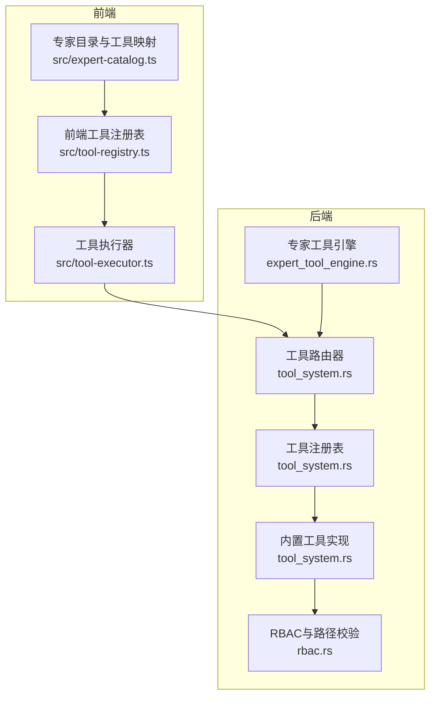
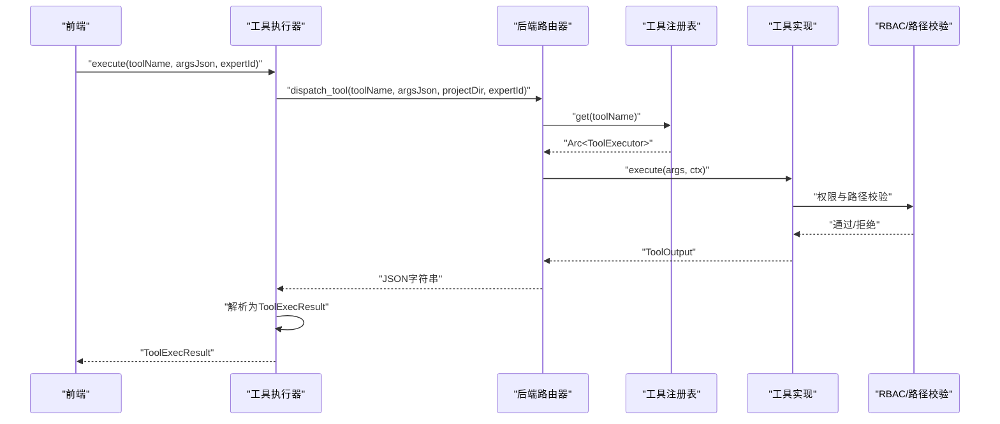
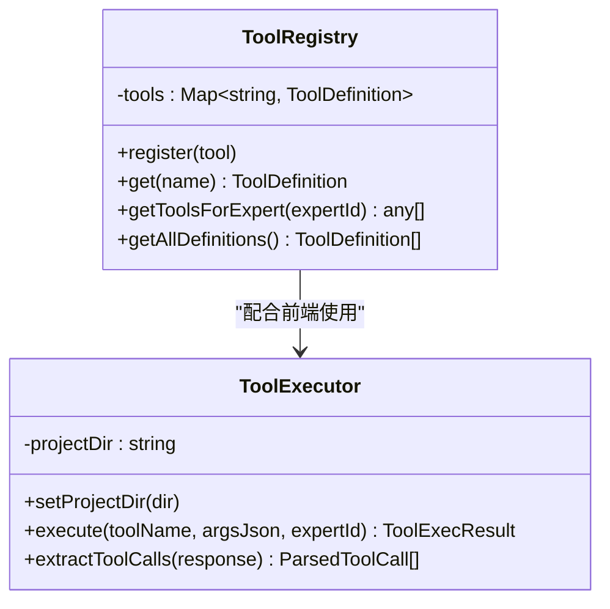
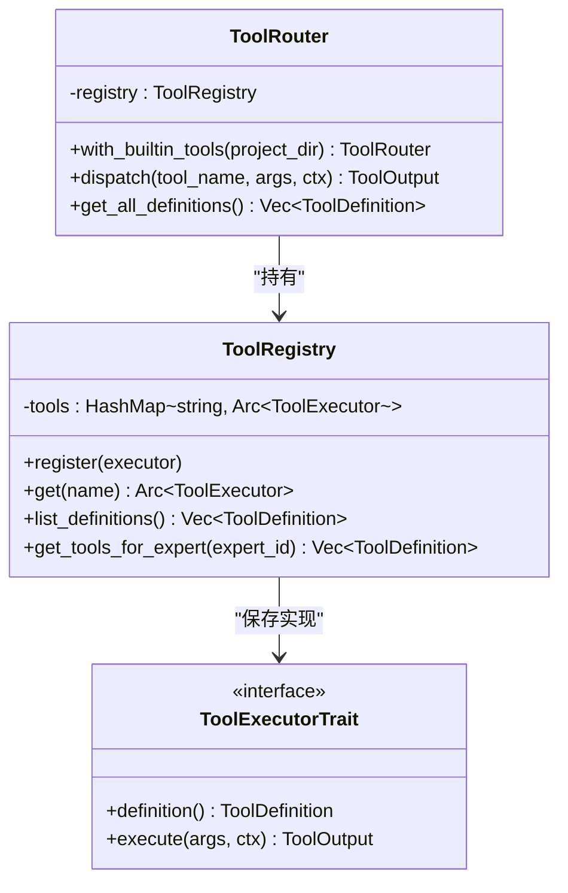
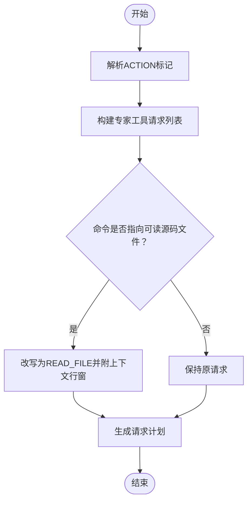
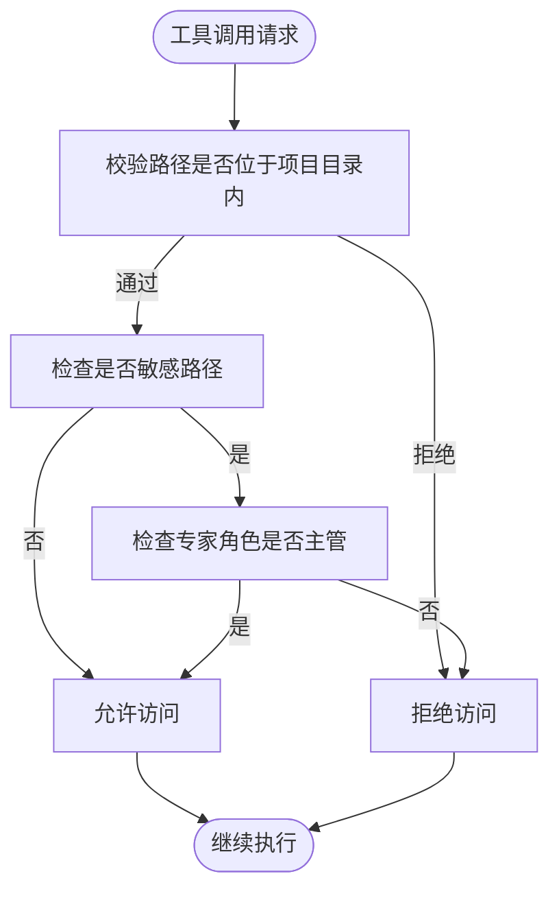
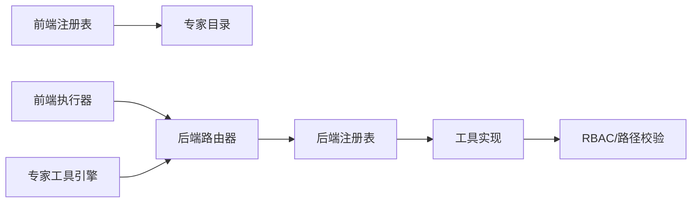

# 工具注册表

<cite>
**本文档引用的文件**
- [tool-registry.ts](file://src/tool-registry.ts)
- [tool-executor.ts](file://src/tool-executor.ts)
- [tool_system.rs](file://src-tauri/src/tool_system.rs)
- [expert_tool_engine.rs](file://src-tauri/src/expert_tool_engine.rs)
- [expert-catalog.ts](file://src/expert-catalog.ts)
- [rbac.rs](file://src-tauri/src/rbac.rs)
- [lib.rs](file://src-tauri/src/lib.rs)
</cite>

## 目录
1. [简介](#简介)
2. [项目结构](#项目结构)
3. [核心组件](#核心组件)
4. [架构总览](#架构总览)
5. [详细组件分析](#详细组件分析)
6. [依赖分析](#依赖分析)
7. [性能考量](#性能考量)
8. [故障排查指南](#故障排查指南)
9. [结论](#结论)
10. [附录](#附录)

## 简介
本文件面向“工具注册表系统”的使用者与维护者，系统化阐述工具的发现、注册与管理机制，工具元数据的存储与Schema格式，工具分类与权限体系，API查询与过滤能力，依赖解析与冲突检测策略，以及安全检查与权限控制。文档同时提供最佳实践与具体示例路径，帮助开发者高效扩展与安全地使用工具注册表。

## 项目结构
工具注册表系统由前端与后端两部分协同构成：
- 前端侧提供工具定义与权限映射，负责将可用工具注入到LLM请求中，并统一执行工具调用。
- 后端侧提供工具注册表、工具执行器、权限控制与沙箱安全策略，负责实际执行与安全校验。

图表来源
- [tool-registry.ts:1-192](file://src/tool-registry.ts#L1-L192)
- [tool-executor.ts:1-231](file://src/tool-executor.ts#L1-L231)
- [tool_system.rs:62-142](file://src-tauri/src/tool_system.rs#L62-L142)
- [rbac.rs:147-184](file://src-tauri/src/rbac.rs#L147-L184)
- [expert_tool_engine.rs:455-480](file://src-tauri/src/expert_tool_engine.rs#L455-L480)

章节来源
- [tool-registry.ts:1-192](file://src/tool-registry.ts#L1-L192)
- [tool-executor.ts:1-231](file://src/tool-executor.ts#L1-L231)
- [tool_system.rs:62-142](file://src-tauri/src/tool_system.rs#L62-L142)
- [expert_tool_engine.rs:455-480](file://src-tauri/src/expert_tool_engine.rs#L455-L480)

## 核心组件
- 前端工具注册表：集中管理工具定义与权限，提供按专家角色过滤工具的能力，并将工具定义注入到LLM请求中。
- 工具执行器：封装统一的工具调用入口，负责将调用请求转发至后端，处理审批与错误反馈。
- 后端工具注册表与路由器：注册内置工具，按名称分发执行，提供工具定义清单。
- 内置工具实现：提供Shell执行、文件读写、文件列表、网络搜索、记忆查询、索引搜索等工具的具体实现。
- 专家目录与权限映射：定义专家与工具的映射关系，控制不同专家可见与可使用的工具集合。
- RBAC与路径校验：对文件访问路径进行沙箱校验，防止越权访问与路径逃逸。
- 专家工具引擎：解析专家输入中的“动作标记”，生成工具请求计划，必要时将命令改写为文件读取以提升安全性与可审计性。

章节来源
- [tool-registry.ts:20-182](file://src/tool-registry.ts#L20-L182)
- [tool-executor.ts:13-231](file://src/tool-executor.ts#L13-L231)
- [tool_system.rs:62-142](file://src-tauri/src/tool_system.rs#L62-L142)
- [expert-catalog.ts:352-361](file://src/expert-catalog.ts#L352-L361)
- [rbac.rs:147-184](file://src-tauri/src/rbac.rs#L147-L184)
- [expert_tool_engine.rs:288-404](file://src-tauri/src/expert_tool_engine.rs#L288-L404)

## 架构总览
工具调用从前端进入，经过权限与格式校验后，由后端路由器分发到具体工具执行器，执行完成后返回结果。前端执行器负责将后端返回的JSON结果结构化为统一的ToolExecResult，并对特定工具（如文件补丁）进行结构化错误反馈。

图表来源
- [tool-executor.ts:24-53](file://src/tool-executor.ts#L24-L53)
- [tool_system.rs:123-142](file://src-tauri/src/tool_system.rs#L123-L142)
- [rbac.rs:147-184](file://src-tauri/src/rbac.rs#L147-L184)

## 详细组件分析

### 前端工具注册表与执行器
- 工具定义与权限
  - 工具定义包含名称、描述、参数Schema（JSON Schema风格）、权限级别（自动/确认/拦截）。
  - 内置工具在注册表中集中注册，涵盖Shell执行、文件读写、文件列表、网络搜索、记忆查询、索引搜索等。
  - 专家工具映射来自专家目录，按专家ID过滤可用工具集合。
- 工具查询与注入
  - 提供按专家过滤的工具清单，用于注入到LLM请求的function calling格式。
  - 提供获取全部工具定义的接口，便于系统级使用。
- 工具执行器
  - 统一入口：将工具调用通过Tauri invoke转发至后端dispatch_tool。
  - 错误处理：对file_patch等工具进行结构化错误反馈，便于模型自我修复。
  - 双轨协议：支持OpenAI function calling与旧ACTION标记格式，向后兼容。

图表来源
- [tool-registry.ts:20-182](file://src/tool-registry.ts#L20-L182)
- [tool-executor.ts:13-231](file://src/tool-executor.ts#L13-L231)

章节来源
- [tool-registry.ts:6-182](file://src/tool-registry.ts#L6-L182)
- [tool-executor.ts:13-231](file://src/tool-executor.ts#L13-L231)
- [expert-catalog.ts:352-361](file://src/expert-catalog.ts#L352-L361)

### 后端工具注册表与路由器
- 注册表与路由器
  - 注册表以名称为键，保存工具执行器实例；提供注册、查找与定义清单。
  - 路由器负责根据工具名分发执行，并提供工具定义清单。
- 内置工具实现
  - Shell执行：支持命令执行、工作目录与超时控制，返回退出码、耗时、截断等元数据。
  - 文件读取：严格沙箱校验路径，支持行区间读取。
  - 文件写入：支持覆盖与追加，自动创建父目录。
  - 文件补丁：解析并应用结构化补丁，返回成功/失败、错误文件、已应用文件等元数据。
  - 文件列表：支持递归与最大深度，返回目录与文件清单。
  - 网络搜索：返回结构化搜索结果。
  - 记忆查询与索引搜索：提供简化的查询结果，实际数据库/索引访问通过其他命令完成。

图表来源
- [tool_system.rs:62-142](file://src-tauri/src/tool_system.rs#L62-L142)

章节来源
- [tool_system.rs:62-142](file://src-tauri/src/tool_system.rs#L62-L142)
- [tool_system.rs:146-800](file://src-tauri/src/tool_system.rs#L146-L800)

### 专家工具引擎与动作解析
- 动作解析
  - 从专家输入中解析ACTION标记，生成专家工具请求列表（WebSearch、Command、FileRead、FileList等）。
  - 对命令进行改写：若命令指向可读源码文件，自动改写为FileRead并附带上下文行窗，提升安全性与可审计性。
- 请求计划
  - 生成工具请求计划，剥离输入中的动作标记，便于后续流程处理。

图表来源
- [expert_tool_engine.rs:288-404](file://src-tauri/src/expert_tool_engine.rs#L288-L404)
- [expert_tool_engine.rs:406-453](file://src-tauri/src/expert_tool_engine.rs#L406-L453)

章节来源
- [expert_tool_engine.rs:288-404](file://src-tauri/src/expert_tool_engine.rs#L288-L404)
- [expert_tool_engine.rs:406-453](file://src-tauri/src/expert_tool_engine.rs#L406-L453)

### 权限控制与安全检查
- 路径沙箱
  - 文件读写/列表等工具均进行路径校验，确保访问限定在项目目录范围内，防止路径逃逸。
- 敏感路径访问
  - 对敏感路径进行访问控制，仅主管角色可访问，其他专家无权访问。
- 权限级别
  - 工具定义包含所需权限级别（自动/确认/拦截），前端执行器在必要时触发审批流程。

图表来源
- [tool_system.rs:268-277](file://src-tauri/src/tool_system.rs#L268-L277)
- [rbac.rs:147-184](file://src-tauri/src/rbac.rs#L147-L184)

章节来源
- [tool_system.rs:268-277](file://src-tauri/src/tool_system.rs#L268-L277)
- [rbac.rs:147-184](file://src-tauri/src/rbac.rs#L147-L184)

## 依赖分析
- 前端依赖
  - 前端工具注册表依赖专家目录的工具映射，按专家ID过滤可用工具。
  - 工具执行器依赖Tauri invoke桥接到后端，统一处理错误与反馈。
- 后端依赖
  - 工具路由器依赖工具注册表；工具注册表依赖各工具实现；工具实现依赖RBAC与路径校验。
  - 专家工具引擎依赖工作区根目录，将命令改写为文件读取以提升安全性。

图表来源
- [tool-registry.ts:17-18](file://src/tool-registry.ts#L17-L18)
- [tool-executor.ts:5](file://src/tool-executor.ts#L5)
- [tool_system.rs:98-142](file://src-tauri/src/tool_system.rs#L98-L142)
- [rbac.rs:147-184](file://src-tauri/src/rbac.rs#L147-L184)
- [expert_tool_engine.rs:455-480](file://src-tauri/src/expert_tool_engine.rs#L455-L480)

章节来源
- [tool-registry.ts:17-18](file://src/tool-registry.ts#L17-L18)
- [tool-executor.ts:5](file://src/tool-executor.ts#L5)
- [tool_system.rs:98-142](file://src-tauri/src/tool_system.rs#L98-L142)
- [rbac.rs:147-184](file://src-tauri/src/rbac.rs#L147-L184)
- [expert_tool_engine.rs:455-480](file://src-tauri/src/expert_tool_engine.rs#L455-L480)

## 性能考量
- 路由与注册表
  - 后端使用哈希表存储工具实现，查找与注册均为常数时间，满足高并发场景。
- I/O与文件操作
  - 文件读写/列表等操作采用异步I/O，避免阻塞；对大文件读取建议使用行区间参数以减少内存占用。
- 搜索与索引
  - 网络搜索与索引查询返回结构化结果，建议在前端进行分页与缓存以提升用户体验。
- 路径解析与改写
  - 专家工具引擎对命令进行解析与改写，建议在输入阶段尽早进行，减少重复扫描。

## 故障排查指南
- 工具未找到
  - 确认工具名称拼写正确，且已在后端注册表中注册。
  - 检查前端是否正确注入工具定义，或是否被专家权限过滤。
- 路径越权或访问被拒
  - 检查工作区根目录与相对路径，确保访问路径位于项目目录内。
  - 确认专家角色是否具备访问敏感路径的权限。
- 文件补丁失败
  - 查看返回的结构化错误信息，定位失败文件与行号，修正补丁上下文后再试。
- 执行器异常
  - 检查invoke参数是否正确，确保argsJson为合法JSON字符串。
  - 关注后端日志中的ToolError与元数据，以便快速定位问题。

章节来源
- [tool_system.rs:130-136](file://src-tauri/src/tool_system.rs#L130-L136)
- [tool_executor.rs:40-53](file://src-tauri/src/tool_system.rs#L40-L53)
- [tool-executor.ts:34-53](file://src/tool-executor.ts#L34-L53)

## 结论
工具注册表系统通过前后端协同，实现了工具的标准化注册、权限控制与安全执行。前端负责工具定义与调用封装，后端负责工具实现与沙箱安全。专家工具引擎进一步提升了安全性与可审计性。遵循本文的最佳实践与安全策略，可有效扩展工具集并保障系统稳定与安全。

## 附录

### 工具元数据与Schema
- 工具定义包含：名称、描述、参数Schema（JSON Schema风格）、权限级别。
- 参数Schema用于LLM函数调用的参数校验与提示。

章节来源
- [tool-registry.ts:6-15](file://src/tool-registry.ts#L6-L15)
- [tool_system.rs:18-24](file://src-tauri/src/tool_system.rs#L18-L24)

### 工具分类与权限映射
- 专家目录定义了专家与工具的映射关系，前端注册表据此过滤可用工具。
- 工具定义包含所需权限级别，前端执行器据此决定是否需要审批。

章节来源
- [expert-catalog.ts:352-361](file://src/expert-catalog.ts#L352-L361)
- [tool-registry.ts:17-18](file://src/tool-registry.ts#L17-L18)
- [tool_system.rs:18-24](file://src-tauri/src/tool_system.rs#L18-L24)

### API与调用示例（示例路径）
- 注册自定义工具
  - 在后端注册表中注册新的工具实现，并在路由器中注册。
  - 示例路径：[tool_system.rs:74-77](file://src-tauri/src/tool_system.rs#L74-L77), [tool_system.rs:110-121](file://src-tauri/src/tool_system.rs#L110-L121)
- 查询可用工具
  - 前端：使用工具注册表的按专家过滤接口。
  - 后端：使用路由器的工具定义清单接口。
  - 示例路径：[tool-registry.ts:155-174](file://src/tool-registry.ts#L155-L174), [tool_system.rs:138-141](file://src-tauri/src/tool_system.rs#L138-L141)
- 执行工具调用
  - 前端：通过工具执行器统一入口调用。
  - 后端：通过路由器分发到具体工具实现。
  - 示例路径：[tool-executor.ts:24-53](file://src/tool-executor.ts#L24-L53), [tool_system.rs:123-142](file://src-tauri/src/tool_system.rs#L123-L142)
- 管理工具版本
  - 通过替换工具实现与更新注册表的方式进行版本管理。
  - 示例路径：[tool_system.rs:67-89](file://src-tauri/src/tool_system.rs#L67-L89)

### 最佳实践
- 工具描述规范
  - 描述应简洁明确，突出用途与风险；参数描述应包含默认值与取值范围。
- 参数定义
  - 使用JSON Schema定义参数，明确必填项与类型；对敏感参数设置默认最小权限。
- 返回值格式
  - 统一返回结构化结果，包含success、result与metadata；错误时提供可诊断的元数据。
- 安全检查
  - 严格进行路径沙箱校验；对敏感路径进行角色控制；对高风险工具（如Shell执行、文件写入）启用确认流程。
- 依赖解析与冲突检测
  - 在注册新工具时，检查与现有工具的参数命名与功能是否存在冲突；通过专家目录与权限映射避免越权使用。