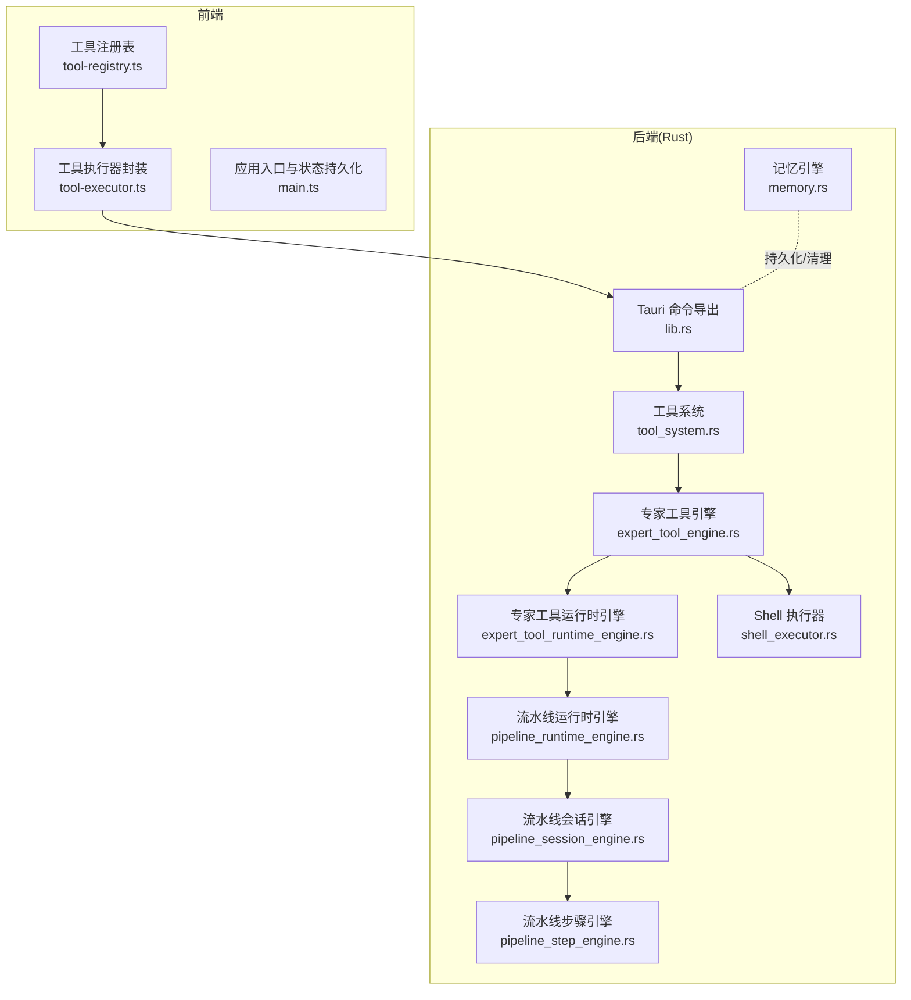
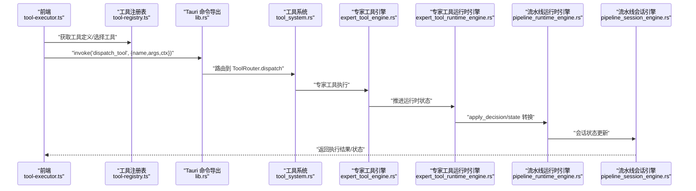
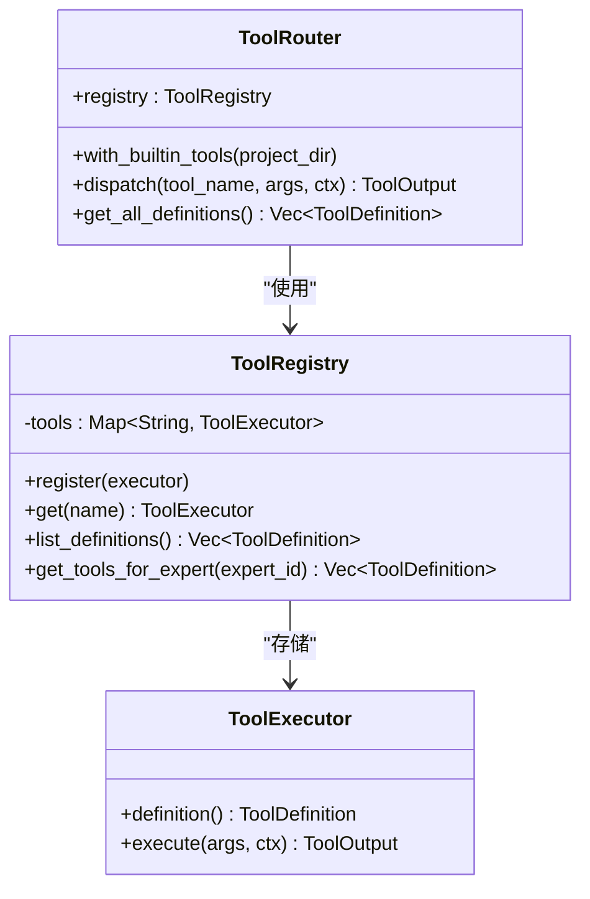
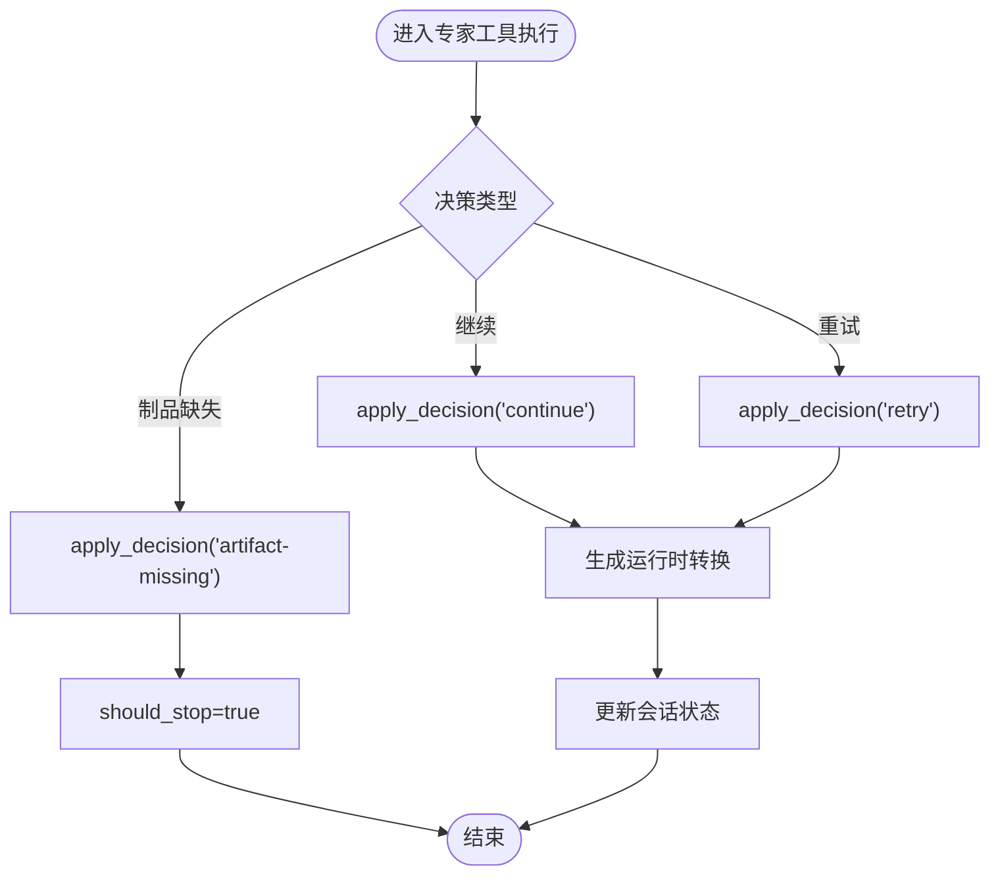
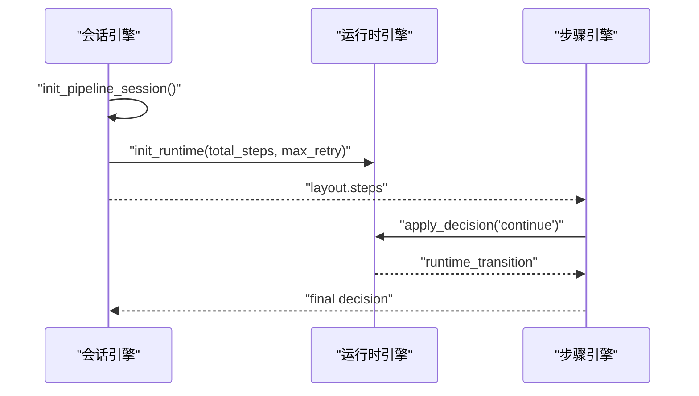
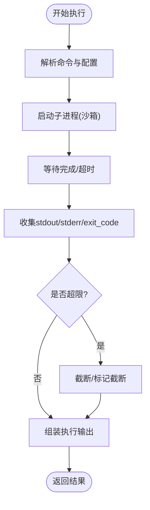
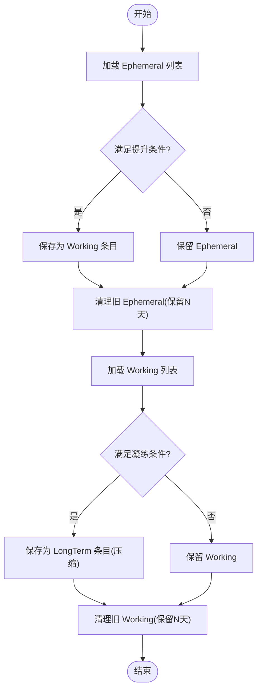
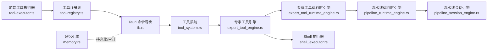

# 工具生命周期管理

<cite>
**本文引用的文件**
- [src-tauri/src/tool_system.rs](file://src-tauri/src/tool_system.rs)
- [src-tauri/src/expert_tool_engine.rs](file://src-tauri/src/expert_tool_engine.rs)
- [src-tauri/src/expert_tool_runtime_engine.rs](file://src-tauri/src/expert_tool_runtime_engine.rs)
- [src-tauri/src/pipeline_runtime_engine.rs](file://src-tauri/src/pipeline_runtime_engine.rs)
- [src-tauri/src/pipeline_session_engine.rs](file://src-tauri/src/pipeline_session_engine.rs)
- [src-tauri/src/pipeline_step_engine.rs](file://src-tauri/src/pipeline_step_engine.rs)
- [src-tauri/src/shell_executor.rs](file://src-tauri/src/shell_executor.rs)
- [src-tauri/src/memory.rs](file://src-tauri/src/memory.rs)
- [src-tauri/src/lib.rs](file://src-tauri/src/lib.rs)
- [src/tool-registry.ts](file://src/tool-registry.ts)
- [src/tool-executor.ts](file://src/tool-executor.ts)
- [src/main.ts](file://src/main.ts)
</cite>

## 目录
1. [引言](#引言)
2. [项目结构](#项目结构)
3. [核心组件](#核心组件)
4. [架构总览](#架构总览)
5. [详细组件分析](#详细组件分析)
6. [依赖关系分析](#依赖关系分析)
7. [性能考量](#性能考量)
8. [故障排查指南](#故障排查指南)
9. [结论](#结论)
10. [附录](#附录)

## 引言
本文件围绕“工具生命周期管理”主题，系统梳理从工具创建、初始化、激活、运行、暂停、恢复到终止的全链路机制；阐述状态转换的触发条件与规则（含手动与自动），资源分配与回收策略（内存、连接池、临时文件），持久化与快照能力，以及监控审计与安全权限控制。文档以仓库中实际代码为依据，辅以可视化图示帮助读者快速建立整体认知。

## 项目结构
本项目采用前端 + Rust 后端混合架构，工具生命周期管理主要由后端引擎与前端路由协同完成：
- 后端（Rust）：提供工具注册表、工具执行器抽象、专家工具引擎、流水线运行时引擎、内存记忆引擎等核心模块。
- 前端（TypeScript/Vue）：提供工具注册表与执行器封装，负责与后端通过 Tauri 命令交互，驱动工具调用与状态更新。

图表来源
- [src-tauri/src/tool_system.rs:51-144](file://src-tauri/src/tool_system.rs#L51-L144)
- [src-tauri/src/expert_tool_engine.rs](file://src-tauri/src/expert_tool_engine.rs)
- [src-tauri/src/expert_tool_runtime_engine.rs](file://src-tauri/src/expert_tool_runtime_engine.rs)
- [src-tauri/src/pipeline_runtime_engine.rs:1-213](file://src-tauri/src/pipeline_runtime_engine.rs#L1-L213)
- [src-tauri/src/pipeline_session_engine.rs:113-147](file://src-tauri/src/pipeline_session_engine.rs#L113-L147)
- [src-tauri/src/pipeline_step_engine.rs:146-171](file://src-tauri/src/pipeline_step_engine.rs#L146-L171)
- [src-tauri/src/shell_executor.rs:316-370](file://src-tauri/src/shell_executor.rs#L316-L370)
- [src-tauri/src/memory.rs:315-842](file://src-tauri/src/memory.rs#L315-L842)
- [src-tauri/src/lib.rs:105-1557](file://src-tauri/src/lib.rs#L105-L1557)
- [src/tool-registry.ts](file://src/tool-registry.ts)
- [src/tool-executor.ts](file://src/tool-executor.ts)
- [src/main.ts:8858-8897](file://src/main.ts#L8858-L8897)

章节来源
- [src-tauri/src/tool_system.rs:51-144](file://src-tauri/src/tool_system.rs#L51-L144)
- [src-tauri/src/lib.rs:105-1557](file://src-tauri/src/lib.rs#L105-L1557)
- [src/tool-registry.ts](file://src/tool-registry.ts)
- [src/tool-executor.ts](file://src/tool-executor.ts)
- [src/main.ts:8858-8897](file://src/main.ts#L8858-L8897)

## 核心组件
- 工具注册表与执行器抽象：定义工具执行器接口、注册表与路由分发逻辑，支持按专家角色过滤工具。
- 专家工具引擎与运行时引擎：承接专家决策，驱动工具执行与状态推进。
- 流水线运行时/会话/步骤引擎：管理多步任务的运行状态、重试与决策流转。
- Shell 执行器：提供安全可控的命令执行能力，含超时、输出限制与沙箱工作目录。
- 记忆引擎：提供短期/工作期/长期记忆的生命周期管理与持久化。
- 前端工具注册表与执行器封装：桥接前端 UI 与后端工具系统，负责状态持久化与错误回退。

章节来源
- [src-tauri/src/tool_system.rs:51-144](file://src-tauri/src/tool_system.rs#L51-L144)
- [src-tauri/src/expert_tool_engine.rs](file://src-tauri/src/expert_tool_engine.rs)
- [src-tauri/src/expert_tool_runtime_engine.rs](file://src-tauri/src/expert_tool_runtime_engine.rs)
- [src-tauri/src/pipeline_runtime_engine.rs:1-213](file://src-tauri/src/pipeline_runtime_engine.rs#L1-L213)
- [src-tauri/src/pipeline_session_engine.rs:113-147](file://src-tauri/src/pipeline_session_engine.rs#L113-L147)
- [src-tauri/src/pipeline_step_engine.rs:146-171](file://src-tauri/src/pipeline_step_engine.rs#L146-L171)
- [src-tauri/src/shell_executor.rs:316-370](file://src-tauri/src/shell_executor.rs#L316-L370)
- [src-tauri/src/memory.rs:315-842](file://src-tauri/src/memory.rs#L315-L842)
- [src/tool-registry.ts](file://src/tool-registry.ts)
- [src/tool-executor.ts](file://src/tool-executor.ts)

## 架构总览
工具生命周期管理贯穿“前端调度 → 后端执行 → 状态推进 → 持久化/快照 → 审计”的闭环。前端通过 Tauri 命令调用后端工具系统，后端根据专家决策与运行时状态决定下一步动作，并在必要时生成快照或持久化状态。

图表来源
- [src/tool-executor.ts](file://src/tool-executor.ts)
- [src/tool-registry.ts](file://src/tool-registry.ts)
- [src-tauri/src/lib.rs:105-1557](file://src-tauri/src/lib.rs#L105-L1557)
- [src-tauri/src/tool_system.rs:51-144](file://src-tauri/src/tool_system.rs#L51-L144)
- [src-tauri/src/expert_tool_engine.rs](file://src-tauri/src/expert_tool_engine.rs)
- [src-tauri/src/expert_tool_runtime_engine.rs](file://src-tauri/src/expert_tool_runtime_engine.rs)
- [src-tauri/src/pipeline_runtime_engine.rs:1-213](file://src-tauri/src/pipeline_runtime_engine.rs#L1-L213)
- [src-tauri/src/pipeline_session_engine.rs:113-147](file://src-tauri/src/pipeline_session_engine.rs#L113-L147)

## 详细组件分析

### 工具注册表与执行器抽象
- 工具执行器 Trait：定义工具执行签名与上下文传递，确保异步可执行与线程安全。
- 注册表：基于名称映射的工具集合，支持按专家角色过滤可用工具。
- 路由器：根据工具名查找执行器并执行，统一错误处理与返回格式。

图表来源
- [src-tauri/src/tool_system.rs:51-144](file://src-tauri/src/tool_system.rs#L51-L144)

章节来源
- [src-tauri/src/tool_system.rs:51-144](file://src-tauri/src/tool_system.rs#L51-L144)

### 专家工具引擎与运行时引擎
- 专家工具引擎：接收专家意图与上下文，选择合适工具并驱动执行。
- 专家工具运行时引擎：结合流水线运行时状态，进行决策与状态推进，支持重试、停止与中断消息。

图表来源
- [src-tauri/src/expert_tool_engine.rs](file://src-tauri/src/expert_tool_engine.rs)
- [src-tauri/src/expert_tool_runtime_engine.rs](file://src-tauri/src/expert_tool_runtime_engine.rs)
- [src-tauri/src/pipeline_runtime_engine.rs:1-213](file://src-tauri/src/pipeline_runtime_engine.rs#L1-L213)
- [src-tauri/src/pipeline_step_engine.rs:146-171](file://src-tauri/src/pipeline_step_engine.rs#L146-L171)

章节来源
- [src-tauri/src/expert_tool_engine.rs](file://src-tauri/src/expert_tool_engine.rs)
- [src-tauri/src/expert_tool_runtime_engine.rs](file://src-tauri/src/expert_tool_runtime_engine.rs)
- [src-tauri/src/pipeline_runtime_engine.rs:1-213](file://src-tauri/src/pipeline_runtime_engine.rs#L1-L213)
- [src-tauri/src/pipeline_step_engine.rs:146-171](file://src-tauri/src/pipeline_step_engine.rs#L146-L171)

### 流水线运行时/会话/步骤引擎
- 运行时状态：记录当前步骤索引、总步数、最大重试次数、每步重试计数与完成标志。
- 会话初始化：将布局与计划转化为会话状态，包含运行时状态与黑板数据。
- 步骤终结：根据运行时状态生成终结决策，决定是否停止与后续动作。

图表来源
- [src-tauri/src/pipeline_session_engine.rs:113-147](file://src-tauri/src/pipeline_session_engine.rs#L113-L147)
- [src-tauri/src/pipeline_runtime_engine.rs:1-213](file://src-tauri/src/pipeline_runtime_engine.rs#L1-L213)
- [src-tauri/src/pipeline_step_engine.rs:146-171](file://src-tauri/src/pipeline_step_engine.rs#L146-L171)

章节来源
- [src-tauri/src/pipeline_session_engine.rs:113-147](file://src-tauri/src/pipeline_session_engine.rs#L113-L147)
- [src-tauri/src/pipeline_runtime_engine.rs:1-213](file://src-tauri/src/pipeline_runtime_engine.rs#L1-L213)
- [src-tauri/src/pipeline_step_engine.rs:146-171](file://src-tauri/src/pipeline_step_engine.rs#L146-L171)

### Shell 执行器与资源管理
- 执行配置：超时、输出大小/行数限制、超时是否强制终止、工作目录沙箱、环境变量覆盖。
- 执行输出：包含退出码、标准输出/错误、耗时、是否截断、是否被终止、总行数等字段。
- 资源回收：线程 Join、错误处理与统一返回，避免僵尸进程与资源泄漏。

图表来源
- [src-tauri/src/shell_executor.rs:316-370](file://src-tauri/src/shell_executor.rs#L316-L370)

章节来源
- [src-tauri/src/shell_executor.rs:316-370](file://src-tauri/src/shell_executor.rs#L316-L370)

### 记忆引擎与生命周期
- 生命周期阶段：Ephemeral（短期）→ Working（工作期）→ LongTerm（长期）。
- 提升规则：访问次数阈值与内容长度阈值触发提升；超过阈值的条目被压缩并迁移。
- 清理策略：保留近 N 天的 Working/Ephemeral 条目，其余删除。
- 持久化：按类型分文件存储，定期运行生命周期流程。

图表来源
- [src-tauri/src/memory.rs:315-842](file://src-tauri/src/memory.rs#L315-L842)

章节来源
- [src-tauri/src/memory.rs:315-842](file://src-tauri/src/memory.rs#L315-L842)

### 前端工具执行与状态持久化
- 前端封装：提供工具注册表与执行器封装，负责与后端交互与错误回退。
- 应用状态持久化：前端提供 E2E 状态保存与应用状态合并保存，确保异常场景下的状态落盘。

章节来源
- [src/tool-registry.ts](file://src/tool-registry.ts)
- [src/tool-executor.ts](file://src/tool-executor.ts)
- [src/main.ts:8858-8897](file://src/main.ts#L8858-L8897)

## 依赖关系分析
- 前端依赖后端通过 Tauri 命令交互，工具执行路径由前端发起，后端路由至具体执行器。
- 专家工具引擎与运行时引擎依赖流水线运行时状态进行决策。
- Shell 执行器作为底层执行单元，被专家工具引擎复用。
- 记忆引擎独立于工具执行，但参与状态持久化与审计。

图表来源
- [src/tool-executor.ts](file://src/tool-executor.ts)
- [src/tool-registry.ts](file://src/tool-registry.ts)
- [src-tauri/src/lib.rs:105-1557](file://src-tauri/src/lib.rs#L105-L1557)
- [src-tauri/src/tool_system.rs:51-144](file://src-tauri/src/tool_system.rs#L51-L144)
- [src-tauri/src/expert_tool_engine.rs](file://src-tauri/src/expert_tool_engine.rs)
- [src-tauri/src/expert_tool_runtime_engine.rs](file://src-tauri/src/expert_tool_runtime_engine.rs)
- [src-tauri/src/pipeline_runtime_engine.rs:1-213](file://src-tauri/src/pipeline_runtime_engine.rs#L1-L213)
- [src-tauri/src/pipeline_session_engine.rs:113-147](file://src-tauri/src/pipeline_session_engine.rs#L113-L147)
- [src-tauri/src/shell_executor.rs:316-370](file://src-tauri/src/shell_executor.rs#L316-L370)
- [src-tauri/src/memory.rs:315-842](file://src-tauri/src/memory.rs#L315-L842)

## 性能考量
- 执行超时与输出限制：Shell 执行器提供超时、最大输出字节与行数限制，防止资源耗尽。
- 重试与停止策略：流水线运行时引擎根据最大重试次数与决策动作决定是否停止，避免无限循环。
- 记忆生命周期：短期/工作期/长期的自动迁移与清理减少磁盘占用与 IO 压力。
- 并发与线程安全：工具执行器接口声明为异步与线程安全，建议在高并发场景下配合连接池与限流策略。

章节来源
- [src-tauri/src/shell_executor.rs:316-370](file://src-tauri/src/shell_executor.rs#L316-L370)
- [src-tauri/src/pipeline_runtime_engine.rs:1-213](file://src-tauri/src/pipeline_runtime_engine.rs#L1-L213)
- [src-tauri/src/memory.rs:315-842](file://src-tauri/src/memory.rs#L315-L842)

## 故障排查指南
- 工具未找到：当工具名不存在时，路由层返回“未找到”错误，检查工具注册表与名称一致性。
- 执行失败：Shell 执行器捕获子进程错误与异常退出，查看退出码与标准错误输出定位问题。
- 状态不一致：若专家工具执行后状态未更新，检查运行时决策与会话状态推进逻辑。
- 前端状态丢失：若前端状态保存失败，利用回退逻辑合并状态并重试保存。

章节来源
- [src-tauri/src/tool_system.rs:124-141](file://src-tauri/src/tool_system.rs#L124-L141)
- [src-tauri/src/shell_executor.rs:316-370](file://src-tauri/src/shell_executor.rs#L316-L370)
- [src/main.ts:8858-8897](file://src/main.ts#L8858-L8897)

## 结论
本项目通过前后端协同实现了完整的工具生命周期管理：从前端调度、后端执行、状态推进到持久化与审计，形成闭环。工具系统以抽象接口与注册表为核心，结合专家引擎与流水线运行时引擎，提供了可扩展、可观测、可恢复的工具执行框架。同时，Shell 执行器与记忆引擎分别保障了资源安全与知识沉淀，为生产级使用提供了坚实基础。

## 附录
- 快照与仪表盘：后端提供构建词元仪表盘快照与流水线进度快照的命令，便于运行时观测与审计。
- 自定义生命周期钩子：可在工具执行器实现中扩展钩子（如执行前/后回调），并在专家工具引擎中接入状态变更通知。
- 优雅关闭：结合 Shell 执行器的超时与强制终止选项，以及前端状态持久化回退机制，确保异常退出时的状态一致性。

章节来源
- [src-tauri/src/lib.rs:1538-1557](file://src-tauri/src/lib.rs#L1538-L1557)
- [src-tauri/src/shell_executor.rs:316-370](file://src-tauri/src/shell_executor.rs#L316-L370)
- [src/main.ts:8858-8897](file://src/main.ts#L8858-L8897)