# 工具执行器

<cite>
**本文档引用的文件**
- [tool-executor.ts](file://ai-experts/src/tool-executor.ts)
- [tool-registry.ts](file://ai-experts/src/tool-registry.ts)
- [tool_system.rs](file://ai-experts/src-tauri/src/tool_system.rs)
- [shell_executor.rs](file://ai-experts/src-tauri/src/shell_executor.rs)
- [file_patch.rs](file://ai-experts/src-tauri/src/file_patch.rs)
- [expert_tool_engine.rs](file://ai-experts/src-tauri/src/expert_tool_engine.rs)
- [lib.rs](file://ai-experts/src-tauri/src/lib.rs)
- [package.json](file://ai-experts/package.json)
</cite>

## 目录
1. [简介](#简介)
2. [项目结构](#项目结构)
3. [核心组件](#核心组件)
4. [架构总览](#架构总览)
5. [详细组件分析](#详细组件分析)
6. [依赖关系分析](#依赖关系分析)
7. [性能考虑](#性能考虑)
8. [故障排除指南](#故障排除指南)
9. [结论](#结论)
10. [附录](#附录)

## 简介
本文件面向“星图专家团工作台”的工具执行器组件，系统性阐述其架构设计、实现原理与使用方法。工具执行器负责将前端的工具调用请求桥接到后端 Rust 执行引擎，完成工具生命周期管理、权限控制、错误处理、超时与资源限制、以及与 Tauri 后端的通信协议。文档还提供扩展接口、自定义执行器开发指南与性能优化建议，并给出实际执行流程与故障排除指引。

## 项目结构
工具执行器由前端 TypeScript 组件与后端 Rust 执行系统协同组成：
- 前端桥接层：负责将工具调用请求经 Tauri invoke 发送到后端，并对特定工具（如 file_patch）进行结果结构化处理。
- 后端执行系统：提供统一的工具抽象、路由分发、内置工具实现、权限与安全控制、超时与资源限制、以及与文件系统、命令执行器的交互。

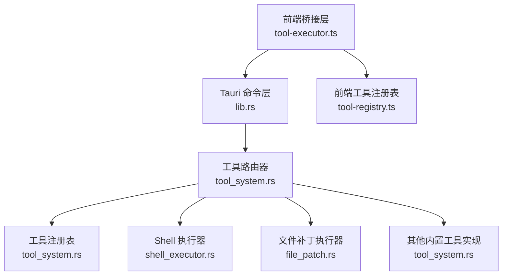

**图表来源**
- [tool-executor.ts:1-231](file://ai-experts/src/tool-executor.ts#L1-L231)
- [lib.rs:6289-6310](file://ai-experts/src-tauri/src/lib.rs#L6289-L6310)
- [tool_system.rs:97-142](file://ai-experts/src-tauri/src/tool_system.rs#L97-L142)
- [shell_executor.rs:498-633](file://ai-experts/src-tauri/src/shell_executor.rs#L498-L633)
- [file_patch.rs:662-800](file://ai-experts/src-tauri/src/file_patch.rs#L662-L800)
- [tool-registry.ts:1-192](file://ai-experts/src/tool-registry.ts#L1-L192)

**章节来源**
- [tool-executor.ts:1-231](file://ai-experts/src/tool-executor.ts#L1-L231)
- [tool-registry.ts:1-192](file://ai-experts/src/tool-registry.ts#L1-L192)
- [tool_system.rs:97-142](file://ai-experts/src-tauri/src/tool_system.rs#L97-L142)
- [shell_executor.rs:498-633](file://ai-experts/src-tauri/src/shell_executor.rs#L498-L633)
- [file_patch.rs:662-800](file://ai-experts/src-tauri/src/file_patch.rs#L662-L800)
- [lib.rs:6289-6310](file://ai-experts/src-tauri/src/lib.rs#L6289-L6310)

## 核心组件
- 前端工具执行器（ToolExecutor）
  - 提供统一的 execute 接口，将工具调用请求通过 Tauri invoke 发送到后端。
  - 对 file_patch 工具的失败结果进行结构化反馈，便于模型自我修复。
  - 支持从 LLM 响应中提取工具调用（OpenAI function calling 与 ACTION 标记双轨协议）。
- 前端工具注册表（ToolRegistry）
  - 定义每个工具的 JSON Schema、描述与权限级别，按专家角色过滤可用工具。
- 后端工具系统（tool_system.rs）
  - 抽象出 ToolExecutor trait、ToolContext、ToolOutput/ToolError。
  - 提供 ToolRouter 与 ToolRegistry，内置多种工具实现（shell_exec、file_read、file_write、file_patch、file_list、web_search、memory_query、index_search）。
- Shell 执行器（shell_executor.rs）
  - 生产级命令执行引擎，支持跨平台、超时控制、输出截断、工作目录沙箱、环境变量覆盖、危险命令检测。
- 文件补丁执行器（file_patch.rs）
  - 解析与应用结构化补丁，支持 Add/Update/Delete/Move 操作，具备路径安全校验与四级容错匹配。
- 专家工具引擎（expert_tool_engine.rs）
  - 解析 ACTION 标记、改写命令为文件读取、路径规范化与工作目录解析。
- Tauri 命令层（lib.rs）
  - 暴露 dispatch_tool/list_tools 等命令，完成参数解析、上下文构建与路由分发。

**章节来源**
- [tool-executor.ts:13-53](file://ai-experts/src/tool-executor.ts#L13-L53)
- [tool-executor.ts:148-222](file://ai-experts/src/tool-executor.ts#L148-L222)
- [tool-registry.ts:20-181](file://ai-experts/src/tool-registry.ts#L20-L181)
- [tool_system.rs:51-142](file://ai-experts/src-tauri/src/tool_system.rs#L51-L142)
- [shell_executor.rs:336-465](file://ai-experts/src-tauri/src/shell_executor.rs#L336-L465)
- [file_patch.rs:151-289](file://ai-experts/src-tauri/src/file_patch.rs#L151-L289)
- [expert_tool_engine.rs:288-480](file://ai-experts/src-tauri/src/expert_tool_engine.rs#L288-L480)
- [lib.rs:6289-6310](file://ai-experts/src-tauri/src/lib.rs#L6289-L6310)

## 架构总览
工具执行器采用“前端桥接 + 后端路由 + 内置工具实现”的分层架构。前端通过 Tauri invoke 调用后端命令，后端根据工具名路由到具体执行器，执行器在 ToolContext 上下文中执行，并返回结构化的 ToolOutput 或 ToolError。对于 file_patch 等工具，前端还会进行二次结构化处理以提升模型可读性。

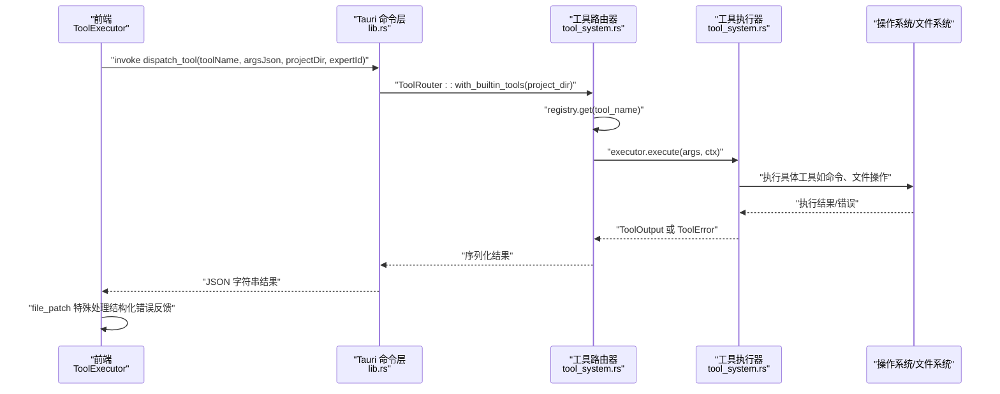

**图表来源**
- [lib.rs:6289-6310](file://ai-experts/src-tauri/src/lib.rs#L6289-L6310)
- [tool_system.rs:123-137](file://ai-experts/src-tauri/src/tool_system.rs#L123-L137)
- [tool_system.rs:51-60](file://ai-experts/src-tauri/src/tool_system.rs#L51-L60)
- [tool-executor.ts:24-53](file://ai-experts/src/tool-executor.ts#L24-L53)

## 详细组件分析

### 前端工具执行器（ToolExecutor）
- 统一入口 execute：将工具调用参数封装为 JSON，调用 Tauri invoke dispatch_tool，解析后端返回的 ToolExecResult。
- file_patch 特殊处理：当后端返回失败时，从 result/metadata 中提取错误信息、失败文件、行号、代码片段等，构造结构化错误反馈，指导模型修正补丁。
- 工具调用提取：支持 OpenAI function calling 与 ACTION 标记两种格式，兼容历史版本。

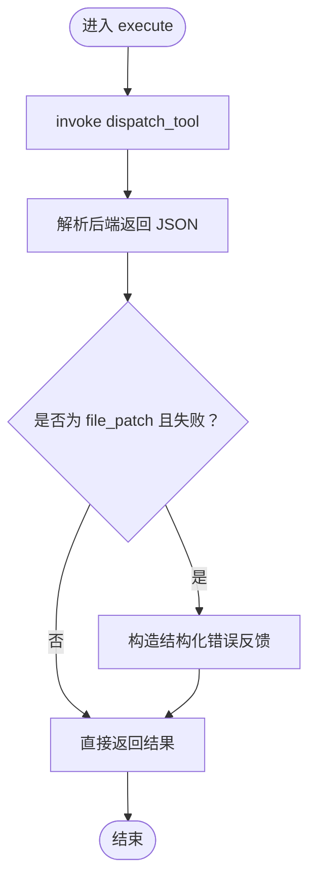

**图表来源**
- [tool-executor.ts:24-53](file://ai-experts/src/tool-executor.ts#L24-L53)
- [tool-executor.ts:59-94](file://ai-experts/src/tool-executor.ts#L59-L94)

**章节来源**
- [tool-executor.ts:13-53](file://ai-experts/src/tool-executor.ts#L13-L53)
- [tool-executor.ts:148-222](file://ai-experts/src/tool-executor.ts#L148-L222)

### 前端工具注册表（ToolRegistry）
- 定义工具 Schema：包含 name/description/parameters/permission，用于注入到 LLM 请求中。
- 权限控制：auto/auto+confirm/block 三档，结合专家角色映射决定可用工具集。
- 工具枚举：内置 shell_exec、file_read、file_write、file_patch、file_list、web_search、memory_query、index_search。

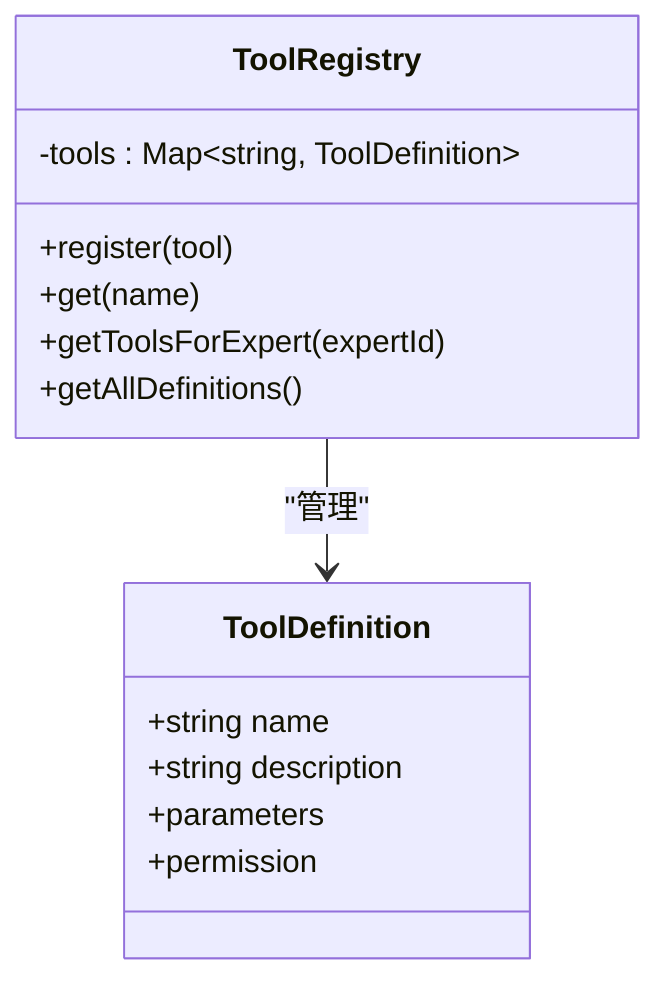

**图表来源**
- [tool-registry.ts:20-181](file://ai-experts/src/tool-registry.ts#L20-L181)

**章节来源**
- [tool-registry.ts:20-181](file://ai-experts/src/tool-registry.ts#L20-L181)

### 后端工具系统（tool_system.rs）
- 抽象与路由
  - ToolExecutor trait：定义 definition 与 execute(args, ctx)。
  - ToolRouter：注册内置工具，按名称分发到具体执行器。
  - ToolRegistry：存储工具实例，提供查询与定义导出。
- 内置工具实现
  - ShellExecTool：解析参数，构造 ExecConfig，调用 shell_executor::execute_command_enhanced。
  - FileReadTool：路径沙箱校验，读取文件内容，支持行范围切片。
  - FileWriteTool：路径沙箱校验，创建父目录，支持追加与覆盖写入。
  - FilePatchTool：解析并应用结构化补丁，返回应用结果与元数据。
  - FileListTool：路径沙箱校验，遍历目录，支持递归与深度限制。
  - WebSearchTool/MemoryQueryTool/IndexSearchTool：占位或简化实现，实际能力由其他模块提供。

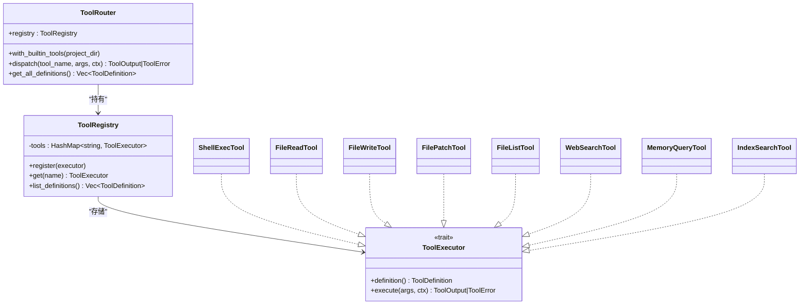

**图表来源**
- [tool_system.rs:51-142](file://ai-experts/src-tauri/src/tool_system.rs#L51-L142)
- [tool_system.rs:144-800](file://ai-experts/src-tauri/src/tool_system.rs#L144-L800)

**章节来源**
- [tool_system.rs:51-142](file://ai-experts/src-tauri/src/tool_system.rs#L51-L142)
- [tool_system.rs:144-800](file://ai-experts/src-tauri/src/tool_system.rs#L144-L800)

### Shell 执行器（shell_executor.rs）
- 执行配置（ExecConfig）：超时、输出大小/行数限制、超时是否杀进程、工作目录沙箱、环境变量覆盖。
- 输出缓冲：Head/Tail 双缓冲，兼顾首尾与中间截断，支持字节与行数上限。
- 跨平台与安全
  - Windows：自动识别 PowerShell/cmdlet 并进行命令规范化。
  - 危险命令检测：预设模式匹配与管理员命令前缀。
  - 工作目录沙箱：防止命令逃逸到项目根目录外。
- 异步执行：tokio 超时控制，读取 stdout/stderr 并发处理，超时后可选择杀进程。

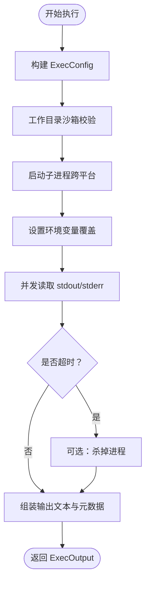

**图表来源**
- [shell_executor.rs:336-465](file://ai-experts/src-tauri/src/shell_executor.rs#L336-L465)
- [shell_executor.rs:498-633](file://ai-experts/src-tauri/src/shell_executor.rs#L498-L633)

**章节来源**
- [shell_executor.rs:336-465](file://ai-experts/src-tauri/src/shell_executor.rs#L336-L465)
- [shell_executor.rs:498-633](file://ai-experts/src-tauri/src/shell_executor.rs#L498-L633)

### 文件补丁执行器（file_patch.rs）
- 补丁解析：支持 AddFile、DeleteFile、UpdateFile、MoveFile，解析 @@ 上下文与变更块。
- 安全校验：拒绝绝对路径、路径穿越、符号链接，确保路径位于项目根目录内。
- 容错匹配：四级匹配（精确、右trim、两侧trim、Unicode归一化），提升模型补丁鲁棒性。
- 应用与追踪：应用补丁后记录 AppliedDelta，即使部分失败也能反馈已应用文件列表。

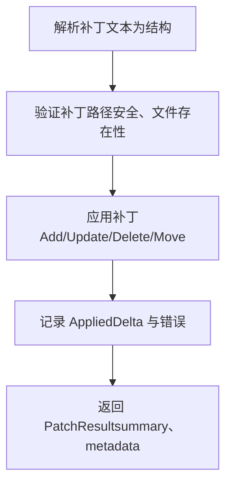

**图表来源**
- [file_patch.rs:151-289](file://ai-experts/src-tauri/src/file_patch.rs#L151-L289)
- [file_patch.rs:514-618](file://ai-experts/src-tauri/src/file_patch.rs#L514-L618)
- [file_patch.rs:662-800](file://ai-experts/src-tauri/src/file_patch.rs#L662-L800)

**章节来源**
- [file_patch.rs:151-289](file://ai-experts/src-tauri/src/file_patch.rs#L151-L289)
- [file_patch.rs:514-618](file://ai-experts/src-tauri/src/file_patch.rs#L514-L618)
- [file_patch.rs:662-800](file://ai-experts/src-tauri/src/file_patch.rs#L662-L800)

### 专家工具引擎（expert_tool_engine.rs）
- ACTION 标记解析：兼容旧版 ACTION 标记，映射到新工具系统（如 READ_FILE/LIST_FILES/EXECUTE_CMD/WEB_SEARCH/EDIT_FILE）。
- 命令改写：将源码探测命令改写为 READ_FILE，自动定位上下文窗口。
- 路径与工作目录：规范化路径、解析项目根目录别名、相对路径转换。

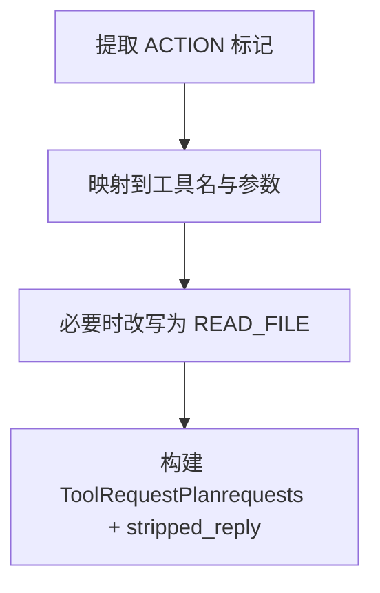

**图表来源**
- [expert_tool_engine.rs:288-480](file://ai-experts/src-tauri/src/expert_tool_engine.rs#L288-L480)

**章节来源**
- [expert_tool_engine.rs:288-480](file://ai-experts/src-tauri/src/expert_tool_engine.rs#L288-L480)

### Tauri 命令层（lib.rs）
- dispatch_tool：解析参数、构建 ToolContext、初始化 ToolRouter、分发执行并序列化结果。
- list_tools：返回指定专家可用的工具定义集合。

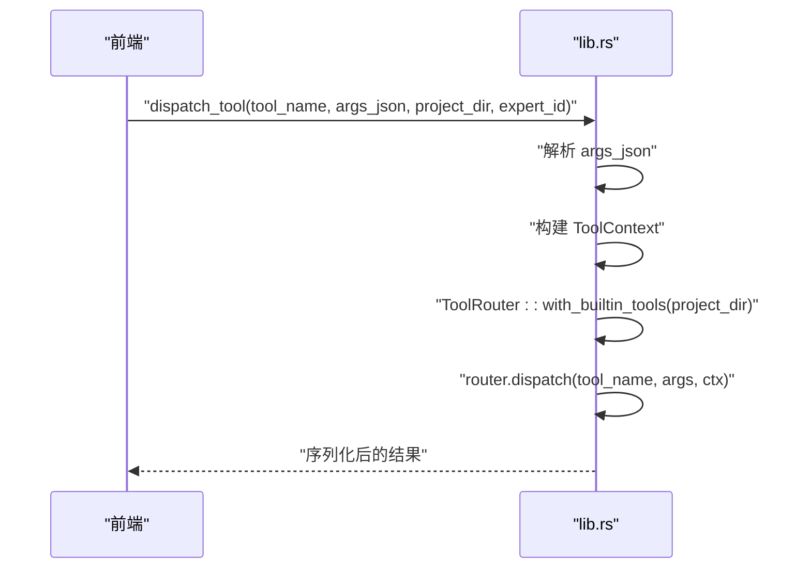

**图表来源**
- [lib.rs:6289-6310](file://ai-experts/src-tauri/src/lib.rs#L6289-L6310)

**章节来源**
- [lib.rs:6289-6310](file://ai-experts/src-tauri/src/lib.rs#L6289-L6310)

## 依赖关系分析
- 前端依赖
  - @tauri-apps/api：用于 invoke 后端命令。
  - package.json：声明依赖与脚本。
- 后端依赖
  - async_trait、tokio、regex、serde、dunce 等：提供异步、正则、序列化、路径规范化等能力。
- 组件耦合
  - 前端 ToolExecutor 仅依赖 Tauri invoke，耦合度低。
  - 后端 ToolRouter 通过 trait 解耦具体工具实现，便于扩展。

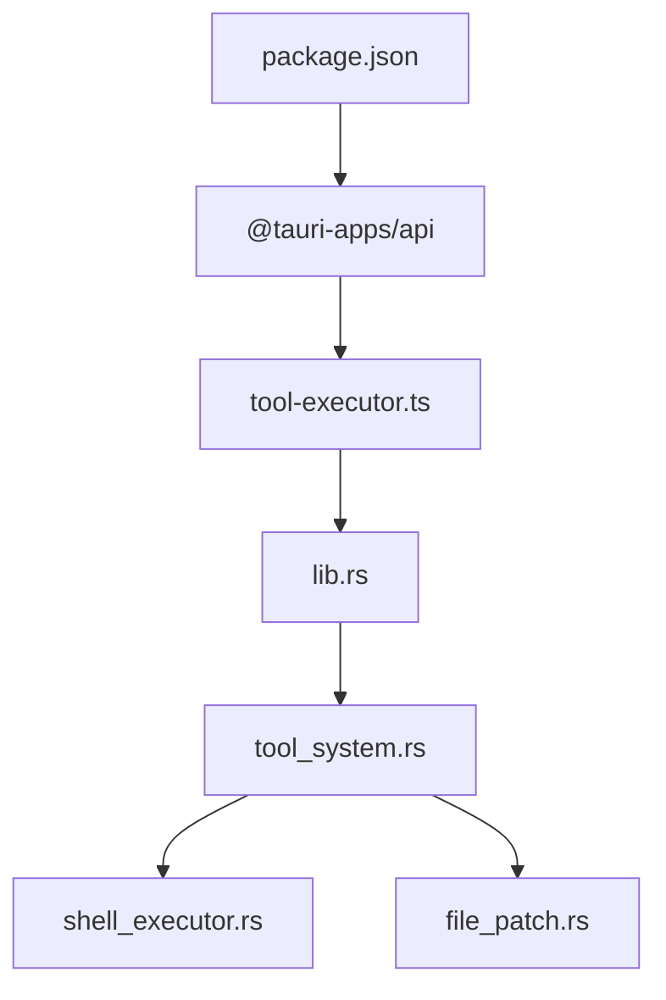

**图表来源**
- [package.json:15-26](file://ai-experts/package.json#L15-L26)
- [tool-executor.ts:5](file://ai-experts/src/tool-executor.ts#L5)
- [lib.rs:6289-6310](file://ai-experts/src-tauri/src/lib.rs#L6289-L6310)
- [tool_system.rs:97-142](file://ai-experts/src-tauri/src/tool_system.rs#L97-L142)
- [shell_executor.rs:1-10](file://ai-experts/src-tauri/src/shell_executor.rs#L1-L10)
- [file_patch.rs:1-2](file://ai-experts/src-tauri/src/file_patch.rs#L1-L2)

**章节来源**
- [package.json:15-26](file://ai-experts/package.json#L15-L26)
- [tool-executor.ts:5](file://ai-experts/src/tool-executor.ts#L5)
- [lib.rs:6289-6310](file://ai-experts/src-tauri/src/lib.rs#L6289-L6310)

## 性能考虑
- 异步与并发
  - 后端使用 tokio 并发读取 stdout/stderr，避免阻塞导致的超时。
  - Shell 执行器支持超时 kill，防止长时间占用。
- 输出截断
  - Head/Tail 缓冲策略在内存与可观测性之间平衡，避免大输出造成前端卡顿。
- 资源限制
  - ExecConfig 提供超时、输出大小/行数上限、工作目录沙箱等限制。
- I/O 优化
  - 文件读写工具在写入前确保父目录存在，减少多次失败重试。
- 扩展建议
  - 对高频工具增加缓存（如文件内容缓存）。
  - 对网络搜索等外部服务增加连接池与重试策略。

[本节为通用性能建议，不直接分析具体文件]

## 故障排除指南
- 工具调用失败
  - 检查后端返回的 ToolError.code/message，区分不可重试与可重试错误。
  - 对 file_patch：前端会将失败结果结构化为可读反馈，指导模型修正补丁。
- 超时与输出过大
  - 调整 ExecConfig.timeout_ms 与 max_output_bytes/max_output_lines。
  - 对长输出工具（如 shell_exec）建议分页或分段处理。
- 路径越界与权限问题
  - 确认工作目录与目标路径均在项目根目录内。
  - 对危险命令（如 rm -rf、格式化磁盘）会被拦截，需走审批流程。
- Tauri invoke 失败
  - 确认命令已在 lib.rs 中正确暴露，参数 JSON 格式正确。
- 前端工具调用提取异常
  - 检查 LLM 响应是否符合 OpenAI function calling 或 ACTION 标记格式。

**章节来源**
- [tool_system.rs:43-50](file://ai-experts/src-tauri/src/tool_system.rs#L43-L50)
- [tool-executor.ts:39-53](file://ai-experts/src/tool-executor.ts#L39-L53)
- [shell_executor.rs:336-465](file://ai-experts/src-tauri/src/shell_executor.rs#L336-L465)
- [file_patch.rs:101-147](file://ai-experts/src-tauri/src/file_patch.rs#L101-L147)
- [lib.rs:6289-6310](file://ai-experts/src-tauri/src/lib.rs#L6289-L6310)

## 结论
工具执行器通过前后端清晰的职责划分与强健的后端执行系统，实现了安全、可控、可观测的工具调用能力。其统一的抽象接口与路由机制便于扩展新的工具实现；完善的权限控制、超时与资源限制策略保障了系统的稳定性；前端对特定工具的结构化反馈提升了模型的自修复能力。整体架构适合在复杂工程场景中持续演进与扩展。

[本节为总结性内容，不直接分析具体文件]

## 附录

### 工具执行流程（从调用到返回）
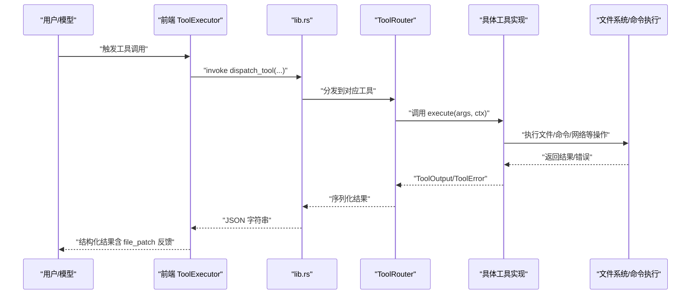

**图表来源**
- [tool-executor.ts:24-53](file://ai-experts/src/tool-executor.ts#L24-L53)
- [lib.rs:6289-6310](file://ai-experts/src-tauri/src/lib.rs#L6289-L6310)
- [tool_system.rs:123-137](file://ai-experts/src-tauri/src/tool_system.rs#L123-L137)

### 安全控制机制
- 路径安全
  - 禁止绝对路径、路径穿越、符号链接，确保所有路径位于项目根目录内。
- 命令安全
  - 危险命令模式匹配与管理员命令前缀检测，必要时要求用户确认。
- 工作目录沙箱
  - 严格限制工作目录不得超出项目根目录。
- 权限分级
  - auto/confirm/block 三档权限，结合专家角色映射控制工具可用性。

**章节来源**
- [file_patch.rs:101-147](file://ai-experts/src-tauri/src/file_patch.rs#L101-L147)
- [shell_executor.rs:476-495](file://ai-experts/src-tauri/src/shell_executor.rs#L476-L495)
- [shell_executor.rs:507-516](file://ai-experts/src-tauri/src/shell_executor.rs#L507-L516)
- [tool-registry.ts:14](file://ai-experts/src/tool-registry.ts#L14)

### 超时管理与资源限制
- 超时控制
  - Shell 执行器默认 60 秒，可通过 ExecConfig 调整。
  - 超时后可选择杀进程，避免僵尸进程。
- 输出限制
  - stdout/stderr 分配不同缓冲上限，防止内存暴涨。
  - 截断策略保留首尾若干行，保证可观测性。
- 工作目录限制
  - 可开启 working_dir_sandbox，强制工作目录在项目根目录内。

**章节来源**
- [shell_executor.rs:336-465](file://ai-experts/src-tauri/src/shell_executor.rs#L336-L465)
- [shell_executor.rs:498-633](file://ai-experts/src-tauri/src/shell_executor.rs#L498-L633)

### 并发控制与异步执行
- 后端
  - 使用 tokio 并发读取 stdout/stderr，超时控制与 kill 机制保障稳定性。
- 前端
  - 通过 Tauri invoke 异步调用后端，避免阻塞 UI。
- 建议
  - 对高并发场景增加队列与限流，避免系统资源耗尽。

**章节来源**
- [shell_executor.rs:556-611](file://ai-experts/src-tauri/src/shell_executor.rs#L556-L611)
- [tool-executor.ts:24-53](file://ai-experts/src/tool-executor.ts#L24-L53)

### 扩展接口与自定义执行器开发指南
- 实现 ToolExecutor trait
  - 定义 definition（name/description/parameters/required_permission）。
  - 实现 execute(args, ctx)：解析参数、执行业务逻辑、返回 ToolOutput 或抛出 ToolError。
- 注册工具
  - 在 ToolRouter::with_builtin_tools 中注册新工具实例。
- 参数与权限
  - 使用 JSON Schema 描述参数，设置 required_permission（auto/confirm/block）。
- 测试与验证
  - 为新工具编写单元测试，覆盖正常与异常路径。

**章节来源**
- [tool_system.rs:51-60](file://ai-experts/src-tauri/src/tool_system.rs#L51-L60)
- [tool_system.rs:123-137](file://ai-experts/src-tauri/src/tool_system.rs#L123-L137)

### 实际工具执行示例
- shell_exec
  - 前端传入 { command, working_dir?, timeout_ms? }，后端解析为 ExecConfig，调用 execute_command_enhanced。
- file_read
  - 前端传入 { path, start_line?, end_line? }，后端进行路径沙箱校验并读取文件内容。
- file_write
  - 前端传入 { path, content, append? }，后端确保父目录存在并写入文件。
- file_patch
  - 前端传入 { patch }，后端解析补丁并应用，失败时构造结构化错误反馈。
- file_list
  - 前端传入 { path?, recursive?, max_depth? }，后端遍历目录并返回条目列表。
- web_search/memory_query/index_search
  - 前端传入查询参数，后端返回结构化结果（占位或简化实现）。

**章节来源**
- [tool_system.rs:144-800](file://ai-experts/src-tauri/src/tool_system.rs#L144-L800)
- [shell_executor.rs:498-633](file://ai-experts/src-tauri/src/shell_executor.rs#L498-L633)
- [file_patch.rs:662-800](file://ai-experts/src-tauri/src/file_patch.rs#L662-L800)