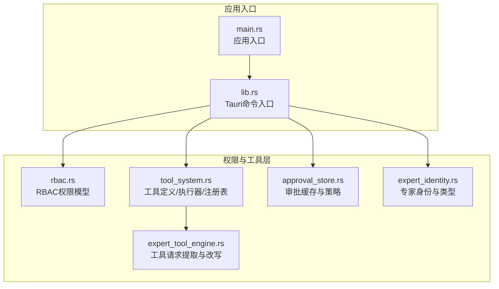
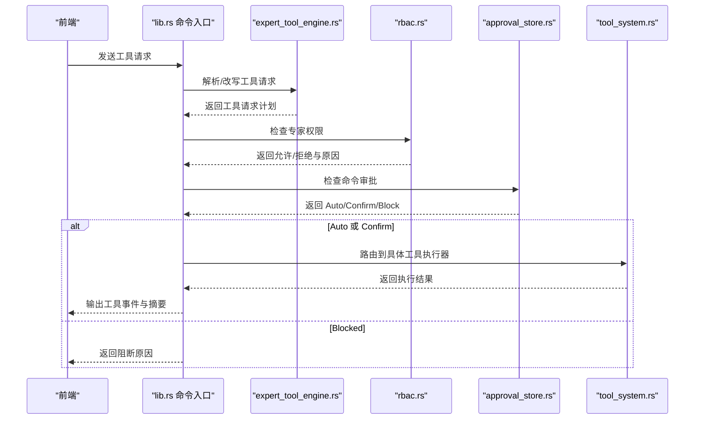
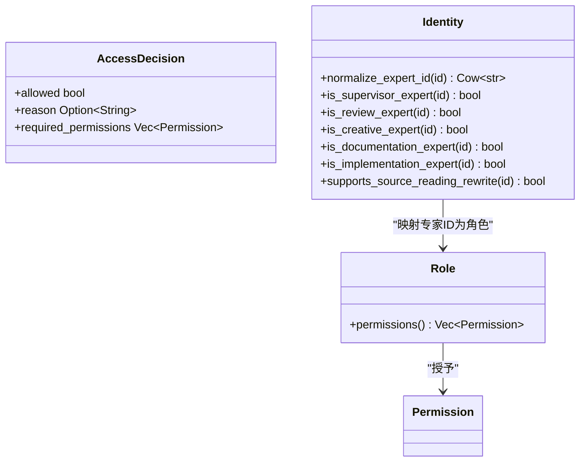
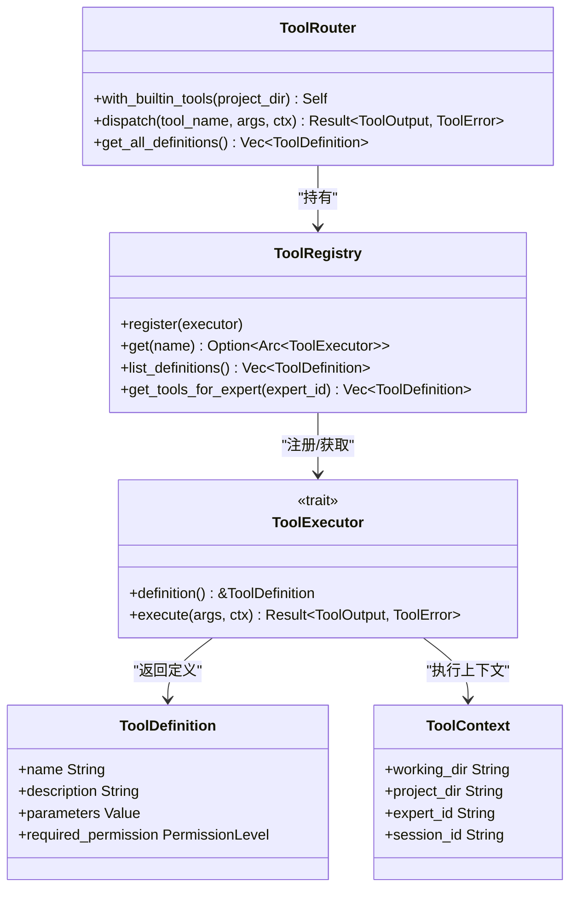
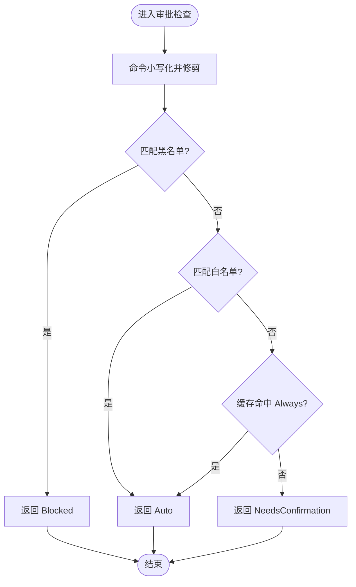
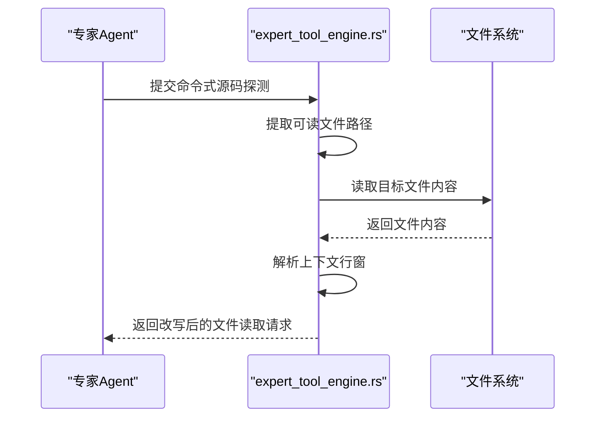
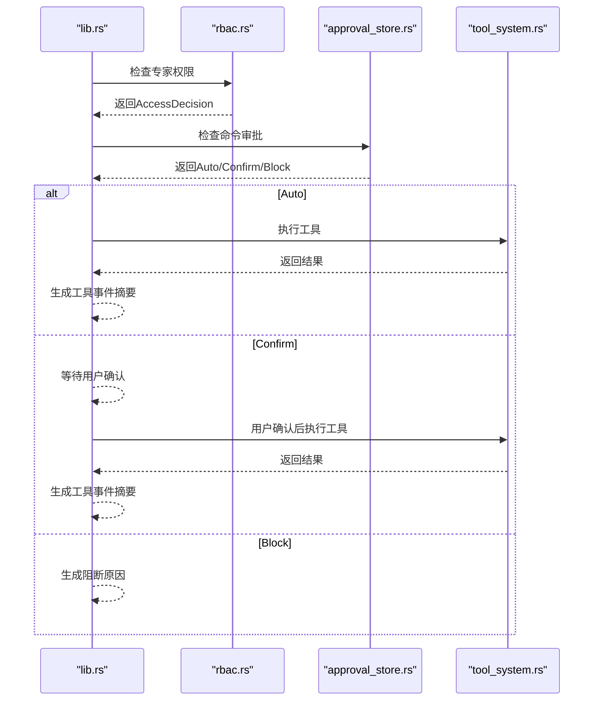
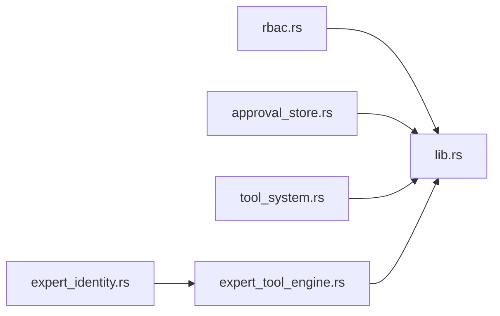

# 工具权限管理

<cite>
**本文档引用的文件**
- [rbac.rs](file://ai-experts/src-tauri/src/rbac.rs)
- [tool_system.rs](file://ai-experts/src-tauri/src/tool_system.rs)
- [approval_store.rs](file://ai-experts/src-tauri/src/approval_store.rs)
- [expert_identity.rs](file://ai-experts/src-tauri/src/expert_identity.rs)
- [expert_tool_engine.rs](file://ai-experts/src-tauri/src/expert_tool_engine.rs)
- [lib.rs](file://ai-experts/src-tauri/src/lib.rs)
- [main.rs](file://ai-experts/src-tauri/src/main.rs)
</cite>

## 目录
1. [简介](#简介)
2. [项目结构](#项目结构)
3. [核心组件](#核心组件)
4. [架构总览](#架构总览)
5. [详细组件分析](#详细组件分析)
6. [依赖关系分析](#依赖关系分析)
7. [性能考量](#性能考量)
8. [故障排查指南](#故障排查指南)
9. [结论](#结论)
10. [附录](#附录)

## 简介
本文件面向“星图专家团工作台”的工具权限管理子系统，系统性阐述基于专家角色的 RBAC 权限模型与工具执行授权机制。重点覆盖：
- 权限级别与专家角色映射
- 权限检查与路径访问控制
- 审批流程与自动/确认/阻断三态策略
- 工具定义与执行器抽象
- 权限验证流程、专家身份认证与缓存机制
- 配置接口、审计日志与安全最佳实践
- 扩展接口与自定义权限策略开发指南

## 项目结构
权限管理相关模块分布于 Rust 后端（Tauri）侧，主要文件如下：
- rbac.rs：RBAC 权限模型与角色-权限映射、权限检查、路径敏感性控制
- tool_system.rs：工具定义、工具执行器抽象、工具注册与路由、权限级别枚举
- approval_store.rs：命令审批缓存、自动/确认/阻断判定逻辑
- expert_identity.rs：专家身份规范化、专家类型判断、支持源码读取改写能力
- expert_tool_engine.rs：工具请求提取与改写（将命令改写为文件读取）、工作区路径解析
- lib.rs：Tauri 命令入口，集成 RBAC 与审批流程，输出工具事件与命令授权摘要
- main.rs：应用入口

**图表来源**
- [rbac.rs:1-235](file://ai-experts/src-tauri/src/rbac.rs#L1-L235)
- [tool_system.rs:1-800](file://ai-experts/src-tauri/src/tool_system.rs#L1-L800)
- [approval_store.rs:1-123](file://ai-experts/src-tauri/src/approval_store.rs#L1-L123)
- [expert_identity.rs:1-64](file://ai-experts/src-tauri/src/expert_identity.rs#L1-L64)
- [expert_tool_engine.rs:1-534](file://ai-experts/src-tauri/src/expert_tool_engine.rs#L1-L534)
- [lib.rs:1-800](file://ai-experts/src-tauri/src/lib.rs#L1-L800)
- [main.rs:1-6](file://ai-experts/src-tauri/src/main.rs#L1-L6)

**章节来源**
- [rbac.rs:1-235](file://ai-experts/src-tauri/src/rbac.rs#L1-L235)
- [tool_system.rs:1-800](file://ai-experts/src-tauri/src/tool_system.rs#L1-L800)
- [approval_store.rs:1-123](file://ai-experts/src-tauri/src/approval_store.rs#L1-L123)
- [expert_identity.rs:1-64](file://ai-experts/src-tauri/src/expert_identity.rs#L1-L64)
- [expert_tool_engine.rs:1-534](file://ai-experts/src-tauri/src/expert_tool_engine.rs#L1-L534)
- [lib.rs:1-800](file://ai-experts/src-tauri/src/lib.rs#L1-L800)
- [main.rs:1-6](file://ai-experts/src-tauri/src/main.rs#L1-L6)

## 核心组件
- RBAC 权限模型
  - 权限枚举：文件读写、执行代码、调用外部 API、访问/修改记忆、访问令牌数据、主管覆盖等
  - 角色枚举：主管、主工程师、工程师、审查员、研究员、设计师、助手
  - 角色-权限映射：除主管外，其他角色共享一组通用权限集合
  - 权限检查：按专家 ID 获取默认角色，计算所需权限并给出允许/拒绝与原因
  - 路径敏感性：对敏感路径（如 .env、.ssh、token 等）进行严格限制，仅主管可访问
- 工具系统
  - 权限级别：Auto（自动）、Confirm（需要确认）、Block（默认拦截）
  - 工具定义：名称、描述、参数 JSON Schema、所需权限级别
  - 工具执行器：统一的异步执行接口，内置多种工具实现（Shell 执行、文件读写、补丁应用、文件列表、网络搜索、记忆查询、索引搜索）
  - 工具注册与路由：注册内置工具，分发执行并返回结果
- 审批存储
  - 审批决策：Approved、ApprovedAlways、Denied
  - 命令审批三态：Auto（自动放行）、NeedsConfirmation（需要人工确认）、Blocked（阻断）
  - 策略：黑名单优先（Block），白名单（Auto），缓存命中 Always（Auto），其余需确认
- 专家身份与工具改写
  - 专家 ID 规范化与类型判断
  - 支持源码读取改写的专家类型：实现、审查、文档、特定编号专家
  - 将命令式源码探测改写为精确的文件读取请求，限定行窗

**章节来源**
- [rbac.rs:10-172](file://ai-experts/src-tauri/src/rbac.rs#L10-L172)
- [tool_system.rs:9-142](file://ai-experts/src-tauri/src/tool_system.rs#L9-L142)
- [approval_store.rs:5-122](file://ai-experts/src-tauri/src/approval_store.rs#L5-L122)
- [expert_identity.rs:3-63](file://ai-experts/src-tauri/src/expert_identity.rs#L3-L63)
- [expert_tool_engine.rs:406-453](file://ai-experts/src-tauri/src/expert_tool_engine.rs#L406-L453)

## 架构总览
权限与工具执行的整体流程：
- 专家提出工具请求（含命令、文件读写、网络搜索等）
- 解析与改写：将命令改写为精确文件读取，确保最小暴露面
- 权限校验：RBAC 检查专家角色是否具备所需权限
- 审批判定：根据命令特征与缓存决定 Auto/Confirm/Block
- 执行与审计：执行工具、记录事件摘要与命令授权状态

**图表来源**
- [lib.rs:5973-6328](file://ai-experts/src-tauri/src/lib.rs#L5973-L6328)
- [expert_tool_engine.rs:455-480](file://ai-experts/src-tauri/src/expert_tool_engine.rs#L455-L480)
- [rbac.rs:106-127](file://ai-experts/src-tauri/src/rbac.rs#L106-L127)
- [approval_store.rs:66-96](file://ai-experts/src-tauri/src/approval_store.rs#L66-L96)
- [tool_system.rs:123-142](file://ai-experts/src-tauri/src/tool_system.rs#L123-L142)

## 详细组件分析

### RBAC 权限模型与角色映射
- 权限与角色
  - 权限涵盖文件系统、代码执行、外部 API、记忆访问/修改、访问令牌数据、主管覆盖
  - 角色分为主管与非主管（主工程师、工程师、审查员、研究员、设计师、助手）
  - 非主管角色共享相同权限集合，主管额外拥有删除、访问令牌数据与主管覆盖权限
- 专家 ID 映射
  - 通过规范化函数将历史/别名 ID 统一为标准 discipline 编号
  - 基于专家 ID 判断实现、审查、创意、文档等类型，决定默认角色
- 权限检查
  - 单项权限检查：返回允许/拒绝、原因与所需权限
  - 批量权限检查：返回缺失权限清单
- 路径敏感性控制
  - 对包含敏感关键词的路径进行严格限制，仅主管可访问

**图表来源**
- [rbac.rs:26-67](file://ai-experts/src-tauri/src/rbac.rs#L26-L67)
- [rbac.rs:78-102](file://ai-experts/src-tauri/src/rbac.rs#L78-L102)
- [rbac.rs:106-127](file://ai-experts/src-tauri/src/rbac.rs#L106-L127)
- [expert_identity.rs:3-63](file://ai-experts/src-tauri/src/expert_identity.rs#L3-L63)

**章节来源**
- [rbac.rs:26-67](file://ai-experts/src-tauri/src/rbac.rs#L26-L67)
- [rbac.rs:78-102](file://ai-experts/src-tauri/src/rbac.rs#L78-L102)
- [rbac.rs:106-172](file://ai-experts/src-tauri/src/rbac.rs#L106-L172)
- [expert_identity.rs:3-63](file://ai-experts/src-tauri/src/expert_identity.rs#L3-L63)

### 工具系统与权限级别
- 工具定义
  - 名称、描述、参数 JSON Schema、所需权限级别（Auto/Confirm/Block）
- 工具执行器
  - 统一的异步执行接口，内置工具包括 Shell 执行、文件读写、补丁应用、文件列表、网络搜索、记忆查询、索引搜索
  - 每个工具声明其所需的权限级别
- 工具注册与路由
  - 注册内置工具，按名称分发执行，返回结果或错误
- 权限级别语义
  - Auto：自动执行，无需确认
  - Confirm：需要用户确认
  - Block：默认拦截

**图表来源**
- [tool_system.rs:18-95](file://ai-experts/src-tauri/src/tool_system.rs#L18-L95)
- [tool_system.rs:98-142](file://ai-experts/src-tauri/src/tool_system.rs#L98-L142)

**章节来源**
- [tool_system.rs:18-95](file://ai-experts/src-tauri/src/tool_system.rs#L18-L95)
- [tool_system.rs:98-142](file://ai-experts/src-tauri/src/tool_system.rs#L98-L142)

### 审批流程与三态策略
- 审批决策
  - Approved：批准一次
  - ApprovedAlways：总是允许该命令模式
  - Denied：拒绝
- 命令审批三态
  - Auto：自动放行（白名单匹配）
  - NeedsConfirmation：需要人工确认
  - Blocked：阻断（黑名单匹配）
- 策略流程
  - 黑名单优先：匹配危险模式即阻断
  - 白名单：匹配允许模式即自动放行
  - 缓存命中：若缓存记录为 Always，则自动放行
  - 其余：需要人工确认

**图表来源**
- [approval_store.rs:66-96](file://ai-experts/src-tauri/src/approval_store.rs#L66-L96)

**章节来源**
- [approval_store.rs:5-122](file://ai-experts/src-tauri/src/approval_store.rs#L5-L122)

### 专家身份认证与工具改写
- 专家身份
  - ID 规范化：将历史/别名 ID 映射为标准 discipline 编号
  - 类型判断：实现、审查、创意、文档、主管等
  - 支持源码读取改写：实现、审查、文档及特定编号专家可将命令改写为精确文件读取
- 工具请求改写
  - 从命令中提取可读文件路径
  - 读取文件内容并解析上下文行窗
  - 将命令改写为 FileRead 请求，限定行范围，减少暴露面

**图表来源**
- [expert_tool_engine.rs:406-453](file://ai-experts/src-tauri/src/expert_tool_engine.rs#L406-L453)
- [expert_tool_engine.rs:251-275](file://ai-experts/src-tauri/src/expert_tool_engine.rs#L251-L275)

**章节来源**
- [expert_identity.rs:3-63](file://ai-experts/src-tauri/src/expert_identity.rs#L3-L63)
- [expert_tool_engine.rs:406-453](file://ai-experts/src-tauri/src/expert_tool_engine.rs#L406-L453)

### 权限验证流程与执行路径
- 权限验证
  - RBAC 检查专家权限，返回允许/拒绝与原因
- 审批判定
  - 命令审批三态：Auto/Confirm/Block
- 执行与审计
  - Auto/Confirm：路由到工具执行器，返回执行结果
  - Block：返回阻断原因
  - 审计摘要：工具事件与命令授权状态汇总

**图表来源**
- [lib.rs:5973-6328](file://ai-experts/src-tauri/src/lib.rs#L5973-L6328)
- [rbac.rs:106-127](file://ai-experts/src-tauri/src/rbac.rs#L106-L127)
- [approval_store.rs:66-96](file://ai-experts/src-tauri/src/approval_store.rs#L66-L96)
- [tool_system.rs:123-142](file://ai-experts/src-tauri/src/tool_system.rs#L123-L142)

**章节来源**
- [lib.rs:5973-6328](file://ai-experts/src-tauri/src/lib.rs#L5973-L6328)

## 依赖关系分析
- 模块耦合
  - lib.rs 依赖 rbac.rs 进行权限检查，依赖 approval_store.rs 进行命令审批，依赖 tool_system.rs 进行工具执行
  - expert_tool_engine.rs 依赖 expert_identity.rs 判断专家类型，依赖工具系统进行后续执行
- 外部依赖
  - 工具执行器依赖 shell_executor、file_patch 等模块
  - 审批缓存使用 Mutex 保护 HashMap，支持并发读写

**图表来源**
- [lib.rs:5973-6328](file://ai-experts/src-tauri/src/lib.rs#L5973-L6328)
- [rbac.rs:106-127](file://ai-experts/src-tauri/src/rbac.rs#L106-L127)
- [approval_store.rs:66-96](file://ai-experts/src-tauri/src/approval_store.rs#L66-L96)
- [tool_system.rs:123-142](file://ai-experts/src-tauri/src/tool_system.rs#L123-L142)
- [expert_tool_engine.rs:406-453](file://ai-experts/src-tauri/src/expert_tool_engine.rs#L406-L453)
- [expert_identity.rs:3-63](file://ai-experts/src-tauri/src/expert_identity.rs#L3-L63)

**章节来源**
- [lib.rs:5973-6328](file://ai-experts/src-tauri/src/lib.rs#L5973-L6328)

## 性能考量
- 权限检查与路径敏感性
  - 角色权限映射为常量集合，检查复杂度低
  - 路径敏感性检查为线性扫描敏感词，建议在高频路径上引入更高效的数据结构（如前缀树）以降低查找成本
- 审批缓存
  - 使用 Mutex 保护 HashMap，存在锁竞争风险；建议采用读写分离或无锁结构（如 DashMap）提升并发性能
- 工具执行
  - 文件读写与补丁应用涉及磁盘 IO，建议在批量操作时合并请求或使用流式处理
  - Shell 执行设置超时，避免长时间阻塞

## 故障排查指南
- 权限不足
  - 现象：AccessDecision 拒绝，返回原因
  - 排查：确认专家 ID 是否正确、默认角色是否符合预期、所需权限是否在角色集合中
- 路径访问被拒
  - 现象：敏感路径访问被拒绝
  - 排查：确认是否为主管角色、路径是否包含敏感关键词
- 命令被阻断
  - 现象：ApprovalCheckResult::Blocked
  - 排查：检查命令是否匹配黑名单模式、是否命中缓存 Always
- 工具执行失败
  - 现象：ToolError 返回错误码与消息
  - 排查：核对参数、工作目录、权限级别、磁盘空间与文件权限

**章节来源**
- [rbac.rs:106-172](file://ai-experts/src-tauri/src/rbac.rs#L106-L172)
- [approval_store.rs:66-96](file://ai-experts/src-tauri/src/approval_store.rs#L66-L96)
- [tool_system.rs:44-50](file://ai-experts/src-tauri/src/tool_system.rs#L44-L50)

## 结论
本权限管理子系统通过 RBAC 角色模型与工具权限级别相结合，辅以命令审批三态策略与专家身份规范化，实现了对工具执行的精细化控制。系统在保证安全性的同时，提供了可扩展的工具执行器抽象与审批缓存机制，便于后续扩展与定制。

## 附录

### 权限级别与使用场景
- Auto（自动）
  - 适用于低风险操作，如文件读取、网络搜索、记忆查询、索引搜索
- Confirm（确认）
  - 适用于中等风险操作，如 Shell 执行、文件写入、补丁应用
- Block（阻断）
  - 适用于高风险操作，如删除系统关键路径、格式化分区、提权命令等

**章节来源**
- [tool_system.rs:9-15](file://ai-experts/src-tauri/src/tool_system.rs#L9-L15)

### 审批策略配置接口
- 审批缓存
  - 支持记录用户决策（Approved/ApprovedAlways/Denied）
  - 支持提取命令模式（前缀两词），用于缓存键
- 黑名单与白名单
  - 黑名单优先，匹配即阻断
  - 白名单匹配即自动放行
  - 缓存命中 Always 即自动放行

**章节来源**
- [approval_store.rs:26-122](file://ai-experts/src-tauri/src/approval_store.rs#L26-L122)

### 权限审计日志与摘要
- 工具事件摘要
  - 包含发起者、原因、命令/工具类型、状态（成功/被拒绝/受限）、退出码等
- 命令授权摘要
  - 包含发起者、命令、状态（已同意/已拒绝/等待处理）

**章节来源**
- [lib.rs:472-552](file://ai-experts/src-tauri/src/lib.rs#L472-L552)

### 安全最佳实践
- 最小权限原则：默认授予非主管角色共享权限集合，避免过度授权
- 路径沙箱：所有文件操作均限制在项目目录内，防止越权访问
- 命令白名单：优先使用白名单放行，黑名单阻断高危命令
- 审批缓存：合理使用 Always 记录，避免滥用导致安全风险
- 日志审计：保留工具事件与命令授权摘要，便于追踪与审计

**章节来源**
- [tool_system.rs:268-277](file://ai-experts/src-tauri/src/tool_system.rs#L268-L277)
- [tool_system.rs:552-559](file://ai-experts/src-tauri/src/tool_system.rs#L552-L559)
- [lib.rs:472-552](file://ai-experts/src-tauri/src/lib.rs#L472-L552)

### 扩展接口与自定义权限策略
- 自定义工具
  - 实现 ToolExecutor trait，定义 ToolDefinition（含参数 JSON Schema 与所需权限级别）
  - 在 ToolRouter 中注册，即可参与权限检查与执行
- 自定义权限策略
  - 在 RBAC 层扩展角色与权限映射，或增加新的权限类型
  - 在审批层扩展审批策略（如基于时间窗口、专家信誉评分等）
- 自定义审批缓存
  - 扩展 ApprovalStore 的缓存结构与持久化策略，支持跨会话复用

**章节来源**
- [tool_system.rs:52-60](file://ai-experts/src-tauri/src/tool_system.rs#L52-L60)
- [tool_system.rs:67-95](file://ai-experts/src-tauri/src/tool_system.rs#L67-L95)
- [rbac.rs:26-67](file://ai-experts/src-tauri/src/rbac.rs#L26-L67)
- [approval_store.rs:26-122](file://ai-experts/src-tauri/src/approval_store.rs#L26-L122)