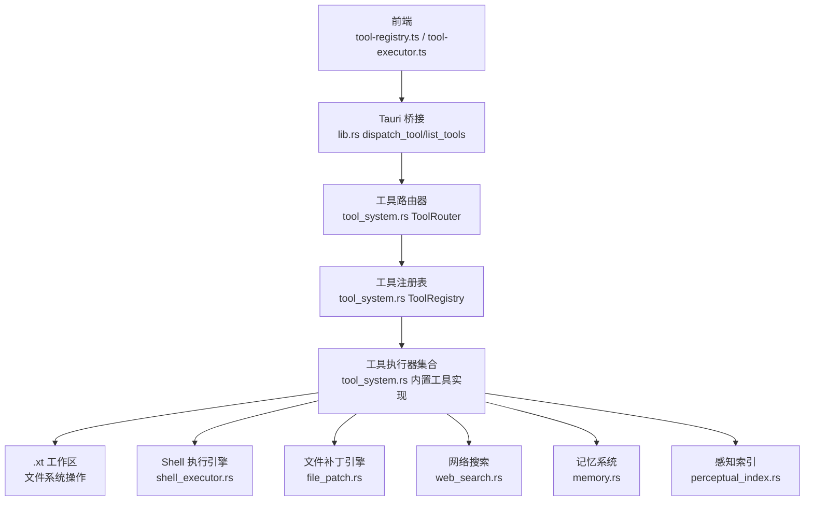
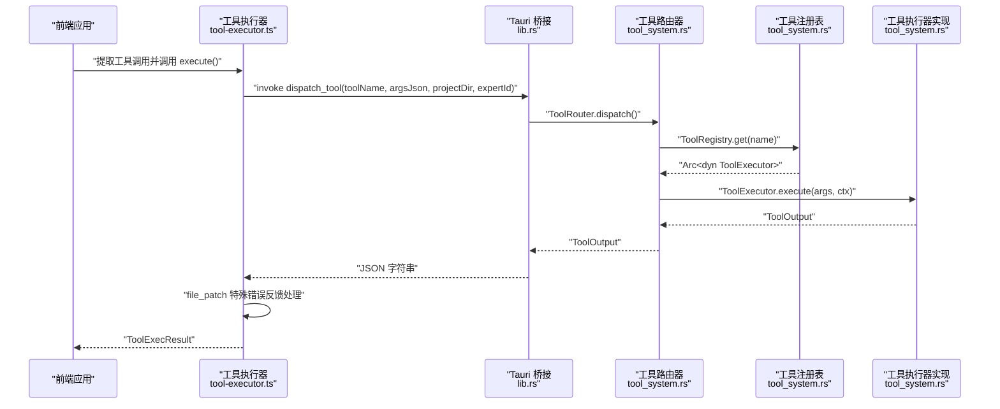
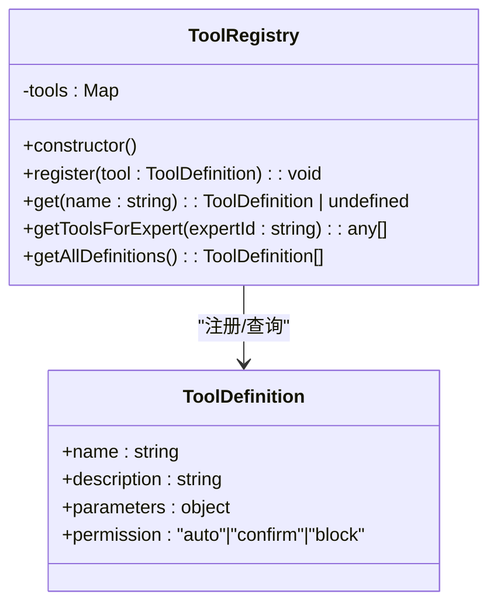
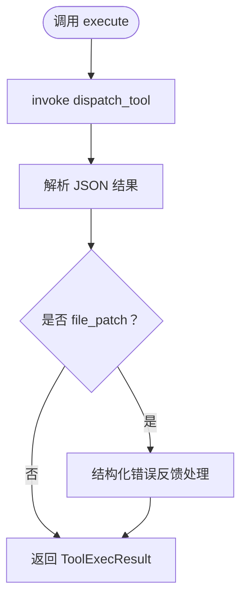
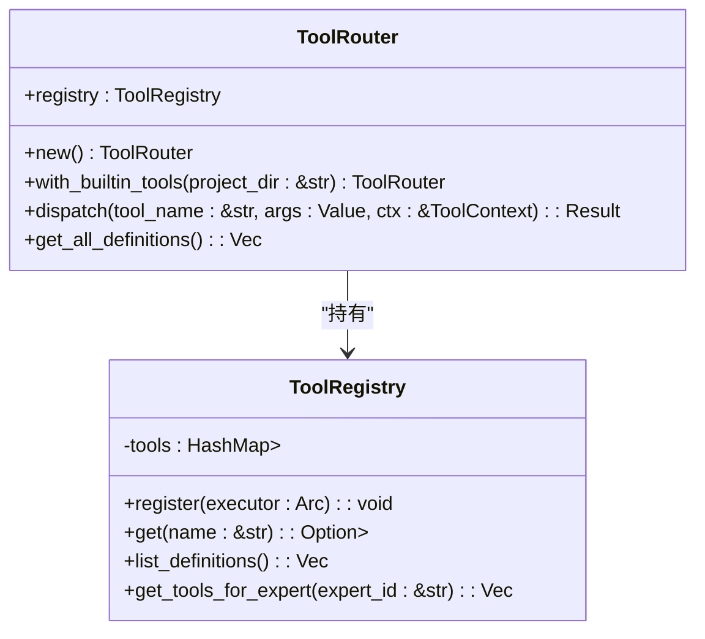
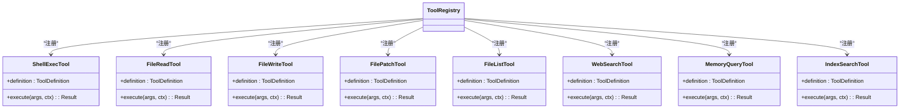
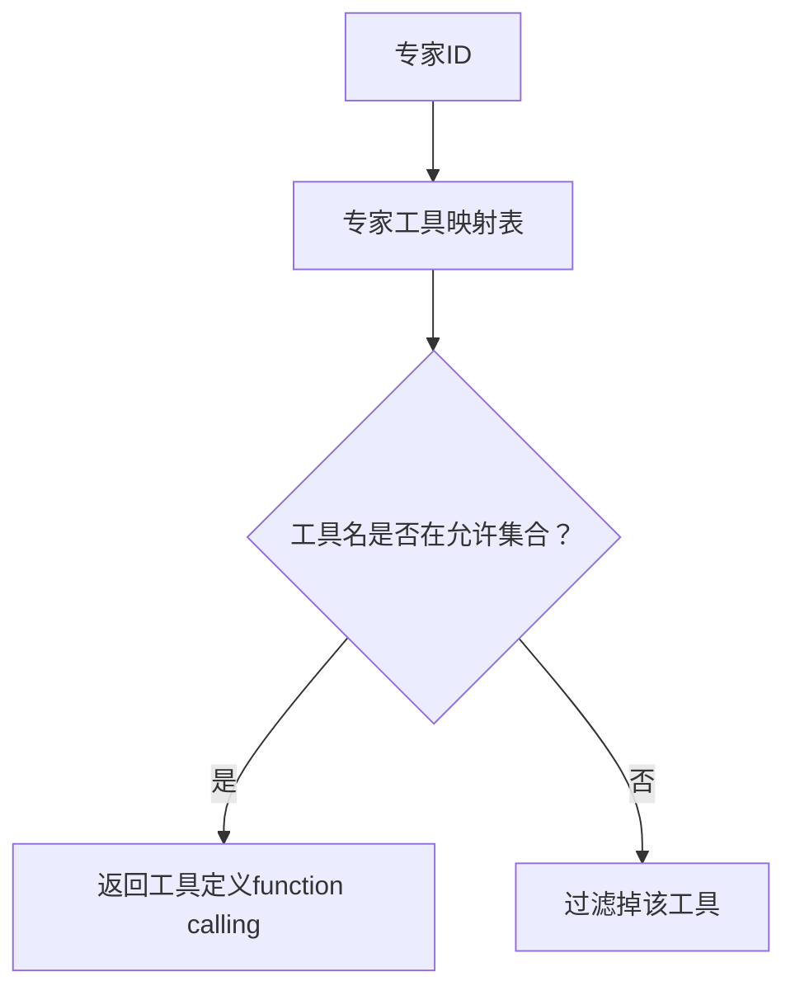
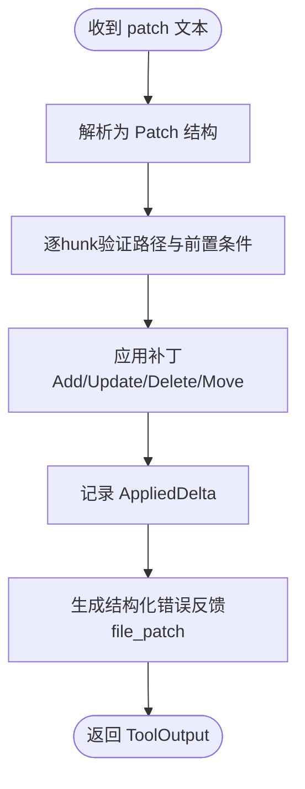
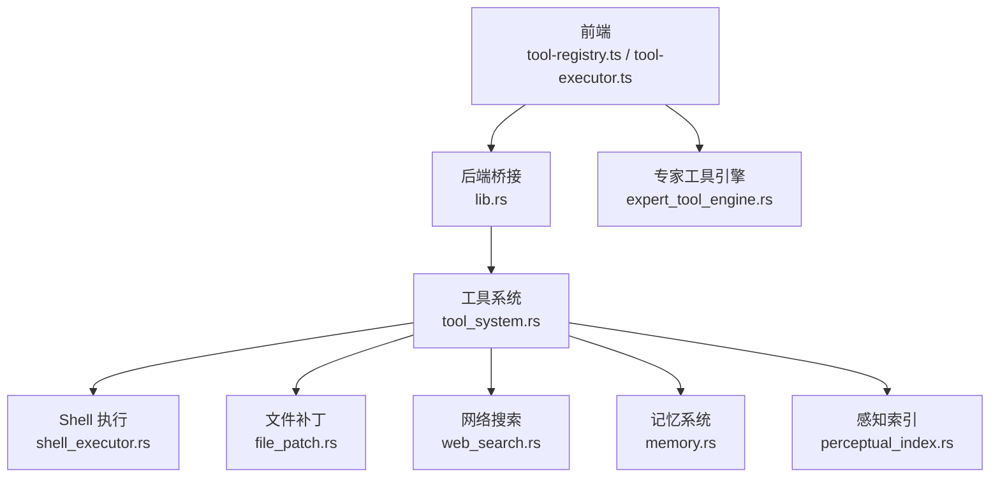

# 工具注册表

<cite>
**本文档引用的文件**
- [tool-registry.ts](file://ai-experts/src/tool-registry.ts)
- [tool-executor.ts](file://ai-experts/src/tool-executor.ts)
- [tool_system.rs](file://ai-experts/src-tauri/src/tool_system.rs)
- [shell_executor.rs](file://ai-experts/src-tauri/src/shell_executor.rs)
- [file_patch.rs](file://ai-experts/src-tauri/src/file_patch.rs)
- [web_search.rs](file://ai-experts/src-tauri/src/web_search.rs)
- [memory.rs](file://ai-experts/src-tauri/src/memory.rs)
- [perceptual_index.rs](file://ai-experts/src-tauri/src/perceptual_index.rs)
- [expert_tool_engine.rs](file://ai-experts/src-tauri/src/expert_tool_engine.rs)
- [lib.rs](file://ai-experts/src-tauri/src/lib.rs)
</cite>

## 目录
1. [简介](#简介)
2. [项目结构](#项目结构)
3. [核心组件](#核心组件)
4. [架构总览](#架构总览)
5. [详细组件分析](#详细组件分析)
6. [依赖关系分析](#依赖关系分析)
7. [性能考虑](#性能考虑)
8. [故障排除指南](#故障排除指南)
9. [结论](#结论)
10. [附录](#附录)

## 简介
本文件为星图专家团工作台的工具注册表组件技术文档，面向前端与后端开发者，系统阐述工具注册表的设计理念、工具定义规范、参数Schema设计、权限控制机制、内置工具实现原理与扩展接口。文档涵盖：
- 工具注册表的单例模式实现与工具查找机制
- 专家权限映射系统与权限级别（auto、confirm、block）
- 内置工具：shell_exec、file_read、file_write、file_patch、file_list、web_search、memory_query、index_search
- 前后端桥接层与工具执行器的统一调用流程
- 扩展接口、自定义工具开发指南与最佳实践

## 项目结构
工具注册表涉及前后端协同：
- 前端：工具定义与权限映射、工具调用提取与执行
- 后端：工具注册表、工具执行器、权限与沙箱控制、具体工具实现

**图表来源**
- [tool-registry.ts:1-192](file://ai-experts/src/tool-registry.ts#L1-L192)
- [tool-executor.ts:1-231](file://ai-experts/src/tool-executor.ts#L1-L231)
- [tool_system.rs:62-142](file://ai-experts/src-tauri/src/tool_system.rs#L62-L142)
- [lib.rs:6289-6316](file://ai-experts/src-tauri/src/lib.rs#L6289-L6316)

**章节来源**
- [tool-registry.ts:1-192](file://ai-experts/src/tool-registry.ts#L1-L192)
- [tool-executor.ts:1-231](file://ai-experts/src/tool-executor.ts#L1-L231)
- [tool_system.rs:62-142](file://ai-experts/src-tauri/src/tool_system.rs#L62-L142)
- [lib.rs:6289-6316](file://ai-experts/src-tauri/src/lib.rs#L6289-L6316)

## 核心组件
- 工具注册表（前端）：负责内置工具的Schema定义、权限标注与专家权限映射，提供按专家过滤的工具清单。
- 工具执行器（前端）：统一工具调用入口，负责将工具调用请求发送至后端，处理file_patch的结构化错误反馈与双轨协议解析。
- 工具注册表（后端）：集中管理工具执行器，提供工具查找与权限过滤能力。
- 工具路由器（后端）：接收工具名+参数，路由到对应执行器并执行。
- 内置工具执行器：shell_exec、file_read、file_write、file_patch、file_list、web_search、memory_query、index_search。
- 桥接层（后端）：暴露dispatch_tool与list_tools命令，供前端调用。

**章节来源**
- [tool-registry.ts:20-182](file://ai-experts/src/tool-registry.ts#L20-L182)
- [tool-executor.ts:13-231](file://ai-experts/src/tool-executor.ts#L13-L231)
- [tool_system.rs:62-142](file://ai-experts/src-tauri/src/tool_system.rs#L62-L142)
- [lib.rs:6289-6316](file://ai-experts/src-tauri/src/lib.rs#L6289-L6316)

## 架构总览
工具调用从前端发起，经由Tauri桥接到后端，后端通过工具路由器分发到具体工具执行器，执行器在沙箱内执行并返回结果。file_patch工具具有特殊的结构化错误反馈处理。

**图表来源**
- [tool-executor.ts:24-53](file://ai-experts/src/tool-executor.ts#L24-L53)
- [lib.rs:6289-6309](file://ai-experts/src-tauri/src/lib.rs#L6289-L6309)
- [tool_system.rs:123-136](file://ai-experts/src-tauri/src/tool_system.rs#L123-L136)

**章节来源**
- [tool-executor.ts:24-53](file://ai-experts/src/tool-executor.ts#L24-L53)
- [lib.rs:6289-6309](file://ai-experts/src-tauri/src/lib.rs#L6289-L6309)
- [tool_system.rs:123-136](file://ai-experts/src-tauri/src/tool_system.rs#L123-L136)

## 详细组件分析

### 工具注册表（前端）
- 单例模式：全局仅有一个ToolRegistry实例，避免重复注册与状态分散。
- 内置工具注册：在构造函数中注册8个内置工具，每个工具包含名称、描述、参数Schema与权限级别。
- 专家权限映射：通过buildExpertToolMap生成专家角色到工具集合的映射，getToolsForExpert按专家过滤返回OpenAI function calling格式的工具定义。
- 参数Schema：遵循JSON Schema规范，支持properties与required字段，便于LLM进行参数校验与调用。

**图表来源**
- [tool-registry.ts:20-182](file://ai-experts/src/tool-registry.ts#L20-L182)

**章节来源**
- [tool-registry.ts:20-182](file://ai-experts/src/tool-registry.ts#L20-L182)

### 工具执行器（前端）
- 统一入口：execute(toolName, argsJson, expertId)负责调用后端dispatch_tool命令。
- 错误处理：对file_patch工具进行结构化错误反馈，从metadata或错误字符串中提取关键信息并组织为可读提示。
- 双轨协议解析：支持OpenAI function calling与ACTION标记两种格式，向后兼容旧版工作流。

**图表来源**
- [tool-executor.ts:24-104](file://ai-experts/src/tool-executor.ts#L24-L104)

**章节来源**
- [tool-executor.ts:13-231](file://ai-experts/src/tool-executor.ts#L13-L231)

### 工具注册表（后端）
- 注册表与路由器：ToolRegistry维护工具执行器映射，ToolRouter负责分发调用。
- 内置工具注册：ToolRouter::with_builtin_tools一次性注册8个内置工具执行器。
- 权限过滤：get_tools_for_expert当前返回全部工具定义（预留专家过滤逻辑）。

**图表来源**
- [tool_system.rs:62-142](file://ai-experts/src-tauri/src/tool_system.rs#L62-L142)

**章节来源**
- [tool_system.rs:62-142](file://ai-experts/src-tauri/src/tool_system.rs#L62-L142)

### 内置工具实现概览
- shell_exec：在项目目录执行命令，支持超时与工作目录，返回执行结果与元数据。
- file_read：读取文件内容，支持行范围，严格沙箱限制。
- file_write：写入或创建文件，支持追加模式，严格沙箱限制。
- file_patch：应用结构化补丁，具备四级容错匹配与路径安全检查。
- file_list：列出目录文件，支持递归与深度限制。
- web_search：网络搜索，支持多源fallback与缓存。
- memory_query：查询专家记忆库（简化版）。
- index_search：在项目代码索引中搜索（简化版）。

**图表来源**
- [tool_system.rs:144-799](file://ai-experts/src-tauri/src/tool_system.rs#L144-L799)

**章节来源**
- [tool_system.rs:144-799](file://ai-experts/src-tauri/src/tool_system.rs#L144-L799)

### 权限控制与专家映射
- 权限级别：auto（自动执行）、confirm（需要确认）、block（默认拦截）。
- 专家映射：前端通过buildExpertToolMap生成专家角色到工具集合的映射，getToolsForExpert按专家过滤工具清单。
- 后端权限：工具执行器内部实现权限判断与沙箱控制（例如路径合法性、命令安全性）。

**图表来源**
- [tool-registry.ts:155-174](file://ai-experts/src/tool-registry.ts#L155-L174)

**章节来源**
- [tool-registry.ts:155-174](file://ai-experts/src/tool-registry.ts#L155-L174)

### 文件补丁工具（file_patch）实现细节
- 结构化补丁解析：支持Add/Update/Delete/Move四种操作，解析hunk与上下文定位。
- 四级容错匹配：精确匹配、右trim匹配、两侧trim匹配、Unicode归一化匹配。
- 路径安全检查：拒绝绝对路径、路径穿越、符号链接，确保只在项目根目录内操作。
- 错误反馈：聚合已应用文件、失败原因、错误位置与建议修正步骤。

**图表来源**
- [file_patch.rs:151-800](file://ai-experts/src-tauri/src/file_patch.rs#L151-L800)

**章节来源**
- [file_patch.rs:151-800](file://ai-experts/src-tauri/src/file_patch.rs#L151-L800)

### Shell 执行引擎
- 跨平台执行：Windows 使用PowerShell/cmd，非Windows使用sh。
- 增强执行：支持超时、输出截断、工作目录沙箱、环境变量覆盖。
- 安全检查：危险命令模式检测、管理员权限命令识别、工作目录合法性检查。

**章节来源**
- [shell_executor.rs:498-633](file://ai-experts/src-tauri/src/shell_executor.rs#L498-L633)

### 网络搜索与记忆系统
- 网络搜索：优先Bing RSS/HTML，失败时降级到DuckDuckGo，支持缓存与结果截断。
- 记忆系统：基于SQLite的本地记忆存储，TF-IDF关键词检索，支持类型与专家维度过滤。

**章节来源**
- [web_search.rs:17-433](file://ai-experts/src-tauri/src/web_search.rs#L17-L433)
- [memory.rs:168-305](file://ai-experts/src-tauri/src/memory.rs#L168-L305)

## 依赖关系分析
- 前端依赖：tool-registry.ts依赖expert-catalog构建专家工具映射；tool-executor.ts依赖@tauri-apps/api进行invoke调用。
- 后端依赖：lib.rs暴露dispatch_tool与list_tools命令；tool_system.rs提供工具注册表与路由器；各工具实现依赖shell_executor、file_patch、web_search、memory、perceptual_index等模块。
- 专家工具引擎：expert_tool_engine.rs提供工具请求计划与命令授权模式解析，与前端工具执行器形成闭环。

**图表来源**
- [lib.rs:6289-6316](file://ai-experts/src-tauri/src/lib.rs#L6289-L6316)
- [tool_system.rs:144-799](file://ai-experts/src-tauri/src/tool_system.rs#L144-L799)

**章节来源**
- [lib.rs:6289-6316](file://ai-experts/src-tauri/src/lib.rs#L6289-L6316)
- [tool_system.rs:144-799](file://ai-experts/src-tauri/src/tool_system.rs#L144-L799)

## 性能考虑
- 输出截断：shell_executor对stdout/stderr采用Head+Tail缓冲策略，避免大输出导致内存压力。
- 搜索缓存：web_search提供基于内存的搜索结果缓存，减少重复请求。
- 索引构建保护：perceptual_index对分段数量与文件数量设置上限，防止大规模项目导致构建耗时过长。
- 异步执行：后端工具执行采用异步I/O与超时控制，提升并发与稳定性。

**章节来源**
- [shell_executor.rs:401-465](file://ai-experts/src-tauri/src/shell_executor.rs#L401-L465)
- [web_search.rs:306-348](file://ai-experts/src-tauri/src/web_search.rs#L306-L348)
- [perceptual_index.rs:144-275](file://ai-experts/src-tauri/src/perceptual_index.rs#L144-L275)

## 故障排除指南
- file_patch执行失败：前端会将后端返回的metadata或错误字符串结构化为可读提示，包含失败文件、位置、已应用文件等信息，指导用户修正补丁。
- 命令执行超时或被杀：shell_executor在超时后可选择强制终止进程，返回KILLED标记与截断输出。
- 路径越界或沙箱违规：各工具执行器在执行前进行路径合法性检查，若越界将返回权限错误。
- 网络搜索失败：web_search支持多源fallback，若所有源均失败，将返回降级结果。

**章节来源**
- [tool-executor.ts:59-104](file://ai-experts/src/tool-executor.ts#L59-L104)
- [shell_executor.rs:598-633](file://ai-experts/src-tauri/src/shell_executor.rs#L598-L633)
- [file_patch.rs:102-147](file://ai-experts/src-tauri/src/file_patch.rs#L102-L147)
- [web_search.rs:322-348](file://ai-experts/src-tauri/src/web_search.rs#L322-L348)

## 结论
工具注册表通过前后端协同实现了标准化、可扩展、可审计的工具体系。前端负责工具定义与权限映射，后端提供统一的工具路由器与执行器抽象，内置工具覆盖文件系统、命令执行、网络搜索、记忆与索引等核心能力。通过沙箱与安全检查保障执行安全，通过结构化错误反馈提升工具使用的可恢复性。该架构为后续扩展更多工具与权限策略提供了清晰的扩展点。

## 附录

### 工具定义接口与参数Schema
- 工具定义接口：包含name、description、parameters（JSON Schema）、permission（auto/confirm/block）。
- 参数Schema：支持properties与required字段，便于LLM进行参数校验与调用。

**章节来源**
- [tool-registry.ts:6-15](file://ai-experts/src/tool-registry.ts#L6-L15)

### 权限级别使用方法
- auto：无需确认即可执行。
- confirm：需要用户确认。
- block：默认拦截，禁止执行。

**章节来源**
- [tool-registry.ts:14](file://ai-experts/src/tool-registry.ts#L14)

### 内置工具参数与使用场景
- shell_exec：在项目目录执行命令，适用于构建、测试、git操作等。
- file_read：读取文件内容，支持行范围，适用于代码分析与上下文获取。
- file_write：写入或创建文件，支持追加模式，适用于生成与修改文件。
- file_patch：应用结构化补丁，适用于批量修改与重构。
- file_list：列出目录文件，支持递归与深度限制，适用于探索项目结构。
- web_search：搜索互联网获取信息，适用于事实核查与背景资料收集。
- memory_query：查询专家记忆库，适用于历史经验与上下文检索。
- index_search：在项目代码索引中搜索，适用于符号与引用定位。

**章节来源**
- [tool-registry.ts:27-141](file://ai-experts/src/tool-registry.ts#L27-L141)
- [tool_system.rs:144-799](file://ai-experts/src-tauri/src/tool_system.rs#L144-L799)

### 扩展接口与自定义工具开发指南
- 实现ToolExecutor Trait：定义definition与execute方法，返回ToolOutput或抛出ToolError。
- 注册工具：在ToolRouter::with_builtin_tools中注册自定义工具执行器。
- 参数Schema：遵循JSON Schema规范，确保LLM正确调用。
- 权限控制：在execute中实现权限判断与沙箱控制，必要时返回ToolError.retryable以支持重试。

**章节来源**
- [tool_system.rs:51-60](file://ai-experts/src-tauri/src/tool_system.rs#L51-L60)
- [tool_system.rs:102-121](file://ai-experts/src-tauri/src/tool_system.rs#L102-L121)

### 最佳实践
- 参数最小化：仅声明必需参数，避免过度复杂。
- 错误明确：在ToolError中提供清晰的错误码与消息，便于前端展示与重试。
- 沙箱优先：严格限制文件系统与命令执行范围，避免越权操作。
- 输出截断：对潜在大输出进行截断与摘要，保证性能与用户体验。
- 缓存与降级：对外部接口实现缓存与降级策略，提升稳定性。

**章节来源**
- [shell_executor.rs:334-399](file://ai-experts/src-tauri/src/shell_executor.rs#L334-L399)
- [web_search.rs:306-348](file://ai-experts/src-tauri/src/web_search.rs#L306-L348)