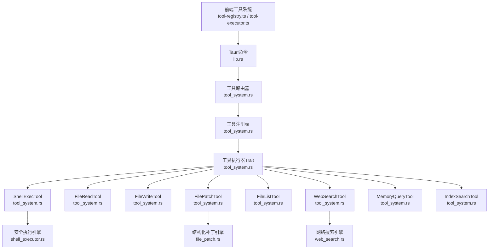
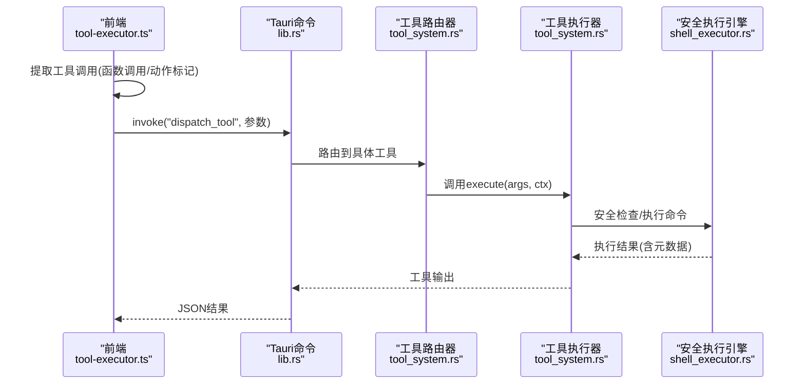
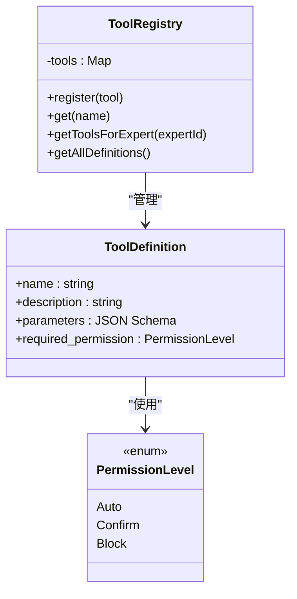
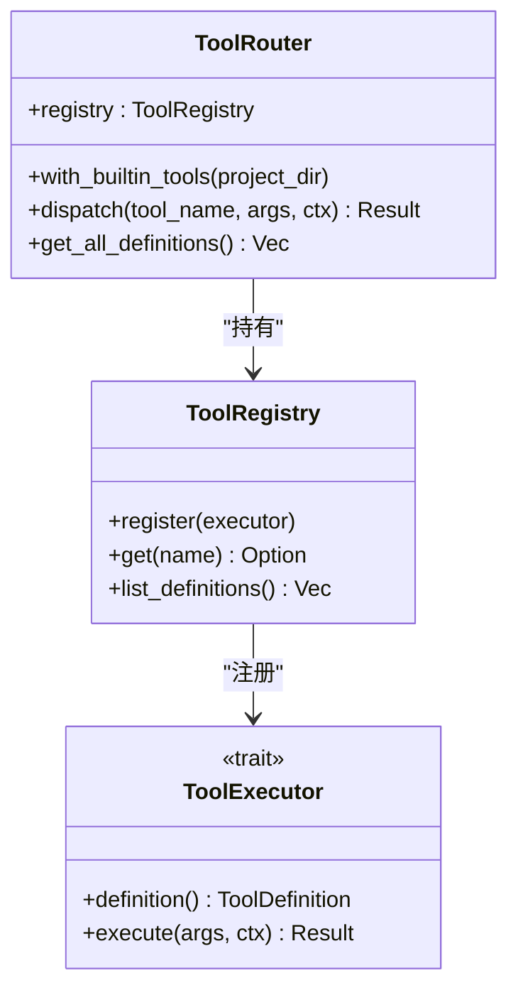
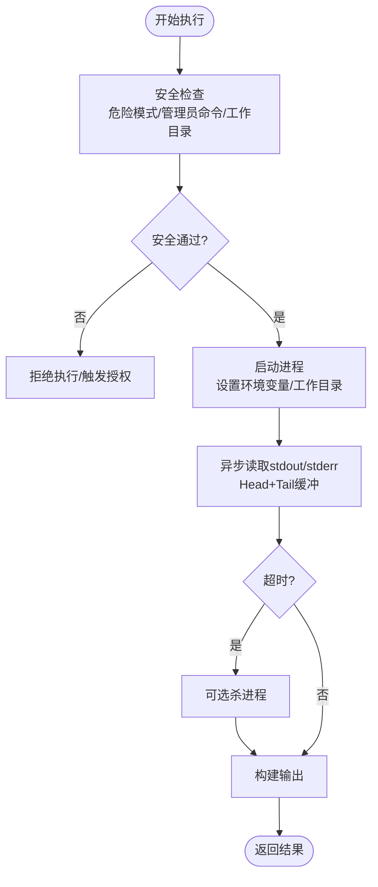
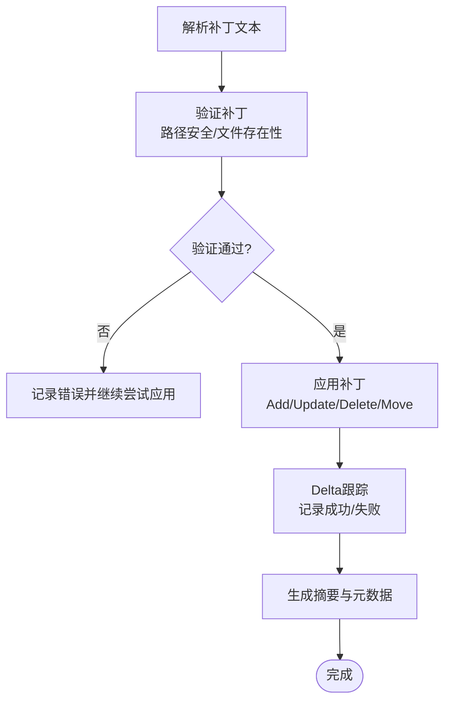
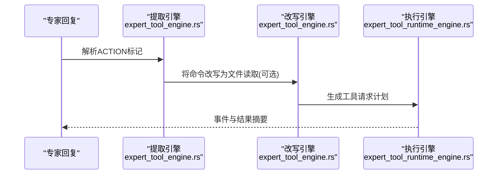
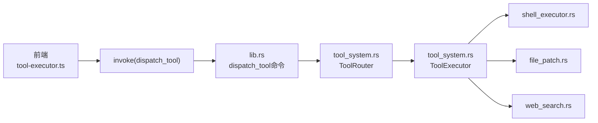

# 工具系统模块

<cite>
**本文档引用的文件**
- [tool-registry.ts](file://ai-experts/src/tool-registry.ts)
- [tool-executor.ts](file://ai-experts/src/tool-executor.ts)
- [tool_system.rs](file://ai-experts/src-tauri/src/tool_system.rs)
- [expert_tool_engine.rs](file://ai-experts/src-tauri/src/expert_tool_engine.rs)
- [expert_tool_runtime_engine.rs](file://ai-experts/src-tauri/src/expert_tool_runtime_engine.rs)
- [shell_executor.rs](file://ai-experts/src-tauri/src/shell_executor.rs)
- [file_patch.rs](file://ai-experts/src-tauri/src/file_patch.rs)
- [web_search.rs](file://ai-experts/src-tauri/src/web_search.rs)
- [lib.rs](file://ai-experts/src-tauri/src/lib.rs)
- [main.rs](file://ai-experts/src-tauri/src/main.rs)
</cite>

## 目录
1. [简介](#简介)
2. [项目结构](#项目结构)
3. [核心组件](#核心组件)
4. [架构总览](#架构总览)
5. [详细组件分析](#详细组件分析)
6. [依赖关系分析](#依赖关系分析)
7. [性能考虑](#性能考虑)
8. [故障排除指南](#故障排除指南)
9. [结论](#结论)
10. [附录](#附录)

## 简介
本技术文档面向星图专家团工作台的工具系统模块，系统性阐述工具注册表、工具执行器、权限控制与安全执行策略的设计与实现。文档涵盖工具定义规范、参数Schema设计、权限控制机制、生命周期管理、执行器接口、错误处理、扩展接口与自定义工具开发指南，并提供最佳实践、性能优化建议与常见问题解决方案。

## 项目结构
工具系统由前端TypeScript与后端Rust共同实现，采用“前端定义 + 后端执行”的分层架构：
- 前端负责工具Schema定义与工具调用提取，桥接到后端Tauri命令
- 后端提供工具注册表、执行器Trait、具体工具实现与安全执行引擎
- 通过Tauri命令通道完成前后端通信与权限控制

**图表来源**
- [tool-registry.ts:1-192](file://ai-experts/src/tool-registry.ts#L1-L192)
- [tool-executor.ts:1-231](file://ai-experts/src/tool-executor.ts#L1-L231)
- [tool_system.rs:62-142](file://ai-experts/src-tauri/src/tool_system.rs#L62-L142)
- [shell_executor.rs:498-633](file://ai-experts/src-tauri/src/shell_executor.rs#L498-L633)
- [file_patch.rs:991-1006](file://ai-experts/src-tauri/src/file_patch.rs#L991-L1006)
- [web_search.rs:16-68](file://ai-experts/src-tauri/src/web_search.rs#L16-L68)

**章节来源**
- [tool-registry.ts:1-192](file://ai-experts/src/tool-registry.ts#L1-L192)
- [tool-executor.ts:1-231](file://ai-experts/src/tool-executor.ts#L1-L231)
- [tool_system.rs:62-142](file://ai-experts/src-tauri/src/tool_system.rs#L62-L142)

## 核心组件
- 工具注册表：集中管理工具Schema与权限，提供工具过滤与注入能力
- 工具执行器：统一的工具调用入口，负责参数解析、权限校验与结果封装
- 工具路由器：根据工具名分发到具体执行器
- 工具执行器Trait：定义工具的统一接口与参数Schema
- 安全执行引擎：命令安全检测、超时控制、输出截断与沙箱约束
- 结构化补丁引擎：解析与应用Patch，支持容错匹配与Delta跟踪
- 网络搜索引擎：多源搜索与缓存，提供结构化结果
- 专家工具编排：将专家意图转换为工具请求计划与事件流

**章节来源**
- [tool_system.rs:51-95](file://ai-experts/src-tauri/src/tool_system.rs#L51-L95)
- [shell_executor.rs:498-633](file://ai-experts/src-tauri/src/shell_executor.rs#L498-L633)
- [file_patch.rs:991-1006](file://ai-experts/src-tauri/src/file_patch.rs#L991-L1006)
- [web_search.rs:16-68](file://ai-experts/src-tauri/src/web_search.rs#L16-L68)
- [expert_tool_engine.rs:1-534](file://ai-experts/src-tauri/src/expert_tool_engine.rs#L1-L534)
- [expert_tool_runtime_engine.rs:1-510](file://ai-experts/src-tauri/src/expert_tool_runtime_engine.rs#L1-L510)

## 架构总览
工具系统采用“前端定义 + 后端执行 + 安全控制”的三层架构：
- 前端层：工具Schema定义、工具调用提取与参数解析
- 传输层：Tauri命令通道，统一参数传递与结果回传
- 执行层：工具路由器与执行器，结合安全执行引擎完成实际操作

**图表来源**
- [tool-executor.ts:24-53](file://ai-experts/src/tool-executor.ts#L24-L53)
- [lib.rs:6289-6320](file://ai-experts/src-tauri/src/lib.rs#L6289-L6320)
- [tool_system.rs:123-136](file://ai-experts/src-tauri/src/tool_system.rs#L123-L136)
- [shell_executor.rs:498-633](file://ai-experts/src-tauri/src/shell_executor.rs#L498-L633)

## 详细组件分析

### 工具注册表与定义规范
- 前端注册表提供工具Schema与权限配置，内置常用工具包括shell_exec、file_read、file_write、file_patch、file_list、web_search、memory_query、index_search
- 后端注册表提供工具定义、权限级别与执行器注册，支持按专家角色过滤可用工具
- 工具Schema采用JSON Schema风格，参数字段包含类型、描述与必填项
- 权限级别：auto(自动)、confirm(需要确认)、block(拦截)

**图表来源**
- [tool-registry.ts:20-182](file://ai-experts/src/tool-registry.ts#L20-L182)
- [tool_system.rs:17-24](file://ai-experts/src-tauri/src/tool_system.rs#L17-L24)
- [tool_system.rs:9-15](file://ai-experts/src-tauri/src/tool_system.rs#L9-L15)

**章节来源**
- [tool-registry.ts:6-182](file://ai-experts/src/tool-registry.ts#L6-L182)
- [tool_system.rs:17-95](file://ai-experts/src-tauri/src/tool_system.rs#L17-L95)

### 工具执行器与路由器
- 工具执行器Trait定义统一接口：definition()与execute(args, ctx)
- 工具路由器根据工具名查找执行器并执行，支持内置工具初始化
- 前端执行器负责参数校验、调用提取与错误结构化

**图表来源**
- [tool_system.rs:51-95](file://ai-experts/src-tauri/src/tool_system.rs#L51-L95)
- [tool_system.rs:97-142](file://ai-experts/src-tauri/src/tool_system.rs#L97-L142)

**章节来源**
- [tool_system.rs:51-142](file://ai-experts/src-tauri/src/tool_system.rs#L51-L142)
- [tool-executor.ts:13-231](file://ai-experts/src/tool-executor.ts#L13-L231)

### 安全执行与权限控制
- 命令安全检测：危险模式识别、管理员权限命令识别、工作目录沙箱检查
- 执行配置：超时、输出大小限制、行数限制、超时是否杀进程、工作目录沙箱、环境变量覆盖
- 输出截断：Head+Tail缓冲策略，防止大输出阻塞与泄露
- 权限控制：auto自动执行、confirm需要用户确认、block拦截

**图表来源**
- [shell_executor.rs:476-495](file://ai-experts/src-tauri/src/shell_executor.rs#L476-L495)
- [shell_executor.rs:498-633](file://ai-experts/src-tauri/src/shell_executor.rs#L498-L633)
- [expert_tool_runtime_engine.rs:295-353](file://ai-experts/src-tauri/src/expert_tool_runtime_engine.rs#L295-L353)

**章节来源**
- [shell_executor.rs:476-633](file://ai-experts/src-tauri/src/shell_executor.rs#L476-L633)
- [expert_tool_runtime_engine.rs:295-353](file://ai-experts/src-tauri/src/expert_tool_runtime_engine.rs#L295-L353)

### 结构化补丁引擎
- 补丁格式：Begin/End标记、Add/Delete/Update/Move四种操作
- 容错匹配：精确匹配、右trim、两侧trim、Unicode归一化
- 路径安全：拒绝绝对路径、路径穿越、符号链接
- Delta跟踪：记录已应用与失败的操作，便于模型迭代修正

**图表来源**
- [file_patch.rs:151-289](file://ai-experts/src-tauri/src/file_patch.rs#L151-L289)
- [file_patch.rs:514-618](file://ai-experts/src-tauri/src/file_patch.rs#L514-L618)
- [file_patch.rs:664-833](file://ai-experts/src-tauri/src/file_patch.rs#L664-L833)

**章节来源**
- [file_patch.rs:151-833](file://ai-experts/src-tauri/src/file_patch.rs#L151-L833)

### 网络搜索与专家工具编排
- 网络搜索：Bing优先，失败回退DuckDuckGo，支持缓存与结果截断
- 专家工具编排：从专家回复中提取ACTION标记，改写为文件读取、命令执行等请求
- 工具执行事件：Web搜索、命令执行的事件结构与结果汇总

**图表来源**
- [expert_tool_engine.rs:288-480](file://ai-experts/src-tauri/src/expert_tool_engine.rs#L288-L480)
- [expert_tool_runtime_engine.rs:139-293](file://ai-experts/src-tauri/src/expert_tool_runtime_engine.rs#L139-L293)
- [web_search.rs:16-68](file://ai-experts/src-tauri/src/web_search.rs#L16-L68)

**章节来源**
- [expert_tool_engine.rs:288-480](file://ai-experts/src-tauri/src/expert_tool_engine.rs#L288-L480)
- [expert_tool_runtime_engine.rs:139-293](file://ai-experts/src-tauri/src/expert_tool_runtime_engine.rs#L139-L293)
- [web_search.rs:16-68](file://ai-experts/src-tauri/src/web_search.rs#L16-L68)

## 依赖关系分析
- 前端依赖Tauri invoke进行后端调用，工具调用提取支持OpenAI函数调用与旧ACTION标记
- 后端通过Tauri命令暴露dispatch_tool，路由到工具路由器与执行器
- 安全执行引擎与结构化补丁引擎作为底层能力被各工具复用

**图表来源**
- [tool-executor.ts:24-53](file://ai-experts/src/tool-executor.ts#L24-L53)
- [lib.rs:6289-6320](file://ai-experts/src-tauri/src/lib.rs#L6289-L6320)
- [tool_system.rs:123-136](file://ai-experts/src-tauri/src/tool_system.rs#L123-L136)

**章节来源**
- [lib.rs:6289-6320](file://ai-experts/src-tauri/src/lib.rs#L6289-L6320)
- [tool_system.rs:123-136](file://ai-experts/src-tauri/src/tool_system.rs#L123-L136)

## 性能考虑
- 输出截断：Head+Tail缓冲策略限制内存占用，避免超大输出导致性能问题
- 超时控制：统一超时与可选杀进程，防止长时间阻塞
- 缓存：网络搜索结果缓存减少重复请求
- 异步读取：并发读取stdout/stderr，提升I/O吞吐
- 路径安全与验证：提前验证避免无效执行，减少资源浪费

[本节为通用指导，无需特定文件引用]

## 故障排除指南
- 工具执行错误：前端捕获后端异常并结构化返回，file_patch工具提供专用错误反馈模板
- 路径越界/沙箱违规：检查工作目录与项目根目录关系，确保相对路径
- 命令安全拒绝：识别危险模式或管理员权限命令，触发授权流程
- 网络搜索失败：回退至备用搜索引擎，检查代理与网络连通性
- 补丁应用失败：利用Delta跟踪与错误信息，定位失败文件与行号，修正Patch

**章节来源**
- [tool-executor.ts:39-104](file://ai-experts/src/tool-executor.ts#L39-L104)
- [shell_executor.rs:212-259](file://ai-experts/src-tauri/src/shell_executor.rs#L212-L259)
- [file_patch.rs:800-833](file://ai-experts/src-tauri/src/file_patch.rs#L800-L833)
- [web_search.rs:313-348](file://ai-experts/src-tauri/src/web_search.rs#L313-L348)

## 结论
工具系统通过清晰的分层设计与严格的安全控制，实现了从专家意图到工具执行的闭环。前端Schema定义与后端执行器解耦，配合安全执行引擎与结构化补丁能力，既保证了易用性，又确保了安全性与可扩展性。建议在自定义工具开发中遵循统一的Schema与权限模型，并充分利用安全执行与错误反馈机制。

[本节为总结性内容，无需特定文件引用]

## 附录

### 工具定义规范与参数Schema设计
- 工具Schema采用JSON Schema风格，包含name、description、parameters与required_permission
- parameters中定义属性类型、描述与必填字段，便于前端与后端一致性校验
- 建议为每个工具提供清晰的描述与示例参数，便于专家理解与正确使用

**章节来源**
- [tool_system.rs:17-24](file://ai-experts/src-tauri/src/tool_system.rs#L17-L24)
- [tool-registry.ts:6-182](file://ai-experts/src/tool-registry.ts#L6-L182)

### 权限控制机制实现原理
- auto：自动执行，无需用户确认
- confirm：需要用户确认，触发授权流程
- block：默认拦截，禁止执行
- 前端执行器对需要确认的工具进行结构化错误反馈，引导专家修正

**章节来源**
- [tool_system.rs:9-15](file://ai-experts/src-tauri/src/tool_system.rs#L9-L15)
- [tool-executor.ts:39-94](file://ai-experts/src/tool-executor.ts#L39-L94)

### 生命周期管理与执行器接口设计
- 注册阶段：工具注册表注册执行器，提供工具定义与权限
- 调用阶段：前端提取工具调用，后端路由到对应执行器
- 执行阶段：执行器调用安全执行引擎，返回结构化结果
- 错误阶段：统一错误封装与反馈，支持模型自我修正

**章节来源**
- [tool_system.rs:62-142](file://ai-experts/src-tauri/src/tool_system.rs#L62-L142)
- [tool-executor.ts:148-231](file://ai-experts/src/tool-executor.ts#L148-L231)

### 扩展接口与自定义工具开发指南
- 实现步骤
  1) 定义工具Schema与权限级别
  2) 实现ToolExecutor Trait，提供definition与execute
  3) 在ToolRouter中注册执行器
  4) 如涉及命令执行，使用安全执行引擎配置
  5) 如涉及文件操作，使用结构化补丁引擎
- 最佳实践
  - 严格参数校验与错误提示
  - 使用沙箱与权限控制
  - 提供结构化元数据便于调试
  - 利用缓存与超时控制提升性能

**章节来源**
- [tool_system.rs:51-95](file://ai-experts/src-tauri/src/tool_system.rs#L51-L95)
- [shell_executor.rs:336-371](file://ai-experts/src-tauri/src/shell_executor.rs#L336-L371)
- [file_patch.rs:991-1006](file://ai-experts/src-tauri/src/file_patch.rs#L991-L1006)

### 安全执行控制策略
- 危险命令检测：内置危险模式列表与管理员命令前缀
- 工作目录沙箱：限制在项目根目录范围内
- 输出截断：防止超大输出造成性能与安全问题
- 授权流程：对需要确认的命令触发用户授权

**章节来源**
- [shell_executor.rs:124-157](file://ai-experts/src-tauri/src/shell_executor.rs#L124-L157)
- [shell_executor.rs:507-516](file://ai-experts/src-tauri/src/shell_executor.rs#L507-L516)
- [expert_tool_runtime_engine.rs:295-353](file://ai-experts/src-tauri/src/expert_tool_runtime_engine.rs#L295-L353)

### 实际开发示例与集成案例
- 示例场景
  - 自定义命令工具：实现ShellExecTool类似的执行器，配置参数Schema与权限级别
  - 文件变更工具：基于结构化补丁引擎实现Add/Update/Delete/Move操作
  - 外部服务工具：实现WebSearchTool类似的执行器，提供参数校验与结果封装
- 集成要点
  - 前端注册工具Schema与权限
  - 后端注册执行器并接入安全执行引擎
  - 通过Tauri命令通道完成调用与结果回传

**章节来源**
- [tool_system.rs:146-223](file://ai-experts/src-tauri/src/tool_system.rs#L146-L223)
- [file_patch.rs:664-833](file://ai-experts/src-tauri/src/file_patch.rs#L664-L833)
- [web_search.rs:16-68](file://ai-experts/src-tauri/src/web_search.rs#L16-L68)