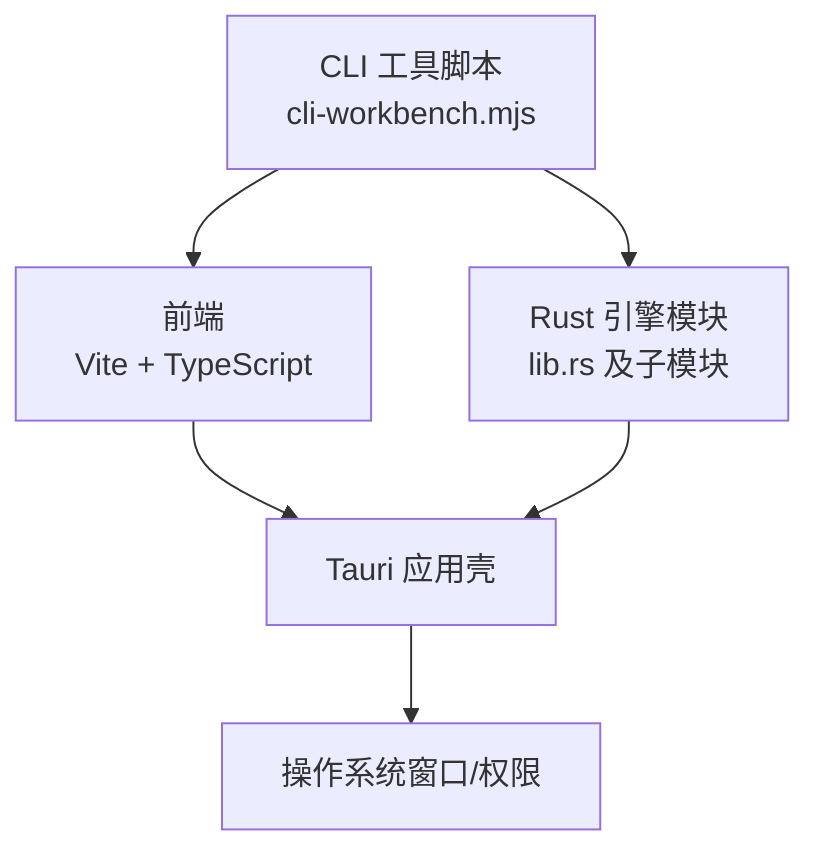
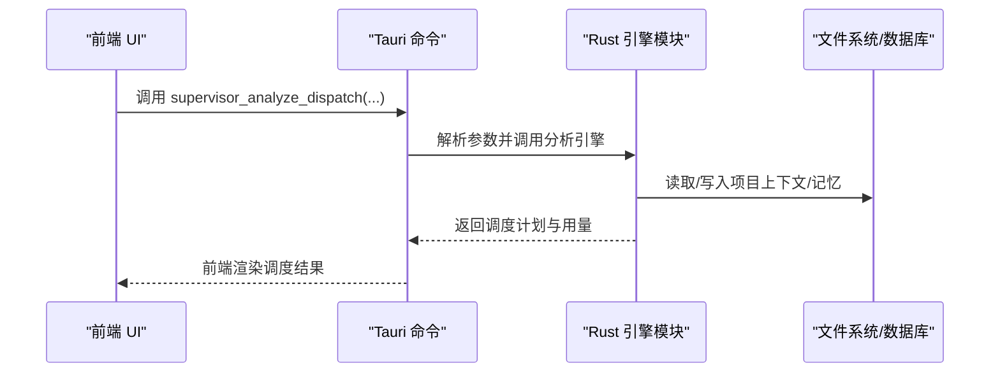
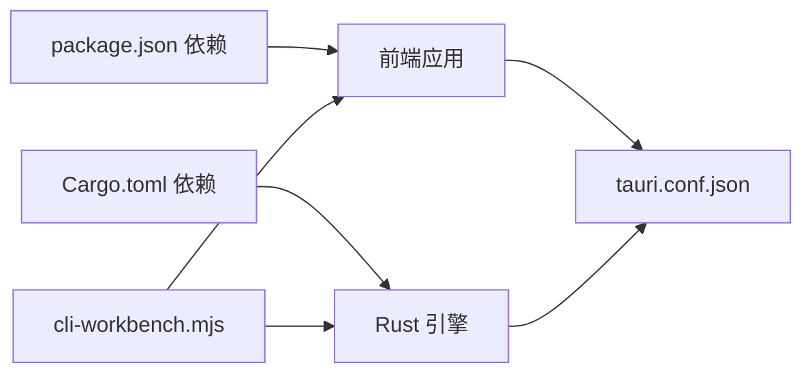

# 开发流程

<cite>
**本文档引用的文件**
- [package.json](file://ai-experts/package.json)
- [vite.config.ts](file://ai-experts/vite.config.ts)
- [tsconfig.json](file://ai-experts/tsconfig.json)
- [tauri.conf.json](file://ai-experts/src-tauri/tauri.conf.json)
- [Cargo.toml](file://ai-experts/src-tauri/Cargo.toml)
- [.gitignore](file://ai-experts/.gitignore)
- [main.ts](file://ai-experts/src/main.ts)
- [cli-workbench.mjs](file://ai-experts/scripts/cli-workbench.mjs)
- [lib.rs](file://ai-experts/src-tauri/src/lib.rs)
- [approval_store.rs](file://ai-experts/src-tauri/src/approval_store.rs)
- [blackboard_engine.rs](file://ai-experts/src-tauri/src/blackboard_engine.rs)
- [memory.rs](file://ai-experts/src-tauri/src/memory.rs)
</cite>

## 目录
1. [引言](#引言)
2. [项目结构](#项目结构)
3. [核心组件](#核心组件)
4. [架构总览](#架构总览)
5. [详细组件分析](#详细组件分析)
6. [依赖关系分析](#依赖关系分析)
7. [性能考虑](#性能考虑)
8. [故障排除指南](#故障排除指南)
9. [结论](#结论)
10. [附录](#附录)

## 引言
本指南面向“星图专家团工作台（社区版）”的开发者，系统化梳理从代码规范、版本控制、代码审查、日常工具到调试与发布全流程。文档以仓库现有实现为依据，结合前端 TypeScript 与后端 Rust 的实际代码组织，提供可操作的开发流程与最佳实践。

## 项目结构
项目采用前端 + 桌面端框架（Tauri）混合架构：
- 前端：Vite + TypeScript，入口位于 src/main.ts，构建产物用于 Tauri 嵌入。
- 后端：Rust（Tauri 原生命令与引擎模块），集中于 src-tauri/src，通过 Tauri 命令桥接前后端。
- 构建与打包：前端使用 Vite，桌面端使用 Tauri CLI；版本号与产品名统一在配置文件中定义。
- 脚本与工具：提供 CLI 工作台脚本，支持端到端场景测试与项目初始化。

图表来源
- [main.ts:1-8673](file://ai-experts/src/main.ts#L1-L8673)
- [lib.rs:1-7190](file://ai-experts/src-tauri/src/lib.rs#L1-L7190)
- [tauri.conf.json:1-38](file://ai-experts/src-tauri/tauri.conf.json#L1-L38)
- [cli-workbench.mjs:1-792](file://ai-experts/scripts/cli-workbench.mjs#L1-L792)

章节来源
- [package.json:1-28](file://ai-experts/package.json#L1-L28)
- [vite.config.ts:1-31](file://ai-experts/vite.config.ts#L1-L31)
- [tsconfig.json:1-24](file://ai-experts/tsconfig.json#L1-L24)
- [tauri.conf.json:1-38](file://ai-experts/src-tauri/tauri.conf.json#L1-L38)
- [Cargo.toml:1-46](file://ai-experts/src-tauri/Cargo.toml#L1-L46)
- [.gitignore:1-25](file://ai-experts/.gitignore#L1-L25)

## 核心组件
- 前端主入口与 UI 控制：负责窗口控制、菜单交互、主题切换、密钥池与专家配置加载、聊天消息格式化等。
- Rust 引擎与命令：提供 Tauri 原生命令（如工作区校验、专家调度分析、令牌用量统计等），并组织专家协作、黑板、记忆等引擎模块。
- CLI 工作台：提供端到端测试场景，模拟用户输入、工具调用、文件读写与会话持久化，支持日志记录与失败重试。

章节来源
- [main.ts:1-8673](file://ai-experts/src/main.ts#L1-L8673)
- [lib.rs:1-7190](file://ai-experts/src-tauri/src/lib.rs#L1-L7190)
- [cli-workbench.mjs:1-792](file://ai-experts/scripts/cli-workbench.mjs#L1-L792)

## 架构总览
前端通过 Tauri 命令调用 Rust 后端，Rust 模块内部进一步编排专家路由、令牌配额、黑板与记忆系统，形成“前端交互 + 原生命令 + 引擎模块”的分层架构。

图表来源
- [main.ts:1-8673](file://ai-experts/src/main.ts#L1-L8673)
- [lib.rs:733-788](file://ai-experts/src-tauri/src/lib.rs#L733-L788)

章节来源
- [main.ts:1-8673](file://ai-experts/src/main.ts#L1-L8673)
- [lib.rs:1-7190](file://ai-experts/src-tauri/src/lib.rs#L1-L7190)

## 详细组件分析

### TypeScript 代码规范与命名约定
- 语言与模块：ES2020 目标、ESNext 模块、Bundler 模式解析，严格模式开启，禁用 emit。
- 命名与导出：接口与类型使用 PascalCase；常量使用 UPPER_SNAKE_CASE；函数与变量使用 camelCase；枚举使用 UPPER_SNAKE_CASE。
- 注释与文档：使用 JSDoc 风格注释，描述参数、返回值与副作用；复杂逻辑需标注“日志级别”与“行为说明”。

章节来源
- [tsconfig.json:1-24](file://ai-experts/tsconfig.json#L1-L24)
- [main.ts:1-8673](file://ai-experts/src/main.ts#L1-L8673)

### Rust 代码规范与命名约定
- 模块组织：按功能域划分模块（如 approval_store、blackboard_engine、memory 等），lib.rs 统一导出与注册命令。
- 命名与类型：结构体与枚举使用 PascalCase；字段与方法使用 snake_case；常量使用 UPPER_SNAKE_CASE。
- 错误处理：统一返回 Result<T, String>，错误消息包含上下文；对外暴露的命令返回 JSON 字符串。
- 并发与线程：Tokio 运行时多线程，注意共享状态的并发安全（如 ApprovalStore 使用 Mutex）。

章节来源
- [Cargo.toml:1-46](file://ai-experts/src-tauri/Cargo.toml#L1-L46)
- [lib.rs:1-7190](file://ai-experts/src-tauri/src/lib.rs#L1-L7190)
- [approval_store.rs:1-123](file://ai-experts/src-tauri/src/approval_store.rs#L1-L123)
- [blackboard_engine.rs:1-670](file://ai-experts/src-tauri/src/blackboard_engine.rs#L1-L670)
- [memory.rs:1-843](file://ai-experts/src-tauri/src/memory.rs#L1-L843)

### 版本控制流程（Git 工作流、分支策略、提交规范、合并流程）
- 分支策略：采用功能分支 + 主干保护（main/master）策略；特性开发在 feature/*，修复在 hotfix/*，发布在 release/*。
- 提交规范：采用“类型: 概述”格式，如 feat: 添加 CLI 场景校验；fix: 修复令牌用量统计；docs: 补充架构说明；refactor: 优化引擎模块。
- 合并流程：PR 自动触发构建与测试；至少一名审阅者批准；合并前确保通过本地与 CI 校验。

章节来源
- [.gitignore:1-25](file://ai-experts/.gitignore#L1-L25)
- [tauri.conf.json:1-38](file://ai-experts/src-tauri/tauri.conf.json#L1-L38)

### 代码审查标准
- 审查清单
  - 功能正确性：是否满足需求、边界条件与异常路径覆盖。
  - 性能与资源：内存占用、IO 次数、并发安全与锁粒度。
  - 可维护性：命名一致性、注释完整性、模块职责单一。
  - 安全性：命令审批、路径越界检查、敏感信息脱敏。
  - 兼容性：跨平台（Windows/macOS/Linux）行为一致性。
- 质量检查点
  - TypeScript：严格模式、未使用变量/参数、switch 穿透检查。
  - Rust：Result 错误处理、panic 风险、共享状态并发安全。
- 反馈处理机制：针对问题逐条回复与修订，必要时提供最小可复现示例与测试用例。

章节来源
- [tsconfig.json:17-20](file://ai-experts/tsconfig.json#L17-L20)
- [approval_store.rs:67-96](file://ai-experts/src-tauri/src/approval_store.rs#L67-L96)

### 日常开发工具使用指南
- 前端开发
  - 开发：npm run dev（Vite 热更新，固定端口 1420）。
  - 预览：npm run preview（本地预览构建产物）。
  - 构建：npm run build（TypeScript 编译 + Vite 打包）。
- 桌面端开发
  - Tauri：npm run tauri（启动 Tauri 应用）。
- CLI 工作台
  - 场景测试：npm run cli:test（执行端到端场景，生成日志与会话）。
  - 基线恢复：npm run restore:test-baseline（恢复前端测试基线）。
- 构建配置
  - Vite：固定端口、禁用屏幕清屏、忽略 src-tauri 监视、HMR 主机可选配置。
  - Tauri：devUrl、beforeDevCommand、beforeBuildCommand、打包图标与目标平台。

章节来源
- [package.json:6-14](file://ai-experts/package.json#L6-L14)
- [vite.config.ts:7-29](file://ai-experts/vite.config.ts#L7-L29)
- [tauri.conf.json:6-11](file://ai-experts/src-tauri/tauri.conf.json#L6-L11)
- [cli-workbench.mjs:1-792](file://ai-experts/scripts/cli-workbench.mjs#L1-L792)

### 调试技巧与故障排除
- 日志分析
  - 前端：统一 log 函数输出 INFO/WARN/ERROR 级别日志，便于定位 UI 事件与窗口控制问题。
  - CLI：Logger 类输出时间戳、级别与附加信息，便于追踪工具调用与文件操作。
- 性能分析
  - 前端：关注主线程阻塞、事件监听器数量与 DOM 更新频率。
  - 后端：Tokio 多线程运行时，避免长时间持有锁；对 IO 密集场景使用异步。
- 问题定位
  - 路径越界：CLI 工具对相对路径进行安全拼接与越界检查。
  - 命令审批：ApprovalStore 对危险命令进行拦截，自动/需要确认/阻止三种策略。
  - 记忆检索：TF-IDF 关键词匹配与时间衰减，注意关键词抽取与停用词过滤。

章节来源
- [main.ts:142-147](file://ai-experts/src/main.ts#L142-L147)
- [cli-workbench.mjs:44-72](file://ai-experts/scripts/cli-workbench.mjs#L44-L72)
- [cli-workbench.mjs:320-327](file://ai-experts/scripts/cli-workbench.mjs#L320-L327)
- [approval_store.rs:67-96](file://ai-experts/src-tauri/src/approval_store.rs#L67-L96)
- [memory.rs:168-305](file://ai-experts/src-tauri/src/memory.rs#L168-L305)

### 发布流程与部署准备
- 版本管理
  - 前端与桌面端版本号保持一致，统一在 package.json 与 tauri.conf.json 中维护。
- 变更日志
  - 采用语义化版本与变更日志模板，记录新增、修复、破坏性变更与依赖更新。
- 发布检查清单
  - 本地构建通过（前端构建、Rust 构建、Tauri 打包）。
  - CLI 场景测试通过，日志与会话持久化正常。
  - 审阅者批准 PR，分支策略与提交规范符合要求。
  - 打包图标与目标平台配置正确，安装包可正常安装与启动。

章节来源
- [package.json:4-4](file://ai-experts/package.json#L4-L4)
- [tauri.conf.json:3-4](file://ai-experts/src-tauri/tauri.conf.json#L3-L4)
- [Cargo.toml:2-6](file://ai-experts/src-tauri/Cargo.toml#L2-L6)

## 依赖关系分析
- 前端依赖：@tauri-apps/api、@tauri-apps/cli、highlight.js、typescript、vite。
- Rust 依赖：tauri、serde、reqwest、tokio、sqlx、regex、uuid、chrono、dirs、scraper 等。
- 构建链路：Vite -> Tauri -> 操作系统原生窗口；Rust 模块通过命令暴露能力。

图表来源
- [package.json:15-26](file://ai-experts/package.json#L15-L26)
- [Cargo.toml:20-46](file://ai-experts/src-tauri/Cargo.toml#L20-L46)
- [tauri.conf.json:1-38](file://ai-experts/src-tauri/tauri.conf.json#L1-L38)
- [cli-workbench.mjs:1-792](file://ai-experts/scripts/cli-workbench.mjs#L1-L792)

章节来源
- [package.json:15-26](file://ai-experts/package.json#L15-L26)
- [Cargo.toml:20-46](file://ai-experts/src-tauri/Cargo.toml#L20-L46)
- [tauri.conf.json:1-38](file://ai-experts/src-tauri/tauri.conf.json#L1-L38)

## 性能考虑
- 前端
  - 严格模式与未使用检查减少冗余计算；合理拆分模块，避免一次性加载过多资源。
  - Vite 清屏关闭与固定端口有助于快速迭代与稳定联调。
- 后端
  - Tokio 多线程运行时提升并发；SQLx 连接池复用数据库连接；TF-IDF 检索限制 Top-N 与 Token 预算。
  - 黑板推进机制对无进展轮次进行阻断，避免空转。

章节来源
- [tsconfig.json:17-20](file://ai-experts/tsconfig.json#L17-L20)
- [vite.config.ts:12-13](file://ai-experts/vite.config.ts#L12-L13)
- [memory.rs:622-681](file://ai-experts/src-tauri/src/memory.rs#L622-L681)
- [blackboard_engine.rs:282-333](file://ai-experts/src-tauri/src/blackboard_engine.rs#L282-L333)

## 故障排除指南
- 常见问题
  - 端口冲突：Vite 固定端口 1420，确保未被占用；若使用远程主机，检查 HMR 配置。
  - 路径越界：CLI 工具对相对路径进行安全拼接，避免非法访问；严格校验工具调用参数。
  - 命令审批：危险命令被拦截时，查看 ApprovalStore 的模式匹配与缓存记录。
  - 记忆检索：关键词为空或停用词过多导致检索为空，适当扩展查询或调整关键词抽取。
- 处理步骤
  - 查看前端日志与 CLI 日志，定位具体环节。
  - 对比工具调用历史与文件变更动作，确认是否执行。
  - 在黑板上下文中核对证据、补丁提案与阻断项，避免仅凭磁盘状态判断。

章节来源
- [vite.config.ts:14-29](file://ai-experts/vite.config.ts#L14-L29)
- [cli-workbench.mjs:346-352](file://ai-experts/scripts/cli-workbench.mjs#L346-L352)
- [cli-workbench.mjs:354-415](file://ai-experts/scripts/cli-workbench.mjs#L354-L415)
- [approval_store.rs:67-96](file://ai-experts/src-tauri/src/approval_store.rs#L67-L96)
- [memory.rs:168-305](file://ai-experts/src-tauri/src/memory.rs#L168-L305)
- [blackboard_engine.rs:335-447](file://ai-experts/src-tauri/src/blackboard_engine.rs#L335-L447)

## 结论
本指南基于仓库现有实现，提供了从代码规范、版本控制、审查标准、工具使用到调试与发布的完整开发流程。建议团队在日常开发中遵循统一的命名与注释规范、严格的提交与审查流程，并充分利用 CLI 工作台与日志体系进行问题定位与回归验证。

## 附录
- 前端构建与运行
  - npm run dev：前端热更新开发
  - npm run build：TypeScript 编译 + Vite 打包
  - npm run preview：本地预览
  - npm run tauri：启动 Tauri 应用
- CLI 工具
  - npm run cli:test：执行端到端场景测试
  - npm run restore:test-baseline：恢复前端测试基线

章节来源
- [package.json:6-14](file://ai-experts/package.json#L6-L14)
- [cli-workbench.mjs:779-791](file://ai-experts/scripts/cli-workbench.mjs#L779-L791)