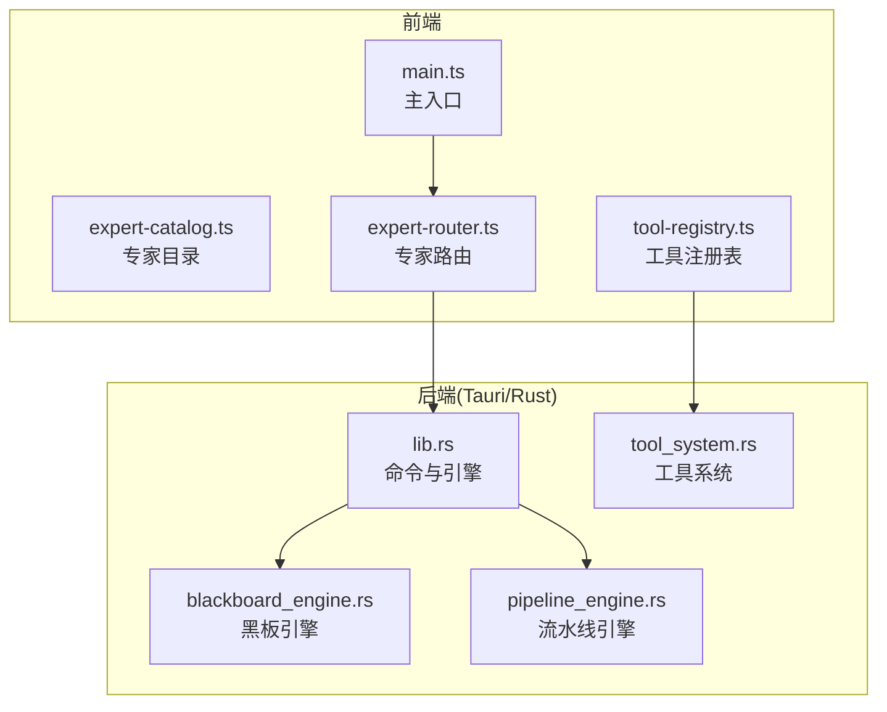
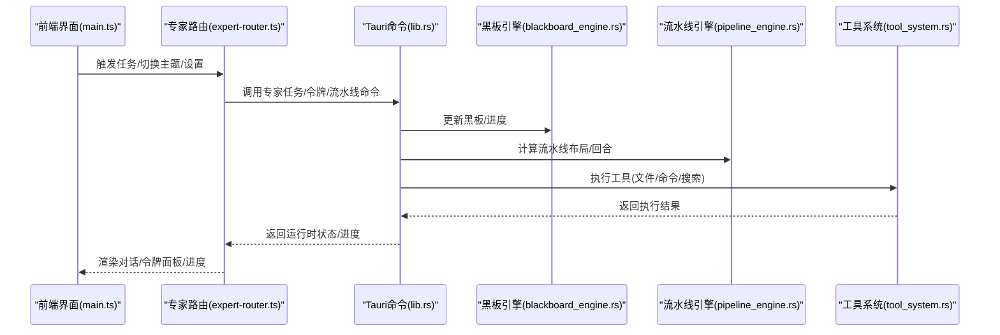
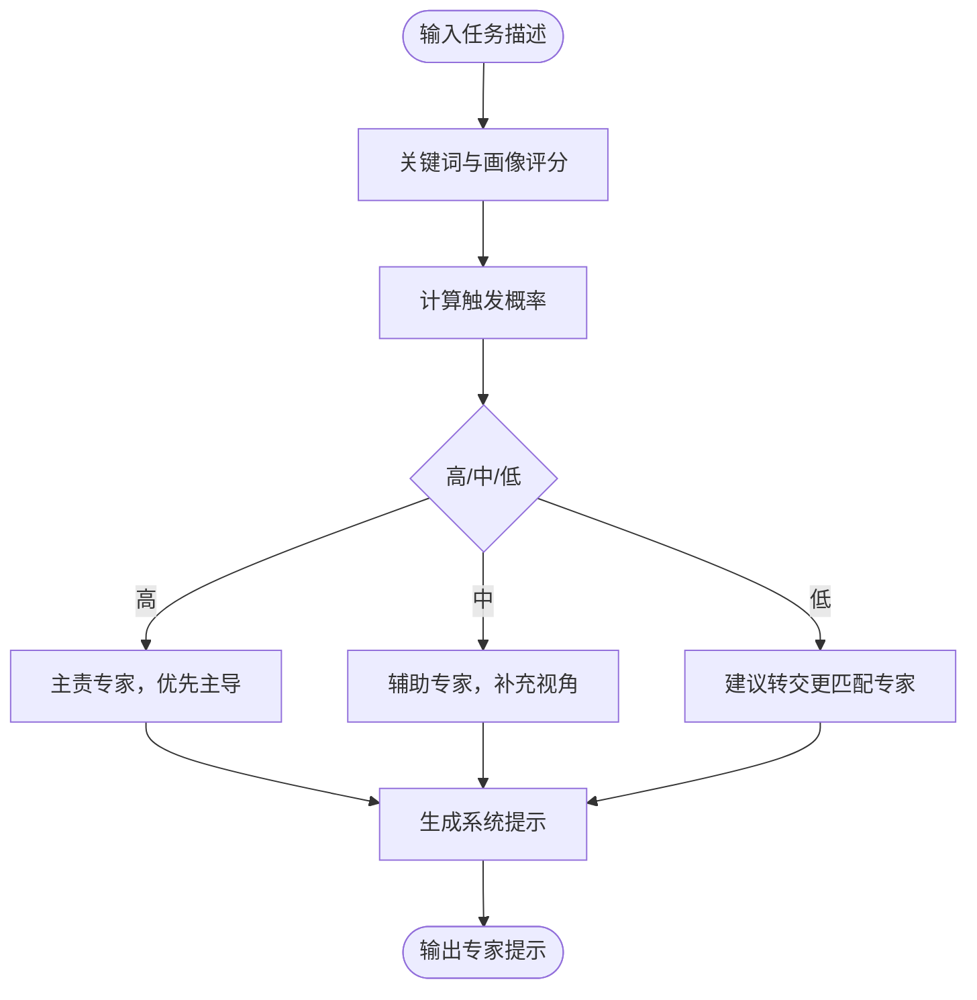
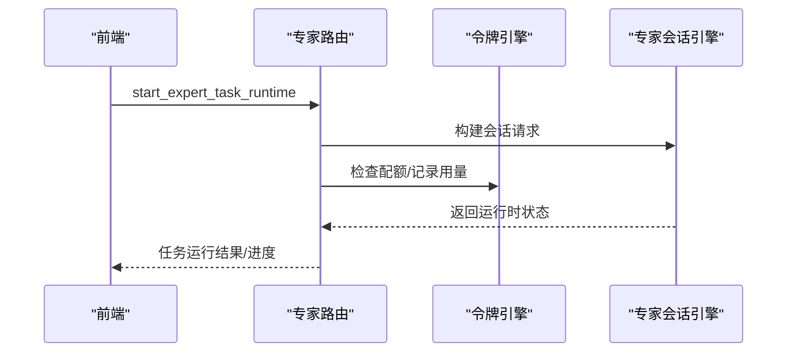
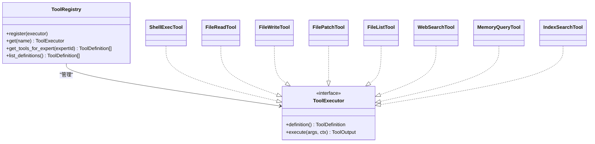
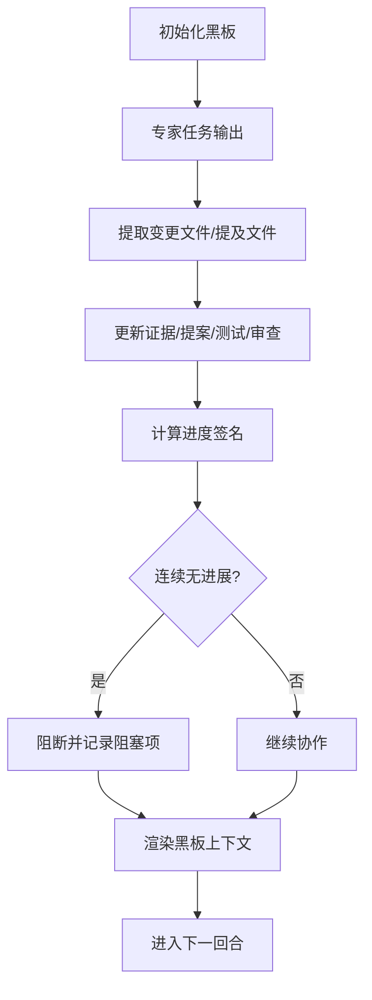
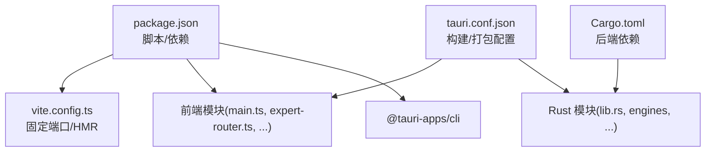

# 开发者指南

<cite>
**本文档引用的文件**
- [package.json](file://ai-experts/package.json)
- [vite.config.ts](file://ai-experts/vite.config.ts)
- [tsconfig.json](file://ai-experts/tsconfig.json)
- [main.ts](file://ai-experts/src/main.ts)
- [expert-catalog.ts](file://ai-experts/src/expert-catalog.ts)
- [expert-router.ts](file://ai-experts/src/expert-router.ts)
- [tool-registry.ts](file://ai-experts/src/tool-registry.ts)
- [Cargo.toml](file://ai-experts/src-tauri/Cargo.toml)
- [tauri.conf.json](file://ai-experts/src-tauri/tauri.conf.json)
- [main.rs](file://ai-experts/src-tauri/src/main.rs)
- [lib.rs](file://ai-experts/src-tauri/src/lib.rs)
- [blackboard_engine.rs](file://ai-experts/src-tauri/src/blackboard_engine.rs)
- [pipeline_engine.rs](file://ai-experts/src-tauri/src/pipeline_engine.rs)
- [tool_system.rs](file://ai-experts/src-tauri/src/tool_system.rs)
</cite>

## 目录
1. [简介](#简介)
2. [项目结构](#项目结构)
3. [核心组件](#核心组件)
4. [架构总览](#架构总览)
5. [详细组件分析](#详细组件分析)
6. [依赖分析](#依赖分析)
7. [性能考虑](#性能考虑)
8. [故障排除指南](#故障排除指南)
9. [结论](#结论)
10. [附录](#附录)

## 简介
本指南面向希望参与星图专家团工作台（社区版）开发的工程师，涵盖环境搭建、扩展开发、测试策略、代码规范、性能优化与故障排除等全流程内容。项目采用前端 TypeScript/Vite + Tauri（Rust）混合架构，提供专家系统、工具系统、流水线引擎与黑板协作机制，支持多模态专家协作与工程实现。

## 项目结构
- 前端（ai-experts）
  - 源码位于 src/，包含主入口、专家目录、专家路由、工具注册表、画布与侧边栏等模块
  - 构建配置位于 vite.config.ts、tsconfig.json
  - 包管理与脚本位于 package.json
- 后端（ai-experts/src-tauri）
  - Rust 应用入口与命令定义位于 src-tauri/src
  - 依赖声明与打包配置位于 Cargo.toml、tauri.conf.json
- 官网与营销素材
  - 官网资源位于 官网/，营销话术位于 营销话术/

**图表来源**
- [main.ts:1-8673](file://ai-experts/src/main.ts#L1-L8673)
- [expert-catalog.ts:1-657](file://ai-experts/src/expert-catalog.ts#L1-L657)
- [expert-router.ts:1-1633](file://ai-experts/src/expert-router.ts#L1-L1633)
- [tool-registry.ts:1-192](file://ai-experts/src/tool-registry.ts#L1-L192)
- [lib.rs:1-7190](file://ai-experts/src-tauri/src/lib.rs#L1-L7190)
- [blackboard_engine.rs:1-670](file://ai-experts/src-tauri/src/blackboard_engine.rs#L1-L670)
- [pipeline_engine.rs:1-600](file://ai-experts/src-tauri/src/pipeline_engine.rs#L1-L600)
- [tool_system.rs:1-841](file://ai-experts/src-tauri/src/tool_system.rs#L1-L841)

**章节来源**
- [package.json:1-28](file://ai-experts/package.json#L1-L28)
- [vite.config.ts:1-31](file://ai-experts/vite.config.ts#L1-L31)
- [tsconfig.json:1-24](file://ai-experts/tsconfig.json#L1-L24)
- [main.ts:1-8673](file://ai-experts/src/main.ts#L1-L8673)
- [Cargo.toml:1-46](file://ai-experts/src-tauri/Cargo.toml#L1-L46)
- [tauri.conf.json:1-38](file://ai-experts/src-tauri/tauri.conf.json#L1-L38)

## 核心组件
- 专家目录与系统提示
  - 定义专家类别、工具画像、系统角色与默认专家映射，构建专家系统提示与职责触发概率
- 专家路由与令牌配额
  - 负责专家任务运行时启动、继续执行、令牌用量记录与配额检查，以及流水线进度快照
- 工具注册表
  - 统一声明工具 Schema 与权限级别，按专家角色过滤可用工具，提供前端注入
- 黑板引擎
  - 维护共享工作区上下文、证据、文件变更提案、测试与审查决策，推进协作进度并阻断空转
- 流水线引擎
  - 根据场景（如代码开发、学科分析、技术调研）生成步骤布局与波次，描述执行叙事
- 工具系统
  - 抽象工具执行器与注册表，内置文件读写、补丁、命令执行、网络搜索、索引检索等工具

**章节来源**
- [expert-catalog.ts:1-657](file://ai-experts/src/expert-catalog.ts#L1-L657)
- [expert-router.ts:1-1633](file://ai-experts/src/expert-router.ts#L1-L1633)
- [tool-registry.ts:1-192](file://ai-experts/src/tool-registry.ts#L1-L192)
- [blackboard_engine.rs:1-670](file://ai-experts/src-tauri/src/blackboard_engine.rs#L1-L670)
- [pipeline_engine.rs:1-600](file://ai-experts/src-tauri/src/pipeline_engine.rs#L1-L600)
- [tool_system.rs:1-841](file://ai-experts/src-tauri/src/tool_system.rs#L1-L841)

## 架构总览
前端通过 Tauri API 调用后端命令，后端以 Rust 实现的引擎与工具系统为核心，完成专家任务调度、令牌配额管理、黑板协作与流水线推进。

**图表来源**
- [main.ts:1-8673](file://ai-experts/src/main.ts#L1-L8673)
- [expert-router.ts:1-1633](file://ai-experts/src/expert-router.ts#L1-L1633)
- [lib.rs:1-7190](file://ai-experts/src-tauri/src/lib.rs#L1-L7190)
- [blackboard_engine.rs:1-670](file://ai-experts/src-tauri/src/blackboard_engine.rs#L1-L670)
- [pipeline_engine.rs:1-600](file://ai-experts/src-tauri/src/pipeline_engine.rs#L1-L600)
- [tool_system.rs:1-841](file://ai-experts/src-tauri/src/tool_system.rs#L1-L841)

## 详细组件分析

### 专家目录与系统提示
- 专家分类与画像
  - 系统角色（主管/助手）、学科专家（自然科学、工程与技术、人文与社会科学等）
  - 工具画像（工程、分析、文档、创意、审查）与默认专家映射
- 系统提示构建
  - 基于专家知识库、方法论与任务场景生成系统提示，支持职责触发概率评估与激活建议
- 关键接口
  - 专家系统提示构建、职责触发评估、默认专家选择、工具映射

**图表来源**
- [expert-catalog.ts:396-442](file://ai-experts/src/expert-catalog.ts#L396-L442)

**章节来源**
- [expert-catalog.ts:1-657](file://ai-experts/src/expert-catalog.ts#L1-L657)

### 专家路由与令牌配额
- 任务运行时
  - 启动/继续专家任务，注入场景、任务描述、项目上下文与提示模块
  - 令牌用量记录与配额检查，支持项目级与用户级令牌数据持久化
- 流水线与进度
  - 计算流水线执行回合、跟进任务、进度快照与黑板推进
- 关键接口
  - 专家任务启动/继续、令牌快照、流水线回合结算、进度快照

**图表来源**
- [expert-router.ts:505-558](file://ai-experts/src/expert-router.ts#L505-L558)
- [lib.rs:733-800](file://ai-experts/src-tauri/src/lib.rs#L733-L800)

**章节来源**
- [expert-router.ts:1-1633](file://ai-experts/src/expert-router.ts#L1-L1633)
- [lib.rs:1-7190](file://ai-experts/src-tauri/src/lib.rs#L1-L7190)

### 工具注册表与工具系统
- 工具定义与权限
  - Shell 执行、文件读写、结构化补丁、文件列表、网络搜索、记忆查询、索引检索
  - 权限级别：自动、需要确认、拦截
- 注册与过滤
  - 按专家角色过滤可用工具，注入到 LLM 请求的 function calling 中
- 工具执行器抽象
  - 统一执行器接口，内置工具实现与错误处理

**图表来源**
- [tool-registry.ts:1-192](file://ai-experts/src/tool-registry.ts#L1-L192)
- [tool_system.rs:1-841](file://ai-experts/src-tauri/src/tool_system.rs#L1-L841)

**章节来源**
- [tool-registry.ts:1-192](file://ai-experts/src/tool-registry.ts#L1-L192)
- [tool_system.rs:1-841](file://ai-experts/src-tauri/src/tool_system.rs#L1-L841)

### 黑板引擎与协作推进
- 黑板状态
  - 工作区文件、证据、必检/候选文件、文件变更提案、测试与审查决策、阻塞项
- 进度推进
  - 基于签名检测无进展轮次，超过阈值自动阻断，避免空转
- 上下文渲染
  - 生成协作所需上下文，强调“基于证据”的协作原则

**图表来源**
- [blackboard_engine.rs:87-333](file://ai-experts/src-tauri/src/blackboard_engine.rs#L87-L333)

**章节来源**
- [blackboard_engine.rs:1-670](file://ai-experts/src-tauri/src/blackboard_engine.rs#L1-L670)

### 流水线引擎与场景布局
- 场景类型
  - 代码开发、代码审查、技术调研、学科分析、设计、快速问答、翻译、写作、办公、数据分析、文档处理、媒体创作、视频制作、带搜索的研究
- 步骤布局
  - 代码开发：调研→设计→实现→审查（可选设计）
  - 学科分析：主专家→辅助专家→审查
  - 技术调研/带搜索：主专家→辅助专家（可选）→审查
- 描述与叙事
  - 自动生成执行描述与剩余步骤说明

**图表来源**
- [pipeline_engine.rs:359-383](file://ai-experts/src-tauri/src/pipeline_engine.rs#L359-L383)

**章节来源**
- [pipeline_engine.rs:1-600](file://ai-experts/src-tauri/src/pipeline_engine.rs#L1-L600)

## 依赖分析
- 前端依赖
  - @tauri-apps/api、@tauri-apps/cli、Vite、TypeScript、highlight.js
- 后端依赖
  - Tauri、serde、reqwest、tokio、sqlx、regex、scraper、docx-rs、lopdf、calamine 等
- 构建与运行
  - Vite 固定端口 1420，Tauri 开发前置命令 npm run dev，构建后端静态库并打包

**图表来源**
- [package.json:1-28](file://ai-experts/package.json#L1-L28)
- [vite.config.ts:1-31](file://ai-experts/vite.config.ts#L1-L31)
- [Cargo.toml:1-46](file://ai-experts/src-tauri/Cargo.toml#L1-L46)
- [tauri.conf.json:1-38](file://ai-experts/src-tauri/tauri.conf.json#L1-L38)

**章节来源**
- [package.json:1-28](file://ai-experts/package.json#L1-L28)
- [vite.config.ts:1-31](file://ai-experts/vite.config.ts#L1-L31)
- [Cargo.toml:1-46](file://ai-experts/src-tauri/Cargo.toml#L1-L46)
- [tauri.conf.json:1-38](file://ai-experts/src-tauri/tauri.conf.json#L1-L38)

## 性能考虑
- 前端
  - 使用 Vite HMR 与固定端口提升开发体验；避免监听 src-tauri 目录以减少不必要的重建
  - TypeScript 严格模式与 noUnused 策略减少冗余代码
- 后端
  - 异步执行工具（Tokio），I/O 与网络请求使用异步接口
  - 令牌用量与流水线进度采用内存快照，避免频繁 IO
- 工具执行
  - Shell 执行与文件操作限制在项目目录范围内，防止越界访问
  - 补丁应用与文件列表支持最大深度与条目限制，避免大目录扫描开销

**章节来源**
- [vite.config.ts:1-31](file://ai-experts/vite.config.ts#L1-L31)
- [tsconfig.json:1-24](file://ai-experts/tsconfig.json#L1-L24)
- [tool_system.rs:1-841](file://ai-experts/src-tauri/src/tool_system.rs#L1-L841)

## 故障排除指南
- 开发环境问题
  - 端口占用：Vite 固定端口 1420，确保未被占用；若使用远程主机，配置 TAURI_DEV_HOST
  - HMR 失败：检查 host 配置与网络连通性
- Tauri 命令调用
  - 前端 invoke 失败：确认命令已在 lib.rs 中声明并实现；检查参数 JSON 序列化
  - 令牌配额阻断：检查配额检查返回原因，确认专家 ID 与豁免列表
- 工具执行
  - 路径越界：工具执行器会拒绝越界路径，检查相对路径与项目根目录
  - 命令执行失败：查看工具输出元数据中的退出码与截断标记
- 黑板协作
  - 无进展阻断：检查证据、文件变更、测试与审查是否持续推进
  - 文件缺失：遵循“动作先于落盘”的原则，审查专家需基于黑板动作评估

**章节来源**
- [vite.config.ts:1-31](file://ai-experts/vite.config.ts#L1-L31)
- [lib.rs:1-7190](file://ai-experts/src-tauri/src/lib.rs#L1-L7190)
- [tool_system.rs:1-841](file://ai-experts/src-tauri/src/tool_system.rs#L1-L841)
- [blackboard_engine.rs:1-670](file://ai-experts/src-tauri/src/blackboard_engine.rs#L1-L670)

## 结论
本指南提供了从环境搭建到扩展开发、测试策略与故障排除的完整路径。建议开发者先熟悉专家目录与系统提示、工具注册表与工具系统，再深入流水线与黑板协作机制，最后结合 Tauri 命令与 Rust 引擎实现自定义扩展。遵循本文的代码规范与性能建议，可有效提升开发效率与系统稳定性。

## 附录

### 开发环境搭建与运行
- 安装依赖
  - 前端：npm install
  - 后端：Rust 工具链（cargo）、Tauri CLI
- 启动开发
  - 前端：npm run dev
  - 后端：tauri dev（或通过 Vite 前置命令）
- 构建与打包
  - 前端：npm run build
  - 后端：tauri build（根据 tauri.conf.json 配置）

**章节来源**
- [package.json:1-28](file://ai-experts/package.json#L1-L28)
- [tauri.conf.json:1-38](file://ai-experts/src-tauri/tauri.conf.json#L1-L38)

### 扩展开发指南
- 新增专家
  - 在专家目录中添加条目，定义工具画像与关键词；生成系统提示与职责触发逻辑
- 新增工具
  - 在工具注册表中注册工具定义与权限；在工具系统中实现执行器；在前端注入工具定义
- 新增场景
  - 在流水线引擎中扩展场景布局与描述；在专家路由中接入场景参数
- 新增 Tauri 命令
  - 在 lib.rs 中声明命令；实现参数解析与返回结构；在前端通过 invoke 调用

**章节来源**
- [expert-catalog.ts:1-657](file://ai-experts/src/expert-catalog.ts#L1-L657)
- [tool-registry.ts:1-192](file://ai-experts/src/tool-registry.ts#L1-L192)
- [tool_system.rs:1-841](file://ai-experts/src-tauri/src/tool_system.rs#L1-L841)
- [pipeline_engine.rs:1-600](file://ai-experts/src-tauri/src/pipeline_engine.rs#L1-L600)
- [lib.rs:1-7190](file://ai-experts/src-tauri/src/lib.rs#L1-L7190)

### 测试策略
- 单元测试
  - 前端：利用 Vite 的测试能力与 TypeScript 严格模式
  - 后端：Rust 模块自带测试用例（如黑板引擎、流水线引擎）
- 集成测试
  - 通过 Tauri 命令调用与工具执行器组合，模拟真实场景
- E2E 测试
  - 使用 CLI 工具或脚本驱动前端交互，验证从任务输入到专家输出的完整流程

**章节来源**
- [blackboard_engine.rs:581-669](file://ai-experts/src-tauri/src/blackboard_engine.rs#L581-L669)
- [pipeline_engine.rs:438-599](file://ai-experts/src-tauri/src/pipeline_engine.rs#L438-L599)

### 代码规范与最佳实践
- 前端
  - TypeScript 严格模式、无未使用变量/参数、switch 无贯穿
  - 统一事件监听与清理，避免内存泄漏
- 后端
  - 异步优先、错误可重试；工具执行器返回统一结构
  - 参数校验与路径沙箱化，防止越界访问
- 命令与数据
  - JSON 参数与返回结构保持一致；令牌用量与进度快照及时持久化

**章节来源**
- [tsconfig.json:1-24](file://ai-experts/tsconfig.json#L1-L24)
- [tool_system.rs:1-841](file://ai-experts/src-tauri/src/tool_system.rs#L1-L841)
- [lib.rs:1-7190](file://ai-experts/src-tauri/src/lib.rs#L1-L7190)

### 调试技巧
- 前端
  - 使用浏览器开发者工具检查事件绑定与 DOM 变化；日志输出到控制台
- 后端
  - 在命令实现中打印关键参数与中间状态；利用测试用例验证边界条件
- 工具执行
  - 查看工具输出元数据中的退出码、耗时与截断标记

**章节来源**
- [main.ts:1-8673](file://ai-experts/src/main.ts#L1-L8673)
- [lib.rs:1-7190](file://ai-experts/src-tauri/src/lib.rs#L1-L7190)
- [tool_system.rs:1-841](file://ai-experts/src-tauri/src/tool_system.rs#L1-L841)

### 贡献流程与发布
- 贡献流程
  - Fork 仓库 → 创建分支 → 提交代码 → 发起 Pull Request → 代码审查 → 合并
- 代码审查标准
  - 功能正确性、性能与安全性、可维护性与文档
- 发布流程
  - 更新版本号 → 构建前端与后端 → 生成安装包 → 发布

**章节来源**
- [package.json:1-28](file://ai-experts/package.json#L1-L28)
- [tauri.conf.json:1-38](file://ai-experts/src-tauri/tauri.conf.json#L1-L38)