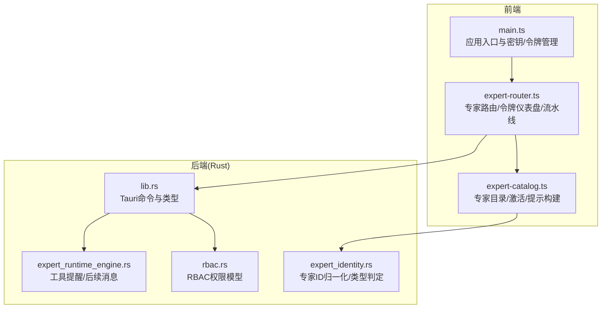
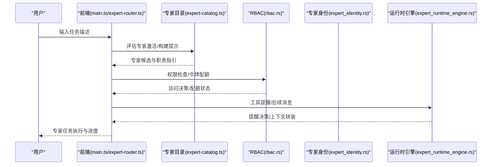
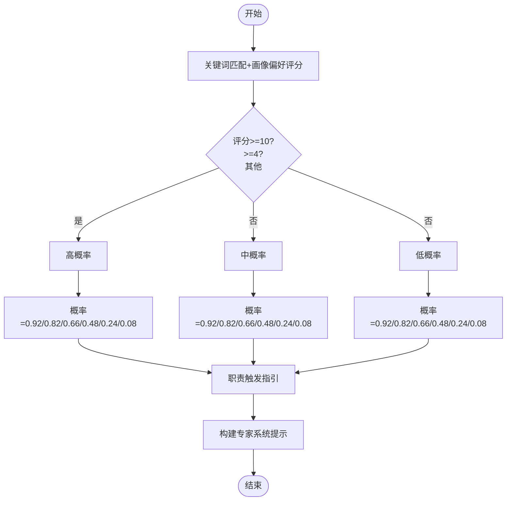
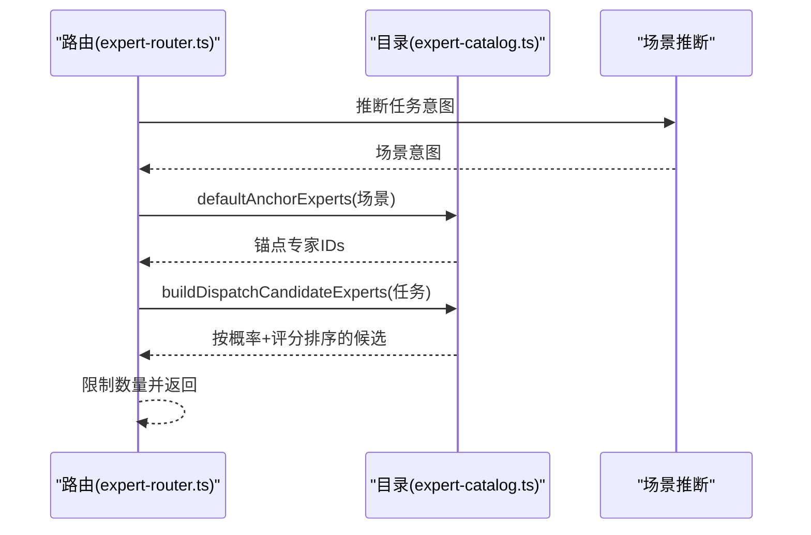
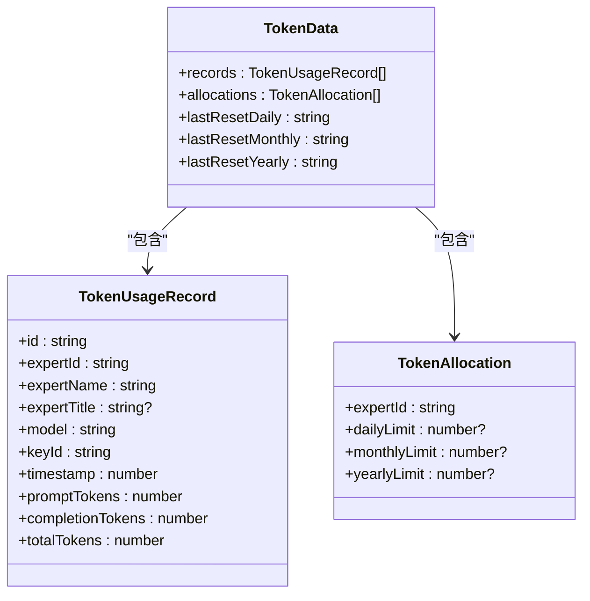
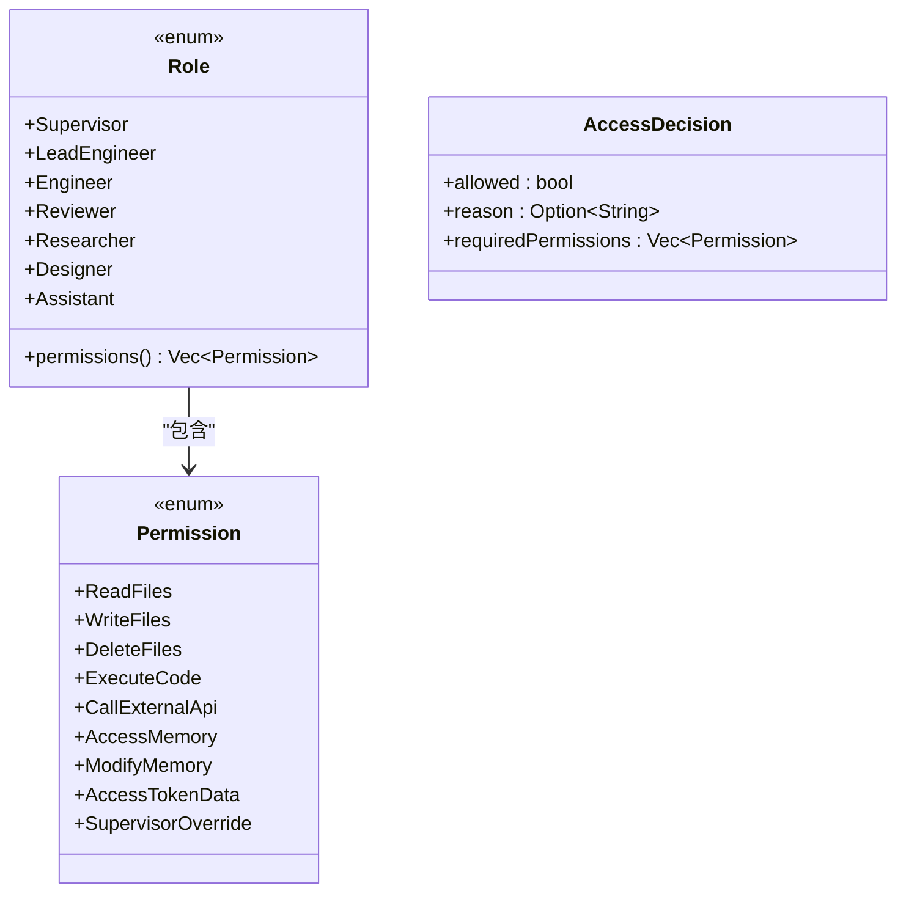
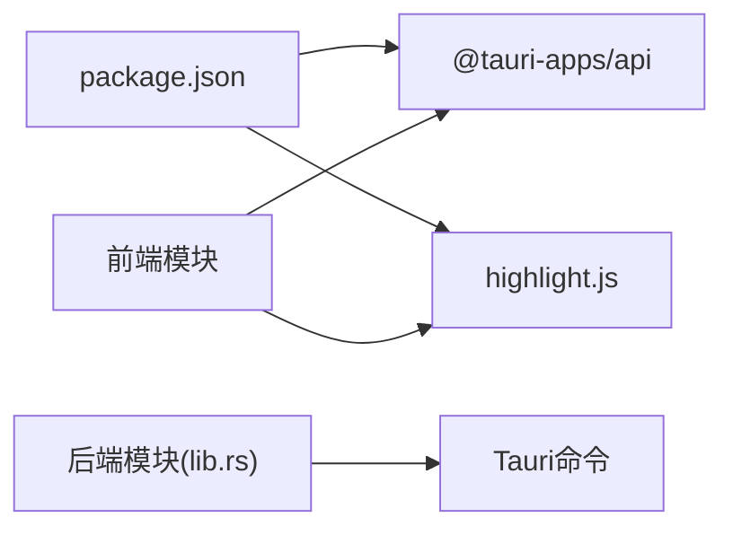

# 专家开发

<cite>
**本文档引用的文件**
- [expert-catalog.ts](file://ai-experts/src/expert-catalog.ts)
- [expert-router.ts](file://ai-experts/src/expert-router.ts)
- [expert_identity.rs](file://ai-experts/src-tauri/src/expert_identity.rs)
- [rbac.rs](file://ai-experts/src-tauri/src/rbac.rs)
- [expert_runtime_engine.rs](file://ai-experts/src-tauri/src/expert_runtime_engine.rs)
- [lib.rs](file://ai-experts/src-tauri/src/lib.rs)
- [main.ts](file://ai-experts/src/main.ts)
- [package.json](file://ai-experts/package.json)
</cite>

## 目录
1. [简介](#简介)
2. [项目结构](#项目结构)
3. [核心组件](#核心组件)
4. [架构总览](#架构总览)
5. [详细组件分析](#详细组件分析)
6. [依赖分析](#依赖分析)
7. [性能考量](#性能考量)
8. [故障排查指南](#故障排查指南)
9. [结论](#结论)
10. [附录](#附录)

## 简介
本指南面向希望在“星图专家团工作台”中开发与集成专家的工程师与架构师。文档聚焦以下目标：
- 专家类型定义与配置：技能矩阵、激活条件、权限设定
- 专家目录管理：分类体系、权重计算、选择算法
- 专家激活机制：概率计算、路由策略、动态调度
- 身份验证与RBAC权限模型：角色映射、权限继承、安全访问控制
- 开发最佳实践、常见问题与性能优化建议

## 项目结构
前端采用TypeScript/Vite，后端基于Tauri/Rust，核心专家能力由前端专家目录与路由模块驱动，后端提供权限控制、令牌配额、工具提醒与流水线执行等能力。

**图表来源**
- [main.ts:1-800](file://ai-experts/src/main.ts#L1-L800)
- [expert-router.ts:1-800](file://ai-experts/src/expert-router.ts#L1-L800)
- [expert-catalog.ts:1-657](file://ai-experts/src/expert-catalog.ts#L1-L657)
- [lib.rs:1-800](file://ai-experts/src-tauri/src/lib.rs#L1-L800)
- [rbac.rs:1-235](file://ai-experts/src-tauri/src/rbac.rs#L1-L235)
- [expert_identity.rs:1-64](file://ai-experts/src-tauri/src/expert_identity.rs#L1-L64)
- [expert_runtime_engine.rs:1-175](file://ai-experts/src-tauri/src/expert_runtime_engine.rs#L1-L175)

**章节来源**
- [package.json:1-28](file://ai-experts/package.json#L1-L28)
- [main.ts:1-800](file://ai-experts/src/main.ts#L1-L800)
- [expert-router.ts:1-800](file://ai-experts/src/expert-router.ts#L1-L800)
- [expert-catalog.ts:1-657](file://ai-experts/src/expert-catalog.ts#L1-L657)
- [lib.rs:1-800](file://ai-experts/src-tauri/src/lib.rs#L1-L800)
- [rbac.rs:1-235](file://ai-experts/src-tauri/src/rbac.rs#L1-L235)
- [expert_identity.rs:1-64](file://ai-experts/src-tauri/src/expert_identity.rs#L1-L64)
- [expert_runtime_engine.rs:1-175](file://ai-experts/src-tauri/src/expert_runtime_engine.rs#L1-L175)

## 核心组件
- 专家目录与激活
  - 专家条目、技能画像、系统角色、关键词与工具画像
  - 任务匹配评分与激活概率计算
  - 专家系统提示构建与职责触发指引
- 专家路由与调度
  - 令牌配额与豁免、令牌数据持久化与仪表盘
  - 专家注册表、活跃任务管理、流水线执行与回合结算
- 权限与身份
  - RBAC角色与权限集合
  - 专家ID归一化与类型判定
  - 路径访问控制与批量权限检查
- 运行时工具提醒
  - 基于回复意图的工具提醒决策
  - 工具执行上下文的后续消息拼装

**章节来源**
- [expert-catalog.ts:9-478](file://ai-experts/src/expert-catalog.ts#L9-L478)
- [expert-router.ts:1-800](file://ai-experts/src/expert-router.ts#L1-L800)
- [rbac.rs:1-235](file://ai-experts/src-tauri/src/rbac.rs#L1-L235)
- [expert_identity.rs:1-64](file://ai-experts/src-tauri/src/expert_identity.rs#L1-L64)
- [expert_runtime_engine.rs:1-175](file://ai-experts/src-tauri/src/expert_runtime_engine.rs#L1-L175)

## 架构总览
专家工作台采用前后端分离的架构：前端负责专家目录、提示构建、令牌与流水线交互；后端提供权限控制、令牌配额、工具提醒与Tauri命令桥接。

**图表来源**
- [main.ts:1-800](file://ai-experts/src/main.ts#L1-L800)
- [expert-router.ts:1-800](file://ai-experts/src/expert-router.ts#L1-L800)
- [expert-catalog.ts:396-442](file://ai-experts/src/expert-catalog.ts#L396-L442)
- [rbac.rs:106-172](file://ai-experts/src-tauri/src/rbac.rs#L106-L172)
- [expert_runtime_engine.rs:76-123](file://ai-experts/src-tauri/src/expert_runtime_engine.rs#L76-L123)

## 详细组件分析

### 专家类型定义与配置
- 专家条目与技能画像
  - 专家条目包含唯一ID、代码、名称、标题、描述、分类、关键词、工具画像与可选promptFocus
  - 系统角色标记用于特殊职责与权限豁免
- 技能矩阵
  - 工具画像：research/engineering/analysis/creative/documentation/review
  - 专属方法论与知识库：按工具画像生成
  - 专家特化概要：知识、方法论、关注焦点
- 配置要点
  - 分类体系：categoryId/categoryLabel构成学科/职能分类
  - 关键词：用于任务匹配评分
  - promptFocus：高频关注点，增强提示聚焦

**章节来源**
- [expert-catalog.ts:9-41](file://ai-experts/src/expert-catalog.ts#L9-L41)
- [expert-catalog.ts:165-228](file://ai-experts/src/expert-catalog.ts#L165-L228)
- [expert-catalog.ts:230-381](file://ai-experts/src/expert-catalog.ts#L230-L381)

### 专家激活机制与概率计算
- 评分与激活等级
  - 基于关键词匹配与工具画像偏好进行加权评分
  - 激活概率由评分阶梯映射，形成高/中/低概率
- 职责触发指引
  - 根据概率与评分输出“主责/辅助/不主动”等职责建议
- 专家系统提示
  - 组合知识库、方法论与职责指引，形成任务域内的专家提示

**图表来源**
- [expert-catalog.ts:396-442](file://ai-experts/src/expert-catalog.ts#L396-L442)
- [expert-catalog.ts:383-408](file://ai-experts/src/expert-catalog.ts#L383-L408)

**章节来源**
- [expert-catalog.ts:396-442](file://ai-experts/src/expert-catalog.ts#L396-L442)
- [expert-catalog.ts:496-527](file://ai-experts/src/expert-catalog.ts#L496-L527)

### 专家目录管理与选择算法
- 默认专家与锚点
  - 场景默认专家：针对不同场景预置锚点专家
  - 锚点专家：根据任务意图推导初始候选
- 候选选择
  - 对学科专家按激活概率与评分排序
  - 优先加入锚点专家，再加入高概率专家，限制总数
- 专家工具映射
  - 为系统专家与学科专家分配通用工具集

**图表来源**
- [expert-catalog.ts:529-644](file://ai-experts/src/expert-catalog.ts#L529-L644)
- [expert-catalog.ts:540-567](file://ai-experts/src/expert-catalog.ts#L540-L567)
- [expert-catalog.ts:612-644](file://ai-experts/src/expert-catalog.ts#L612-L644)

**章节来源**
- [expert-catalog.ts:137-152](file://ai-experts/src/expert-catalog.ts#L137-L152)
- [expert-catalog.ts:529-644](file://ai-experts/src/expert-catalog.ts#L529-L644)

### 专家路由策略与动态调度
- 令牌配额与豁免
  - 项目级与用户级令牌数据结构与持久化
  - 豁免专家ID集合，主管专家令牌校验独立处理
- 令牌仪表盘
  - 支持按时间范围聚合使用情况与专家分布
- 专家注册表与活跃任务
  - 注册学科专家系统提示
  - 活跃任务管理、流水线进度快照与回合执行

**图表来源**
- [main.ts:102-128](file://ai-experts/src/main.ts#L102-L128)

**章节来源**
- [expert-router.ts:26-82](file://ai-experts/src/expert-router.ts#L26-L82)
- [expert-router.ts:122-158](file://ai-experts/src/expert-router.ts#L122-L158)
- [expert-router.ts:646-669](file://ai-experts/src/expert-router.ts#L646-L669)

### 身份验证与RBAC权限模型
- 角色与权限
  - 角色：Supervisor、LeadEngineer、Engineer、Reviewer、Researcher、Designer、Assistant
  - 权限：文件读写、执行代码、调用外部API、内存读写等
- 角色映射
  - 基于专家ID与特化类型映射到默认角色
  - 主管专家拥有全部权限与覆盖能力
- 路径访问控制
  - 对敏感路径进行白名单/黑名单判定，主管可例外
- 权限检查
  - 单项与批量权限检查，返回所需权限集合与原因

**图表来源**
- [rbac.rs:12-74](file://ai-experts/src-tauri/src/rbac.rs#L12-L74)

**章节来源**
- [rbac.rs:25-102](file://ai-experts/src-tauri/src/rbac.rs#L25-L102)
- [rbac.rs:129-172](file://ai-experts/src-tauri/src/rbac.rs#L129-L172)

### 专家ID归一化与类型判定
- 归一化
  - 将历史ID映射到标准学科ID，确保权限与角色一致
- 类型判定
  - 实现专家、审查专家、创意专家、文档专家、源码读写专家等类型判断
  - 支持源码读取/重写的专家支持集合

**章节来源**
- [expert_identity.rs:3-22](file://ai-experts/src-tauri/src/expert_identity.rs#L3-L22)
- [expert_identity.rs:46-63](file://ai-experts/src-tauri/src/expert_identity.rs#L46-L63)

### 运行时工具提醒与后续消息
- 工具提醒
  - 基于回复文本检测是否仅提出搜索/命令/视频工作流而未发起动作
  - 返回是否需要重试与提醒目标
- 后续消息
  - 将工具执行上下文拼装为后续消息，避免重复请求

**章节来源**
- [expert_runtime_engine.rs:76-123](file://ai-experts/src-tauri/src/expert_runtime_engine.rs#L76-L123)

## 依赖分析
- 前端依赖
  - @tauri-apps/api：与后端Tauri命令交互
  - highlight.js：代码高亮
- 后端依赖
  - Tauri命令桥接、SQLX、正则、序列化等

**图表来源**
- [package.json:15-26](file://ai-experts/package.json#L15-L26)
- [lib.rs:1-52](file://ai-experts/src-tauri/src/lib.rs#L1-L52)

**章节来源**
- [package.json:15-26](file://ai-experts/package.json#L15-L26)
- [lib.rs:1-52](file://ai-experts/src-tauri/src/lib.rs#L1-L52)

## 性能考量
- 专家候选排序与限制
  - 通过概率与评分排序，限制候选数量，避免过度并行
- 令牌配额与持久化
  - 使用异步持久化与批量保存，减少I/O阻塞
- 工具提醒
  - 仅在未发起动作时触发重试，避免无效轮询

[本节为通用指导，无需特定文件引用]

## 故障排查指南
- 令牌配额阻断
  - 前端显示系统消息，检查项目/用户令牌数据与限额
- 权限不足
  - 检查专家角色与所需权限集合，确认路径是否敏感
- 工具执行异常
  - 查看工具事件与命令授权状态，确认是否需要用户批准

**章节来源**
- [expert-router.ts:84-104](file://ai-experts/src/expert-router.ts#L84-L104)
- [rbac.rs:106-127](file://ai-experts/src-tauri/src/rbac.rs#L106-L127)
- [expert_runtime_engine.rs:76-114](file://ai-experts/src-tauri/src/expert_runtime_engine.rs#L76-L114)

## 结论
本指南提供了专家开发的全栈视图：从前端专家目录与提示构建，到后端RBAC与令牌配额、工具提醒与流水线执行。遵循本文档的配置与开发实践，可高效构建可扩展、可审计、可调度的专家体系。

[本节为总结，无需特定文件引用]

## 附录

### 专家开发最佳实践
- 明确工具画像与关键词：确保任务匹配评分合理
- 合理设置promptFocus：提升专家在特定领域的专注度
- 使用场景锚点：为高频场景预置锚点专家，提高首波响应质量
- 权限最小化：严格按角色授予权限，敏感路径仅主管可访问
- 令牌限额与监控：定期检查令牌仪表盘，避免超限

[本节为通用指导，无需特定文件引用]

### 常见问题与解决方案
- 专家未被激活
  - 检查任务描述关键词与专家工具画像是否匹配
  - 调整promptFocus以增强相关性
- 权限被拒绝
  - 确认专家ID是否已归一化至标准ID
  - 核对角色映射与所需权限集合
- 工具请求未执行
  - 确认回复是否仅为建议而未发起动作
  - 检查工具事件与授权状态

[本节为通用指导，无需特定文件引用]