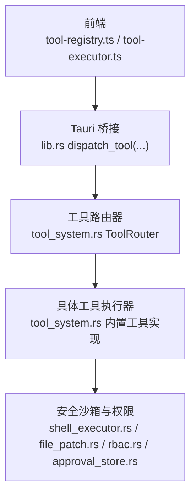
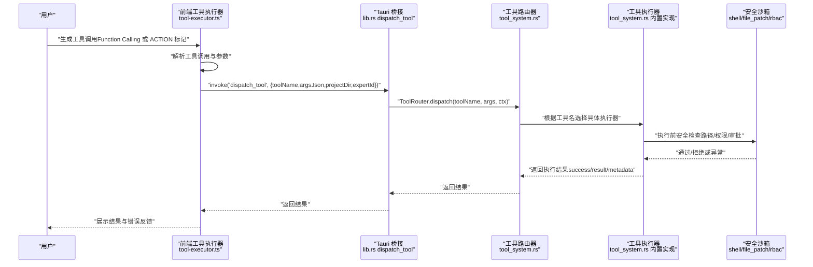
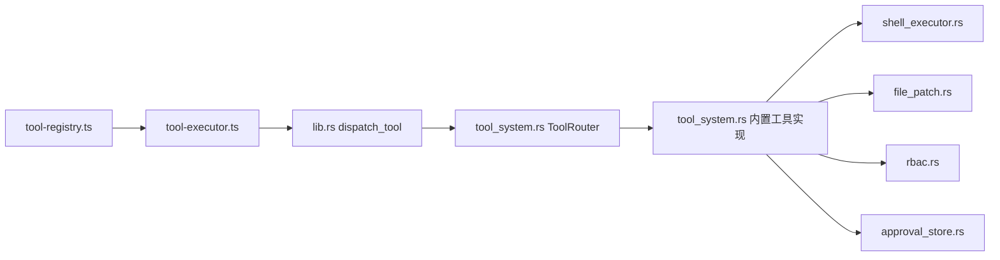
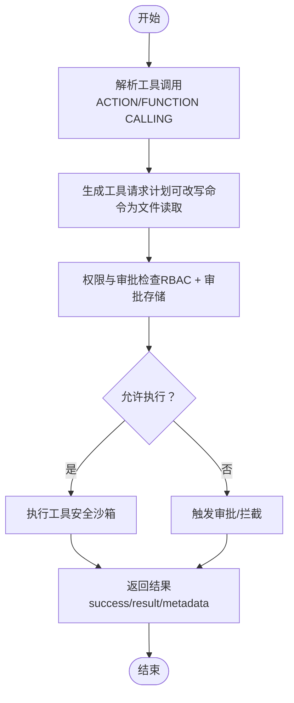

# 工具开发

<cite>
**本文档引用的文件**
- [tool-registry.ts](file://ai-experts/src/tool-registry.ts)
- [tool-executor.ts](file://ai-experts/src/tool-executor.ts)
- [tool_system.rs](file://ai-experts/src-tauri/src/tool_system.rs)
- [expert_tool_engine.rs](file://ai-experts/src-tauri/src/expert_tool_engine.rs)
- [approval_store.rs](file://ai-experts/src-tauri/src/approval_store.rs)
- [rbac.rs](file://ai-experts/src-tauri/src/rbac.rs)
- [shell_executor.rs](file://ai-experts/src-tauri/src/shell_executor.rs)
- [file_patch.rs](file://ai-experts/src-tauri/src/file_patch.rs)
- [lib.rs](file://ai-experts/src-tauri/src/lib.rs)
- [package.json](file://ai-experts/package.json)
</cite>

## 目录
1. [简介](#简介)
2. [项目结构](#项目结构)
3. [核心组件](#核心组件)
4. [架构总览](#架构总览)
5. [详细组件分析](#详细组件分析)
6. [依赖关系分析](#依赖关系分析)
7. [性能考虑](#性能考虑)
8. [故障排查指南](#故障排查指南)
9. [结论](#结论)
10. [附录](#附录)

## 简介
本指南面向“星图专家团工作台”的工具开发者，系统讲解如何在该工作台中开发、注册与执行工具。内容覆盖：
- 工具注册表的配置方法：Schema 设计、参数规范、权限控制
- 工具执行器的开发流程：生命周期、执行接口、错误处理
- 工具请求解析与计划生成：ACTION 标记解析、参数提取、工具重写规则
- 工具权限管理系统：审批流程、权限继承、安全执行控制
- 测试方法、调试技巧与性能优化建议

## 项目结构
工作台采用前后端分离的架构：
- 前端负责工具定义与调用解析（OpenAI Function Calling 与 ACTION 标记），并通过 Tauri 桥接到后端
- 后端提供工具注册表、执行器、权限控制与安全沙箱

图表来源
- [tool-registry.ts:1-192](file://ai-experts/src/tool-registry.ts#L1-L192)
- [tool-executor.ts:1-231](file://ai-experts/src/tool-executor.ts#L1-L231)
- [lib.rs:6289-6320](file://ai-experts/src-tauri/src/lib.rs#L6289-L6320)
- [tool_system.rs:97-142](file://ai-experts/src-tauri/src/tool_system.rs#L97-L142)

章节来源
- [tool-registry.ts:1-192](file://ai-experts/src/tool-registry.ts#L1-L192)
- [tool-executor.ts:1-231](file://ai-experts/src/tool-executor.ts#L1-L231)
- [lib.rs:6289-6320](file://ai-experts/src-tauri/src/lib.rs#L6289-L6320)
- [tool_system.rs:97-142](file://ai-experts/src-tauri/src/tool_system.rs#L97-L142)

## 核心组件
- 工具注册表（前端）：定义工具 Schema、描述、参数与权限级别，并按专家角色过滤可用工具
- 工具执行器（前端）：统一入口执行工具调用，处理审批流程与错误反馈，支持 ACTION 标记解析
- 工具系统（后端）：提供工具注册表、路由器与具体工具实现，内置多种工具并提供 JSON Schema
- 权限与审批（后端）：RBAC 角色权限、命令审批缓存、危险命令检测
- 安全沙箱（后端）：命令执行与补丁应用的安全边界与路径校验

章节来源
- [tool-registry.ts:1-192](file://ai-experts/src/tool-registry.ts#L1-L192)
- [tool-executor.ts:1-231](file://ai-experts/src/tool-executor.ts#L1-L231)
- [tool_system.rs:62-142](file://ai-experts/src-tauri/src/tool_system.rs#L62-L142)
- [rbac.rs:1-235](file://ai-experts/src-tauri/src/rbac.rs#L1-L235)
- [approval_store.rs:1-123](file://ai-experts/src-tauri/src/approval_store.rs#L1-L123)
- [shell_executor.rs:498-633](file://ai-experts/src-tauri/src/shell_executor.rs#L498-L633)
- [file_patch.rs:665-800](file://ai-experts/src-tauri/src/file_patch.rs#L665-L800)

## 架构总览
工具从“请求解析”到“执行与反馈”的完整链路如下：

图表来源
- [tool-executor.ts:24-53](file://ai-experts/src/tool-executor.ts#L24-L53)
- [lib.rs:6289-6320](file://ai-experts/src-tauri/src/lib.rs#L6289-L6320)
- [tool_system.rs:123-137](file://ai-experts/src-tauri/src/tool_system.rs#L123-L137)
- [shell_executor.rs:498-633](file://ai-experts/src-tauri/src/shell_executor.rs#L498-L633)
- [file_patch.rs:665-800](file://ai-experts/src-tauri/src/file_patch.rs#L665-L800)

## 详细组件分析

### 工具注册表（前端）
- 职责：定义工具 Schema（JSON Schema）、描述、参数与权限级别；按专家角色过滤可用工具
- 关键点：
  - 工具 Schema 使用 JSON Schema 的 properties/required 字段
  - 权限级别：auto（自动）、confirm（需要确认）、block（拦截）
  - 专家角色映射：通过专家 ID 获取可用工具集合

章节来源
- [tool-registry.ts:6-182](file://ai-experts/src/tool-registry.ts#L6-L182)

### 工具执行器（前端）
- 职责：统一入口执行工具调用；处理审批流程；解析 ACTION 标记与 Function Calling
- 关键点：
  - 统一调用后端 dispatch_tool，传入 toolName、argsJson、projectDir、expertId
  - 对 file_patch 的失败结果进行结构化错误反馈，便于模型自我修正
  - 支持两种调用格式：tool_calls（Function Calling）与 ACTION 标记（兼容）

章节来源
- [tool-executor.ts:13-53](file://ai-experts/src/tool-executor.ts#L13-L53)
- [tool-executor.ts:148-222](file://ai-experts/src/tool-executor.ts#L148-L222)

### 工具请求解析与计划生成（后端）
- 职责：从模型回复中提取工具请求，生成工具请求计划；必要时将命令改写为文件读取
- 关键点：
  - ACTION 标记解析：WEB_SEARCH、EXECUTE_CMD、READ_FILE、LIST_FILES 等
  - 参数解析：键值对解析、转义解码、路径标准化
  - 工具重写：将源码探测命令改写为 READ_FILE，提升准确性与安全性
  - 计划输出：requests 列表 + 去除 ACTION 标记的回复文本

章节来源
- [expert_tool_engine.rs:288-404](file://ai-experts/src-tauri/src/expert_tool_engine.rs#L288-L404)
- [expert_tool_engine.rs:406-453](file://ai-experts/src-tauri/src/expert_tool_engine.rs#L406-L453)
- [expert_tool_engine.rs:455-480](file://ai-experts/src-tauri/src/expert_tool_engine.rs#L455-L480)

### 工具系统（后端）：注册表、路由器与执行器
- 职责：提供工具注册表、路由器与具体工具实现
- 关键点：
  - 工具定义：名称、描述、JSON Schema、所需权限级别
  - 工具上下文：工作目录、项目目录、专家 ID、会话 ID
  - 工具执行器 Trait：definition()/execute() 接口
  - 内置工具：shell_exec、file_read、file_write、file_patch、file_list、web_search、memory_query、index_search

章节来源
- [tool_system.rs:17-60](file://ai-experts/src-tauri/src/tool_system.rs#L17-L60)
- [tool_system.rs:62-95](file://ai-experts/src-tauri/src/tool_system.rs#L62-L95)
- [tool_system.rs:97-142](file://ai-experts/src-tauri/src/tool_system.rs#L97-L142)
- [tool_system.rs:144-800](file://ai-experts/src-tauri/src/tool_system.rs#L144-L800)

### 权限与审批系统（RBAC 与审批存储）
- RBAC 角色权限：基于专家 ID 的角色映射，提供权限集合
- 审批存储：命令审批模式匹配与缓存，支持自动放行、需要确认、拦截
- 危险命令检测：内置危险模式与管理员命令前缀检测

章节来源
- [rbac.rs:10-127](file://ai-experts/src-tauri/src/rbac.rs#L10-L127)
- [approval_store.rs:66-96](file://ai-experts/src-tauri/src/approval_store.rs#L66-L96)
- [shell_executor.rs:476-495](file://ai-experts/src-tauri/src/shell_executor.rs#L476-L495)

### 安全沙箱与执行引擎
- 命令执行：跨平台执行、超时控制、输出截断、工作目录沙箱
- 补丁应用：结构化补丁解析与应用，路径安全检查、四级容错匹配、Delta 跟踪

章节来源
- [shell_executor.rs:498-633](file://ai-experts/src-tauri/src/shell_executor.rs#L498-L633)
- [file_patch.rs:151-289](file://ai-experts/src-tauri/src/file_patch.rs#L151-L289)
- [file_patch.rs:665-800](file://ai-experts/src-tauri/src/file_patch.rs#L665-L800)

### Tauri 桥接与调用流程
- 前端通过 invoke('dispatch_tool', ...) 调用后端
- 后端 ToolRouter 根据工具名分发到对应执行器
- 执行器完成安全检查与执行，返回结果

章节来源
- [tool-executor.ts:24-53](file://ai-experts/src/tool-executor.ts#L24-L53)
- [lib.rs:6289-6320](file://ai-experts/src-tauri/src/lib.rs#L6289-L6320)
- [tool_system.rs:123-137](file://ai-experts/src-tauri/src/tool_system.rs#L123-L137)

## 依赖关系分析

图表来源
- [tool-registry.ts:1-192](file://ai-experts/src/tool-registry.ts#L1-L192)
- [tool-executor.ts:1-231](file://ai-experts/src/tool-executor.ts#L1-L231)
- [lib.rs:6289-6320](file://ai-experts/src-tauri/src/lib.rs#L6289-L6320)
- [tool_system.rs:97-142](file://ai-experts/src-tauri/src/tool_system.rs#L97-L142)
- [shell_executor.rs:498-633](file://ai-experts/src-tauri/src/shell_executor.rs#L498-L633)
- [file_patch.rs:665-800](file://ai-experts/src-tauri/src/file_patch.rs#L665-L800)
- [rbac.rs:1-235](file://ai-experts/src-tauri/src/rbac.rs#L1-L235)
- [approval_store.rs:1-123](file://ai-experts/src-tauri/src/approval_store.rs#L1-L123)

章节来源
- [tool-registry.ts:1-192](file://ai-experts/src/tool-registry.ts#L1-L192)
- [tool-executor.ts:1-231](file://ai-experts/src/tool-executor.ts#L1-L231)
- [lib.rs:6289-6320](file://ai-experts/src-tauri/src/lib.rs#L6289-L6320)
- [tool_system.rs:97-142](file://ai-experts/src-tauri/src/tool_system.rs#L97-L142)
- [shell_executor.rs:498-633](file://ai-experts/src-tauri/src/shell_executor.rs#L498-L633)
- [file_patch.rs:665-800](file://ai-experts/src-tauri/src/file_patch.rs#L665-L800)
- [rbac.rs:1-235](file://ai-experts/src-tauri/src/rbac.rs#L1-L235)
- [approval_store.rs:1-123](file://ai-experts/src-tauri/src/approval_store.rs#L1-L123)

## 性能考虑
- 输出截断与行数限制：命令执行与补丁应用均设置最大输出字节数与行数，避免内存与渲染压力
- 超时控制：命令执行具备超时时间，超时可选择强制终止进程
- 并发读取：异步并发读取 stdout/stderr，提高吞吐
- 路径与权限检查前置：在执行前完成路径合法性与权限校验，减少无效执行
- 建议：
  - 为大文件读取与补丁应用设置合理的 max_output_bytes 与 max_output_lines
  - 对高风险命令启用审批与拦截策略
  - 使用工作目录沙箱，避免越权访问

章节来源
- [shell_executor.rs:336-358](file://ai-experts/src-tauri/src/shell_executor.rs#L336-L358)
- [shell_executor.rs:498-633](file://ai-experts/src-tauri/src/shell_executor.rs#L498-L633)
- [file_patch.rs:665-800](file://ai-experts/src-tauri/src/file_patch.rs#L665-L800)

## 故障排查指南
- 常见错误类型：
  - 参数缺失：缺少必填参数（如 command/path/query 等）
  - 路径越权：路径超出项目目录或包含 .. 等危险路径
  - 命令危险：匹配危险模式或需要管理员权限
  - 补丁失败：上下文不匹配、目标文件不存在、符号链接等
- 前端错误处理：
  - 对 file_patch 的失败结果进行结构化反馈，包含错误、文件、行列、已应用文件等
  - 捕获 invoke 异常并转换为统一错误格式
- 后端错误处理：
  - 工具执行器返回 ToolError（code/message/retryable）
  - 审批检查返回 Auto/NeedsConfirmation/Blocked
  - 路径与权限检查返回 AccessDecision（allowed/reason/required_permissions）

章节来源
- [tool_system.rs:43-60](file://ai-experts/src-tauri/src/tool_system.rs#L43-L60)
- [tool_system.rs:178-222](file://ai-experts/src-tauri/src/tool_system.rs#L178-L222)
- [tool_system.rs:257-312](file://ai-experts/src-tauri/src/tool_system.rs#L257-L312)
- [tool_system.rs:459-506](file://ai-experts/src-tauri/src/tool_system.rs#L459-L506)
- [tool_system.rs:653-686](file://ai-experts/src-tauri/src/tool_system.rs#L653-L686)
- [tool_system.rs:772-798](file://ai-experts/src-tauri/src/tool_system.rs#L772-L798)
- [tool-executor.ts:39-53](file://ai-experts/src/tool-executor.ts#L39-L53)
- [tool-executor.ts:59-104](file://ai-experts/src/tool-executor.ts#L59-L104)
- [approval_store.rs:66-96](file://ai-experts/src-tauri/src/approval_store.rs#L66-L96)
- [rbac.rs:106-127](file://ai-experts/src-tauri/src/rbac.rs#L106-L127)

## 结论
本指南提供了从工具定义、注册、执行到权限与安全控制的完整开发路径。开发者可基于工具系统提供的抽象与内置工具，快速扩展新的工具能力，并通过审批与沙箱机制确保安全可控。

## 附录

### 工具开发步骤清单
- 定义工具 Schema：在前端注册表中添加工具定义（名称、描述、参数、权限）
- 实现执行器：在后端实现 ToolExecutor Trait，定义 execute(args, ctx) 与 definition()
- 注册工具：在 ToolRouter.with_builtin_tools 中注册新工具
- 安全与权限：在执行前进行路径校验、权限检查与审批判断
- 前端调用：通过 ToolExecutor.execute 发起调用，解析 ACTION 标记或 Function Calling
- 测试与调试：利用单元测试与日志输出定位问题，关注超时、截断与错误反馈

章节来源
- [tool-registry.ts:143-182](file://ai-experts/src/tool-registry.ts#L143-L182)
- [tool_system.rs:109-121](file://ai-experts/src-tauri/src/tool_system.rs#L109-L121)
- [tool_system.rs:52-60](file://ai-experts/src-tauri/src/tool_system.rs#L52-L60)
- [tool-executor.ts:24-53](file://ai-experts/src/tool-executor.ts#L24-L53)

### 工具权限与审批流程（流程图）

图表来源
- [expert_tool_engine.rs:455-480](file://ai-experts/src-tauri/src/expert_tool_engine.rs#L455-L480)
- [rbac.rs:106-127](file://ai-experts/src-tauri/src/rbac.rs#L106-L127)
- [approval_store.rs:66-96](file://ai-experts/src-tauri/src/approval_store.rs#L66-L96)
- [tool_system.rs:123-137](file://ai-experts/src-tauri/src/tool_system.rs#L123-L137)