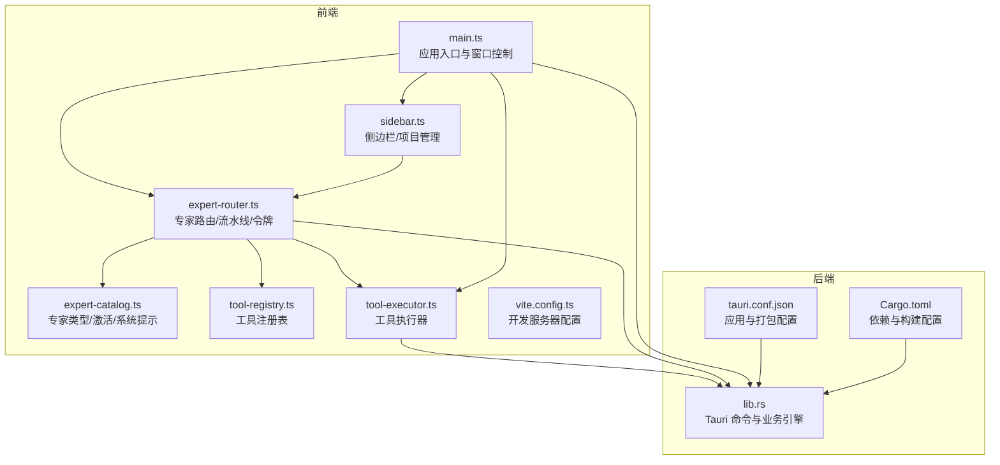
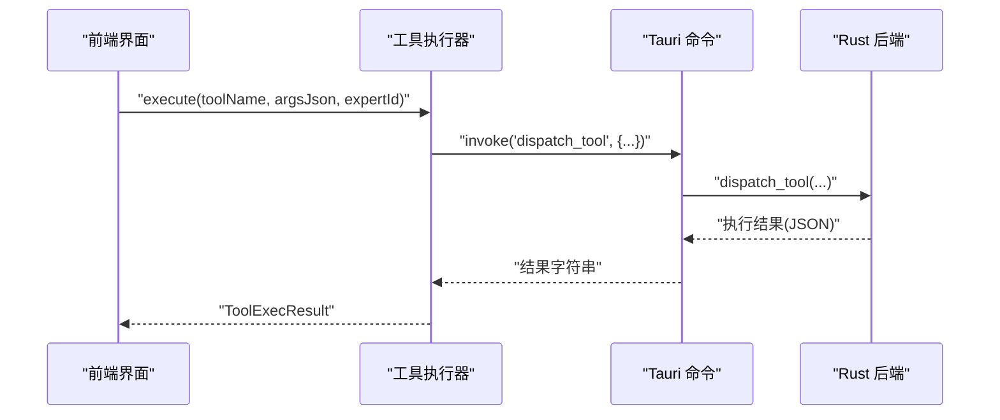
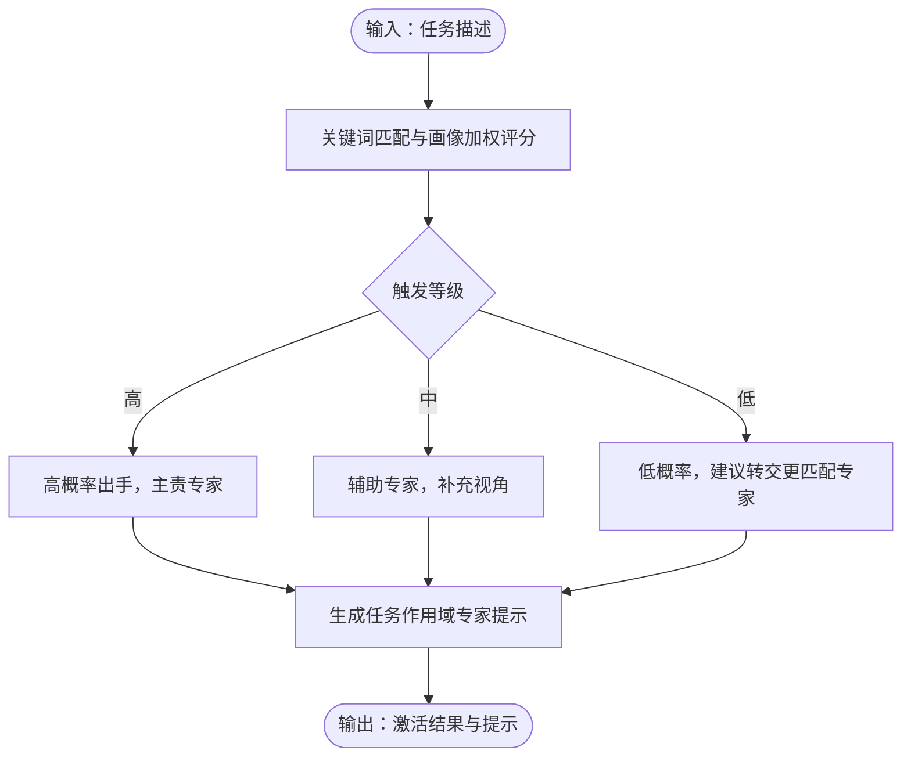
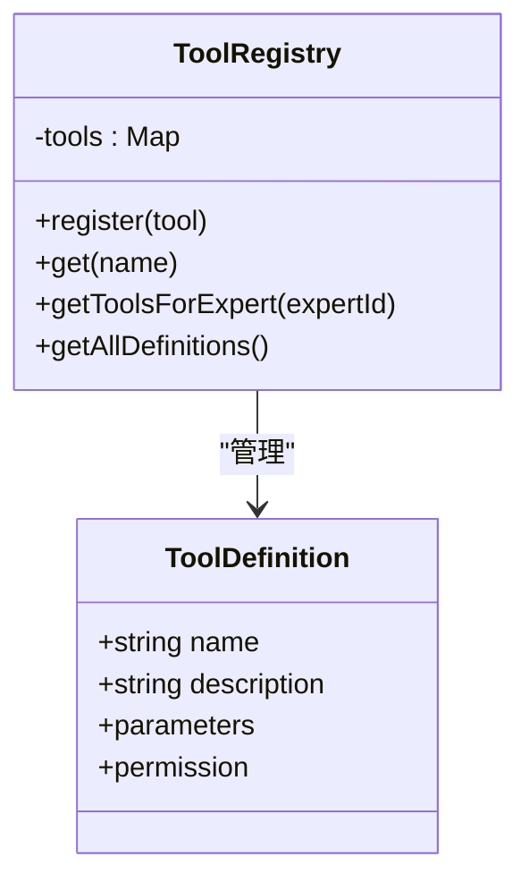
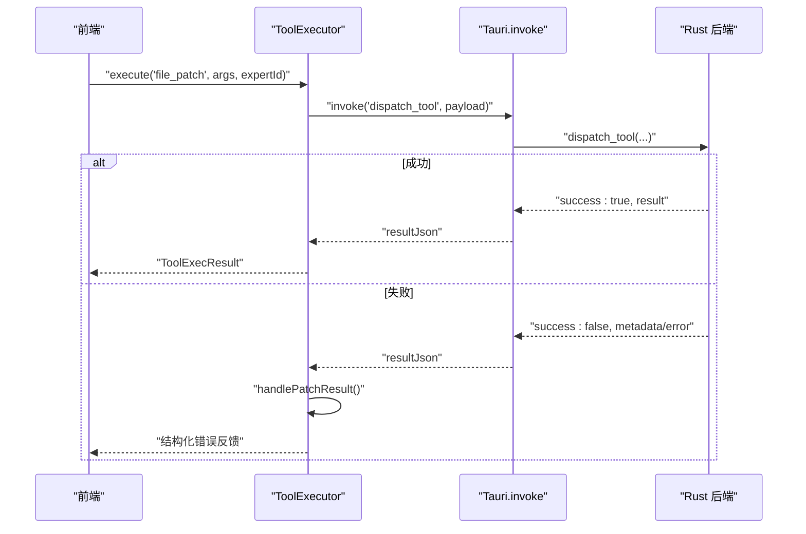
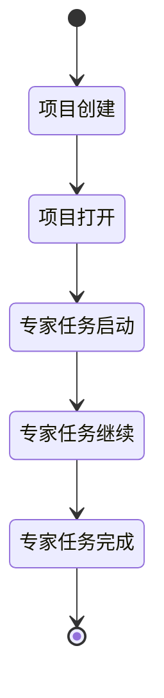
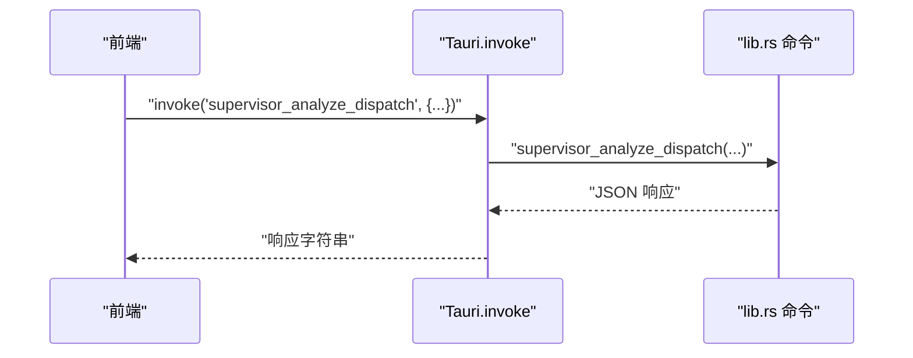
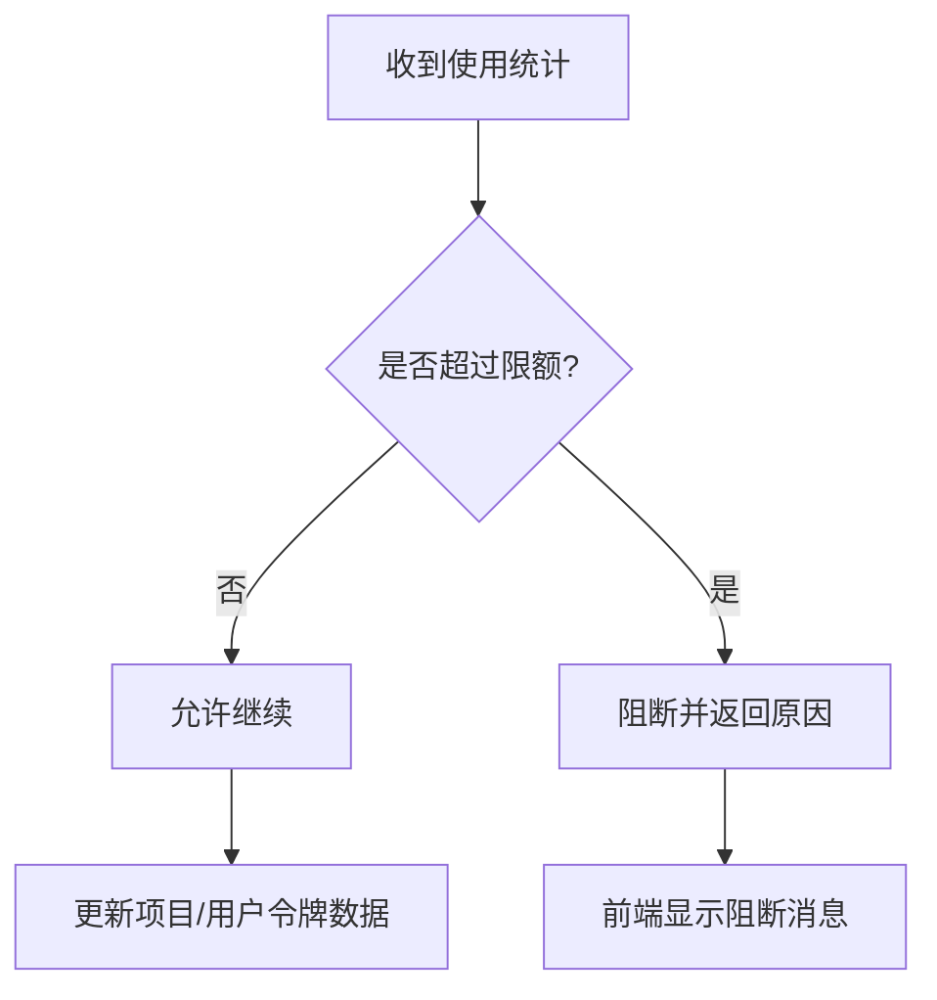
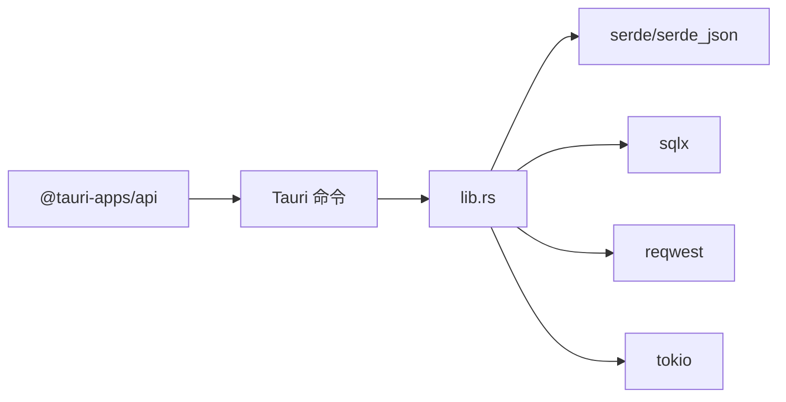

# 扩展开发

<cite>
**本文档引用的文件**
- [package.json](file://ai-experts/package.json)
- [main.ts](file://ai-experts/src/main.ts)
- [expert-catalog.ts](file://ai-experts/src/expert-catalog.ts)
- [tool-registry.ts](file://ai-experts/src/tool-registry.ts)
- [tool-executor.ts](file://ai-experts/src/tool-executor.ts)
- [expert-router.ts](file://ai-experts/src/expert-router.ts)
- [sidebar.ts](file://ai-experts/src/sidebar.ts)
- [tauri.conf.json](file://ai-experts/src-tauri/tauri.conf.json)
- [lib.rs](file://ai-experts/src-tauri/src/lib.rs)
- [Cargo.toml](file://ai-experts/src-tauri/Cargo.toml)
- [vite.config.ts](file://ai-experts/vite.config.ts)
</cite>

## 目录
1. [简介](#简介)
2. [项目结构](#项目结构)
3. [核心组件](#核心组件)
4. [架构总览](#架构总览)
5. [详细组件分析](#详细组件分析)
6. [依赖分析](#依赖分析)
7. [性能考量](#性能考量)
8. [故障排查指南](#故障排查指南)
9. [结论](#结论)
10. [附录](#附录)

## 简介
本指南面向希望为“星图专家团工作台”开发扩展的工程师，覆盖专家系统扩展、工具系统扩展、插件与命令接口、前后端通信协议、权限与配额控制、以及测试与调试方法。文档以代码为依据，提供架构视图、流程图与时序图，帮助快速理解并高效扩展。

## 项目结构
项目采用前端（Vite + TypeScript）与后端（Tauri + Rust）分离的双栈架构：
- 前端负责 UI、专家路由、工具注册与执行、密钥与配额管理、与后端通过 Tauri 命令通信。
- 后端负责专家任务运行时、流水线编排、工具执行、权限与配额校验、数据库与文件系统访问。

**图表来源**
- [main.ts:1-258](file://ai-experts/src/main.ts#L1-L258)
- [expert-router.ts:1-120](file://ai-experts/src/expert-router.ts#L1-L120)
- [expert-catalog.ts:1-120](file://ai-experts/src/expert-catalog.ts#L1-L120)
- [tool-registry.ts:1-60](file://ai-experts/src/tool-registry.ts#L1-L60)
- [tool-executor.ts:1-60](file://ai-experts/src/tool-executor.ts#L1-L60)
- [sidebar.ts:1-60](file://ai-experts/src/sidebar.ts#L1-L60)
- [vite.config.ts:1-31](file://ai-experts/vite.config.ts#L1-L31)
- [tauri.conf.json:1-38](file://ai-experts/src-tauri/tauri.conf.json#L1-L38)
- [lib.rs:1-120](file://ai-experts/src-tauri/src/lib.rs#L1-L120)
- [Cargo.toml:1-46](file://ai-experts/src-tauri/Cargo.toml#L1-L46)

**章节来源**
- [package.json:1-28](file://ai-experts/package.json#L1-L28)
- [vite.config.ts:1-31](file://ai-experts/vite.config.ts#L1-L31)
- [tauri.conf.json:1-38](file://ai-experts/src-tauri/tauri.conf.json#L1-L38)

## 核心组件
- 专家系统与激活
  - 专家类型与系统提示：通过专家目录构建系统提示、方法论与激活评分。
  - 专家激活算法：基于关键词与领域特征计算匹配度与触发概率。
- 工具系统
  - 工具注册表：定义工具 Schema 与权限级别。
  - 工具执行器：统一调用后端命令，处理审批与错误反馈。
- 路由与流水线
  - 专家路由：启动/继续专家任务运行时，处理令牌与配额，生成进度快照。
  - 流水线：步骤布局、波次调度、回合推进与收尾决策。
- 权限与配额
  - 前端令牌面板与持久化，后端配额检查与阻断消息。
- 侧边栏与项目管理
  - 项目创建/打开/删除、工作区连接校验、状态持久化。

**章节来源**
- [expert-catalog.ts:396-442](file://ai-experts/src/expert-catalog.ts#L396-L442)
- [tool-registry.ts:20-192](file://ai-experts/src/tool-registry.ts#L20-L192)
- [tool-executor.ts:13-231](file://ai-experts/src/tool-executor.ts#L13-L231)
- [expert-router.ts:505-544](file://ai-experts/src/expert-router.ts#L505-L544)
- [sidebar.ts:156-192](file://ai-experts/src/sidebar.ts#L156-L192)

## 架构总览
前端通过 Tauri 命令与后端交互，命令在后端 lib.rs 中声明并实现。前端负责 UI 与业务编排，后端负责执行与安全控制。

**图表来源**
- [tool-executor.ts:24-53](file://ai-experts/src/tool-executor.ts#L24-L53)
- [lib.rs:707-730](file://ai-experts/src-tauri/src/lib.rs#L707-L730)

**章节来源**
- [lib.rs:707-730](file://ai-experts/src-tauri/src/lib.rs#L707-L730)
- [tool-executor.ts:24-53](file://ai-experts/src/tool-executor.ts#L24-L53)

## 详细组件分析

### 专家类型定义与激活规则
- 专家类型
  - 专家目录条目包含：ID、代码、名称、头衔、描述、分类、关键词、工具画像、promptFocus 等。
  - 系统专家与学科专家两类，系统专家具有特殊权限与豁免配额。
- 激活评分与概率
  - 基于关键词匹配与领域画像加权，计算分数并映射为高/中/低触发等级与概率。
  - 提供任务作用域专家提示，融合系统提示与激活指导。
- 默认锚点专家与候选专家
  - 根据场景推断默认锚点专家集合，再结合激活概率排序选取候选专家。

**图表来源**
- [expert-catalog.ts:396-442](file://ai-experts/src/expert-catalog.ts#L396-L442)
- [expert-catalog.ts:496-527](file://ai-experts/src/expert-catalog.ts#L496-L527)

**章节来源**
- [expert-catalog.ts:9-40](file://ai-experts/src/expert-catalog.ts#L9-L40)
- [expert-catalog.ts:396-442](file://ai-experts/src/expert-catalog.ts#L396-L442)
- [expert-catalog.ts:496-644](file://ai-experts/src/expert-catalog.ts#L496-L644)

### 工具开发指南：注册表、Schema 与权限
- 工具注册表
  - 内置工具：shell_exec、file_read、file_write、file_patch、file_list、web_search、memory_query、index_search。
  - 每个工具定义包含：名称、描述、参数 Schema、权限级别（auto/confirm/block）。
- 权限控制
  - auto：自动执行；confirm：需要审批；block：禁止执行。
  - 专家工具映射：系统专家与特定专家可启用更多工具。
- 参数 Schema 设计
  - 使用 OpenAI function calling 格式，定义属性与必填字段，便于模型调用。

**图表来源**
- [tool-registry.ts:6-192](file://ai-experts/src/tool-registry.ts#L6-L192)

**章节来源**
- [tool-registry.ts:20-192](file://ai-experts/src/tool-registry.ts#L20-L192)

### 工具执行器：统一入口与错误处理
- 统一入口
  - execute：通过 Tauri invoke 调用后端 dispatch_tool，传递项目目录、专家 ID 与参数。
- 审批与错误反馈
  - file_patch 失败时构造结构化错误反馈，包含错误、文件、行号、片段与已应用文件列表，引导模型自动修正。
  - invoke 级别异常同样结构化处理。
- 工具调用提取
  - 支持 OpenAI function calling 与旧 ACTION 标记格式，向后兼容。

**图表来源**
- [tool-executor.ts:24-104](file://ai-experts/src/tool-executor.ts#L24-L104)
- [lib.rs:707-730](file://ai-experts/src-tauri/src/lib.rs#L707-L730)

**章节来源**
- [tool-executor.ts:13-231](file://ai-experts/src/tool-executor.ts#L13-L231)

### 插件系统与生命周期管理
- 模块化架构
  - 前端：expert-catalog、tool-registry、tool-executor、expert-router、sidebar 等模块职责清晰。
  - 后端：lib.rs 通过 mod 引入各引擎模块，命令在 lib.rs 中集中声明。
- 生命周期
  - 项目生命周期：创建/打开/删除、工作区连接校验、状态持久化。
  - 专家任务生命周期：启动、继续、配额检查、令牌更新、结果后处理。
- 授权与审批
  - 专家命令授权请求结构，支持 auto/restricted/admin 三种模式。

**图表来源**
- [sidebar.ts:156-192](file://ai-experts/src/sidebar.ts#L156-L192)
- [expert-router.ts:505-544](file://ai-experts/src/expert-router.ts#L505-L544)

**章节来源**
- [sidebar.ts:156-422](file://ai-experts/src/sidebar.ts#L156-L422)
- [expert-router.ts:505-544](file://ai-experts/src/expert-router.ts#L505-L544)

### 前后端通信协议与 Tauri 命令
- 命令声明与实现
  - 前端通过 invoke 调用后端命令；后端在 lib.rs 中使用 #[tauri::command] 声明。
  - 示例命令：verify_workspace_delivery、supervisor_analyze_dispatch、start_expert_task_runtime、continue_expert_task_runtime、dispatch_tool 等。
- 开发服务器与 HMR
  - vite.config.ts 固定前端端口，开启 HMR 并忽略 src-tauri 目录。

**图表来源**
- [expert-router.ts:733-788](file://ai-experts/src/expert-router.ts#L733-L788)
- [lib.rs:733-788](file://ai-experts/src-tauri/src/lib.rs#L733-L788)
- [vite.config.ts:14-29](file://ai-experts/vite.config.ts#L14-L29)

**章节来源**
- [lib.rs:707-800](file://ai-experts/src-tauri/src/lib.rs#L707-L800)
- [expert-router.ts:733-788](file://ai-experts/src/expert-router.ts#L733-L788)
- [vite.config.ts:14-29](file://ai-experts/vite.config.ts#L14-L29)

### 权限控制系统与配额管理
- 前端
  - 令牌数据结构与持久化：项目级与用户级 tokenData，支持保存/加载。
  - 配额阻断消息展示：在对话区显示阻断原因。
- 后端
  - 配额检查：基于分配限额与使用记录，支持豁免专家 ID。
  - 令牌用量追加：记录 prompt/completion/total tokens，支持项目与用户维度。

**图表来源**
- [expert-router.ts:39-82](file://ai-experts/src/expert-router.ts#L39-L82)
- [lib.rs:321-338](file://ai-experts/src-tauri/src/lib.rs#L321-L338)
- [lib.rs:633-651](file://ai-experts/src-tauri/src/lib.rs#L633-L651)

**章节来源**
- [expert-router.ts:39-82](file://ai-experts/src/expert-router.ts#L39-L82)
- [lib.rs:321-338](file://ai-experts/src-tauri/src/lib.rs#L321-L338)
- [lib.rs:633-651](file://ai-experts/src-tauri/src/lib.rs#L633-L651)

## 依赖分析
- 前端依赖
  - @tauri-apps/api：调用后端命令、事件监听、窗口控制。
  - highlight.js：代码高亮。
- 后端依赖
  - tauri、serde、serde_json：命令与序列化。
  - sqlx、reqwest、tokio：数据库、HTTP、异步运行时。
  - 其他：base64、regex、scraper、calamine、docx-rs 等用于数据处理与文件解析。

**图表来源**
- [Cargo.toml:20-46](file://ai-experts/src-tauri/Cargo.toml#L20-L46)
- [lib.rs:1-13](file://ai-experts/src-tauri/src/lib.rs#L1-L13)

**章节来源**
- [Cargo.toml:20-46](file://ai-experts/src-tauri/Cargo.toml#L20-L46)

## 性能考量
- 前端
  - 使用函数调用格式（function calling）减少解析成本，兼容 ACTION 标记格式以保障迁移。
  - 工具执行器对 file_patch 失败进行结构化反馈，减少无效重试。
- 后端
  - 异步运行时与数据库连接池提升并发与吞吐。
  - 令牌用量按专家维度聚合，避免频繁 IO。
- 通用
  - 固定前端端口与 HMR，缩短开发迭代周期。
  - 严格区分 auto/confirm/block 权限，避免高风险操作。

[本节为通用指导，无需具体文件引用]

## 故障排查指南
- 工具执行失败
  - 检查 file_patch 的结构化错误反馈，定位文件、行号与上下文片段。
  - 确认项目目录与工作区连接正常。
- 配额阻断
  - 查看前端阻断消息，确认专家限额与豁免 ID。
  - 核对后端配额检查逻辑与令牌数据。
- 命令调用异常
  - 检查 invoke 参数与后端命令签名是否一致。
  - 关注 HMR 与端口占用问题。

**章节来源**
- [tool-executor.ts:59-104](file://ai-experts/src/tool-executor.ts#L59-L104)
- [expert-router.ts:85-104](file://ai-experts/src/expert-router.ts#L85-L104)
- [lib.rs:321-338](file://ai-experts/src-tauri/src/lib.rs#L321-L338)

## 结论
本指南提供了从专家类型定义、工具注册与执行、权限与配额控制到前后端通信与生命周期管理的完整扩展开发路径。建议在新增专家或工具时，遵循现有 Schema 与权限模型，利用激活评分与任务作用域提示提升专家匹配度，并通过结构化错误反馈与配额控制保障系统稳定性与安全性。

## 附录
- 开发与构建
  - 前端：npm run dev/build/preview/tauri/cli:test
  - 后端：Tauri CLI 与 Rust 构建链路
- 最佳实践
  - 专家激活算法：持续优化关键词与画像权重，提高匹配精度。
  - 工具执行：优先使用 auto 权限，谨慎使用 confirm/block。
  - 前后端：保持命令参数与返回值的 JSON 结构稳定，便于演进。

**章节来源**
- [package.json:6-14](file://ai-experts/package.json#L6-L14)
- [vite.config.ts:14-29](file://ai-experts/vite.config.ts#L14-L29)