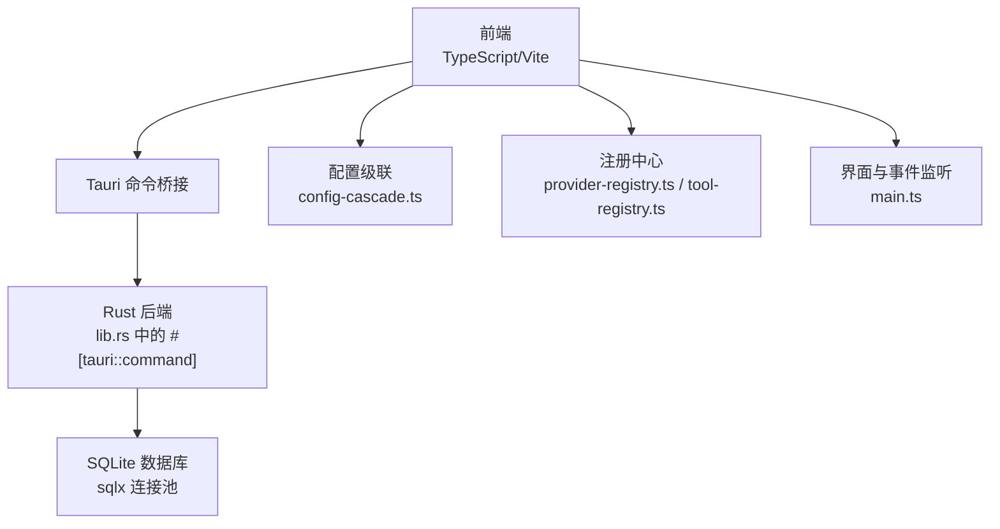
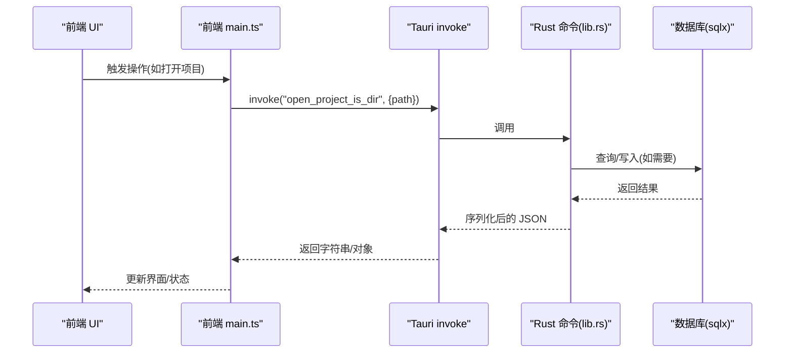
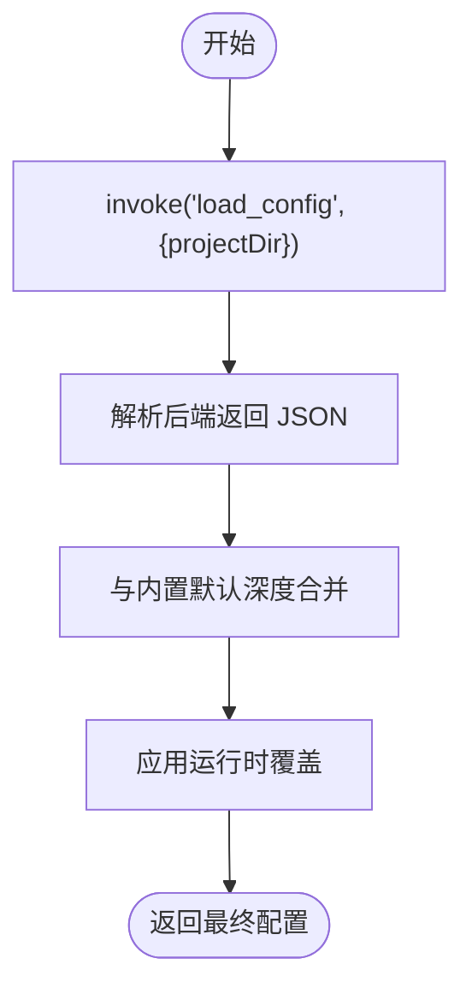
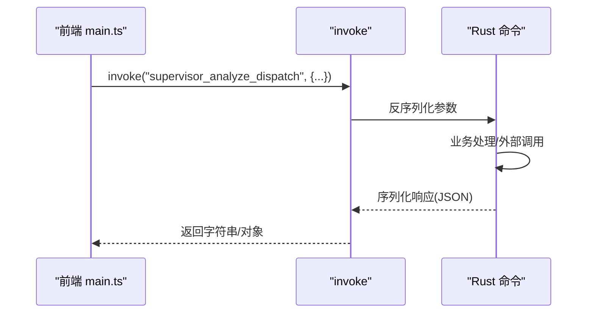
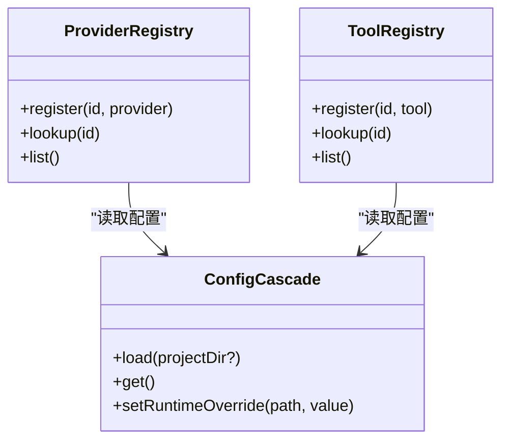
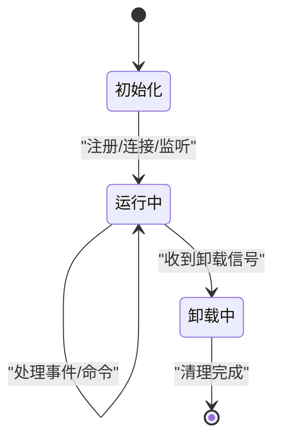
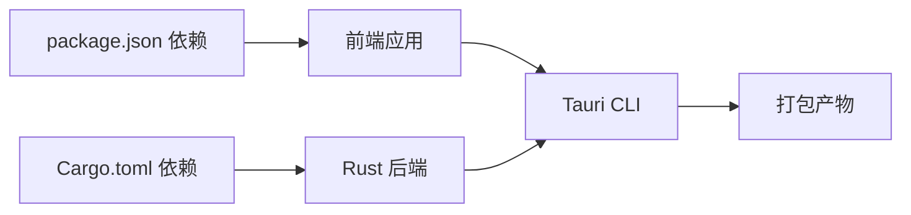

# 插件系统

<cite>
**本文引用的文件**
- [main.ts](file://ai-experts/src/main.ts)
- [lib.rs](file://ai-experts/src-tauri/src/lib.rs)
- [package.json](file://ai-experts/package.json)
- [tauri.conf.json](file://ai-experts/src-tauri/tauri.conf.json)
- [config-cascade.ts](file://ai-experts/src/config-cascade.ts)
- [provider-registry.ts](file://ai-experts/src/provider-registry.ts)
- [tool-registry.ts](file://ai-experts/src/tool-registry.ts)
- [Cargo.toml](file://ai-experts/src-tauri/Cargo.toml)
- [hooks.rs](file://ai-experts/src-tauri/src/hooks.rs)
</cite>

## 目录
1. [引言](#引言)
2. [项目结构](#项目结构)
3. [核心组件](#核心组件)
4. [架构总览](#架构总览)
5. [详细组件分析](#详细组件分析)
6. [依赖关系分析](#依赖关系分析)
7. [性能考量](#性能考量)
8. [故障排查指南](#故障排查指南)
9. [结论](#结论)
10. [附录](#附录)

## 引言
本指南面向希望在“星图专家团工作台”中开发插件的开发者，系统性阐述模块化架构的设计原则、插件接口与命令体系、配置级联机制、生命周期管理、前后端通信协议以及最佳实践与性能优化建议。文档基于仓库现有代码进行提炼与总结，帮助读者快速理解并构建稳定、可扩展的插件生态。

## 项目结构
前端采用 TypeScript/Vite，后端基于 Tauri/Rust，通过 Tauri 命令桥接前后端。插件系统围绕“命令接口 + 配置级联 + 注册中心”的模式展开，既支持内置能力，也预留了扩展点以承载第三方插件。

图表来源
- [main.ts:1-258](file://ai-experts/src/main.ts#L1-L258)
- [lib.rs:1-52](file://ai-experts/src-tauri/src/lib.rs#L1-L52)
- [config-cascade.ts:1-239](file://ai-experts/src/config-cascade.ts#L1-L239)
- [provider-registry.ts](file://ai-experts/src/provider-registry.ts)
- [tool-registry.ts](file://ai-experts/src/tool-registry.ts)

章节来源
- [package.json:1-28](file://ai-experts/package.json#L1-L28)
- [tauri.conf.json:1-38](file://ai-experts/src-tauri/tauri.conf.json#L1-L38)

## 核心组件
- 前端入口与事件总线：负责窗口控制、菜单交互、拖拽打开项目、主题切换、设置页交互等，同时通过 Tauri invoke 调用后端命令。
- Rust 命令层：集中定义命令接口，封装业务逻辑与外部服务调用，统一响应格式。
- 配置级联：提供“内置默认 < 用户全局 < 项目级 < 运行时覆盖”的层级合并策略，确保插件配置可被灵活定制。
- 注册中心：抽象提供者与工具的注册与发现机制，便于插件动态挂载能力。
- 构建与打包：Vite 前端构建、Tauri CLI 打包，配置指向本地开发与产物目录。

章节来源
- [main.ts:1-258](file://ai-experts/src/main.ts#L1-L258)
- [lib.rs:707-788](file://ai-experts/src-tauri/src/lib.rs#L707-L788)
- [config-cascade.ts:1-239](file://ai-experts/src/config-cascade.ts#L1-L239)
- [provider-registry.ts](file://ai-experts/src/provider-registry.ts)
- [tool-registry.ts](file://ai-experts/src/tool-registry.ts)

## 架构总览
前端通过 Tauri 的 invoke 与后端建立命令通道，后端以 #[tauri::command] 函数对外暴露能力。配置系统提供统一的配置读取、合并与持久化能力，注册中心为插件提供能力注册与查询接口。

图表来源
- [main.ts:231-248](file://ai-experts/src/main.ts#L231-L248)
- [lib.rs:707-788](file://ai-experts/src-tauri/src/lib.rs#L707-L788)

## 详细组件分析

### 组件A：配置级联（ConfigCascade）
- 设计要点
  - 层级顺序：内置默认 → 用户全局 → 项目级 → 运行时覆盖
  - 合并策略：深度合并对象，避免覆盖整段配置
  - 生命周期：首次加载后缓存，支持运行时覆盖与持久化保存
- 关键接口
  - load(projectDir?)：从后端加载并合并配置
  - get()/getLLM()/...：读取配置片段
  - setRuntimeOverride(path, value)：设置运行时覆盖
  - save(scope, projectDir?)：持久化配置
  - reset()：重置为默认
- 使用建议
  - 将插件配置项纳入 AppConfig 接口，保证 UI 可枚举与校验
  - 对敏感字段（如密钥）避免持久化到项目级，优先使用运行时覆盖或用户全局

图表来源
- [config-cascade.ts:117-137](file://ai-experts/src/config-cascade.ts#L117-L137)

章节来源
- [config-cascade.ts:1-239](file://ai-experts/src/config-cascade.ts#L1-L239)

### 组件B：命令接口与前后端通信（Tauri 命令）
- 前端调用
  - 使用 @tauri-apps/api/core 的 invoke 发起命令
  - 使用 @tauri-apps/api/event 的 listen 订阅事件
- 后端定义
  - #[tauri::command] 函数作为命令入口，参数与返回值序列化为 JSON
  - 支持异步调用与错误传播
- 示例命令
  - supervisor_analyze_dispatch：主管分析与派发
  - verify_workspace_delivery：工作区交付验证
  - execute_command/check_command_safety：命令安全检查与执行
- 数据流
  - 前端传入 JSON 字符串/对象，后端解析为结构体，处理完成后序列化返回

图表来源
- [main.ts:4050-4087](file://ai-experts/src/main.ts#L4050-L4087)
- [lib.rs:732-788](file://ai-experts/src-tauri/src/lib.rs#L732-L788)

章节来源
- [main.ts:1-258](file://ai-experts/src/main.ts#L1-L258)
- [lib.rs:707-788](file://ai-experts/src-tauri/src/lib.rs#L707-L788)

### 组件C：注册中心（Provider/Tool Registry）
- 目标
  - 提供统一的注册、查询与生命周期管理接口，便于插件挂载新能力
- 建议结构
  - ProviderRegistry：注册/发现 LLM/存储/搜索等提供者
  - ToolRegistry：注册/发现工具（命令、脚本、外部进程等）
- 与配置级联配合
  - 插件启动时读取配置，决定启用哪些提供者/工具
  - 运行时可通过 setRuntimeOverride 动态调整

图表来源
- [provider-registry.ts](file://ai-experts/src/provider-registry.ts)
- [tool-registry.ts](file://ai-experts/src/tool-registry.ts)
- [config-cascade.ts:108-137](file://ai-experts/src/config-cascade.ts#L108-L137)

章节来源
- [provider-registry.ts](file://ai-experts/src/provider-registry.ts)
- [tool-registry.ts](file://ai-experts/src/tool-registry.ts)

### 组件D：插件生命周期（建议实现）
- 初始化
  - 读取配置（全局/项目级），合并运行时覆盖
  - 注册命令与事件监听
  - 建立资源连接（数据库/网络/文件系统）
- 运行时管理
  - 周期性健康检查与资源回收
  - 事件驱动的任务调度
  - 配置热更新与回滚
- 卸载
  - 取消事件监听
  - 释放资源与连接
  - 清理临时状态与缓存

（本图为概念示意，无需图表来源）

## 依赖关系分析
- 前端依赖
  - @tauri-apps/api：invoke、event、window 等
  - highlight.js：代码高亮
- 后端依赖
  - tauri：命令注解、应用管理
  - serde/sqlx：序列化与 SQLite 连接池
  - regex/base64：文本处理与编码
- 构建与打包
  - Vite：前端构建
  - Tauri CLI：打包与分发
  - Cargo：Rust 依赖与编译

图表来源
- [package.json:1-28](file://ai-experts/package.json#L1-L28)
- [Cargo.toml](file://ai-experts/src-tauri/Cargo.toml)

章节来源
- [package.json:1-28](file://ai-experts/package.json#L1-L28)
- [tauri.conf.json:1-38](file://ai-experts/src-tauri/tauri.conf.json#L1-L38)

## 性能考量
- 前端
  - 合理拆分模块与懒加载，减少首屏体积
  - 使用虚拟滚动与增量渲染处理大列表
  - 控制高频事件（拖拽、滚动）的回调频率
- 后端
  - 使用连接池（sqlx）复用数据库连接
  - 对长耗时任务采用异步命令与进度上报
  - 对外部 API 调用设置超时与指数退避
- 配置与缓存
  - 配置合并尽量在启动阶段完成，运行时只做小范围覆盖
  - 对热点数据建立内存缓存，避免重复 IO

（本节为通用指导，无需章节来源）

## 故障排查指南
- 前端命令调用失败
  - 检查命令名是否与后端 #[tauri::command] 定义一致
  - 查看 invoke 返回的错误信息，确认参数序列化是否正确
- 配置未生效
  - 确认配置加载顺序与覆盖链路
  - 检查 save(scope, projectDir?) 的作用域是否正确
- 事件未触发
  - 确认事件监听是否在 DOMContentLoaded 后注册
  - 检查事件名与命名空间是否匹配
- 资源泄漏
  - 在卸载流程中取消事件监听与定时器
  - 确保数据库连接与文件句柄被释放

章节来源
- [main.ts:1-258](file://ai-experts/src/main.ts#L1-L258)
- [config-cascade.ts:187-195](file://ai-experts/src/config-cascade.ts#L187-L195)

## 结论
通过“命令接口 + 配置级联 + 注册中心”的架构，星图专家团工作台为插件系统提供了清晰的扩展边界与稳定的运行环境。开发者可在保持前后端解耦的前提下，以最小成本接入新能力，并通过配置与运行时覆盖实现灵活的定制化。

## 附录

### A. 插件开发步骤（示例流程）
- 设计插件接口
  - 明确命令清单与输入输出格式
  - 定义配置项并纳入 AppConfig
- 实现后端命令
  - 在 lib.rs 中新增 #[tauri::command] 函数
  - 处理参数校验、异常与日志
- 实现前端调用
  - 在 main.ts 或插件模块中使用 invoke 调用命令
  - 订阅事件并更新 UI
- 集成注册中心
  - 在 provider-registry.ts/tool-registry.ts 中注册能力
  - 读取配置决定启用与否
- 配置级联与持久化
  - 通过 ConfigCascade.load/save 完成配置读取与保存
  - 使用 setRuntimeOverride 实现运行时覆盖
- 测试与打包
  - 编写单元测试与集成测试
  - 使用 Tauri CLI 打包并验证功能

章节来源
- [lib.rs:707-788](file://ai-experts/src-tauri/src/lib.rs#L707-L788)
- [main.ts:231-248](file://ai-experts/src/main.ts#L231-L248)
- [config-cascade.ts:108-137](file://ai-experts/src/config-cascade.ts#L108-L137)
- [provider-registry.ts](file://ai-experts/src/provider-registry.ts)
- [tool-registry.ts](file://ai-experts/src/tool-registry.ts)

### B. 配置级联机制详解
- 优先级
  - 内置默认 < 用户全局 < 项目级 < 运行时覆盖
- 继承与覆盖
  - 深度合并对象，避免整段覆盖
  - 运行时覆盖仅影响当前会话
- 存储与加载
  - save(scope, projectDir?) 支持 global/project 两种作用域
  - load(projectDir?) 从后端加载并合并

章节来源
- [config-cascade.ts:1-239](file://ai-experts/src/config-cascade.ts#L1-L239)

### C. 前后端通信协议要点
- 命令命名规范
  - 前端 invoke("command_name", payload) 与后端 #[tauri::command] 对应
- 数据传输格式
  - 参数与返回值统一为 JSON 字符串/对象
- 事件机制
  - 使用 @tauri-apps/api/event 的 listen 订阅后端事件
- 安全与权限
  - 对高危命令（如系统命令）增加安全检查与授权流程

章节来源
- [main.ts:1-258](file://ai-experts/src/main.ts#L1-L258)
- [lib.rs:707-788](file://ai-experts/src-tauri/src/lib.rs#L707-L788)