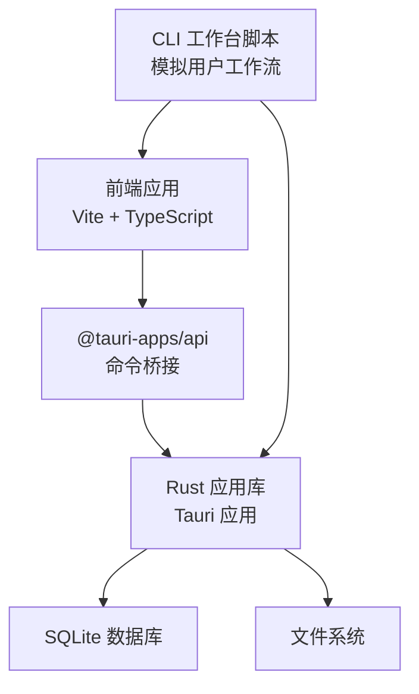
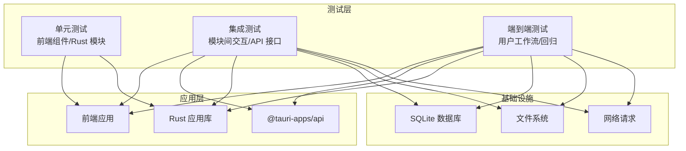
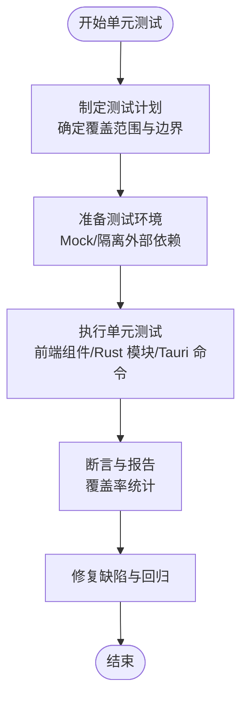
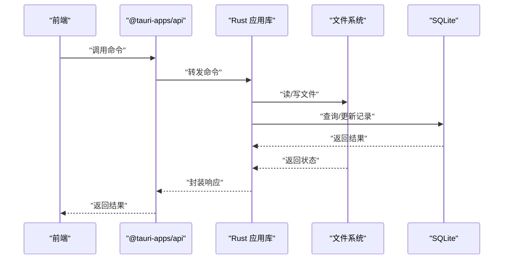
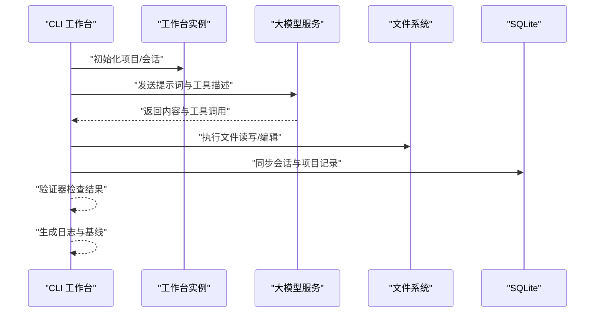
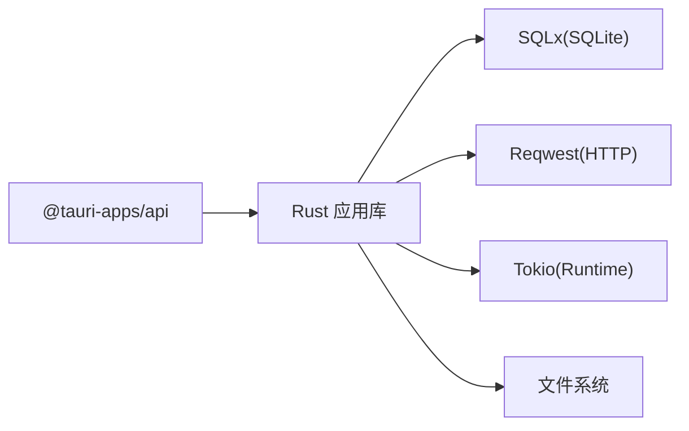

# 测试策略

<cite>
**本文引用的文件**
- [package.json](file://ai-experts/package.json)
- [vite.config.ts](file://ai-experts/vite.config.ts)
- [Cargo.toml](file://ai-experts/src-tauri/Cargo.toml)
- [cli-workbench.mjs](file://ai-experts/scripts/cli-workbench.mjs)
- [restore-frontend-test-baseline.mjs](file://ai-experts/scripts/restore-frontend-test-baseline.mjs)
- [blackboard_engine.rs](file://ai-experts/src-tauri/src/blackboard_engine.rs)
- [collaboration_engine.rs](file://ai-experts/src-tauri/src/collaboration_engine.rs)
- [deliverables.rs](file://ai-experts/src-tauri/src/deliverables.rs)
</cite>

## 目录
1. [引言](#引言)
2. [项目结构](#项目结构)
3. [核心组件](#核心组件)
4. [架构总览](#架构总览)
5. [详细组件分析](#详细组件分析)
6. [依赖分析](#依赖分析)
7. [性能考虑](#性能考虑)
8. [故障排查指南](#故障排查指南)
9. [结论](#结论)
10. [附录](#附录)

## 引言
本测试策略文档面向“星图专家团工作台（社区版）”项目，系统化设计从单元测试到端到端测试的完整测试体系，覆盖前端组件测试、Rust 后端模块测试与 Tauri 命令测试；同时规划集成测试与 E2E 测试的实施路径，明确测试工具使用、覆盖率要求、持续集成与自动化流程，并补充性能、压力与安全测试最佳实践。

## 项目结构
项目采用前后端分离与原生应用打包的混合架构：
- 前端（Vite + TypeScript）：负责用户界面与交互逻辑，通过 Tauri 暴露系统能力。
- Rust 后端（Tauri 应用库）：提供业务引擎、工具执行、数据处理与持久化能力。
- CLI 工作台脚本：用于模拟真实用户工作流，驱动前端与后端协同完成端到端场景验证。
- 配置与构建：Vite 与 Tauri 构建配置确保开发与生产环境的一致性与可测试性。

图表来源
- [vite.config.ts:1-31](file://ai-experts/vite.config.ts#L1-L31)
- [Cargo.toml:1-46](file://ai-experts/src-tauri/Cargo.toml#L1-L46)
- [package.json:1-28](file://ai-experts/package.json#L1-L28)

章节来源
- [vite.config.ts:1-31](file://ai-experts/vite.config.ts#L1-L31)
- [Cargo.toml:1-46](file://ai-experts/src-tauri/Cargo.toml#L1-L46)
- [package.json:1-28](file://ai-experts/package.json#L1-L28)

## 核心组件
- 前端应用与构建
  - 使用 Vite 提供开发服务器与热更新，固定端口以适配 Tauri 开发模式。
  - 通过 @tauri-apps/api 与后端进行命令通信。
- Rust 应用库
  - 作为静态库、动态库与 rlib 多类型导出，便于前端与原生侧复用。
  - 依赖 Tauri、SQLx、Reqwest、Tokio 等生态库，支撑命令、网络与数据库能力。
- CLI 工作台脚本
  - 提供项目初始化、会话管理、工具链调用与验证器，形成可重复的 E2E 场景。
  - 支持将工具调用日志回放到前端测试基线，保障回归一致性。

章节来源
- [vite.config.ts:1-31](file://ai-experts/vite.config.ts#L1-L31)
- [Cargo.toml:1-46](file://ai-experts/src-tauri/Cargo.toml#L1-L46)
- [package.json:1-28](file://ai-experts/package.json#L1-L28)
- [cli-workbench.mjs:1-792](file://ai-experts/scripts/cli-workbench.mjs#L1-L792)
- [restore-frontend-test-baseline.mjs:1-91](file://ai-experts/scripts/restore-frontend-test-baseline.mjs#L1-L91)

## 架构总览
下图展示测试策略与系统组件的交互关系，强调测试驱动的验证闭环：

图表来源
- [Cargo.toml:1-46](file://ai-experts/src-tauri/Cargo.toml#L1-L46)
- [cli-workbench.mjs:1-792](file://ai-experts/scripts/cli-workbench.mjs#L1-L792)

## 详细组件分析

### 单元测试策略
- 前端组件测试
  - 目标：验证组件渲染、事件处理、状态变更与副作用。
  - 方法：使用前端测试框架（如 Vitest/Jest），结合 DOM 测试工具与组件快照。
  - Mock 策略：对外部 API 与 @tauri-apps/api 进行隔离，使用虚拟实现或拦截器。
  - 数据准备：通过测试配置注入最小化、可预测的数据集，避免真实文件系统与网络依赖。
- Rust 后端模块测试
  - 目标：验证业务引擎、工具执行与数据处理的正确性与边界条件。
  - 方法：利用 #[cfg(test)] 模块与标准测试宏，针对关键函数与状态机进行断言。
  - 示例参考：黑板引擎、协作引擎与交付物解析模块均包含测试用例，可作为模板。
- Tauri 命令测试
  - 目标：验证命令注册、参数校验、错误传播与返回值格式。
  - 方法：通过 @tauri-apps/api 的测试桥接或模拟调用，断言命令行为与副作用。

章节来源
- [blackboard_engine.rs:580-653](file://ai-experts/src-tauri/src/blackboard_engine.rs#L580-L653)
- [collaboration_engine.rs:296-411](file://ai-experts/src-tauri/src/collaboration_engine.rs#L296-L411)
- [deliverables.rs:272-359](file://ai-experts/src-tauri/src/deliverables.rs#L272-L359)

### 集成测试策略
- 模块间交互测试
  - 目标：验证前端与后端命令交互、状态流转与数据一致性。
  - 方法：通过 @tauri-apps/api 注册命令桩，断言命令调用序列与返回值。
- API 接口测试
  - 目标：验证网络请求、响应格式与错误处理。
  - 方法：使用 HTTP 客户端测试库，构造边界与异常场景，断言状态码与负载。
- 数据流验证
  - 目标：验证文件系统与数据库的读写一致性、事务完整性与并发安全。
  - 方法：在受控环境中执行多轮次操作，比对预期结果与实际落盘数据。

图表来源
- [Cargo.toml:20-46](file://ai-experts/src-tauri/Cargo.toml#L20-L46)
- [package.json:15-26](file://ai-experts/package.json#L15-L26)

章节来源
- [Cargo.toml:20-46](file://ai-experts/src-tauri/Cargo.toml#L20-L46)
- [package.json:15-26](file://ai-experts/package.json#L15-L26)

### E2E 测试策略
- 用户工作流测试
  - 目标：模拟真实用户在工作台中的典型路径，验证端到端功能。
  - 方法：CLI 工作台脚本定义多个回合与验证器，自动执行并记录日志。
- 端到端功能验证
  - 目标：确保从 UI 到后端命令、再到文件系统与数据库的完整链路稳定。
  - 方法：在隔离的工作空间中执行场景，断言生成文件、工具调用与会话历史。
- 回归测试策略
  - 目标：通过基线回放与日志解析，快速识别回归问题。
  - 方法：使用前端测试基线恢复脚本，基于工具调用日志重建工作区状态。

图表来源
- [cli-workbench.mjs:460-588](file://ai-experts/scripts/cli-workbench.mjs#L460-L588)
- [cli-workbench.mjs:626-654](file://ai-experts/scripts/cli-workbench.mjs#L626-L654)
- [restore-frontend-test-baseline.mjs:18-91](file://ai-experts/scripts/restore-frontend-test-baseline.mjs#L18-L91)

章节来源
- [cli-workbench.mjs:1-792](file://ai-experts/scripts/cli-workbench.mjs#L1-L792)
- [restore-frontend-test-baseline.mjs:1-91](file://ai-experts/scripts/restore-frontend-test-baseline.mjs#L1-L91)

### 测试工具使用指南
- Jest/Vitest 配置要点
  - 端口与主机：保持与 Vite 开发服务器一致，避免 HMR 冲突。
  - 屏蔽 Rust 错误：防止构建器输出干扰测试日志。
  - 忽略 src-tauri：避免监听原生源码导致的误触发。
- Rust 测试框架
  - 使用标准 #[test] 宏与断言，结合 #[cfg(test)] 模块组织测试。
  - 参考黑板引擎、协作引擎与交付物解析模块的测试结构。
- 测试数据准备与 Mock 策略
  - 前端：使用虚拟实现替换 @tauri-apps/api 与网络请求，注入最小化数据。
  - 后端：使用内存数据库或临时文件，确保测试隔离与可重复性。
- CLI 工作台脚本
  - 通过命令行参数选择场景，自动执行多回合验证并生成日志。
  - 使用基线恢复脚本将工具调用日志回放到指定工作区，便于回归对比。

章节来源
- [vite.config.ts:7-30](file://ai-experts/vite.config.ts#L7-L30)
- [blackboard_engine.rs:580-653](file://ai-experts/src-tauri/src/blackboard_engine.rs#L580-L653)
- [collaboration_engine.rs:296-411](file://ai-experts/src-tauri/src/collaboration_engine.rs#L296-L411)
- [deliverables.rs:272-359](file://ai-experts/src-tauri/src/deliverables.rs#L272-L359)
- [cli-workbench.mjs:12-28](file://ai-experts/scripts/cli-workbench.mjs#L12-L28)
- [cli-workbench.mjs:656-777](file://ai-experts/scripts/cli-workbench.mjs#L656-L777)
- [restore-frontend-test-baseline.mjs:18-91](file://ai-experts/scripts/restore-frontend-test-baseline.mjs#L18-L91)

### 测试覆盖率与持续集成
- 覆盖率要求
  - 前端：语句/分支/函数/行覆盖率不低于 80%，关键路径不低于 90%。
  - Rust：模块级覆盖率不低于 85%，核心引擎不低于 90%。
- 持续集成配置
  - 构建矩阵：分别在 Windows/Linux/macOS 上运行单元、集成与 E2E 测试。
  - 缓存策略：缓存 Node 与 Cargo 依赖，缩短流水线时间。
  - 报告与门禁：上传覆盖率报告，设置最低阈值门禁，失败即阻断发布。
- 自动化测试流程
  - PR 触发：执行单元与集成测试；主干推送触发全量 E2E。
  - 基线回放：在 E2E 成功后生成并保存前端测试基线，供后续回归使用。

章节来源
- [Cargo.toml:10-15](file://ai-experts/src-tauri/Cargo.toml#L10-L15)
- [package.json:6-13](file://ai-experts/package.json#L6-L13)

### 性能测试、压力测试与安全测试
- 性能测试
  - 关注命令延迟、文件读写吞吐与并发会话处理能力。
  - 使用基准测试工具量化关键路径耗时，建立性能基线。
- 压力测试
  - 模拟高并发文件操作与数据库写入，观察锁竞争与资源占用。
  - 验证错误恢复与限流策略，确保系统稳定性。
- 安全测试
  - 路径越界防护：严格限制工具调用的目标路径，避免任意文件写入。
  - 输入校验：对用户输入与外部响应进行白名单过滤与长度限制。
  - 权限最小化：仅授予必要的文件系统与网络权限，减少攻击面。

章节来源
- [cli-workbench.mjs:320-327](file://ai-experts/scripts/cli-workbench.mjs#L320-L327)
- [cli-workbench.mjs:354-415](file://ai-experts/scripts/cli-workbench.mjs#L354-L415)
- [cli-workbench.mjs:417-441](file://ai-experts/scripts/cli-workbench.mjs#L417-L441)

## 依赖分析
- 组件耦合与内聚
  - 前端与后端通过 @tauri-apps/api 解耦，命令边界清晰，便于单元测试。
  - Rust 应用库内部模块职责单一，测试内聚度高，易于隔离。
- 外部依赖与风险
  - SQLx、Reqwest、Tokio 等库需关注版本兼容性与安全更新。
  - 文件系统与 SQLite 访问需注意并发与崩溃恢复。
- 循环依赖
  - 通过命令桥接与模块化组织，避免循环依赖风险。

图表来源
- [Cargo.toml:20-46](file://ai-experts/src-tauri/Cargo.toml#L20-L46)
- [package.json:15-26](file://ai-experts/package.json#L15-L26)

章节来源
- [Cargo.toml:20-46](file://ai-experts/src-tauri/Cargo.toml#L20-L46)
- [package.json:15-26](file://ai-experts/package.json#L15-L26)

## 性能考虑
- 前端
  - 减少不必要的重渲染，使用稳定的 props 与状态结构。
  - 对长列表与复杂计算进行节流/防抖与缓存。
- 后端
  - 使用异步 I/O 与连接池，避免阻塞主线程。
  - 对高频操作进行批处理与索引优化。
- 测试中的性能
  - 使用小数据集与内存数据库，缩短测试时长。
  - 并行执行独立测试，提升吞吐。

## 故障排查指南
- 常见问题
  - 路径越界：检查工具调用的安全校验与路径规范化。
  - 文件写入失败：确认权限与磁盘空间，捕获并上报具体错误。
  - 网络请求异常：验证 API 密钥与服务端可达性，增加重试与降级。
- 日志与诊断
  - CLI 工作台生成详细日志，包含工具调用与验证结果摘要。
  - 基线恢复脚本可帮助快速定位差异与回放问题。

章节来源
- [cli-workbench.mjs:320-327](file://ai-experts/scripts/cli-workbench.mjs#L320-L327)
- [cli-workbench.mjs:417-441](file://ai-experts/scripts/cli-workbench.mjs#L417-L441)
- [cli-workbench.mjs:626-654](file://ai-experts/scripts/cli-workbench.mjs#L626-L654)
- [restore-frontend-test-baseline.mjs:18-91](file://ai-experts/scripts/restore-frontend-test-baseline.mjs#L18-L91)

## 结论
本测试策略以 CLI 工作台为 E2E 骨干，结合单元与集成测试，形成从组件到端到端的完整验证闭环。通过明确的覆盖率门槛、CI/CD 门禁与基线回放机制，确保质量与效率并重。建议在后续迭代中逐步完善前端组件测试与 Rust 模块测试用例，持续优化性能与安全性。

## 附录
- 测试场景清单（示例）
  - 前端：组件渲染、事件冒泡、状态同步、错误边界。
  - 后端：工具执行、会话持久化、并发控制、异常恢复。
  - 集成：命令调用链、数据库事务、文件系统一致性。
  - E2E：多回合工作流、基线回放、日志审计。
- 关键参考文件
  - [vite.config.ts](file://ai-experts/vite.config.ts)
  - [Cargo.toml](file://ai-experts/src-tauri/Cargo.toml)
  - [package.json](file://ai-experts/package.json)
  - [cli-workbench.mjs](file://ai-experts/scripts/cli-workbench.mjs)
  - [restore-frontend-test-baseline.mjs](file://ai-experts/scripts/restore-frontend-test-baseline.mjs)
  - [blackboard_engine.rs](file://ai-experts/src-tauri/src/blackboard_engine.rs)
  - [collaboration_engine.rs](file://ai-experts/src-tauri/src/collaboration_engine.rs)
  - [deliverables.rs](file://ai-experts/src-tauri/src/deliverables.rs)