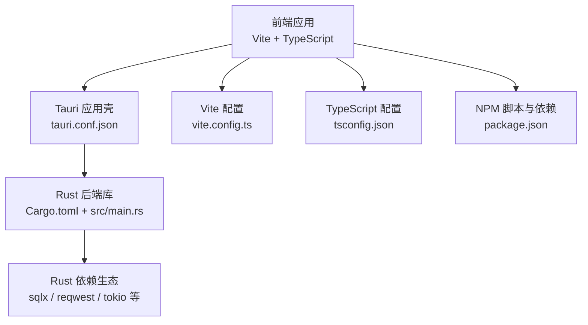
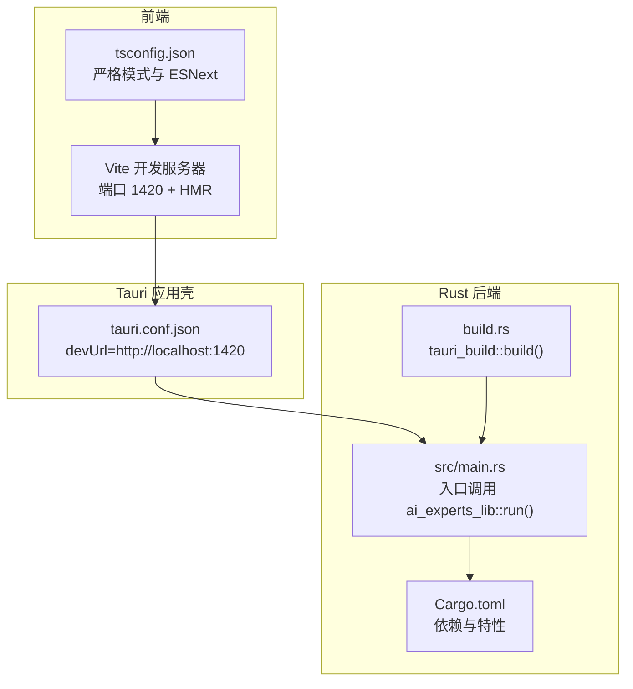
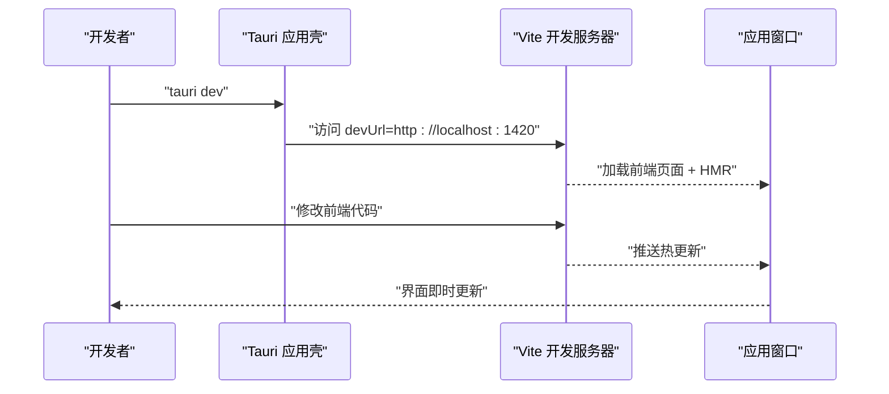
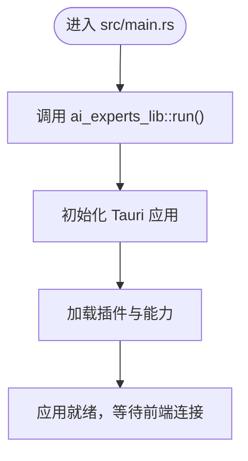
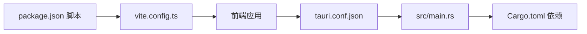

# 环境搭建

<cite>
**本文引用的文件**
- [ai-experts/package.json](file://ai-experts/package.json)
- [ai-experts/vite.config.ts](file://ai-experts/vite.config.ts)
- [ai-experts/tsconfig.json](file://ai-experts/tsconfig.json)
- [ai-experts/src-tauri/tauri.conf.json](file://ai-experts/src-tauri/tauri.conf.json)
- [ai-experts/src-tauri/Cargo.toml](file://ai-experts/src-tauri/Cargo.toml)
- [ai-experts/src-tauri/build.rs](file://ai-experts/src-tauri/build.rs)
- [ai-experts/src-tauri/src/main.rs](file://ai-experts/src-tauri/src/main.rs)
- [ai-experts/README.md](file://ai-experts/README.md)
</cite>

## 目录
1. [简介](#简介)
2. [项目结构](#项目结构)
3. [核心组件](#核心组件)
4. [架构总览](#架构总览)
5. [详细组件分析](#详细组件分析)
6. [依赖关系分析](#依赖关系分析)
7. [性能考虑](#性能考虑)
8. [故障排除指南](#故障排除指南)
9. [结论](#结论)
10. [附录](#附录)

## 简介
本指南面向希望在本地搭建“星图专家团工作台（社区版）”开发环境的工程师与贡献者，覆盖开发环境配置要求、Node.js 与 Rust 工具链安装、前端与后端依赖管理、Tauri 框架设置、开发服务器启动与热重载、调试环境、IDE 配置建议、代码格式化与工作流优化，以及 Windows、macOS、Linux 三大平台的针对性安装指导。

## 项目结构
该项目采用“前端（Vite + TypeScript）+ 后端（Rust + Tauri）”的双栈架构，前端负责 UI 与交互，后端负责工作流引擎、专家执行、文件系统、网络请求与安全沙箱等能力，并通过 Tauri 暴露系统能力与事件通道。

图表来源
- [ai-experts/src-tauri/tauri.conf.json:1-38](file://ai-experts/src-tauri/tauri.conf.json#L1-L38)
- [ai-experts/src-tauri/Cargo.toml:1-46](file://ai-experts/src-tauri/Cargo.toml#L1-L46)
- [ai-experts/src-tauri/src/main.rs:1-6](file://ai-experts/src-tauri/src/main.rs#L1-L6)
- [ai-experts/vite.config.ts:1-31](file://ai-experts/vite.config.ts#L1-L31)
- [ai-experts/tsconfig.json:1-24](file://ai-experts/tsconfig.json#L1-L24)
- [ai-experts/package.json:1-28](file://ai-experts/package.json#L1-L28)

章节来源
- [ai-experts/README.md:361-384](file://ai-experts/README.md#L361-L384)

## 核心组件
- 前端工程（TypeScript/Vite）
  - 使用 Vite 提供开发服务器与热重载，固定端口 1420，严格端口占用，支持跨主机 HMR。
  - TypeScript 编译选项采用 ESNext 模块解析与严格模式，便于类型安全与现代语法。
  - NPM 脚本提供 dev/build/preview/tauri/cli:test 等常用命令。
- 后端工程（Rust/Tauri）
  - 使用 Cargo 管理 Rust 依赖，包含 sqlite、HTTP 客户端、并发运行时、正则、CSV/DOCX/PDF 等处理库。
  - Tauri 配置定义应用窗口、安全策略、打包图标与前后端联调 URL。
  - 构建脚本通过 tauri-build 驱动生成权限与能力清单。
- 配置与脚本
  - tauri.conf.json 将前端 devUrl 指向 http://localhost:1420，配合 Vite 的固定端口与 HMR。
  - package.json 定义开发与构建脚本，包括 tauri dev/build 与 CLI 测试。

章节来源
- [ai-experts/package.json:1-28](file://ai-experts/package.json#L1-L28)
- [ai-experts/vite.config.ts:1-31](file://ai-experts/vite.config.ts#L1-L31)
- [ai-experts/tsconfig.json:1-24](file://ai-experts/tsconfig.json#L1-L24)
- [ai-experts/src-tauri/tauri.conf.json:1-38](file://ai-experts/src-tauri/tauri.conf.json#L1-L38)
- [ai-experts/src-tauri/Cargo.toml:1-46](file://ai-experts/src-tauri/Cargo.toml#L1-L46)
- [ai-experts/src-tauri/build.rs:1-4](file://ai-experts/src-tauri/build.rs#L1-L4)
- [ai-experts/src-tauri/src/main.rs:1-6](file://ai-experts/src-tauri/src/main.rs#L1-L6)

## 架构总览
下图展示了前端、Tauri 应用壳与 Rust 后端之间的交互关系，以及开发期与构建期的关键配置点。

图表来源
- [ai-experts/vite.config.ts:1-31](file://ai-experts/vite.config.ts#L1-L31)
- [ai-experts/tsconfig.json:1-24](file://ai-experts/tsconfig.json#L1-L24)
- [ai-experts/src-tauri/tauri.conf.json:1-38](file://ai-experts/src-tauri/tauri.conf.json#L1-L38)
- [ai-experts/src-tauri/src/main.rs:1-6](file://ai-experts/src-tauri/src/main.rs#L1-L6)
- [ai-experts/src-tauri/Cargo.toml:1-46](file://ai-experts/src-tauri/Cargo.toml#L1-L46)
- [ai-experts/src-tauri/build.rs:1-4](file://ai-experts/src-tauri/build.rs#L1-L4)

## 详细组件分析

### 前端开发服务器与热重载
- 端口与 HMR
  - Vite 固定端口 1420，严格端口占用，避免冲突。
  - HMR 在跨主机开发时通过环境变量启用，协议为 ws，端口 1421。
- 监视与忽略
  - 忽略 src-tauri 目录，避免不必要的文件监听与重启。
- 与 Tauri 的集成
  - tauri.conf.json 的 devUrl 指向 http://localhost:1420，确保 tauri dev 时前端已就绪。

图表来源
- [ai-experts/vite.config.ts:14-29](file://ai-experts/vite.config.ts#L14-L29)
- [ai-experts/src-tauri/tauri.conf.json:6-11](file://ai-experts/src-tauri/tauri.conf.json#L6-L11)

章节来源
- [ai-experts/vite.config.ts:1-31](file://ai-experts/vite.config.ts#L1-L31)
- [ai-experts/src-tauri/tauri.conf.json:1-38](file://ai-experts/src-tauri/tauri.conf.json#L1-L38)

### TypeScript 编译配置
- 目标与模块
  - 目标 ES2020，模块 ESNext，启用 bundler 模式与 JSON 模块解析。
- 严格模式
  - 启用严格模式与未使用检查，提升代码质量。
- 仅构建不输出
  - 以 Vite 构建为主，TypeScript 仅用于类型检查与构建期准备。

章节来源
- [ai-experts/tsconfig.json:1-24](file://ai-experts/tsconfig.json#L1-L24)

### Rust 后端与 Tauri 集成
- 入口与库
  - src/main.rs 作为 Windows 子系统入口，调用 ai_experts_lib::run()。
  - Cargo.toml 定义库类型为 staticlib/cdylib/rlib，便于前端通过 Tauri 调用。
- 依赖生态
  - 包含 sqlx（SQLite + Tokio）、reqwest（HTTP + 流）、tokio（并发）、serde/serde_json（序列化）、mime_guess、calamine/docx-rs/lopdf/csv 等文件处理库。
- 构建脚本
  - build.rs 调用 tauri_build::build() 生成权限与能力清单。

图表来源
- [ai-experts/src-tauri/src/main.rs:1-6](file://ai-experts/src-tauri/src/main.rs#L1-L6)
- [ai-experts/src-tauri/Cargo.toml:10-15](file://ai-experts/src-tauri/Cargo.toml#L10-L15)
- [ai-experts/src-tauri/build.rs:1-4](file://ai-experts/src-tauri/build.rs#L1-L4)

章节来源
- [ai-experts/src-tauri/src/main.rs:1-6](file://ai-experts/src-tauri/src/main.rs#L1-L6)
- [ai-experts/src-tauri/Cargo.toml:1-46](file://ai-experts/src-tauri/Cargo.toml#L1-L46)
- [ai-experts/src-tauri/build.rs:1-4](file://ai-experts/src-tauri/build.rs#L1-L4)

### Tauri 配置要点
- 应用与窗口
  - 窗口标题、尺寸与装饰由 tauri.conf.json 定义。
- 安全策略
  - CSP 置空，允许前端自由加载资源。
- 打包与图标
  - targets=all，包含多平台打包；图标清单覆盖多尺寸与平台。
- 开发与构建
  - beforeDevCommand 指向 npm run dev，devUrl 指向前端本地服务。
  - beforeBuildCommand 指向 npm run build，frontendDist 指向构建产物目录。

章节来源
- [ai-experts/src-tauri/tauri.conf.json:1-38](file://ai-experts/src-tauri/tauri.conf.json#L1-L38)

## 依赖关系分析
- 前端到后端
  - 前端通过 @tauri-apps/api 调用后端暴露的能力（invoke、事件监听等），后端在 Rust 侧实现具体逻辑并通过 Tauri 暴露。
- 前端到 Vite
  - Vite 提供开发服务器与 HMR，固定端口 1420，严格端口占用，避免冲突。
- 后端到系统
  - Rust 通过 sqlx 访问 SQLite，通过 reqwest 发起 HTTP 请求，通过 tokio 处理并发与异步任务。
- Tauri 到前端
  - tauri.conf.json 的 devUrl 与 beforeDevCommand 将前端开发与 Tauri 调试无缝衔接。

图表来源
- [ai-experts/package.json:6-14](file://ai-experts/package.json#L6-L14)
- [ai-experts/vite.config.ts:1-31](file://ai-experts/vite.config.ts#L1-L31)
- [ai-experts/src-tauri/tauri.conf.json:6-11](file://ai-experts/src-tauri/tauri.conf.json#L6-L11)
- [ai-experts/src-tauri/src/main.rs:1-6](file://ai-experts/src-tauri/src/main.rs#L1-L6)
- [ai-experts/src-tauri/Cargo.toml:20-46](file://ai-experts/src-tauri/Cargo.toml#L20-L46)

章节来源
- [ai-experts/package.json:1-28](file://ai-experts/package.json#L1-L28)
- [ai-experts/vite.config.ts:1-31](file://ai-experts/vite.config.ts#L1-L31)
- [ai-experts/src-tauri/tauri.conf.json:1-38](file://ai-experts/src-tauri/tauri.conf.json#L1-L38)
- [ai-experts/src-tauri/Cargo.toml:1-46](file://ai-experts/src-tauri/Cargo.toml#L1-L46)

## 性能考虑
- Vite 固定端口与严格端口占用可避免端口竞争带来的反复重启。
- 忽略 src-tauri 的监视可减少文件系统压力。
- Rust 并发与 Tokio 运行时适合高吞吐的异步任务与网络请求。
- SQLite 与文件处理库（CSV/DOCX/PDF）在本地执行，避免云端传输延迟。

## 故障排除指南
- 端口占用
  - 现象：Vite 启动报端口 1420 被占用。
  - 处理：释放端口或在 Vite 配置中调整端口与严格端口策略。
- HMR 不生效（跨主机）
  - 现象：通过远程主机或容器开发时热更新失效。
  - 处理：设置环境变量以启用 host HMR，确保 ws 协议与 1421 端口可达。
- Tauri 开发命令失败
  - 现象：tauri dev 无法连接前端。
  - 处理：确认 tauri.conf.json 的 devUrl 与前端端口一致，且 npm run dev 已启动。
- Rust 依赖安装失败
  - 现象：cargo install 或 cargo build 失败。
  - 处理：检查系统是否满足 Node.js 18+ 与 Rust 稳定版要求；清理 Cargo 缓存后重试。
- 构建产物路径不匹配
  - 现象：tauri build 后找不到前端产物。
  - 处理：确认 package.json 的 beforeBuildCommand 与 tauri.conf.json 的 frontendDist 路径一致。

章节来源
- [ai-experts/vite.config.ts:14-29](file://ai-experts/vite.config.ts#L14-L29)
- [ai-experts/src-tauri/tauri.conf.json:6-11](file://ai-experts/src-tauri/tauri.conf.json#L6-L11)
- [ai-experts/package.json:6-14](file://ai-experts/package.json#L6-L14)
- [ai-experts/README.md:361-384](file://ai-experts/README.md#L361-L384)

## 结论
本指南提供了从零搭建“星图专家团工作台（社区版）”开发环境的完整路径：安装 Node.js 与 Rust 工具链、安装前端与后端依赖、配置 Vite 与 Tauri、启动开发服务器与热重载、调试与构建发布，并针对常见问题提供排查建议。按照本指南操作，可在 Windows、macOS、Linux 上顺利运行项目并开展开发。

## 附录

### 开发环境配置要求
- Node.js 18+
- Rust 最新稳定版
- 可选：Git（版本控制）

章节来源
- [ai-experts/README.md:363-367](file://ai-experts/README.md#L363-L367)

### 依赖安装与管理
- 前端依赖
  - 在 ai-experts 目录执行安装命令，安装 Vite、TypeScript、@tauri-apps/cli 等。
- Rust 后端依赖
  - 在 ai-experts/src-tauri 目录执行 cargo install 或 cargo build，安装 Tauri 构建与运行所需依赖。

章节来源
- [ai-experts/package.json:15-26](file://ai-experts/package.json#L15-L26)
- [ai-experts/src-tauri/Cargo.toml:17-46](file://ai-experts/src-tauri/Cargo.toml#L17-L46)
- [ai-experts/README.md:368-372](file://ai-experts/README.md#L368-L372)

### 开发服务器启动与热重载
- 启动前端开发服务器
  - 在 ai-experts 目录执行前端开发脚本，Vite 监听 1420 端口并启用 HMR。
- 启动 Tauri 开发
  - 在 ai-experts 目录执行 tauri dev，Tauri 应用壳加载前端页面并建立事件通道。
- 跨主机 HMR
  - 通过环境变量启用 host HMR，确保 ws 协议与 1421 端口可达。

章节来源
- [ai-experts/vite.config.ts:14-29](file://ai-experts/vite.config.ts#L14-L29)
- [ai-experts/src-tauri/tauri.conf.json:6-11](file://ai-experts/src-tauri/tauri.conf.json#L6-L11)
- [ai-experts/README.md:374-378](file://ai-experts/README.md#L374-L378)

### 调试环境设置
- 前端调试
  - 使用浏览器开发者工具检查网络、事件与 DOM。
- 后端调试
  - 使用 Rust 调试器附加到 Tauri 进程，或通过日志定位问题。
- Tauri 事件与能力
  - 通过 @tauri-apps/api 的事件监听与 invoke 调用验证前后端交互。

章节来源
- [ai-experts/src-tauri/tauri.conf.json:1-38](file://ai-experts/src-tauri/tauri.conf.json#L1-L38)

### IDE 配置建议与代码格式化
- 推荐开发环境
  - VS Code + Tauri 插件 + rust-analyzer。
- 代码格式化与风格
  - 前端使用 Vite 默认打包与 TypeScript 严格模式；后端使用 Rustfmt 与 Clippy。
- 项目脚本
  - 使用 package.json 中的脚本统一执行开发、构建与测试。

章节来源
- [ai-experts/README.md:399-402](file://ai-experts/README.md#L399-L402)
- [ai-experts/package.json:6-14](file://ai-experts/package.json#L6-L14)

### 不同操作系统安装指导
- Windows
  - 安装 Node.js 与 Rust 后，在项目根目录执行前端安装与 Tauri 开发命令。
- macOS
  - 安装 Xcode Command Line Tools 与 Rust 后，按相同流程执行。
- Linux
  - 安装 Node.js 与 Rust 后，确保系统具备 Tauri 打包所需的依赖（如 libwebkitgtk 等），再执行安装与开发命令。

章节来源
- [ai-experts/README.md:363-367](file://ai-experts/README.md#L363-L367)
- [ai-experts/README.md:374-384](file://ai-experts/README.md#L374-L384)