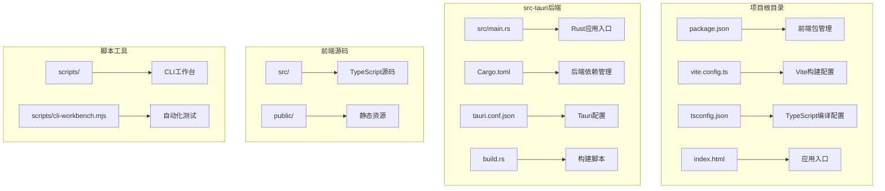
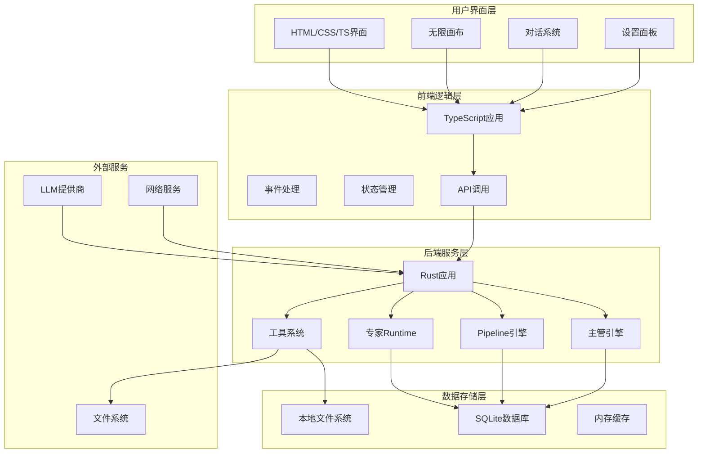
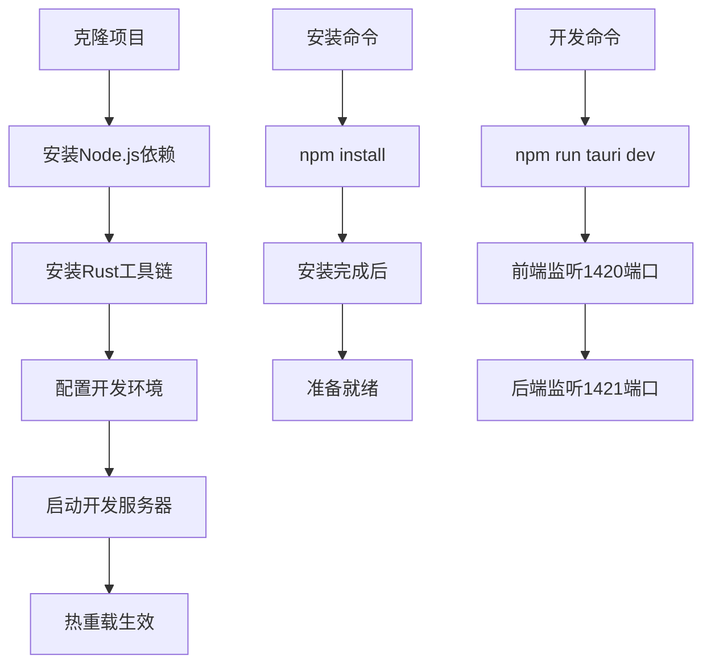
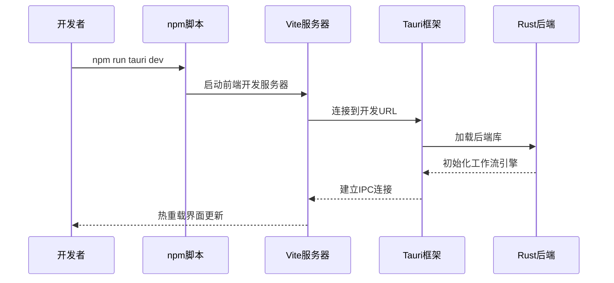
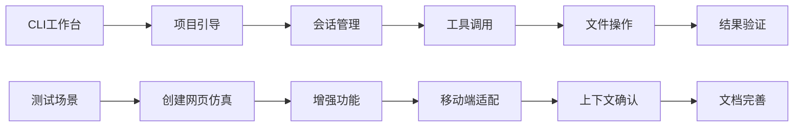
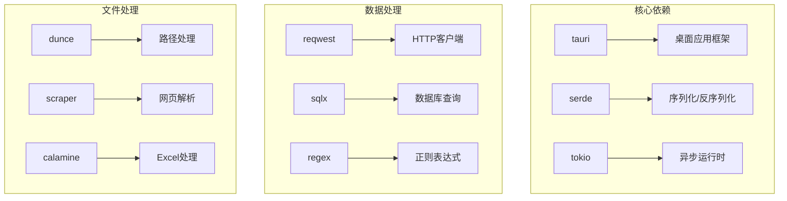

# 快速开始

<cite>
**本文引用的文件**
- [package.json](file://package.json)
- [vite.config.ts](file://vite.config.ts)
- [tsconfig.json](file://tsconfig.json)
- [src-tauri/tauri.conf.json](file://src-tauri/tauri.conf.json)
- [src-tauri/Cargo.toml](file://src-tauri/Cargo.toml)
- [src/main.ts](file://src/main.ts)
- [index.html](file://index.html)
- [README.md](file://README.md)
- [scripts/cli-workbench.mjs](file://scripts/cli-workbench.mjs)
- [src-tauri/src/main.rs](file://src-tauri/src/main.rs)
- [src-tauri/build.rs](file://src-tauri/build.rs)
</cite>

## 目录
1. [简介](#简介)
2. [项目结构](#项目结构)
3. [核心组件](#核心组件)
4. [架构概览](#架构概览)
5. [详细组件分析](#详细组件分析)
6. [依赖关系分析](#依赖关系分析)
7. [性能考虑](#性能考虑)
8. [故障排除指南](#故障排除指南)
9. [结论](#结论)
10. [附录](#附录)

## 简介
星图专家团工作台是一个创新的本地桌面级AI工作平台，集成了"AI专家团协作 + 无限可视化画布 + 智能仓库Wiki"三大核心能力。该项目采用前后端分离架构，前端使用TypeScript/Vue技术栈，后端使用Rust语言，通过Tauri框架实现跨平台桌面应用。

本快速开始指南旨在帮助开发者快速搭建开发环境、理解项目架构并掌握基本使用方法。项目支持Windows、macOS和Linux平台，提供了完整的开发工具链和构建流程。

## 项目结构
项目采用典型的Tauri桌面应用结构，主要分为前端和后端两个部分：



**图表来源**
- [package.json:1-28](file://package.json#L1-L28)
- [vite.config.ts:1-31](file://vite.config.ts#L1-L31)
- [tsconfig.json:1-24](file://tsconfig.json#L1-L24)
- [src-tauri/tauri.conf.json:1-38](file://src-tauri/tauri.conf.json#L1-L38)
- [src-tauri/Cargo.toml:1-46](file://src-tauri/Cargo.toml#L1-L46)

**章节来源**
- [package.json:1-28](file://package.json#L1-L28)
- [vite.config.ts:1-31](file://vite.config.ts#L1-L31)
- [tsconfig.json:1-24](file://tsconfig.json#L1-L24)
- [src-tauri/tauri.conf.json:1-38](file://src-tauri/tauri.conf.json#L1-L38)
- [src-tauri/Cargo.toml:1-46](file://src-tauri/Cargo.toml#L1-L46)

## 核心组件
项目的核心组件包括前端界面系统、后端工作流引擎、工具系统和配置管理等模块。

### 前端核心模块
- **无限画布引擎**：基于SVG实现的可缩放画布系统
- **对话界面**：支持多模态输入和执行模式切换
- **设置面板**：密钥池配置、专家团管理和主题设置
- **文件预览系统**：支持多种文件类型的实时预览

### 后端核心模块
- **主管引擎**：负责任务调度和专家协调
- **Pipeline引擎**：工作流编排和执行控制
- **专家Runtime**：专家会话管理和工具调用
- **工具系统**：统一的文件操作和外部服务接口

**章节来源**
- [src/main.ts:1-800](file://src/main.ts#L1-L800)
- [index.html:1-1094](file://index.html#L1-L1094)

## 架构概览
项目采用前后端分离的双栈架构，前端负责用户界面和交互，后端负责业务逻辑和数据处理。



**图表来源**
- [src/main.ts:1-800](file://src/main.ts#L1-L800)
- [src-tauri/Cargo.toml:20-46](file://src-tauri/Cargo.toml#L20-L46)
- [src-tauri/tauri.conf.json:12-25](file://src-tauri/tauri.conf.json#L12-L25)

## 详细组件分析

### 开发环境搭建

#### 系统要求
- **Node.js**: 版本18及以上
- **Rust**: 最新稳定版本
- **操作系统**: Windows 10/11、macOS 10.15+、Ubuntu 18.04+

#### 依赖安装
1. 克隆项目到本地
2. 安装Node.js依赖
3. 安装Rust工具链
4. 配置开发环境



**图表来源**
- [README.md:361-397](file://README.md#L361-L397)
- [package.json:6-14](file://package.json#L6-L14)

**章节来源**
- [README.md:361-397](file://README.md#L361-L397)
- [package.json:6-14](file://package.json#L6-L14)

### 开发环境配置

#### VS Code推荐配置
- **扩展插件**：
  - Tauri官方扩展
  - rust-analyzer
  - TypeScript导入路径插件
  - ESLint插件

#### IDE设置要点
- TypeScript编译选项优化
- Rust语言服务器配置
- Vite开发服务器端口设置
- 热重载功能启用

**章节来源**
- [README.md:399-402](file://README.md#L399-L402)
- [tsconfig.json:1-24](file://tsconfig.json#L1-L24)

### 应用启动流程

#### 开发模式启动


**图表来源**
- [src-tauri/tauri.conf.json:6-11](file://src-tauri/tauri.conf.json#L6-L11)
- [vite.config.ts:14-29](file://vite.config.ts#L14-L29)

**章节来源**
- [src-tauri/tauri.conf.json:6-11](file://src-tauri/tauri.conf.json#L6-L11)
- [vite.config.ts:14-29](file://vite.config.ts#L14-L29)

### 基本使用示例

#### 启动应用
1. 确保开发环境已配置完成
2. 在项目根目录执行开发命令
3. 浏览器自动打开应用界面

#### 访问界面
- **主界面**：包含无限画布、对话面板和侧边栏
- **设置页面**：密钥池配置和专家团管理
- **工作区设置**：项目级别的专家配置

#### 基础操作
- **创建项目**：通过文件菜单或侧边栏按钮
- **添加专家**：在设置面板中配置专家团
- **配置密钥**：设置API密钥和模型参数
- **开始对话**：在聊天面板中输入消息

**章节来源**
- [index.html:1-1094](file://index.html#L1-L1094)
- [src/main.ts:227-264](file://src/main.ts#L227-L264)

### CLI工作台工具

#### 自动化测试
项目提供了完整的CLI工作台工具，用于自动化测试和演示：



**图表来源**
- [scripts/cli-workbench.mjs:460-588](file://scripts/cli-workbench.mjs#L460-L588)

**章节来源**
- [scripts/cli-workbench.mjs:460-588](file://scripts/cli-workbench.mjs#L460-L588)

## 依赖关系分析

### 前端依赖
项目使用现代化的前端技术栈，主要依赖包括：

```mermaid
graph TB
subgraph "前端核心依赖"
A[@tauri-apps/api] --> B[桌面应用API]
C[highlight.js] --> D[语法高亮]
E[TypeScript] --> F[类型安全]
end
subgraph "构建工具"
G[Vite] --> H[开发服务器]
I[TypeScript编译器] --> J[类型检查]
end
subgraph "开发依赖"
K[@tauri-apps/cli] --> L[Tauri命令行]
M[@types/*] --> N[类型定义]
end
```

**图表来源**
- [package.json:15-26](file://package.json#L15-L26)

### 后端依赖
Rust后端提供了强大的系统级功能：



**图表来源**
- [src-tauri/Cargo.toml:20-46](file://src-tauri/Cargo.toml#L20-L46)

**章节来源**
- [package.json:15-26](file://package.json#L15-L26)
- [src-tauri/Cargo.toml:20-46](file://src-tauri/Cargo.toml#L20-L46)

## 性能考虑
项目在设计时充分考虑了性能优化：

### 前端性能优化
- **模块化打包**：使用Vite实现按需加载
- **类型安全**：TypeScript编译时检查
- **热重载**：开发时快速迭代
- **内存管理**：合理管理DOM元素和事件监听器

### 后端性能优化
- **异步处理**：Tokio运行时提高并发性能
- **零拷贝**：Rust所有权系统减少内存复制
- **缓存机制**：智能缓存提升响应速度
- **资源限制**：合理的内存和CPU使用控制

## 故障排除指南

### 常见安装问题

#### Node.js版本问题
**症状**：安装依赖时报错
**解决方法**：
1. 检查Node.js版本是否满足要求
2. 更新到最新稳定版本
3. 清理npm缓存后重新安装

#### Rust工具链问题
**症状**：编译Rust代码时报错
**解决方法**：
1. 安装最新稳定版Rust
2. 更新Cargo包索引
3. 检查网络连接以获取依赖

#### Tauri构建问题
**症状**：构建应用时报错
**解决方法**：
1. 检查系统依赖是否完整
2. 确认开发证书配置正确
3. 查看详细错误日志

### 开发环境问题

#### 端口冲突
**症状**：开发服务器无法启动
**解决方法**：
1. 检查1420端口是否被占用
2. 修改Vite配置中的端口号
3. 关闭占用端口的其他程序

#### 热重载失效
**症状**：修改代码后界面不更新
**解决方法**：
1. 检查Vite配置中的HMR设置
2. 确认host环境变量正确
3. 重启开发服务器

**章节来源**
- [vite.config.ts:14-29](file://vite.config.ts#L14-L29)
- [src-tauri/tauri.conf.json:14-21](file://src-tauri/tauri.conf.json#L14-L21)

### 调试技巧

#### 前端调试
- 使用浏览器开发者工具检查控制台日志
- 利用TypeScript的类型检查功能
- 通过网络面板监控API调用

#### 后端调试
- 使用Rust的调试符号和断点
- 通过日志系统追踪执行流程
- 利用单元测试验证功能正确性

## 结论
星图专家团工作台提供了一个功能完整、架构清晰的AI工作平台。通过本快速开始指南，开发者可以快速搭建开发环境、理解项目架构并掌握基本使用方法。

项目的主要优势包括：
- **纯本地运行**：确保数据隐私和安全性
- **多场景覆盖**：支持编程、写作、数据分析等多种工作场景
- **专家团协作**：模拟真实团队协作模式
- **可视化设计**：无限画布提供直观的设计体验
- **开源生态**：MIT/GPL双重许可证模式

建议开发者深入学习后端Rust代码和前端TypeScript实现，以充分利用项目的技术优势并进行二次开发。

## 附录

### 快速命令参考
```bash
# 安装依赖
npm install

# 开发模式
npm run tauri dev

# 生产构建
npm run tauri build

# 前端构建
npm run build

# 预览构建
npm run preview

# CLI测试
npm run cli:test

# 恢复测试基线
npm run restore:test-baseline
```

### 配置文件说明
- **package.json**: 项目配置和脚本定义
- **vite.config.ts**: Vite开发服务器配置
- **tsconfig.json**: TypeScript编译配置
- **tauri.conf.json**: Tauri应用配置
- **Cargo.toml**: Rust后端依赖配置

### 支持的平台
- **Windows**: x64架构
- **macOS**: Intel和Apple Silicon芯片
- **Linux**: 多种发行版